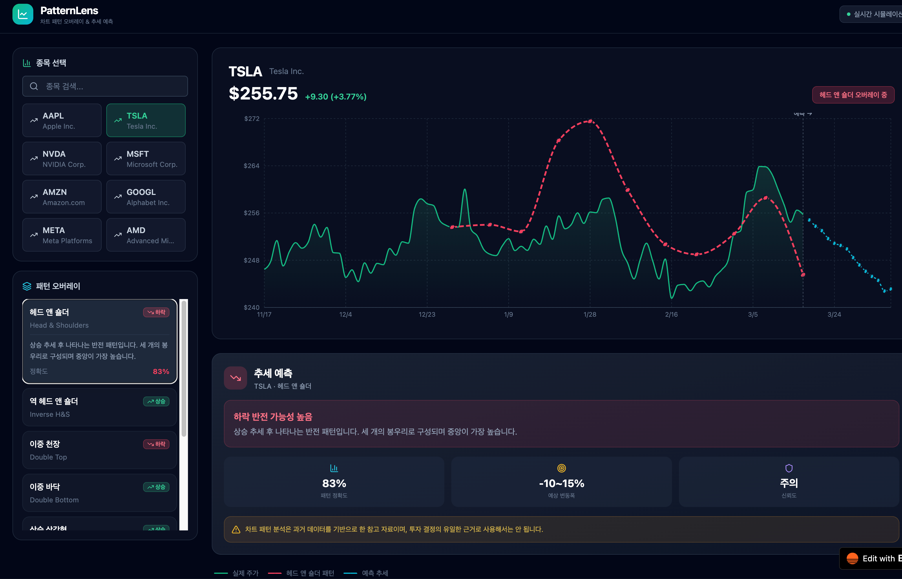

## 아래는 다른 자동화 도구로 생성한 차팅 서비스의 리소스 파일들이야. 이를 참고해서 현재 서비스에 유사하게 적용해 줘.

### /components/chart/generateStockData.jsx
```
// Generate realistic-looking stock price data
export function generateStockData(symbol, days = 120) {
  const basePrice = getBasePrice(symbol);
  const volatility = getVolatility(symbol);
  const data = [];
  let price = basePrice;
  const now = new Date();

  for (let i = days; i >= 0; i--) {
    const date = new Date(now);
    date.setDate(date.getDate() - i);
    if (date.getDay() === 0 || date.getDay() === 6) continue;

    const change = (Math.random() - 0.48) * volatility * price;
    price = Math.max(price + change, price * 0.5);

    const high = price + Math.random() * volatility * price * 0.5;
    const low = price - Math.random() * volatility * price * 0.5;
    const open = low + Math.random() * (high - low);
    const close = low + Math.random() * (high - low);
    const volume = Math.floor(Math.random() * 50000000) + 10000000;

    data.push({
      date: date.toISOString().split('T')[0],
      dateLabel: `${date.getMonth() + 1}/${date.getDate()}`,
      open: +open.toFixed(2),
      high: +high.toFixed(2),
      low: +low.toFixed(2),
      close: +close.toFixed(2),
      volume,
      price: +close.toFixed(2),
    });
  }

  return data;
}

function getBasePrice(symbol) {
  const prices = {
    AAPL: 178, TSLA: 245, NVDA: 880, MSFT: 415,
    AMZN: 178, GOOGL: 152, META: 505, AMD: 165,
  };
  return prices[symbol] || 100;
}

function getVolatility(symbol) {
  const vols = {
    AAPL: 0.015, TSLA: 0.03, NVDA: 0.025, MSFT: 0.012,
    AMZN: 0.018, GOOGL: 0.014, META: 0.02, AMD: 0.025,
  };
  return vols[symbol] || 0.02;
}

/**
 * Pattern overlay that closely follows the actual stock price.
 * Strategy:
 * 1. Pick the overlay segment (last 60% of data).
 * 2. For each pattern control point, find the actual close price at that index.
 * 3. Add a small relative offset (±%) that shapes the pattern, so it hugs the real line.
 */
export function generatePatternOverlay(patternId, stockData) {
  if (!stockData || stockData.length === 0) return [];

  const len = stockData.length;
  const startIdx = Math.floor(len * 0.35);
  const endIdx = len - 1;
  const segLen = endIdx - startIdx;

  // Pattern shapes: [t, offset_ratio]
  // t = position along segment [0..1]
  // offset_ratio = multiplier added to actual close price at that point (e.g. 0.03 = +3%)
  const shapes = {
    head_shoulders: [
      [0, 0], [0.1, 0.02], [0.2, 0.01], [0.3, 0.05], [0.4, 0.06],
      [0.5, 0.05], [0.6, 0.01], [0.7, 0.02], [0.8, 0], [0.9, -0.02], [1, -0.04]
    ],
    inv_head_shoulders: [
      [0, 0], [0.1, -0.02], [0.2, -0.01], [0.3, -0.05], [0.4, -0.06],
      [0.5, -0.05], [0.6, -0.01], [0.7, -0.02], [0.8, 0], [0.9, 0.02], [1, 0.04]
    ],
    double_top: [
      [0, 0], [0.15, 0.04], [0.25, 0.055], [0.35, 0.02], [0.5, 0.04],
      [0.6, 0.055], [0.72, 0.02], [0.85, -0.01], [1, -0.04]
    ],
    double_bottom: [
      [0, 0], [0.15, -0.04], [0.25, -0.055], [0.35, -0.02], [0.5, -0.04],
      [0.6, -0.055], [0.72, -0.02], [0.85, 0.01], [1, 0.04]
    ],
    ascending_triangle: [
      [0, -0.02], [0.12, 0.04], [0.24, -0.01], [0.36, 0.04], [0.48, 0.01],
      [0.6, 0.04], [0.72, 0.02], [0.84, 0.04], [1, 0.05]
    ],
    descending_triangle: [
      [0, 0.02], [0.12, -0.04], [0.24, 0.01], [0.36, -0.04], [0.48, -0.01],
      [0.6, -0.04], [0.72, -0.02], [0.84, -0.04], [1, -0.05]
    ],
    cup_handle: [
      [0, 0.02], [0.12, 0], [0.22, -0.025], [0.35, -0.045], [0.48, -0.025],
      [0.58, 0], [0.68, 0.02], [0.75, 0.01], [0.83, 0.02], [1, 0.045]
    ],
    wedge_falling: [
      [0, 0.04], [0.12, 0.015], [0.22, 0.035], [0.34, 0.005], [0.46, 0.025],
      [0.58, -0.005], [0.7, 0.015], [0.82, -0.01], [1, 0.04]
    ],
  };

  const shape = shapes[patternId];
  if (!shape) return [];

  const patternPoints = [];

  for (const [t, offsetRatio] of shape) {
    const idx = Math.min(startIdx + Math.round(t * segLen), len - 1);
    const actualClose = stockData[idx].close;
    // Pattern value = actual price + small relative offset to show the shape
    const patternValue = +(actualClose * (1 + offsetRatio)).toFixed(2);

    patternPoints.push({
      date: stockData[idx].date,
      pattern: patternValue,
    });
  }

  return patternPoints;
}

// Generate future prediction data continuing from last price
export function generatePredictionData(stockData, pattern) {
  if (!stockData || !pattern) return [];

  const lastData = stockData[stockData.length - 1];
  const lastPrice = lastData.close;
  const isBullish = pattern.type === 'bullish';
  const predictions = [];
  let price = lastPrice;

  for (let i = 1; i <= 20; i++) {
    const date = new Date(lastData.date);
    date.setDate(date.getDate() + i);
    if (date.getDay() === 0 || date.getDay() === 6) continue;

    const trend = isBullish ? 0.003 : -0.003;
    const noise = (Math.random() - 0.5) * 0.01;
    price = price * (1 + trend + noise);

    predictions.push({
      date: date.toISOString().split('T')[0],
      dateLabel: `${date.getMonth() + 1}/${date.getDate()}`,
      prediction: +price.toFixed(2),
    });
  }

  return predictions;
}
```

### /components/chart/PatternSelector.jsx
```
import React from 'react';
import { Badge } from "@/components/ui/badge";
import { TrendingUp, TrendingDown, Minus } from "lucide-react";

export const PATTERNS = [
  {
    id: 'head_shoulders',
    name: '헤드 앤 숄더',
    nameEn: 'Head & Shoulders',
    type: 'bearish',
    description: '상승 추세 후 나타나는 반전 패턴입니다. 세 개의 봉우리로 구성되며 중앙이 가장 높습니다.',
    prediction: '하락 반전 가능성 높음',
    accuracy: 83,
    color: '#f43f5e',
  },
  {
    id: 'inv_head_shoulders',
    name: '역 헤드 앤 숄더',
    nameEn: 'Inverse H&S',
    type: 'bullish',
    description: '하락 추세 후 나타나는 반전 패턴입니다. 세 개의 저점으로 구성되며 중앙이 가장 낮습니다.',
    prediction: '상승 반전 가능성 높음',
    accuracy: 81,
    color: '#10b981',
  },
  {
    id: 'double_top',
    name: '이중 천장',
    nameEn: 'Double Top',
    type: 'bearish',
    description: '비슷한 높이의 두 봉우리가 형성되는 패턴입니다. M자 형태를 보입니다.',
    prediction: '하락 전환 신호',
    accuracy: 75,
    color: '#f43f5e',
  },
  {
    id: 'double_bottom',
    name: '이중 바닥',
    nameEn: 'Double Bottom',
    type: 'bullish',
    description: '비슷한 깊이의 두 저점이 형성되는 패턴입니다. W자 형태를 보입니다.',
    prediction: '상승 전환 신호',
    accuracy: 78,
    color: '#10b981',
  },
  {
    id: 'ascending_triangle',
    name: '상승 삼각형',
    nameEn: 'Ascending Triangle',
    type: 'bullish',
    description: '저점은 점점 높아지고 고점은 수평인 삼각형 패턴입니다.',
    prediction: '상방 돌파 가능성',
    accuracy: 72,
    color: '#10b981',
  },
  {
    id: 'descending_triangle',
    name: '하락 삼각형',
    nameEn: 'Descending Triangle',
    type: 'bearish',
    description: '고점은 점점 낮아지고 저점은 수평인 삼각형 패턴입니다.',
    prediction: '하방 돌파 가능성',
    accuracy: 70,
    color: '#f43f5e',
  },
  {
    id: 'cup_handle',
    name: '컵 앤 핸들',
    nameEn: 'Cup & Handle',
    type: 'bullish',
    description: 'U자형 컵 모양과 작은 하락 핸들로 구성된 강력한 상승 패턴입니다.',
    prediction: '강한 상승 돌파 예상',
    accuracy: 79,
    color: '#10b981',
  },
  {
    id: 'wedge_falling',
    name: '하락 쐐기형',
    nameEn: 'Falling Wedge',
    type: 'bullish',
    description: '고점과 저점이 모두 하락하지만 수렴하는 패턴으로, 상승 반전을 예고합니다.',
    prediction: '상승 반전 기대',
    accuracy: 68,
    color: '#10b981',
  },
];

export default function PatternSelector({ selectedPattern, onSelect }) {
  return (
    <div className="space-y-2 max-h-[400px] overflow-y-auto pr-1">
      {PATTERNS.map((pattern) => {
        const isSelected = selectedPattern?.id === pattern.id;
        const Icon = pattern.type === 'bullish' ? TrendingUp : pattern.type === 'bearish' ? TrendingDown : Minus;
        
        return (
          <button
            key={pattern.id}
            onClick={() => onSelect(isSelected ? null : pattern)}
            className={`w-full text-left px-3 py-3 rounded-xl transition-all duration-200 border ${
              isSelected
                ? 'bg-slate-800 border-slate-600 shadow-lg'
                : 'bg-slate-800/30 border-slate-700/30 hover:bg-slate-800/60 hover:border-slate-600/50'
            }`}
          >
            <div className="flex items-center justify-between mb-1">
              <span className="font-semibold text-sm text-white">{pattern.name}</span>
              <Badge
                className={`text-[10px] px-1.5 py-0 ${
                  pattern.type === 'bullish'
                    ? 'bg-emerald-500/20 text-emerald-400 border-emerald-500/30'
                    : 'bg-rose-500/20 text-rose-400 border-rose-500/30'
                }`}
                variant="outline"
              >
                <Icon className="w-3 h-3 mr-0.5" />
                {pattern.type === 'bullish' ? '상승' : '하락'}
              </Badge>
            </div>
            <p className="text-xs text-slate-500">{pattern.nameEn}</p>
            {isSelected && (
              <div className="mt-2 pt-2 border-t border-slate-700/50">
                <p className="text-xs text-slate-400 leading-relaxed">{pattern.description}</p>
                <div className="flex items-center justify-between mt-2">
                  <span className="text-xs text-slate-500">정확도</span>
                  <span className="text-xs font-bold" style={{ color: pattern.color }}>{pattern.accuracy}%</span>
                </div>
              </div>
            )}
          </button>
        );
      })}
    </div>
  );
}
```

### /components/chart/PredictionPanel.jsx
```
import React from 'react';
import { TrendingUp, TrendingDown, AlertTriangle, BarChart3, Target, Shield } from "lucide-react";

export default function PredictionPanel({ pattern, stock }) {
  if (!pattern || !stock) return null;

  const isBullish = pattern.type === 'bullish';

  return (
    <div className="rounded-2xl border border-slate-700/50 bg-gradient-to-br from-slate-800/80 to-slate-900/80 backdrop-blur-sm p-5">
      <div className="flex items-center gap-3 mb-4">
        <div className={`w-10 h-10 rounded-xl flex items-center justify-center ${isBullish ? 'bg-emerald-500/20' : 'bg-rose-500/20'}`}>
          {isBullish
            ? <TrendingUp className="w-5 h-5 text-emerald-400" />
            : <TrendingDown className="w-5 h-5 text-rose-400" />
          }
        </div>
        <div>
          <h3 className="font-bold text-white text-lg">추세 예측</h3>
          <p className="text-xs text-slate-400">{stock.symbol} · {pattern.name}</p>
        </div>
      </div>

      <div className={`rounded-xl p-4 mb-4 ${isBullish ? 'bg-emerald-500/10 border border-emerald-500/20' : 'bg-rose-500/10 border border-rose-500/20'}`}>
        <p className={`font-bold text-base ${isBullish ? 'text-emerald-400' : 'text-rose-400'}`}>
          {pattern.prediction}
        </p>
        <p className="text-sm text-slate-400 mt-1">{pattern.description}</p>
      </div>

      <div className="grid grid-cols-3 gap-3 mb-4">
        <div className="bg-slate-800/60 rounded-xl p-3 text-center">
          <BarChart3 className="w-4 h-4 mx-auto mb-1 text-cyan-400" />
          <p className="text-lg font-bold text-white">{pattern.accuracy}%</p>
          <p className="text-[10px] text-slate-500">패턴 정확도</p>
        </div>
        <div className="bg-slate-800/60 rounded-xl p-3 text-center">
          <Target className="w-4 h-4 mx-auto mb-1 text-amber-400" />
          <p className="text-lg font-bold text-white">{isBullish ? '+12~18%' : '-10~15%'}</p>
          <p className="text-[10px] text-slate-500">예상 변동폭</p>
        </div>
        <div className="bg-slate-800/60 rounded-xl p-3 text-center">
          <Shield className="w-4 h-4 mx-auto mb-1 text-violet-400" />
          <p className="text-lg font-bold text-white">{isBullish ? '높음' : '주의'}</p>
          <p className="text-[10px] text-slate-500">신뢰도</p>
        </div>
      </div>

      <div className="flex items-start gap-2 bg-amber-500/10 rounded-xl p-3 border border-amber-500/20">
        <AlertTriangle className="w-4 h-4 text-amber-400 flex-shrink-0 mt-0.5" />
        <p className="text-xs text-amber-300/80 leading-relaxed">
          차트 패턴 분석은 과거 데이터를 기반으로 한 참고 자료이며, 투자 결정의 유일한 근거로 사용해서는 안 됩니다.
        </p>
      </div>
    </div>
  );
}
```

### /components/chart/StockChart.jsx
```
import React, { useMemo, useRef } from 'react';
import {
  ComposedChart, Area, Line, XAxis, YAxis, Tooltip, ResponsiveContainer,
  CartesianGrid, ReferenceLine
} from 'recharts';
import { generateStockData, generatePatternOverlay, generatePredictionData } from './generateStockData';

const CustomTooltip = ({ active, payload, label }) => {
  if (!active || !payload?.length) return null;
  return (
    <div className="bg-slate-900/95 backdrop-blur-md border border-slate-700 rounded-xl px-4 py-3 shadow-2xl">
      <p className="text-xs text-slate-400 mb-1.5">{label}</p>
      {payload.map((entry, idx) => (
        <div key={idx} className="flex items-center gap-2">
          <div className="w-2 h-2 rounded-full" style={{ backgroundColor: entry.color }} />
          <span className="text-xs text-slate-400">{entry.name}:</span>
          <span className="text-sm font-bold text-white">${entry.value?.toFixed(2)}</span>
        </div>
      ))}
    </div>
  );
};

export default function StockChart({ stock, pattern }) {
  const stockCache = useRef({});
  const stockData = useMemo(() => {
    if (!stock) return [];
    if (!stockCache.current[stock.symbol]) {
      stockCache.current[stock.symbol] = generateStockData(stock.symbol, 120);
    }
    return stockCache.current[stock.symbol];
  }, [stock?.symbol]);

  const patternOverlay = useMemo(() => {
    if (!pattern || !stockData.length) return [];
    return generatePatternOverlay(pattern.id, stockData);
  }, [pattern?.id, stockData]);

  const predictionData = useMemo(() => {
    if (!pattern || !stockData.length) return [];
    return generatePredictionData(stockData, pattern);
  }, [pattern?.id, stockData]);

  // Merge all data
  const chartData = useMemo(() => {
    if (!stockData.length) return [];

    const dateMap = {};
    stockData.forEach(d => {
      dateMap[d.date] = { ...d };
    });

    patternOverlay.forEach(d => {
      if (dateMap[d.date]) {
        dateMap[d.date].pattern = d.pattern;
      }
    });

    predictionData.forEach(d => {
      dateMap[d.date] = { ...dateMap[d.date], date: d.date, dateLabel: d.dateLabel, prediction: d.prediction };
    });

    return Object.values(dateMap).sort((a, b) => a.date.localeCompare(b.date));
  }, [stockData, patternOverlay, predictionData]);

  if (!stock) {
    return (
      <div className="flex items-center justify-center h-full">
        <div className="text-center">
          <div className="w-20 h-20 rounded-2xl bg-slate-800/50 flex items-center justify-center mx-auto mb-4">
            <svg width="40" height="40" viewBox="0 0 40 40" className="text-slate-600">
              <polyline points="5,30 12,20 20,25 28,10 35,15" fill="none" stroke="currentColor" strokeWidth="2.5" strokeLinecap="round" strokeLinejoin="round" />
            </svg>
          </div>
          <p className="text-slate-400 font-medium">종목을 선택해주세요</p>
          <p className="text-slate-600 text-sm mt-1">차트와 패턴 분석을 확인할 수 있습니다</p>
        </div>
      </div>
    );
  }

  const lastPrice = stockData[stockData.length - 1]?.close;
  const firstPrice = stockData[0]?.close;
  const priceChange = lastPrice - firstPrice;
  const priceChangePercent = ((priceChange / firstPrice) * 100).toFixed(2);
  const isPositive = priceChange >= 0;
  const lastDate = stockData.length > 0 ? stockData[stockData.length - 1].date : '';

  return (
    <div className="h-full flex flex-col">
      {/* Header */}
      <div className="flex items-end justify-between mb-4 px-1">
        <div>
          <div className="flex items-center gap-3">
            <h2 className="text-2xl font-bold text-white tracking-tight">{stock.symbol}</h2>
            <span className="text-sm text-slate-500">{stock.name}</span>
          </div>
          <div className="flex items-baseline gap-3 mt-1">
            <span className="text-3xl font-bold text-white">${lastPrice?.toFixed(2)}</span>
            <span className={`text-sm font-semibold ${isPositive ? 'text-emerald-400' : 'text-rose-400'}`}>
              {isPositive ? '+' : ''}{priceChange.toFixed(2)} ({isPositive ? '+' : ''}{priceChangePercent}%)
            </span>
          </div>
        </div>
        {pattern && (
          <div className={`px-3 py-1.5 rounded-lg text-xs font-semibold ${
            pattern.type === 'bullish'
              ? 'bg-emerald-500/20 text-emerald-400 border border-emerald-500/30'
              : 'bg-rose-500/20 text-rose-400 border border-rose-500/30'
          }`}>
            {pattern.name} 오버레이 중
          </div>
        )}
      </div>

      {/* Chart */}
      <div className="flex-1 min-h-0">
        <ResponsiveContainer width="100%" height="100%">
          <ComposedChart data={chartData} margin={{ top: 10, right: 10, bottom: 0, left: 0 }}>
            <defs>
              <linearGradient id="priceGradient" x1="0" y1="0" x2="0" y2="1">
                <stop offset="0%" stopColor={isPositive ? '#10b981' : '#f43f5e'} stopOpacity={0.3} />
                <stop offset="100%" stopColor={isPositive ? '#10b981' : '#f43f5e'} stopOpacity={0} />
              </linearGradient>
              <linearGradient id="predictionGradient" x1="0" y1="0" x2="0" y2="1">
                <stop offset="0%" stopColor="#06b6d4" stopOpacity={0.2} />
                <stop offset="100%" stopColor="#06b6d4" stopOpacity={0} />
              </linearGradient>
            </defs>
            <CartesianGrid strokeDasharray="3 3" stroke="#1e293b" />
            <XAxis
              dataKey="dateLabel"
              tick={{ fill: '#64748b', fontSize: 11 }}
              axisLine={{ stroke: '#334155' }}
              tickLine={false}
              interval={Math.floor(chartData.length / 8)}
            />
            <YAxis
              tick={{ fill: '#64748b', fontSize: 11 }}
              axisLine={false}
              tickLine={false}
              domain={['auto', 'auto']}
              tickFormatter={(v) => `$${v}`}
              width={65}
            />
            <Tooltip content={<CustomTooltip />} />

            {/* Price area */}
            <Area
              type="monotone"
              dataKey="price"
              stroke={isPositive ? '#10b981' : '#f43f5e'}
              strokeWidth={2}
              fill="url(#priceGradient)"
              name="주가"
              dot={false}
              connectNulls={false}
            />

            {/* Pattern overlay */}
            {pattern && (
              <Line
                type="monotone"
                dataKey="pattern"
                stroke={pattern.color}
                strokeWidth={3}
                strokeDasharray="8 4"
                dot={{ fill: pattern.color, r: 4, strokeWidth: 2, stroke: '#0f172a' }}
                name="패턴"
                connectNulls
              />
            )}

            {/* Prediction */}
            {pattern && (
              <Line
                type="monotone"
                dataKey="prediction"
                stroke="#06b6d4"
                strokeWidth={2}
                strokeDasharray="4 4"
                dot={{ fill: '#06b6d4', r: 3, strokeWidth: 2, stroke: '#0f172a' }}
                name="예측"
                connectNulls
              />
            )}

            {/* Divider for prediction zone */}
            {pattern && lastDate && (
              <ReferenceLine
                x={stockData[stockData.length - 1]?.dateLabel}
                stroke="#475569"
                strokeDasharray="3 3"
                label={{ value: '예측 →', fill: '#94a3b8', fontSize: 11, position: 'top' }}
              />
            )}
          </ComposedChart>
        </ResponsiveContainer>
      </div>
    </div>
  );
}
```

### /components/chart/StockSearch.jsx
```
import React, { useState } from 'react';
import { Input } from "@/components/ui/input";
import { Button } from "@/components/ui/button";
import { Search, TrendingUp } from "lucide-react";

const POPULAR_STOCKS = [
  { symbol: 'AAPL', name: 'Apple Inc.' },
  { symbol: 'TSLA', name: 'Tesla Inc.' },
  { symbol: 'NVDA', name: 'NVIDIA Corp.' },
  { symbol: 'MSFT', name: 'Microsoft Corp.' },
  { symbol: 'AMZN', name: 'Amazon.com' },
  { symbol: 'GOOGL', name: 'Alphabet Inc.' },
  { symbol: 'META', name: 'Meta Platforms' },
  { symbol: 'AMD', name: 'Advanced Micro Devices' },
];

export default function StockSearch({ onSelect, selectedSymbol }) {
  const [query, setQuery] = useState('');
  
  const filtered = query
    ? POPULAR_STOCKS.filter(s => 
        s.symbol.toLowerCase().includes(query.toLowerCase()) || 
        s.name.toLowerCase().includes(query.toLowerCase())
      )
    : POPULAR_STOCKS;

  return (
    <div className="space-y-3">
      <div className="relative">
        <Search className="absolute left-3 top-1/2 -translate-y-1/2 w-4 h-4 text-slate-400" />
        <Input
          placeholder="종목 검색..."
          value={query}
          onChange={(e) => setQuery(e.target.value)}
          className="pl-10 bg-slate-800/50 border-slate-700 text-white placeholder:text-slate-500 focus:border-emerald-500 focus:ring-emerald-500/20"
        />
      </div>
      <div className="grid grid-cols-2 gap-2 max-h-[280px] overflow-y-auto pr-1">
        {filtered.map((stock) => (
          <button
            key={stock.symbol}
            onClick={() => onSelect(stock)}
            className={`flex items-center gap-2 px-3 py-2.5 rounded-lg text-left transition-all duration-200 ${
              selectedSymbol === stock.symbol
                ? 'bg-emerald-500/20 border border-emerald-500/50 text-emerald-400'
                : 'bg-slate-800/40 border border-slate-700/50 text-slate-300 hover:bg-slate-700/50 hover:border-slate-600'
            }`}
          >
            <TrendingUp className="w-3.5 h-3.5 flex-shrink-0" />
            <div className="min-w-0">
              <p className="font-semibold text-sm truncate">{stock.symbol}</p>
              <p className="text-xs text-slate-500 truncate">{stock.name}</p>
            </div>
          </button>
        ))}
      </div>
    </div>
  );
}
```

### src/pages/Home.jsx
```
import React, { useState } from 'react';
import { BarChart3, Layers, LineChart } from 'lucide-react';
import StockSearch from '../components/chart/StockSearch';
import PatternSelector from '../components/chart/PatternSelector';
import StockChart from '../components/chart/StockChart';
import PredictionPanel from '../components/chart/PredictionPanel';

export default function Home() {
  const [selectedStock, setSelectedStock] = useState(null);
  const [selectedPattern, setSelectedPattern] = useState(null);
  const [activeTab, setActiveTab] = useState('stocks');

  return (
    <div className="min-h-screen bg-slate-950 text-white">
      {/* Top bar */}
      <header className="border-b border-slate-800/80 bg-slate-950/90 backdrop-blur-xl sticky top-0 z-50">
        <div className="max-w-[1600px] mx-auto px-4 sm:px-6 py-3 flex items-center justify-between">
          <div className="flex items-center gap-3">
            <div className="w-9 h-9 rounded-xl bg-gradient-to-br from-emerald-500 to-cyan-500 flex items-center justify-center">
              <LineChart className="w-5 h-5 text-white" />
            </div>
            <div>
              <h1 className="font-bold text-lg tracking-tight">PatternLens</h1>
              <p className="text-[10px] text-slate-500 -mt-0.5">차트 패턴 오버레이 & 추세 예측</p>
            </div>
          </div>
          <div className="flex items-center gap-2 text-xs">
            <div className="hidden sm:flex items-center gap-1.5 px-3 py-1.5 rounded-lg bg-slate-800/60 border border-slate-700/50">
              <div className="w-1.5 h-1.5 rounded-full bg-emerald-400 animate-pulse" />
              <span className="text-slate-400">실시간 시뮬레이션</span>
            </div>
          </div>
        </div>
      </header>

      <div className="max-w-[1600px] mx-auto px-4 sm:px-6 py-4 sm:py-6">
        <div className="flex flex-col lg:flex-row gap-4 sm:gap-6">
          {/* Sidebar */}
          <div className="w-full lg:w-80 flex-shrink-0">
            {/* Mobile tabs */}
            <div className="flex lg:hidden gap-2 mb-4">
              <button
                onClick={() => setActiveTab('stocks')}
                className={`flex-1 flex items-center justify-center gap-2 py-2.5 rounded-xl text-sm font-medium transition-all ${
                  activeTab === 'stocks'
                    ? 'bg-slate-800 text-white border border-slate-700'
                    : 'bg-slate-800/30 text-slate-500 border border-slate-800'
                }`}
              >
                <BarChart3 className="w-4 h-4" />
                종목
              </button>
              <button
                onClick={() => setActiveTab('patterns')}
                className={`flex-1 flex items-center justify-center gap-2 py-2.5 rounded-xl text-sm font-medium transition-all ${
                  activeTab === 'patterns'
                    ? 'bg-slate-800 text-white border border-slate-700'
                    : 'bg-slate-800/30 text-slate-500 border border-slate-800'
                }`}
              >
                <Layers className="w-4 h-4" />
                패턴
              </button>
            </div>

            <div className="space-y-4">
              {/* Stock Search */}
              <div className={`${activeTab !== 'stocks' ? 'hidden lg:block' : ''}`}>
                <div className="rounded-2xl border border-slate-800 bg-slate-900/50 p-4">
                  <h2 className="text-sm font-semibold text-slate-300 mb-3 flex items-center gap-2">
                    <BarChart3 className="w-4 h-4 text-emerald-400" />
                    종목 선택
                  </h2>
                  <StockSearch
                    onSelect={(stock) => {
                      setSelectedStock(stock);
                      setActiveTab('patterns');
                    }}
                    selectedSymbol={selectedStock?.symbol}
                  />
                </div>
              </div>

              {/* Pattern Selector */}
              <div className={`${activeTab !== 'patterns' ? 'hidden lg:block' : ''}`}>
                <div className="rounded-2xl border border-slate-800 bg-slate-900/50 p-4">
                  <h2 className="text-sm font-semibold text-slate-300 mb-3 flex items-center gap-2">
                    <Layers className="w-4 h-4 text-cyan-400" />
                    패턴 오버레이
                  </h2>
                  <PatternSelector
                    selectedPattern={selectedPattern}
                    onSelect={setSelectedPattern}
                  />
                </div>
              </div>
            </div>
          </div>

          {/* Main content */}
          <div className="flex-1 min-w-0 space-y-4 sm:space-y-6">
            {/* Chart */}
            <div
              className="rounded-2xl border border-slate-800 bg-slate-900/50 p-4 sm:p-6"
              style={{ height: 'clamp(350px, 50vh, 520px)' }}
            >
              <StockChart stock={selectedStock} pattern={selectedPattern} />
            </div>

            {/* Prediction */}
            {selectedPattern && selectedStock && (
              <PredictionPanel pattern={selectedPattern} stock={selectedStock} />
            )}

            {/* Legend */}
            {selectedStock && (
              <div className="flex flex-wrap gap-4 px-1">
                <div className="flex items-center gap-2">
                  <div className="w-6 h-0.5 bg-emerald-500 rounded" />
                  <span className="text-xs text-slate-500">실제 주가</span>
                </div>
                {selectedPattern && (
                  <>
                    <div className="flex items-center gap-2">
                      <div className="w-6 h-0.5 rounded" style={{ borderTop: `2px dashed ${selectedPattern.color}` }} />
                      <span className="text-xs text-slate-500">{selectedPattern.name} 패턴</span>
                    </div>
                    <div className="flex items-center gap-2">
                      <div className="w-6 h-0.5 rounded" style={{ borderTop: '2px dashed #06b6d4' }} />
                      <span className="text-xs text-slate-500">예측 추세</span>
                    </div>
                  </>
                )}
              </div>
            )}
          </div>
        </div>
      </div>
    </div>
  );
}
```
### src/App.jsx
```
import { Toaster } from "@/components/ui/toaster"
import { QueryClientProvider } from '@tanstack/react-query'
import { queryClientInstance } from '@/lib/query-client'
import { BrowserRouter as Router, Route, Routes } from 'react-router-dom';
import PageNotFound from './lib/PageNotFound';
import { AuthProvider, useAuth } from '@/lib/AuthContext';
import UserNotRegisteredError from '@/components/UserNotRegisteredError';
import Home from './pages/Home';
import { Navigate } from 'react-router-dom';
// Add page imports here

const AuthenticatedApp = () => {
  const { isLoadingAuth, isLoadingPublicSettings, authError, navigateToLogin } = useAuth();

  // Show loading spinner while checking app public settings or auth
  if (isLoadingPublicSettings || isLoadingAuth) {
    return (
      <div className="fixed inset-0 flex items-center justify-center">
        <div className="w-8 h-8 border-4 border-slate-200 border-t-slate-800 rounded-full animate-spin"></div>
      </div>
    );
  }

  // Handle authentication errors
  if (authError) {
    if (authError.type === 'user_not_registered') {
      return <UserNotRegisteredError />;
    } else if (authError.type === 'auth_required') {
      // Redirect to login automatically
      navigateToLogin();
      return null;
    }
  }

  // Render the main app
  return (
    <Routes>
      <Route path="/" element={<Navigate to="/Home" replace />} />
      <Route path="/Home" element={<Home />} />
      <Route path="*" element={<PageNotFound />} />
    </Routes>
  );
};


function App() {

  return (
    <AuthProvider>
      <QueryClientProvider client={queryClientInstance}>
        <Router>
          <AuthenticatedApp />
        </Router>
        <Toaster />
      </QueryClientProvider>
    </AuthProvider>
  )
}

export default App
```

### 화면 캡처 이미지
