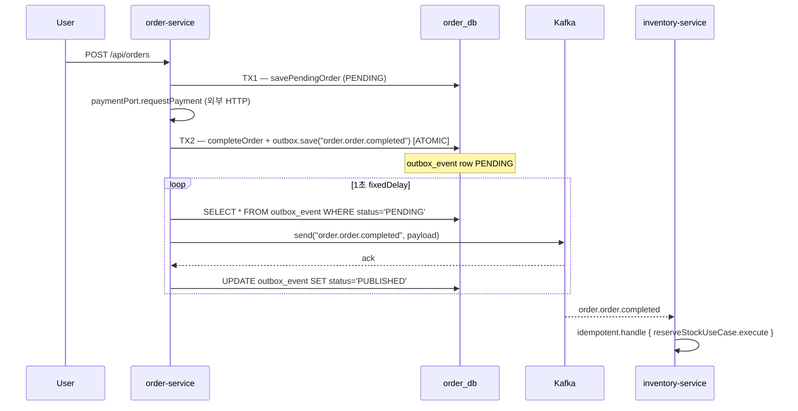
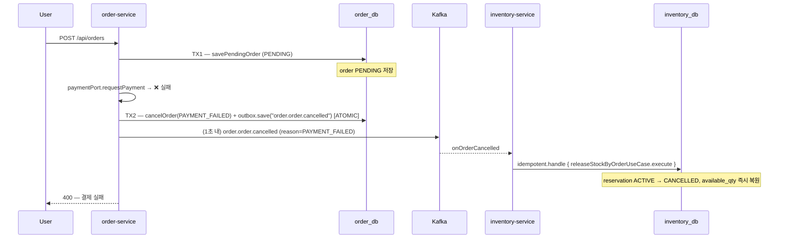
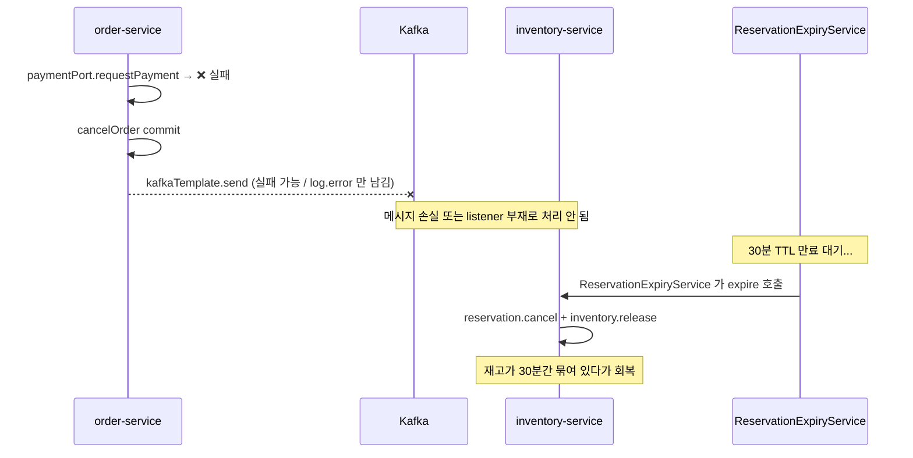
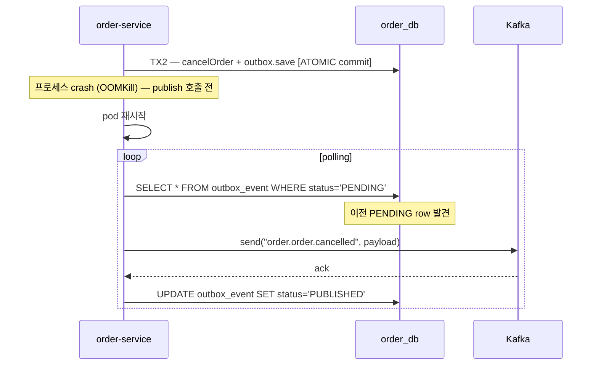

# ADR-0032 Order Outbox 도입 + Cancellation 보상 트랜잭션

## Status

Accepted (2026-05-02)

**Date**: 2026-05-02
**Authors**: TBD
**Related**:
- **ADR-0011** (Inventory + Fulfillment Service) — 본 ADR 은 ADR-0011 의 **보강 (refinement)** 이다. ADR-0011 §2 "Outbox 패턴으로 이벤트 발행의 원자성 보장" 결정에서 Order 만 빠져 있고, ADR-0011 §4 "보상 트랜잭션은 각 서비스가 자체 처리" 가 cancellation 경로에서 누락된 상태를 채운다. **ADR-0011 의 결정을 뒤집는 항목 없음 → supersede 가 아닌 implementation refinement**.
- **ADR-0012** (Idempotent Consumer Pattern) — 신규 cancellation consumer 가 동일 멱등 규약 준수
- **ADR-0015** (Resilience Strategy) — 보상 흐름의 retry/DLQ/CircuitBreaker 결합
- **ADR-0029** (Idempotent Consumer Helper 표준화) — Order Outbox publisher 와 신규 cancellation consumer 가 ADR-0029 의 helper 패턴을 그대로 사용

**Supersedes / Extends**: ADR-0011 보강 (Order 도메인 한정).

---

## Context

### 1. 발견 배경 — `study/docs/00-VERIFICATION-REPORT.md` (2026-05-01)

Phase 3 deep study (`study/docs/7-distributed-systems/`, `study/docs/5-spring-transactional/`) 의 grounding 검증 도중 **2 개의 P0 갭** 이 동시에 발견됐다 (verification report §2 표 #5, #18).

| # | 항목 | 검증 위치 | 결론 |
|---|---|---|---|
| 5 | Order Outbox 부재 | `order/app/.../OrderEventAdapter.kt:14-54` | ADR-0011 §2 위반 — Order 만 `kafkaTemplate.send` 직접 발행 |
| 18 | `order.order.cancelled` consumer 부재 | `inventory/app/.../InventoryEventConsumer.kt` | 30분 TTL fallback 만 존재, 명시 보상 트리거 없음 |

두 갭 모두 **Order 도메인의 메시지 신뢰성 / 보상 흐름 결손** 으로 묶이고, 한쪽만 고치면 나머지가 무용해진다 (Outbox 만 도입해도 cancellation 토픽을 listen 하는 consumer 가 없으면 즉시 보상 트리거 부재 그대로 유지). → **단일 ADR 로 묶음**.

### 2. msa 현 상태 — 코드 인용

#### 2.1 Order 측: `kafkaTemplate.send` 직접 발행 (Outbox 없음)

`order/app/src/main/kotlin/com/kgd/order/messaging/OrderEventAdapter.kt:14-54`:

```kotlin
@Component
class OrderEventAdapter(
    private val kafkaTemplate: KafkaTemplate<String, Any>,
    @Value("\${kafka.topics.order-completed}") private val completedTopic: String,
    @Value("\${kafka.topics.order-cancelled}") private val cancelledTopic: String,
) : OrderEventPort {

    override fun publishOrderCompleted(order: Order) {
        val event = OrderCompletedEvent(...)
        kafkaTemplate.send(completedTopic, order.id.toString(), event)
            .whenComplete { _, ex ->
                if (ex != null) log.error("Failed to publish OrderCompletedEvent: orderId={}", order.id, ex)
                else log.info("Published OrderCompletedEvent: orderId={}", order.id)
            }
    }

    override fun publishOrderCancelled(order: Order) {
        val event = OrderCancelledEvent(orderId = requireNotNull(order.id), userId = order.userId)
        kafkaTemplate.send(cancelledTopic, order.id.toString(), event).whenComplete { ... }
    }
}
```

`order/app/src/main/kotlin/com/kgd/order/order/service/OrderService.kt:53-78` 호출 흐름:

```kotlin
// Phase 1: Save PENDING order (TX1)
val pendingOrder = orderTransactionalService.savePendingOrder(command)

// Phase 2: 외부 결제 (TX 밖)
val paymentResult = paymentPort.requestPayment(orderId, ...)

// Phase 3: 결제 결과 반영 (TX2)
return if (paymentResult.status == "SUCCESS") {
    val completed = orderTransactionalService.completeOrder(orderId)  // TX commit
    eventPort.publishOrderCompleted(completed)                         // ❌ TX 밖, Outbox 없음
    ...
} else {
    val cancelled = orderTransactionalService.cancelOrder(orderId)    // TX commit
    eventPort.publishOrderCancelled(cancelled)                         // ❌ TX 밖, Outbox 없음
    throw BusinessException(...)
}
```

**위험 시나리오** (3개):

1. **DB commit OK → Kafka publish 실패**: `kafkaTemplate.send` 의 future 가 실패하면 단순 `log.error` 만 남기고 종료. 메시지 영구 손실. inventory 가 `order.order.completed` 를 영원히 못 받음 → 재고 reserve 안 됨 → 사용자 결제 완료인데 출고 시작 안 됨.
2. **DB commit 직후 프로세스 crash (OOM, SIGKILL, k8s OOMKill)**: 메시지 publish 호출 자체 실행 안 됨. (1) 과 동일 결과.
3. **`paymentPort.requestPayment` 의 `catch` 내부 `cancelOrder` commit OK → publish 실패**: cancel 이벤트가 inventory 까지 도달 안 함. 30분 TTL fallback 까지 재고 묶임.

→ ADR-0011 §2 의 "DB 트랜잭션과 이벤트 발행의 원자성 보장" 원칙에서 **Order 만 빠져 있음**. inventory / fulfillment / quant 은 모두 Outbox 적용:

- `inventory/app/src/main/kotlin/com/kgd/inventory/infrastructure/messaging/OutboxPollingPublisher.kt`
- `fulfillment/app/src/main/kotlin/com/kgd/fulfillment/infrastructure/messaging/OutboxPollingPublisher.kt`
- `quant/app/.../infrastructure/outbox/`

#### 2.2 Inventory 측: `order.order.cancelled` consumer 부재

`inventory/app/src/main/kotlin/com/kgd/inventory/infrastructure/messaging/InventoryEventConsumer.kt:17-133`:

```kotlin
@Component
class InventoryEventConsumer(...) {
    @KafkaListener(topics = ["order.order.completed"], ...)
    fun onOrderCompleted(...) { reserveStockUseCase.execute(...) }

    @KafkaListener(topics = ["fulfillment.order.shipped"], ...)
    fun onFulfillmentShipped(...) { confirmStockByOrderUseCase.execute(...) }

    @KafkaListener(topics = ["fulfillment.order.cancelled"], ...)
    fun onFulfillmentCancelled(...) { releaseStockByOrderUseCase.execute(...) }

    // ❌ onOrderCancelled (order.order.cancelled) listener 부재
}
```

**3 개의 listener 만 존재**. `order.order.cancelled` 토픽은 발행은 (잠재적으로) 되지만 **inventory 가 listen 하지 않음**. 결과:

- 결제 실패 / 사용자 취소 → `OrderService` 가 `publishOrderCancelled` → 메시지가 broker 까지 가더라도 inventory 가 listen 안 함.
- inventory 의 reservation 은 **30분 TTL** (`Reservation.create(..., ttlMinutes = RESERVATION_TTL_MINUTES = 30)`) 이 만료된 후에야 `ReservationExpiryService` 의 `@Scheduled` 가 cancel + release.
- 즉 **30분 동안 재고가 묶임**. flash sale / 한정 상품에서는 재고 부족 false-positive 가 30분간 유지될 수 있음.

#### 2.3 두 갭의 결합 — 단독 수정의 무의미성

| 시나리오 | Outbox 만 도입 | Cancellation consumer 만 추가 | 본 ADR (둘 다) |
|---|---|---|---|
| 결제 성공 → 메시지 발행 안전성 | ✓ | (영향 없음) | ✓ |
| 결제 실패 → 즉시 inventory release | ✗ (event 손실 가능) | ✗ (event 자체가 안 나감) | ✓ |
| 30분 TTL 의존 제거 | ✗ | 부분적 (event 손실 시 여전히 fallback) | ✓ |

→ Outbox 와 cancellation consumer 는 **상호 의존**. 단독 수정은 효과 절반.

### 3. ADR-0011 와의 관계 — 보강 vs 신규 결정

| 옵션 | 평가 |
|---|---|
| ADR-0011 직접 수정 | ✗ — ADR 은 immutable 원칙 (decision log). 사후 수정은 결정 시점 추적성 손상 |
| ADR-0011 supersede 신규 ADR | ✗ — ADR-0011 의 결정 (서비스 분리, Outbox, Saga Choreography) 은 모두 유지. 본 ADR 은 적용 범위 확장 + 누락 흐름 보강 |
| **ADR-0011 보강 (refinement) 신규 ADR** | ✓ **본 ADR**. ADR-0011 §2 의 "Outbox 발행 원자성" 을 Order 까지 확장 + ADR-0011 §4 의 "각 서비스 자체 보상" 흐름의 누락 부분 보강 |

ADR-0029 (Idempotent Consumer Helper) 가 ADR-0012 보강 패턴으로 이미 자리잡았으므로 **동일한 보강 형식** 을 채택.

### 4. 왜 지금인가

- ADR-0011 결정 후 inventory + fulfillment 의 Outbox 패턴이 **검증된 모범** (Phase 1 polling + Phase 2 CDC 까지) 으로 안정화됨 → Order 에 그대로 이식 가능.
- ADR-0029 가 `IdempotentEventConsumer` helper 의 `common` 모듈 추출 작업을 진행 중 → 본 ADR 의 신규 consumer 도 동일 helper 사용.
- ADR-0028 (Distributed Tracing) 이 Kafka header `traceparent` 전파를 표준화하므로, Order Outbox 도입 시 동일 standard 적용 가능.
- 30분 TTL fallback 은 정상 동작 중이지만 **flash sale 재도입** (운영 백로그) 시 즉시 병목. 사전 제거 필요.

---

## Decision

본 ADR 은 두 part 로 구성된다. 두 part 는 **함께 적용** 되어야 효과가 있다.

### Part 1 — Order Outbox 도입

#### 1.1 Outbox 표준 모듈화 (Phase 0)

inventory / fulfillment / quant 이 동일한 Outbox 패턴을 **각자 복제** 하고 있다 (3개 서비스 × ~80줄). 본 ADR 은 Order 도입 전에 **`common` 모듈로 추출** 한다.

```
common/src/main/kotlin/com/kgd/common/messaging/outbox/
  ├── OutboxJpaEntity.kt          # @Entity, table = outbox_event (서비스별 schema)
  ├── OutboxJpaRepository.kt      # findAllByStatusOrderByCreatedAtAsc 등
  ├── OutboxPort.kt               # save(aggregateType, aggregateId, eventType, payload, headers?)
  ├── OutboxJpaAdapter.kt         # OutboxPort → OutboxJpaRepository
  └── OutboxPollingPublisher.kt   # @Scheduled, @ConditionalOnProperty
```

`@ConditionalOnProperty(name = ["outbox.polling.enabled"], matchIfMissing = true)` 유지 — Phase 2 CDC (ADR-0011 §2 Phase 2) 환경은 polling disable.

마이그레이션 순서:
1. `common` 에 추출 (기존 inventory/fulfillment 코드 1:1 카피)
2. inventory / fulfillment / quant 이 `common` 의 추상으로 이주 (각자 `outbox_event` 테이블은 schema 별 그대로 유지)
3. Order 가 처음부터 `common` 의 추상 사용

> common 추출 자체는 ADR-0029 (Idempotent helper 추출) 와 동일한 정당화 — 동일 패턴 3-4개 복제 → SSOT 단일화.

#### 1.2 Order 측 도입

신규 파일:

- `order/app/src/main/resources/db/migration/V20260502__create_outbox_event.sql` — `outbox_event` 테이블 (FK 없음, 다른 서비스와 schema 별 분리)
- `order/app/src/main/kotlin/com/kgd/order/messaging/outbox/OrderOutboxAdapter.kt` — `OutboxPort` 구현 (common helper 위임)

신규 / 변경 — `OrderEventAdapter`:

```kotlin
// order/app/src/main/kotlin/com/kgd/order/messaging/OrderEventAdapter.kt (변경)
@Component
class OrderEventAdapter(
    private val outboxPort: OutboxPort,
    private val objectMapper: ObjectMapper,
    @Value("\${kafka.topics.order-completed}") private val completedTopic: String,
    @Value("\${kafka.topics.order-cancelled}") private val cancelledTopic: String,
) : OrderEventPort {

    override fun publishOrderCompleted(order: Order) {
        val event = OrderCompletedEvent(
            orderId = requireNotNull(order.id),
            userId = order.userId,
            totalAmount = order.totalAmount.amount,
            status = order.status.name,
            items = order.items.map { ... },
        )
        outboxPort.save(
            aggregateType = "Order",
            aggregateId = requireNotNull(order.id),
            eventType = completedTopic,
            payload = objectMapper.writeValueAsString(event),
        )
    }

    override fun publishOrderCancelled(order: Order) {
        val event = OrderCancelledEvent(
            orderId = requireNotNull(order.id),
            userId = order.userId,
            cancelledAt = LocalDateTime.now(),
            reason = "PAYMENT_FAILED" // 또는 enum
        )
        outboxPort.save(
            aggregateType = "Order",
            aggregateId = requireNotNull(order.id),
            eventType = cancelledTopic,
            payload = objectMapper.writeValueAsString(event),
        )
    }
}
```

> `OrderCancelledEvent` 에 **`reason` 필드 추가** — consumer 측에서 보상 정책 분기 가능 (예: `PAYMENT_FAILED` vs `USER_CANCELLED` vs `TIMEOUT`).

#### 1.3 `OrderTransactionalService` 의 트랜잭션 경계

`outboxPort.save` 는 비즈니스 entity save 와 **반드시 같은 `@Transactional`** 안에서 호출되어야 한다 (Outbox 의 본질). 현재 `OrderService.execute(...)` 가 다음과 같이 분리돼 있음:

```kotlin
// 현재 (변경 전)
val completed = orderTransactionalService.completeOrder(orderId)  // TX2 commit
eventPort.publishOrderCompleted(completed)                         // TX 밖
```

→ **변경**: `completeOrder` / `cancelOrder` 메서드 안에서 `outboxPort.save` 호출:

```kotlin
// order/app/.../order/service/OrderTransactionalService.kt (변경)
@Transactional
fun completeOrder(orderId: Long): Order {
    val order = repositoryPort.findById(orderId) ?: throw OrderNotFoundException(orderId)
    order.complete()
    val saved = repositoryPort.save(order)
    eventPort.publishOrderCompleted(saved)   // ← 같은 TX 안에서 outbox INSERT
    return saved
}

@Transactional
fun cancelOrder(orderId: Long, reason: CancelReason): Order {
    val order = repositoryPort.findById(orderId) ?: throw OrderNotFoundException(orderId)
    order.cancel()
    val saved = repositoryPort.save(order)
    eventPort.publishOrderCancelled(saved, reason)
    return saved
}
```

> `OrderEventPort.publishOrderCancelled` 시그니처에 `reason` 추가 — Part 2 consumer 의 정책 분기와 결합.

`OrderService` (외부 IO 포함 facade) 는 다음과 같이 단순화:

```kotlin
return if (paymentResult.status == "SUCCESS") {
    val completed = orderTransactionalService.completeOrder(orderId) // TX 안에서 outbox 도 commit
    PlaceOrderUseCase.Result(...)
} else {
    orderTransactionalService.cancelOrder(orderId, CancelReason.PAYMENT_FAILED)
    throw BusinessException(ErrorCode.EXTERNAL_API_ERROR, "결제 실패: ${paymentResult.status}")
}
```

→ ADR-0020 (`@Transactional` 규칙) 의 "외부 IO 분리" 와 호환. publish 는 외부 IO 가 **아니다** (DB INSERT 만 함; 실 발행은 polling publisher 가 담당).

#### 1.4 발행 보장

| 단계 | 보장 |
|---|---|
| TX commit | order entity + outbox row 동시 commit (ATOMIC) |
| `OutboxPollingPublisher` (1초 fixedDelay) | `PENDING` row 를 발행 시도, 성공 시 `PUBLISHED` 마킹 |
| 발행 실패 | `PENDING` 으로 유지 → 다음 polling 재시도 |
| 프로세스 crash (TX commit 후 publish 전) | `PENDING` row 영구 유지 → 재기동 후 polling 이 발행 |

at-least-once 시맨틱 — consumer 측은 ADR-0012 의 `processed_event` + ADR-0029 의 helper 로 멱등 보장.

### Part 2 — `order.order.cancelled` Consumer 추가 (Inventory 측)

#### 2.1 신규 listener

`inventory/app/src/main/kotlin/com/kgd/inventory/infrastructure/messaging/InventoryEventConsumer.kt` 에 **4 번째 listener 추가**:

```kotlin
@KafkaListener(
    topics = ["order.order.cancelled"],
    groupId = "inventory-service",
    containerFactory = "kafkaListenerContainerFactory",
)
fun onOrderCancelled(record: ConsumerRecord<String, String>) {
    log.info("Received order.order.cancelled: key={}", record.key())

    val event = objectMapper.readValue(record.value(), OrderCancelledEvent::class.java)

    // ADR-0029 helper 사용 (Phase 1 시점에는 in-place idempotency)
    idempotentHandler.handle(event.eventId, "order.order.cancelled") {
        val results = releaseStockByOrderUseCase.execute(
            ReleaseStockByOrderUseCase.Command(orderId = event.orderId)
        )
        results.forEach { result ->
            log.info(
                "Released stock (order cancelled, reason={}): orderId={}, productId={}, availableQty={}",
                event.reason, event.orderId, result.productId, result.availableQty,
            )
        }
    }
}
```

`releaseStockByOrderUseCase` 는 **이미 존재** (`inventory/app/.../application/inventory/usecase/ReleaseStockByOrderUseCase.kt`) — 기존 `onFulfillmentCancelled` 가 호출하는 use case 와 동일. **재고 release 로직 자체는 신규 X, listener 만 신규**.

#### 2.2 보상 정책 분기 (선택 — Phase 2)

`event.reason` 에 따라 향후 분기 가능:

| reason | 보상 |
|---|---|
| `PAYMENT_FAILED` | inventory release 즉시 |
| `USER_CANCELLED` | inventory release 즉시 + (TODO) 사용자 환불 처리 (별도 ADR — refund) |
| `TIMEOUT` | inventory release 즉시 (현재 `ReservationExpiryService` 가 처리하는 것과 동일 효과) |
| `FRAUD` | inventory release + 보안 알림 (별도 ADR) |

Phase 1 에서는 reason 무시 + release. Phase 2 에서 정책 enum 도입.

#### 2.3 멱등 보장

- `event.eventId` (UUID) — Order Outbox publisher 가 INSERT 시 자동 생성
- `processed_event` 테이블 (ADR-0012)
- ADR-0029 helper (Phase 1 동안은 in-place 패턴, helper 도입 완료 후 마이그레이션)
- 비즈니스 키 자연 멱등 — `releaseStockByOrderUseCase` 가 `ACTIVE` reservation 만 필터링하므로 두 번 호출되어도 두 번째는 no-op.

#### 2.4 보상의 두 경로 — `fulfillment.order.cancelled` vs `order.order.cancelled`

```
Path A (기존):
  사용자 → Order 생성 → inventory reserve OK → fulfillment 생성
    → 관리자/운영자 fulfillment cancel
    → fulfillment.order.cancelled → onFulfillmentCancelled → release

Path B (신설 — 본 ADR):
  사용자 → Order 생성 → inventory reserve OK → fulfillment 생성 전 OR 후
    → 결제 실패 또는 사용자 취소
    → order.order.cancelled → onOrderCancelled → release
```

→ **두 경로 모두 release 호출**. 같은 reservation 이 두 경로 모두에서 트리거되어도 멱등 (위 §2.3) 으로 안전. **이중 release 위험 없음** (release use case 가 ACTIVE → CANCELLED 전이만 수행).

### Part 1 + Part 2 결합 시나리오

#### 정상 흐름 (결제 성공)



#### 취소 흐름 (결제 실패) — 본 ADR 의 핵심



**비교 — 본 ADR 적용 전**:



#### 부분 실패 — Outbox 의 회복력



→ at-least-once 보장. 보상 흐름이 **30분 TTL fallback 없이도 자동 회복**.

---

## Consequences

### Positive

- **데이터 손상 위험 제거**: TX commit 직후 crash / publish 실패가 더 이상 메시지 손실로 이어지지 않음 (Order 에도 Outbox 적용).
- **Cancellation 보상의 즉시성**: 결제 실패 → inventory release 까지 ~1-2초 (polling interval + listener 처리). 30분 TTL fallback 의존 제거.
- **Flash sale 재도입 가능**: 한정 상품 재고가 결제 실패 시점에 즉시 복원 → 다른 사용자가 즉시 구매 가능.
- **ADR-0011 일관성 회복**: 4개 서비스 (inventory, fulfillment, quant, **order**) 모두 Outbox 적용으로 ADR-0011 §2 의 결정이 codebase 전체에 일관 적용.
- **Common 모듈화 기회**: 3개 서비스 복제된 Outbox 코드를 common 으로 추출 → SSOT.
- **ADR-0029 helper 와 자연 결합**: 신규 cancellation consumer 가 처음부터 helper 패턴 사용 → 마이그레이션 부담 0.
- **분산 trace 호환** (ADR-0028): Outbox row 에 `traceparent` 헤더 컬럼 추가 시 publisher 가 그대로 전파 → 취소 흐름 전체 trace 가시.

### Negative

- **DB 부하 증가** (미미): Order 의 모든 commit 마다 `outbox_event` INSERT 1건. 평상시 TPS 100 가정 시 일 ~860만 row. 30일 retention 가정 시 약 2.5억 row → 파티셔닝 또는 archived 테이블 분리 필요 (ADR-0011 의 inventory/fulfillment 와 동일 운영 부담).
- **Polling latency**: 1초 fixedDelay → 사용자 체감 비교적 무관하나, 결제 실패 → release 까지 평균 500ms ~ 최대 1초 추가. (CDC Phase 2 도입 시 ms 단위로 축소.)
- **Common 모듈 변경 영향 범위 확대**: `common/src/main/kotlin/com/kgd/common/messaging/outbox/` 가 4개 서비스 동시 의존 → 변경 시 4개 서비스 일괄 재배포.
- **Order schema 변경**: `order_db.outbox_event` 테이블 추가 + `OrderEventAdapter` / `OrderTransactionalService` 변경 → migration 실수 시 발행 누락 위험. Phase 1 검증 필수.
- **`OrderCancelledEvent` 스키마 변경**: `reason: String` 필드 추가 → consumer 측 (현재는 inventory 만, 미래에 audit) 호환성. ADR-0014 (코드 컨벤션) 의 event 진화 룰 (optional 필드 + 기본값) 준수.
- **30분 TTL fallback 폐기 시점 고민**: ReservationExpiryService 자체는 유지 (다른 의도 — Saga timeout 안전망). 단 SLA 가 "30분" 에서 "5분 이내" 로 강화 가능 → 별도 운영 결정.
- **운영 모니터링 항목 증가**: outbox `PENDING` 누적, polling 지연, `processed_event` 증가율 등 (Mitigation 참조).

### Mitigation

- **DB 부하**: `outbox_event` 7일 retention + nightly archive job (`status='PUBLISHED' AND publishedAt < now - 7d` 삭제). inventory / fulfillment 의 기존 운영 패턴 답습.
- **Polling latency**: Phase 2 에서 Debezium CDC (ADR-0011 §2 Phase 2) 로 ms 단위 단축. 현 단계는 1초 polling 으로 충분.
- **Common 변경 영향**: `common/messaging/outbox/` 변경 시 4개 서비스 통합 e2e 테스트 강제 (CI). Backward-compatible 변경만 허용.
- **`OrderCancelledEvent` 진화**: `reason` 은 nullable + default `"UNKNOWN"` 으로 도입 → 구 consumer 호환. Schema Registry (Phase 2) 도입 시 Avro / Protobuf 로 강제.
- **운영 모니터링**:
  - Metric: `outbox_pending_count` (gauge), `outbox_publish_duration_seconds` (histogram), `outbox_publish_failures_total` (counter)
  - Alarm: `outbox_pending_count > 100 for 5m` warn / `> 1000 for 1m` page
  - Dashboard: Order 서비스 outbox panel — kube-prometheus-stack 기반.

---

## Alternatives Considered

### Alternative A — Outbox 없이 직접 send + retry 강화 (현 상태 유지 + boilerplate 보강)

`kafkaTemplate.send` 의 `whenComplete` 안에서 실패 시 in-memory queue + 재시도 + `@PreDestroy` 시 flush.

- **장점**: DB 스키마 변경 없음. 코드 변경 최소.
- **거부 이유**:
  - 프로세스 crash 시 in-memory queue 손실 → 본질적으로 손실 위험 그대로 유지.
  - ADR-0011 §2 의 "Outbox 패턴" 결정과 정면 충돌 — Order 만 예외 두는 정당화 부족.
  - 4번째 서비스 (`Order`) 만 다른 패턴이라 cognitive load 증가.

### Alternative B — Order 만 Outbox, cancellation consumer 는 별도 ADR

본 ADR 을 Outbox 만 다루고 cancellation 은 별도 ADR (예: ADR-0033) 로 분리.

- **장점**: ADR 단일 책임 (SRP) 명확. 각각 작은 변경.
- **거부 이유**:
  - Outbox 만 도입해도 cancellation 흐름이 listener 없어 release 트리거 안 됨 → **혼자서는 운영 가치 없음**.
  - Cancellation consumer 만 도입해도 publish 자체가 실패할 위험 그대로 → **혼자서는 신뢰성 부족**.
  - 두 결정이 동일 도메인 (Order cancellation) 의 신뢰성 / 보상 = **하나의 quality attribute** → 분리 시 추적 비용 증가.
  - 검증 보고서 (`study/docs/00-VERIFICATION-REPORT.md` §3.4) 가 이미 두 갭을 한 묶음 (Order 도메인 cascade 영향) 으로 식별.

### Alternative C — 본 ADR (둘 다 묶음) — **권장**

위 (Decision) 참조.

- **장점**: 단일 결정 단위로 가치가 완성됨. ADR-0011 보강 흐름 (refinement) 으로 자연스러움.
- **거부 이유 부재**.

### Alternative D — Cancellation 보상을 Order Saga Orchestrator 로 통합 (대규모 재설계)

Order 가 Saga Orchestrator 역할을 맡아 inventory.reserve / payment / fulfillment 모두 명령형으로 호출 + 실패 시 보상 명시.

- **장점**: 보상 흐름이 한 곳에 시각화. 추적성 우수.
- **거부 이유**:
  - ADR-0011 의 Saga Choreography 결정 자체를 뒤집음 → 본 ADR 의 범위 (보강) 초과.
  - 단계 ≤ 4 에서 Choreography 가 적합 (verification report § 3.4 + study/docs/7-distributed-systems/19-improvements.md §6 권장).
  - 단계 5+ 또는 BPM 요구 시점에 별도 ADR (Saga Orchestrator 조건부 도입 — 19-improvements §6) 로 검토.

### Alternative E — Spring Kafka Transactional Outbox (`KafkaTemplate.executeInTransaction` + JTA)

Kafka 와 DB 를 XA 로 묶음 (`@KafkaTransactional` + `chained-transaction-manager`).

- **장점**: outbox row 없이 atomic.
- **거부 이유**:
  - JTA / XA 운영 부담 (MySQL 의 XA 는 known limitation).
  - 메시지 발행 latency 가 DB TX commit 에 묶임 → P99 악화 위험.
  - ADR-0019 (K8s 마이그레이션) 의 "외부 의존 최소화" 와 역행.
  - inventory / fulfillment 가 이미 polling Outbox 로 안정화됨 → 일관성 우선.

---

## Rollout Plan

총 **3-4 sprint (6-8주)** 예상.

### Phase 0 — Common Outbox 모듈 추출 (1 sprint)

| 작업 | 산출물 |
|---|---|
| `common/src/main/kotlin/com/kgd/common/messaging/outbox/` 패키지 신설 | OutboxJpaEntity / Repository / Port / Adapter / PollingPublisher |
| AutoConfiguration (`KgdMessagingOutboxAutoConfiguration`) | `META-INF/spring/...AutoConfiguration.imports` 등록 |
| 단위 / 통합 테스트 (Testcontainers MySQL + EmbeddedKafka) | `common/src/test/kotlin/.../OutboxIT.kt` |
| inventory + fulfillment + quant 마이그레이션 | 기존 in-place outbox 코드 삭제, common 의존으로 교체 |
| 기존 코드 호환성 e2e 검증 | inventory↔fulfillment Saga 정상 동작 확인 |

**Acceptance**:
- 기존 3개 서비스의 Saga 흐름 100% 호환
- `outbox_event` 스키마 (서비스별 schema) 변경 없음
- `@ConditionalOnProperty(outbox.polling.enabled, matchIfMissing=true)` 유지 (Phase 2 CDC 호환)

### Phase 1 — Order Outbox 도입 (1 sprint)

| 작업 | 산출물 |
|---|---|
| Flyway migration `V20260502__create_outbox_event.sql` | `order/app/.../db/migration/` |
| `OrderEventAdapter` Outbox 변환 | `outboxPort.save` 로 변경 |
| `OrderTransactionalService.completeOrder/cancelOrder` 안에서 publish 호출 | TX atomic 보장 |
| `OrderCancelledEvent` 에 `reason: CancelReason` 필드 추가 (default 호환) | `order/app/.../infrastructure/messaging/event/OrderCancelledEvent.kt` |
| Metric / dashboard 추가 | `outbox_pending_count{service=order}` 등 |
| e2e 회귀 테스트 (PlaceOrder / CancelOrder) | inventory 가 정상 reserve / 무변화 검증 |

**Acceptance**:
- `order.order.completed` / `order.order.cancelled` 발행이 outbox 경유 (직접 send 코드 제거 확인)
- TX rollback 시 outbox row 도 rollback
- Crash 시뮬레이션 (kill -9) 후 재기동 시 PENDING row 자동 발행

### Phase 2 — Cancellation Consumer 추가 (1 sprint, Phase 1 과 병렬 가능)

| 작업 | 산출물 |
|---|---|
| `InventoryEventConsumer.onOrderCancelled` listener 추가 | `inventory/app/.../infrastructure/messaging/InventoryEventConsumer.kt` |
| `OrderCancelledEvent` POJO (inventory 측) — `reason` 포함 | `inventory/app/.../infrastructure/messaging/event/OrderCancelledEvent.kt` |
| ADR-0029 helper 사용 (Phase 1 시점은 in-place, helper 도입 후 마이그레이션) | helper.handle 호출 |
| e2e 검증 — 결제 실패 시나리오 | release 즉시 동작 확인 |
| Saga e2e 테스트 보강 | 결제 실패 / 사용자 취소 / fulfillment 취소 3가지 모두 검증 |

**Acceptance**:
- 결제 실패 시 inventory release 가 30분이 아닌 ~1-2초 내 동작
- 멱등 — 같은 `order.order.cancelled` 가 2번 도착해도 release 1번만
- `fulfillment.order.cancelled` 와 `order.order.cancelled` 가 동시 도착해도 안전 (ACTIVE → CANCELLED 1회만)

### Phase 3 — 30분 TTL fallback 모니터링 + 운영 alarm (반 sprint)

| 작업 | 산출물 |
|---|---|
| `ReservationExpiryService` 가 release 한 reservation 카운트 metric | `inventory_reservation_expired_total` (counter) |
| Alarm: `inventory_reservation_expired_total > 0` 일 때 warn | 정상 흐름이면 0 이어야 함 (cancellation consumer 가 항상 먼저 release). 발화 시 cancellation consumer / Outbox 장애 의심 |
| Runbook: "결제 실패 → 30분 TTL 가 호출됐다면" debug 가이드 | `docs/runbooks/order-cancellation-fallback.md` |
| 학습 자료 정정 | `study/docs/7-distributed-systems/16-codebase-saga.md` §3.1, §5.2, `study/docs/5-spring-transactional/12-msa-outbox-saga.md` §4 stale 마커 제거 |
| ADR-0011 cross-link 추가 | `study/docs/00-VERIFICATION-REPORT.md` §3.4 의 "별도 액션 권장" 해소 |

**Acceptance**:
- ReservationExpiryService 의 expire count 가 normal 운영 시 0
- Alarm 발화 0건 (정상 흐름)
- 학습 자료 stale 마커 모두 정리

> **30분 TTL 자체는 유지** — 복합 시나리오 (publisher / consumer 동시 장애 등) 의 마지막 안전망. 단 정상 흐름에서는 절대 호출되지 않아야 함이 invariant.

### 미래 작업 (별도 ADR — 본 ADR 의 의존 아님)

- **CDC (Debezium) Order schema 추가** — ADR-0011 Phase 2 가 inventory/fulfillment 적용. Order 도 동일 routing 추가 필요. (운영 작업, ADR 불필요)
- **Refund 보상 흐름** — `USER_CANCELLED` reason 시 결제 환불 트리거 (PaymentPort.refund). 별도 ADR (Refund 흐름).
- **`processed_event` cleanup 스케줄러** — verification report §2 #1, #4 + study §7 (별도 ADR — `processed_event` 운영).

---

## Open Questions

- [ ] **`OrderCancelledEvent.reason` 의 enum vs string**: 진화성 vs 타입 안전성. Schema Registry 도입 (별도 ADR) 와 결합 결정.
- [ ] **`outbox_event` 의 `headers` 컬럼 추가 여부**: ADR-0028 (Distributed Tracing) 의 `traceparent` 전파 — Outbox row 에 별도 컬럼 vs payload 안 wrap. 본 ADR 은 후자 (payload 안에 header map) 를 잠정 권장 → ADR-0028 Phase 3 에서 최종 결정.
- [ ] **Common 모듈 추출 시 schema 별 테이블 vs single `outbox_event` 테이블**: 현재 서비스별 DB 분리 (ADR-0006) 라 schema 별이 자연스러움. 단 향후 multi-tenant 로 갈 경우 재검토.
- [ ] **Order 의 `outbox_event` 테이블 retention**: 7일 vs CDC 도입 후 1일. Phase 2 시점 결정.
- [ ] **`OrderEventConsumer.onReservationExpired`** (`order/app/.../messaging/OrderEventConsumer.kt`) 의 보상 흐름과 본 ADR 의 cancellation 흐름의 중복 가능성: reservation expired → order cancel 트리거 vs order cancel → reservation release 트리거. 양 방향 모두 발생 시 deadlock / 무한 루프 위험은 없으나 (도메인 상 한쪽이 ACTIVE 일 때만 의미 있음) 명시적 검증 필요.
- [ ] **Audit 서비스 (미생성, CLAUDE.md 기준) 도입 시 fan-out**: ADR-0029 §3.2 의 `(event_id, consumer_group)` 복합 PK 변경이 본 ADR 신규 consumer 에도 적용. 마이그레이션 시 ADR-0029 와 결합.

---

## References

### 학습 자료 (study/)

- `study/docs/00-VERIFICATION-REPORT.md` — §2 #5, #18 (P0 갭 발견), §3.4 ("ADR-0011 cascade 영향")
- `study/docs/7-distributed-systems/16-codebase-saga.md` — §3.1 (Order Outbox 부재 검증), §5.2 (보상 흐름 부분적)
- `study/docs/7-distributed-systems/19-improvements.md` — §0 (P0 Order Outbox), §4 (P1 payment 실패 보상)
- `study/docs/5-spring-transactional/12-msa-outbox-saga.md` — §4 (보상 메커니즘 검증), §5 (ADR-0012 + Outbox 결합)
- `study/docs/6-kafka-internals/11-msa-codebase-grep.md` — Order/Inventory consumer group / topic 인용
- `study/docs/7-distributed-systems/17-codebase-idempotent-ssot.md` — `processed_event` 패턴 (멱등 결합)

### 관련 ADR

- **ADR-0011** (Inventory + Fulfillment Service) — 본 ADR 이 보강. ADR-0011 §2 / §4 가 의존.
- **ADR-0012** (Idempotent Consumer Pattern) — 신규 cancellation consumer 의 멱등 규약.
- **ADR-0014** (Code Convention) — Event 진화 룰 (optional 필드 + 기본값).
- **ADR-0015** (Resilience Strategy) — 보상 흐름의 retry / DLQ / CircuitBreaker 결합.
- **ADR-0019** (K8s Migration) — 배포 모드 이원화 환경에서의 outbox polling 동작 (k3s-lite vs prod-k8s).
- **ADR-0020** (`@Transactional` 사용 규칙) — outbox.save 가 비즈니스 TX 안에 있어야 함.
- **ADR-0028** (Distributed Tracing) — Outbox publisher / consumer 의 trace context 전파.
- **ADR-0029** (Idempotent Consumer Helper) — 신규 cancellation consumer 가 helper 사용.

### 코드 인용

- `order/app/src/main/kotlin/com/kgd/order/messaging/OrderEventAdapter.kt:14-54` — 변경 대상 (직접 send → outbox)
- `order/app/src/main/kotlin/com/kgd/order/order/service/OrderService.kt:33-79` — publish 호출 흐름
- `order/app/src/main/kotlin/com/kgd/order/order/service/OrderTransactionalService.kt:22-45` — TX 경계 변경 대상
- `order/app/src/main/kotlin/com/kgd/order/order/port/OrderEventPort.kt` — 시그니처 진화 (`reason` 추가)
- `inventory/app/src/main/kotlin/com/kgd/inventory/infrastructure/messaging/InventoryEventConsumer.kt:17-133` — 신규 listener 추가 대상
- `inventory/app/src/main/kotlin/com/kgd/inventory/application/inventory/usecase/ReleaseStockByOrderUseCase.kt` — 재사용 (변경 없음)
- `inventory/app/src/main/kotlin/com/kgd/inventory/application/reservation/service/ReservationExpiryService.kt` — fallback 유지 + 모니터링 대상
- `fulfillment/app/src/main/kotlin/com/kgd/fulfillment/infrastructure/persistence/outbox/entity/OutboxJpaEntity.kt` — common 추출 모범
- `fulfillment/app/src/main/kotlin/com/kgd/fulfillment/infrastructure/messaging/OutboxPollingPublisher.kt` — common 추출 모범
- `fulfillment/app/src/main/kotlin/com/kgd/fulfillment/application/fulfillment/port/OutboxPort.kt` — common 추출 모범
- `inventory/app/src/main/kotlin/com/kgd/inventory/infrastructure/messaging/OutboxPollingPublisher.kt` — 마이그레이션 대상

### 외부 표준 / 참고

- Microservices.io — Transactional Outbox Pattern: https://microservices.io/patterns/data/transactional-outbox.html
- Microservices.io — Saga Pattern: https://microservices.io/patterns/data/saga.html
- Debezium Outbox Event Router: https://debezium.io/documentation/reference/stable/transformations/outbox-event-router.html
