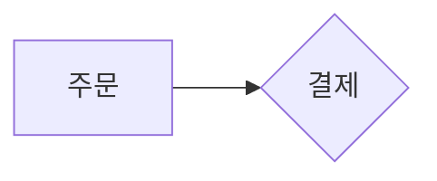

# 블로그 다이어그램

`blog.1989v.com` 글 본문에 그림을 넣는 규칙. 문체·구조는 `blog-writing.md` 가, 여기서는
**형식과 삽입 경로**만 정한다.

## 1. 무엇을 그릴지는 `artifact-diagramming` 을 따른다

판단 기준은 내장 스킬 `artifact-diagramming` 이 단일 원본이다. 여기에 옮겨 적지 않는다 —
두 벌이 되면 어긋나고, 어긋나면 다음 사람이 되돌린다. 스킬을 부르면 전문이 로드된다.

요지만 옮기면 셋이다. **이름이 아니라 동작을 그린다**(`캐시` 라고 적힌 상자보다 요청이
지나는 경로가 정보다). **비교는 차이를 그린다**(선택지를 나란히 놓기만 한 그림은 목록의
재서술이다). **화살표에 라벨을 단다**(`쓴다` · `무효화한다` · `30초마다 조회` — 라벨 없는
화살표는 "관련 있음"에 불과하다).

한 문장이 더 빠르면 문장을 쓴다.

## 1.5 기본은 펜스다 — 손으로 SVG 를 쓰지 않는다

````markdown
본문 문장.



다음 문장.
````

`fencesvg` 가 마크다운 렌더 앞에서 `mermaid` 펜스를 SVG 로 바꾼다. 지원 문법은
flowchart · sequenceDiagram · stateDiagram-v2 · erDiagram · classDiagram 5종이다. 색은
사이트 토큰(`var(--ko-accent-primary)` 등)을 참조해서 나오므로 아래 §3 의 테마 규칙을
그대로 따른다.

`%% caption:` 은 **필수**다. 빠지면 경고가 뜨고, 그림을 못 보는 사람과 JS 를 실행하지
않는 수집기가 내용을 알 방법이 없어진다.

아래 §2~§4 는 **라이브러리가 못 그리는 그림을 손으로 그릴 때만** 적용된다. 지원하지 않는
문법을 만난 펜스는 원래 코드블록으로 그대로 남으므로, 그럴 때만 인라인 SVG 로 옮긴다.

## 2. 형식 — 본문에 인라인 SVG

```markdown
본문 문장.

<svg viewBox="0 0 480 120" role="img" aria-label="주문이 결제 후 재고를 예약한다">
  …
</svg>

그림: 주문은 결제 승인 뒤에만 재고를 예약한다.

다음 문장.
```

이미지 파일(``)을 쓰지 않는 이유는 두 가지다.

| | 인라인 SVG | 이미지 파일 |
|---|---|---|
| 테마 | `data-theme` 을 따라간다 (사이트 테마는 **쿠키 토글**이라 OS 설정이 아니다) | `` 안의 SVG 는 페이지 CSS 를 못 본다. OS 설정만 따라가 토글과 어긋난다 |
| 발행 | 글과 같은 DB 행 — 한 번에 나간다 | 그림은 레포·CI·Argo 를 거친다. 글은 떠 있는데 그림만 없는 창이 생긴다 |

## 3. 렌더 경로가 허용하는 것 (실측, 2026-09-01)

본문은 `marked` 로 파싱한 뒤 DOMPurify 로 거른다 (`portal-fe/src/pages/blog/markdown.ts`).

| 쓸 수 있다 | 지워진다 |
|---|---|
| `svg` · `g` · `rect` · `circle` · `line` · `polyline` · `path` · `polygon` · `text` | **`<style>`** — SVG 안에 CSS 를 못 둔다. 클래스는 정의가 없어 무의미하다 |
| `defs` + `marker` (화살촉), `marker-end="url(#…)"` | **`<use href>`** — 도형 재사용이 안 된다. 반복되는 모양은 그대로 다시 그린다 |
| `currentColor`, `var(--토큰)` — presentation 속성과 `style` 속성 양쪽 | `<script>` · `<foreignObject>` |
| `role` · `aria-label` · `text-anchor` · `font-size` · `viewBox` | |

`<style>` 이 지워지는 건 제약이 아니라 스킬 지침(`Stay self-contained`)과 같은 방향이다.

### SVG 안에 빈 줄을 두지 않는다

CommonMark 는 **빈 줄에서 HTML 블록을 끝낸다.** 여백을 주려고 `<defs>` 와 도형 사이를
한 줄 띄우면 그 아래가 마크다운 문단으로 파싱되고, 그 안의 태그는 인라인 HTML 이 되어
`style` 같은 속성이 sanitize 에서 날아간다. 화면에는 그림이 반쯤 그려진 채로 나온다.

읽기 좋게 묶고 싶으면 빈 줄 대신 `<g>` 로 묶거나 주석 없이 붙여 쓴다.

같은 이유로 **SVG 와 같은 줄에 글을 쓰지 않는다.** 크롤러 사본은 HTML 블록을 줄 단위로
버리므로 `</svg> 이 그림은…` 처럼 붙여 쓴 문장은 그림과 함께 사라진다.

## 4. 작도 규칙

- **크기는 `viewBox` 가 정한다.** `width`/`height` 속성을 쓰지 않는다 — `.blog-body svg` 가
  폭을 가두고 높이를 비율로 맞춘다. 본문 폭 기준 `viewBox` 너비 **420~720** 이 읽을 만하다.
- **색은 `currentColor` 가 기본**이다. 선·글자·화살촉을 전부 여기에 맡기면 테마 전환이 공짜다.
  뜻을 지닌 요소 하나에만 토큰을 준다 — `style="stroke:var(--ko-accent-primary)"`.
  hex 직접 입력은 금지다 (`DESIGN.md`). 블로그는 heritage 면이라 `--ko-*` 토큰을 쓴다.
- **id 는 그림별로 접두사를 붙인다** — `d1-arrow` · `d2-arrow`. 한 글에 그림이 둘 이상이면
  `url(#arrow)` 가 먼저 나온 그림의 것을 가리킨다.
- **글자는 11~13px, 라벨은 서너 단어까지.** 설명 문장은 그림이 아니라 캡션 줄에 쓴다.
- **격자에 맞춘다.** 공유하는 기준선과 고른 간격이 손으로 그린 그림을 의도적으로 보이게 한다.
- **`role="img"` + `aria-label`** 에 그림이 말하는 것을 그대로 담는다.

## 5. 캡션은 마크다운 줄로 쓴다 — `<figcaption>` 이 아니다

서버가 만드는 크롤러용 사본은 **raw HTML 을 통째로 버린다**
(`BlogMetaRenderer`, ADR-0072 §6). `<figure>` 로 감싸면 캡션까지 함께 사라진다.

그래서 캡션은 SVG 블록 **밖의 마크다운 한 줄**이다. 색인되는 본문에 남고, 산문 규칙도
그대로 걸린다.

> **그림이 말하는 것은 글로도 있어야 한다.** 크롤러와 JS 를 실행하지 않는 수집기는
> 그림을 보지 못한다. 그림에만 있는 정보는 없는 정보다.

## 6. lint (`scripts/lint-blog-post.py`)

줄 첫머리가 태그인 raw HTML 블록은 코드·표와 같은 **비산문**이다. 빈 줄에서 끝난다.
문장 규칙을 걸면 SVG 한 줄이 596자짜리 문장으로 잡혀 그림을 넣은 글이 통과할 수 없다.

캡션 줄은 산문이므로 100자 규칙과 금칙 표현이 그대로 적용된다.

## 7. 넣기 전 확인

1. `scripts/lint-blog-post.py draft.md` — 통과.
2. 색을 `currentColor` 로만 썼으면 테마는 확인할 게 없다. 토큰을 썼으면 두 테마에서 잰다
   → `docs/standards/fe-visual-verification.md` (`scripts/cdp-chrome.sh`, start·측정·stop 한 명령).
3. 그림을 지웠을 때 문단이 여전히 말이 되는지 읽는다. 안 되면 캡션이 모자란 것이다.

## 관련

- `docs/conventions/blog-writing.md` — 문체·구조·lint 전체
- `blog/CLAUDE.md` — 도메인 규칙, DB 입력(hex)
- `docs/adr/ADR-0072-blog-platform.md` §6 — 글 상세 HTML 과 크롤러 사본
- `DESIGN.md` · `docs/design/k-heritage.html` — 토큰 원본
- 내장 스킬 `artifact-diagramming` — 무엇을 그릴지
