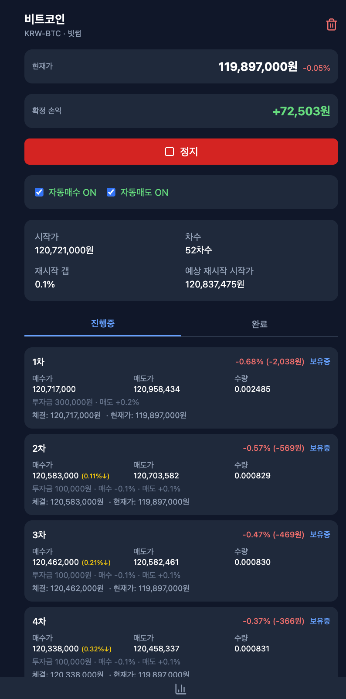
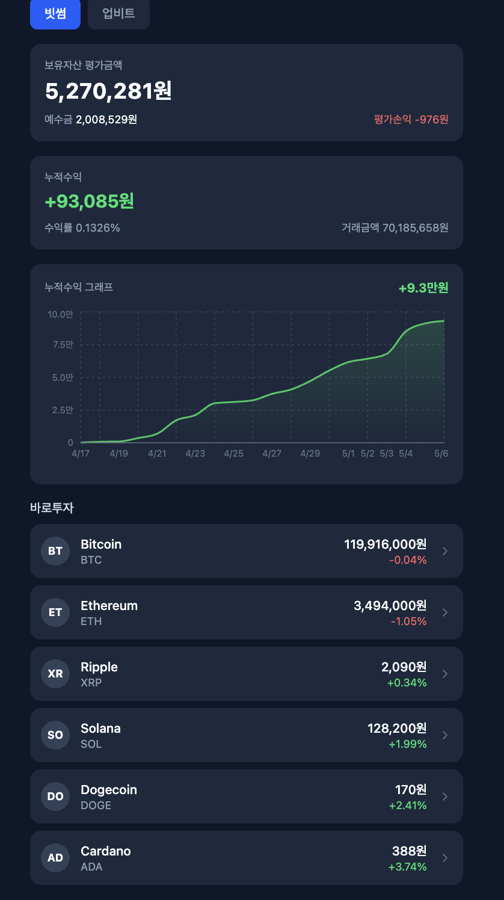

<!-- source: packages/design-system/, docs/conventions/frontend-design.md -->
# Design System — `@kgd/design-system`

전체 프로젝트 frontend 의 시각 통일을 위한 공유 패키지.
**OKLCH 토큰 + 5 핵심 React 컴포넌트** 를 모든 frontend 가 import 해 사용.

> **2026-05-06 도입**. 아래 샘플 디자인 분석 (네이버 증권 스타일 자동매매 + 포트폴리오 UI) 에서 도출한 디자인 언어를 코드로 고정.

## 0. 디자인 언어 출처

| 샘플 1 — 자동매매 상세 | 샘플 2 — 포트폴리오 |
|---|---|
|  |  |

공통 시각 패턴: 다크 네이비 surface · 큰 KPI 숫자 (tabular-nums) · profit=녹색 / loss=빨강 · 카드 radius 12 · accent 파랑(primary) + 청록(secondary) · 행 단위 list (avatar + 메인/보조 + 우측 값 + chevron).

---

## 1. 위치 / 구조

```
packages/design-system/
├── package.json              @kgd/design-system, peerDeps react ^18||^19
├── tsup.config.ts            ESM 빌드 + CSS copy + styles.css 합본
├── src/
│   ├── tokens.css            OKLCH 색상 / 타이포 / spacing / radius / shadow / motion
│   ├── components/
│   │   ├── KpiCard.tsx          (+ KpiCard.css)
│   │   ├── StatCard.tsx
│   │   ├── ListRow.tsx
│   │   ├── SegmentControl.tsx
│   │   └── PrimaryButton.tsx
│   └── index.ts              public barrel
└── dist/                     빌드 산출물 (npm pack 대상)
```

각 frontend 는 **vendored tarball** 방식으로 의존:
- `scripts/sync-design-system.sh` 가 `npm pack` 결과(`kgd-design-system-X.Y.Z.tgz`)를
  `<fe>/vendor/` 에 복사 + 각 `package.json` 의 `@kgd/design-system` 을
  `file:./vendor/<tarball>` 로 갱신.
- 이유: Dockerfile context 가 각 FE 디렉토리만 복사하므로 monorepo file: 경로
  (`file:../../packages/...`) 는 컨테이너 빌드에서 해석 실패 → tarball 동봉 채택.

---

## 2. 사용

### 2.1 의존 추가 (자동)
```bash
scripts/sync-design-system.sh
# packages/design-system 빌드 → tarball 생성 → 3 FE 의 vendor/ 갱신 + npm install
```

### 2.2 Frontend 코드
```tsx
// src/main.tsx — 토큰 한 번만 import
import '@kgd/design-system/tokens.css';

// 페이지/컴포넌트
import { KpiCard, StatCard, ListRow, SegmentControl, PrimaryButton } from '@kgd/design-system';

<KpiCard label="오늘 매출" value="₩72,503" delta="+0.62%" deltaTone="profit" />
```

### 2.3 토큰 직접 사용 (CSS / inline)
```css
.my-section {
  background: var(--ko-surface-1);
  color: var(--ko-text-primary);
  padding: var(--ko-space-5);
  border-radius: var(--ko-radius-lg);
}
```

---

## 3. 토큰 Reference

### 3.1 Color (OKLCH)

| 용도 | 토큰 | 값 (다크 default) | 비고 |
|---|---|---|---|
| 페이지 배경 | `--ko-surface-0` | `oklch(0.18 0.02 250)` | 다크 네이비 |
| 카드 배경 | `--ko-surface-1` | `oklch(0.23 0.02 250)` | 1 단계 상승 |
| Hover/활성 | `--ko-surface-2` | `oklch(0.28 0.02 250)` | |
| Nested | `--ko-surface-3` | `oklch(0.33 0.02 250)` | |
| 본문 텍스트 | `--ko-text-primary` | `oklch(0.96 0.005 250)` | 거의 흰색 |
| 보조 텍스트 | `--ko-text-secondary` | `oklch(0.78 0.01 250)` | |
| 라벨 / 캡션 | `--ko-text-muted` | `oklch(0.62 0.015 250)` | |
| Border subtle | `--ko-border-subtle` | `oklch(0.32 0.015 250)` | |
| Border default | `--ko-border-default` | `oklch(0.42 0.015 250)` | |
| Primary action | `--ko-accent-primary` | `oklch(0.68 0.16 245)` | 파랑 (샘플 1 체크박스/탭) |
| Secondary | `--ko-accent-secondary` | `oklch(0.78 0.14 180)` | 청록 (샘플 2 segment) |
| 수익 / 상승 | `--ko-status-profit` | `oklch(0.74 0.18 145)` | 녹색 |
| 손실 / 하락 | `--ko-status-loss` | `oklch(0.68 0.20 25)` | 빨강 |
| 경고 | `--ko-status-warning` | `oklch(0.80 0.15 75)` | 앰버 |
| 정보 | `--ko-status-info` | `oklch(0.75 0.10 240)` | |
| Focus ring | `--ko-focus-ring` | `2px solid oklch(0.74 0.16 245)` | a11y |

> **light theme 자동 적용**: `<body data-theme="light">` 시 surface/text 토큰이 라이트 값으로 swap (tokens.css 후반부).

### 3.2 Typography

| 토큰 | 값 | 용도 |
|---|---|---|
| `--ko-font-family` | Pretendard, system | base |
| `--ko-text-xs` | 0.75rem (12px) | 캡션 |
| `--ko-text-sm` | 0.875rem (14px) | secondary |
| `--ko-text-base` | 1rem (16px) | body |
| `--ko-text-lg` | 1.125rem (18px) | section heading |
| `--ko-text-xl` | 1.25rem (20px) | |
| `--ko-text-2xl` | 1.5rem (24px) | page heading |
| `--ko-text-3xl` | 1.875rem (30px) | KPI |
| `--ko-text-4xl` | 2.25rem (36px) | hero |
| `--ko-weight-{normal,medium,semibold,bold}` | 400 / 500 / 600 / 700 | |

### 3.3 Spacing (4px grid)
`--ko-space-{0,1,2,3,4,5,6,8,10,12,16}` → `0 / 4 / 8 / 12 / 16 / 20 / 24 / 32 / 40 / 48 / 64 px`

### 3.4 Radius
`--ko-radius-{sm,md,lg,xl,full}` → `4 / 8 / 12 / 16 / 9999 px`

### 3.5 Shadow / Motion
`--ko-shadow-{sm,md,lg,xl}`, `--ko-duration-{fast,normal,slow}`, `--ko-ease-out`, `--ko-ease-in-out`.
**`prefers-reduced-motion: reduce`** 시 모든 duration 자동 0ms (frontend-design.md 강제).

---

## 4. 컴포넌트 API

### 4.1 KpiCard
단일 메트릭 카드. 큰 숫자 + 라벨 + 선택적 delta.

```tsx
<KpiCard
  label="현재가"
  value="119,897,000원"
  delta="-0.05%"
  deltaTone="loss"     // 'profit' | 'loss' | 'neutral'
  icon={<DollarIcon />}
/>
```

### 4.2 StatCard
헤더 + 큰 메트릭 + footer + children (차트 등) 슬롯.

```tsx
<StatCard
  title="보유자산 평가액"
  meta="평가손익 -976원"
  primary="5,270,281원"
  primaryTone="neutral"
  footer={<><span>예수금 2,008,529원</span><span>거래금액 70,185,658원</span></>}
>
  <AreaChart data={cumReturn} />
</StatCard>
```

### 4.3 ListRow
좌 avatar + 메인/보조 라벨 + 우 값/등락률 + chevron. 클릭/링크 가능.

```tsx
<ListRow
  avatar={<span>BT</span>}
  primary="Bitcoin"
  secondary="BTC"
  value="119,916,000원"
  valueSub="-0.04%"
  valueTone="loss"
  href="/coins/btc"
  trailing={<ChevronRight />}
/>
```

### 4.4 SegmentControl
2-N 개 segment 토글. `pill` (샘플 2 빗썸/업비트) / `underline` (샘플 1 진행중/완료) variant.

```tsx
const [tab, setTab] = useState<'progress' | 'done'>('progress');

<SegmentControl
  variant="underline"
  ariaLabel="회차 상태"
  options={[
    { value: 'progress', label: '진행중' },
    { value: 'done',     label: '완료' },
  ]}
  value={tab}
  onChange={setTab}
/>
```

### 4.5 PrimaryButton
3 tone (`primary`/`danger`/`subtle`) × 3 size (`sm`/`md`/`lg`) + `fullWidth`.

```tsx
<PrimaryButton tone="danger" size="lg" fullWidth>
  ⏸ 정지
</PrimaryButton>
```

---

## 5. 신규 컴포넌트 추가 절차

1. `packages/design-system/src/components/<Name>.tsx` 작성 (props 인터페이스 + JSDoc)
2. `packages/design-system/src/components/<Name>.css` 작성 — **토큰만 사용**, hex/raw px 금지
3. `src/index.ts` 에 export 추가
4. `packages/design-system/package.json` 의 `version` bump (semver)
5. `scripts/sync-design-system.sh` 실행 → 3 FE 의 vendor 갱신
6. 본 문서 §4 에 컴포넌트 API 추가
7. 한 곳 이상에서 demo 마이그레이션 + 브라우저 시각 검증

---

## 6. 테마 / 변형 가이드

- **다크 default** — `<body>` 에 별도 attr 없으면 다크.
- **라이트** — `<body data-theme="light">` (tokens.css 후반부 override).
- **커스텀 테마** — 프로젝트별로 `:root` 안에 token override 가능. 단, 토큰명 자체를 변경하지는 말 것 (호환성 깨짐).

---

## 7. 적용 현황 (2026-05-07)

| FE | tokens.css import | 컴포넌트 사용 | 비고 |
|---|---|---|---|
| `admin/frontend` | ✅ `src/main.tsx` | `KpiCard` (Dashboard 4 카드), `ListRow` (SystemPage ServiceCard 12 행) | |
| `quant/frontend` | ✅ `src/main.tsx` | `KpiCard` (ChartsPage prediction 4 카드) | |
| `portal-fe` | ✅ `src/main.tsx` | `ListRow` (ServiceCatalog 7 서비스 행) | Tailwind 미사용 — pure CSS 토큰 |

---

## 8. 충돌 / 제한사항

- **Tailwind v3 vs v4**: design-system 컴포넌트는 Tailwind 의존하지 **않음** (CSS 토큰만 사용). 각 FE 의 Tailwind 설정과 무관하게 작동.
- **React 18 vs 19**: peerDependency `^18 || ^19` — 호환성 보장.
- **Tarball 갱신 자동화**: `.githooks/pre-commit` 가 `packages/design-system/src` 변경을 감지하면 `scripts/sync-design-system.sh` 자동 실행 + 3 FE 의 vendor/package-lock 자동 staged. 활성화: `scripts/install-hooks.sh` (1 회).
- **OKLCH 브라우저 지원**: Chrome 111+, Safari 15.4+, Firefox 113+. `frontend-design.md` 의 OKLCH 정책과 정합.

---

## 9. 관련 문서

- `docs/conventions/frontend-design.md` — AI Slop 방지, OKLCH WCAG AA 가드레일
- `docs/specs/2026-05-05-code-dictionary-treemap/planning/spec.md` — OKLCH 적용 첫 사례
- 샘플 이미지: [`docs/assets/design-system/sample-1-tranche-detail.png`](../assets/design-system/sample-1-tranche-detail.png), [`docs/assets/design-system/sample-2-portfolio.png`](../assets/design-system/sample-2-portfolio.png)
