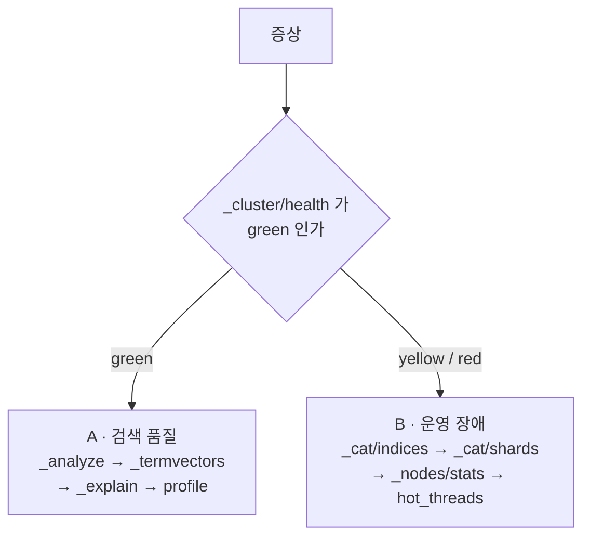

검색 엔진 장애는 검색 결과에서 난 것과 클러스터에서 난 것으로 갈리고, 두 갈래는 두드리는 API 도 순서도 다르다. ES 7.x · OpenSearch 2.x 기준이다.

| 항목 | 값 |
|---|---|
| 검색 품질 순서 | `_analyze` → `_termvectors` → `_explain` → `_search?profile=true` |
| 운영 장애 순서 | `_cluster/health` → `_cat/indices` → `_cat/shards` → `_nodes/stats` → `_nodes/hot_threads` |
| 샤드 할당 재시도 상한 | `index.allocation.max_retries` 기본 5회. 소진하면 영구히 재시도를 포기한다 |
| 재시도 리셋 | `POST /_cluster/reroute?retry_failed=true` — 비파괴적, 대상 범위 지정 불가 |
| 디스크 watermark 기본값 | low 85% · high 90% · flood 95% |
| 노드 이탈 후 대기 | `index.unassigned.node_left.delayed_timeout` 기본 1m |
| OpenSearch 차이 | 사전이 파일이 아니라 custom package · 오류 메시지에 규칙 줄번호 없음 |
| 기본값 확인 | `GET _cluster/settings?include_defaults=true` |

## 두 갈래를 먼저 가른다

첫 분기는 증상이 결과에서 났는지 클러스터에서 났는지다. 순서를 건너뛰면 뒤 단계에서 엉뚱한 결론이 난다.



| 증상 | 갈래 | 첫 호출 |
|---|---|---|
| 특정 문서가 결과에 안 나온다 | A · 검색 품질 | `GET {index}/_analyze` |
| 순위가 기대와 다르다 | A · 검색 품질 | `GET {index}/_explain/{id}` |
| 특정 질의만 느리다 | A · 검색 품질 | `GET {index}/_search?profile=true` |
| 클러스터가 <span class="pill p-amber">YELLOW</span> 또는 <span class="pill p-red">RED</span> | B · 운영 | `GET _cluster/health` |
| 색인이 붙지 않는다 | B · 운영 | `GET _cat/shards?v` |
| 노드 전체가 느리다 | B · 운영 | `GET _nodes/stats` |

토큰이 안 맞는 결함을 스코어링 결함으로 오진하는 것이 A 갈래에서 가장 흔한 낭비다.

## `_analyze` — 입력이 어떤 토큰이 되는가

질의어와 색인 대상이 같은 토큰으로 떨어지지 않으면 뒷단은 볼 필요가 없다.

```json
GET my-index/_analyze
{
  "field": "name",
  "text": "인천국제공항"
}
```

- **토크나이저 결과** — 형태소 분해가 의도대로 되는가
- **동의어 확장** — 규칙이 실제로 적용되는가
- **ngram 생성** — 부분 일치가 걸릴 토큰이 나오는가
- **position** — 구(phrase) 매칭은 위치가 맞아야 걸린다

> [!WARNING] 분석기 체인을 그대로 재현해야 한다
> `field` 대신 `tokenizer` · `filter` 를 직접 넘길 때가 함정이다.
> 앞단을 덜 태우면 실제로는 안 걸릴 토큰이 걸린 것처럼 보이고, 더 태우면 기존 동의어가 확장돼 멀쩡한 것이 불량으로 잡힌다.
> 재현 범위는 **보려는 필터의 바로 앞단까지**다. `nori_part_of_speech` 는 조사를 떨어뜨리므로, 이걸 빼고 재면 조사가 붙은 토큰이 결과에 남는다.

## 인덱스 없이 사전 파일을 검사한다

`filter` 에 `synonym_graph` 를 인라인으로 넘기면 그 노드가 사전 파일을 지금 읽어 분석기를 새로 빌드한다. 인덱스를 만들지 않고 사전의 현재 빌드 가능성만 확인할 수 있다.

```json
POST /_analyze
{
  "tokenizer": { "type": "nori_tokenizer", "user_dictionary": "analysis/user_dict.txt" },
  "filter": [
    "nori_part_of_speech",
    "lowercase",
    { "type": "synonym_graph", "synonyms_path": "analysis/synonym.txt" }
  ],
  "text": "테스트"
}
```

> [!TIP] 실패 응답이 곧 좌표다
> 빌드에 실패하면 위반 규칙의 **줄 번호와 term** 이 응답에 그대로 나온다.
> 사전 조합이 여러 벌이면 조합마다 돌려 어느 조합이 깨져 있는지 전수로 가른다.

## `_termvectors` — 색인 당시에 저장된 토큰

`_analyze` 는 지금 분석하면 어떻게 되는지를 보여 주고, `_termvectors` 는 색인 시점에 무엇이 저장됐는지를 보여 준다. 매핑이나 사전을 바꾼 뒤 재색인하지 않으면 둘이 갈리고, 그 간극이 범인이다.

```json
GET my-index/_termvectors/123
{
  "fields": ["name"],
  "term_statistics": true
}
```

| 항목 | 의미 | 쓰임 |
|---|---|---|
| `term_freq` | 현재 문서 안에서 그 토큰이 나온 횟수 | BM25 의 TF. 같은 값이 반복 저장되면 여기서 벌어진다 |
| `doc_freq` | 그 토큰을 가진 문서 수 | BM25 의 IDF. 흔한 토큰일수록 기여가 준다 |
| `ttf` | 인덱스 전체에서 그 토큰의 총 등장 횟수 | 토큰이 과대 대표되는지 확인 |

> [!NOTE] `term_statistics` 는 기본값이 `false` 다
> 끄면 현재 문서 기준 정보만 나와 `doc_freq` · `ttf` 로 IDF 를 따질 수 없다.
> BM25 통계는 **필드 로컬**이다 — `doc_freq` 의 모수는 인덱스 전체 문서가 아니라 그 필드를 가진 문서 수라서, 같은 토큰이라도 필드마다 IDF 가 다르다.

## `_explain` — 왜 이 점수인가

```json
GET my-index/_explain/123
{
  "query": { "match": { "name": "인천공항" } }
}
```

- **BM25 분해** — TF · IDF · 필드 길이 정규화가 각각 얼마를 기여했는지
- **boost** 가 적용됐는지와 곱해진 자리
- `function_score` · `constant_score` 가 실제로 걸렸는지
- `dis_max` 계열에서 어느 필드가 최종값을 냈는지

> [!TIP] 혼자 보지 말고 두 건을 나란히 놓는다
> 한 문서의 explain 만 보면 숫자가 대체로 타당해 보인다. 진 문서와 이긴 문서를 나란히 놓아야 어느 항에서 갈렸는지 드러난다.
> `multi_match` 의 `best_fields` 는 `dis_max` 이고 `tie_breaker` 기본값이 0 이다. 최고점 필드 하나만 반영되고 나머지 필드 기여는 0 이라는 점이 여기서 보인다.

## `_search?profile=true` — 왜 느린가

- **Query Phase** — 각 쿼리 절이 먹은 시간과 호출 횟수
- **Fetch Phase** — `_source` 크기와 highlight 비용
- **Script** — `script_score` · painless 가 문서마다 도는 비용
- **Aggregation** — `terms` 카디널리티와 `size` 설정

```bash
GET my-index/_search?profile=true&filter_path=profile.shards.searches.query.time_in_nanos
```

응답이 매우 크므로 `filter_path` 로 잘라 본다. 전체 응답을 그대로 받으면 느린 절을 찾는 데 더 오래 걸린다.

## `_cluster/health` — 문제 상태인가 복구 중인가

| 상태 | 의미 | 서비스 영향 |
|---|---|---|
| <span class="pill p-green">GREEN</span> | 모든 primary · replica 할당됨 | 없음 |
| <span class="pill p-amber">YELLOW</span> | 모든 primary 할당, replica 일부 미할당 | **조회는 정상.** 이중화와 조회 분산이 줄어든 상태 |
| <span class="pill p-red">RED</span> | **primary 일부 미할당** | 그 샤드에 속한 문서를 조회할 수 없다 |

같이 볼 값은 넷이다.

- `unassigned_shards` — 몇 개인지
- `initializing_shards` — 지금 붙는 중인지, 곧 기다리면 되는지
- `number_of_pending_tasks` — 마스터가 밀렸는지
- `active_shards_percent_as_number` — 복구 진척 추적용

> [!IMPORTANT] yellow 는 장애가 아니라 이중화가 깨진 상태다
> 복구 중에도, 노드 재기동 직후에도 yellow 가 뜬다.
> **기다리면 되는 yellow**(`initializing > 0`)와 **멈춘 yellow**(`initializing = 0` 인데 `unassigned > 0`)를 먼저 가른다.

## `_cat/indices` — 어느 인덱스인가

```bash
GET _cat/indices?v&s=health:desc          # red · yellow 를 위로
GET _cat/indices?v&s=creation.date:desc   # 최근 생성분을 위로
GET _cat/aliases?v                        # 실제로 서빙 중인 이름
```

확인 항목은 `health` · `docs.count` · `store.size` · `pri` · `rep` 다. 롤링 색인 환경에서는 같은 패밀리의 최신본과 구버전을 나란히 놓는 것이 가장 빠르다.

> [!TIP] alias 가 붙지 않은 인덱스는 서빙 중이 아니다
> 장애 영향 범위를 이 한 줄로 크게 줄일 수 있고, 잔재 인덱스 정리 대상도 여기서 갈린다.

## `_cat/shards` — 어느 샤드가 왜 안 붙었나

| state | 의미 | 조치 |
|---|---|---|
| `STARTED` | 정상 서비스 중 | — |
| `INITIALIZING` | 복구 또는 생성 중 | 기다린다. `_cat/recovery?active_only=true` 로 진척 확인 |
| `RELOCATING` | 노드 간 이동 중 | 기다린다. 리밸런싱은 정상 동작 |
| `UNASSIGNED` | **할당되지 않음** | state 로 끝내지 말고 이유를 뽑는다 |

```bash
GET _cat/shards?h=index,shard,prirep,state,unassigned.reason,unassigned.details&v

GET _cluster/allocation/explain
{ "index": "my-index", "shard": 0, "primary": false }
```

`allocation/explain` 은 노드별로 왜 거절했는지를 decider 이름과 함께 돌려준다. `same_shard`(이미 사본이 있음) · `disk_threshold`(watermark) · `filter`(할당 필터) 가 흔한 값이고, 이 한 줄이 추측을 없앤다.

## `_nodes/stats` 와 `hot_threads` — 노드가 버티는가

- **Heap** — `jvm.mem.heap_used_percent`. 75% 이상이 상시면 위험
- **GC** — `jvm.gc.collectors.old.collection_count` 증가율
- **Latency** — `indices.search.query_time_in_millis` ÷ `query_total`
- **거절** — `thread_pool.search.rejected`. 0 이 아니면 요청이 버려지고 있다
- **Disk** — `fs.total.available_in_bytes` 와 watermark 기본값 85/90/95%

> [!WARNING] `_cat/nodes` 의 cpu 는 ES 가 아니라 호스트다
> `_cat/nodes` 의 `cpu` · `load` 는 **OS 전체** 값이다.
> 같은 노드의 `_nodes/stats` 에서 `process.cpu.percent` 를 같이 봐야 CPU 100% 가 같은 호스트의 다른 워크로드인 경우를 가른다. 이 대조 없이 튜닝하면 엉뚱한 곳을 만진다.

```bash
GET _nodes/hot_threads?threads=5&interval=1s
```

hot_threads 는 스택 트레이스를 그대로 돌려준다. Merge 는 대개 정상이고 곧 끝나며, GC 는 힙 압박의 결과지 원인이 아니다. 높은 카디널리티 `terms`, 문서마다 도는 script, 앞에 `*` 가 붙은 wildcard 질의가 자주 나오는 원인이다.

## 동의어 사전 하나가 샤드 할당을 멈춘다

`synonym_graph` 는 규칙의 term 을 동의어 필터 앞단 분석기로 토크나이즈해 그래프를 만든다. Lucene 빌더는 position increment 가 1이 아닌 토큰을 거부하므로, 위치가 겹치는 토큰이 나오면 인덱스 생성이 통째로 실패한다.

```text
IllegalArgumentException[failed to build synonyms];
parse_exception: Invalid synonym rule at line 177;
term: 삼성전자 매장 analyzed to a token (삼성) with position increment != 1 (got: 0)
```

nori 의 `decompound_mode: mixed` 는 복합명사를 원형과 분해형으로 같은 위치에 함께 낸다. `user_dictionary` 항목이 표제어보다 긴 토큰을 같은 자리에 내도 같은 모양이 된다.

| 성질 | 내용 |
|---|---|
| 드러나는 시점 | 분석기를 다시 빌드할 때만 — 노드 재기동 · 인덱스 신규 생성 · replica 신규 할당 |
| 드러나지 않는 곳 | 이미 인덱스를 연 노드. 메모리의 옛 분석기로 계속 정상 응답한다 |
| 줄 번호가 갈리는 이유 | 앞단 토크나이저 사전이 다르면 첫 위반 규칙이 달라진다. 파일은 하나여도 라인이 갈린다 |
| 귀결 | replica 할당 실패 → `ALLOCATION_FAILED` 누적 → 5회 소진 후 영구 포기 |

> [!IMPORTANT] 사전이 깨진 날과 증상이 터진 날이 다르다
> 파손은 조용히 누워 있다가 **분석기를 다시 빌드하는 사건**에만 드러난다.
> 그래서 사건은 사전이 바뀐 날이 아니라 노드가 재기동한 날에 난 것처럼 보인다. 원인을 그날의 배포에서 찾으면 못 찾는다.

## `lenient` 는 깨진 인덱스에 못 붙는다

`synonym_graph` 의 `lenient: true` 는 위반 규칙만 버리고 인덱스를 연다. 인덱스 세팅은 생성 시점에 박히므로 이미 만들어진 인덱스는 재색인해야 새 값을 받는다.

| 시도 | 결과 | |
|---|---|---|
| `lenient: true` 로 새 인덱스 생성 | 위반 규칙만 조용히 버려진다 | <span class="pill p-green">성공</span> |
| 열린 인덱스에 세팅 갱신 | `Can't update non dynamic settings ... for open indices` | <span class="pill p-red">실패</span> |
| **정상** 인덱스: close → 세팅 → open | 설정이 병합되고 다시 열린다 | <span class="pill p-green">성공</span> |
| **깨진** 인덱스: close → 세팅 → open | open 시점의 검증이 그 파손에 걸린다 | <span class="pill p-red">실패</span> |

> [!WARNING] 닭과 달걀 — 그리고 초록불이 거짓말을 한다
> lenient 를 붙이려면 인덱스를 열어야 하는데, 여는 데 실패해서 lenient 가 필요했다. 재색인은 새 인덱스를 만드는 경로라 이 제약을 우회한다.
> 그리고 lenient 로 열린 인덱스에서 **버려진 규칙은 검색에 먹지 않는다.** 인덱스는 green 이고 동의어만 조용히 빠진 상태가 되므로 지표로는 잡히지 않는다.

## `retry_failed` — 언제 쓰고 언제 안 쓰나

```bash
POST /_cluster/reroute?retry_failed=true
```

할당에 실패해 미할당된 샤드의 재시도 카운터를 리셋하고 즉시 다시 붙여 본다. ES 는 `index.allocation.max_retries`(기본 5회)를 소진하면 영구히 재시도를 포기하므로, 원인을 고쳐도 이 명령 없이는 저절로 붙지 않는다.

쓰기 전에 `unassigned.reason` 부터 읽는다. 이 명령이 답인 경우는 `ALLOCATION_FAILED` 하나뿐이다.

| `unassigned.reason` | 뜻 | 처방 |
|---|---|---|
| `ALLOCATION_FAILED` | 할당을 시도했으나 실패했고 재시도 횟수를 소진했다 | **`retry_failed` 가 답이다** — 원인을 먼저 고친 뒤에 |
| `NODE_LEFT` | 노드가 빠져 사본이 사라졌다 | 기다린다. `node_left.delayed_timeout`(기본 1m) 뒤 자동 재할당 |
| `INDEX_CREATED` · `REPLICA_ADDED` | 붙을 자리를 아직 못 찾았다 | `allocation/explain` — 대개 노드 수 < 사본 수 또는 디스크 watermark |
| `CLUSTER_RECOVERED` · `INDEX_REOPENED` | 기동 · 재개 직후 복구 중 | 기다린다. `_cat/recovery` 로 진척 확인 |
| `PRIMARY_FAILED` | primary 가 죽어 replica 가 승격 대기 | 원인 조사 우선. 사본이 없으면 red — 스냅샷 복구 검토 |
| `NODE_RESTARTING` | 계획된 재기동 중 | 기다린다 |

| 상황 | 판단 | 이유 |
|---|---|---|
| 원인을 고친 뒤 — 디스크 확보 · 사전 수정 · 할당 필터 해제 | <span class="pill p-green">쓴다</span> | 정확히 이 용도다. 안 쓰면 고쳐도 영영 안 붙는다 |
| 일시적 원인이 이미 사라짐 — 네트워크 순단, 순간적 디스크 압박 | <span class="pill p-green">쓴다</span> | 재시도만 하면 붙는다 |
| 원인이 그대로일 때 | <span class="pill p-red">안 쓴다</span> | 5회를 다시 소진하고 같은 자리로 돌아온다 |
| 지금 `initializing > 0` 인 복구 진행 중 | <span class="pill p-amber">기다린다</span> | 실패한 상태가 아니라 붙는 중이다 |
| `reason` 이 `ALLOCATION_FAILED` 가 아님 | <span class="pill">해당 없음</span> | 실패 이력이 없어 리셋할 카운터가 없다 |

## `retry_failed` 의 성질 넷

| 성질 | 내용 |
|---|---|
| 범위를 못 좁힌다 | 인덱스 · 샤드 단위 지정이 안 되고 실패한 샤드 전부가 재시도된다. 아직 안 고쳐진 샤드는 재시도 횟수만 다시 소모한다 |
| 비파괴적이다 | replica 를 primary 로부터 새로 복사할 뿐, primary 와 데이터를 건드리지 않는다 |
| 실패 사유를 갱신한다 | 재시도가 다시 실패하면 `unassigned.details` 에 지금 시점의 이유가 다시 기록된다. 사실상 진단 도구다 |
| 동기 응답이 아니다 | `acknowledged: true` 는 재할당을 시작했다는 뜻이다. 진척은 `_cat/recovery` 와 `_cluster/health` 로 본다 |

같은 API 의 다른 명령들은 위험도가 갈린다.

| 명령 | 용도 | 위험도 |
|---|---|---|
| `?retry_failed=true` | 실패한 할당 재시도 | <span class="pill p-green">안전</span> 비파괴 |
| `?explain=true` · `?dry_run=true` | 거절 사유 설명 · 적용 없이 결과만 계산 | <span class="pill p-green">안전</span> 조회 |
| `move` | 특정 샤드를 노드 간 이동 | <span class="pill p-amber">주의</span> 복사 비용 |
| `allocate_replica` | replica 를 지정 노드에 강제 할당 | <span class="pill p-amber">주의</span> decider 우회 |
| `allocate_stale_primary` | 오래된 사본을 primary 로 승격 | <span class="pill p-red">위험</span> 데이터 손실 |
| `allocate_empty_primary` | 빈 primary 를 만들어 붙임 | <span class="pill p-red">위험</span> 샤드 전체 유실 |

> [!CAUTION] 아래 둘은 데이터를 버려서 red 를 지운다
> 지표는 좋아지고 데이터는 사라진다.
> 스냅샷 복구를 먼저 검토하고, 쓸 때는 **무엇을 버리는지 문서로 남긴 뒤** 실행한다.

## 실전 — 미할당 65샤드 중 40샤드 복구

3노드 ES 7.14 개발 클러스터의 실측이다.

| 단계 | 관측 |
|---|---|
| 증상 | <span class="pill p-amber">YELLOW</span>, 미할당 65샤드. `initializing = 0` 이라 **멈춘 yellow** |
| `_cat/shards` | 65개 전부 `ALLOCATION_FAILED`, `failed_allocation_attempts: 5`. 전부 replica 라 red 위험 없음 |
| `unassigned.details` | `failed to build synonyms · Invalid synonym rule at line 177` |
| 원인 | 동의어 사전 파손. replica 를 새로 여는 노드만 분석기 빌드에 실패하고, 이미 인덱스를 연 노드는 정상 |
| `_analyze` 로 검증 | 인덱스를 만들지 않고 사전 · 필터 조합별로 현재 빌드 가능성을 전수 확인. 일부 조합은 이미 정상 |
| 실행 | `POST /_cluster/reroute?retry_failed=true` |
| 결과 | 미할당 **65 → 25**. 정상 조합의 40샤드가 붙고, 깨진 조합은 예상대로 다시 실패 |
| 부수 소득 | 기록된 실패 라인이 **177 → 179** 로 갱신돼 남은 원인이 무엇인지까지 드러난다 |

`retry_failed` 는 고쳐진 것만 붙인다. 안 고쳐진 것은 다시 실패하며, 그 실패가 남은 할 일을 가리킨다.

## OpenSearch 에서 달라지는 것

| 지점 | Elasticsearch | OpenSearch (AWS 관리형) |
|---|---|---|
| 사전 파일 | 노드 로컬 파일. 노드마다 배포가 필요하다 | custom package 참조. 노드별 배포가 없다 |
| 사전 갱신 | 파일을 교체하면 다음 분석기 빌드부터 반영 | S3 업로드만으로는 반영되지 않는다. 패키지 갱신과 도메인 연결이 각각 필요하다 |
| 동의어 빌드 실패 메시지 | `caused_by` 체인에 규칙 줄번호와 term | `Failed to build synonyms` 요약뿐 |
| 상세 원인 | 기본 응답에 포함 | 요청에 `error_trace=true` 를 붙여야 나온다 |
| 클러스터 레벨 `_analyze` | 노드 파일 경로를 푼다 | 패키지 경로를 못 푼다(`file not readable`). **인덱스 레벨**로 호출한다 |
| ES 공식 자바 클라이언트 | 7.14+ 는 응답의 `X-Elastic-Product` 헤더를 검사한다 | 이 헤더를 보내지 않아 7.14+ 클라이언트가 예외를 던진다 |

> [!WARNING] 듀얼 운영에서 가장 조용한 함정은 사전 갱신 경로다
> S3 파일과 도메인 사이에 사본이 두 번 생기고, 두 단계 모두 명시적 호출을 요구한다.
> 자동화가 없으면 어드민에서 사전을 저장했을 때 ES 는 즉시 반영되고 OpenSearch 는 옛 사전을 계속 본다. 두 엔진의 검색 결과가 조용히 갈린다.

`X-Elastic-Product` 검사는 ES 7.14 에서 들어왔다. 그보다 낮은 세대의 `RestHighLevelClient` 에는 이 검사가 없어, 엔드포인트만 OpenSearch 로 겨누면 쿼리 빌더와 응답 소비 코드를 그대로 쓸 수 있다.

## 빠른 참조

| API | 한 줄 | 갈래 |
|---|---|---|
| `{index}/_analyze` | 입력 텍스트가 어떻게 분석되는지 | A · 품질 |
| `POST /_analyze` (인라인 필터) | 사전 파일이 지금 빌드 가능한지 | A · 품질 |
| `{index}/_termvectors/{id}` | 실제 색인된 토큰과 TF · DF 통계 | A · 품질 |
| `{index}/_explain/{id}` | 점수가 왜 그렇게 계산됐는지 | A · 품질 |
| `{index}/_search?profile=true` | 검색이 왜 느린지 | A · 품질 |
| `_cluster/health` | 문제 상태인지 복구 중인지 | B · 운영 |
| `_cat/indices?v` · `_cat/aliases` | 어느 인덱스인지, 서빙 중인지 | B · 운영 |
| `_cat/shards?v` | 어느 샤드가 왜 안 붙었는지 | B · 운영 |
| `_cluster/allocation/explain` | 그 샤드를 거절한 decider 이름 | B · 운영 |
| `_nodes/stats` | heap · GC · latency · 거절 | B · 운영 |
| `_nodes/hot_threads` | CPU 를 정확히 무엇이 먹는지 | B · 운영 |
| `_cluster/reroute?retry_failed` | 고친 뒤 멈춘 샤드를 다시 붙임 | B · 운영 |

두 순서만 지켜도 대부분의 원인은 네댓 번의 호출 안에 나온다. 순서를 건너뛰어 생기는 오진이 원인 자체보다 시간을 더 먹는다.

기본값은 버전과 클러스터 설정에 따라 다르므로 `GET _cluster/settings?include_defaults=true` 로 확인한다.
