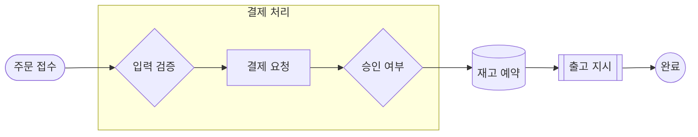
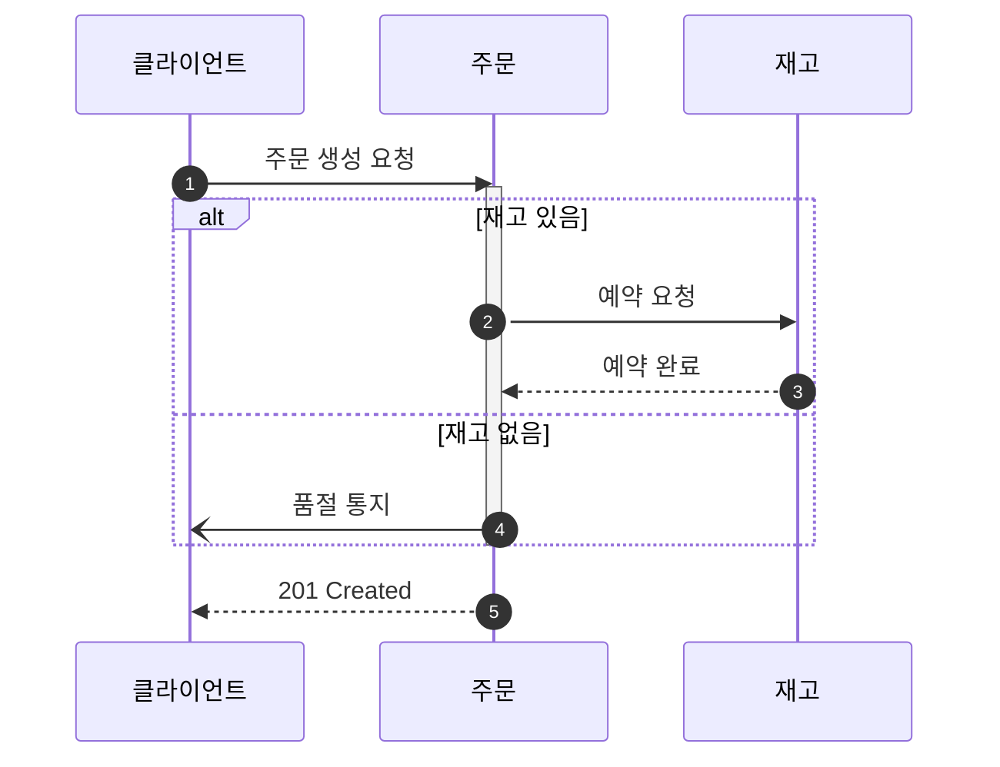
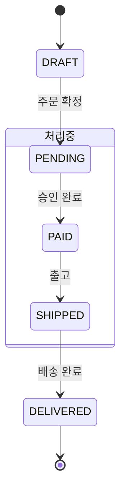
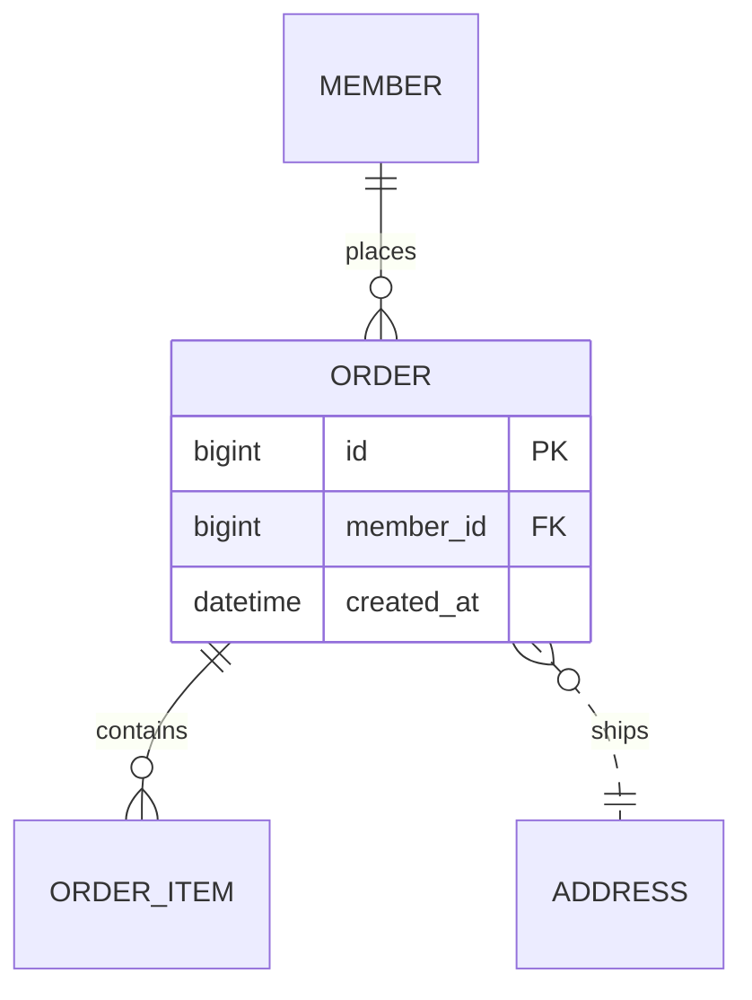
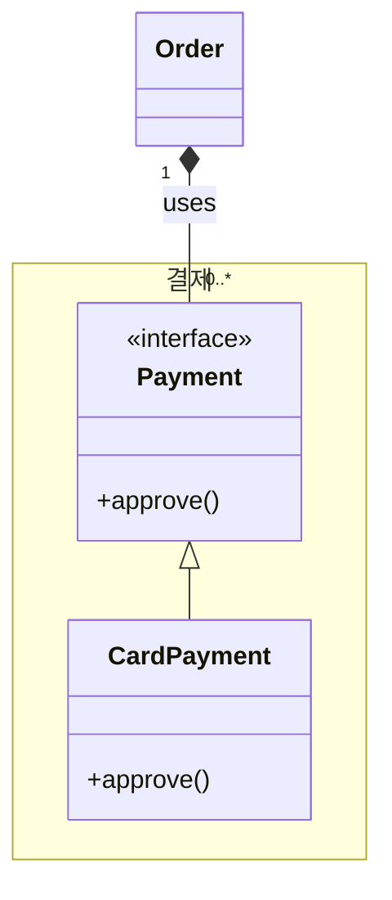

`fencesvg` 는 마크다운의 mermaid 문법 펜스를 인라인 SVG 로 바꾸는 라이브러리다. 2026-09-02, v0.7.1 기준.

| | |
|---|---|
| 설치 | `npm install fencesvg` |
| 크기 | gzip 16.6 KB · 런타임 의존성 0 |
| 타입 | flowchart · sequence · state · ER · class |
| 색 | 페이지 팔레트를 감지해 적용. CSS 로 덮어쓸 수 있다 |
| 발행 경로 | `<style>` 없음, 한 줄에 요소 하나, 빈 줄 없음 |
| 라이선스 | MIT |

## 쓰는 법

마크다운 렌더러 앞에 한 줄을 넣는다.

```ts
import { inlineDiagrams } from 'fencesvg';

const withDiagrams = inlineDiagrams(source);
const raw = marked.parse(withDiagrams, { async: false, gfm: true });
return DOMPurify.sanitize(raw, { FORBID_TAGS: ['style', 'iframe', 'form', 'input'] });
```

`mermaid` 또는 `diagram` 으로 표시된 펜스만 SVG 가 되고 나머지는 그대로 둔다.

한 장만 그릴 때는 `renderDiagram` 을 쓴다.

```ts
import { renderDiagram } from 'fencesvg';

const { svg, caption, warnings } = renderDiagram(source);
```

두 함수 모두 던지지 않는다. 못 읽는 문법이면 `svg` 가 `null` 이 되고 이유가 `warnings` 에 담기며, 펜스는 코드 블록으로 남는다.

## 마크다운에서 SVG 가 죽는 네 지점

`marked` + DOMPurify 로 렌더하는 사이트에서 잰 값이다.

| 지점 | 증상 |
|---|---|
| sanitizer | `<style>` 과 `<use>` 가 제거된다 |
| 문체 lint | SVG 한 줄이 596자 문장으로 잡혀 글이 통과하지 못한다 |
| 서버 렌더 | raw HTML 이스케이프로 `&lt;svg viewBox=…` 가 색인되는 본문에 섞인다 |
| CommonMark | SVG 안의 빈 줄이 HTML 블록을 끊어 뒷부분 속성이 날아간다 |

fencesvg 의 출력은 네 지점을 통과하도록 고정돼 있다. `<style>` 태그 없음, `<use>` 없음, 한 줄에 요소 하나, 빈 줄 없음, 색은 `var()` 참조.

sanitize 를 통과하는 것과 못 하는 것은 이렇게 갈린다.

| 살아남는다 | 지워진다 |
|---|---|
| `svg` · `g` · `rect` · `line` · `path` · `polygon` · `circle` · `text` | `<style>` |
| `defs` + `marker`, `marker-end="url(#…)"` | `<use href>` |
| `currentColor`, `var(--토큰)`, 인라인 `style` 속성 | `<script>` · `<foreignObject>` |

## 색은 페이지에서 읽는다

브라우저에서는 호스트 페이지의 팔레트를 읽어 `--fs-*` 의 기본값으로 쓴다. 설정 파일도, 지켜야 할 스타일시트 규약도 없다.

CSS 변수 **이름**이 아니라 **칠해진 색**을 읽는다. 이름은 사이트마다 다르다 (`--brand`, `--primary`, `--ko-accent-primary`).

| 역할 | 어디서 읽나 |
|---|---|
| 노드 채움 | 바탕색 |
| 잉크 | 글자색 |
| 구조선 | 테두리가 그려진 요소의 테두리 색 |
| 모서리 반경 | 버튼·카드의 `border-radius` |
| 강조 | 페이지에서 **가장 많이 쓰인 유채색** |

강조를 채도로 고르면 3px 짜리 장식 점(폭 133, 5회)이 페이지를 지배하는 색(폭 70, 72회)을 이긴다. 사용 횟수로 고르면 같은 사이트의 다른 호스트에서도 같은 답이 나온다.

`pre` · `code` · `svg` 는 표본에서 뺀다. 구문 강조는 본문 내용이지 사이트가 고른 색이 아니고, `svg` 를 읽으면 앞서 그린 다이어그램이 자기 색을 다음 감지에 되먹인다.

대비는 **바탕에 합성한 뒤** 잰다. `color-mix(… 12%, transparent)` 로 만든 테두리 색은 알파를 무시하면 고대비로 보이고 실제로 칠하면 대비가 15/255 다.

감지가 아무것도 못 찾으면 `EDITORIAL` 로 내려간다. `currentColor` 에서 뽑은 무채색 위계라 어느 바탕에서도 성립한다. 강조는 없는 색 대신 굵기로 읽힌다.

CSS 로 덮어쓰는 경로는 그대로 열려 있다.

```css
svg {
  --fs-ink: #1a1a1a;
  --fs-line: #6b6b6b;
  --fs-node-fill: rgb(0 0 0 / 4%);
  --fs-node-fill-alt: rgb(0 0 0 / 8%);
  --fs-accent: #0066cc;
  --fs-radius: 8; /* 단위 없는 숫자 — SVG rx 는 var() 로 px 를 못 푼다 */
}
```

## 테마 토글

이미 그려진 SVG 는 마크업이 그릴 때의 색을 들고 있어서 나중에 테마를 바꿔도 안 따라간다. `paletteKey()` 를 의존성 배열에 넣으면 감지한 팔레트가 바뀔 때 정확히 그때 값이 달라진다.

```tsx
import { inlineDiagrams, paletteKey } from 'fencesvg';

const html = useMemo(() => inlineDiagrams(source), [source, paletteKey()]);
```

## 크기 규칙

크기 상수는 감지한 글자 크기에 비례한다. 본문이 16px 인 사이트는 12px 기준 상수 대신 그만큼의 여백을 받는다.

각 다이어그램은 스크롤 상자로 감싸고 고유 폭의 85% 를 `min-width` 로 갖는다. CSS 에서 `min-width` 는 `max-width` 를 이기므로, 85% 까지만 줄고 그 아래로는 가로 스크롤한다.

하한이 없으면 좁은 열에서 끝없이 줄고 글자도 같이 준다. 본문 16.3px 인 페이지에서 0.70배·글자 11.1px 로 측정된다.

## 왜 mermaid 를 싣지 않는가

mermaid 에 렌더를 맡기면 타입을 공짜로 얻는다. 그 비용을 헤드리스 크롬으로 잰 값이다. jsDelivr ESM 기준 압축 후 전송량.

| 단계 | 누적 |
|---|---|
| mermaid 로드 | 737 KB |
| + flowchart | 840 KB |
| + sequence | 954 KB |
| + ER | 985 KB |

블로그 메인 번들이 646 KB 다. 그림 하나 든 글에 1 MB 를 더 받게 할 수는 없다.

자체 렌더러는 gzip 16.6 KB 다. 레이아웃은 계층 그래프 엔진 하나를 flowchart · state · ER · class 가 나눠 쓰고, sequence 만 별도 레인 배치를 쓴다.

## 왜 이미지 파일이 아닌가

`` 로 넣으면 위 네 지점을 전부 피한다. 대신 테마를 잃는다.

`` 로 불린 SVG 는 자기 문서라 페이지 CSS 가 닿지 않는다. 내부의 `prefers-color-scheme` 은 OS 설정만 따라간다. 사이트가 쿠키로 테마를 토글하면 그림만 반대 톤으로 남는다.

인라인이면 같은 DOM 이라 `currentColor` 하나로 끝난다. 색은 그리는 시점이 아니라 칠하는 시점에 풀린다.

## 흐름도

노드 모양 8종, 연결선 전종, subgraph, 자기 루프, 강조 1종.

````markdown

````


| 모양 | 표기 | 모양 | 표기 |
|---|---|---|---|
| 사각형 | `A[라벨]` | 원 | `A((라벨))` |
| 둥근 모서리 | `A(라벨)` | 마름모 | `A{라벨}` |
| 스타디움 | `A([라벨])` | 육각형 | `A{{라벨}}` |
| 서브루틴 | `A[[라벨]]` | 저장소 | `A[(라벨)]` |

| 연결선 | 선 | 끝 |
|---|---|---|
| `-->` `-.->` `==>` | 실선 · 점선 · 굵은선 | 화살표 |
| `---` `-.-` `===` | 실선 · 점선 · 굵은선 | 없음 |
| `--o` `--x` | 실선 | 원 · 가위표 |
| `<-->` | 실선 | 양쪽 |

연결선 길이는 자유다. `---->` 는 `-->` 와 같게 읽는다.

## 순차도

프레임 블록, 활성 구간, 자동 번호, 화살표 끝 4종.



프레임 블록은 `alt` · `else` · `opt` · `loop` · `par` · `critical` · `break` 를 받는다.

| 끝 | 뜻 | 끝 | 뜻 |
|---|---|---|---|
| `->>` | 화살표 | `-x` | 실패(가위표) |
| `->` | 평선 | `-)` | 비동기(속 빈 화살촉) |

앞에 `--` 를 붙이면 점선이 된다.

## 상태도

중첩 상태는 테두리가 된다. `[*]` 는 나올 때마다 다른 노드다. 시작과 끝을 한 점으로 합치면 그래프가 순환이 되어 배치가 무너진다.



## ER 다이어그램

`PK` · `FK` · `UK` 표기가 붙는 속성 블록. 까마귀발 표기 4종. `--` 는 식별 관계(실선), `..` 는 비식별(점선).



## 클래스 다이어그램

UML 관계 12종, 제네릭, 표식, 개수 표기, `namespace` 테두리.



| 관계 | 표기 | 관계 | 표기 |
|---|---|---|---|
| 상속 | `<\|--` `--\|>` | 연관 | `-->` `<--` |
| 구현 | `<\|..` `..\|>` | 의존 | `..>` `<..` |
| 합성 | `*--` `--*` | 평선 | `--` `..` |
| 집합 | `o--` `--o` | | |

## 캡션은 선택이 아니다

펜스의 첫 줄은 `%% caption:` 주석이어야 한다. 세 곳에 쓰인다.

1. `<svg role="img" aria-label>` — 화면을 못 보는 사람
2. 그림 아래 마크다운 캡션 줄 — 크롤러와 JS 를 실행하지 않는 수집기
3. 파싱 실패 시 대체 텍스트

없으면 경고를 남기고 라벨 없이 그린다.

## 표기는 관대하게 받는다

| | |
|---|---|
| 화살표 공백 | 있어도 없어도 된다 — `A-->B` 와 `A --> B` 가 같다 |
| id 문자셋 | 유니코드 글자·숫자·`_`. `주문 --> 결제` 가 된다 |
| 체인 | `A --> B --> C` 가 간선 두 개가 된다 |
| 후행 `;` | 무시한다 |
| 중첩 펜스 | 더 넓은 펜스 안의 `mermaid` 는 그대로 코드로 남는다 |

id 에 `-` 는 못 쓴다. 무공백 화살표를 받으면 `A-->B` 가 「id `A-`」와 구분되지 않는다.

## 아직 안 되는 것

| 종류 | 없는 것 |
|---|---|
| 순차도 | `rect` 블록 — 배경색 지정이라 팔레트 모델과 충돌한다 |
| 배치 | 되돌아가는 간선이 여럿인 순환 흐름도 |

순환 흐름도는 랭크가 뒤집혀 노드가 자기가 먹이는 노드보다 뒤에 오고, 우회 차선이 남의 상자 테두리를 스쳐 그 상자에서 나가는 간선처럼 보인다. 랭크 배정과 순서 정렬 문제라 그리기 단에서는 고칠 수 없다.

그룹 테두리는 구성원의 경계 상자다. 그 안에 구성원이 아닌 노드가 들어가면 테두리를 그리지 않고 경고를 남긴다.

못 읽는 문법은 던지지 않는다. 그 펜스는 코드 블록으로 남고 이유가 `warnings` 에 담긴다.

## mermaid 와의 관계

fencesvg 는 mermaid 프로젝트와 제휴 관계가 없다. mermaid 문법의 부분집합을 읽어 독자적으로 그리며, mermaid 를 번들하지도 링크하지도 않는다.

저장소는 [github.com/1989v/fencesvg](https://github.com/1989v/fencesvg) 다.
