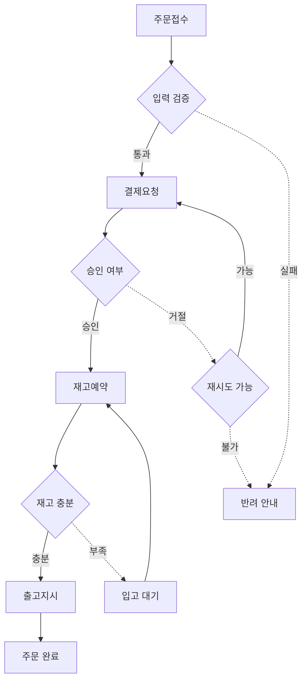
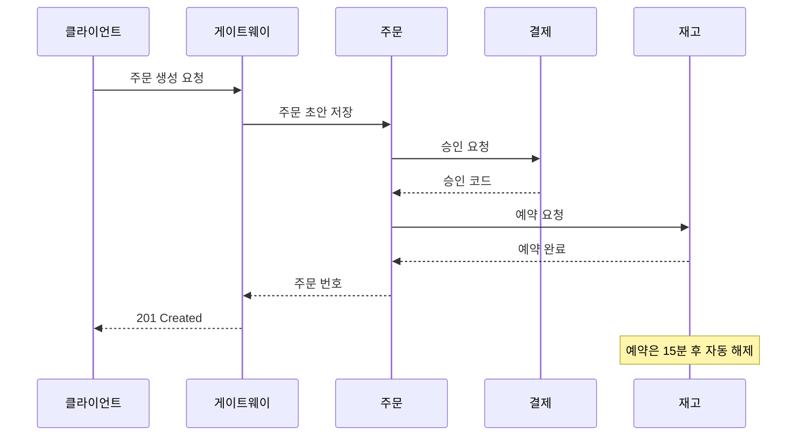
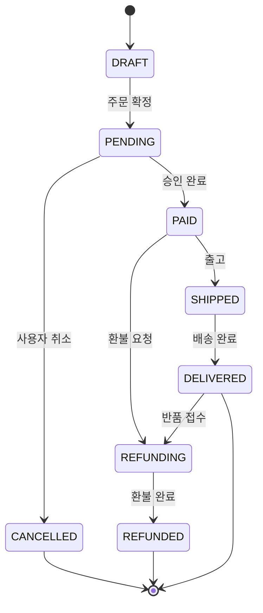
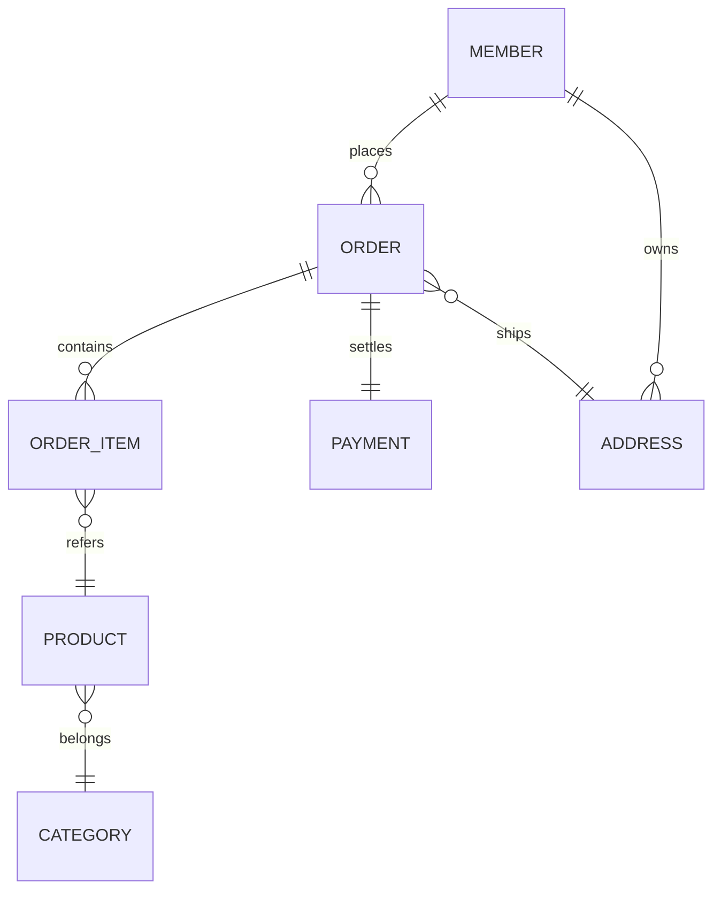
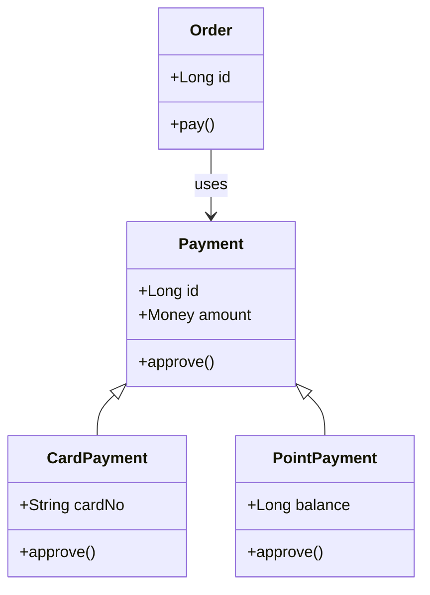

블로그 본문에 다이어그램을 넣으려다 같은 SVG 가 네 곳에서 죽는 것을 재봤다. 2026-09-01 기준, `marked` + DOMPurify 로 마크다운을 렌더하는 사이트에서 잰 값이다.

| 지점 | 증상 |
|---|---|
| sanitizer | `<style>` 과 `<use>` 가 제거된다. SVG 안에 CSS 를 못 둔다 |
| 문체 lint | SVG 한 줄이 596자짜리 문장으로 잡혀 글이 통과하지 못한다 |
| 서버 렌더 | raw HTML 을 이스케이프하면 `&lt;svg viewBox=…` 가 색인되는 본문에 섞인다 |
| CommonMark | SVG 안의 빈 줄이 HTML 블록을 끊어 뒷부분 속성이 날아간다 |

기존 도구는 예쁜 SVG 를 내준다. 넣을 수 있는 SVG 인지는 모른다.

## 무엇이 지워지는가

sanitize 를 통과하는 것과 못 하는 것을 하나씩 넣어 확인했다.

| 살아남는다 | 지워진다 |
|---|---|
| `svg` · `g` · `rect` · `line` · `path` · `polygon` · `text` | `<style>` — SVG 안에 CSS 를 못 둔다 |
| `defs` + `marker`, `marker-end="url(#…)"` | `<use href>` — 도형 재사용이 안 된다 |
| `currentColor`, `var(--토큰)` | `<script>` · `<foreignObject>` |
| `role` · `aria-label` · `text-anchor` · `viewBox` | |

네 번째 지점은 sanitizer 가 아니라 마크다운 파서 쪽이다. CommonMark 는 빈 줄에서 HTML 블록을 끝낸다. `<defs>` 와 도형 사이를 한 줄 띄우면 그 아래가 문단으로 파싱되고, 그 안의 태그는 인라인 HTML 이 되어 속성을 잃는다.

## 왜 이미지 파일이 아닌가

`` 로 넣으면 위 네 지점을 전부 피한다. 대신 테마를 잃는다.

`` 로 불린 SVG 는 자기 문서라 페이지 CSS 가 닿지 않는다. 내부의 `prefers-color-scheme` 은 OS 설정만 따라간다. 사이트가 쿠키로 테마를 토글하면 그림만 반대 톤으로 남는다.

인라인이면 같은 DOM 이라 `currentColor` 하나로 끝난다. 색은 그리는 시점이 아니라 칠하는 시점에 풀린다.

## 왜 mermaid 를 싣지 않았나

mermaid 에 렌더를 맡기면 타입을 공짜로 얻는다. 그 비용을 헤드리스 크롬으로 쟀다. jsDelivr ESM 기준 압축 후 전송량이다.

| 단계 | 누적 |
|---|---|
| mermaid 로드 | 737 KB |
| + flowchart | 840 KB |
| + sequence | 954 KB |
| + ER | 985 KB |

블로그의 메인 번들이 646 KB 다. 그림 하나 든 글을 열었다고 독자가 1 MB 를 더 받을 수는 없다.

자체 렌더러는 gzip 8.6 KB 다. 대신 레이아웃을 직접 써야 하는데, 타입 수만큼 필요하지는 않았다. 계층 그래프 엔진 하나를 flowchart·state·ER·class 가 나눠 쓰고, sequence 만 별도 레인 배치를 쓴다.

## 흐름도

방향 4종, 상자 3종, 실선과 점선, 간선 라벨, 강조 1종을 받는다. 순환이 있어도 배치가 무너지지 않는다.

````markdown

````


## 순차도

참가자는 선언 순서대로 열이 되고, 메시지는 순서대로 행이 된다. 그래프 배치가 없어 표 배치에 가깝다.

````markdown

````


## 상태도

`[*]` 는 나올 때마다 다른 노드가 된다. 시작과 끝을 한 점으로 합치면 그래프가 순환이 되어 배치가 무너진다.

````markdown

````


## ER 다이어그램

까마귀발 표기 4종을 받는다. `zeroMany` 에는 최소 하나를 뜻하는 막대를 그리지 않는다.

````markdown

````


## 클래스 다이어그램

상자 높이가 멤버 수에 따라 자란다. 상속은 화살표 머리가 부모에 붙도록 배치를 뒤집는다.

````markdown

````


## 표기는 관대하게 받는다

기능을 좁게 잡는 것과 표기를 까다롭게 받는 것은 다르다. 사람들이 실제로 치는 형태를 거부하면 마크다운에 쓴다는 말이 무의미해진다.

| | |
|---|---|
| 화살표 공백 | 있어도 없어도 된다 — `A-->B` 와 `A --> B` 가 같다 |
| id 문자셋 | 유니코드 글자·숫자·`_`. `주문 --> 결제` 가 된다 |
| 체인 | `A --> B --> C` 가 간선 두 개가 된다 |
| 후행 `;` | 무시한다 |
| 중첩 펜스 | 더 넓은 펜스 안의 `mermaid` 는 그대로 코드로 남는다 |

마지막 줄이 없으면 이 글이 성립하지 않는다. 위의 원문 블록들이 전부 그림으로 바뀌었을 것이다.

id 에 `-` 는 못 쓴다. 무공백 화살표를 받으면 `A-->B` 가 「id `A-`」와 구분되지 않는다.

## 캡션은 선택이 아니다

첫 줄의 `%% caption:` 은 세 곳에 쓰인다.

1. `<svg role="img" aria-label>` — 화면을 못 보는 사람
2. 그림 아래 마크다운 캡션 줄 — 크롤러와 JS 를 실행하지 않는 수집기
3. 파싱 실패 시 대체 텍스트

없으면 경고한다. 그림에만 있는 정보는 없는 정보다.

## 아직 안 되는 것

못 읽는 문법을 만나면 펜스를 원래 코드블록으로 남기고 경고한다. 그림이 사라지는 것보다 코드가 보이는 편이 낫다.

| 타입 | 아직 안 되는 것 |
|---|---|
| flowchart | subgraph, 자기 참조 루프 |
| sequence | `alt` · `loop` · `opt` · `par` 블록, activation box |
| state | 중첩 상태, 병렬 영역 |
| ER | 속성 목록, 키 표기 |
| class | 제네릭, 네임스페이스 |

## 쓰는 법

마크다운 렌더러 앞에 한 줄을 넣는다. DOM 조작도 플레이스홀더도 없다.

```ts
import { inlineDiagrams } from 'fencesvg';

const withDiagrams = inlineDiagrams(source, { accent: 'var(--accent)' });
const raw = marked.parse(withDiagrams, { async: false, gfm: true });
return DOMPurify.sanitize(raw, { FORBID_TAGS: ['style', 'iframe', 'form', 'input'] });
```

브라우저 API 를 쓰지 않아 Node 에서도 같은 문자열이 나온다. 글자 폭을 브라우저에서 재지 않고 내장 근사 테이블로 추정하기 때문이다. 측정에 기대면 서버 렌더에서 크기가 달라져 화면이 한 번 튄다.

런타임 의존성은 없다. gzip 8.6 KB, MIT.
