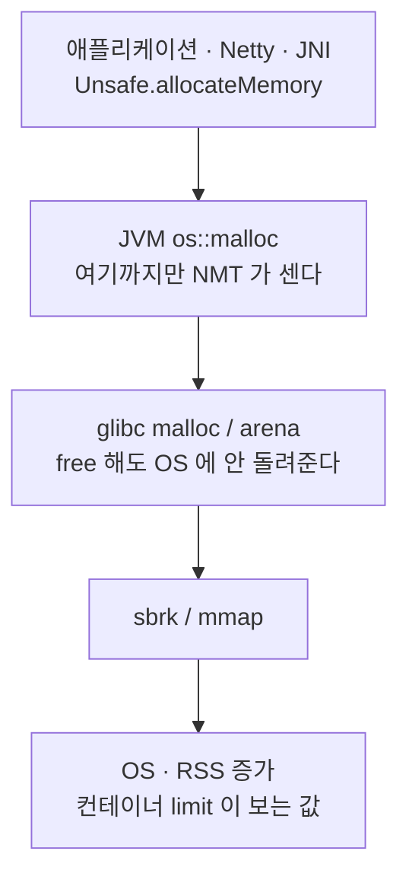

힙 사용량과 GC 가 모두 정상인데 컨테이너 메모리만 시간당 수 MB 씩 오르는 현상의 진단 절차다. NMT 출력은 OpenJDK 25.0.2, glibc 기본값은 `mallopt(3)` 기준이다.

| 항목 | 내용 |
|---|---|
| 증상 | 힙 사용량 평탄 · Major GC 0회 · 컨테이너 RSS 만 선형 증가 |
| 판별 기준 | `RSS − NMT committed` 가 벌어지면 할당기 레이어 |
| 흔한 원인 | glibc 스레드 arena 는 64MB 단위 mmap 이고 OS 에 반납되지 않는다 |
| arena 개수 상한 | 64비트에서 코어 수 × 8 |
| 확인 명령 | `jcmd <pid> VM.native_memory summary` · `/proc/<pid>/smaps` |
| 조치 | 컨테이너 환경변수 `MALLOC_ARENA_MAX=2~4` |
| 한계 | 파편화 증폭만 끊는다. 소비자 쪽 증가는 남는다 |

## JVM 프로세스 메모리는 세 층이다

`-Xmx` 는 힙만 묶는다. 컨테이너 limit 은 프로세스 RSS 전체를 본다. 그 사이에 상한 노브가 없는 지대가 있다.

| 층 | 세는 주체 | 무엇을 담나 |
|---|---|---|
| Java Heap | GC | `-Xmx` 로 묶이는 객체 영역 |
| NMT committed | JVM 내부 회계 | 힙 + Metaspace · Code cache · Thread stack · GC 구조체 · Compiler · Internal · Other |
| RSS | OS | 위 전부 + 할당기 보유분 + 서드파티 네이티브 · JNI · 에이전트 · 파일 매핑 |

논힙에는 전체를 묶는 단일 플래그가 없다. 논힙 증가를 멈추는 것은 컨테이너 limit 의 OOM Kill 뿐이다.



## 간극이 벌어진 구간이 원인의 레이어다

"어느 층이 늘었나"가 아니라 "어느 두 층 사이가 벌어졌나"로 가른다.

| 관측 | 벌어진 구간 | 원인 레이어 | 다음 수단 |
|---|---|---|---|
| 힙 사용량 증가 + Major GC 빈발 | Heap 내부 | 애플리케이션 객체 누수 | 힙 덤프 · MAT |
| 힙 평탄 + NMT 특정 카테고리 증가 | Heap ↔ NMT | JVM 내부 (Metaspace · 스레드 · Direct Buffer) | `VM.native_memory detail` |
| 힙·NMT 평탄 + RSS 만 증가 | NMT ↔ RSS | 할당기 또는 NMT 미추적 네이티브 | `smaps` · `MALLOC_ARENA_MAX` |
| NMT Other 증가 + RSS 가 그보다 더 증가 | 양쪽 | 소비자와 할당기 동시 | 소비자 규명 + arena 상한 |

Major GC 가 0회인데 컨테이너 메모리만 오르면 힙 누수가 아니다. 이 상태에서 힙 덤프를 먼저 뜨면 시간이 날아간다.

## NMT 는 프로세스 점유량을 세지 않는다

`-XX:NativeMemoryTracking=summary` 로 켜고 `jcmd` 로 읽는다. 오버헤드는 5~10% 다.

```bash
java -XX:NativeMemoryTracking=summary -jar app.jar
jcmd <pid> VM.native_memory summary scale=MB
jcmd <pid> VM.native_memory baseline          # 기준점
jcmd <pid> VM.native_memory summary.diff      # 증분만
```

출력의 첫 줄이 `reserved` 와 `committed` 를 가른다.

```text
Native Memory Tracking:

Total: reserved=13982MB, committed=884MB
       malloc: 29MB #50866, peak=35MB #47397
       mmap:   reserved=13952MB, committed=855MB

-                 Java Heap (reserved=12296MB, committed=776MB)
-                     Class (reserved=1024MB, committed=1MB)
-                    Thread (reserved=36MB, committed=1MB)
                            (threads #18)
```

`reserved` 는 가상 주소 예약이라 RSS 가 아니다. `committed` 는 JVM 이 쓰겠다고 커밋한 양이다. Oracle 문서는 추적 범위를 이렇게 못 박는다.

> NMT does not track memory allocations for third-party native code and Oracle Java Development Kit (JDK) class libraries.

따라서 `RSS − NMT committed` 는 **할당기 보유분과 미추적 네이티브의 합**이다. 카테고리를 정하지 못한 할당은 `Other` 로 떨어진다. `Other` 가 크다는 것은 출처를 JVM 도 모른다는 뜻이다.

## glibc 는 스레드마다 64MB arena 를 잡는다

arena 는 락 경합을 줄이려고 늘어나는 힙 묶음이다. 한 스레드가 쓰려는 arena 가 잠겨 있으면 다른 arena 로 옮기거나 새로 만든다.

| 튜너블 | 환경변수 | 기본값 |
|---|---|---|
| `M_ARENA_MAX` | `MALLOC_ARENA_MAX` | 0 (제한 없음, `M_ARENA_TEST` 로 유도) |
| `M_ARENA_TEST` | `MALLOC_ARENA_TEST` | 32비트 2 / 64비트 8 — 이 값이 배수라 하드 리밋은 코어 수 × 8 (64비트) |
| `M_MMAP_THRESHOLD` | `MALLOC_MMAP_THRESHOLD_` | 128KB, 동적 상승 |
| `M_TRIM_THRESHOLD` | `MALLOC_TRIM_THRESHOLD_` | 128KB |

main arena 는 `sbrk` 로 힙을 늘린다. 스레드 arena 는 `mmap` 으로 `HEAP_MAX_SIZE`(64비트 기본 64MB)를 통째로 잡는다. 64코어 노드의 상한은 512개이고, 이는 32GB 에 해당한다.

## 반납이 끊기는 메커니즘은 두 개다

1. **트림은 힙 꼭대기만 깎는다.** 중간에 살아 있는 청크가 하나라도 있으면 그 뒤 공간이 전부 붙잡힌다. 애플리케이션이 `free` 한 양과 OS 로 돌아간 양은 다른 숫자다.
2. **동적 mmap threshold 가 회수 경로를 닫는다.** 기본 128KB 지만 그 이상 크기의 블록이 `free` 될 때마다 임계값이 올라간다. 상한은 64비트에서 `4*1024*1024*sizeof(long)` 즉 32MB 다.

두 번째가 "코드도 트래픽도 그대로인데 어느 시점부터 RSS 가 오른다"의 정체다. 4MB 청크는 임계값이 그보다 낮은 동안 mmap 직행이라 `munmap` 으로 즉시 반납된다. 임계값이 4MB 를 넘어서는 순간부터 같은 크기가 arena 안에서 처리되고 반납이 끊긴다.

## 진단 절차

증거를 만들지 않는 순서로 좁힌다.

1. **힙을 배제한다.** heap committed · used · Major GC 횟수를 본다.
2. **NMT 를 baseline 잡고 시간차로 diff 한다.** 자라는 카테고리를 특정한다.
3. **RSS 와 NMT committed 를 나란히 놓는다.** 차이가 할당기 보유분이다.
4. **64MB 정렬 익명 영역을 센다.** 스레드 arena 의 서명이다.
5. **할당 건수와 용량을 분리해서 본다.** 건수는 정체인데 용량만 늘면 누수가 아니라 파편화다.

```bash
grep VmRSS /proc/<pid>/status                          # RSS
awk '/^Size:/ && $2 == 65536 {n++} END {print n+0}' \
    /proc/<pid>/smaps                                  # 64MB 블록 개수
pmap -x <pid> | awk '$2 == 65536' | wc -l              # pmap 이 있을 때
jcmd <pid> VM.native_memory summary.diff scale=MB      # NMT 증분
```

`smaps` 쪽을 먼저 쓴다. 슬림 이미지에는 `pmap` 바이너리가 없는 경우가 많고, `/proc` 는 어디에나 있다. `Size:` 값의 단위는 kB 라 64MB 는 `65536` 이다.

NMT 는 arena 개수를 보여주지 못한다. JVM 레벨 추적이기 때문이다. arena 증가를 주장하는 근거는 매핑 목록이어야 한다.

> [!warning] 증거는 재시작하면 사라진다
> NMT 와 매핑 목록은 프로세스가 살아 있을 때만 읽을 수 있다. OOM 임박 컨테이너를 급히 재시작하면 그 사이클의 증거는 사라진다.

## MALLOC_ARENA_MAX 로 상한을 고정한다

arena **개수**에 하드 리밋을 건다. 4로 두면 상한이 64MB × 4 = 256MB 로 고정된다.

```yaml
env:
  - name: MALLOC_ARENA_MAX
    value: "4"
```

| 사는 것 | 파는 것 |
|---|---|
| 논힙 점유의 상한이 예측 가능해진다 | 멀티스레드 malloc 락 경합이 증가한다 |
| 컨테이너 사이징이 성립한다 | 네이티브 라이브러리를 무겁게 쓰는 워크로드는 성능 회귀를 같이 봐야 한다 |

JVM 은 대부분 자체 메모리 관리를 하므로 malloc 호출 빈도가 낮다. Hadoop(HADOOP-7154)과 HBase(HBASE-6450)는 시작 스크립트에 4를 넣는다.

## 검증

NMT 출력은 아래로 재현한다. 값은 OpenJDK **25.0.2** · arm64 · 기동 직후 유휴 상태 기준이다.

```bash
java -XX:NativeMemoryTracking=summary Idle.java &
jcmd $! VM.native_memory summary scale=MB
```

| 값 | 실측 |
|---|---|
| Total reserved | 13,982 MB |
| Total committed | 884 MB |
| Java Heap | reserved 12,296 MB / committed 776 MB |
| Thread | reserved 36 MB / committed 1 MB (18개) |
| malloc | 29 MB, 50,866건 (peak 35 MB) |

reserved 가 committed 의 약 16배다. 컨테이너 메모리를 reserved 기준으로 잡으면 안 되는 이유가 이 비율이다.

arena 계수(절차 4번)는 glibc 리눅스에서만 성립한다. macOS 는 할당기가 달라 64MB 정렬 블록이 나오지 않는다.

## 상한을 걸어도 남는 것

`MALLOC_ARENA_MAX` 는 파편화 증폭을 끊을 뿐 소비자 쪽 할당 증가를 없애지 않는다. NMT `Other` 자체가 증가하고 있으면 소비자 레이어에도 원인이 있다.

| 수단 | 성격 |
|---|---|
| `jcmd <pid> System.trim_native_heap` | JDK 18+ Linux glibc 전용. `malloc_trim(3)` 동기 호출 |
| `-XX:MaxDirectMemorySize` 명시 | Direct Buffer 상한. 미지정 시 사실상 `-Xmx` 를 따라간다 |
| jemalloc / tcmalloc 교체 | 반납 정책이 다르다. 이미지 변경·성능 검증 비용 |
| `MALLOC_TRIM_THRESHOLD_` 하향 | 반납은 늘지만 `sbrk` 왕복이 증가한다 |

musl 기반 이미지는 arena 모델 자체가 달라 위 절차의 4번이 통하지 않는다. 컨테이너 메모리 지표가 RSS 인지 working set 인지도 확인하고 비교한다. 페이지 캐시 포함 여부가 다르다.
