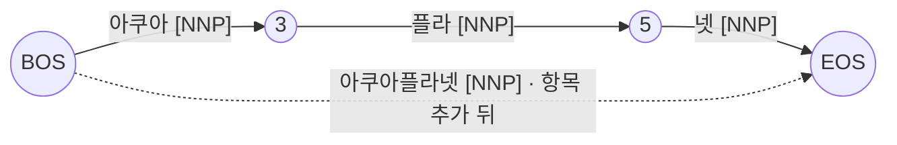

노리(nori)는 Elasticsearch · OpenSearch 의 한국어 형태소 분석기이고, 분해 결과를 바꾸는 손잡이는 세 층에 있다. OpenSearch 3.8.0 · analysis-nori 3.8.0 · lucene-analysis-nori 10.5.0 기준 실측값이다.

| 층 | 무엇을 바꾸나 | 플러그인 빌드 | 쓰는 때 |
|---|---|---|---|
| **L1** 사용자 사전 | 표층형이 맞으면 한 토큰으로 강제. 비용 · 품사 · 문맥은 고정 | 불필요 | 브랜드 · 시설명 · 복합어 추가 |
| **L2** 시스템 사전 항목 | 항목에 품사 · 비용 · 문맥 ID 를 줘서 다른 분해와 경쟁시킨다 | 필요 | 기존 항목의 품사 교정 · 삭제 |
| **L3** 비용 재학습 | 정답 분해가 붙은 도메인 코퍼스로 비용표(CRF)를 다시 배운다 | 필요 + 라벨 코퍼스 | 항목을 손으로 다 못 넣을 때 |
| 사용자 사전 항목의 값 | 단어 비용 −100000 · 품사 NNG 고정 (Lucene 상수) | — | 짧은 조각을 넣으면 남의 단어를 쪼갠다 |
| 「지도학습」의 자리 | L3 뿐 — 학습 데이터는 정답 분해, 모델은 비용표 | — | LTR 과 다른 단계를 배운다 |

## 노리는 단어를 어떻게 자르나

입력 문장의 모든 글자 경계에 노드를 두고, 사전에 있는 후보 단어를 간선으로 깐다. 간선마다 **단어 비용**이 붙고, 간선이 이어지는 자리에는 좌 · 우 **문맥 ID** 로 정해지는 **연접 비용**이 붙는다. 비터비 탐색으로 총비용이 가장 낮은 경로 하나를 고르면 그 경로의 간선이 토큰 열이다.



| 용어 | 뜻 | 값의 출처 |
|---|---|---|
| 단어 비용 | 낮을수록 그 분해를 선호 | 사전 CSV 의 넷째 열 |
| 좌 · 우 문맥 ID | 연접 비용표를 찾는 키. 품사 계열별로 정해져 있다 | `left-id.def` · `right-id.def` |
| 연접 비용 | 앞 단어의 우 ID × 뒤 단어의 좌 ID 로 찾는 값 | `matrix.def` — 3,822 × 2,693 행렬 |
| 비터비 | 총비용 최소 경로를 한 번의 왼쪽→오른쪽 탐색으로 고른다 | Lucene `KoreanTokenizer` |

## 「일반 기준」의 실체 — 비용의 출처

노리는 자체 사전이 없다. **mecab-ko-dic** 을 Lucene 빌드 시점에 바이너리로 컴파일해 jar 에 굽는다. 그 CSV 의 비용은 mecab-ko-dic 이 21세기 세종계획 말뭉치에 CRF 를 학습해 뽑은 값이라, 신문 · 소설에서 흔한 분해가 이긴다.

`_analyze?explain=true` 의 tokenizer 단계 토큰이다 (`decompound_mode: mixed`).

| 입력 | 기본 nori 분해 | 읽기 |
|---|---|---|
| 아쿠아플라넷 | 아쿠아[NNP] 플라[NNP] 넷[NNP] | 시설명이 사전에 있는 조각 셋으로 |
| 아쿠아플라넷 여수 | 아쿠아[NNP] 플라[NNP] 넷[NR] 여수[NNG] | 같은 「넷」이 문맥에 따라 수사(NR)로 |
| 글램핑 | 글램[NNP] 핑[NNP] | 업계 용어가 사전에 없다 |
| 도쿄디즈니랜드 | 도쿄[NNP] 디즈니[NNP] 랜드[NNG] | 시설명이 세 조각으로 |
| 헤이리예술마을 | 헤이리[NNP] 예술[NNG] 마을[NNG] | 지명 + 일반명사 둘 |
| 킹크랩 투어 | 킹크[NNG] 랩[NNG] 투어[NNG] | 사전 항목 자체가 어긋난 분해 (`킹크` 가 NNG 로 등재) |
| 킹사이즈 침대 | 킹사이즈[NNG·COMPOUND] 킹 사이즈 침대 | 복합어는 통째 + 조각 둘 다 (mixed) |
| 국립중앙박물관 | 국립[NNG] 중앙[NNG] 박물관[NNG·COMPOUND] 박물 관 | 복합어 판정은 「박물관」에만 |

같은 「킹」이 「라이언킹」 뒤에서는 NNP, 「킹사이즈」 안에서는 NNG 로 태깅된다. mecab-ko-dic 에 `킹` 이 MAG · NNP(인명) 두 항목으로 있어 문맥 비용이 승자를 가른다. Lucene 버전에 묶인 mecab-ko-dic 버전이 다르면 분해와 품사가 달라지고, 그 차이는 뒤에 오는 품사 필터와 동의어 룰까지 바꾼다.

## 세 층이 각각 무엇을 바꾸나

| 층 | 어떻게 | 기존 항목 교정 | 엔진 버전 의존 |
|---|---|---|---|
| **L1** `user_dictionary` · `user_dictionary_rules` | txt 파일 또는 인덱스 설정 인라인. 복합어는 `세종시 세종 시` 형식 | 못 한다 — 덧붙이기만 | 없음 |
| **L2** 시스템 사전 항목 | mecab-ko-dic 에 CSV 추가 → Lucene 빌드 → 플러그인 빌드. `mecab-dict-index -a` 가 `model.def` 로 새 항목 비용을 자동 산정 | 한다 — 교정 · 삭제 | 엔진 판올림마다 재빌드 |
| **L3** 비용 재학습 | 정답 형태소 경계 · 품사가 붙은 코퍼스로 `mecab-cost-train` → 사전 재생성 → L2 와 같은 빌드 | 한다 — 표 전체 | 엔진 판올림마다 재빌드 + 코퍼스 유지 |

시스템 사전 항목 한 줄은 이렇게 생겼다 (mecab-ko-dic CSV).

```text
아쿠아플라넷,1786,3546,1000,NNP,*,T,아쿠아플라넷,*,*,*,*
에버랜드,1789,3552,5497,NNP,지명,F,에버랜드,*,*,*,*      ← 기본 사전에 있는 항목
```

| 필드 | 값 | 뜻 |
|---|---|---|
| 표층형 | `아쿠아플라넷` | 등록 단어 |
| 좌 · 우 문맥 ID | `1786` / `3546` | `left-id.def` 의 `NNP,*,*` · `right-id.def` 의 `NNP,*,T` |
| 단어 비용 | `1000` | 낮을수록 선호. 다른 경로와 **경쟁**한다 |
| 품사 | `NNP` | 고유 명사. 품사 필터 · 동의어 룰이 이 태그를 본다 |
| 종성 유무 | `T` | 받침 있음(넷) — 조사 결합 판정용 |
| 타입 · 첫/끝 품사 · 표현 | `*` | 단일어. 복합어면 `Compound` 와 분해 표현 |

「지도학습」이라는 말은 L3 에서 나온다. 학습 데이터는 **정답 분해가 붙은 문장**, 모델은 **비용표**다. L2 는 사람이 비용을 적거나 기존 모델로 산정하므로 수동이고, L3 는 그 비용을 도메인 데이터에서 배운다.

> [!NOTE] 플러그인 빌드가 필요한 이유
> ES · OS 의 nori 플러그인은 `user_dictionary` 만 노출하고 시스템 사전 교체 옵션이 없다. 사전이 jar 안에 있으므로 mecab-ko-dic → Lucene → 플러그인 순서로 다시 굽는다. 관리형 OpenSearch 도 커스텀 플러그인 패키지를 받지만, 엔진 버전마다 재빌드 · 재등록이 따라온다.

## 사용자 사전으로 어디까지 되나

사용자 사전 항목이 어떤 값으로 격자에 들어가는지는 Lucene 코드에 상수로 박혀 있다. OpenSearch 3.8.0 번들 jar 에서 `javap -constants` 로 읽은 값이다.

```java
// lucene-analysis-nori-10.5.0.jar · org.apache.lucene.analysis.ko.dict.UserDictionary
private static final int   WORD_COST  = -100000;
private static final short LEFT_ID    = 1781;
private static final short RIGHT_ID   = 3533;   // 받침 유 3535 · 무 3534
// UserMorphData.getLeftPOS / getRightPOS → NNG
```

항목마다 비용 · 품사 · 문맥을 줄 필드가 없다. 모든 항목이 −100000 이라 수천 단위의 연접 비용을 압도한다 — 표층형이 맞으면 **경쟁 없이 이긴다**. 이 성질이 되는 것과 안 되는 것을 동시에 만든다.

등록 규칙 `아쿠아플라넷` · `글램핑` · `킹` · `라이언킹` · `도쿄디즈니랜드 도쿄 디즈니랜드` 를 인라인으로 준 결과다.

| 입력 | 기본 nori | 사용자 사전 적용 | 판정 |
|---|---|---|---|
| 아쿠아플라넷 | 아쿠아 플라 넷 | 아쿠아플라넷 | <span class="pill p-green">해결</span> |
| 아쿠아플라넷 여수 | 아쿠아 플라 넷 여수 | 아쿠아플라넷 여수 | <span class="pill p-green">해결</span> |
| 글램핑장 예약 | 글램 핑장 예약 | 글램핑 장 예약 | <span class="pill p-green">해결</span> |
| 라이언킹 극장 | 라이언 킹 극장 | 라이언킹 극장 | <span class="pill p-green">해결</span> |
| 도쿄디즈니랜드 | 도쿄 디즈니 랜드 | 도쿄디즈니랜드 + 도쿄 디즈니랜드 | <span class="pill p-green">해결</span> |
| 런던 라이언 킹 | 런던 라이언 킹[NNP] | 런던 라이언 킹[NNG] | <span class="pill p-amber">품사 바뀜</span> |
| 바이킹 크루즈 | 바이킹 크루즈 | 바이 킹 크루즈 | <span class="pill p-red">회귀</span> |
| 랭킹 | 랭킹 | 랭 킹 | <span class="pill p-red">회귀</span> |
| 킹사이즈 침대 | 킹사이즈 + 킹 사이즈 침대 | 킹 사이즈 침대 | <span class="pill p-red">복합어 토큰 소실</span> |
| 킹크랩 투어 | 킹크 랩 투어 | 킹 크랩 투어 | <span class="pill p-amber">다른 오분석</span> |
| 프라이빗 투어 | 프라이빗 투어 | 프라이빗 투어 | <span class="pill">변화 없음</span> |

**되는 것**

- 단어 추가 — 브랜드 · 시설명 · 업계 용어를 한 토큰으로
- 복합어 분해 지정 — mixed 모드에서 통째 토큰과 조각을 함께 색인
- 긴 표층형으로 짧은 다의어 우회 — `킹` 대신 `라이언킹` 을 등록하면 문제 문맥만 잡힌다
- 플러그인 빌드 없이, 엔진 버전과 무관하게 적용

**안 되는 것**

- 항목별 품사 · 비용 지정 — 필드가 없다. L3 는 이 층에서 정의상 불가능하다
- 문맥 경쟁 — 짧은 항목은 남을 쪼갠다. `킹` 하나로 `바이킹` · `랭킹` 이 갈라지고 `킹사이즈` 복합어 토큰이 사라진다
- 기존 항목 교정 · 삭제 — `킹크랩 → 킹크 랩` 같은 기본 사전 오분석은 덮어쓸 방법이 없다

> [!IMPORTANT] 규칙 — 사용자 사전에는 짧은 조각이 아니라 긴 표층형을 등록한다
> 이 규율 하나로 단어 추가 문제의 대부분은 L1 안에서 끝난다. 시스템 사전(플러그인)이 꼭 필요한 일은 **품사 교정 · 항목 삭제 · 비용 재학습** 셋으로 좁혀진다.

`decompound_mode` 가 `discard`(기본값)면 복합어의 통째 토큰이 색인에서 빠진다. 사용자 사전의 `도쿄디즈니랜드 도쿄 디즈니랜드` 도 `discard` 에서는 조각 둘만 남는다.

| 입력 | mixed · 사전 적용 | discard · 사전 적용 |
|---|---|---|
| 도쿄디즈니랜드 | 도쿄디즈니랜드 + 도쿄 디즈니랜드 | 도쿄 디즈니랜드 |
| 킹사이즈 침대 (`킹` 등록) | 킹 사이즈 침대 | 킹 사이즈 침대 |

인덱스 설정에 인라인으로 주는 모양이다. 파일을 마운트할 수 없는 환경에서는 이 쪽이 유일한 L1 이다.

```json
{
  "settings": {
    "analysis": {
      "tokenizer": {
        "nori_user": {
          "type": "nori_tokenizer",
          "decompound_mode": "mixed",
          "user_dictionary_rules": ["아쿠아플라넷", "글램핑", "도쿄디즈니랜드 도쿄 디즈니랜드"]
        }
      }
    }
  }
}
```

## LTR 과 무엇이 같고 다른가

둘 다 손튜닝을 라벨 데이터로 학습한 모델로 바꾼다. 다른 것은 **파이프라인의 어느 단계**를 배우느냐다.


| | 분해 비용 재학습 (L3) | LTR |
|---|---|---|
| 학습 데이터 | 정답 형태소 경계 · 품사가 붙은 문장 | 쿼리–문서 쌍과 관련도 라벨(클릭 · 구매 · 판정) |
| 모델이 내는 것 | 단어 비용 · 연접 비용표 | 문서 점수(재정렬 함수) |
| 적용 시점 | 색인할 때와 쿼리를 받을 때 — 둘이 같아야 한다 | 1차 검색 결과 상위 N 을 다시 정렬할 때 |
| 틀리면 | 토큰이 어긋나 매칭 자체가 안 되거나 엉뚱한 조각이 매칭 | 매칭은 되지만 순서가 나쁨 |

노리 커스텀은 LTR 이 아니라 **LTR 앞 단계**다. 토큰이 도메인에 맞아야 BM25 든 LTR 의 피처든 그 위에 선다.

## 언제 어느 층인가

1. **브랜드 · 시설명 · 복합어를 한 토큰으로** → L1. 긴 표층형으로 등록하고 끝
2. **짧은 다의어가 동의어 룰이나 품사 필터를 흔든다** → L1. 조각이 아니라 문제 문맥의 복합어(`라이언킹`)를 등록
3. **기존 항목의 품사가 틀렸거나 항목을 지워야 한다** → L2. 사용자 사전은 덧붙이기만 한다
4. **항목을 손으로 다 넣을 수 없고 도메인 전체 분해 품질을 올려야 한다** → L3. 단 **라벨 코퍼스가 먼저**다

| 층 | 대가 |
|---|---|
| L1 | 없음. 재색인 한 번 |
| L2 | 플러그인 빌드 파이프라인(mecab-ko-dic → Lucene → 플러그인)을 직접 소유. 엔진 판올림마다 재빌드 · 재등록 |
| L3 | L2 의 대가 + 정답 분해가 붙은 도메인 코퍼스와 라벨링 인력 |

## 검증

같은 값을 다시 내는 명령이다. 보안 플러그인을 끈 로컬 컨테이너 기준이다.

```bash
docker run -d --name nori -p 19200:9200 -e discovery.type=single-node \
  -e DISABLE_SECURITY_PLUGIN=true -e DISABLE_INSTALL_DEMO_CONFIG=true \
  opensearchproject/opensearch:3.8.0
docker exec nori bin/opensearch-plugin install --batch analysis-nori && docker restart nori

# 기본 분해
curl -s localhost:19200/_analyze -H 'Content-Type: application/json' -d '{
  "tokenizer": {"type": "nori_tokenizer", "decompound_mode": "mixed"},
  "text": "아쿠아플라넷 여수", "explain": true}'

# 사용자 사전 적용 — 인덱스 없이 tokenizer 정의를 인라인으로
curl -s localhost:19200/_analyze -H 'Content-Type: application/json' -d '{
  "tokenizer": {"type": "nori_tokenizer", "decompound_mode": "mixed",
                "user_dictionary_rules": ["아쿠아플라넷", "글램핑", "킹", "라이언킹", "도쿄디즈니랜드 도쿄 디즈니랜드"]},
  "text": "바이킹 크루즈", "explain": true}'

# 사용자 사전 상수
docker exec nori bash -c 'jdk/bin/javap -p -constants \
  -cp plugins/analysis-nori/lucene-analysis-nori-10.5.0.jar \
  org.apache.lucene.analysis.ko.dict.UserDictionary | grep -E "WORD_COST|_ID"'
```

| 항목 | 값 |
|---|---|
| 측정일 | 2026-09-22 |
| 엔진 | OpenSearch 3.8.0 · analysis-nori 3.8.0 · Lucene 10.5.0 |
| 사전 | Lucene 이 굽는 mecab-ko-dic. CSV 대조는 2.1.1-20180720 (`matrix.def` 3822 × 2693, `model.def` 26 MB) — 잰 분해와 항목이 일치 |
| 토큰 단계 | `_analyze?explain=true` 의 `tokenizer` 토큰. 필터 없음 |

사전 버전이 다른 클러스터에서는 기본 분해가 달라질 수 있다. 사용자 사전 상수(−100000 · NNG)는 버전 공통이다.
