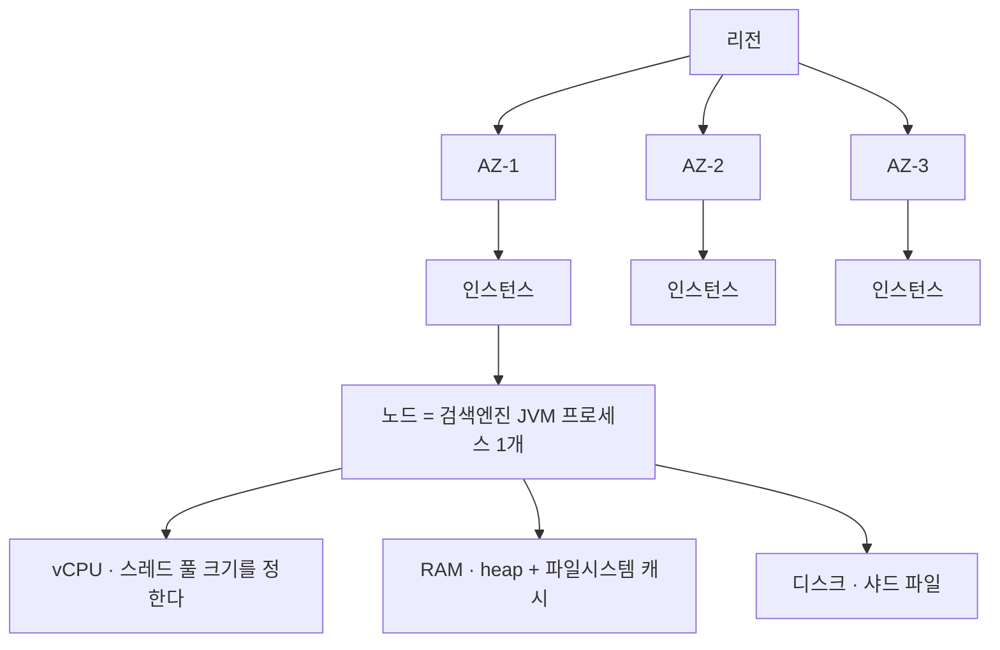
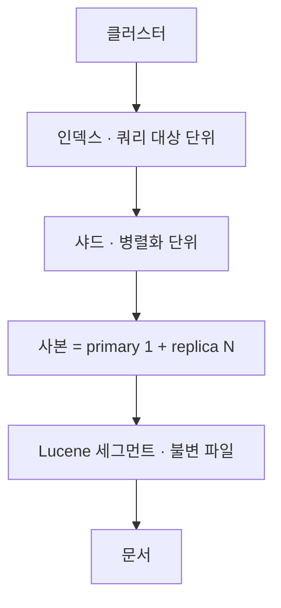
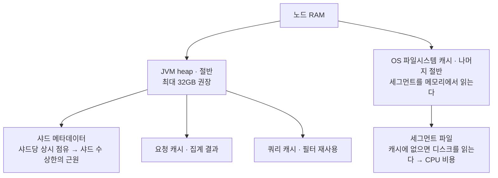
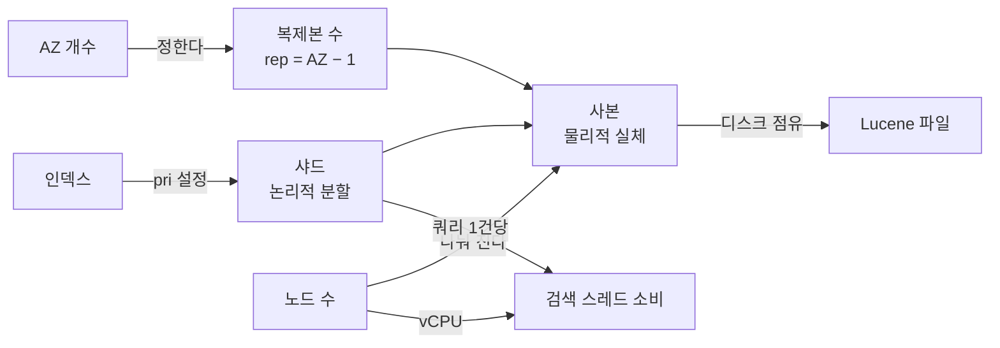
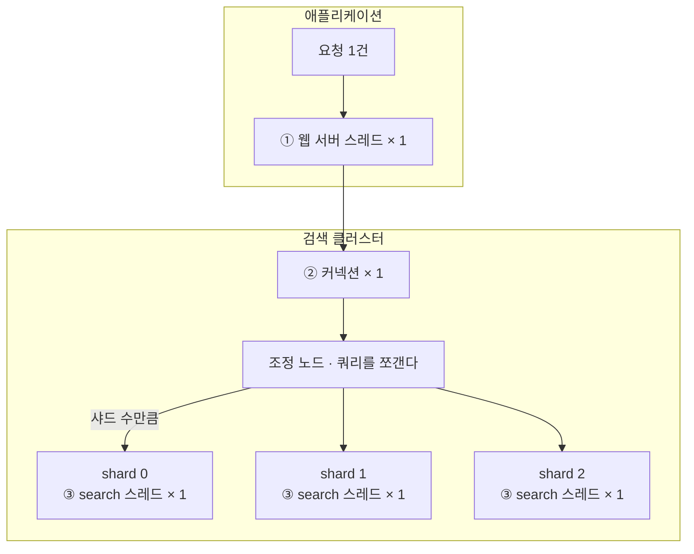
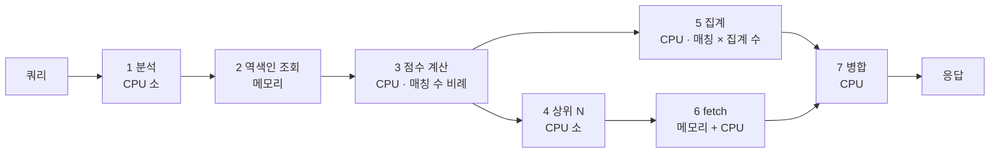

검색 클러스터의 노드 수와 사양은 자원별 산정 공식으로 정하고, CPU 만 측정으로 정한다. Elasticsearch · OpenSearch 계열 엔진과 AWS 매니지드 환경 기준이다.

| 항목 | 값 |
|---|---|
| 복제본 수 | `AZ 개수 − 1` — 3-AZ 면 `replicas=2` |
| 최소 데이터 노드 | `replicas + 1`, AZ 개수의 배수 |
| master-eligible | 전용 · 홀수 · 최소 3대, 쿼럼 `⌊n/2⌋ + 1` |
| heap 당 샤드 | 1GB 당 20개 이하 |
| 샤드 크기 | 10 ~ 50 GB |
| 저장 용량 | `원본 × (1 + replicas) × 1.45` |
| search 스레드 풀 | `(vCPU × 3) / 2 + 1` — 설정이 아니라 파생값 |
| 쿼리 1건이 쓰는 스레드 | 샤드 수만큼 |
| CPU | 공식 없음 — `_nodes/stats` 델타를 작업별로 분해해 측정 |
| CPU 를 쓰는 곳 | 점수 계산 · 집계 — 매칭 문서 수 × 집계 수에 비례. 역색인 조회만 메모리가 주 자원 |
| 클러스터 간 CPU 비교 | 백분율이 아니라 샤드 쿼리 1건당 CPU 시간 — `query_time_in_millis ÷ query_total` 델타 |
| 노드 수 결정 | 제약별 필요 노드 수의 **최댓값**을 **AZ 개수의 배수로 올림** |

## 클러스터는 다섯 개의 축이 겹쳐 있다

"노드", "샤드", "스레드"를 한 줄에 놓고 이야기하면 엉킨다. 성격이 다른 다섯 계층이고, 각 축이 제약하는 자원도 다르다.

| 축 | 단위 | 이것이 정하는 것 | 부족하면 나타나는 증상 |
|---|---|---|---|
| **물리** | AZ · 인스턴스 · 노드 | 가용성 · 총 자원 | 장애 시 데이터 손실 |
| **논리** | 인덱스 · 샤드 · 사본 | 쿼리 팬아웃 크기 | 쿼리 하나가 스레드를 과하게 점유 |
| **역할** | master · data · ingest · coordinating | 안정성 | 한 기능의 포화가 전체로 번짐 |
| **실행** | 스레드 풀 | 동시성 상한 | 큐 적체 → rejected → 검색 실패 |
| **메모리** | heap · 파일시스템 캐시 | 수용 가능한 샤드 수 · 캐시 적중률 | GC 지연, 디스크 재읽기 |

### 물리 축 — 하드웨어가 놓이는 방식



매니지드 서비스에서는 **인스턴스 1대 = 노드 1개**로 고정된다. "노드를 키운다"가 곧 "인스턴스 타입을 바꾼다"다.

### 논리 축 — 데이터가 쪼개지는 방식



### 메모리 축 — 두 종류를 구분해야 한다

노드 메모리를 heap 하나로만 보면 판단이 어긋난다. **heap 은 절반만 쓰는 것이 정석**이고, 나머지 절반은 OS 가 파일시스템 캐시로 쓴다. 검색 성능의 상당 부분이 여기서 나온다.



> [!IMPORTANT] heap 사용률이 낮다고 메모리에 여유가 있는 것은 아니다
> 파일시스템 캐시가 데이터 크기에 비해 작으면 세그먼트를 반복해서 디스크에서 읽고, 그 비용은 **CPU 사용률로 나타난다.** 캐시 부족이 CPU 부족으로 보인다.

## AZ · 노드 · 샤드 · 사본은 각각 다른 것이 정한다

네 개념이 자주 섞인다. 무엇이 무엇을 결정하는지 정리해 두면 증설 논의가 빨라진다.

| 개념 | 정하는 주체 | 성격 | 이것이 제약하는 것 |
|---|---|---|---|
| **AZ** | 클라우드 리전 구성 | 물리적 장애 경계 | **복제본 수** |
| **노드** | 인프라 설정 | 프로세스 | 총 vCPU · 사본을 나눠 지는 대수 |
| **인덱스** | 애플리케이션 | 논리 | 쿼리 대상 |
| **샤드** | 인덱스 설정 `pri` | **논리적 분할** | 쿼리당 필요한 스레드 수 |
| **사본** | 인덱스 설정 `rep` | **물리적 실체** — 디스크의 파일 | 디스크 사용량 · 읽기 처리량 |



### 논리와 물리의 경계

```text
인덱스        논리 — 문서의 묶음
 └ 샤드       논리 — "몇 조각으로 나눌지"라는 설계
    └ 사본    물리 — 디스크에 실재하는 Lucene 파일
```

`shard 0` 은 이름이고, 디스크에 있는 것은 **그 샤드의 사본들**이다. primary 와 replica 는 이름표가 아니라 **서로 다른 파일**이며, `rep=2` 이면 디스크를 원본의 3배 쓴다. 두 사본의 차이는 **쓰기가 먼저 도착하는 쪽이 primary** 라는 것뿐이고, 읽기는 둘을 구분하지 않는다.

### 배치를 두 방향으로 읽는다

샤드 3개 × 사본 3벌을 노드 3대에 놓은 경우다.

| | AZ-1 · 노드 A | AZ-2 · 노드 B | AZ-3 · 노드 C |
|---|---|---|---|
| shard 0 | replica | replica | **PRIMARY** |
| shard 1 | **PRIMARY** | replica | replica |
| shard 2 | replica | **PRIMARY** | replica |

- **가로로 읽으면 내구성** — 한 샤드의 사본이 AZ 세 곳에 하나씩. AZ 하나가 내려가도 모든 샤드가 살아남는다.
- **세로로 읽으면 처리량** — 노드 하나가 모든 샤드를 하나씩 가진다. 단, **사본 수와 노드 수가 같을 때만** 성립한다.

> [!WARNING] AZ 와 노드의 비율은 고정이 아니다
> AZ 는 물리적 장애 경계이고 노드는 프로세스다. 서로 다른 층이며, 클라우드가 노드를 AZ 에 균등 분배할 뿐이다.
> 노드 3대 · AZ 3개면 AZ 당 1대지만, 노드 6대면 AZ 당 2대가 된다. **AZ 수가 그대로면 복제본 수는 노드를 늘려도 변하지 않는다** — 복제본 수를 정하는 것은 노드 수가 아니라 AZ 수다.

## 쿼리 하나가 스레드를 몇 개 쓰는가

용량 계산에서 가장 자주 틀리는 지점이다. 필요한 스레드는 초당 요청 수가 아니라 **초당 요청 수 × 요청당 샤드 수**다.

### 동시성을 제한하는 층은 셋이다

이름이 비슷해 섞이기 쉽지만, 셋은 각각 다른 프로세스에 있다.

| 층 | 있는 곳 | 무엇인가 | 무엇이 크기를 정하는가 |
|---|---|---|---|
| ① 웹 서버 스레드 | 애플리케이션 JVM | 요청을 응답까지 붙들고 있는 스레드 | 앱 설정 |
| ② HTTP 커넥션 | 앱 → 클러스터 | 소켓. 스레드가 아니다 | 앱 설정 |
| **③ search 스레드** | **클러스터 데이터 노드 JVM** | 샤드 하나에 대한 쿼리를 실행 | **노드당 vCPU** |

> [!IMPORTANT] vCPU 는 커넥션과 무관하다
> vCPU 는 노드의 연산 자원이고, 거기서 ③의 크기가 파생된다. ①②를 늘려도 ③은 그대로이며, ③ 앞의 대기열만 길어진다.



### 스레드 풀 크기는 설정이 아니라 파생값이다

```text
search 스레드 = (vCPU × 3) / 2 + 1

  2 vCPU  →   4개
  4 vCPU  →   7개
  8 vCPU  →  13개
 16 vCPU  →  25개
```

큐가 차면 `rejected` 가 발생하고, 그것은 곧 **샤드 쿼리 실패 = 검색 실패**다. `rejected` 가 0에서 벗어나기 전에 `queue` 가 먼저 0을 벗어나므로, **queue 가 선행 지표**다.

## CPU 는 무엇에 쓰이는가

메모리는 데이터를 **얼마나 빨리 읽느냐**를 정하고, CPU 는 읽은 데이터로 **얼마나 계산하느냐**를 정한다. 검색은 본질적으로 연산이라 메모리가 남아도 CPU 가 먼저 찬다.

### 쿼리 하나가 지나는 일곱 단계

| 단계 | 하는 일 | 주로 쓰는 자원 | 규모 |
|---|---|---|---|
| 1. 쿼리 분석 | 토큰화 · 동의어 확장 | CPU | 작음 |
| 2. 역색인 조회 | 각 단어의 문서 목록(posting list) 찾기 | **메모리** — 캐시에 있으면 빠르고 없으면 디스크 | 단어 수에 비례 |
| 3. **점수 계산** | 매칭된 **모든** 문서에 BM25 계산 | **CPU** | 매칭 문서 수에 비례 |
| 4. 상위 N 추출 | 우선순위 큐로 상위 N 개 선별 | CPU | 작음 |
| 5. **집계** | 매칭된 **모든** 문서를 집계마다 순회 | **CPU — 가장 큼** | 매칭 수 × 집계 수 |
| 6. fetch | 상위 N 건의 `_source` 읽기 · 압축 해제 | 메모리 + CPU | N 에 비례 |
| 7. 병합 | 조정 노드가 샤드별 결과를 합침 | CPU | 샤드 수에 비례 |



### 집계가 CPU 를 먹는 이유

사용자는 상품 10개를 보지만, 엔진은 **매칭된 전부**에 점수를 매기고 집계마다 다시 훑는다. 필터 패널이 풍부한 검색일수록 집계가 많다.

```text
매칭 2,000건 × 집계 10개  =  20,000회 문서 방문 / 쿼리 1건
매칭 2,000건 × 상위 10건  =  사용자가 보는 것
```

3·5단계가 매칭 수에 비례하므로 **넓게 매칭되는 쿼리(도시명 · 카테고리명)가 좁은 쿼리보다 훨씬 비싸다.** 쿼리 수가 같아도 쿼리 분포가 바뀌면 CPU 가 달라지는 이유다.

> [!IMPORTANT] 메모리 부족은 CPU 사용률로 나타난다
> 2단계에서 세그먼트가 파일시스템 캐시에 없으면 디스크를 읽고, 그 대기와 재읽기가 **CPU 사용률로 잡힌다.** heap 사용률이 낮아도 파일캐시가 작으면 CPU 가 먼저 찬다.
> **query cache 적중률**이 낮으면 이 상태를 의심한다.

### 백분율의 함정 — 두 클러스터의 CPU 사용률은 그대로 비교하지 않는다

Elasticsearch 와 OpenSearch 를 나란히 두고 이관하는 경우처럼, 두 클러스터의 CPU 사용률을 그대로 비교하면 틀린다. 백분율은 **분모(총 vCPU)에 따라** 달라진다.

```text
클러스터 A   검색에 쓴 CPU 3.2 vCPU  ÷  64 vCPU  =   5%
클러스터 B   검색에 쓴 CPU 1.6 vCPU  ÷  16 vCPU  =  10%

B 의 백분율이 2배 높지만, 실제로 쓴 연산량은 A 의 절반이다.
```

효율은 **샤드 쿼리 1건당 CPU 시간**, 곧 `query_time_in_millis ÷ query_total` 의 델타로 본다. 이 값을 재면 "CPU 가 높다"가 "코어가 적다"인지 "쿼리가 비싸다"인지 갈린다.

### 삭제 문서가 CPU 를 먹는다

문서를 지우면 세그먼트에서 즉시 사라지지 않고 **삭제 표시**만 붙어, 머지 전까지 스캔 대상에 남아 3·5단계 비용에 그대로 얹힌다.

```text
GET  _cat/indices?v&h=index,docs.count,docs.deleted   # 10% 를 넘으면 같은 쿼리가 그만큼 비싸진다 — 갱신이 잦은 인덱스에서 흔하다
POST {index}/_forcemerge?only_expunge_deletes=true    # 삭제 표시만 정리
```

> [!WARNING] `_forcemerge` 자체가 머지 CPU 를 쓴다
> 트래픽이 낮은 시간에 돌린다.

## 자원별 산정 공식

노드 수는 아래 제약을 각각 계산해 **최댓값을 취하고, AZ 개수의 배수로 올림**하면 나온다. CPU 만 공식이 없다.

| 제약 | 공식 | 축 |
|---|---|---|
| master-eligible 노드 | 홀수 · 최소 3대, 쿼럼 `⌊n / 2⌋ + 1` | 가용성 |
| 최소 데이터 노드 | `노드 수 ≥ replicas + 1` | 배치 제약 |
| AZ 균등 배치 | `노드 수 = AZ 개수의 배수`, `replicas = AZ 개수 − 1` | 가용성 |
| heap 당 샤드 수 | `노드 수 ≥ 총 샤드 사본 ÷ (heap GB × 20)` | 메모리 |
| 저장 용량 | `노드 수 ≥ 원본 × (1 + replicas) × 1.45 ÷ 노드당 디스크` | 디스크 |
| 샤드 크기 | 샤드 1개당 10 ~ 50 GB | 논리 설계 |
| CPU | **공식 없음** — 부하 테스트 또는 운영 측정 | 측정 |

### master-eligible 노드 — 가용성

```text
홀수 · 최소 3대     쿼럼 = ⌊n / 2⌋ + 1
```

마스터는 과반으로 선출된다. 3대면 쿼럼이 2이므로 1대를 잃어도 유지된다. 2대라면 1대만 잃어도 과반이 깨져 멈춘다.

> [!TIP] 전용 마스터로 연쇄를 끊는다
> 데이터 노드가 마스터를 겸하면, 검색으로 CPU 가 포화될 때 클러스터 상태 관리까지 늦어진다. 부하가 부하를 부르는 구조다.
> 전용 마스터는 데이터를 갖지 않으므로 작은 인스턴스면 충분하다.

### 최소 데이터 노드 — 배치 제약

```text
노드 수 ≥ replicas + 1
```

같은 샤드의 사본 둘은 한 노드에 놓일 수 없다. 사본 수가 노드 수를 넘으면 배치가 불가능해 미할당 샤드가 생긴다.

### AZ 균등 배치 — 가용성

```text
노드 수 = AZ 개수의 배수     replicas = AZ 개수 − 1
```

AZ 마다 사본을 하나씩 두면 AZ 하나를 잃어도 모든 샤드가 살아남는다. 3-AZ 환경에서 `replicas=2` 가 기본이 되는 이유다.

> [!WARNING] AZ 인식(zone awareness)이 켜져 있어야 보장된다
> 꺼져 있으면 AZ 가 3개라도 사본이 한 AZ 에 몰릴 수 있다.

### heap 당 샤드 수 — 메모리

```text
노드 수 ≥ 총 샤드 사본 ÷ (heap GB × 20)
```

샤드는 하나당 heap 을 상시 점유한다. 권장 밀도는 **heap 1GB 당 20개 이하**다(벤더에 따라 25를 쓰기도 한다). 넘어서면 GC 가 잦아지고 클러스터 상태가 무거워진다.

> [!NOTE] 데이터가 적은데 인덱스가 많은 환경에서는 저장 용량보다 **이 제약이 먼저 걸린다.**

### 저장 용량 — 디스크

```text
노드 수 ≥ 원본 × (1 + replicas) × 1.45 ÷ 노드당 디스크
```

계수 1.45는 인덱싱 오버헤드(약 10%)와 머지용 여유 공간, 운영 여유분을 합한 값이다. 사본 수만큼 곱해야 한다는 점을 빠뜨리기 쉽다.

### 샤드 크기 — 논리 설계

```text
샤드 1개당 10 ~ 50 GB
```

너무 크면 리커버리와 머지가 길어지고, 너무 작으면 샤드 개수가 불어나 heap 제약에 먼저 걸린다. `pri` 는 인덱스 생성 후 바꿀 수 없으므로 설계 시점에 정해야 한다.

### CPU — 공식 없음 · 측정

```text
부하 테스트 또는 운영 측정으로 산출
```

벤더 문서도 CPU 는 공식을 제시하지 않는다 — 쿼리 복잡도, 집계 종류, 캐시 적중률, 문서 크기에 따라 자릿수가 달라진다. **그래서 이것만은 반드시 재야 한다** — 방법은 다음 절이다.

> [!NOTE] 산정 절차
> 각 제약으로 필요 노드 수를 계산 → **최댓값**을 취함 → **AZ 개수의 배수로 올림**.
> 여러 제약이 동시에 걸리는 경우는 드물고, 보통 하나가 지배적이다. **어느 제약이 지배적인지 아는 것이 증설 범위를 좁히는 핵심**이다 — CPU 가 부족한데 디스크를 늘리면 돈만 쓴다.

## CPU 는 이렇게 측정한다

누적 카운터를 보면 거의 항상 틀린 결론이 나온다. 색인 시간이 검색의 수십 배로 보이기 때문이다. 누적에는 야간 배치가 들어 있다.

### 델타로 재고, 작업별로 쪼갠다

1. `_nodes/stats/indices` 를 호출해 저장한다
2. 60 ~ 90초 기다린다
3. 다시 호출해 저장한다
4. 두 값의 차를 작업별로 나눈다

| 작업 | 성격 |
|---|---|
| `search` / `fetch` | 읽기 비중에 비례한다 |
| `indexing` / `merges` / `refresh` / `flush` | 읽기 비중과 무관한 고정 부하 |

각 작업의 CPU 시간 합을 **측정 구간 × 총 vCPU** 로 나누면 자원 점유율이 나온다. 이 값이 `_cat/nodes` 의 실측 CPU 와 맞아떨어지면 분해가 신뢰할 만하다는 뜻이다.

```text
점유율 = 작업 CPU 시간 ÷ (측정 초 × 1000 × 총 vCPU) × 100
```

### 트래픽 비중으로 나눈다

검색 CPU 는 읽기 비중에 비례하고 쓰기는 고정이다. 목표 비중에서의 CPU 는 이렇게 추정한다.

```text
목표 CPU = 검색 CPU × (목표 비중 ÷ 측정 시점 비중) + 고정 부하
```

> [!WARNING] 측정 시점의 실제 비중을 써야 한다
> 설정한 비율(예: A/B 30%)과 **실제로 넘어간 트래픽 비중은 다르다.** 실험 대상이 아닌 경로, 캐시에서 끝난 요청 등이 빠지기 때문이다.
> 애플리케이션에서 백엔드별 호출 수를 세어 **실측 비중**으로 계산해야 한다.

### 판단 지표와 임계값

| 지표 | 무엇을 말하는가 | 임계 |
|---|---|---|
| **CPU 사용률** | 가장 먼저 포화되는 자원. 누적이 아닌 델타로, 작업별로 분해해 본다 | 지속 70% 미만 |
| JVM memory pressure | heap 압박. 75% 를 넘으면 old gen GC 가 잦아진다 | 85% 미만 |
| **search rejected** | 큐가 차서 버린 샤드 쿼리. **1 이상이면 이미 검색 실패가 나갔다** | 0 |
| search queue | rejected 의 선행 지표. 0에서 벗어나면 여유가 사라지는 중 | 0 근처 |
| search latency | 비중을 올렸는데 오르지 않으면 아직 여유가 있다는 뜻 | 기준선 대비 |
| 노드당 샤드 / heap GB | 샤드 하나가 heap 을 상시 점유한다 | 20 이하 |
| query cache 적중률 | 낮으면 세그먼트를 반복해 읽는다 → 파일캐시 부족 신호 | 클러스터 간 비교 |
| 샤드 쿼리 1건당 CPU 시간 | `query_time_in_millis ÷ query_total` 델타. 클러스터 간 효율은 백분율이 아니라 이 값으로 비교한다 | 클러스터 간 비교 |
| `docs.deleted` 비율 | 삭제 표시 문서가 점수 계산 · 집계 스캔에 그대로 남는다 | 10% 미만 |
| 데이터 : 파일캐시 비율 | 노드당 데이터가 캐시의 몇 배인가 | 낮을수록 좋다 |
| unassigned shards | 배치되지 못한 샤드. 0이 아니면 green 이 아니다 | 0 |

## 스케일업과 스케일아웃

총 vCPU 와 검색 스레드는 어느 쪽으로도 늘어난다. 같은 비용에서 갈리는 것은 **장애 영향 범위**와 **노드당 부담**이다.

### 노드를 늘려도 데이터는 늘지 않는다

복제본 수는 AZ 개수가 정하므로 노드를 늘려도 그대로다. 달라지는 것은 **같은 사본을 몇 대가 나눠 지느냐**다.

| | 노드 3대 | 노드 6대 |
|---|---|---|
| AZ 당 노드 | 1대 | 2대 |
| 사본 총계 | 동일 | 동일 |
| 노드당 부담 — 머지 · 리커버리 · 디스크가 여기에 비례 | 1/3 | 1/6 |
| AZ 하나를 잃었을 때 남는 노드 | 2대 | 4대 |

### 같은 비용이면 노드 수를 늘리는 쪽이 낫다

- **장애 영향** — 노드 1대를 잃었을 때 6대 중 1대와 3대 중 1대는 차이가 크다
- **AZ 당 노드 2대** — AZ 하나를 잃어도 4대가 남는다
- **리커버리 시간** — 노드당 샤드가 적으면 재배치가 빨리 끝난다
- **작은 노드의 함정** — vCPU 가 2개뿐인 노드는 머지 하나만 돌아도 절반이 날아간다

### 계열 선택 — vCPU:RAM 비율은 고정이다

"CPU 만 필요하니 메모리가 적은 계열로"라는 선택을 하기 전에, **파일시스템 캐시가 줄어든다는 점**을 계산에 넣어야 한다.

| 계열 | vCPU:RAM | 같은 vCPU 에서 |
|---|---|---|
| 메모리 최적화 | 1:8 | 파일시스템 캐시 기준값 |
| 범용 | 1:4 | 캐시 절반, 비용 절감 |
| 컴퓨트 | 1:2 | 캐시 1/4, 비용 최소 |

> [!TIP] 판단 기준
> 비교 대상이 있다면 **그쪽의 데이터:캐시 비율을 목표로 삼는 것**이 가장 근거 있는 기준이다. 이미 그 캐시로 실제 트래픽을 처리하고 있다는 증거가 있기 때문이다.
> 비교 대상이 없다면 **query cache 적중률**을 보고, 비중을 올려가며 지연이 어떻게 변하는지 관찰한다.

### 세대를 낮추면 측정 전제부터 어긋난다

같은 크기에서 세대만 낮추면 vCPU 와 RAM 은 동일하지만 코어당 성능이 떨어진다. **"vCPU 2배 = 성능 2배"가 아니다.** 측정으로 산출한 필요 vCPU 는 **특정 세대에서 잰 값**이다.

세대를 바꾸면 그 수치를 다시 재야 한다. 재측정 비용이 인스턴스 할인보다 클 수 있다.

## 정리

1. **축을 분리해서 본다.** 물리 · 논리 · 역할 · 실행 · 메모리는 각각 다른 것을 제약한다.
2. **복제본 수는 AZ 가, 샤드 수는 인덱스 설정이, 스레드 수는 vCPU 가 정한다.** 노드 수는 이들과 별개다.
3. **쿼리당 필요한 스레드는 샤드 수만큼이다.** 초당 요청 수로만 계산하면 크게 빗나간다.
4. **노드 수는 제약별 계산의 최댓값을 AZ 배수로 올림해 정한다.** 어느 제약이 지배적인지 먼저 안다.
5. **CPU 만은 공식이 없다.** 델타로 재고 작업별로 쪼개고 실측 트래픽 비중으로 나눈다.
6. **heap 사용률이 낮다고 메모리에 여유가 있는 것은 아니다.** 파일시스템 캐시가 작으면 그 비용이 CPU 로 나타난다.
7. **CPU 백분율로 클러스터를 비교하지 않는다.** 분모가 다르다. 샤드 쿼리 1건당 CPU 시간으로 효율을 본다.

> [!NOTE] 수치 기준
> 이 글의 수치는 Elasticsearch · OpenSearch 계열 엔진과 AWS 매니지드 환경을 전제로 한다. 스레드 풀 공식과 샤드 밀도 권장치는 엔진 버전과 벤더 문서에 따라 달라질 수 있으므로, **운영 중인 클러스터에서 직접 확인하는 것을 권한다.**
