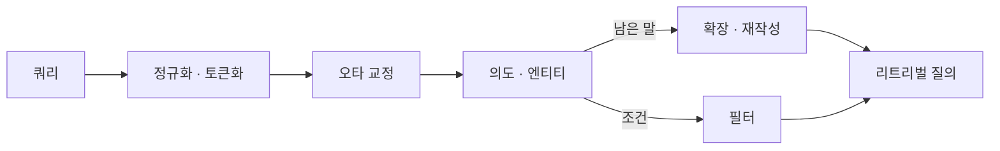
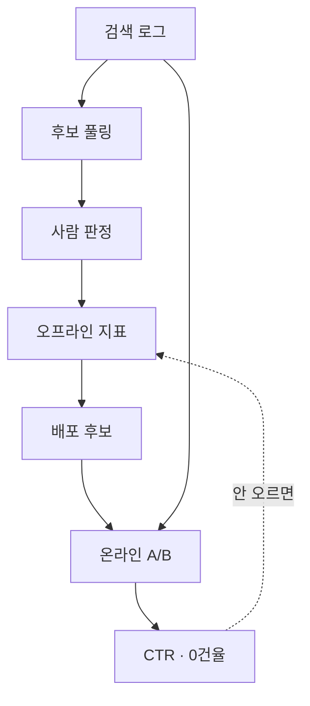

검색 엔진을 이루는 개념을 한 장에 세운 지도다. 2026-09 기준이고, 도식은 특정 제품이 아니라 어느 엔진에나 있는 구조만 담았다.

| 층 | 무엇을 정하나 | 대표 개념 |
|---|---|---|
| 색인 | 무엇을 어떤 모양으로 저장하나 | 역색인 · doc values · 세그먼트 |
| 쿼리 | 검색어를 무엇으로 바꾸나 | 쿼리 언더스탠딩 · 필터 · 확장 |
| 리트리벌 | 후보를 어떻게 뽑나 | BM25 · 덴스 벡터 · 하이브리드 |
| 랭킹 | 후보를 어떻게 줄 세우나 | 퍼널 · 피처 · 리랭킹 |
| 융합 | 단위가 다른 점수를 어떻게 합치나 | RRF · 가중 점수합 |
| 평가 | 좋아졌다를 무엇으로 아나 | nDCG · 판정 세트 · A/B |
| 서빙 | 무엇이 속도를 정하나 | 페이지 캐시 · 샤드 · 지연 예산 |

## 색인 타임과 쿼리 타임은 다른 시간에 산다

검색 설계의 거의 모든 선택은 「이 일을 색인 때 하나, 쿼리 때 하나」로 환원된다.

<svg viewBox="0 0 700 290" role="img" aria-label="두 시간축 그림. 위 레인은 색인 타임으로 원천 문서가 분석을 거쳐 색인 자료구조가 되고 세그먼트에 쌓여 병합된다. 아래 레인은 쿼리 타임으로 검색어가 쿼리 언더스탠딩을 거쳐 후보를 뽑고 랭킹을 매겨 결과가 된다. 색인 자료구조는 쿼리 타임이 읽기만 한다. 결과에서 나온 로그와 사람의 판정이 평가로 모여 랭킹으로 되먹는다.">
  <defs>
    <marker id="d0-ar" viewBox="0 0 10 10" refX="9" refY="5" markerWidth="7" markerHeight="7" orient="auto-start-reverse"><polygon points="0,1 10,5 0,9" fill="currentColor"></polygon></marker>
    <marker id="d0-arA" viewBox="0 0 10 10" refX="9" refY="5" markerWidth="7" markerHeight="7" orient="auto-start-reverse"><polygon points="0,1 10,5 0,9" style="fill:var(--ko-accent-text)"></polygon></marker>
  </defs>
  <text x="8" y="16" font-size="10.5" style="fill:var(--ko-text-secondary)">색인 타임 — 한 번 계산해 여러 번 쓴다</text>
  <rect x="8" y="24" width="104" height="44" rx="4" fill="none" stroke="currentColor"></rect>
  <text x="60" y="42" text-anchor="middle" font-size="11" fill="currentColor">원천 문서</text>
  <text x="60" y="58" text-anchor="middle" font-size="9.5" style="fill:var(--ko-text-secondary)">DB · API · 크롤</text>
  <line x1="112" y1="46" x2="132" y2="46" stroke="currentColor" stroke-width="1.2" marker-end="url(#d0-ar)"></line>
  <rect x="134" y="24" width="110" height="44" rx="4" fill="none" stroke="currentColor"></rect>
  <text x="189" y="42" text-anchor="middle" font-size="11" fill="currentColor">분석</text>
  <text x="189" y="58" text-anchor="middle" font-size="9.5" style="fill:var(--ko-text-secondary)">토큰화 · 정규화</text>
  <line x1="244" y1="46" x2="264" y2="46" stroke="currentColor" stroke-width="1.2" marker-end="url(#d0-ar)"></line>
  <rect x="266" y="18" width="152" height="56" rx="4" fill="none" style="stroke:var(--ko-accent-text)" stroke-width="1.5"></rect>
  <text x="342" y="36" text-anchor="middle" font-size="11" style="fill:var(--ko-accent-text)">색인 자료구조</text>
  <text x="342" y="51" text-anchor="middle" font-size="9.5" style="fill:var(--ko-accent-text)">역색인 · doc values</text>
  <text x="342" y="65" text-anchor="middle" font-size="9.5" style="fill:var(--ko-accent-text)">벡터 · stored fields</text>
  <line x1="418" y1="46" x2="438" y2="46" stroke="currentColor" stroke-width="1.2" marker-end="url(#d0-ar)"></line>
  <rect x="440" y="24" width="104" height="44" rx="4" fill="none" stroke="currentColor"></rect>
  <text x="492" y="42" text-anchor="middle" font-size="11" fill="currentColor">세그먼트</text>
  <text x="492" y="58" text-anchor="middle" font-size="9.5" style="fill:var(--ko-text-secondary)">불변 · 추가만</text>
  <line x1="544" y1="46" x2="564" y2="46" stroke="currentColor" stroke-width="1.2" marker-end="url(#d0-ar)"></line>
  <rect x="566" y="24" width="126" height="44" rx="4" fill="none" stroke="currentColor"></rect>
  <text x="629" y="42" text-anchor="middle" font-size="11" fill="currentColor">병합</text>
  <text x="629" y="58" text-anchor="middle" font-size="9.5" style="fill:var(--ko-text-secondary)">삭제분 정리</text>
  <line x1="8" y1="88" x2="692" y2="88" stroke="currentColor" stroke-width="1" stroke-dasharray="5 4"></line>
  <text x="350" y="84" text-anchor="middle" font-size="9.5" style="fill:var(--ko-text-secondary)">쿼리 타임은 위에서 만든 것을 읽기만 한다</text>
  <text x="8" y="110" font-size="10.5" style="fill:var(--ko-text-secondary)">쿼리 타임 — 매 요청이 값을 치른다</text>
  <rect x="8" y="118" width="88" height="44" rx="4" fill="none" stroke="currentColor"></rect>
  <text x="52" y="145" text-anchor="middle" font-size="11" fill="currentColor">검색어</text>
  <line x1="96" y1="140" x2="116" y2="140" stroke="currentColor" stroke-width="1.2" marker-end="url(#d0-ar)"></line>
  <rect x="118" y="112" width="136" height="56" rx="4" fill="none" style="stroke:var(--ko-accent-text)" stroke-width="1.5"></rect>
  <text x="186" y="132" text-anchor="middle" font-size="11" style="fill:var(--ko-accent-text)">쿼리 언더스탠딩</text>
  <text x="186" y="147" text-anchor="middle" font-size="9.5" style="fill:var(--ko-accent-text)">교정 · 의도 · 확장</text>
  <text x="186" y="161" text-anchor="middle" font-size="9.5" style="fill:var(--ko-accent-text)">필터로 옮기기</text>
  <line x1="254" y1="140" x2="274" y2="140" stroke="currentColor" stroke-width="1.2" marker-end="url(#d0-ar)"></line>
  <rect x="276" y="118" width="112" height="44" rx="4" fill="none" stroke="currentColor"></rect>
  <text x="332" y="136" text-anchor="middle" font-size="11" fill="currentColor">후보 추림</text>
  <text x="332" y="152" text-anchor="middle" font-size="9.5" style="fill:var(--ko-text-secondary)">리트리벌 · 필터</text>
  <line x1="388" y1="140" x2="408" y2="140" stroke="currentColor" stroke-width="1.2" marker-end="url(#d0-ar)"></line>
  <rect x="410" y="118" width="112" height="44" rx="4" fill="none" stroke="currentColor"></rect>
  <text x="466" y="136" text-anchor="middle" font-size="11" fill="currentColor">랭킹</text>
  <text x="466" y="152" text-anchor="middle" font-size="9.5" style="fill:var(--ko-text-secondary)">점수 · 리랭킹 · 정책</text>
  <line x1="522" y1="140" x2="542" y2="140" stroke="currentColor" stroke-width="1.2" marker-end="url(#d0-ar)"></line>
  <rect x="544" y="118" width="148" height="44" rx="4" fill="none" stroke="currentColor"></rect>
  <text x="618" y="145" text-anchor="middle" font-size="11" fill="currentColor">결과 · 하이라이팅</text>
  <path d="M342 74 L342 100 L332 100 L332 114" fill="none" style="stroke:var(--ko-accent-text)" stroke-width="1.2" stroke-dasharray="4 3" marker-end="url(#d0-arA)"></path>
  <text x="352" y="104" font-size="9.5" style="fill:var(--ko-accent-text)">읽는다</text>
  <path d="M618 162 L618 210 L520 210" fill="none" stroke="currentColor" stroke-width="1.2" marker-end="url(#d0-ar)"></path>
  <rect x="368" y="188" width="150" height="44" rx="4" fill="none" stroke="currentColor"></rect>
  <text x="443" y="206" text-anchor="middle" font-size="11" fill="currentColor">로그 · 클릭</text>
  <text x="443" y="222" text-anchor="middle" font-size="9.5" style="fill:var(--ko-text-secondary)">노출 · 클릭 · 0건</text>
  <line x1="368" y1="210" x2="348" y2="210" stroke="currentColor" stroke-width="1.2" marker-end="url(#d0-ar)"></line>
  <rect x="172" y="188" width="174" height="44" rx="4" fill="none" style="stroke:var(--ko-accent-text)" stroke-width="1.5"></rect>
  <text x="259" y="206" text-anchor="middle" font-size="11" style="fill:var(--ko-accent-text)">평가</text>
  <text x="259" y="222" text-anchor="middle" font-size="9.5" style="fill:var(--ko-accent-text)">판정 세트 · 지표 · A/B</text>
  <path d="M259 188 L259 176 L466 176 L466 166" fill="none" style="stroke:var(--ko-accent-text)" stroke-width="1.2" stroke-dasharray="4 3" marker-end="url(#d0-arA)"></path>
  <text x="476" y="180" font-size="9.5" style="fill:var(--ko-accent-text)">되먹임 — 랭킹을 고친다</text>
  <text x="8" y="262" font-size="10.5" style="fill:var(--ko-text-secondary)">사람의 판정도 평가로 들어온다 — 로그만으로는 「보여 주지 않은 것」을 못 잰다</text>
</svg>

그림: 색인 타임이 만든 것을 쿼리 타임은 읽기만 한다. 결과에서 나온 로그와 사람의 판정이 평가로 모여 랭킹으로 되돌아온다.

색인 때 하면 한 번 계산해 여러 번 쓰고, 쿼리 때 하면 최신이지만 매 요청이 값을 치른다.

| 같은 일 | 색인 타임에 두면 | 쿼리 타임에 두면 |
|---|---|---|
| 동의어 · 어간 | 빠르다. 사전을 바꾸면 재색인 | 즉시 반영. 쿼리마다 확장 비용 |
| 임베딩 | 문서 수만큼 한 번. 모델 교체는 전량 재계산 | 쿼리 한 건만. 모델 교체가 싸다 |
| 점수 피처 | 인기 · 신선도 같은 정적 값 | 문맥처럼 요청마다 다른 값 |
| 필터 값 | 정규화해 keyword · doc values 로 | 쿼리 언더스탠딩이 검색어에서 뽑는다 |

## 문서 하나가 네 자료구조에 들어간다

역색인은 「낱말 → 문서」, doc values 는 「문서 → 값」이다. 방향이 반대라 한 구조로 겸할 수 없다.

<svg viewBox="0 0 700 300" role="img" aria-label="문서 세 건이 분석을 거쳐 텀 사전과 포스팅 리스트로 이루어진 역색인이 되고, 같은 문서가 doc values 와 stored fields 와 벡터 필드에도 들어간다. 이 넷이 한 세그먼트를 이루며 세그먼트는 불변이고 병합이 삭제분을 정리한다.">
  <defs>
    <marker id="d1-ar" viewBox="0 0 10 10" refX="9" refY="5" markerWidth="7" markerHeight="7" orient="auto-start-reverse"><polygon points="0,1 10,5 0,9" fill="currentColor"></polygon></marker>
  </defs>
  <text x="8" y="18" font-size="11" fill="currentColor">문서</text>
  <rect x="8" y="26" width="116" height="26" rx="4" fill="none" stroke="currentColor"></rect>
  <text x="16" y="43" font-size="11" fill="currentColor">서울 야시장 야경</text>
  <rect x="8" y="60" width="116" height="26" rx="4" fill="none" stroke="currentColor"></rect>
  <text x="16" y="77" font-size="11" fill="currentColor">부산 해수욕장</text>
  <rect x="8" y="94" width="116" height="26" rx="4" fill="none" stroke="currentColor"></rect>
  <text x="16" y="111" font-size="11" fill="currentColor">야시장 먹거리</text>
  <line x1="126" y1="73" x2="150" y2="73" stroke="currentColor" stroke-width="1.2" marker-end="url(#d1-ar)"></line>
  <text x="156" y="18" font-size="11" style="fill:var(--ko-accent-text)">역색인</text>
  <rect x="154" y="26" width="104" height="96" rx="4" fill="none" style="stroke:var(--ko-accent-text)" stroke-width="1.5"></rect>
  <text x="206" y="44" text-anchor="middle" font-size="11.5" style="fill:var(--ko-accent-text)">텀 사전</text>
  <text x="164" y="64" font-size="10.5" fill="currentColor">야시장</text>
  <text x="164" y="82" font-size="10.5" fill="currentColor">야경</text>
  <text x="164" y="100" font-size="10.5" fill="currentColor">해수욕장</text>
  <text x="206" y="116" text-anchor="middle" font-size="9.5" style="fill:var(--ko-text-secondary)">정렬 · 압축</text>
  <line x1="258" y1="60" x2="276" y2="60" stroke="currentColor" stroke-width="1" marker-end="url(#d1-ar)"></line>
  <line x1="258" y1="78" x2="276" y2="78" stroke="currentColor" stroke-width="1" marker-end="url(#d1-ar)"></line>
  <line x1="258" y1="96" x2="276" y2="96" stroke="currentColor" stroke-width="1" marker-end="url(#d1-ar)"></line>
  <rect x="278" y="26" width="158" height="96" rx="4" fill="none" style="stroke:var(--ko-accent-text)" stroke-width="1.5"></rect>
  <text x="357" y="44" text-anchor="middle" font-size="11.5" style="fill:var(--ko-accent-text)">포스팅 리스트</text>
  <text x="288" y="64" font-size="10.5" fill="currentColor">d1(tf 2) · d3(tf 1)</text>
  <text x="288" y="82" font-size="10.5" fill="currentColor">d1(tf 1)</text>
  <text x="288" y="100" font-size="10.5" fill="currentColor">d2(tf 1)</text>
  <text x="357" y="116" text-anchor="middle" font-size="9.5" style="fill:var(--ko-text-secondary)">빈도 · 위치 · 스킵</text>
  <text x="456" y="18" font-size="11" fill="currentColor">같은 문서의 다른 사본</text>
  <rect x="456" y="26" width="236" height="28" rx="4" fill="none" stroke="currentColor"></rect>
  <text x="466" y="44" font-size="11" fill="currentColor">doc values — 정렬 · 집계 · 필터</text>
  <rect x="456" y="60" width="236" height="28" rx="4" fill="none" stroke="currentColor"></rect>
  <text x="466" y="78" font-size="11" fill="currentColor">stored fields — 상위 k 건만 읽는다</text>
  <rect x="456" y="94" width="236" height="28" rx="4" fill="none" stroke="currentColor"></rect>
  <text x="466" y="112" font-size="11" fill="currentColor">벡터 필드 — 무작위 접근</text>
  <rect x="8" y="148" width="684" height="46" rx="5" fill="none" stroke="currentColor" stroke-dasharray="5 4"></rect>
  <text x="350" y="170" text-anchor="middle" font-size="12" fill="currentColor">세그먼트 = 위 넷의 불변 묶음</text>
  <text x="350" y="187" text-anchor="middle" font-size="10.5" style="fill:var(--ko-text-secondary)">추가만 가능 · 삭제는 표시만 · 갱신은 삭제 + 추가</text>
  <line x1="350" y1="194" x2="350" y2="216" stroke="currentColor" stroke-width="1.2" marker-end="url(#d1-ar)"></line>
  <rect x="230" y="218" width="240" height="40" rx="4" fill="none" stroke="currentColor"></rect>
  <text x="350" y="236" text-anchor="middle" font-size="11.5" fill="currentColor">병합</text>
  <text x="350" y="251" text-anchor="middle" font-size="10.5" style="fill:var(--ko-text-secondary)">작은 세그먼트를 합치고 삭제분을 지운다</text>
  <text x="8" y="284" font-size="10.5" style="fill:var(--ko-text-secondary)">리프레시는 검색 가능해지는 것이고 플러시는 디스크에 내구해지는 것이다</text>
</svg>

그림: 찾기는 낱말에서 문서로, 정렬과 집계는 문서에서 값으로 간다. 이 분리가 하이라이팅과 집계의 성능 특성을 설명한다.

| 개념 | 무엇 | 트레이드오프 |
|---|---|---|
| 분석기 | 문자 필터 → 토크나이저 → 토큰 필터 | 색인과 쿼리가 같은 분석기여야 매칭이 맞는다 |
| 형태소 분석기 · n-gram | 한국어는 nori, 대안은 n-gram | 형태소는 사전 밖 신조어에 약하고 n-gram 은 색인이 커진다 |
| doc values | 필드별 열 저장 | 정렬 · 집계의 근거. 텍스트 필드에 켜면 메모리가 터진다 |
| stored fields | 원문 보관 | 상위 k 건만 읽으므로 크기보다 압축률이 중요하다 |
| 세그먼트 · 병합 | 불변 묶음과 그 정리 | 잠금이 없고 캐시가 잘 듣는 대신 병합 IO 가 든다 |
| 매핑 | 필드 타입 선언 | 대부분 나중에 못 바꾼다. 새 색인 + 별칭 교체가 정석이다 |

## 쿼리 언더스탠딩은 낱말을 세 곳으로 보낸다

검색어는 문자열이 아니라 요청이다. 「강남 3만원 이하 이탈리안」에서 지역과 가격과 업종은 필터로 가고, 남은 말만 점수 경쟁을 한다.

조건을 필터로 안 옮기면 그 낱말들이 본문 어딘가에 섞인 문서를 끌어올린다.

| 단계 | 무엇 | 함정 |
|---|---|---|
| 정규화 | 대소문자 · 전각 · 유니코드 · 스톱워드 | 색인과 쿼리가 같은 규칙이어야 한다 |
| 오타 교정 | 편집거리 + 쿼리 로그의 고쳐 친 흔적 | 사전만 쓰면 고유명사가 망가진다 |
| 의도 분류 | 내비게이션 · 정보 · 거래 · 타입 지정 | 필터로 쓰면 강하고 랭킹 힌트로 쓰면 부드럽다 |
| 엔티티 인식 | 검색어 속 지역 · 브랜드 · 분류 · 수치 | 손으로 쓴 사전은 낡는다. 원천 코드표에서 유도한다 |
| 확장 | 동의어 · 약어 · 로마자 | 넓히면 재현율이 오르고 정밀도가 내린다 |
| 질의 재작성 | 필드 지정 · 구문화로 구조를 바꿔 다시 쓴다 | LLM 재작성은 지연과 비용과 비결정성이 붙는다 |
| 0건 복구 | 조건을 완화해 재검색 | 완화 순서를 정해 두지 않으면 엉뚱한 결과가 나온다 |
| 자동완성 | 접두 일치 · 인기 쿼리 · 오타 허용 | 본체와 다른 색인을 쓴다. 접두 최적화가 목적이다 |

## 리트리벌은 두 축으로 자리가 정해진다

가로는 글자를 맞추나 뜻을 맞추나이고, 세로는 규칙과 통계로 정하나 데이터로 학습하나다.

<svg viewBox="0 0 700 350" role="img" aria-label="리트리벌 계열 지도. 가로축은 왼쪽 글자 일치에서 오른쪽 뜻 일치로 간다. 세로축은 아래 규칙과 통계에서 위 학습으로 간다. 불리언과 TF-IDF, BM25, BM25F 는 왼쪽 아래에, 학습형 스파스는 왼쪽 위에, 덴스 벡터와 ColBERT, 크로스인코더는 오른쪽 위에 놓인다. 가운데를 덮는 띠가 하이브리드 영역이다.">
  <rect x="120" y="52" width="420" height="238" rx="8" style="fill:var(--ko-surface-2)"></rect>
  <text x="330" y="70" text-anchor="middle" font-size="11" style="fill:var(--ko-accent-text)">하이브리드 — 두 쪽을 뽑아 순위로 합친다</text>
  <line x1="50" y1="300" x2="680" y2="300" stroke="currentColor" stroke-width="1"></line>
  <line x1="50" y1="300" x2="50" y2="30" stroke="currentColor" stroke-width="1"></line>
  <text x="360" y="326" text-anchor="middle" font-size="11" style="fill:var(--ko-text-secondary)">글자 일치 → 뜻 일치</text>
  <text x="20" y="170" text-anchor="middle" font-size="11" style="fill:var(--ko-text-secondary)" transform="rotate(-90 20 170)">규칙 · 통계 → 학습</text>
  <circle cx="86" cy="282" r="5" fill="currentColor"></circle>
  <text x="96" y="279" font-size="11" fill="currentColor">불리언</text>
  <text x="96" y="293" font-size="10" style="fill:var(--ko-text-secondary)">있다 · 없다</text>
  <circle cx="120" cy="240" r="5" fill="currentColor"></circle>
  <text x="130" y="237" font-size="11" fill="currentColor">TF-IDF</text>
  <text x="130" y="251" font-size="10" style="fill:var(--ko-text-secondary)">흔한 낱말을 깎는다</text>
  <circle cx="152" cy="196" r="7" style="fill:var(--ko-accent-text)"></circle>
  <text x="164" y="193" font-size="11.5" style="fill:var(--ko-accent-text)">BM25</text>
  <text x="164" y="207" font-size="10" style="fill:var(--ko-text-secondary)">포화 k1 + 길이 정규화 b</text>
  <circle cx="146" cy="150" r="5" fill="currentColor"></circle>
  <text x="156" y="147" font-size="11" fill="currentColor">BM25F</text>
  <text x="156" y="161" font-size="10" style="fill:var(--ko-text-secondary)">필드별 가중</text>
  <circle cx="176" cy="96" r="5" fill="currentColor"></circle>
  <text x="186" y="93" font-size="11" fill="currentColor">학습형 스파스</text>
  <text x="186" y="107" font-size="10" style="fill:var(--ko-text-secondary)">낱말 차원에 가중을 학습</text>
  <circle cx="470" cy="160" r="7" style="fill:var(--ko-accent-text)"></circle>
  <text x="482" y="157" font-size="11.5" style="fill:var(--ko-accent-text)">덴스 벡터</text>
  <text x="482" y="171" font-size="10" style="fill:var(--ko-text-secondary)">임베딩 + 근사 최근접</text>
  <circle cx="520" cy="104" r="5" fill="currentColor"></circle>
  <text x="530" y="101" font-size="11" fill="currentColor">ColBERT</text>
  <text x="530" y="115" font-size="10" style="fill:var(--ko-text-secondary)">토큰별 벡터 · 저장이 크다</text>
  <circle cx="600" cy="52" r="5" fill="currentColor"></circle>
  <text x="588" y="49" text-anchor="end" font-size="11" fill="currentColor">크로스인코더</text>
  <text x="588" y="63" text-anchor="end" font-size="10" style="fill:var(--ko-text-secondary)">쌍으로 읽는다 · 리랭킹 전용</text>
  <text x="50" y="344" font-size="10.5" style="fill:var(--ko-text-secondary)">왼쪽 아래일수록 싸고 설명이 쉽다. 오른쪽 위로 갈수록 비싸고 순위 근거를 말하기 어렵다.</text>
</svg>

그림: 이름과 고유명사는 글자가 정답이고 설명형 쿼리는 뜻이 정답이다. 한쪽만 쓰면 그 반대 유형에서 진다.

| 방식 | 잘하는 쿼리 | 못하는 쿼리 | 비용 |
|---|---|---|---|
| BM25 | 고유명사 · 정확한 이름 · 희귀어 | 낱말이 안 겹치는 설명형 | 역색인 조각만 읽는다 |
| 덴스 벡터 | 바꿔 말한 쿼리 · 다국어 | 모델이 못 본 고유명사 · 코드 | 벡터가 메모리에 있어야 한다 |
| 학습형 스파스 | 둘의 중간 · 역색인 인프라 유지 | 학습 데이터가 필요하다 | 색인이 커진다 |
| 크로스인코더 | 상위 후보 정밀 리랭킹 | 전체 검색에는 못 쓴다 | 후보 수 × 모델 추론 |

## 벡터 검색의 비용은 계산이 아니라 메모리 접근이다

HNSW 는 층을 내려가며 이웃을 따라간다. 방문한 노드마다 벡터를 무작위 위치에서 읽으므로 벡터가 메모리에 없으면 한 번의 탐색이 수백 번의 디스크 읽기가 된다.

<svg viewBox="0 0 700 220" role="img" aria-label="HNSW 계층 그래프. 위층은 노드가 성겨 멀리 뛰고 아래층으로 갈수록 촘촘해진다. 진입점에서 시작해 층을 내려가며 가까운 이웃으로 이동해 답에 닿는다.">
  <defs>
    <marker id="d3-ar" viewBox="0 0 10 10" refX="9" refY="5" markerWidth="7" markerHeight="7" orient="auto-start-reverse"><polygon points="0,1 10,5 0,9" style="fill:var(--ko-accent-text)"></polygon></marker>
  </defs>
  <rect x="8" y="20" width="560" height="50" rx="5" fill="none" stroke="currentColor" stroke-dasharray="4 3"></rect>
  <text x="16" y="36" font-size="10.5" style="fill:var(--ko-text-secondary)">층 2 — 성김 · 멀리 뛴다</text>
  <circle cx="70" cy="56" r="6" style="fill:var(--ko-accent-text)"></circle>
  <circle cx="260" cy="50" r="6" fill="currentColor"></circle>
  <circle cx="470" cy="60" r="6" fill="currentColor"></circle>
  <line x1="70" y1="56" x2="260" y2="50" stroke="currentColor" stroke-width="1"></line>
  <line x1="260" y1="50" x2="470" y2="60" stroke="currentColor" stroke-width="1"></line>
  <text x="70" y="18" text-anchor="middle" font-size="10" style="fill:var(--ko-accent-text)">진입점</text>
  <rect x="8" y="78" width="560" height="50" rx="5" fill="none" stroke="currentColor" stroke-dasharray="4 3"></rect>
  <text x="16" y="94" font-size="10.5" style="fill:var(--ko-text-secondary)">층 1</text>
  <circle cx="70" cy="114" r="5" fill="currentColor"></circle>
  <circle cx="170" cy="108" r="5" fill="currentColor"></circle>
  <circle cx="270" cy="118" r="5" fill="currentColor"></circle>
  <circle cx="380" cy="106" r="5" fill="currentColor"></circle>
  <circle cx="470" cy="118" r="5" fill="currentColor"></circle>
  <line x1="70" y1="114" x2="170" y2="108" stroke="currentColor" stroke-width="0.9"></line>
  <line x1="170" y1="108" x2="270" y2="118" stroke="currentColor" stroke-width="0.9"></line>
  <line x1="270" y1="118" x2="380" y2="106" stroke="currentColor" stroke-width="0.9"></line>
  <line x1="380" y1="106" x2="470" y2="118" stroke="currentColor" stroke-width="0.9"></line>
  <rect x="8" y="136" width="560" height="56" rx="5" fill="none" stroke="currentColor" stroke-dasharray="4 3"></rect>
  <text x="16" y="152" font-size="10.5" style="fill:var(--ko-text-secondary)">층 0 — 모든 노드 · 촘촘</text>
  <circle cx="60" cy="176" r="4" fill="currentColor"></circle>
  <circle cx="120" cy="184" r="4" fill="currentColor"></circle>
  <circle cx="180" cy="172" r="4" fill="currentColor"></circle>
  <circle cx="240" cy="182" r="4" fill="currentColor"></circle>
  <circle cx="300" cy="174" r="4" fill="currentColor"></circle>
  <circle cx="360" cy="184" r="4" fill="currentColor"></circle>
  <circle cx="420" cy="172" r="4" fill="currentColor"></circle>
  <circle cx="480" cy="182" r="5" style="fill:var(--ko-accent-text)"></circle>
  <line x1="60" y1="176" x2="120" y2="184" stroke="currentColor" stroke-width="0.8"></line>
  <line x1="120" y1="184" x2="180" y2="172" stroke="currentColor" stroke-width="0.8"></line>
  <line x1="180" y1="172" x2="240" y2="182" stroke="currentColor" stroke-width="0.8"></line>
  <line x1="240" y1="182" x2="300" y2="174" stroke="currentColor" stroke-width="0.8"></line>
  <line x1="300" y1="174" x2="360" y2="184" stroke="currentColor" stroke-width="0.8"></line>
  <line x1="360" y1="184" x2="420" y2="172" stroke="currentColor" stroke-width="0.8"></line>
  <line x1="420" y1="172" x2="480" y2="182" stroke="currentColor" stroke-width="0.8"></line>
  <text x="480" y="200" text-anchor="middle" font-size="10" style="fill:var(--ko-accent-text)">답</text>
  <path d="M70 62 L70 108" fill="none" style="stroke:var(--ko-accent-text)" stroke-width="1.4" marker-end="url(#d3-ar)"></path>
  <path d="M70 120 L60 170" fill="none" style="stroke:var(--ko-accent-text)" stroke-width="1.4" marker-end="url(#d3-ar)"></path>
  <text x="584" y="60" font-size="10.5" fill="currentColor">m = 노드당 이웃 수</text>
  <text x="584" y="78" font-size="10.5" fill="currentColor">ef = 탐색 폭</text>
  <text x="584" y="106" font-size="10.5" style="fill:var(--ko-text-secondary)">둘 다 올리면</text>
  <text x="584" y="122" font-size="10.5" style="fill:var(--ko-text-secondary)">정확하고 무겁다</text>
  <text x="584" y="152" font-size="10.5" style="fill:var(--ko-text-secondary)">대안은 IVF 와</text>
  <text x="584" y="168" font-size="10.5" style="fill:var(--ko-text-secondary)">소규모 전수 탐색</text>
</svg>

그림: 상주량은 대략 1.1 × (차원 × 비트 ÷ 8 + 8 × m) × 문서 수다. 이 값이 페이지 캐시에 안 들어가면 탐색이 디스크 읽기로 바뀐다.

양자화는 그 상주량을 줄이는 장치다. 압축본으로 후보를 뽑고 원본 벡터로 다시 채점하면 손실의 일부를 되찾는다.

<svg viewBox="0 0 700 160" role="img" aria-label="양자화 압축 막대. float32 는 차원당 4바이트로 기준이고, 8비트 스칼라 양자화는 4배, 4비트는 8배, 1비트는 32배로 상주량이 줄어든다. 막대 길이가 상주량에 비례한다.">
  <text x="8" y="16" font-size="10.5" style="fill:var(--ko-text-secondary)">막대 길이 = 메모리 상주량</text>
  <rect x="8" y="24" width="560" height="26" rx="3" fill="none" stroke="currentColor"></rect>
  <text x="18" y="41" font-size="11" fill="currentColor">float32 · 차원당 4바이트</text>
  <text x="580" y="41" font-size="11" fill="currentColor">1×</text>
  <rect x="8" y="58" width="140" height="26" rx="3" fill="none" stroke="currentColor"></rect>
  <text x="18" y="75" font-size="11" fill="currentColor">8비트</text>
  <text x="160" y="75" font-size="11" fill="currentColor">4×</text>
  <rect x="8" y="92" width="70" height="26" rx="3" fill="none" stroke="currentColor"></rect>
  <text x="18" y="109" font-size="11" fill="currentColor">4비트</text>
  <text x="90" y="109" font-size="11" fill="currentColor">8×</text>
  <rect x="8" y="126" width="18" height="26" rx="3" style="fill:var(--ko-surface-2);stroke:var(--ko-accent-text)" stroke-width="1.5"></rect>
  <text x="36" y="143" font-size="11" style="fill:var(--ko-accent-text)">1비트 — 부호만 남긴다</text>
  <text x="200" y="143" font-size="11" style="fill:var(--ko-accent-text)">32×</text>
  <text x="240" y="143" font-size="10.5" style="fill:var(--ko-text-secondary)">재채점으로 정확도의 일부를 되찾는다</text>
</svg>

그림: 1비트는 벡터를 부호만 남겨 32배로 줄인다. 줄인 만큼 재현율이 깎이므로 상위 후보는 원본 벡터로 다시 채점한다.

| 표현 | 차원당 | 압축 | 성질 |
|---|---|---|---|
| float32 | 4바이트 | 1× | 기준값 |
| 스칼라 양자화 8비트 | 1바이트 | 4× | 손실이 작다 |
| 4비트 | 0.5바이트 | 8× | 재채점 권장 |
| 1비트 | 0.125바이트 | 32× | 부호만 남긴다. 재채점 필수 |

product quantization 은 차원을 쪼개 코드북으로 바꾸는 다른 계열이다. 공통 규칙은 하나다. 압축은 재현율을 깎고 재채점이 그 일부를 되찾는다.

| 거리 척도 | 쓰는 곳 |
|---|---|
| 코사인 | 길이를 무시한다. 텍스트 임베딩의 기본값이다 |
| 내적 | 벡터 길이가 의미를 담을 때 쓴다 |
| L2 | 좌표와 이미지 특징에 쓴다 |

색인과 쿼리가 같은 척도여야 한다. 다르면 점수는 나오는데 순위가 뒤집힌다.

> [!IMPORTANT] 디스크는 줄지 않는다
> 재채점을 하려면 원본 벡터를 그대로 들고 있어야 한다. 양자화가 줄이는 것은 메모리 상주량이고 디스크는 오히려 조금 는다.

## 랭킹은 한 번에 매기지 않는다

싼 것으로 많이 거르고 비싼 것은 적게 한다. 단계마다 후보 수와 문서당 비용이 반비례한다.

<svg viewBox="0 0 700 260" role="img" aria-label="랭킹 퍼널. 전체 문서에서 필터와 불리언으로 후보를 만들고, 경량 점수로 수백 건을 뽑고, 리랭킹으로 수십 건을 정밀 정렬한 뒤, 정책 단계에서 다양성과 중복 제거를 적용해 최종 결과를 낸다. 아래로 갈수록 건수는 줄고 문서당 비용은 커진다.">
  <polygon points="30,20 670,20 560,70 140,70" fill="none" stroke="currentColor"></polygon>
  <text x="350" y="42" text-anchor="middle" font-size="12" fill="currentColor">0. 매칭 — 필터 · 불리언</text>
  <text x="350" y="60" text-anchor="middle" font-size="10.5" style="fill:var(--ko-text-secondary)">전체 N 건에서 조건에 맞는 것만. 점수 없음</text>
  <polygon points="140,78 560,78 490,128 210,128" fill="none" stroke="currentColor"></polygon>
  <text x="350" y="100" text-anchor="middle" font-size="12" fill="currentColor">1. 경량 점수 — BM25 · 근사 최근접</text>
  <text x="350" y="118" text-anchor="middle" font-size="10.5" style="fill:var(--ko-text-secondary)">수백에서 수천 건. 색인 통계만으로 매긴다</text>
  <polygon points="210,136 490,136 440,186 260,186" style="fill:var(--ko-surface-2);stroke:var(--ko-accent-text)" stroke-width="1.5"></polygon>
  <text x="350" y="158" text-anchor="middle" font-size="12" style="fill:var(--ko-accent-text)">2. 리랭킹 — LTR · 크로스인코더</text>
  <text x="350" y="176" text-anchor="middle" font-size="10.5" style="fill:var(--ko-accent-text)">수십에서 수백 건. 피처를 모아 다시 정렬</text>
  <polygon points="260,194 440,194 405,240 295,240" fill="none" stroke="currentColor"></polygon>
  <text x="350" y="214" text-anchor="middle" font-size="11.5" fill="currentColor">3. 정책 · 다양성</text>
  <text x="350" y="230" text-anchor="middle" font-size="10.5" style="fill:var(--ko-text-secondary)">중복 제거 · 최종 k 건</text>
</svg>

그림: 1단계가 놓친 문서는 2단계가 되살릴 수 없다. 리랭킹보다 1단계 재현율이 먼저인 이유다.

| 피처 계열 | 예 | 주의 |
|---|---|---|
| 쿼리-문서 일치 | BM25 점수 · 필드별 일치 · 구문 근접도 · 벡터 유사도 | 앞 단계에서 쓴 값을 다시 쓰면 편향이 겹친다 |
| 문서 정적 피처 | 인기 · 평점 · 신선도 · 완성도 | 색인 때 넣는다. 갱신 주기가 곧 반영 지연이다 |
| 행동 피처 | 노출 대비 클릭률 · 체류 · 전환 | 위치 편향이 섞인다 |
| 문맥 피처 | 기기 · 시간 · 지역 | 개인 식별과 어디서 선을 긋는지가 정책 문제다 |
| 정책 규칙 | 다양성 · 중복 제거 · 광고 구분 | 모델 점수 위에 얹는 하드 규칙이다 |

## 점수로 더하지 말고 순위로 합친다

BM25 점수와 코사인 유사도는 단위가 다르다. 그대로 더하면 스케일이 큰 쪽이 이긴다.

| 방식 | 식 | 성질 |
|---|---|---|
| 가중 점수합 | α · norm(BM25) + (1−α) · cos | 정규화가 필수다. 쿼리마다 분포가 달라 α 가 흔들린다 |
| RRF | Σ 1 / (k + rank) | 점수를 안 본다. 튜닝할 값이 k 하나이고 관례는 60 이다 |
| 조건부 선택 | 의도에 따라 한 레그만 | 설명은 쉽고 경계에서 결과가 튄다 |
| 학습 융합 | 두 점수를 피처로 | 가장 좋지만 학습 데이터와 평가 체계가 먼저다 |

> [!WARNING] 필터는 레그마다 건다
> 한쪽 레그에만 필터를 걸면 다른 레그가 조건 밖 문서를 끌어온다. 지역을 지정한 검색에 엉뚱한 지역이 섞이는 증상이 그것이다.

## 평가는 오프라인과 온라인 두 눈으로 본다

오프라인은 사람이 매긴 판정으로 순위를 채점하고, 온라인은 실제 행동으로 잰다.

| 지표 | 무엇을 재나 | 언제 쓰나 |
|---|---|---|
| nDCG@k | 등급 있는 관련도를 위치 할인해 합산한 뒤 이상적 순서로 나눈다 | 등급이 여러 단계일 때의 기본 |
| MRR | 첫 정답의 역순위 | 정답이 하나인 내비게이션 쿼리 |
| MAP | 정답 여러 개의 정밀도 평균 | 이진 판정 |
| Recall@k | 1단계가 정답을 후보에 넣었나 | 리랭킹 이전 단계의 평가 |
| CTR · 0건율 · 재질의율 | 실제 행동 | 온라인. 위치와 UI 변화에 오염된다 |
| 인터리빙 | 두 순위를 한 결과에 섞어 클릭으로 비교 | A/B 보다 표본 효율이 높다 |

> [!CAUTION] 판정 세트는 그것을 만든 시스템에만 공정하다
> 새 구성이 올린 문서는 판정이 없어 0점으로 계산된다. 큰 변경 뒤에는 후보 풀링부터 다시 한다.

평가에서 되풀이되는 함정이 셋 더 있다.

- 위치 편향 — 클릭 로그로 학습하면 위에 있던 것을 좋은 것으로 배운다.
- 오프라인과 온라인의 괴리 — nDCG 가 올라도 CTR 이 안 오르면 판정 기준이 사용자 기준과 다른 것이다.
- 재는 게 없는 초록불 — 판정이 비었는데 성공으로 끝나는 평가 잡은 없는 것보다 나쁘다.

## 서빙은 캐시가 정한다

색인 파일은 mmap 으로 읽히므로 실질 성능은 OS 페이지 캐시가 정한다. 힙 안의 캐시는 필터 비트셋과 집계 결과에만 쓰인다.

| 개념 | 결과 |
|---|---|
| 샤드 · 레플리카 | 샤드가 많으면 병렬이 늘고 조정 비용도 는다. 작은 데이터는 한 샤드가 빠르다 |
| 딥 페이징 | from + size 는 샤드마다 그만큼을 모은다. search_after 로 피한다 |
| 캐시 계층 | 페이지 캐시 · 필터 비트셋 · 요청 캐시가 서로 다른 것을 담는다 |
| 지연 예산 | 레그별 상한이 있어야 한 레그의 지연이 전체를 죽이지 않는다 |
| 라우팅 | 쿼리는 모든 샤드에 가고 결과를 모은다. 상위 k 를 모으는 비용이 뒤 페이지에서 커진다 |
| 색인 갱신 모델 | 전체 재색인은 단순하고 되돌리기 쉽다. 증분은 빠른 대신 순서와 멱등이 숙제가 된다 |
| 멱등 · 순서 | 같은 이벤트가 두 번 와도 결과가 같아야 한다. 버전으로 늦게 온 옛 이벤트를 버린다 |
| 무중단 재색인 | 새 색인 + 별칭 교체. 교체 전 건수와 오류율 게이트가 없으면 망가진 색인이 라이브가 된다 |

> [!NOTE] 검색 노드의 메모리 산정
> 컨테이너 한도는 힙과 힙 밖 네이티브와 색인이 올라갈 페이지 캐시의 합이다. 앞의 둘만 계산하면 캐시 몫이 0 이 되고 벡터 검색만 수십 배 느려진다.

## 단일 노드에 올린 실측

이 사이트의 검색은 OpenSearch 3.8 한 노드에서 돈다. 관광지 색인만 하이브리드이고 나머지 여섯 타입은 BM25 다.

| 항목 | 값 |
|---|---|
| 관광지 색인 | 59,735건 · 280 MB · 640차원 벡터 |
| 통합 색인 | 351건 · 6타입 |
| nDCG@10 (한국어) | BM25 0.4305 · 하이브리드 0.5954 · 쿼리 언더스탠딩 포함 0.6584 |
| nDCG@10 (영어) | BM25 0.5465 · 하이브리드 0.6420 · 쿼리 언더스탠딩 포함 0.6602 |
| 판정 세트 | 쿼리 48개 · 등급 2,141건 |
| 검색 응답 | 0.56 ~ 0.84초 |
| 컨테이너 한도 | 2560Mi = 힙 512MB + 네이티브 약 1GB + 페이지 캐시 |

한도가 1536Mi 일 때는 페이지 캐시가 43MB 까지 밀려 BM25 는 0.19초인데 kNN 만 112초가 나왔다. 같은 노드 같은 색인에서 나는 차이라 원인은 캐시 하나다.

- [검색 시스템 아키텍처를 키워드 계층으로](/posts/search-architecture-keyword-layers) — 같은 개념을 계층 트리로 정리한 글
- [OpenSearch 하이브리드 검색에 쿼리 언더스탠딩 붙이기](/posts/opensearch-hybrid-query-understanding) — 4절의 하이브리드와 3절의 쿼리 언더스탠딩을 한 엔진에 붙인 기록
- [힙은 정상인데 컨테이너가 OOMKilled 될 때](/posts/jvm-native-memory-glibc-malloc-arena) — 9절의 네이티브 메모리 항
- [Elasticsearch · OpenSearch 클러스터 사이징](/posts/search-cluster-capacity-sizing) — 9절의 샤드와 용량 산정
