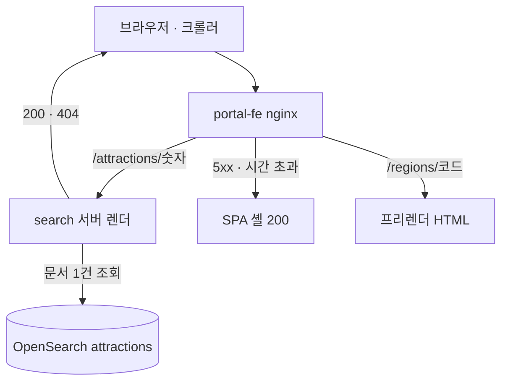

TourAPI 원문을 검색 가능한 관광지 사이트로 서비스할 때 쓰는 렌더 구조와 데이터 해석 규칙을 정리한 글이다. 수치는 2026-10-11 06:34 KST 색인 기준이다.

| 항목 | 규칙 | 운영 값 |
|---|---|---|
| 관광지 상세 | 요청 때 검색 서비스가 서버 렌더 | sitemap 62,984 URL · 응답 헤더 `X-Render: ssr` |
| 지역·허브 | 빌드 때 프리렌더 | sitemap 541 URL |
| 서버 렌더 실패 | 5xx·시간 초과면 SPA 셸 200, 없는 id 는 404 | 연결 0.5초 · 읽기 3초 |
| 방문 속성 | 원문을 못 읽으면 `UNKNOWN` 을 값으로 싣는다 | 입장료: 무료 9,421 · 유료 3,575 · 모름 39,144 (국문) |
| 사진 주소 | `http://tong.visitkorea.or.kr/` 로 시작할 때만 https 로 | http 원천 사진 20,188장 |
| 국·영 짝 | 네 조건 + 양쪽 모두 후보 하나 | 후보 2,616 → 짝 2,600 |

## 요청 경로



관광지 문서의 주인은 검색 서비스다. 렌더도 거기서 하므로 요청마다 서비스 간 호출 없이 문서 조회 한 번으로 끝난다.

## 상세는 서버 렌더, 지역은 프리렌더

| 페이지 | 방식 | 이유 |
|---|---|---|
| `/attractions/{id}` · `/en/attractions/{id}` | 요청 때 서버 렌더 | 6만 쪽을 이미지에 구우면 수백 MB 가 된다 |
| `/regions/{코드}` · 허브 | 빌드 때 프리렌더 | 수백 쪽이라 이미지 크기 부담이 작다 |
| 속성 랜딩 `/regions/{코드}/{속성}` | 빌드 때 프리렌더 | 목록 파일에 있는 조합만 만든다 |

서버 렌더 응답은 SPA 셸(`index.html`)의 메타 구간을 갈아 끼우고 `#root` 안에 본문을 넣는다. 하이드레이션 뒤 화면이 같은 규칙으로 메타를 다시 만들므로, 문구 원본은 프런트엔드 한 파일에 두고 서버는 패리티 테스트로 맞춘다.

nginx 는 숫자 id 만 넘기고, search 의 404 는 그대로 낸다. 가로채는 것은 5xx·시간 초과뿐이다.

```nginx
location ~ "^/(?<render_lang>en/)?attractions/(?<render_id>[0-9]{1,12})$" {
    set $render_upstream http://search.commerce.svc.cluster.local:8083;
    proxy_pass $render_upstream/internal/render/${render_lang}attractions/$render_id;
    proxy_connect_timeout 500ms;
    proxy_read_timeout 3s;
    proxy_set_header Cookie "";
    proxy_intercept_errors on;
    error_page 500 502 503 504 = @attraction_shell;   # X-Render: proxy-fallback
}
```

| `X-Render` | 뜻 |
|---|---|
| `ssr` | 서버 렌더 성공 |
| `shell-fallback` | search 가 색인 조회에 실패해 셸을 냈다 |
| `proxy-fallback` | nginx 가 5xx·시간 초과로 셸을 냈다 |

> [!TIP]
> 폴백을 성공으로 세지 않으려면 상태 코드가 아니라 `X-Render` 를 본다. 셋 다 200 이다.

search 가 셸을 받아 오는 한도는 1초로, nginx 읽기 한도(3초)보다 작다. 셸 캐시가 만료된 요청도 서버 렌더로 나가게 하는 순서다.

## 방문 속성은 모르면 UNKNOWN

요금·주차·휴무·반려동물은 자유 문장 원문이다. 파서는 운영 원문에 실제로 나온 표기만 받아들이고, 나머지는 `UNKNOWN` 을 값으로 싣는다.

| 속성 | 값 | 판정 규칙 |
|---|---|---|
| 입장료 | `FREE` · `PAID` · `UNKNOWN` | 「무료」로 시작하고 금액이 없을 때만 `FREE` |
| 주차 | `YES` · `NO` · `UNKNOWN` | 국문 「없음」은 `NO`, 영문 「N/A」는 `UNKNOWN` |
| 정기휴무 | `ALWAYS_OPEN` · `WEEKLY` · `NO_WEEKLY` · `UNKNOWN` | 격주·월 1회·공휴일 다음날은 요일을 못 정해 `UNKNOWN` |
| 반려동물 | `ALLOWED` · `PARTIAL` · `UNKNOWN` | 원천에 「불가」 값이 없어 부정 값을 두지 않는다 |

```kotlin
private fun admission(feeText: String?): Admission {
    val text = (feeText ?: return Admission.UNKNOWN).trim().lowercase()
    val startsFree = STARTS_FREE.containsMatchIn(text)   // ^(무료|free)
    val hasAmount = AMOUNT.containsMatchIn(text)         // 3,000원 · krw · 유료 · paid
    return when {
        startsFree && !hasAmount -> Admission.FREE
        startsFree -> Admission.UNKNOWN                  // 「무료(일부 유료)」
        hasAmount -> Admission.PAID                      // 「어른 3,000원 ※ 무료: 6세 이하」
        else -> Admission.UNKNOWN
    }
}
```

필터는 긍정 값만 받는다. 「주차 불가」나 `UNKNOWN` 으로 거르는 파라미터는 타입에 없다. 모르는 것을 부정으로 바꾸면 사실이 아닌 말을 하게 되고, 필터가 모르는 곳을 걸러 버린다.

| 규칙 | 효과 |
|---|---|
| 값이 비면 `UNKNOWN` 을 싣는다 (필드를 비우지 않는다) | 「정보 없음」과 「아직 계산 안 함」이 갈린다 |
| 문서에 파서 판(`attributeParserVersion`)을 싣는다 | 규칙을 고치면 다음 재색인이 전량을 다시 계산한다. 백필이 없다 |
| 파생 값은 색인 시점에 순수 함수로 만든다 | 원문 컬럼은 그대로 남고, 소비자는 검색 문서 하나만 읽는다 |

## 원천 사진은 호스트를 보고 https 로

TourAPI 사진 주소 일부는 `http://` 로 온다. https 페이지에 그대로 그리면 브라우저가 혼합 콘텐츠로 경고한다.

```kotlin
private const val TONG_HTTP = "http://tong.visitkorea.or.kr/"

fun secureImageUrl(url: String?): String? =
    if (url != null && url.startsWith(TONG_HTTP)) "https:" + url.substring("http:".length) else url
```

| 규칙 | 이유 |
|---|---|
| 원천 사진 호스트로 **시작할 때만** 바꾼다 | 다른 호스트는 https 로 같은 파일을 주는지 알 수 없다 |
| 저장값은 덮지 않고 표시 시점에 바꾼다 | 원천 필드는 받은 그대로 남긴다 |
| 서버 렌더와 프런트엔드가 같은 규칙을 쓴다 | 한쪽만 바뀌면 `og:image` 와 화면 사진이 갈린다 |
| 서버 렌더 본문 사진은 바꾼 뒤에도 `https://` 일 때만 그린다 | 다른 호스트의 http 사진이 혼합 콘텐츠로 남지 않는다 |
| `og:image` 는 이미지 확장자일 때만 쓴다 | 아니면 사이트 기본 이미지로 대신한다 |

## 국문·영문 관광지를 hreflang 짝으로 잇는 규칙

TourAPI 는 국문과 영문을 `contentId` 가 다른 별개 행으로 준다. 같은 장소라는 표시가 없으므로 아래 네 조건을 **모두** 만족하는 쌍만 후보로 본다.

1. 구글 `place_id` 가 둘 다 있고 같다
2. 좌표 거리가 50m 이하다
3. 관광 유형이 같다 (국문 12 ↔ 영문 76 처럼 언어별 코드 대응표로 비교, 행사·여행코스 제외)
4. 영문 문서의 현지명과 국문 제목이 정규화 뒤 같다 (NFKC → 공백 제거 → 소문자)

후보 중 국문 쪽도 영문 쪽도 후보가 하나뿐인 쌍만 짝이 된다. 같은 `place_id` 안에 휴양림과 그 안의 야영장처럼 범위가 다른 곳이 섞여 있어서다.

| 단계 | 건수 |
|---|---|
| 네 조건을 모두 만족한 후보 | 2,616 |
| 한쪽이 둘 이상과 이어져 제외 | 16 |
| 한쪽에 개요가 없어 제외 | 0 |
| **짝** | **2,600** |

개요가 없는 상세는 `noindex` 라서 hreflang 상대가 될 수 없다. 그래서 짝 판정에서도 뺀다.

> [!NOTE]
> 짝 판정은 매 재색인마다 계산되지만, 페이지에 hreflang 을 싣는 스위치는 2026-10-11 기준 꺼져 있다. 운영 상세에는 아직 대체 언어 링크가 나가지 않는다.

## 검증

```bash
# 서버 렌더 표지
curl -sI -A 'Googlebot' https://place.1989v.com/attractions/5000 | grep -i x-render
# x-render: ssr

# 없는 id 는 404, 숫자가 아닌 id 도 404
curl -s -o /dev/null -w '%{http_code}\n' https://place.1989v.com/attractions/999999999   # 404
curl -s -o /dev/null -w '%{http_code}\n' https://place.1989v.com/attractions/abc         # 404

# 지역 페이지는 프리렌더 파일
curl -s https://place.1989v.com/regions/11110 | grep -c 'seo:prerendered'                # 1
```

예시 페이지: [경주 첨성대](https://place.1989v.com/attractions/2408) · [서울 종로구 지역 페이지](https://place.1989v.com/regions/11110) · [전국 관광지 지도](https://place.1989v.com/).

출처: 한국관광공사 TourAPI 4.0(공공누리 출처표시). 구글 `place_id` 는 Google Places API 로 보강한 값이다.
