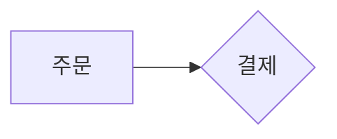
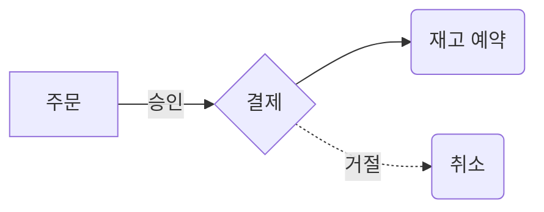
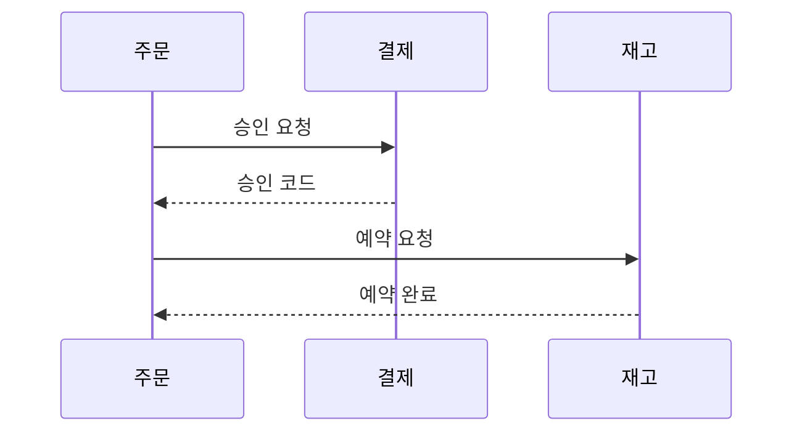
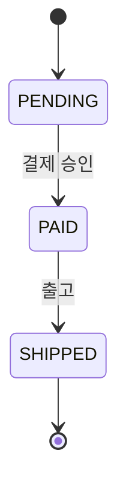
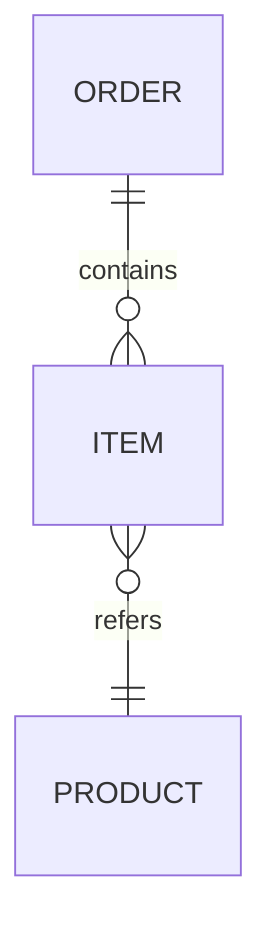
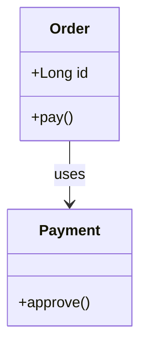

# fencesvg 구현 플랜

> **For agentic workers:** REQUIRED SUB-SKILL: Use superpowers:subagent-driven-development (recommended) or superpowers:executing-plans to implement this plan task-by-task. Steps use checkbox (`- [ ]`) syntax for tracking.

**Goal:** 마크다운 펜스에 mermaid 문법으로 쓴 다이어그램 5종을, 의존성 없이 그 사이트의 디자인 토큰으로 그려 내는 오픈소스 라이브러리를 만들고 블로그에 붙인다.

**Architecture:** `parse → layout → draw → profile` 네 단계 순수 함수. 레이아웃 엔진은 둘 — 계층 그래프(flowchart·state·ER·class)와 시퀀스 레인(sequence). 색은 `currentColor`·`var(--토큰)` 으로 내보내 칠하는 시점에 페이지 CSS 가 풀게 한다. 브라우저 API 를 쓰지 않아 Node 와 브라우저에서 같은 문자열이 나온다.

**Tech Stack:** TypeScript · vitest · tsup · npm. **런타임 의존성 0** (dev 의존성만 허용).

**Spec:** `docs/specs/2026-09-01-fencesvg-design.md`

## Global Constraints

- 런타임 의존성 **0개**. `package.json` 의 `dependencies` 는 끝까지 빈 객체다.
- 번들 예산 **min+gzip 20KB**. Task 14 의 게이트가 이걸 강제한다.
- 브라우저 전용 API(`document` · `window` · `canvas` · `performance`) 를 소스에서 쓰지 않는다. Node 에서 돌아야 한다.
- 모든 공개 함수는 **던지지 않는다.** 실패는 `{ svg: null, warnings: [...] }` 로 돌려준다.
- 출력 SVG 는 `sanitized` 프로파일 기본값을 지킨다 — `<style>` · `<use>` · `<script>` · `<foreignObject>` 없음, 빈 줄 없음, 요소는 한 줄에 하나, 모든 `id` 에 접두어.
- 레포 경로: `~/IdeaProjects/fencesvg` (msa 와 형제). 라이선스 MIT. 커밋은 개인 아이덴티티(`kgd` / `1989v@naver.com`).
- 좌표 단위는 정수로 반올림해 출력한다. 부동소수 꼬리가 스냅샷을 깨뜨린다.

---

### Task 1: 레포 스캐폴딩

**Files:**
- Create: `~/IdeaProjects/fencesvg/package.json`
- Create: `~/IdeaProjects/fencesvg/tsconfig.json`
- Create: `~/IdeaProjects/fencesvg/vitest.config.ts`
- Create: `~/IdeaProjects/fencesvg/.gitignore`
- Create: `~/IdeaProjects/fencesvg/LICENSE`
- Create: `~/IdeaProjects/fencesvg/src/index.ts`
- Test: `~/IdeaProjects/fencesvg/test/smoke.test.ts`

**Interfaces:**
- Consumes: 없음
- Produces: `version: string` — 이후 태스크가 import 경로(`../src/...`)를 신뢰할 수 있게 하는 토대

- [ ] **Step 1: 디렉토리와 git 초기화**

```bash
mkdir -p ~/IdeaProjects/fencesvg/src ~/IdeaProjects/fencesvg/test
cd ~/IdeaProjects/fencesvg
git init
git config user.name kgd
git config user.email 1989v@naver.com
```

- [ ] **Step 2: package.json 작성**

```json
{
  "name": "fencesvg",
  "version": "0.1.0",
  "description": "Render mermaid-syntax fences as SVG that matches your site's design tokens and survives your markdown sanitizer.",
  "license": "MIT",
  "type": "module",
  "main": "./dist/index.cjs",
  "module": "./dist/index.js",
  "types": "./dist/index.d.ts",
  "exports": {
    ".": { "types": "./dist/index.d.ts", "import": "./dist/index.js", "require": "./dist/index.cjs" }
  },
  "files": ["dist"],
  "sideEffects": false,
  "dependencies": {},
  "devDependencies": {
    "typescript": "^5.6.0",
    "vitest": "^2.1.0",
    "tsup": "^8.3.0"
  },
  "scripts": {
    "build": "tsup src/index.ts --format esm,cjs --dts --minify",
    "test": "vitest run",
    "size": "node scripts/size.mjs"
  }
}
```

- [ ] **Step 3: tsconfig.json 과 vitest.config.ts 작성**

```json
{
  "compilerOptions": {
    "target": "ES2022",
    "module": "ESNext",
    "moduleResolution": "bundler",
    "strict": true,
    "noUncheckedIndexedAccess": true,
    "declaration": true,
    "skipLibCheck": true,
    "lib": ["ES2022"]
  },
  "include": ["src", "test"]
}
```

`lib` 에 `DOM` 을 넣지 않는다. 브라우저 API 를 쓰면 **컴파일이 깨지게** 하는 것이 Global Constraints 를 검사로 지키는 것보다 낫다.

```ts
// vitest.config.ts
import { defineConfig } from 'vitest/config';
export default defineConfig({ test: { environment: 'node', include: ['test/**/*.test.ts'] } });
```

- [ ] **Step 4: .gitignore 와 LICENSE**

```
node_modules
dist
*.log
```

LICENSE 는 MIT 전문. `Copyright (c) 2026 kgd`.

- [ ] **Step 5: 실패하는 테스트 작성**

```ts
// test/smoke.test.ts
import { describe, it, expect } from 'vitest';
import { version } from '../src/index';

describe('패키지', () => {
  it('버전을 노출한다', () => {
    expect(version).toBe('0.1.0');
  });
});
```

- [ ] **Step 6: 테스트가 실패하는지 확인**

```bash
cd ~/IdeaProjects/fencesvg && npm install && npm test
```

Expected: FAIL — `Failed to resolve import "../src/index"`

- [ ] **Step 7: 최소 구현**

```ts
// src/index.ts
export const version = '0.1.0';
```

- [ ] **Step 8: 테스트 통과 확인**

```bash
npm test
```

Expected: PASS (1 test)

- [ ] **Step 9: 커밋**

```bash
git add -A
git commit -m "chore: 레포 스캐폴딩 (TS · vitest · tsup, 런타임 의존성 0)"
```

---

### Task 2: 글자 폭 근사

브라우저 측정에 기대면 CSR 전용이 되고 하이드레이션에서 그림 크기가 한 번 바뀐다. 문자 부류별 평균 advance 로 추정한다.

**Files:**
- Create: `src/text.ts`
- Test: `test/text.test.ts`

**Interfaces:**
- Consumes: 없음
- Produces: `measureText(text: string, fontSize: number): number` — px 단위 추정 폭. 레이아웃이 상자 크기를 정할 때 쓴다.

- [ ] **Step 1: 실패하는 테스트 작성**

```ts
// test/text.test.ts
import { describe, it, expect } from 'vitest';
import { measureText } from '../src/text';

describe('measureText', () => {
  it('한글은 폰트 크기와 거의 같은 폭을 가진다', () => {
    expect(measureText('주문', 13)).toBeCloseTo(26, 0);
  });

  it('라틴 소문자는 한글의 절반쯤이다', () => {
    const latin = measureText('order', 13);
    const hangul = measureText('주문', 13);
    expect(latin).toBeLessThan(hangul * 1.5);
    expect(latin).toBeGreaterThan(hangul * 0.8);
  });

  it('대문자가 소문자보다 넓다', () => {
    expect(measureText('ORDER', 13)).toBeGreaterThan(measureText('order', 13));
  });

  it('빈 문자열은 0 이다', () => {
    expect(measureText('', 13)).toBe(0);
  });

  it('폰트 크기에 선형으로 비례한다', () => {
    expect(measureText('주문', 26)).toBeCloseTo(measureText('주문', 13) * 2, 5);
  });
});
```

- [ ] **Step 2: 테스트가 실패하는지 확인**

```bash
npm test -- text
```

Expected: FAIL — `Failed to resolve import "../src/text"`

- [ ] **Step 3: 구현**

```ts
// src/text.ts

/**
 * 문자 부류별 평균 advance (em 단위).
 * 브라우저에서 재지 않는 이유 — 측정에 기대면 Node 에서 못 돌고,
 * 서버와 브라우저가 다른 크기를 내면 하이드레이션에서 그림이 한 번 튄다.
 */
const EM = {
  cjk: 1.0,      // 한글·한자·가나는 전각 고정폭에 가깝다
  upper: 0.66,
  lower: 0.52,
  digit: 0.55,
  narrow: 0.28,  // 공백·구두점
  other: 0.6,
} as const;

function classOf(cp: number): keyof typeof EM {
  // CJK 통합한자 · 한글 음절 · 한글 자모 · 가나 · 전각 기호
  if ((cp >= 0x1100 && cp <= 0x11ff) || (cp >= 0x3000 && cp <= 0x30ff) ||
      (cp >= 0x3130 && cp <= 0x318f) || (cp >= 0x4e00 && cp <= 0x9fff) ||
      (cp >= 0xac00 && cp <= 0xd7a3) || (cp >= 0xff00 && cp <= 0xff60)) return 'cjk';
  if (cp >= 0x41 && cp <= 0x5a) return 'upper';
  if (cp >= 0x61 && cp <= 0x7a) return 'lower';
  if (cp >= 0x30 && cp <= 0x39) return 'digit';
  if (cp === 0x20 || (cp >= 0x21 && cp <= 0x2f) || (cp >= 0x3a && cp <= 0x40)) return 'narrow';
  return 'other';
}

/** 라벨의 렌더 폭 추정(px). 상자 크기를 정하는 데만 쓴다 — 픽셀 정확도가 필요하지 않다. */
export function measureText(text: string, fontSize: number): number {
  let em = 0;
  for (const ch of text) em += EM[classOf(ch.codePointAt(0)!)];
  return em * fontSize;
}
```

- [ ] **Step 4: 테스트 통과 확인**

```bash
npm test -- text
```

Expected: PASS (5 tests)

- [ ] **Step 5: 커밋**

```bash
git add src/text.ts test/text.test.ts
git commit -m "feat: 글자 폭 근사 — 브라우저 측정 없이 Node·브라우저 동일"
```

---

### Task 3: SVG 빌더와 프로파일

프로파일을 "검사"가 아니라 **출력 계층**으로 만든다. 금지된 요소를 낼 방법이 애초에 없으면 검사할 게 없다.

**Files:**
- Create: `src/svg.ts`
- Test: `test/svg.test.ts`

**Interfaces:**
- Consumes: 없음
- Produces:
  - `type Attrs = Record<string, string | number | undefined>`
  - `el(tag: string, attrs: Attrs, children?: string[]): string` — 한 줄짜리 SVG 요소 문자열
  - `text(content: string, attrs: Attrs): string` — 텍스트 요소(내용 이스케이프)
  - `svgRoot(opts: { width: number; height: number; label: string; body: string[]; pad?: number }): string`
  - `escapeXml(s: string): string`

- [ ] **Step 1: 실패하는 테스트 작성**

```ts
// test/svg.test.ts
import { describe, it, expect } from 'vitest';
import { el, text, svgRoot, escapeXml } from '../src/svg';

describe('el', () => {
  it('요소를 한 줄로 낸다', () => {
    const out = el('rect', { x: 1, y: 2, width: 10, height: 4 });
    expect(out).toBe('<rect x="1" y="2" width="10" height="4"/>');
    expect(out).not.toContain('\n');
  });

  it('undefined 속성은 빼고 낸다', () => {
    expect(el('rect', { x: 1, fill: undefined })).toBe('<rect x="1"/>');
  });

  it('금지된 태그는 낼 수 없다', () => {
    for (const tag of ['style', 'script', 'use', 'foreignObject']) {
      expect(() => el(tag, {})).toThrow(/금지된 태그/);
    }
  });

  it('자식이 있으면 감싼다', () => {
    expect(el('g', { id: 'a' }, ['<rect/>'])).toBe('<g id="a"><rect/></g>');
  });
});

describe('text', () => {
  it('내용을 이스케이프한다', () => {
    expect(text('a < b & c', { x: 0 })).toBe('<text x="0">a &lt; b &amp; c</text>');
  });
});

describe('escapeXml', () => {
  it('다섯 문자를 바꾼다', () => {
    expect(escapeXml(`<>&"'`)).toBe('&lt;&gt;&amp;&quot;&apos;');
  });
});

describe('svgRoot', () => {
  const out = svgRoot({ width: 100, height: 40, label: '주문이 결제로 간다', body: ['<rect/>', '<line/>'] });

  it('viewBox 를 쓰고 width·height 속성은 안 쓴다', () => {
    expect(out).toContain('viewBox="0 0 100 40"');
    expect(out).not.toMatch(/<svg[^>]*\swidth=/);
  });

  it('role 과 aria-label 을 단다', () => {
    expect(out).toContain('role="img"');
    expect(out).toContain('aria-label="주문이 결제로 간다"');
  });

  it('빈 줄이 없다', () => {
    expect(out.split('\n').every((l) => l.trim().length > 0)).toBe(true);
  });

  it('한 줄에 요소 하나씩이다', () => {
    const lines = out.split('\n');
    expect(lines).toContain('<rect/>');
    expect(lines).toContain('<line/>');
  });
});
```

- [ ] **Step 2: 테스트가 실패하는지 확인**

```bash
npm test -- svg
```

Expected: FAIL — `Failed to resolve import "../src/svg"`

- [ ] **Step 3: 구현**

```ts
// src/svg.ts

/**
 * 발행 경로가 지우는 태그. 검사로 잡는 대신 **낼 수 없게** 한다 —
 * 검사는 통과시킬 수 있지만 여기서는 컴파일된 코드가 던진다.
 */
const FORBIDDEN = new Set(['style', 'script', 'use', 'foreignObject']);

export type Attrs = Record<string, string | number | undefined>;

export function escapeXml(s: string): string {
  return s.replace(/[<>&"']/g, (c) =>
    ({ '<': '&lt;', '>': '&gt;', '&': '&amp;', '"': '&quot;', "'": '&apos;' })[c]!);
}

function attrs(a: Attrs): string {
  return Object.entries(a)
    .filter(([, v]) => v !== undefined)
    .map(([k, v]) => ` ${k}="${typeof v === 'number' ? round(v) : escapeXml(String(v))}"`)
    .join('');
}

/** 좌표의 부동소수 꼬리는 스냅샷을 깨뜨린다 */
function round(n: number): string {
  return String(Math.round(n * 100) / 100);
}

export function el(tag: string, a: Attrs, children?: string[]): string {
  if (FORBIDDEN.has(tag)) throw new Error(`금지된 태그: ${tag}`);
  if (!children || children.length === 0) return `<${tag}${attrs(a)}/>`;
  return `<${tag}${attrs(a)}>${children.join('')}</${tag}>`;
}

export function text(content: string, a: Attrs): string {
  return `<text${attrs(a)}>${escapeXml(content)}</text>`;
}

/** `pad` 는 viewBox 를 바깥으로 여는 여백이다 — 모든 좌표를 옮기는 것보다 싸다 */
export function svgRoot(o: { width: number; height: number; label: string; body: string[]; pad?: number }): string {
  const p = o.pad ?? 0;
  const open = `<svg viewBox="${-p} ${-p} ${Math.round(o.width + p * 2)} ${Math.round(o.height + p * 2)}" role="img" aria-label="${escapeXml(o.label)}" xmlns="http://www.w3.org/2000/svg">`;
  // 빈 줄은 CommonMark 가 HTML 블록을 끊는 자리다. filter 로 원천 차단한다.
  const lines = o.body.filter((l) => l.trim().length > 0);
  return [open, ...lines, '</svg>'].join('\n');
}
```

- [ ] **Step 4: 테스트 통과 확인**

```bash
npm test -- svg
```

Expected: PASS (9 tests)

- [ ] **Step 5: 커밋**

```bash
git add src/svg.ts test/svg.test.ts
git commit -m "feat: SVG 빌더 — 금지 태그를 검사가 아니라 타입으로 막는다"
```

---

### Task 4: 계층 그래프 레이아웃

flowchart · state · ER · class 넷이 나눠 쓰는 엔진. 랭크 배치 → 층 내 순서 → 좌표 순이다.

**Files:**
- Create: `src/layout/graph.ts`
- Test: `test/layout-graph.test.ts`

**Interfaces:**
- Consumes: 없음
- Produces:
  - `type Dir = 'LR' | 'RL' | 'TD' | 'BT'` — Task 5·6·7 이 import 한다
  - `type GraphNode = { id: string; w: number; h: number }`
  - `type GraphEdge = { from: string; to: string }`
  - `type Placed = { id: string; x: number; y: number; w: number; h: number }`
  - `type GraphLayout = { nodes: Placed[]; width: number; height: number; rankOf: Map<string, number> }`
  - `layoutGraph(nodes: GraphNode[], edges: GraphEdge[], dir: Dir, gap?: { rank: number; node: number }): GraphLayout`

- [ ] **Step 1: 실패하는 테스트 작성**

```ts
// test/layout-graph.test.ts
import { describe, it, expect } from 'vitest';
import { layoutGraph } from '../src/layout/graph';

const n = (id: string) => ({ id, w: 100, h: 40 });

describe('layoutGraph', () => {
  it('LR 에서 후행 노드가 오른쪽에 온다', () => {
    const out = layoutGraph([n('a'), n('b')], [{ from: 'a', to: 'b' }], 'LR');
    const a = out.nodes.find((p) => p.id === 'a')!;
    const b = out.nodes.find((p) => p.id === 'b')!;
    expect(b.x).toBeGreaterThan(a.x);
    expect(out.rankOf.get('b')).toBe(1);
  });

  it('TD 에서 후행 노드가 아래에 온다', () => {
    const out = layoutGraph([n('a'), n('b')], [{ from: 'a', to: 'b' }], 'TD');
    expect(out.nodes.find((p) => p.id === 'b')!.y)
      .toBeGreaterThan(out.nodes.find((p) => p.id === 'a')!.y);
  });

  it('RL 은 LR 을 뒤집은 좌표다', () => {
    const lr = layoutGraph([n('a'), n('b')], [{ from: 'a', to: 'b' }], 'LR');
    const rl = layoutGraph([n('a'), n('b')], [{ from: 'a', to: 'b' }], 'RL');
    expect(rl.nodes.find((p) => p.id === 'b')!.x)
      .toBeLessThan(rl.nodes.find((p) => p.id === 'a')!.x);
    expect(rl.width).toBe(lr.width);
  });

  it('같은 랭크의 형제는 겹치지 않는다', () => {
    const out = layoutGraph(
      [n('a'), n('b'), n('c')],
      [{ from: 'a', to: 'b' }, { from: 'a', to: 'c' }],
      'LR',
    );
    const b = out.nodes.find((p) => p.id === 'b')!;
    const c = out.nodes.find((p) => p.id === 'c')!;
    expect(Math.abs(b.y - c.y)).toBeGreaterThanOrEqual(40);
  });

  it('가장 긴 경로가 랭크를 정한다', () => {
    const out = layoutGraph(
      [n('a'), n('b'), n('c')],
      [{ from: 'a', to: 'b' }, { from: 'b', to: 'c' }, { from: 'a', to: 'c' }],
      'LR',
    );
    expect(out.rankOf.get('c')).toBe(2);
  });

  it('순환이 있어도 끝난다', () => {
    const out = layoutGraph(
      [n('a'), n('b')],
      [{ from: 'a', to: 'b' }, { from: 'b', to: 'a' }],
      'LR',
    );
    expect(out.nodes).toHaveLength(2);
  });

  it('간선 없는 노드도 배치된다', () => {
    const out = layoutGraph([n('a')], [], 'LR');
    expect(out.nodes).toHaveLength(1);
    expect(out.width).toBeGreaterThan(0);
  });

  it('결정적이다 — 같은 입력이 같은 좌표를 낸다', () => {
    const run = () => JSON.stringify(layoutGraph(
      [n('a'), n('b'), n('c')],
      [{ from: 'a', to: 'b' }, { from: 'a', to: 'c' }], 'LR').nodes);
    expect(run()).toBe(run());
  });
});
```

- [ ] **Step 2: 테스트가 실패하는지 확인**

```bash
npm test -- layout-graph
```

Expected: FAIL — `Failed to resolve import "../src/layout/graph"`

- [ ] **Step 3: 구현**

```ts
// src/layout/graph.ts
export type GraphNode = { id: string; w: number; h: number };
export type GraphEdge = { from: string; to: string };
export type Placed = { id: string; x: number; y: number; w: number; h: number };
export type GraphLayout = { nodes: Placed[]; width: number; height: number; rankOf: Map<string, number> };
export type Dir = 'LR' | 'RL' | 'TD' | 'BT';

const DEFAULT_GAP = { rank: 56, node: 24 };

/**
 * 랭크 = 진입 간선을 따라간 가장 긴 경로 길이.
 * 순환이 있으면 이미 방문한 노드를 건너뛰어 끝나게 한다 — 순환 그래프의
 * "옳은" 랭크는 정의되지 않지만, 안 끝나는 것보다 임의로 끊는 편이 낫다.
 */
function rank(nodes: GraphNode[], edges: GraphEdge[]): Map<string, number> {
  const succ = new Map<string, string[]>();
  const indeg = new Map<string, number>();
  for (const n of nodes) { succ.set(n.id, []); indeg.set(n.id, 0); }
  for (const e of edges) {
    if (!succ.has(e.from) || !succ.has(e.to)) continue;
    succ.get(e.from)!.push(e.to);
    indeg.set(e.to, indeg.get(e.to)! + 1);
  }
  const r = new Map<string, number>(nodes.map((n) => [n.id, 0]));
  const queue = nodes.filter((n) => indeg.get(n.id) === 0).map((n) => n.id);
  const seen = new Set<string>(queue);
  // 진입 간선이 전부 있는 순환만 남으면 시작점이 없다 — 첫 노드를 시작점으로 삼는다
  if (queue.length === 0 && nodes.length > 0) { queue.push(nodes[0]!.id); seen.add(nodes[0]!.id); }
  while (queue.length > 0) {
    const id = queue.shift()!;
    for (const to of succ.get(id)!) {
      r.set(to, Math.max(r.get(to)!, r.get(id)! + 1));
      if (!seen.has(to)) { seen.add(to); queue.push(to); }
    }
  }
  return r;
}

/** 층 내 순서 — 앞 층에서 오는 이웃의 평균 위치(barycenter)로 정렬한다 */
function order(layers: string[][], edges: GraphEdge[]): void {
  const pred = new Map<string, string[]>();
  for (const e of edges) {
    if (!pred.has(e.to)) pred.set(e.to, []);
    pred.get(e.to)!.push(e.from);
  }
  for (let i = 1; i < layers.length; i++) {
    const prevIndex = new Map(layers[i - 1]!.map((id, idx) => [id, idx]));
    const bary = new Map<string, number>();
    layers[i]!.forEach((id, idx) => {
      const ps = (pred.get(id) ?? []).map((p) => prevIndex.get(p)).filter((v): v is number => v !== undefined);
      // 앞 층에 이웃이 없으면 제자리를 지킨다 — 결정성을 위해 idx 를 쓴다
      bary.set(id, ps.length === 0 ? idx : ps.reduce((a, b) => a + b, 0) / ps.length);
    });
    layers[i] = layers[i]!
      .map((id, idx) => ({ id, idx }))
      .sort((a, b) => (bary.get(a.id)! - bary.get(b.id)!) || (a.idx - b.idx))
      .map((x) => x.id);
  }
}

export function layoutGraph(
  nodes: GraphNode[],
  edges: GraphEdge[],
  dir: Dir,
  gap: { rank: number; node: number } = DEFAULT_GAP,
): GraphLayout {
  const byId = new Map(nodes.map((n) => [n.id, n]));
  const rankOf = rank(nodes, edges);
  const maxRank = Math.max(0, ...rankOf.values());
  const layers: string[][] = Array.from({ length: maxRank + 1 }, () => []);
  for (const n of nodes) layers[rankOf.get(n.id)!]!.push(n.id);
  order(layers, edges);

  const horizontal = dir === 'LR' || dir === 'RL';
  // 랭크축 = 층이 늘어서는 방향, 교차축 = 층 안에서 늘어서는 방향
  const rankSize = layers.map((l) => Math.max(0, ...l.map((id) => horizontal ? byId.get(id)!.w : byId.get(id)!.h)));
  const crossSize = layers.map((l) =>
    l.reduce((s, id) => s + (horizontal ? byId.get(id)!.h : byId.get(id)!.w), 0) + gap.node * Math.max(0, l.length - 1));

  const rankTotal = rankSize.reduce((a, b) => a + b, 0) + gap.rank * Math.max(0, layers.length - 1);
  const crossTotal = Math.max(0, ...crossSize);

  const placed: Placed[] = [];
  let rankPos = 0;
  layers.forEach((layer, li) => {
    let crossPos = (crossTotal - crossSize[li]!) / 2;   // 층을 교차축 가운데로
    for (const id of layer) {
      const n = byId.get(id)!;
      const along = rankPos + (rankSize[li]! - (horizontal ? n.w : n.h)) / 2;
      placed.push(horizontal
        ? { id, x: along, y: crossPos, w: n.w, h: n.h }
        : { id, x: crossPos, y: along, w: n.w, h: n.h });
      crossPos += (horizontal ? n.h : n.w) + gap.node;
    }
    rankPos += rankSize[li]! + gap.rank;
  });

  const width = horizontal ? rankTotal : crossTotal;
  const height = horizontal ? crossTotal : rankTotal;

  // RL·BT 는 LR·TD 를 랭크축에서 뒤집은 것이다. 배치 로직을 두 벌 갖지 않는다.
  if (dir === 'RL') for (const p of placed) p.x = width - p.x - p.w;
  if (dir === 'BT') for (const p of placed) p.y = height - p.y - p.h;

  return { nodes: placed, width, height, rankOf };
}
```

- [ ] **Step 4: 테스트 통과 확인**

```bash
npm test -- layout-graph
```

Expected: PASS (8 tests)

- [ ] **Step 5: 커밋**

```bash
git add src/layout/graph.ts test/layout-graph.test.ts
git commit -m "feat: 계층 그래프 레이아웃 — 네 타입이 나눠 쓰는 엔진"
```

---

### Task 5: 에지 라우팅

**Files:**
- Create: `src/layout/edge.ts`
- Test: `test/layout-edge.test.ts`

**Interfaces:**
- Consumes: `Placed` (Task 4)
- Produces:
  - `type Point = { x: number; y: number }`
  - `routeEdge(from: Placed, to: Placed, dir: Dir): { path: Point[]; labelAt: Point }` — 상자 **테두리에서** 시작·끝나는 꺾은선

- [ ] **Step 1: 실패하는 테스트 작성**

```ts
// test/layout-edge.test.ts
import { describe, it, expect } from 'vitest';
import { routeEdge } from '../src/layout/edge';

const box = (x: number, y: number) => ({ id: 'x', x, y, w: 100, h: 40 });

describe('routeEdge', () => {
  it('LR 에서 오른쪽 테두리에서 나가 왼쪽 테두리로 들어간다', () => {
    const { path } = routeEdge(box(0, 0), box(200, 0), 'LR');
    expect(path[0]).toEqual({ x: 100, y: 20 });
    expect(path[path.length - 1]).toEqual({ x: 200, y: 20 });
  });

  it('TD 에서 아래 테두리에서 나가 위 테두리로 들어간다', () => {
    const { path } = routeEdge(box(0, 0), box(0, 200), 'TD');
    expect(path[0]).toEqual({ x: 50, y: 40 });
    expect(path[path.length - 1]).toEqual({ x: 50, y: 200 });
  });

  it('교차축이 어긋나면 꺾는다', () => {
    const { path } = routeEdge(box(0, 0), box(200, 120), 'LR');
    expect(path.length).toBeGreaterThan(2);
  });

  it('일직선이면 두 점이다', () => {
    const { path } = routeEdge(box(0, 0), box(200, 0), 'LR');
    expect(path).toHaveLength(2);
  });

  it('라벨 위치는 경로 중간이다', () => {
    const { labelAt } = routeEdge(box(0, 0), box(200, 0), 'LR');
    expect(labelAt.x).toBeCloseTo(150, 0);
  });
});
```

- [ ] **Step 2: 테스트가 실패하는지 확인**

```bash
npm test -- layout-edge
```

Expected: FAIL — `Failed to resolve import "../src/layout/edge"`

- [ ] **Step 3: 구현**

```ts
// src/layout/edge.ts
import type { Placed } from './graph';
import type { Dir } from './graph';

export type Point = { x: number; y: number };

/** 상자의 랭크축 방향 출구·입구 지점 */
function port(b: Placed, side: 'out' | 'in', dir: Dir): Point {
  const cx = b.x + b.w / 2;
  const cy = b.y + b.h / 2;
  switch (dir) {
    case 'LR': return { x: side === 'out' ? b.x + b.w : b.x, y: cy };
    case 'RL': return { x: side === 'out' ? b.x : b.x + b.w, y: cy };
    case 'TD': return { x: cx, y: side === 'out' ? b.y + b.h : b.y };
    case 'BT': return { x: cx, y: side === 'out' ? b.y : b.y + b.h };
  }
}

/**
 * 직교 꺾은선. 랭크축으로 절반 나아가고, 교차축을 맞춘 뒤, 다시 랭크축으로 들어간다.
 * 곡선을 쓰지 않는 이유 — path 데이터가 길어지면 손으로 읽을 수 없고,
 * 스펙이 말하는 "긴 장식용 path 는 도구가 필요하다는 신호"에 걸린다.
 */
export function routeEdge(from: Placed, to: Placed, dir: Dir): { path: Point[]; labelAt: Point } {
  const a = port(from, 'out', dir);
  const b = port(to, 'in', dir);
  const horizontal = dir === 'LR' || dir === 'RL';
  const aligned = horizontal ? Math.abs(a.y - b.y) < 0.5 : Math.abs(a.x - b.x) < 0.5;

  const path: Point[] = aligned
    ? [a, b]
    : horizontal
      ? [a, { x: (a.x + b.x) / 2, y: a.y }, { x: (a.x + b.x) / 2, y: b.y }, b]
      : [a, { x: a.x, y: (a.y + b.y) / 2 }, { x: b.x, y: (a.y + b.y) / 2 }, b];

  return { path, labelAt: { x: (a.x + b.x) / 2, y: (a.y + b.y) / 2 } };
}
```

- [ ] **Step 4: 테스트 통과 확인**

```bash
npm test -- layout-edge
```

Expected: PASS (5 tests)

- [ ] **Step 5: 커밋**

```bash
git add src/layout/edge.ts test/layout-edge.test.ts
git commit -m "feat: 직교 에지 라우팅 — 상자 테두리에서 시작하고 끝난다"
```

---

### Task 6: flowchart 파서

**Files:**
- Create: `src/parse/flowchart.ts`
- Create: `src/parse/types.ts`
- Test: `test/parse-flowchart.test.ts`

**Interfaces:**
- Consumes: 없음
- Produces:
  - `src/parse/types.ts`: `type Shape = 'rect'|'round'|'diamond'`, `type Line = 'solid'|'dotted'`, `type FlowNode = { id: string; label: string; shape: Shape }`, `type FlowEdge = { from: string; to: string; label?: string; line: Line }`, `type FlowModel = { kind: 'flowchart'; dir: Dir; nodes: FlowNode[]; edges: FlowEdge[]; emphasis: Set<string> }`
  - `parseFlowchart(src: string): FlowModel | { error: string }`

- [ ] **Step 1: 실패하는 테스트 작성**

```ts
// test/parse-flowchart.test.ts
import { describe, it, expect } from 'vitest';
import { parseFlowchart } from '../src/parse/flowchart';

const ok = (src: string) => {
  const m = parseFlowchart(src);
  if ('error' in m) throw new Error(m.error);
  return m;
};

describe('parseFlowchart', () => {
  it('방향을 읽는다', () => {
    expect(ok('flowchart TD\n A[a] --> B[b]').dir).toBe('TD');
  });

  it('방향이 없으면 LR 이다', () => {
    expect(ok('flowchart\n A[a] --> B[b]').dir).toBe('LR');
  });

  it('상자 모양 3종을 읽는다', () => {
    const m = ok('flowchart LR\n A[네모] --> B(둥근)\n B --> C{마름모}');
    expect(m.nodes.map((n) => n.shape)).toEqual(['rect', 'round', 'diamond']);
    expect(m.nodes.map((n) => n.label)).toEqual(['네모', '둥근', '마름모']);
  });

  it('간선 라벨을 읽는다', () => {
    expect(ok('flowchart LR\n A[a] -->|승인| B[b]').edges[0]!.label).toBe('승인');
  });

  it('점선을 구분한다', () => {
    const m = ok('flowchart LR\n A[a] -.-> B[b]');
    expect(m.edges[0]!.line).toBe('dotted');
  });

  it('라벨 없이 id 만 쓰면 id 가 라벨이다', () => {
    expect(ok('flowchart LR\n A --> B').nodes[0]!.label).toBe('A');
  });

  it('같은 노드를 여러 번 써도 하나다', () => {
    const m = ok('flowchart LR\n A[a] --> B[b]\n A --> C[c]');
    expect(m.nodes).toHaveLength(3);
  });

  it('class 로 강조를 표시한다', () => {
    expect(ok('flowchart LR\n A[a] --> B[b]\n class B emphasis').emphasis.has('B')).toBe(true);
  });

  it('%% 주석을 건너뛴다', () => {
    expect(ok('flowchart LR\n %% caption: 설명\n A[a] --> B[b]').nodes).toHaveLength(2);
  });

  it('subgraph 는 아직 못 읽는다고 알린다', () => {
    const m = parseFlowchart('flowchart LR\n subgraph s\n A --> B\n end');
    expect(m).toHaveProperty('error');
    expect((m as { error: string }).error).toMatch(/subgraph/);
  });

  it('flowchart 가 아니면 오류다', () => {
    expect(parseFlowchart('sequenceDiagram\n A->>B: x')).toHaveProperty('error');
  });
});
```

- [ ] **Step 2: 테스트가 실패하는지 확인**

```bash
npm test -- parse-flowchart
```

Expected: FAIL — `Failed to resolve import "../src/parse/flowchart"`

- [ ] **Step 3: 공용 타입 작성**

```ts
// src/parse/types.ts
import type { Dir } from '../layout/graph';

export type Shape = 'rect' | 'round' | 'diamond';
export type Line = 'solid' | 'dotted';

export type FlowNode = { id: string; label: string; shape: Shape };
export type FlowEdge = { from: string; to: string; label?: string; line: Line };
export type FlowModel = {
  kind: 'flowchart' | 'state';
  dir: Dir;
  nodes: FlowNode[];
  edges: FlowEdge[];
  emphasis: Set<string>;
};

export type ParseError = { error: string };
```

`isError` 같은 헬퍼를 두지 않는다. 호출부가 `'error' in model` 로 좁히면 되고, 쓰는 곳이 하나뿐인 헬퍼는 읽는 사람이 한 번 더 건너뛰게 만든다.

- [ ] **Step 4: 파서 구현**

```ts
// src/parse/flowchart.ts
import type { Dir } from '../layout/graph';
import type { FlowModel, FlowNode, FlowEdge, ParseError, Shape, Line } from './types';

const DIRS = new Set(['LR', 'RL', 'TD', 'BT', 'TB']);
// id[라벨] · id(라벨) · id{라벨} · id
const NODE = /^([A-Za-z0-9_-]+)(?:\[([^\]]*)\]|\(([^)]*)\)|\{([^}]*)\})?$/;
// --> · -.-> · -->|라벨| · -.->|라벨|
const EDGE = /\s(-{2}>|-\.->)(?:\|([^|]*)\|)?\s/;

function node(token: string): { node: FlowNode } | ParseError {
  const m = NODE.exec(token.trim());
  if (!m) return { error: `읽을 수 없는 노드: ${token.trim()}` };
  const id = m[1]!;
  const shape: Shape = m[3] !== undefined ? 'round' : m[4] !== undefined ? 'diamond' : 'rect';
  const label = m[2] ?? m[3] ?? m[4] ?? id;
  return { node: { id, label, shape } };
}

export function parseFlowchart(src: string): FlowModel | ParseError {
  const lines = src.split('\n').map((l) => l.trim()).filter((l) => l.length > 0);
  const head = lines[0] ?? '';
  if (!/^flowchart\b/.test(head)) return { error: 'flowchart 선언으로 시작하지 않는다' };

  const declared = head.slice('flowchart'.length).trim().toUpperCase();
  const dir: Dir = declared === 'TB' ? 'TD' : (DIRS.has(declared) ? declared : 'LR') as Dir;

  const nodes = new Map<string, FlowNode>();
  const edges: FlowEdge[] = [];
  const emphasis = new Set<string>();

  for (const line of lines.slice(1)) {
    if (line.startsWith('%%')) continue;
    if (/^subgraph\b/.test(line)) return { error: 'subgraph 는 아직 지원하지 않는다' };
    if (line === 'end') return { error: 'subgraph 는 아직 지원하지 않는다' };

    if (/^class\s/.test(line)) {
      const [, ids, name] = /^class\s+([^\s]+)\s+(\w+)$/.exec(line) ?? [];
      if (ids && name === 'emphasis') for (const id of ids.split(',')) emphasis.add(id.trim());
      continue;
    }

    const m = EDGE.exec(` ${line} `);
    if (!m) {
      const only = node(line);
      if ('error' in only) return only;
      nodes.set(only.node.id, nodes.get(only.node.id) ?? only.node);
      continue;
    }

    const idx = ` ${line} `.indexOf(m[0]);
    const left = node(` ${line} `.slice(0, idx));
    const right = node(` ${line} `.slice(idx + m[0].length));
    if ('error' in left) return left;
    if ('error' in right) return right;

    // 라벨을 가진 선언이 이기게 한다 — `A[주문] --> B` 뒤에 `A --> C` 가 와도 라벨이 남는다
    for (const n of [left.node, right.node]) {
      const prev = nodes.get(n.id);
      if (!prev || (prev.label === prev.id && n.label !== n.id)) nodes.set(n.id, n);
    }
    edges.push({
      from: left.node.id,
      to: right.node.id,
      label: m[2]?.trim() || undefined,
      line: (m[1] === '-.->' ? 'dotted' : 'solid') as Line,
    });
  }

  if (nodes.size === 0) return { error: '노드가 없다' };
  return { kind: 'flowchart', dir, nodes: [...nodes.values()], edges, emphasis };
}
```

- [ ] **Step 5: 테스트 통과 확인**

```bash
npm test -- parse-flowchart
```

Expected: PASS (11 tests)

- [ ] **Step 6: 커밋**

```bash
git add src/parse/ test/parse-flowchart.test.ts
git commit -m "feat: flowchart 파서 — 못 읽는 문법은 오류로 알린다"
```

---

### Task 7: flowchart 작도

**Files:**
- Create: `src/draw/theme.ts`
- Create: `src/draw/flowchart.ts`
- Test: `test/draw-flowchart.test.ts`

**Interfaces:**
- Consumes: `FlowModel` (Task 6), `layoutGraph` (Task 4), `routeEdge` (Task 5), `el`/`text`/`svgRoot` (Task 3), `measureText` (Task 2)
- Produces:
  - `src/draw/theme.ts`: `type Theme = { ink: string; accent: string; fontSize: number; labelSize: number; pad: number }`, `defaultTheme(accent?: string): Theme`
  - `drawFlowchart(model: FlowModel, theme: Theme, idPrefix: string, label: string): string`
  - `arrowMarker(id: string): string` — **export 한다.** Task 10·13 이 같은 화살촉을 쓴다

- [ ] **Step 1: 실패하는 테스트 작성**

```ts
// test/draw-flowchart.test.ts
import { describe, it, expect } from 'vitest';
import { parseFlowchart } from '../src/parse/flowchart';
import { drawFlowchart } from '../src/draw/flowchart';
import { defaultTheme } from '../src/draw/theme';

const draw = (src: string, accent?: string) => {
  const m = parseFlowchart(src);
  if ('error' in m) throw new Error(m.error);
  return drawFlowchart(m, defaultTheme(accent), 'd1', '설명');
};

describe('drawFlowchart', () => {
  const out = draw('flowchart LR\n A[주문] -->|승인| B{결제}\n B -.-> C(취소)\n class C emphasis');

  it('노드마다 도형이 하나씩 나온다', () => {
    expect((out.match(/<rect/g) ?? []).length).toBe(2);   // 사각 + 둥근
    expect((out.match(/<polygon/g) ?? []).length).toBeGreaterThanOrEqual(1); // 마름모 + 화살촉
  });

  it('선 색을 currentColor 로 낸다', () => {
    expect(out).toContain('stroke="currentColor"');
  });

  it('강조 노드만 accent 를 쓴다', () => {
    expect((out.match(/var\(--accent\)/g) ?? []).length).toBeGreaterThan(0);
  });

  it('점선은 stroke-dasharray 로 낸다', () => {
    expect(out).toContain('stroke-dasharray');
  });

  it('화살촉 marker 의 id 에 접두어가 붙는다', () => {
    expect(out).toContain('id="d1-arrow"');
    expect(out).toContain('marker-end="url(#d1-arrow)"');
  });

  it('간선 라벨이 들어간다', () => {
    expect(out).toContain('>승인<');
  });

  it('빈 줄이 없고 한 줄에 요소 하나씩이다', () => {
    expect(out.split('\n').every((l) => l.trim().length > 0)).toBe(true);
  });

  it('금지 태그가 없다', () => {
    for (const t of ['<style', '<script', '<use', '<foreignObject']) expect(out).not.toContain(t);
  });

  it('결정적이다', () => {
    const a = draw('flowchart LR\n A[주문] --> B[결제]');
    const b = draw('flowchart LR\n A[주문] --> B[결제]');
    expect(a).toBe(b);
  });

  it('accent 를 바꾸면 출력이 따라간다', () => {
    expect(draw('flowchart LR\n A[a] --> B[b]\n class B emphasis', 'var(--ko-accent-primary)'))
      .toContain('var(--ko-accent-primary)');
  });
});
```

- [ ] **Step 2: 테스트가 실패하는지 확인**

```bash
npm test -- draw-flowchart
```

Expected: FAIL — `Failed to resolve import "../src/draw/flowchart"`

- [ ] **Step 3: 테마 구현**

```ts
// src/draw/theme.ts

/**
 * 색은 값이 아니라 **참조**로 낸다. 칠하는 시점에 페이지 CSS 가 풀므로
 * 라이브러리는 사이트 색을 알 필요가 없고, 테마 토글도 그대로 따라간다.
 */
export type Theme = {
  ink: string;        // 선·글자
  accent: string;     // 강조 하나
  fontSize: number;   // 노드 라벨
  labelSize: number;  // 간선 라벨
  pad: number;        // 상자 안 여백
};

export function defaultTheme(accent = 'var(--accent)'): Theme {
  return { ink: 'currentColor', accent, fontSize: 13, labelSize: 11, pad: 14 };
}
```

- [ ] **Step 4: 작도 구현**

```ts
// src/draw/flowchart.ts
import type { FlowModel } from '../parse/types';
import type { Theme } from './theme';
import { layoutGraph, type GraphNode, type Placed } from '../layout/graph';
import { routeEdge } from '../layout/edge';
import { el, text, svgRoot } from '../svg';
import { measureText } from '../text';

const MIN_W = 72;
const H = 44;

export function arrowMarker(id: string): string {
  return el('defs', {}, [
    el('marker',
      { id, viewBox: '0 0 8 8', refX: 7, refY: 4, markerWidth: 6, markerHeight: 6, orient: 'auto' },
      [el('polygon', { points: '0,0 8,4 0,8', fill: 'currentColor' })]),
  ]);
}

function shapeOf(p: Placed, shape: string, stroke: string): string {
  if (shape === 'diamond') {
    const cx = p.x + p.w / 2, cy = p.y + p.h / 2;
    return el('polygon', {
      points: `${cx},${p.y} ${p.x + p.w},${cy} ${cx},${p.y + p.h} ${p.x},${cy}`,
      fill: 'none', stroke, 'stroke-width': 1.5,
    });
  }
  return el('rect', {
    x: p.x, y: p.y, width: p.w, height: p.h,
    rx: shape === 'round' ? p.h / 2 : 6,
    fill: 'none', stroke, 'stroke-width': 1.5,
  });
}

export function drawFlowchart(model: FlowModel, theme: Theme, idPrefix: string, label: string): string {
  const nodes: GraphNode[] = model.nodes.map((n) => ({
    id: n.id,
    // 마름모는 같은 라벨에 더 넓은 자리가 필요하다
    w: Math.max(MIN_W, measureText(n.label, theme.fontSize) + theme.pad * 2) * (n.shape === 'diamond' ? 1.4 : 1),
    h: H,
  }));
  const lay = layoutGraph(nodes, model.edges, model.dir);
  const at = new Map(lay.nodes.map((p) => [p.id, p]));
  const arrowId = `${idPrefix}-arrow`;

  const body: string[] = [arrowMarker(arrowId)];

  for (const e of model.edges) {
    const from = at.get(e.from), to = at.get(e.to);
    if (!from || !to) continue;
    const { path, labelAt } = routeEdge(from, to, model.dir);
    body.push(el('polyline', {
      points: path.map((pt) => `${Math.round(pt.x)},${Math.round(pt.y)}`).join(' '),
      fill: 'none', stroke: theme.ink, 'stroke-width': 1.5,
      'stroke-dasharray': e.line === 'dotted' ? '4 3' : undefined,
      'marker-end': `url(#${arrowId})`,
    }));
    if (e.label) {
      body.push(text(e.label, {
        x: labelAt.x, y: labelAt.y - 5, 'text-anchor': 'middle',
        fill: theme.ink, 'font-size': theme.labelSize,
      }));
    }
  }

  for (const n of model.nodes) {
    const p = at.get(n.id);
    if (!p) continue;
    const color = model.emphasis.has(n.id) ? theme.accent : theme.ink;
    body.push(shapeOf(p, n.shape, color));
    body.push(text(n.label, {
      x: p.x + p.w / 2, y: p.y + p.h / 2 + theme.fontSize / 3,
      'text-anchor': 'middle', fill: color, 'font-size': theme.fontSize,
    }));
  }

  return svgRoot({ width: lay.width, height: lay.height, label, body, pad: 4 });
}
```

- [ ] **Step 5: 테스트 통과 확인**

```bash
npm test
```

Expected: PASS (전체)

- [ ] **Step 6: 커밋**

```bash
git add src/draw/ test/draw-flowchart.test.ts
git commit -m "feat: flowchart 작도 — 색은 currentColor 와 accent 참조로만"
```

---

### Task 8: 공개 API — renderDiagram · inlineDiagrams · 캡션

여기서 **처음으로 쓸 수 있는 물건**이 나온다.

**Files:**
- Create: `src/render.ts`
- Modify: `src/index.ts`
- Test: `test/render.test.ts`

**Interfaces:**
- Consumes: `parseFlowchart` (Task 6), `drawFlowchart` (Task 7), `defaultTheme` (Task 7)
- Produces:
  - `type Options = { accent?: string; idPrefix?: string }` — **스펙의 `profile` 옵션은 넣지 않는다.** `permissive` 소비자가 아직 없어서 구현이 없는 인터페이스가 된다. `sanitized` 규칙은 출력 계층(Task 3)이 항상 지킨다
  - `type Result = { svg: string | null; caption: string | null; warnings: string[] }`
  - `renderDiagram(source: string, opts?: Options): Result`
  - `inlineDiagrams(markdown: string, opts?: Options): string`

- [ ] **Step 1: 실패하는 테스트 작성**

```ts
// test/render.test.ts
import { describe, it, expect } from 'vitest';
import { renderDiagram, inlineDiagrams } from '../src/render';

const FENCE = '```mermaid\n%% caption: 주문은 결제 승인 뒤에 재고를 잡는다\nflowchart LR\n  A[주문] --> B[결제]\n```';

describe('renderDiagram', () => {
  it('캡션 주석을 뽑아낸다', () => {
    const r = renderDiagram('%% caption: 설명이다\nflowchart LR\n A[a] --> B[b]');
    expect(r.caption).toBe('설명이다');
    expect(r.svg).toContain('aria-label="설명이다"');
  });

  it('캡션이 없으면 경고한다', () => {
    const r = renderDiagram('flowchart LR\n A[a] --> B[b]');
    expect(r.warnings.some((w) => w.includes('캡션'))).toBe(true);
    expect(r.svg).not.toBeNull();
  });

  it('던지지 않고 실패를 돌려준다', () => {
    const r = renderDiagram('flowchart LR\n subgraph s\n A --> B\n end');
    expect(r.svg).toBeNull();
    expect(r.warnings.length).toBeGreaterThan(0);
  });

  it('알 수 없는 타입도 던지지 않는다', () => {
    const r = renderDiagram('gantt\n title x');
    expect(r.svg).toBeNull();
  });
});

describe('inlineDiagrams', () => {
  const md = `앞 문장.\n\n${FENCE}\n\n뒤 문장.`;
  const out = inlineDiagrams(md);

  it('펜스를 SVG 로 바꾼다', () => {
    expect(out).toContain('<svg');
    expect(out).not.toContain('```mermaid');
  });

  it('캡션 줄을 SVG 블록 밖에 넣는다', () => {
    const lines = out.split('\n');
    const close = lines.findIndex((l) => l.includes('</svg>'));
    expect(lines[close + 1]).toBe('');
    expect(lines[close + 2]).toBe('그림: 주문은 결제 승인 뒤에 재고를 잡는다');
  });

  it('SVG 안에 빈 줄이 없다', () => {
    const body = out.slice(out.indexOf('<svg'), out.indexOf('</svg>'));
    expect(body.split('\n').every((l) => l.trim().length > 0)).toBe(true);
  });

  it('앞뒤 문장을 보존한다', () => {
    expect(out).toContain('앞 문장.');
    expect(out).toContain('뒤 문장.');
  });

  it('그림이 둘이면 id 접두어가 갈린다', () => {
    const two = inlineDiagrams(`${FENCE}\n\n${FENCE}`);
    expect(two).toContain('id="d1-arrow"');
    expect(two).toContain('id="d2-arrow"');
  });

  it('실패한 펜스는 원래 코드블록으로 남는다', () => {
    const bad = inlineDiagrams('```mermaid\nflowchart LR\n subgraph s\n end\n```');
    expect(bad).toContain('```mermaid');
  });

  it('펜스가 없으면 원문 그대로다', () => {
    expect(inlineDiagrams('그냥 글이다.')).toBe('그냥 글이다.');
  });
});
```

- [ ] **Step 2: 테스트가 실패하는지 확인**

```bash
npm test -- render
```

Expected: FAIL — `Failed to resolve import "../src/render"`

- [ ] **Step 3: 구현**

```ts
// src/render.ts
import { parseFlowchart } from './parse/flowchart';
import { drawFlowchart } from './draw/flowchart';
import { defaultTheme } from './draw/theme';

export type Options = {
  accent?: string;
  idPrefix?: string;
};

export type Result = { svg: string | null; caption: string | null; warnings: string[] };

const CAPTION = /^\s*%%\s*caption:\s*(.+)$/m;
const FENCE = /^```(?:mermaid|diagram)[^\n]*\n([\s\S]*?)^```[ \t]*$/gm;

function captionOf(src: string): string | null {
  return CAPTION.exec(src)?.[1]?.trim() ?? null;
}

export function renderDiagram(source: string, opts: Options = {}): Result {
  const warnings: string[] = [];
  const caption = captionOf(source);
  if (!caption) warnings.push('캡션이 없다. `%% caption:` 한 줄을 넣으면 그림을 못 보는 사람도 읽는다');

  const theme = defaultTheme(opts.accent);
  const idPrefix = opts.idPrefix ?? 'd1';
  const label = caption ?? '다이어그램';
  const head = source.split('\n').map((l) => l.trim()).find((l) => l.length > 0 && !l.startsWith('%%')) ?? '';

  try {
    if (/^flowchart\b/.test(head)) {
      const model = parseFlowchart(source);
      if ('error' in model) { warnings.push(model.error); return { svg: null, caption, warnings }; }
      return { svg: drawFlowchart(model, theme, idPrefix, label), caption, warnings };
    }
    warnings.push(`아직 지원하지 않는 다이어그램이다: ${head.split(/\s/)[0] ?? '(빈 내용)'}`);
    return { svg: null, caption, warnings };
  } catch (e) {
    // 라이브러리는 던지지 않는다. 글 하나의 오타가 페이지를 흰 화면으로 만들면 안 된다.
    warnings.push(`그리는 중 오류: ${e instanceof Error ? e.message : String(e)}`);
    return { svg: null, caption, warnings };
  }
}

export function inlineDiagrams(markdown: string, opts: Options = {}): string {
  let n = 0;
  return markdown.replace(FENCE, (whole, body: string) => {
    n += 1;
    const r = renderDiagram(body, { ...opts, idPrefix: opts.idPrefix ?? `d${n}` });
    if (!r.svg) return whole;                       // 실패하면 코드블록으로 남긴다
    return r.caption ? `${r.svg}\n\n그림: ${r.caption}` : r.svg;
  });
}
```

- [ ] **Step 4: index.ts 에서 내보내기**

```ts
// src/index.ts
export const version = '0.1.0';
export { renderDiagram, inlineDiagrams } from './render';
export type { Options, Result } from './render';
export { defaultTheme } from './draw/theme';
export type { Theme } from './draw/theme';
```

- [ ] **Step 5: 테스트 통과 확인**

```bash
npm test
```

Expected: PASS (전체)

- [ ] **Step 6: 커밋**

```bash
git add src/render.ts src/index.ts test/render.test.ts
git commit -m "feat: 공개 API — 펜스를 SVG 와 캡션 줄로 치환한다"
```

---

### Task 9: 왕복 테스트 — 실제 sanitizer 를 통과하는가

이 프로젝트의 핵심 게이트다. 다른 것이 다 통과해도 이게 깨지면 그림이 화면에서 사라진다.

**Files:**
- Test: `test/roundtrip.test.ts`
- Modify: `package.json` (devDependencies 에 `marked` · `dompurify` · `jsdom`)

**Interfaces:**
- Consumes: `inlineDiagrams` (Task 8)
- Produces: 없음 (게이트)

- [ ] **Step 1: dev 의존성 추가**

```bash
cd ~/IdeaProjects/fencesvg
npm i -D marked dompurify jsdom
```

런타임 의존성이 아니다. `dependencies` 는 여전히 비어 있어야 한다.

- [ ] **Step 2: 실패하는 테스트 작성**

```ts
// test/roundtrip.test.ts
import { describe, it, expect } from 'vitest';
import { JSDOM } from 'jsdom';
import createDOMPurify from 'dompurify';
import { marked } from 'marked';
import { inlineDiagrams } from '../src/index';

const purify = createDOMPurify(new JSDOM('').window);

// blog.1989v.com 의 실제 설정 (portal-fe/src/pages/blog/markdown.ts)
const publish = (md: string) =>
  purify.sanitize(marked.parse(md, { async: false, gfm: true, breaks: false }) as string, {
    ADD_ATTR: ['target', 'rel'],
    FORBID_TAGS: ['style', 'iframe', 'form', 'input'],
  });

const SRC = `설명 문장.

\`\`\`mermaid
%% caption: 주문은 결제 승인 뒤에 재고를 잡는다
flowchart LR
  A[주문] -->|승인| B{결제}
  B --> C(재고 예약)
  class C emphasis
\`\`\`

다음 문장.`;

describe('발행 경로 왕복', () => {
  const md = inlineDiagrams(SRC, { accent: 'var(--ko-accent-primary)' });
  const html = publish(md);

  it('svg 가 살아남는다', () => {
    expect(html).toContain('<svg');
  });

  it('도형이 하나도 안 사라진다', () => {
    const before = (md.match(/<(rect|polygon|polyline|text|marker)\b/g) ?? []).length;
    const after = (html.match(/<(rect|polygon|polyline|text|marker)\b/g) ?? []).length;
    expect(after).toBe(before);
  });

  it('marker 참조가 끊기지 않는다', () => {
    expect(html).toMatch(/id="d1-arrow"/);
    expect(html).toMatch(/marker-end="url\(#d1-arrow\)"/);
  });

  it('토큰 색이 살아남는다', () => {
    expect(html).toContain('var(--ko-accent-primary)');
    expect(html).toContain('currentColor');
  });

  it('캡션이 문단으로 남는다', () => {
    expect(html).toContain('<p>그림: 주문은 결제 승인 뒤에 재고를 잡는다</p>');
  });

  it('블록이 끊기지 않는다 — svg 뒤에 떠도는 도형이 없다', () => {
    expect(html).not.toMatch(/<\/svg>[\s\S]*<rect/);
  });

  it('앞뒤 문단이 보존된다', () => {
    expect(html).toContain('<p>설명 문장.</p>');
    expect(html).toContain('<p>다음 문장.</p>');
  });
});
```

- [ ] **Step 3: 테스트 실행**

```bash
npm test -- roundtrip
```

Expected: PASS. 실패하면 **작도 쪽을 고친다** — 테스트를 느슨하게 바꾸지 않는다. 이 테스트가 통과하지 못하는 SVG 는 블로그에서 안 보인다.

- [ ] **Step 4: 게이트가 진짜인지 확인 (회귀 주입)**

`src/svg.ts` 의 `svgRoot` 에서 `filter((l) => l.trim().length > 0)` 을 잠시 지우고, `drawFlowchart` 의 `body` 맨 앞에 `''` 를 넣는다.

```bash
npm test -- roundtrip
```

Expected: FAIL — "블록이 끊기지 않는다" 또는 "도형이 하나도 안 사라진다" 가 빨간불. 확인한 뒤 되돌린다.

빨간불을 보지 못했으면 게이트가 아니다. 되돌리고 테스트를 고친다.

- [ ] **Step 5: 커밋**

```bash
git checkout src/svg.ts src/draw/flowchart.ts
git add package.json package-lock.json test/roundtrip.test.ts
git commit -m "test: 발행 경로 왕복 게이트 — 회귀 주입으로 빨간불 확인"
```

---

### Task 10: state 다이어그램

계층 그래프 엔진을 그대로 쓴다. 파서와 작도만 붙는다.

**Files:**
- Create: `src/parse/state.ts`
- Create: `src/draw/state.ts`
- Modify: `src/render.ts:head 분기`
- Test: `test/state.test.ts`

**Interfaces:**
- Consumes: `FlowModel` 타입 (Task 6), `layoutGraph`, `routeEdge`, `arrowMarker` (Task 7)
- Produces: `parseState(src: string): FlowModel | ParseError`, `drawState(model: FlowModel, theme: Theme, idPrefix: string, label: string): string`

- [ ] **Step 1: 실패하는 테스트 작성**

```ts
// test/state.test.ts
import { describe, it, expect } from 'vitest';
import { parseState } from '../src/parse/state';
import { renderDiagram } from '../src/render';

const ok = (src: string) => {
  const m = parseState(src);
  if ('error' in m) throw new Error(m.error);
  return m;
};

describe('parseState', () => {
  it('전이를 읽는다', () => {
    const m = ok('stateDiagram-v2\n PENDING --> PAID');
    expect(m.edges).toHaveLength(1);
    expect(m.nodes.map((n) => n.id)).toEqual(['PENDING', 'PAID']);
  });

  it('전이 라벨을 읽는다', () => {
    expect(ok('stateDiagram-v2\n PENDING --> PAID: 결제 승인').edges[0]!.label).toBe('결제 승인');
  });

  it('[*] 를 시작·종료 노드로 만든다', () => {
    const m = ok('stateDiagram-v2\n [*] --> PENDING\n PENDING --> [*]');
    expect(m.nodes.some((n) => n.shape === 'round' && n.label === '')).toBe(true);
  });

  it('시작과 종료를 서로 다른 노드로 둔다', () => {
    const m = ok('stateDiagram-v2\n [*] --> A\n A --> [*]');
    expect(m.nodes).toHaveLength(3);
  });

  it('중첩 상태는 아직 못 읽는다고 알린다', () => {
    expect(parseState('stateDiagram-v2\n state A {\n B --> C\n }')).toHaveProperty('error');
  });
});

describe('state 렌더', () => {
  const r = renderDiagram('%% caption: 주문 상태\nstateDiagram-v2\n [*] --> PENDING\n PENDING --> PAID: 승인\n PAID --> [*]');

  it('그려진다', () => {
    expect(r.svg).toContain('<svg');
    expect(r.warnings).toHaveLength(0);
  });

  it('시작·종료가 채워진 원이다', () => {
    expect(r.svg).toContain('<circle');
  });

  it('금지 태그가 없다', () => {
    for (const t of ['<style', '<script', '<use', '<foreignObject']) expect(r.svg).not.toContain(t);
  });
});
```

- [ ] **Step 2: 테스트가 실패하는지 확인**

```bash
npm test -- state
```

Expected: FAIL — `Failed to resolve import "../src/parse/state"`

- [ ] **Step 3: 파서 구현**

```ts
// src/parse/state.ts
import type { FlowModel, FlowNode, FlowEdge, ParseError } from './types';

const TRANSITION = /^(\S+)\s+-->\s+(\S+)(?::\s*(.+))?$/;

export function parseState(src: string): FlowModel | ParseError {
  const lines = src.split('\n').map((l) => l.trim()).filter((l) => l.length > 0);
  if (!/^stateDiagram(-v2)?\b/.test(lines[0] ?? '')) return { error: 'stateDiagram 선언으로 시작하지 않는다' };

  const nodes = new Map<string, FlowNode>();
  const edges: FlowEdge[] = [];
  let terminals = 0;

  // [*] 는 나올 때마다 다른 노드다 — 시작과 종료를 한 점으로 합치면 그래프가 순환이 된다
  const terminal = (): string => {
    const id = `__t${++terminals}`;
    nodes.set(id, { id, label: '', shape: 'round' });
    return id;
  };

  for (const line of lines.slice(1)) {
    if (line.startsWith('%%')) continue;
    if (/^state\s/.test(line) || line === '}') return { error: '중첩 상태는 아직 지원하지 않는다' };

    const m = TRANSITION.exec(line);
    if (!m) return { error: `읽을 수 없는 줄: ${line}` };

    const [, rawFrom, rawTo, label] = m;
    const from = rawFrom === '[*]' ? terminal() : rawFrom!;
    const to = rawTo === '[*]' ? terminal() : rawTo!;
    for (const id of [from, to]) {
      if (!nodes.has(id)) nodes.set(id, { id, label: id, shape: 'round' });
    }
    edges.push({ from, to, label: label?.trim() || undefined, line: 'solid' });
  }

  if (nodes.size === 0) return { error: '상태가 없다' };
  return { kind: 'state', dir: 'LR', nodes: [...nodes.values()], edges, emphasis: new Set() };
}
```

- [ ] **Step 4: 작도 구현**

```ts
// src/draw/state.ts
import type { FlowModel } from '../parse/types';
import type { Theme } from './theme';
import { layoutGraph, type GraphNode } from '../layout/graph';
import { routeEdge } from '../layout/edge';
import { el, text, svgRoot } from '../svg';
import { measureText } from '../text';
import { arrowMarker } from './flowchart';

const TERMINAL = 14;
const H = 40;

export function drawState(model: FlowModel, theme: Theme, idPrefix: string, label: string): string {
  const isTerminal = (id: string) => id.startsWith('__t');
  const nodes: GraphNode[] = model.nodes.map((n) => isTerminal(n.id)
    ? { id: n.id, w: TERMINAL, h: TERMINAL }
    : { id: n.id, w: Math.max(72, measureText(n.label, theme.fontSize) + theme.pad * 2), h: H });

  const lay = layoutGraph(nodes, model.edges, model.dir);
  const at = new Map(lay.nodes.map((p) => [p.id, p]));
  const arrowId = `${idPrefix}-arrow`;
  const body: string[] = [arrowMarker(arrowId)];

  for (const e of model.edges) {
    const from = at.get(e.from), to = at.get(e.to);
    if (!from || !to) continue;
    const { path, labelAt } = routeEdge(from, to, model.dir);
    body.push(el('polyline', {
      points: path.map((p) => `${Math.round(p.x)},${Math.round(p.y)}`).join(' '),
      fill: 'none', stroke: theme.ink, 'stroke-width': 1.5, 'marker-end': `url(#${arrowId})`,
    }));
    if (e.label) {
      body.push(text(e.label, {
        x: labelAt.x, y: labelAt.y - 5, 'text-anchor': 'middle',
        fill: theme.ink, 'font-size': theme.labelSize,
      }));
    }
  }

  for (const n of model.nodes) {
    const p = at.get(n.id);
    if (!p) continue;
    if (isTerminal(n.id)) {
      body.push(el('circle', { cx: p.x + p.w / 2, cy: p.y + p.h / 2, r: p.w / 2, fill: theme.ink }));
      continue;
    }
    body.push(el('rect', {
      x: p.x, y: p.y, width: p.w, height: p.h, rx: 8,
      fill: 'none', stroke: theme.ink, 'stroke-width': 1.5,
    }));
    body.push(text(n.label, {
      x: p.x + p.w / 2, y: p.y + p.h / 2 + theme.fontSize / 3,
      'text-anchor': 'middle', fill: theme.ink, 'font-size': theme.fontSize,
    }));
  }

  return svgRoot({ width: lay.width, height: lay.height, label, body, pad: 4 });
}
```

- [ ] **Step 5: render.ts 에 분기 추가**

`src/render.ts` 의 `try` 블록 안, flowchart 분기 바로 아래에 넣는다.

```ts
    if (/^stateDiagram(-v2)?\b/.test(head)) {
      const model = parseState(source);
      if ('error' in model) { warnings.push(model.error); return { svg: null, caption, warnings }; }
      return { svg: drawState(model, theme, idPrefix, label), caption, warnings };
    }
```

import 를 파일 위쪽에 추가한다.

```ts
import { parseState } from './parse/state';
import { drawState } from './draw/state';
```

- [ ] **Step 6: 테스트 통과 확인**

```bash
npm test
```

Expected: PASS (전체)

- [ ] **Step 7: 커밋**

```bash
git add src/parse/state.ts src/draw/state.ts src/render.ts test/state.test.ts
git commit -m "feat: state 다이어그램 — 그래프 엔진 재사용"
```

---

### Task 11: ER 다이어그램

**Files:**
- Create: `src/parse/er.ts`
- Create: `src/draw/er.ts`
- Modify: `src/render.ts`
- Test: `test/er.test.ts`

**Interfaces:**
- Consumes: `layoutGraph`, `routeEdge`, `el`/`text`/`svgRoot`, `measureText`
- Produces:
  - `type Card = 'one' | 'many' | 'zeroOne' | 'zeroMany'`
  - `type ErModel = { kind: 'er'; entities: { id: string }[]; rels: { from: string; to: string; fromCard: Card; toCard: Card; label?: string }[] }`
  - `parseEr(src: string): ErModel | ParseError`
  - `drawEr(model: ErModel, theme: Theme, idPrefix: string, label: string): string`

- [ ] **Step 1: 실패하는 테스트 작성**

```ts
// test/er.test.ts
import { describe, it, expect } from 'vitest';
import { parseEr } from '../src/parse/er';
import { renderDiagram } from '../src/render';

const ok = (src: string) => {
  const m = parseEr(src);
  if ('error' in m) throw new Error(m.error);
  return m;
};

describe('parseEr', () => {
  it('관계를 읽는다', () => {
    const m = ok('erDiagram\n ORDER ||--o{ ITEM : contains');
    expect(m.entities.map((e) => e.id)).toEqual(['ORDER', 'ITEM']);
    expect(m.rels[0]!.label).toBe('contains');
  });

  it('카디널리티 4종을 읽는다', () => {
    const m = ok('erDiagram\n A ||--o{ B : x\n C }o--|| D : y\n E |o--|{ F : z');
    expect(m.rels[0]!.fromCard).toBe('one');
    expect(m.rels[0]!.toCard).toBe('zeroMany');
    expect(m.rels[1]!.fromCard).toBe('zeroMany');
    expect(m.rels[1]!.toCard).toBe('one');
    expect(m.rels[2]!.fromCard).toBe('zeroOne');
    expect(m.rels[2]!.toCard).toBe('many');
  });

  it('라벨이 없어도 된다', () => {
    expect(ok('erDiagram\n A ||--o{ B : ""').rels[0]!.label).toBeUndefined();
  });

  it('속성 블록은 아직 못 읽는다고 알린다', () => {
    expect(parseEr('erDiagram\n ORDER {\n string id\n }')).toHaveProperty('error');
  });
});

describe('ER 렌더', () => {
  const r = renderDiagram('%% caption: 주문과 항목\nerDiagram\n ORDER ||--o{ ITEM : contains');

  it('그려진다', () => {
    expect(r.svg).toContain('<svg');
    expect(r.warnings).toHaveLength(0);
  });

  it('엔티티 이름이 들어간다', () => {
    expect(r.svg).toContain('>ORDER<');
    expect(r.svg).toContain('>ITEM<');
  });

  it('관계 라벨이 들어간다', () => {
    expect(r.svg).toContain('>contains<');
  });

  it('카디널리티 기호를 그린다', () => {
    expect((r.svg!.match(/<(line|polyline|circle)\b/g) ?? []).length).toBeGreaterThan(2);
  });
});
```

- [ ] **Step 2: 테스트가 실패하는지 확인**

```bash
npm test -- er
```

Expected: FAIL — `Failed to resolve import "../src/parse/er"`

- [ ] **Step 3: 파서 구현**

```ts
// src/parse/er.ts
import type { ParseError } from './types';

export type Card = 'one' | 'many' | 'zeroOne' | 'zeroMany';
export type ErRel = { from: string; to: string; fromCard: Card; toCard: Card; label?: string };
export type ErModel = { kind: 'er'; entities: { id: string }[]; rels: ErRel[] };

// ORDER ||--o{ ITEM : contains
const REL = /^(\w+)\s+([|}o][|o{]?)(--|\.\.)([|{o][|o{]?)\s+(\w+)\s*:\s*(.*)$/;

const LEFT: Record<string, Card> = { '||': 'one', '|o': 'zeroOne', '}o': 'zeroMany', '}|': 'many' };
const RIGHT: Record<string, Card> = { '||': 'one', 'o|': 'zeroOne', 'o{': 'zeroMany', '|{': 'many' };

export function parseEr(src: string): ErModel | ParseError {
  const lines = src.split('\n').map((l) => l.trim()).filter((l) => l.length > 0);
  if (!/^erDiagram\b/.test(lines[0] ?? '')) return { error: 'erDiagram 선언으로 시작하지 않는다' };

  const entities = new Map<string, { id: string }>();
  const rels: ErRel[] = [];

  for (const line of lines.slice(1)) {
    if (line.startsWith('%%')) continue;
    if (line.endsWith('{') || line === '}') return { error: '속성 블록은 아직 지원하지 않는다' };

    const m = REL.exec(line);
    if (!m) return { error: `읽을 수 없는 줄: ${line}` };

    const [, from, l, , r, to, rawLabel] = m;
    const fromCard = LEFT[l!];
    const toCard = RIGHT[r!];
    if (!fromCard || !toCard) return { error: `읽을 수 없는 카디널리티: ${l}--${r}` };

    entities.set(from!, { id: from! });
    entities.set(to!, { id: to! });
    const label = rawLabel!.trim().replace(/^"|"$/g, '');
    rels.push({ from: from!, to: to!, fromCard, toCard, label: label || undefined });
  }

  if (entities.size === 0) return { error: '엔티티가 없다' };
  return { kind: 'er', entities: [...entities.values()], rels };
}
```

- [ ] **Step 4: 작도 구현**

```ts
// src/draw/er.ts
import type { ErModel, Card } from '../parse/er';
import type { Theme } from './theme';
import { layoutGraph, type GraphNode, type Placed } from '../layout/graph';
import { routeEdge, type Point } from '../layout/edge';
import { el, text, svgRoot } from '../svg';
import { measureText } from '../text';

const H = 44;

/**
 * 까마귀발 표기. 선 끝에서 안쪽으로 들어오며 그린다 —
 * `one` 은 가로줄 하나, `many` 는 발 세 갈래, `zero*` 는 앞에 작은 원.
 */
function crow(at: Point, toward: Point, card: Card, ink: string): string[] {
  const dx = toward.x - at.x, dy = toward.y - at.y;
  const len = Math.hypot(dx, dy) || 1;
  const ux = dx / len, uy = dy / len;          // 선 방향 단위벡터
  const px = -uy, py = ux;                     // 수직 단위벡터
  const at2 = (d: number, s = 0) => ({ x: at.x + ux * d + px * s, y: at.y + uy * d + py * s });
  const out: string[] = [];
  const many = card === 'many' || card === 'zeroMany';
  const zero = card === 'zeroOne' || card === 'zeroMany';

  const bar = at2(10);
  out.push(el('line', { x1: bar.x + px * 5, y1: bar.y + py * 5, x2: bar.x - px * 5, y2: bar.y - py * 5, stroke: ink, 'stroke-width': 1.5 }));
  if (many) {
    for (const s of [-5, 0, 5]) {
      const tip = at2(0, s);
      out.push(el('line', { x1: bar.x, y1: bar.y, x2: tip.x, y2: tip.y, stroke: ink, 'stroke-width': 1.5 }));
    }
  }
  if (zero) {
    const c = at2(16);
    out.push(el('circle', { cx: c.x, cy: c.y, r: 3.5, fill: 'none', stroke: ink, 'stroke-width': 1.5 }));
  }
  return out;
}

export function drawEr(model: ErModel, theme: Theme, idPrefix: string, label: string): string {
  const nodes: GraphNode[] = model.entities.map((e) => ({
    id: e.id,
    w: Math.max(88, measureText(e.id, theme.fontSize) + theme.pad * 2),
    h: H,
  }));
  const edges = model.rels.map((r) => ({ from: r.from, to: r.to }));
  const lay = layoutGraph(nodes, edges, 'LR');
  const at = new Map(lay.nodes.map((p) => [p.id, p]));
  const body: string[] = [];

  for (const r of model.rels) {
    const from = at.get(r.from), to = at.get(r.to);
    if (!from || !to) continue;
    const { path, labelAt } = routeEdge(from, to, 'LR');
    body.push(el('polyline', {
      points: path.map((p) => `${Math.round(p.x)},${Math.round(p.y)}`).join(' '),
      fill: 'none', stroke: theme.ink, 'stroke-width': 1.5,
    }));
    body.push(...crow(path[0]!, path[1]!, r.fromCard, theme.ink));
    body.push(...crow(path[path.length - 1]!, path[path.length - 2]!, r.toCard, theme.ink));
    if (r.label) {
      body.push(text(r.label, {
        x: labelAt.x, y: labelAt.y - 6, 'text-anchor': 'middle',
        fill: theme.ink, 'font-size': theme.labelSize,
      }));
    }
  }

  for (const e of model.entities) {
    const p: Placed | undefined = at.get(e.id);
    if (!p) continue;
    body.push(el('rect', { x: p.x, y: p.y, width: p.w, height: p.h, rx: 4, fill: 'none', stroke: theme.ink, 'stroke-width': 1.5 }));
    body.push(text(e.id, {
      x: p.x + p.w / 2, y: p.y + p.h / 2 + theme.fontSize / 3,
      'text-anchor': 'middle', fill: theme.ink, 'font-size': theme.fontSize,
    }));
  }

  return svgRoot({ width: lay.width, height: lay.height, label, body, pad: 6 });
}
```

- [ ] **Step 5: render.ts 에 분기 추가**

```ts
    if (/^erDiagram\b/.test(head)) {
      const model = parseEr(source);
      if ('error' in model) { warnings.push(model.error); return { svg: null, caption, warnings }; }
      return { svg: drawEr(model, theme, idPrefix, label), caption, warnings };
    }
```

import 추가: `import { parseEr } from './parse/er';` · `import { drawEr } from './draw/er';`

- [ ] **Step 6: 테스트 통과 확인**

```bash
npm test
```

Expected: PASS (전체)

- [ ] **Step 7: 커밋**

```bash
git add src/parse/er.ts src/draw/er.ts src/render.ts test/er.test.ts
git commit -m "feat: ER 다이어그램 — 까마귀발 카디널리티"
```

---

### Task 12: class 다이어그램

**Files:**
- Create: `src/parse/class.ts`
- Create: `src/draw/class.ts`
- Modify: `src/render.ts`
- Test: `test/class.test.ts`

**Interfaces:**
- Consumes: `layoutGraph`, `routeEdge`, `el`/`text`/`svgRoot`, `measureText`
- Produces:
  - `type ClassRel = 'inherit' | 'implement' | 'assoc' | 'depend'`
  - `type ClassModel = { kind: 'class'; classes: { id: string; members: string[] }[]; rels: { from: string; to: string; rel: ClassRel; label?: string }[] }`
  - `parseClass(src: string): ClassModel | ParseError`
  - `drawClass(model: ClassModel, theme: Theme, idPrefix: string, label: string): string`

- [ ] **Step 1: 실패하는 테스트 작성**

```ts
// test/class.test.ts
import { describe, it, expect } from 'vitest';
import { parseClass } from '../src/parse/class';
import { renderDiagram } from '../src/render';

const ok = (src: string) => {
  const m = parseClass(src);
  if ('error' in m) throw new Error(m.error);
  return m;
};

describe('parseClass', () => {
  it('클래스와 멤버를 읽는다', () => {
    const m = ok('classDiagram\n class Order {\n +Long id\n +pay()\n }');
    expect(m.classes[0]!.id).toBe('Order');
    expect(m.classes[0]!.members).toEqual(['+Long id', '+pay()']);
  });

  it('관계 4종을 읽는다', () => {
    const m = ok([
      'classDiagram',
      'A <|-- B',
      'C <|.. D',
      'E --> F',
      'G ..> H',
    ].join('\n'));
    expect(m.rels.map((r) => r.rel)).toEqual(['inherit', 'implement', 'assoc', 'depend']);
  });

  it('관계 라벨을 읽는다', () => {
    expect(ok('classDiagram\n A --> B : uses').rels[0]!.label).toBe('uses');
  });

  it('관계에만 나온 클래스도 등록된다', () => {
    expect(ok('classDiagram\n A --> B').classes.map((c) => c.id)).toEqual(['A', 'B']);
  });

  it('네임스페이스는 아직 못 읽는다고 알린다', () => {
    expect(parseClass('classDiagram\n namespace n {\n class A\n }')).toHaveProperty('error');
  });
});

describe('class 렌더', () => {
  const r = renderDiagram('%% caption: 주문 모델\nclassDiagram\n class Order {\n +Long id\n +pay()\n }\n Order --> Payment : uses');

  it('그려진다', () => {
    expect(r.svg).toContain('<svg');
    expect(r.warnings).toHaveLength(0);
  });

  it('멤버가 들어간다', () => {
    expect(r.svg).toContain('>+Long id<');
    expect(r.svg).toContain('>+pay()<');
  });

  it('구획선을 그린다', () => {
    expect(r.svg).toContain('<line');
  });
});
```

- [ ] **Step 2: 테스트가 실패하는지 확인**

```bash
npm test -- class
```

Expected: FAIL — `Failed to resolve import "../src/parse/class"`

- [ ] **Step 3: 파서 구현**

```ts
// src/parse/class.ts
import type { ParseError } from './types';

export type ClassRel = 'inherit' | 'implement' | 'assoc' | 'depend';
export type ClassModel = {
  kind: 'class';
  classes: { id: string; members: string[] }[];
  rels: { from: string; to: string; rel: ClassRel; label?: string }[];
};

// A <|-- B : label
const REL = /^(\w+)\s+(<\|--|<\|\.\.|-->|\.\.>)\s+(\w+)(?:\s*:\s*(.+))?$/;
const KIND: Record<string, ClassRel> = {
  '<|--': 'inherit', '<|..': 'implement', '-->': 'assoc', '..>': 'depend',
};

export function parseClass(src: string): ClassModel | ParseError {
  const lines = src.split('\n').map((l) => l.trim()).filter((l) => l.length > 0);
  if (!/^classDiagram\b/.test(lines[0] ?? '')) return { error: 'classDiagram 선언으로 시작하지 않는다' };

  const classes = new Map<string, { id: string; members: string[] }>();
  const rels: ClassModel['rels'] = [];
  let open: string | null = null;

  const ensure = (id: string) => {
    if (!classes.has(id)) classes.set(id, { id, members: [] });
    return classes.get(id)!;
  };

  for (const line of lines.slice(1)) {
    if (line.startsWith('%%')) continue;
    if (/^namespace\b/.test(line)) return { error: '네임스페이스는 아직 지원하지 않는다' };

    if (open) {
      if (line === '}') { open = null; continue; }
      ensure(open).members.push(line);
      continue;
    }

    const decl = /^class\s+(\w+)\s*\{$/.exec(line);
    if (decl) { open = decl[1]!; ensure(open); continue; }

    const bare = /^class\s+(\w+)$/.exec(line);
    if (bare) { ensure(bare[1]!); continue; }

    const m = REL.exec(line);
    if (!m) return { error: `읽을 수 없는 줄: ${line}` };
    const [, from, arrow, to, label] = m;
    ensure(from!); ensure(to!);
    rels.push({ from: from!, to: to!, rel: KIND[arrow!]!, label: label?.trim() || undefined });
  }

  if (open) return { error: '닫히지 않은 클래스 블록이 있다' };
  if (classes.size === 0) return { error: '클래스가 없다' };
  return { kind: 'class', classes: [...classes.values()], rels };
}
```

- [ ] **Step 4: 작도 구현**

```ts
// src/draw/class.ts
import type { ClassModel, ClassRel } from '../parse/class';
import type { Theme } from './theme';
import { layoutGraph, type GraphNode } from '../layout/graph';
import { routeEdge } from '../layout/edge';
import { el, text, svgRoot } from '../svg';
import { measureText } from '../text';

const ROW = 18;
const HEAD = 28;

function markerFor(rel: ClassRel, idPrefix: string): { id: string; def: string } | null {
  if (rel === 'inherit' || rel === 'implement') {
    const id = `${idPrefix}-tri`;
    return {
      id,
      def: el('defs', {}, [
        el('marker', { id, viewBox: '0 0 10 10', refX: 9, refY: 5, markerWidth: 9, markerHeight: 9, orient: 'auto' },
          [el('polygon', { points: '0,0 10,5 0,10', fill: 'none', stroke: 'currentColor', 'stroke-width': 1.5 })]),
      ]),
    };
  }
  const id = `${idPrefix}-arrow`;
  return {
    id,
    def: el('defs', {}, [
      el('marker', { id, viewBox: '0 0 8 8', refX: 7, refY: 4, markerWidth: 6, markerHeight: 6, orient: 'auto' },
        [el('polygon', { points: '0,0 8,4 0,8', fill: 'currentColor' })]),
    ]),
  };
}

export function drawClass(model: ClassModel, theme: Theme, idPrefix: string, label: string): string {
  const nodes: GraphNode[] = model.classes.map((c) => {
    const widest = Math.max(
      measureText(c.id, theme.fontSize),
      ...c.members.map((m) => measureText(m, theme.labelSize)),
    );
    return { id: c.id, w: Math.max(110, widest + theme.pad * 2), h: HEAD + c.members.length * ROW + 8 };
  });
  const lay = layoutGraph(nodes, model.rels.map((r) => ({ from: r.to, to: r.from })), 'TD');
  const at = new Map(lay.nodes.map((p) => [p.id, p]));

  const defs = new Map<string, string>();
  for (const r of model.rels) {
    const m = markerFor(r.rel, idPrefix);
    if (m) defs.set(m.id, m.def);
  }
  const body: string[] = [...defs.values()];

  for (const r of model.rels) {
    const from = at.get(r.from), to = at.get(r.to);
    if (!from || !to) continue;
    const { path, labelAt } = routeEdge(from, to, 'BT');
    const m = markerFor(r.rel, idPrefix)!;
    body.push(el('polyline', {
      points: path.map((p) => `${Math.round(p.x)},${Math.round(p.y)}`).join(' '),
      fill: 'none', stroke: theme.ink, 'stroke-width': 1.5,
      'stroke-dasharray': (r.rel === 'implement' || r.rel === 'depend') ? '4 3' : undefined,
      'marker-end': `url(#${m.id})`,
    }));
    if (r.label) {
      body.push(text(r.label, {
        x: labelAt.x + 6, y: labelAt.y, fill: theme.ink, 'font-size': theme.labelSize,
      }));
    }
  }

  for (const c of model.classes) {
    const p = at.get(c.id);
    if (!p) continue;
    body.push(el('rect', { x: p.x, y: p.y, width: p.w, height: p.h, rx: 4, fill: 'none', stroke: theme.ink, 'stroke-width': 1.5 }));
    body.push(text(c.id, {
      x: p.x + p.w / 2, y: p.y + 19, 'text-anchor': 'middle',
      fill: theme.ink, 'font-size': theme.fontSize,
    }));
    if (c.members.length > 0) {
      body.push(el('line', { x1: p.x, y1: p.y + HEAD, x2: p.x + p.w, y2: p.y + HEAD, stroke: theme.ink, 'stroke-width': 1 }));
      c.members.forEach((mem, i) => {
        body.push(text(mem, {
          x: p.x + 8, y: p.y + HEAD + 14 + i * ROW,
          fill: theme.ink, 'font-size': theme.labelSize,
        }));
      });
    }
  }

  return svgRoot({ width: lay.width, height: lay.height, label, body, pad: 6 });
}
```

- [ ] **Step 5: render.ts 에 분기 추가**

```ts
    if (/^classDiagram\b/.test(head)) {
      const model = parseClass(source);
      if ('error' in model) { warnings.push(model.error); return { svg: null, caption, warnings }; }
      return { svg: drawClass(model, theme, idPrefix, label), caption, warnings };
    }
```

import 추가: `import { parseClass } from './parse/class';` · `import { drawClass } from './draw/class';`

- [ ] **Step 6: 테스트 통과 확인**

```bash
npm test
```

Expected: PASS (전체)

- [ ] **Step 7: 커밋**

```bash
git add src/parse/class.ts src/draw/class.ts src/render.ts test/class.test.ts
git commit -m "feat: class 다이어그램 — 구획 상자와 관계 4종"
```

---

### Task 13: sequence 다이어그램

그래프 배치가 없다. 참가자는 선언 순서대로 세로선, 메시지는 순서대로 가로줄이다.

**Files:**
- Create: `src/parse/sequence.ts`
- Create: `src/layout/sequence.ts`
- Create: `src/draw/sequence.ts`
- Modify: `src/render.ts`
- Test: `test/sequence.test.ts`

**Interfaces:**
- Consumes: `el`/`text`/`svgRoot`, `measureText`
- Produces:
  - `type SeqModel = { kind: 'sequence'; actors: string[]; steps: ({ t: 'msg'; from: string; to: string; label: string; line: 'solid'|'dotted' } | { t: 'note'; at: string; label: string })[] }`
  - `parseSequence(src: string): SeqModel | ParseError`
  - `layoutSequence(model: SeqModel, theme: Theme): { x: Map<string, number>; rowY: number[]; width: number; height: number; headH: number }`
  - `drawSequence(model: SeqModel, theme: Theme, idPrefix: string, label: string): string`

- [ ] **Step 1: 실패하는 테스트 작성**

```ts
// test/sequence.test.ts
import { describe, it, expect } from 'vitest';
import { parseSequence } from '../src/parse/sequence';
import { layoutSequence } from '../src/layout/sequence';
import { defaultTheme } from '../src/draw/theme';
import { renderDiagram } from '../src/render';

const ok = (src: string) => {
  const m = parseSequence(src);
  if ('error' in m) throw new Error(m.error);
  return m;
};

describe('parseSequence', () => {
  it('참가자를 등장 순서대로 모은다', () => {
    expect(ok('sequenceDiagram\n A->>B: x\n C->>A: y').actors).toEqual(['A', 'B', 'C']);
  });

  it('participant 선언이 순서를 정한다', () => {
    expect(ok('sequenceDiagram\n participant B\n participant A\n A->>B: x').actors).toEqual(['B', 'A']);
  });

  it('실선과 점선을 구분한다', () => {
    const m = ok('sequenceDiagram\n A->>B: 요청\n B-->>A: 응답');
    expect(m.steps.map((s) => s.t === 'msg' ? s.line : null)).toEqual(['solid', 'dotted']);
  });

  it('Note 를 읽는다', () => {
    const m = ok('sequenceDiagram\n A->>B: x\n Note over B: 검증한다');
    expect(m.steps[1]).toMatchObject({ t: 'note', at: 'B', label: '검증한다' });
  });

  it('alt 블록은 아직 못 읽는다고 알린다', () => {
    expect(parseSequence('sequenceDiagram\n alt 성공\n A->>B: x\n end')).toHaveProperty('error');
  });
});

describe('layoutSequence', () => {
  const m = ok('sequenceDiagram\n A->>B: x\n B->>C: y');
  const lay = layoutSequence(m, defaultTheme());

  it('참가자가 선언 순서대로 왼쪽부터 놓인다', () => {
    expect(lay.x.get('A')!).toBeLessThan(lay.x.get('B')!);
    expect(lay.x.get('B')!).toBeLessThan(lay.x.get('C')!);
  });

  it('메시지가 위에서 아래로 쌓인다', () => {
    expect(lay.rowY[1]!).toBeGreaterThan(lay.rowY[0]!);
  });
});

describe('sequence 렌더', () => {
  const r = renderDiagram('%% caption: 결제 흐름\nsequenceDiagram\n 주문->>결제: 승인 요청\n 결제-->>주문: 승인');

  it('그려진다', () => {
    expect(r.svg).toContain('<svg');
    expect(r.warnings).toHaveLength(0);
  });

  it('참가자 상자와 생명선을 그린다', () => {
    expect((r.svg!.match(/<rect/g) ?? []).length).toBe(2);
    expect((r.svg!.match(/<line/g) ?? []).length).toBeGreaterThanOrEqual(2);
  });

  it('점선 응답을 dasharray 로 낸다', () => {
    expect(r.svg).toContain('stroke-dasharray');
  });

  it('금지 태그가 없다', () => {
    for (const t of ['<style', '<script', '<use', '<foreignObject']) expect(r.svg).not.toContain(t);
  });
});
```

- [ ] **Step 2: 테스트가 실패하는지 확인**

```bash
npm test -- sequence
```

Expected: FAIL — `Failed to resolve import "../src/parse/sequence"`

- [ ] **Step 3: 파서 구현**

```ts
// src/parse/sequence.ts
import type { ParseError } from './types';

export type SeqStep =
  | { t: 'msg'; from: string; to: string; label: string; line: 'solid' | 'dotted' }
  | { t: 'note'; at: string; label: string };

export type SeqModel = { kind: 'sequence'; actors: string[]; steps: SeqStep[] };

const MSG = /^(\w[\w\s]*?)\s*(->>|-->>)\s*(\w[\w\s]*?)\s*:\s*(.*)$/;
const NOTE = /^Note\s+(?:over|right of|left of)\s+([^:]+):\s*(.*)$/i;
const BLOCK = /^(alt|else|opt|loop|par|rect|activate|deactivate|end)\b/;

export function parseSequence(src: string): SeqModel | ParseError {
  const lines = src.split('\n').map((l) => l.trim()).filter((l) => l.length > 0);
  if (!/^sequenceDiagram\b/.test(lines[0] ?? '')) return { error: 'sequenceDiagram 선언으로 시작하지 않는다' };

  const actors: string[] = [];
  const steps: SeqStep[] = [];
  const see = (name: string) => { if (!actors.includes(name)) actors.push(name); };

  for (const line of lines.slice(1)) {
    if (line.startsWith('%%')) continue;
    if (BLOCK.test(line)) return { error: `${line.split(/\s/)[0]} 블록은 아직 지원하지 않는다` };

    const p = /^(?:participant|actor)\s+(.+)$/.exec(line);
    if (p) { see(p[1]!.trim()); continue; }

    const n = NOTE.exec(line);
    if (n) {
      const at = n[1]!.trim().split(',')[0]!.trim();
      see(at);
      steps.push({ t: 'note', at, label: n[2]!.trim() });
      continue;
    }

    const m = MSG.exec(line);
    if (!m) return { error: `읽을 수 없는 줄: ${line}` };
    const from = m[1]!.trim(), to = m[3]!.trim();
    see(from); see(to);
    steps.push({ t: 'msg', from, to, label: m[4]!.trim(), line: m[2] === '-->>' ? 'dotted' : 'solid' });
  }

  if (actors.length === 0) return { error: '참가자가 없다' };
  return { kind: 'sequence', actors, steps };
}
```

- [ ] **Step 4: 레이아웃 구현**

```ts
// src/layout/sequence.ts
import type { SeqModel } from '../parse/sequence';
import type { Theme } from '../draw/theme';
import { measureText } from '../text';

const HEAD_H = 36;
const ROW_H = 44;
const TOP_GAP = 20;
const MIN_COL = 96;

/**
 * 그래프 배치가 없다. 참가자는 선언 순서대로 열, 단계는 순서대로 행이다.
 * 열 너비는 그 열을 지나는 가장 긴 메시지 라벨이 정한다.
 */
export function layoutSequence(model: SeqModel, theme: Theme) {
  const widest = new Map<string, number>(model.actors.map((a) => [a, measureText(a, theme.fontSize) + theme.pad * 2]));
  for (const s of model.steps) {
    if (s.t !== 'msg') continue;
    const need = measureText(s.label, theme.labelSize) + 24;
    const span = Math.abs(model.actors.indexOf(s.to) - model.actors.indexOf(s.from)) || 1;
    const per = need / span;
    for (const a of [s.from, s.to]) widest.set(a, Math.max(widest.get(a) ?? MIN_COL, per));
  }

  const x = new Map<string, number>();
  let cursor = 0;
  for (const a of model.actors) {
    const w = Math.max(MIN_COL, widest.get(a) ?? MIN_COL);
    x.set(a, cursor + w / 2);
    cursor += w;
  }

  const rowY = model.steps.map((_, i) => HEAD_H + TOP_GAP + i * ROW_H);
  const height = HEAD_H + TOP_GAP + model.steps.length * ROW_H + 12;
  return { x, rowY, width: cursor, height, headH: HEAD_H };
}
```

- [ ] **Step 5: 작도 구현**

```ts
// src/draw/sequence.ts
import type { SeqModel } from '../parse/sequence';
import type { Theme } from './theme';
import { layoutSequence } from '../layout/sequence';
import { el, text, svgRoot } from '../svg';
import { measureText } from '../text';
import { arrowMarker } from './flowchart';

export function drawSequence(model: SeqModel, theme: Theme, idPrefix: string, label: string): string {
  const lay = layoutSequence(model, theme);
  const arrowId = `${idPrefix}-arrow`;
  const body: string[] = [arrowMarker(arrowId)];

  // 생명선 먼저 — 메시지가 그 위에 얹힌다
  for (const a of model.actors) {
    const cx = lay.x.get(a)!;
    body.push(el('line', {
      x1: cx, y1: lay.headH, x2: cx, y2: lay.height - 8,
      stroke: theme.ink, 'stroke-width': 1, 'stroke-dasharray': '3 4', opacity: 0.5,
    }));
  }

  model.steps.forEach((s, i) => {
    const y = lay.rowY[i]!;
    if (s.t === 'note') {
      const cx = lay.x.get(s.at)!;
      const w = measureText(s.label, theme.labelSize) + 20;
      body.push(el('rect', { x: cx - w / 2, y: y - 14, width: w, height: 24, rx: 3, fill: 'none', stroke: theme.ink, 'stroke-width': 1, 'stroke-dasharray': '3 3' }));
      body.push(text(s.label, { x: cx, y: y + 2, 'text-anchor': 'middle', fill: theme.ink, 'font-size': theme.labelSize }));
      return;
    }
    const x1 = lay.x.get(s.from)!;
    const x2 = lay.x.get(s.to)!;
    body.push(el('line', {
      x1, y1: y, x2, y2: y,
      stroke: theme.ink, 'stroke-width': 1.5,
      'stroke-dasharray': s.line === 'dotted' ? '4 3' : undefined,
      'marker-end': `url(#${arrowId})`,
    }));
    body.push(text(s.label, {
      x: (x1 + x2) / 2, y: y - 6, 'text-anchor': 'middle',
      fill: theme.ink, 'font-size': theme.labelSize,
    }));
  });

  // 참가자 상자를 마지막에 — 생명선 위를 덮는다
  for (const a of model.actors) {
    const cx = lay.x.get(a)!;
    const w = measureText(a, theme.fontSize) + theme.pad * 2;
    body.push(el('rect', { x: cx - w / 2, y: 0, width: w, height: lay.headH - 8, rx: 4, fill: 'none', stroke: theme.ink, 'stroke-width': 1.5 }));
    body.push(text(a, {
      x: cx, y: (lay.headH - 8) / 2 + theme.fontSize / 3,
      'text-anchor': 'middle', fill: theme.ink, 'font-size': theme.fontSize,
    }));
  }

  return svgRoot({ width: lay.width, height: lay.height, label, body, pad: 6 });
}
```

- [ ] **Step 6: render.ts 에 분기 추가**

```ts
    if (/^sequenceDiagram\b/.test(head)) {
      const model = parseSequence(source);
      if ('error' in model) { warnings.push(model.error); return { svg: null, caption, warnings }; }
      return { svg: drawSequence(model, theme, idPrefix, label), caption, warnings };
    }
```

import 추가: `import { parseSequence } from './parse/sequence';` · `import { drawSequence } from './draw/sequence';`

- [ ] **Step 7: 테스트 통과 확인**

```bash
npm test
```

Expected: PASS (전체)

- [ ] **Step 8: 다섯 타입 왕복 게이트 확장**

`test/roundtrip.test.ts` 에 타입별 케이스를 더한다.

```ts
const CASES: Record<string, string> = {
  flowchart: 'flowchart LR\n  A[주문] --> B{결제}',
  sequence: 'sequenceDiagram\n  주문->>결제: 요청\n  결제-->>주문: 승인',
  state: 'stateDiagram-v2\n  [*] --> PENDING\n  PENDING --> PAID: 승인',
  er: 'erDiagram\n  ORDER ||--o{ ITEM : contains',
  class: 'classDiagram\n  class Order {\n +Long id\n }\n  Order --> Payment',
};

describe.each(Object.entries(CASES))('%s 왕복', (name, src) => {
  const md = inlineDiagrams('앞.\n\n```mermaid\n%% caption: 설명\n' + src + '\n```\n\n뒤.');
  const html = publish(md);

  it('도형이 하나도 안 사라진다', () => {
    const count = (s: string) => (s.match(/<(rect|polygon|polyline|line|circle|text|marker)\b/g) ?? []).length;
    expect(count(html)).toBe(count(md));
  });

  it('캡션이 남는다', () => {
    expect(html).toContain('<p>그림: 설명</p>');
  });
});
```

```bash
npm test -- roundtrip
```

Expected: PASS (5종 전부)

- [ ] **Step 9: 스냅샷 테스트 추가**

레이아웃 회귀를 잡는다. 다섯 타입이 다 생긴 지금 한 번에 건다 — 타입마다 따로 걸면 공용 엔진을 고칠 때 어느 스냅샷이 왜 바뀌었는지 흩어진다.

```ts
// test/snapshot.test.ts
import { describe, it, expect } from 'vitest';
import { renderDiagram } from '../src/index';

const CASES: Record<string, string> = {
  'flowchart-기본': '%% caption: 설명\nflowchart LR\n  A[주문] -->|승인| B{결제}\n  B --> C(재고)\n  class C emphasis',
  'flowchart-TD': '%% caption: 설명\nflowchart TD\n  A[a] --> B[b]\n  A --> C[c]',
  'flowchart-점선': '%% caption: 설명\nflowchart LR\n  A[a] -.-> B[b]',
  'sequence-기본': '%% caption: 설명\nsequenceDiagram\n  주문->>결제: 요청\n  결제-->>주문: 승인',
  'sequence-노트': '%% caption: 설명\nsequenceDiagram\n  A->>B: x\n  Note over B: 검증한다',
  'state-기본': '%% caption: 설명\nstateDiagram-v2\n  [*] --> PENDING\n  PENDING --> PAID: 승인\n  PAID --> [*]',
  'er-기본': '%% caption: 설명\nerDiagram\n  ORDER ||--o{ ITEM : contains',
  'class-기본': '%% caption: 설명\nclassDiagram\n  class Order {\n +Long id\n +pay()\n  }\n  Order --> Payment : uses',
};

describe.each(Object.entries(CASES))('스냅샷: %s', (_name, src) => {
  it('출력이 고정된다', () => {
    const r = renderDiagram(src, { idPrefix: 'd1' });
    expect(r.warnings).toHaveLength(0);
    expect(r.svg).toMatchSnapshot();
  });
});
```

```bash
npm test -- snapshot
```

Expected: PASS. 첫 실행은 스냅샷을 만든다 — **만들어진 파일을 눈으로 훑어** 좌표가 말이 되는지 본다(음수 폭, 겹친 상자, NaN). 스냅샷은 "지금 출력"을 굳히는 것이지 "옳은 출력"을 보장하지 않는다.

- [ ] **Step 10: 커밋**

```bash
git add src/parse/sequence.ts src/layout/sequence.ts src/draw/sequence.ts src/render.ts test/sequence.test.ts test/roundtrip.test.ts test/snapshot.test.ts test/__snapshots__
git commit -m "feat: sequence 다이어그램 + 다섯 타입 왕복·스냅샷 게이트"
```

---

### Task 14: 번들 예산 게이트와 README

목표를 문서가 아니라 게이트가 지키게 한다.

**Files:**
- Create: `scripts/size.mjs`
- Create: `README.md`
- Create: `.github/workflows/ci.yml`
- Modify: `package.json` (scripts)

**Interfaces:**
- Consumes: `npm run build` 산출물
- Produces: 없음 (게이트 + 문서)

- [ ] **Step 1: 크기 게이트 스크립트 작성**

```js
// scripts/size.mjs
import { gzipSync } from 'node:zlib';
import { readFileSync, statSync } from 'node:fs';

const BUDGET_KB = 20;
const file = 'dist/index.js';

const raw = readFileSync(file);
const gz = gzipSync(raw, { level: 9 }).length;
const kb = gz / 1024;

console.log(`  ${file}  raw ${(statSync(file).size / 1024).toFixed(1)} KB · gzip ${kb.toFixed(1)} KB (예산 ${BUDGET_KB} KB)`);

if (kb > BUDGET_KB) {
  console.error(`  ✗ 번들 예산 초과: ${kb.toFixed(1)} KB > ${BUDGET_KB} KB`);
  process.exit(1);
}
console.log('  ✓ 예산 안');
```

- [ ] **Step 2: 게이트가 진짜인지 확인 (회귀 주입)**

`scripts/size.mjs` 의 `BUDGET_KB` 를 잠시 `1` 로 바꾼다.

```bash
npm run build && npm run size
```

Expected: FAIL — `번들 예산 초과` 로 exit 1. 확인한 뒤 `20` 으로 되돌린다.

- [ ] **Step 3: 실제 크기 확인**

```bash
npm run build && npm run size
```

Expected: PASS. 여기서 나온 숫자를 README 에 적는다 — 추정이 아니라 실측값이다.

- [ ] **Step 4: README 작성**

영어로 쓴다 (npm 독자). 담을 것:

- 한 줄 소개: "Render mermaid-syntax fences as SVG that matches your site's design tokens and survives your markdown sanitizer."
- **왜 필요한가** — 스펙 §1 의 네 지점 표를 영어로. 이게 다른 도구와 갈리는 지점이다
- 설치 · 3줄 사용 예 (`inlineDiagrams` 를 마크다운 파이프라인 앞에 넣는 코드)
- 지원 타입 5종과 각각 **아직 안 되는 것** (스펙 §7 표)
- 색이 어떻게 정해지는가 — `currentColor` · `var(--accent)`, 설정 파일이 없는 이유
- 크기: Step 3 실측값
- `%% caption:` 규칙과 그것이 왜 강제인지
- 라이선스 MIT

- [ ] **Step 5: CI 워크플로 작성**

```yaml
name: ci
on: [push, pull_request]
jobs:
  test:
    runs-on: ubuntu-latest
    steps:
      - uses: actions/checkout@v4
      - uses: actions/setup-node@v4
        with: { node-version: '22' }
      - run: npm ci
      - run: npm test
      - run: npm run build
      - run: npm run size
      - name: 런타임 의존성이 0인지 확인
        run: node -e "const d=require('./package.json').dependencies||{}; if(Object.keys(d).length){console.error('런타임 의존성이 생겼다:',d);process.exit(1)}"
```

- [ ] **Step 6: 커밋**

```bash
git add scripts/size.mjs README.md .github/workflows/ci.yml package.json
git commit -m "chore: 번들 예산 게이트 · README · CI"
```

---

### Task 15: portal-fe 블로그 통합

**Files:**
- Modify: `~/IdeaProjects/msa/portal-fe/package.json` (의존성 추가)
- Modify: `~/IdeaProjects/msa/portal-fe/src/pages/blog/markdown.ts`
- Modify: `~/IdeaProjects/msa/portal-fe/src/pages/blog/MarkdownBody.tsx`
- Test: `~/IdeaProjects/msa/portal-fe/src/pages/blog/__tests__/markdown.test.ts`

**Interfaces:**
- Consumes: `inlineDiagrams` (Task 8)
- Produces: 없음 (소비자)

- [ ] **Step 1: 의존성 추가**

npm 에 아직 안 올렸으므로 파일 경로로 붙인다. 배포 전에 버전 지정으로 바꾼다.

```bash
cd ~/IdeaProjects/msa/portal-fe
npm i fencesvg@file:../../fencesvg
```

- [ ] **Step 2: 실패하는 테스트 작성**

```ts
// portal-fe/src/pages/blog/__tests__/markdown.test.ts
import { describe, it, expect } from 'vitest';
import { renderMarkdown } from '../markdown';

describe('renderMarkdown — 다이어그램', () => {
  const md = '앞 문장.\n\n```mermaid\n%% caption: 주문은 결제 뒤에 재고를 잡는다\nflowchart LR\n  A[주문] --> B[결제]\n```\n\n뒤 문장.';
  const html = renderMarkdown(md);

  it('펜스를 SVG 로 그린다', () => {
    expect(html).toContain('<svg');
    expect(html).not.toContain('language-mermaid');
  });

  it('캡션이 문단으로 남는다', () => {
    expect(html).toContain('그림: 주문은 결제 뒤에 재고를 잡는다');
  });

  it('토큰 색을 쓴다', () => {
    expect(html).toContain('var(--ko-accent-primary)');
  });

  it('다이어그램이 없는 글은 그대로다', () => {
    expect(renderMarkdown('그냥 글.')).toBe('<p>그냥 글.</p>\n');
  });

  it('sanitize 는 그대로 작동한다', () => {
    expect(renderMarkdown('<script>alert(1)</script>')).not.toContain('<script>');
  });
});
```

- [ ] **Step 3: 테스트가 실패하는지 확인**

```bash
cd ~/IdeaProjects/msa/portal-fe && npx vitest run src/pages/blog/__tests__/markdown.test.ts
```

Expected: FAIL — `language-mermaid` 코드블록이 그대로 나온다

- [ ] **Step 4: markdown.ts 수정**

```ts
import DOMPurify from 'dompurify';
import { marked } from 'marked';
import { inlineDiagrams } from 'fencesvg';

/**
 * 마크다운 → HTML.
 *
 * **반드시 sanitize 를 거친다.** 저자는 승인된 사람이지만, 승인이 곧 신뢰는 아니고
 * 계정 탈취 한 번이면 블로그 전체가 스크립트 배포 경로가 된다. 서버 렌더(크롤러용 사본)는
 * 아예 raw HTML 을 버리고, 화면 쪽은 여기서 화이트리스트로 거른다.
 *
 * 다이어그램 펜스는 marked 앞에서 SVG 로 바뀐다 (`docs/conventions/blog-diagram.md`).
 * 색을 토큰 참조로 내보내므로 테마 토글을 그대로 따라간다.
 */
export function renderMarkdown(source: string): string {
  const withDiagrams = inlineDiagrams(source, { accent: 'var(--ko-accent-primary)' });
  const raw = marked.parse(withDiagrams, { async: false, gfm: true, breaks: false }) as string;
  return DOMPurify.sanitize(raw, {
    ADD_ATTR: ['target', 'rel'],
    FORBID_TAGS: ['style', 'iframe', 'form', 'input'],
  });
}
```

- [ ] **Step 5: 테스트 통과 확인**

```bash
npx vitest run src/pages/blog/__tests__/markdown.test.ts
```

Expected: PASS (5 tests)

- [ ] **Step 6: 타입 검사와 전체 테스트**

```bash
cd ~/IdeaProjects/msa/portal-fe && npx tsc --noEmit && npx vitest run
```

Expected: 오류 없음, 기존 테스트 전부 통과

- [ ] **Step 7: 컨벤션 문서 갱신**

`~/IdeaProjects/msa/docs/conventions/blog-diagram.md` 의 §2 앞에 절을 하나 끼운다.

```markdown
## 1.5 기본은 펜스다 — 손으로 SVG 를 쓰지 않는다



`fencesvg` 가 마크다운 렌더 앞에서 이걸 SVG 로 바꾼다. 색은 사이트 토큰을 참조하고,
아래 §3~§4 의 제약은 라이브러리가 지킨다.

`%% caption:` 은 **필수**다. 없으면 경고가 뜨고, 그림을 못 보는 사람과 JS 를 실행하지
않는 수집기가 그림의 내용을 알 방법이 없어진다.

아래 절들은 **라이브러리가 못 그리는 그림을 손으로 그릴 때** 적용된다. 지원하지 않는
문법은 펜스가 원래 코드블록으로 남으므로, 그럴 때만 손으로 옮긴다.
```

`~/IdeaProjects/msa/CLAUDE.md` 의 블로그 다이어그램 줄 맨 앞에 한 문장을 더한다.

```
- **블로그 다이어그램**: ```mermaid 펜스로 쓰면 `fencesvg` 가 그린다(5종: flowchart·sequence·ER·state·class, `%% caption:` 필수). 손으로 그릴 때는 본문에 **인라인 SVG**, 캡션은 그 밖의 마크다운 한 줄 → …(기존 내용 이어짐)
```

- [ ] **Step 8: 커밋**

```bash
cd ~/IdeaProjects/msa
git add portal-fe/package.json portal-fe/package-lock.json portal-fe/src/pages/blog/markdown.ts portal-fe/src/pages/blog/__tests__/markdown.test.ts docs/conventions/blog-diagram.md CLAUDE.md
git commit -m "feat(blog): 다이어그램 펜스를 fencesvg 로 그린다"
```

---

### Task 16: 소개 블로그 글 초안

**Files:**
- Create: `~/IdeaProjects/msa/docs/drafts/2026-09-fencesvg.md` (초안. DB 에 넣기 전 임시 파일)

**Interfaces:**
- Consumes: Task 1~15 전부
- Produces: lint 를 통과한 초안 마크다운

- [ ] **Step 1: 초안 작성**

front-matter 는 DB 컬럼과 1:1 이다.

```markdown
---
title: 마크다운 펜스로 그린 다이어그램이 사이트 톤을 따라가게 만들기
slug: fencesvg-markdown-diagrams
category: /harness
summary: 다이어그램의 어려운 부분은 그리기가 아니라 넣기다. sanitizer·lint·서버 렌더가 SVG 를 지우는 네 지점과, 그것을 통과하도록 만든 라이브러리.
---
```

본문 구성:

1. **리드 2문장** — 무엇을 다루는 글인지 + 기준 시점.
2. **요약 표** — SVG 가 죽는 네 지점과 각각의 증상. 결론을 먼저 놓는다.
3. **h2: 무엇이 지워지는가** — 실측 표 (`<style>` · `<use>` · 빈 줄 · 이스케이프 누출).
4. **h2: 왜 이미지 파일이 아닌가** — 테마가 쿠키 토글이라 `` 안 SVG 가 OS 설정만 따라간다.
5. **h2: 왜 mermaid 를 싣지 않았나** — 실측 표 (로드 737KB, 세 타입 985KB, 블로그 메인 번들 646KB).
6. **h2: 타입별로 어떻게 그려지는가** — 여기가 이 글의 본론이다. 다섯 타입 각각 **펜스 원문을 코드블록으로 보여주고, 바로 아래에 그 펜스를 실제로 렌더한 그림**을 놓는다. 같은 내용을 두 번 쓰는 것이 아니라 **입력과 출력을 나란히** 놓는 것이다.
7. **h2: 아직 안 되는 것** — 타입별 미지원 문법 표. 못 읽는 펜스는 코드블록으로 남는다는 것.
8. **h2: 쓰는 법** — 설치와 세 줄.

6번 절의 다섯 예시는 아래를 그대로 쓴다. 코드블록(입력)과 펜스(출력)를 쌍으로 놓는다.

````markdown
### 흐름도

    ```mermaid
    %% caption: 주문은 결제 승인 뒤에 재고를 잡는다
    flowchart LR
      A[주문] -->|승인| B{결제}
      B --> C(재고 예약)
      B -.->|거절| D(취소)
      class C emphasis
    ```


````

같은 방식으로 넷을 더 쓴다.









- [ ] **Step 2: lint 통과시키기**

```bash
cd ~/IdeaProjects/msa && scripts/lint-blog-post.py docs/drafts/2026-09-fencesvg.md
```

Expected: PASS. 걸리면 문장을 고친다 — 규칙을 고치지 않는다.

주의할 것 둘. 산문에 물음표를 쓰지 않는다(질문은 h2 제목으로). "결**제가**" 는 `제가\s` 금칙 패턴에 부분 일치하므로 "결제 승인" 처럼 쓴다.

- [ ] **Step 3: 실제로 그려지는지 확인**

초안의 펜스가 전부 그려지는지 라이브러리로 직접 돌린다.

```bash
cd ~/IdeaProjects/fencesvg && node -e "
import('./dist/index.js').then(async ({ renderDiagram }) => {
  const fs = await import('node:fs');
  const md = fs.readFileSync(process.env.HOME + '/IdeaProjects/msa/docs/drafts/2026-09-fencesvg.md', 'utf8');
  const fences = [...md.matchAll(/^\`\`\`mermaid\n([\s\S]*?)^\`\`\`/gm)].map(m => m[1]);
  let bad = 0;
  fences.forEach((f, i) => {
    const r = renderDiagram(f);
    if (!r.svg) { bad++; console.log('  ✗', i + 1, r.warnings.join(' / ')); }
    else console.log('  ✓', i + 1, r.caption);
  });
  process.exit(bad ? 1 : 0);
});
"
```

Expected: 다섯 개 전부 `✓`

- [ ] **Step 4: 화면으로 확인**

portal-fe 를 띄우고 초안을 붙여 넣어 두 테마에서 본다. 브라우저는 **띄우고 재고 끄는 것을 한 명령**으로 묶는다 (`docs/standards/fe-visual-verification.md`).

확인할 것: 다섯 그림이 다 보이는가 · 라이트/다크에서 선과 글자가 배경과 대비되는가 · 좁은 화면에서 가로 스크롤이 안 생기는가.

- [ ] **Step 5: 커밋**

```bash
cd ~/IdeaProjects/msa
git add docs/drafts/2026-09-fencesvg.md
git commit -m "docs: fencesvg 소개글 초안 (lint 통과)"
```

- [ ] **Step 6: 발행은 사용자 승인 후**

DB 에 넣는 것은 공개 사이트에 나가는 일이다. **여기서 멈추고 사용자에게 확인한다.**

승인을 받으면 한글을 hex 로 넣는다 (`blog/CLAUDE.md`).

```sql
INSERT INTO blog_post (..., title, body) VALUES (..., CONVERT(0x<hex> USING utf8mb4), ...)
```

리터럴로 넣으면 조용히 이중 인코딩된다.

---

## 남은 것 (이 플랜 밖)

- npm publish — 이름 선점이 필요하면 Task 14 직후에 `0.1.0` 을 올린다. 그 전까지 portal-fe 는 `file:` 로 붙는다
- `1989v/fencesvg` GitHub 레포 생성과 push — Task 14 이후, `appkit:init` · `appkit:seo` 로 README·topics·소셜 이미지
- lint 의 `제가\s` 부분 일치 오탐 — 별건. 고치려면 `(?<![가-힣])제가\s` 로 바꾸고 기존 글 4건을 전후 대조한다
