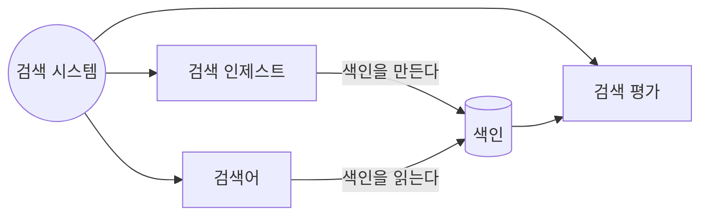
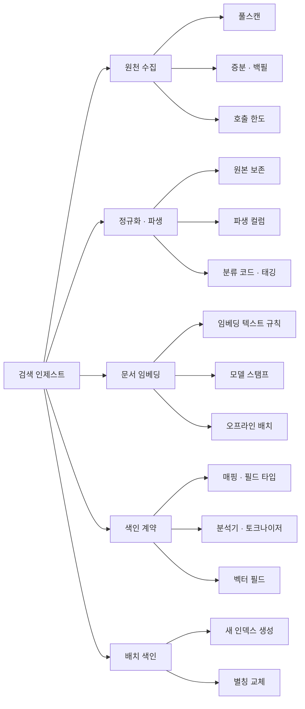
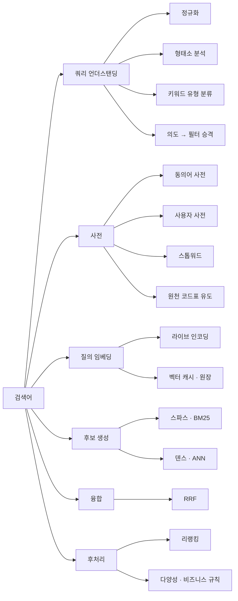
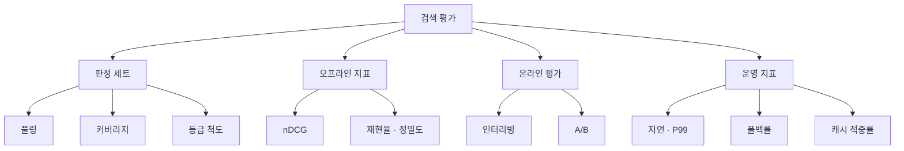

# 검색 아키텍처 계층 그래프 + 통합 검색 보강

관광지 하이브리드가 라이브에 들어갔다(ADR-0090, 2026-09-09). 이 문서는 그 다음 두 가지를 정한다.

1. **통합 검색 보강** — P2(통합 인덱스)로 가기 전에 관광지에서 검증된 것을 어디까지 일반화할지
2. **검색 개념 계층 그래프** — 검색 시스템을 키워드 단위로 계층화해 그리고, 그것을 개념 사전의 탐색 축으로 쓴다

## 0. 결론 요약

| 항목 | 결정 |
|---|---|
| 보강 순서 | 쿼리 언더스탠딩 일반화 → 평가 되살리기 → 통합 인덱스(P2) |
| 왜 이 순서 | 통합 인덱스는 **타입이 늘 뿐** 품질 장치는 그대로다. 장치를 먼저 일반화해야 타입마다 다시 안 만든다 |
| 계층 축 | `진입 → 단계 → 장치 → 구현` 네 층. 진입은 **인제스트 · 검색어 · 평가** 셋 |
| 그래프 저장 | 개념 사전 `concept` 에 **방향 있는 계층 간선**을 더한다 (`relatedConceptIds` 는 무방향이라 층을 못 그린다) |
| 화면 | 기존 그래프 뷰에 **층 탐색 모드**를 얹는다. 새 페이지를 만들지 않는다 |

---

## 1. 계층 그래프 — 검색 시스템을 키워드로

네 층으로 읽는다. **진입(무엇이 들어오나) → 단계(무엇을 하나) → 장치(무엇으로 하나) → 구현(우리는 무엇을 썼나).**



### 1.1 검색 인제스트



| 키워드 | 뜻 | 이 서비스 |
|---|---|---|
| 풀스캔 | 원천 전량을 다시 받는다 | TourAPI 무지정 페이징 |
| 증분 · 백필 | 안 받은 것만 이어 받는다 | 개요·이용정보 하루 1,000건 |
| 호출 한도 | 원천이 정한 상한 | 화면 표기와 실제가 다르다 |
| 원본 보존 | 원천 값을 가공 없이 저장 | `lclsSystm1~3` |
| 파생 컬럼 | 화면용 그루핑은 따로 | `category` 6종 |
| 임베딩 텍스트 규칙 | 무엇을 이어 붙여 인코딩하나 | 제목·분류·주소·개요 1000자 |
| 모델 스탬프 | 벡터 공간 식별자 | `hf_id@rev#d640` |
| 별칭 교체 | 무중단 색인 전환 | `attractions` alias |

### 1.2 검색어



| 키워드 | 뜻 | 이 서비스 |
|---|---|---|
| 키워드 유형 분류 | 검색어를 유형·분류·대상·불용어로 가른다 | `QueryIntent` |
| 의도 → 필터 승격 | 뜻을 검색어에서 빼 필터로 옮긴다 | `contentTypeId` · `lclsSystm` |
| 동의어 사전 | 다른 말을 같은 것으로 | 원천 코드표에서 유도 |
| 원천 코드표 유도 | 사전을 손으로 안 쓴다 | `lclsSystmCode2` 744항 |
| 라이브 인코딩 | 질의를 실시간으로 벡터화 | 사이드카 225ms |
| 벡터 캐시 · 원장 | 같은 질의를 다시 안 만든다 | `query_vector` |
| 스파스 | 글자가 맞는 것 | BM25 + nori |
| 덴스 | 뜻이 가까운 것 | kNN + HNSW |
| RRF | 순위로 합친다 | `rank_constant 60` |
| 리랭킹 | 상위만 다시 채점 | **없음** |

### 1.3 검색 평가



| 키워드 | 뜻 | 이 서비스 |
|---|---|---|
| 풀링 | 여러 시스템의 상위를 모아 판정 | 후보 8종 병합 |
| 커버리지 | 판정된 비율 — 낮으면 비교가 거짓 | 100% |
| 등급 척도 | 0–3 등급 vs 이진 | 둘 다 재서 교차 확인 |
| 인터리빙 | A/B 보다 빠른 온라인 검증 | **트래픽 부족** |
| 폴백률 | 벡터 레그가 꺼진 비율 | `search.attraction.bm25` |

---

## 2. 통합 검색 보강 — 무엇을 먼저 하나

P2(통합 인덱스)로 바로 가지 않는다. **통합 인덱스는 타입이 늘 뿐 품질 장치는 그대로**여서,
장치를 관광지에만 둔 채 타입을 늘리면 타입마다 같은 것을 다시 만들게 된다.

| 순서 | 작업 | 왜 지금 | 규모 | 상태 |
|---|---|---|---|---|
| **S1** | 쿼리 언더스탠딩을 타입 무관하게 | 지금 `QueryIntent` 가 관광지 코드표에 묶여 있다 | 중 | 미착수 — 타입 의도의 소비자(S4)가 아직 없다 |
| **S2** | 판정 세트·평가를 되살린다 | 바뀐 뒤 nDCG 를 한 번도 다시 안 쟀다 | 중 | **완료 2026-09-13** — 아래 실측 |
| **S3** | 자동완성에 사전을 태운다 | `/suggest` 는 벡터도 사전도 안 쓴다 | 소 | 미착수 |
| **S4** | P2 통합 인덱스 | 위 셋이 타입 무관해진 뒤 | 대 | 미착수 |
| **S5** | 리랭킹 재검토 | 트래픽·GPU 조건이 바뀌면 | — | — |

### S1 — 쿼리 언더스탠딩 일반화

지금 구조는 관광지 전용이다. 사전이 `attraction_category_codes` 한 표에서만 오고,
필터 축이 `contentTypeId`·`lclsSystm` 로 하드코딩돼 있다.

| 바꿀 것 | 지금 | 뒤 |
|---|---|---|
| 사전 공급 | place 코드표 1종 | 타입별 어휘 공급자 N종 |
| 필터 축 | 관광지 필드 고정 | `type` + 타입별 facet |
| 의도 갈래 | 유형·분류·불용어 | + **타입 의도**(「블로그 글」·「게임」) |

**타입 의도가 새로 필요하다.** 통합 검색에서 「관광지 야경」은 `type=attraction` 으로,
「블로그 하이브리드」는 `type=blog_post` 로 좁혀야 한다. 이것이 통합 인덱스의 첫 필터다.

### S2 — 평가를 되살린다

관광지 nDCG 는 **모델 선정 시점 값**이다. 그 뒤 질의 이해와 분류 축이 들어갔는데 다시 재지 않았다.

- 판정 세트 2,141건은 그대로 쓴다 — 문서가 안 바뀌었다
- **새 후보를 풀링해야 한다** — 필터가 결과를 바꿨으므로 미판정이 늘었다([[pooling-bias]])
- 지표는 셋: BM25 단독 · 하이브리드 · 하이브리드+쿼리 언더스탠딩

이 값이 없으면 「좋아졌다」가 **눈으로 본 것**뿐이다.

**실측 (2026-09-13, 판정 2,141건 · 쿼리 48, 라이브 인덱스)** — `scripts` 는 세션 스크래치의 `live-eval.py`(A·B 는 색인 직접 질의, C 는 라이브 API).

| 구성 | ko | en |
|---|---|---|
| A. BM25 단독 | 0.4584 | 0.5712 |
| B. 하이브리드 | 0.6094 | 0.6646 |
| C. 하이브리드 + 쿼리 언더스탠딩 | **0.6448** | **0.6883** |

평가가 찾아낸 회귀 넷과 그 처리 — ① 「맛집」·「먹거리」 유형 승격(음식점만 남음) → 승격 안 함 ② 괄호 안 한정어 별칭(「indoor」) → 구분자 있을 때만
③ **상업 하향이 정답을 내림**(「야시장」 0.681 → 0.030, 정답이 전부 `shopping`) → 상점·시장 의도면 하향 끔, 음식 의도는 켠 채(먹거리촌은 `culture`)
④ **산업관광(EX06) 이름 조각이 별칭**(「traditional」→ `EX060300`, 「traditional market food」 0건) → 그 아래는 이름 전체만.
①② 는 09-10, ③④ 는 09-13. ③ 이전 C 는 ko 0.6321 / en 0.6329 였다(그때 B 는 0.5516 / 0.6643 — 개요 백필로 인덱스가 바뀌어 A·B 도 같이 올랐다).

### S3 — 자동완성

`/suggest` 는 접두사 매칭만 한다. 사전을 태우면 두 가지가 된다.

- 「gyeongbok」 → 「경복궁」 (로마자 — 지금 `titleJamo` 는 한글 자모만)
- 「해수욕」 → 분류 제안 (코드표 이름이 곧 후보)

### S4 — 통합 인덱스 (기존 P2) — **S1 을 첫 단계로 묶는다** (2026-09-13 결정)

플랜 `2026-09-05-unified-search-hybrid-embedding.md` §3 P2 의 목표(모든 타입을 한 검색으로)는 그대로 두되, 그 뒤 바뀐 셋을 반영한다 —
질의 인코딩은 사전이 아니라 사이드카가 하고, 호스트가 ADR-0093 으로 재편됐고, 관광지 하이브리드가 이미 라이브다.

**설계에서 P2 와 달라지는 것**

| P2 (09-05) | 지금 | 이유 |
|---|---|---|
| `unified` 한 인덱스에 관광지 6만 건도 벡터째 다시 싣는다 | **관광지는 기존 `attractions` 인덱스를 그대로 쓰고, `unified` 에는 나머지 타입만** 싣는다. 통합 API 가 둘을 부르고 타입별로 묶어 낸다 | 6만 벡터를 두 번 실으면 k-NN 메모리가 두 배(실측 60k×1024 = 1.12GiB) — 무료 티어 한도 밖. 관광지 쪽 장치(쿼리 언더스탠딩·가중치·하이브리드·평가)도 그대로 산다 |
| 비관광지 문서 벡터 `content_embedding` | **보류** — BM25 + 동의어만 | 코퍼스가 상품 24 · 개념 162 · 글 6 · 게임 73 · 혜택 9 · 서비스 8. 정확 일치가 대부분이라 벡터의 이득이 재기 전엔 없다 |
| 타입별 필터 컬럼 | `facets` JSON 한 필드(`{"category":..,"tags":[..]}`) + `type` | 타입마다 컬럼을 늘리지 않는다 — ranking `payload` 와 같은 이유 |
| 쿼리 언더스탠딩이 관광지 필드에 고정 | **`Understood(type, facets, residual, commerceIntent)`** — 타입 의도(「블로그」·「게임」·「관광지」)와 타입별 사전 | S1. 관광지 어댑터가 `facets` 를 일반 term 필터로 소비하므로 지금도 소비자가 있다 |

**단계** — 단계마다 커밋·배포·검증, 상태는 이 표에 적는다.

| 단계 | 내용 | 산출물 | 상태 |
|---|---|---|---|
| U1 (=S1) | `QueryIntent` 를 `domain/query` 로 올리고 관광지 필터를 `facets`(필드→값)로. 타입 의도(`Understood.type`)는 `searchTypes=true` 일 때만 읽는다 — 대상이 정해진 관광지 검색에서 「게임」을 빼면 그 말로 찾던 문서를 놓친다. 타입별 사전 공급자는 두 번째 사전이 생길 때(Rule of Three) | `search:domain` `query/model/QueryIntent` · `SearchQuery.facets` · 어댑터 일반 term 필터 | 완료 2026-09-13 |
| U2 | `unified` 인덱스 + `UnifiedReindexTasklet`(공개 API 6종 풀스캔, 한 타입이라도 실패하면 alias 안 바꿈) + CronJob 04:45 KST + NP `allow-search-batch-to-atlas` | `search/batch` `unified-index.json` · `UnifiedSourceApiClient` · `cronjob-unified-reindex.yaml` | 완료 — 첫 채움 346건(글 7 · 게임 77 · 개념 220 · 서비스 9 · 혜택 9 · 상품 24), 5.8초 |
| U3 | `GET /api/search/unified?q&type&lang&size` — 관광지는 기존 유스케이스, 나머지는 `unified` BM25(+ln1p 인기도). 묶음 순서는 ① 의도 타입 ② 첫 결과 제목이 검색어를 담은 묶음 ③ 고정 순서 — 건수로 하면 관광지가 늘 맨 위 | `search/app` `application/unified/*` · `UnifiedSearchAdapter` · `UnifiedSearchController` | 완료 — `scripts/unified-search-check.py` 13/13 |
| U4 | `/search?q=` (apex 하나가 정규 주소, 서비스 탐색 오버레이의 검색창이 여기로) — 타입별 묶음 · 칩 · 「더 보기」. 링크는 `unifiedHitHref(type, slug)`. noindex + robots Disallow | `portal-fe/src/pages/search/` · `ServiceExplorer.tsx` · `serviceHref.ts` · `copy.mjs` | 완료 — CDP 4조합+모바일 2 |
| U5 | `/tech` 개념 검색·자동완성을 통합 API `type=concept` 로 (옛 `/api/v1/search` 는 운영 500) | `portal-fe/src/api/searchApi.ts` · 용어집 행 `id={conceptId}` | 완료 2026-09-13 |
| U6 | 타입 대표 질의 13개 라이브 검사 — 이해된 타입 · 묶음 존재 · 첫 묶음 | `scripts/unified-search-check.py` | 완료 — 판정 세트(nDCG) 확장은 노출·클릭 로그가 생긴 뒤 |

**보류(측정 뒤 결정)**: 비관광지 문서 벡터, 타입별 사전(게임 장르·개념 분류 이름 → `facets` 필터), 관광지 묶음이 벡터 레그로 늘 무언가를 내는 것(「신라면」→ 호족반 청담) — 통합 화면에서 관광지 레그의 하한 점수.

---

## 3. 개념 사전에 계층 탐색 넣기

### 3.1 지금 모델로는 층을 못 그린다

```kotlin
class Concept(
    val conceptId: String, var name: String,
    var category: ConceptCategory, var level: ConceptLevel,
    var synonyms: List<String>,
    var relatedConceptIds: List<String>,   // ← 무방향 · 무타입
)
```

`relatedConceptIds` 는 **방향도 뜻도 없다.** 「A 는 B 의 하위 단계」와 「A 는 B 와 관련」이
같은 간선이라 층을 만들 수 없다. `level` 은 난이도지 계층이 아니다.

### 3.2 결정 — 방향 있는 계층 간선을 더한다

| 안 | 내용 | 판정 |
|---|---|---|
| A. `parentConceptId` 한 줄 | 트리 | ✗ 한 개념이 두 축에 속한다(임베딩은 인제스트에도 검색어에도) |
| **B. 간선 표를 만든다** | `concept_edge(from, to, kind)` | **채택** — DAG 를 그릴 수 있고 기존 `relatedConceptIds` 를 안 건드린다 |
| C. 그래프 DB | Neo4j 등 | ✗ 파드 +1. 무료 티어 밖 |

```sql
concept_edge(id, from_concept_id, to_concept_id, kind, ordinal)
  kind: CONTAINS   -- 상위 → 하위 (층을 만든다)
        FLOWS_TO   -- 앞 단계 → 뒤 단계 (같은 층 안 흐름)
        SAME_AS    -- 표기 다름 (동의어 그래프)
```

**`CONTAINS` 만으로 층이 나온다.** 진입점(부모 없음)에서 깊이를 세면 그것이 층이다.
`FLOWS_TO` 는 같은 층 안 순서라 층 계산에 안 들어간다.

### 3.3 화면 — 기존 그래프 뷰에 모드를 얹는다

새 페이지를 만들지 않는다. `/tech` 의 그래프가 이미 있다.

| 모드 | 무엇을 보여주나 |
|---|---|
| 관계(현행) | `relatedConceptIds` 무방향 |
| **계층(신규)** | `CONTAINS` 로 층을 접고 펼친다. 층별 색, 흐름은 화살표 |

- 진입점 셋(인제스트·검색어·평가)이 최상단
- 노드를 누르면 그 아래 층만 펼친다 — 전체를 한 번에 안 그린다
- 같은 개념이 두 부모를 가지면 **양쪽에 나오되 같은 노드**로 표시

### 3.4 단계

| 단계 | 내용 | 산출물 | 상태 |
|---|---|---|---|
| G1 | `concept_edge` 표 + 도메인·포트·어댑터 | `V22__concept_edge_search_hierarchy.sql` · `ConceptEdge` · `ConceptHierarchy`(층 계산, 도메인) · `ConceptEdgeRepositoryPort` | 완료 2026-09-13 |
| G2 | 검색 개념 시드 — 이 문서 §1 의 키워드를 `CONTAINS`/`FLOWS_TO` 로 | 같은 V22 — 개념 58 + 기존 3(bulk-indexing·alias-swap·inverse-index) · CONTAINS 62 · FLOWS_TO 10 | 완료 2026-09-13 |
| G3 | `GET /api/v1/concepts/graph/hierarchy?root=` — 응답 모양이 관계 그래프와 달라 `mode=` 대신 별도 경로 | `GraphController.getHierarchy` · `ConceptHierarchyDto` | 완료 2026-09-13 |
| G4 | FE 계층 모드 — 접기·펼치기, 층 색 | `/tech` 「계층」 탭 · `components/hierarchy/` (순수 모델 `hierarchyModel.ts` + 패널) | 완료 2026-09-13 |
| G5 | 다른 주제로 확장 (배포·관측 등) | — | 미착수 |

두 부모를 가진 개념은 `embedding-model`(문서 임베딩·쿼리 임베딩)과 `hnsw`(벡터 필드·ANN) 둘이다.
화면은 양쪽 아래에 행을 내되 id 가 같아 선택·강조가 두 행에 같이 걸린다.

**G2 가 이 작업의 값이다.** 표와 그래프는 그릇이고, 담을 것이 §1 의 키워드 계층이다.

---

## 4. 하지 않는 것

- **그래프 DB 도입** — 개념 수백 개에 파드를 늘리지 않는다
- **자동 관계 추출** — LLM 으로 개념 간선을 만들지 않는다. 틀린 간선은 틀린 지식이 된다
- **리랭킹** — GPU 없이 성립하지 않는다. 트래픽이 생기면 그때
- **검색어 로그 기반 학습** — 노출·클릭 로깅이 없다

## 5. 참고

- `docs/adr/ADR-0090-unified-search-hybrid-embedding.md` — 하이브리드·쿼리 언더스탠딩 결정
- `docs/plans/2026-09-05-unified-search-hybrid-embedding.md` — P2·P3 원안
- `docs/adr/ADR-0081-ranking-leaderboard-platform.md` — `payload` JSON 으로 이질성 흡수한 선례
