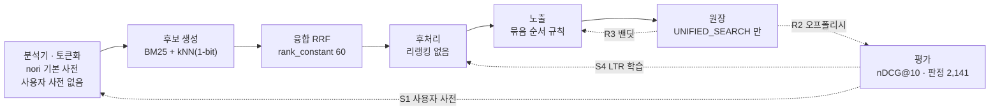

# 검색 학습 로드맵 — 지도학습 · 강화학습을 어느 단계에 어떤 순서로 넣나

- 작성: 2026-09-22
- 선행 결정: ADR-0043(밴딧 — 상품 경로, 원장 발행자 0) · ADR-0050(품질 로드맵) · ADR-0051(트랙 A 컨텍스추얼 밴딧 · B LTR 은 Proposed, C 벡터는 ADR-0090 으로 완료) ·
  ADR-0090(하이브리드 · 쿼리 언더스탠딩 · 1-bit 양자화) · ADR-0095(노출 · 클릭 원장) · 플랜 `2026-09-09-search-architecture-graph.md`(계층 그래프)
- 실측 시점: 2026-09-22 — 원장은 운영 ClickHouse, 분해는 로컬 `opensearch-nori:3.8.0`(운영과 같은 이미지), 판정 세트는 `scripts/search-eval/`
- 짝 문서: 블로그 초안 `docs/drafts/2026-09-nori-user-dictionary-three-layers.md`(형태소 분석기 커스텀의 세 층 — 이 플랜 S1 · S5 의 근거)

**한 줄**: 학습이 붙을 자리는 파이프라인에 넷이다 — **분석기(분해 비용) · 리랭킹(랭킹 함수) · 노출 순서(밴딧) · 평가(오프폴리시)**.
지금 연료는 **판정 세트 하나**(2,141건 · 48 쿼리)뿐이고 **원장은 30일에 검색 2건**이라, 트래픽이 필요한 것(강화학습)은
장치만 깔고 트래픽 게이트 뒤로 보낸다. 트래픽 없이 되는 것(사용자 사전 · 판정 세트 확장 · LTR)을 먼저 하고, 매 단계의 판정은
같은 세트의 nDCG@10 로 한다.

---

## 0. 결론 요약

| 항목 | 결정 | 근거 |
|---|---|---|
| 지도학습 1순위 | **분석기 L1 사용자 사전** — 색인 제목이 세 조각 이상으로 갈리는 시설명 · 업계 용어를 **긴 표층형으로만** 등록, `decompound_mode: mixed` 로 | §2 S1 · S2. 플러그인 빌드 0, 재색인 한 번. 「짧은 조각」은 남을 쪼갠다(블로그 실측) |
| 지도학습 2순위 | **판정 세트 확장** 48 → 150 쿼리, 풀링 재수행 | §2 S3. LTR 의 학습 세트이자 모든 판정의 잣대. 48 쿼리로는 리랭커를 못 가른다 |
| 지도학습 3순위 | **LTR 리랭커(LambdaMART)** — 학습은 서버 밖, 서빙은 `search:app` 안 트리 평가기, 피처는 **서빙에 있는 것만** | §2 S4. 파드 +0 · OpenSearch 메모리 +0. `opensearch-ltr` 플러그인은 스파이크 뒤 결정 |
| 분석기 L2 · L3 | **보류** — 게이트: 사용자 사전으로 못 고치는 오분석이 판정 세트 정답을 내리는 사례 ≥ 10 + 라벨 코퍼스 | §2 S5. 플러그인 빌드 파이프라인 소유 비용이 이득보다 크다 |
| 강화학습 | **장치 먼저, 학습은 트래픽 게이트 뒤** — 관광지 검색 계측(R0) → 탐색 · 성향 로깅(R1) → 오프폴리시 평가(R2) → 묶음 순서 밴딧(R3) → 인터리빙(R4) | §3. 지금 원장은 30일 검색 2건 · 관광지 검색 화면은 계측 0 |
| 판정 | 모든 단계를 `scripts/search-eval/run-eval.sh` 의 **같은 판정 세트 · 같은 3구성 + 새 구성 D** 로. 온라인 지표는 게이트 통과 뒤 | §4 |
| 계층 그래프 | 이 로드맵의 장치를 `/tech` 「검색 시스템」 계층에 **가지로 붙인다** — 새 개념 17 · CONTAINS 21 · FLOWS_TO 5 (V23) | §7 |
| 무료 티어 | 파드 +0 · OpenSearch 메모리 +0 · CronJob +0(학습은 로컬 PC) | §5 |

---

## 1. 지금 어떤 상태인가 (2026-09-22 실측)

### 1.1 학습이 붙을 수 있는 자리



| 자리 | 배우는 것 | 라벨 | 지금 |
|---|---|---|---|
| 분석기 | 분해 비용표(L3) — 또는 사전 항목(L1 · L2) | (문장, 정답 분해) | 기본 사전 그대로. `decompound_mode` 미지정(= `discard`) · 동의어 10줄 |
| 리랭킹 | 랭킹 함수 | (쿼리, 문서, 등급) | 없음. RRF 융합 점수가 최종 |
| 노출 순서 | 어느 묶음 · 어느 위치가 눌리나 | (노출, 클릭) | 규칙 셋(의도 타입 → 제목 포함 → 고정) |
| 평가 | 정책 A 대신 B 를 냈으면 어땠나 | (노출, 클릭, 성향) | 없음. 오프라인 nDCG 만 |

### 1.2 데이터 — 연료가 얼마나 있나

| 데이터 | 양 | 쓸 수 있는 곳 |
|---|---|---|
| 판정 세트 `judgments-attractions-2026-09-13.json` | 쿼리 48(ko 24 · en 24) × 등급 0–3, 2,141건. 풀링은 3구성 top-10 합집합 | S1 회귀 검사 · S4 학습(부족) · 모든 단계의 판정 |
| 원장 `analytics.events` 30일 | **검색 2 · 노출 10 · 클릭 1 · 방문자 2** (`UNIFIED_SEARCH` 뿐) | 아무것도 못 배운다. 표본이 작다는 사실이 결론이다 |
| 관광지 검색 화면(place.1989v.com) 원장 | **행 0** — 화면에 계측이 없다 | R0 이 먼저다. 트래픽이 와도 지금은 안 쌓인다 |
| 미스 질의 | 0행 | 사전 후보를 여기서 못 캔다 → 색인 제목에서 캔다(S1) |
| 색인 `attractions` | 59,735건(ko · en), 제목 · 분류 · 주소 · 개요 · 벡터 | S1 후보 채굴의 원천 |

### 1.3 엔진 · 코드 자산

| 자산 | 상태 | 이 플랜에서 |
|---|---|---|
| `opensearch-ltr 3.8.0.0` | 운영 이미지에 **번들**(로컬 같은 이미지 `_cat/plugins` 확인). 피처셋 · 모델 저장소 · `sltr` 재채점 | S4 서빙 후보 B. `hybrid` 질의 위 `rescore` 호환은 스파이크 |
| `opensearch-ubi` · `opensearch-search-relevance` | 번들 | 쓰지 않는다 — 원장은 ADR-0095 로 통일, 판정은 레포 JSON |
| nori `user_dictionary_rules` | 인덱스 설정 인라인 — 파일 마운트 없이 된다 | S1. 인덱스 JSON 이 SSOT 라 계약 검사 안에 든다 |
| 관광지 벡터 1-bit 양자화 + `rescore ×3` | 09-23 재색인부터 | 재측정 값이 S 단계들의 기준선 |
| `ThompsonReranker` · `MultiScopeBanditBlender` · `BanditProperties` | 상품 검색 경로에 있고 **원장 발행자 0** 이라 한 번도 학습한 적 없다 | R3 가 재사용. 대상만 「묶음 순서」로 |
| `search-eval-daily` CronJob | suspend(상품 기준선 잡, 판정 0행) | 되살리지 않는다 — 판정은 `scripts/search-eval` |
| 재색인 별칭 게이트 | **없음** — 벌크 오류 수천 건에도 별칭이 넘어간다 | S1 이 재색인을 유발하므로 **S0 으로 먼저** |

---

## 2. 지도학습 갈래 (S)

### S0 — 재색인 별칭 게이트 (선행)

S1 · S2 는 재색인을 유발한다. 09-22 04:32 KST 에 벌크 15,800건이 죽은 채 별칭이 넘어가 45,535건 색인이 라이브였다.
`updateAliasAndCleanup` 앞에 **건수 하한(직전 색인의 95%) · 벌크 오류 비율 상한(0.5%)** 을 건다. 못 넘으면 별칭을 두고 새 색인만 남긴다.

### S1 — 분석기 L1 사용자 사전 (관광지)

블로그 실측의 규칙 하나가 설계 전부다 — **긴 표층형만 등록한다.** `킹` 같은 조각은 `바이킹` · `랭킹` 을 쪼갠다.

| 단계 | 내용 |
|---|---|
| 후보 채굴 | 색인 제목 59,735건을 `_analyze` 로 분해 → **3조각 이상 + 조각 중 NNP 인명 · 수사(NR) 가 섞인 제목**을 후보로(「아쿠아플라넷」 → 아쿠아 · 플라 · 넷[NR]). 판정 세트 쿼리 48 도 같은 검사 |
| 선별 | 후보 중 **한 토큰이어야 뜻이 서는 것**만(시설명 · 브랜드 · 업계 용어). 지명 + 일반명사(「헤이리 예술 마을」)는 조각으로도 맞으므로 넣지 않는다 |
| 형식 | `user_dictionary_rules` 인라인, 복합어는 `도쿄디즈니랜드 도쿄 디즈니랜드` 꼴. 파일 마운트를 만들지 않는다 |
| 위치 | `search/batch/src/main/resources/opensearch/attractions-index.json` — 계약 SSOT. 규칙 목록은 같은 파일 |
| 규모 | 첫 판 ≤ 200항. 항목마다 「기본 분해 → 사전 분해」 한 줄을 PR 에 남긴다 |
| 판정 | 재색인 뒤 `run-eval.sh` — **C 가 내려가면 되돌린다.** 오르지 않아도 후보 제목이 한 토큰으로 검색되는지 20건 스팟체크로 남긴다 |

### S2 — `decompound_mode: mixed`

지금 관광지 · 상품 · 지역 인덱스 셋 다 `decompound_mode` 를 안 줘서 기본 `discard` 다 — 복합어 통째 토큰이 색인에서 빠진다
(`롯데월드타워` → 롯데 · 월드 · 타워만 남고 `롯데월드` 가 없다). `mixed` 로 바꾸면 통째 + 조각이 함께 실린다.

- 전 문서 토큰이 바뀌므로 **재색인 + 재측정** — S1 과 같은 재색인에 태운다
- 질의 쪽 `nori_search` 도 같이 바꾼다 — 색인과 질의의 분해가 다르면 통째 토큰이 매칭되지 않는다
- 색인 크기 증가를 적는다(토큰 수 ↑). 1-bit 양자화로 번 메모리 안에서 흡수되는지 `_cat/indices` 로 확인

### S3 — 판정 세트 확장 (LTR 의 전제)

| 항목 | 지금 | 목표 | 방법 |
|---|---|---|---|
| 쿼리 수 | 48 | **150** (ko 90 · en 60) | 분류 코드표 이름 · 지역명 × 유형 · 의도 문장(「아이와 갈만한」) 세 갈래에서 고른다. 원장에 질의가 쌓이면 그것을 우선 |
| 풀링 | 3구성 top-10 | **4구성 top-20**(A · B · C · S1 적용) | 새 구성이 올린 문서는 등급이 없어 0 으로 계산된다 — 풀링을 다시 해야 비교가 공정하다 |
| 등급 | 사람 | 사람 — **LLM 보조 판정은 사람 검수 30% 이상일 때만** | ADR-0051 게이트 2 와 같다. 판정 세트가 곧 잣대라 자기 것을 재는 세트를 만들지 않는다 |
| 형식 | JSON 한 파일 | 같은 파일에 `version` · `pooledBy` 를 더한다 | 어느 구성으로 풀링했는지 없으면 다음 사람이 편향을 모른다 |

### S4 — LTR 리랭커 (LambdaMART)

**학습은 서버 밖**(로컬 PC, LightGBM `lambdarank`), **서빙은 `search:app` 안**에서 상위 N 을 트리 평가기로 다시 채점한다. ADR-0090 이 임베딩을 서버 밖에 둔 것과 같은 이유다 — 무료 티어에 학습 파드를 두지 않는다.

| 항목 | 결정 |
|---|---|
| 알고리즘 | LambdaMART(LightGBM). 판정 세트가 등급형(0–3)이라 리스트와이즈 손실이 맞다 |
| 학습 세트 | S3 의 판정 세트 + 피처 로깅 스크립트(`scripts/search-eval/features.py`, 새로) |
| 검증 | **쿼리 단위 5-fold CV** — 쿼리 150 이면 fold 당 30. 홀드아웃 nDCG@10 의 평균 · 표준편차를 적는다 |
| 피처 규칙 | **학습 피처 = 서빙 피처.** 서빙 경로에서 추가 질의 없이 못 얻는 값은 학습에서도 뺀다 |
| 서빙 후보 A | 앱 안 트리 평가기 — LightGBM `dump_model()` JSON 을 리소스로, Kotlin 트리 순회 100줄 이내. 상위 50 재채점 ≤ 5ms |
| 서빙 후보 B | `opensearch-ltr` `sltr` 재채점 — 피처를 엔진이 계산(BM25 필드별 · 벡터 거리). **`hybrid` 질의 위 `rescore` 가 되는지 로컬 3.8.0 스파이크** 뒤 결정 |
| 기본값 | A. B 는 스파이크가 「hybrid 위 sltr 가 되고 P99 +50ms 안」일 때만 |
| 플래그 | `search.attraction-ltr.enabled` 기본 false. 켜는 조건은 §4 |

**피처 목록 (후보 A 기준 — 앱이 이미 가진 값만)**

| 피처 | 출처 | 비고 |
|---|---|---|
| RRF 융합 점수 · 융합 순위 | 하이브리드 응답 | 1차 신호 |
| 제목 정확 일치 · 접두 일치 · 검색어 토큰 포함 비율 | 앱 문자열 연산 | 잔여 검색어 기준 |
| 쿼리 언더스탠딩 일치(유형 · 분류 facets 가 문서와 맞나) | `Understood` · 문서 필드 | 필터로 못 건 「대상 의도」를 여기서 |
| 개요 유무 · 개요 길이 · 이미지 유무 | 문서 필드 | 빈 문서 하향 |
| 상업 유형 여부 × `commerceIntent` | 문서 · 쿼리 | 지금 랭킹 스위치를 피처로 흡수 |
| 언어 일치(질의 언어 = 문서 언어) | 앱 | ko/en 혼재 |
| 거리(좌표 있을 때) | 문서 · 요청 | 거리순 정렬 아닐 때만 |

**뺀 것** — 클릭 · 조회수(원장이 비어 있다), BM25 필드별 점수 · 벡터 코사인(후보 A 서빙에서 추가 질의 없이는 없다 → 후보 B 채택 시 추가).

### S5 — 분석기 L2 · L3 (보류)

| 층 | 착수 게이트 | 대가 |
|---|---|---|
| L2 시스템 사전 항목(품사 교정 · 삭제) | 사용자 사전으로 못 고치는 오분석(`킹크랩 → 킹크 랩` 류)이 **판정 세트 정답을 내리는 사례 ≥ 10** | mecab-ko-dic → Lucene → 플러그인 빌드 파이프라인을 소유. `opensearch-nori:3.8.0` 이미지 빌드에 얹는다 |
| L3 비용 재학습 | 정답 분해가 붙은 **관광지 코퍼스 ≥ 5,000 문장** | L2 + 라벨링. 코퍼스가 없으면 방향일 뿐 착수가 아니다 |

---

## 3. 강화학습 갈래 (R)

**전부 트래픽이 연료다.** 지금은 30일 검색 2건이라 어느 것도 학습이 돌지 않는다. 그래서 순서를 「장치 → 게이트 → 학습」으로 두고, 장치는 트래픽이 없어도 지금 만든다 — 트래픽이 온 뒤 만들면 그 사이 로그가 성향(propensity) 없이 쌓여 오프폴리시 평가에 못 쓴다.

| 단계 | 무엇 | 트래픽 게이트 | 산출물 |
|---|---|---|---|
| **R0** 관광지 검색 계측 | place.1989v.com 검색 결과에 SEARCH · IMPRESSION · CLICK 을 ADR-0095 원장으로. `screen_type=PLACE_SEARCH`, `section_id=RESULTS`, `item_index` | 없음 — 지금 | `portal-fe/src/pages/place/*` · 리포트에 화면 추가 |
| **R1** 탐색 · 성향 로깅 | 노출 순서를 정한 정책 id 와 **선택 확률**을 원장 `payload` 에 남긴다(규칙 정책은 확률 1.0). ε=0.1 로 묶음 순서를 가끔 섞고 그 확률을 적는다 | 없음 — 지금 | `payload.policy` · `payload.propensity` |
| **R2** 오프폴리시 평가 | 로그로 「정책 B 를 냈으면 CTR 이 얼마였나」를 IPS · SNIPS 로 추정. 새 랭커 · 새 묶음 순서를 배포 전에 잰다 | 성향 있는 노출 ≥ 2,000 | `scripts/search-eval/ope.py` |
| **R3** 묶음 순서 밴딧 | 통합 검색 묶음 순서(관광지 · 글 · 게임 · 개념 …)를 Thompson Sampling 으로. 팔 = 첫 묶음 타입, 보상 = 첫 묶음 클릭. 문맥은 「이해된 타입 있음/없음」 둘 | 검색 ≥ 100/일 × 14일 | `ThompsonReranker` 재사용, 키 `(understoodType, groupType)` |
| **R4** 인터리빙 | 두 랭커(C vs C+LTR)의 결과를 팀드래프트로 섞어 클릭으로 가른다. A/B 의 1/10 트래픽으로 판정 | 검색 ≥ 300/주 | `search:app` 인터리버 + 원장 `payload.team` |
| **R5** 컨텍스추얼 밴딧 | ADR-0051 트랙 A. 시간대 · 기기 · 이전 클릭 | R3 가 14일 이상 돌고 팔당 노출 ≥ 500 | 별도 ADR |

> [!IMPORTANT] 강화학습이 아니라 「온라인 학습 장치」다
> 밴딧 · 인터리빙 · 오프폴리시 평가는 보상이 즉시 오는 1단계 문제라 정책 경사 · 가치 함수 같은 강화학습 본체는 쓰지 않는다. 검색에서 그 본체가 필요한 곳(세션 단위 다단계 보상)은 이 서비스의 트래픽 규모 밖이다.

---

## 4. 순서와 게이트

| 순서 | 단계 | 착수 조건 | 완료 판정 | 계층 노드(§7) |
|---|---|---|---|---|
| P0 | S0 별칭 게이트 · R0 관광지 계측 · R1 성향 로깅 · **LTR 스파이크**(hybrid 위 `sltr`) | 없음 | 게이트에 회귀 주입 → 별칭 안 넘어감 확인 · 원장에 PLACE_SEARCH 행 · 스파이크 결과 한 줄 | `alias-swap` · `impression-click-ledger` · `propensity-logging` |
| P1 | S1 사용자 사전 + S2 mixed (같은 재색인) | 09-23 1-bit 재측정 값이 기준선으로 있을 것 | `run-eval.sh` C(ko · en) 가 기준선 이상 · 후보 제목 20건 스팟체크 | `user-dictionary` · `decompound-mode` |
| P2 | S3 판정 세트 150 쿼리 | P1 배포 | `judgments-attractions-<날짜>.json` v2 · 커버리지 100% · 4구성 재측정 | `judgment-set` · `pooling` |
| P3 | S4 LTR 학습 · 서빙(플래그 off) | P2 | CV 평균 nDCG@10 ≥ C + 0.02(ko · en 모두) · 재채점 P99 +≤ 5ms(A) | `learning-to-rank` · `ranking-features` |
| P4 | S4 켜기 | P3 + R2 로 오프폴리시 CTR 이 C 이상(성향 노출 ≥ 2,000 일 때) — 없으면 오프라인만으로 켜고 R4 가 뒤에 검증 | 라이브 C+LTR 를 D 구성으로 `run-eval.sh` 에 추가 | `reranking` |
| P5 | R3 밴딧 · R4 인터리빙 | 트래픽 게이트(§3) | 밴딧: 첫 묶음 CTR 이 규칙 대비 내려가지 않음 · 인터리빙: 승률 신뢰구간 | `bandit-exploration` · `interleaving` |
| — | S5 L2 · L3 · R5 | §2 S5 · §3 R5 게이트 | 별도 ADR | `system-dictionary-entry` · `tokenizer-cost-retraining` · `contextual-bandit` |

ADR 은 P3 착수 때 쓴다 — `ADR-00XX-search-ltr-lambdamart.md`(ADR-0051 트랙 B 를 Accepted 로). P0 · P1 · P2 는 ADR-0090 · ADR-0095 안의 운영 변경이다.

---

## 5. 무료 티어 비용

| 항목 | 지금 | 뒤 | 비고 |
|---|---|---|---|
| 파드 | +0 | +0 | 학습은 로컬 PC. 모델은 JSON 리소스(≤ 200 KB) |
| OpenSearch 메모리 | 2560Mi | +0(후보 A) · 피처 로깅분(후보 B, 스파이크로 측정) | S2 mixed 로 색인이 커지면 `_cat/indices` 로 적는다 |
| `search:app` CPU | — | 상위 50 트리 평가 ≤ 5ms | 트리 300 × 깊이 6 기준 |
| CronJob | +0 | +0 | 재색인은 기존 `attraction-reindex` |
| ClickHouse | 70MiB | 원장 행 증가 — 90일 보존(ADR-0077) | `payload` 에 성향 · 정책 id 추가 |

---

## 6. 함정 (이미 겪은 것 · 겪을 것)

- **판정 세트는 그것을 만든 시스템에만 공정하다** — LTR 이 올린 새 문서는 등급이 없어 0 으로 계산된다. P3 뒤 반드시 풀링 재수행([[judgment-pool-only-fair-to-its-builders]])
- **클릭은 위치 편향이 있다** — 1위는 맞아서가 아니라 1위라서 눌린다. 클릭을 라벨로 쓰려면 성향으로 나눈다(R1 이 그래서 먼저다)
- **A/B 는 이 트래픽에서 영원히 유의하지 않다** — 인터리빙(R4)이 유일한 온라인 판정이고, 그것도 주 300 검색이 게이트다
- **`decompound_mode` 는 색인 · 질의 양쪽을 같이 바꾼다** — 한쪽만 바꾸면 통째 토큰이 매칭되지 않는다
- **사용자 사전에 짧은 조각을 넣지 않는다** — `킹` 하나가 `바이킹` · `랭킹` 을 쪼갰다(블로그 실측). PR 에 항목마다 전/후 분해를 남긴다
- **재색인 별칭 게이트 없이 S1 · S2 를 하지 않는다** — 09-22 에 반 토막 색인이 라이브였다
- **학습 피처 = 서빙 피처** — 오프라인에서 BM25 필드별 점수로 배운 모델은 서빙에 그 값이 없으면 무동작이다. 피처 로깅 스크립트가 앱과 같은 함수를 부른다
- **계측은 「보냈다」로 끝내지 않는다** — 브라우저가 보낸 7건이 원장 0행이었던 적이 있다. R0 판정은 ClickHouse 행 수([[measurement-needs-human-ua]])
- **모델 파일은 스탬프를 갖는다** — `ltr.model-ref = <판정세트 버전>@<학습일>`. 판정 세트가 바뀌면 모델도 다시 학습한다는 뜻이고, 응답 디버그에 스탬프를 낸다

---

## 7. 검색 아키텍처 계층에 붙이는 가지 (V23)

플랜 `2026-09-09-search-architecture-graph.md` §1 의 계층(진입 → 단계 → 장치 → 구현)에 이 로드맵의 장치를 **가지로 더한다.**
새 진입점을 만들지 않는다 — 분석기 커스텀은 「검색 인제스트 › 색인 계약 › 분석기」와 「검색어 › 쿼리 언더스탠딩 › 형태소 분석」 **두 부모** 아래(DAG),
학습 랭킹은 「후처리 › 리랭킹」 아래, 온라인 학습은 「검색 평가 › 온라인 평가」 아래, 벡터 양자화는 「벡터 필드」 아래다.

이전에 정리한 것도 같이 들어간다 — **1-bit 양자화(BBQ 계열) · 재채점 오버샘플**(ADR-0090 09-22 개정), **검색 노드 메모리 = 힙 + 네이티브 + 페이지 캐시**(사이징 글 둘), **노출 · 클릭 원장**(ADR-0095).

| 새 개념 id | 이름 | 부모(CONTAINS) | 이 서비스 |
|---|---|---|---|
| `analyzer-customization-layers` | 형태소 분석기 커스텀 층 | `analyzer-tokenizer` · `morphological-analysis` | 블로그 「세 층」 |
| `lattice-viterbi` | 격자 · 비터비 · 비용 | `analyzer-customization-layers` | mecab-ko-dic `matrix.def` 3822 × 2693 |
| `user-dictionary` (기존) | 사용자 사전 | + `analyzer-customization-layers` | S1 — 긴 표층형만 |
| `decompound-mode` | 복합어 분해 모드 | `analyzer-customization-layers` | S2 — `discard` → `mixed` |
| `system-dictionary-entry` | 시스템 사전 항목 (L2) | `analyzer-customization-layers` | 보류 — 플러그인 빌드 |
| `tokenizer-cost-retraining` | 분해 비용 재학습 (L3) | `analyzer-customization-layers` | 보류 — 라벨 코퍼스 |
| `learning-to-rank` | Learning to Rank | `reranking` | S4 — LambdaMART, 서빙은 앱 안 |
| `ranking-features` | 랭킹 피처 | `learning-to-rank` | 학습 피처 = 서빙 피처 |
| `click-weak-labels` | 클릭 약지도 라벨 | `judgment-set` | 원장이 차면 |
| `position-bias` | 위치 편향 | `click-weak-labels` | 성향으로 나눈다 |
| `impression-click-ledger` | 노출 · 클릭 원장 | `online-evaluation` · `search-ops-metrics` | ADR-0095 — R0 |
| `propensity-logging` | 탐색 · 성향 로깅 | `online-evaluation` | R1 — ε=0.1 |
| `off-policy-evaluation` | 오프폴리시 평가 | `online-evaluation` | R2 — IPS · SNIPS |
| `bandit-exploration` | 밴딧 · 탐색 | `online-evaluation` | R3 — Thompson, 묶음 순서 |
| `contextual-bandit` | 컨텍스추얼 밴딧 | `bandit-exploration` | R5 — 보류 |
| `vector-quantization` | 벡터 양자화 (1-bit · BBQ) | `vector-field` · `hnsw` | 09-23 부터 — 상주 32× 감소 |
| `rescore-oversample` | 재채점 · 오버샘플 | `vector-quantization` | `oversample ×3` |
| `search-node-memory` | 검색 노드 메모리 | `search-ops-metrics` | 힙 + 네이티브 ~1 GB + 색인 한 벌 |

FLOWS_TO — `user-dictionary → system-dictionary-entry → tokenizer-cost-retraining`(층의 깊이), `propensity-logging → off-policy-evaluation → bandit-exploration`(장치 순서).
마이그레이션은 `V23__concept_edge_search_learning.sql`(개념 17 + 동의어 17 + CONTAINS 21 + FLOWS_TO 5) — MySQL 8 에 V1~V23 을 순서대로 적용해 확인(CONTAINS 83 · FLOWS_TO 15 · 끊긴 간선 0). 기존 `reranking` 설명의 「GPU 없이는 성립하지 않는다」는
크로스인코더 얘기라 그대로 두고, LTR 은 그 아래 「GPU 없이 되는 리랭킹」으로 둔다.

**용어는 따로 사전 가지에 둔다(V24)** — CRF · 비터비 · 격자 · 단어/연접 비용 · 문맥 ID · 품사 태그 · mecab-ko-dic · 세종 말뭉치 · 코사인 · MRL · HNSW 파라미터 · 랭킹 손실 세 갈래 · 쿼리 단위 CV · 탐색/활용 · 베타-베르누이 켤레 · IPS/SNIPS · 팀 드래프트.
장치 아래에도 같이 걸리므로 위 표의 장치를 펼치면 그 말이 나온다. 규칙은 플랜 09-09 §3.5.

**「모델 가중치 양자화」와 「벡터 저장 양자화」는 다른 축이다** — 볼트 `quantization`(2026-07-16)이 앞엣것이고, 여기 `vector-quantization` 은 뒤엣것이다. 이름을 붙일 때 섞지 않는다.

---

## 8. 하지 않는 것

- **크로스인코더 리랭킹** — GPU 없이 성립하지 않는다(09-09 플랜 §4 그대로). LTR 은 트리라 CPU 로 된다
- **`opensearch-ubi` · `search-relevance` 플러그인 워크벤치** — 원장 · 판정이 이미 있다. 두 벌을 만들지 않는다
- **학습 파드 · GPU · 외부 ML API** — 무료 티어 밖. 학습은 로컬
- **LLM 단독 판정 세트** — 사람 검수 30% 미만이면 자기 것을 재는 세트다
- **강화학습 본체(정책 경사 · 세션 보상)** — 트래픽 규모 밖
- **상품 검색 밴딧 되살리기** — 상품 24건에 팔이 없다. R3 의 대상은 통합 검색 묶음 순서

---

## 9. 검증 4줄

```bash
scp -r scripts/search-eval msa-oci:/tmp/ && ssh msa-oci bash /tmp/search-eval/run-eval.sh   # 기준선 · 매 단계 뒤 같은 세트
python3 scripts/unified-search-report.py --days 14                                          # 원장 — 검색 · 노출 · 클릭 · 화면
docker run --rm -d -p 19200:9200 -e discovery.type=single-node -e DISABLE_SECURITY_PLUGIN=true opensearch-nori:3.8.0  # 분해 · sltr 스파이크
python3 scripts/search-eval/features.py --judgments <v2.json> --out features.tsv           # (P3) 학습 피처 = 서빙 피처
```

## 10. 참고

- `docs/drafts/2026-09-nori-user-dictionary-three-layers.md` — 분석기 세 층의 실측(사용자 사전 상수 · 전/후 분해)
- `docs/plans/2026-09-09-search-architecture-graph.md` — 계층 그래프 · S1~S5 · U1~U7
- `docs/adr/ADR-0051-search-contextual-bandit-ltr-vector.md` — 트랙 A · B 의 원안과 게이트
- `docs/adr/ADR-0090-unified-search-hybrid-embedding.md` — D4 하이브리드 · D8 쿼리 언더스탠딩 · 1-bit 양자화
- `docs/adr/ADR-0095-impression-click-pipeline.md` — 원장 두 축 · 계층 위치
- `scripts/search-eval/README.md` — 판정 세트 · 3구성 · 함정
- 볼트: `search-system-keyword-layers`(2026-09-13) · `quantization`(2026-07-16) · `msa-opensearch-memory-and-quantization-record`(2026-09-22)
