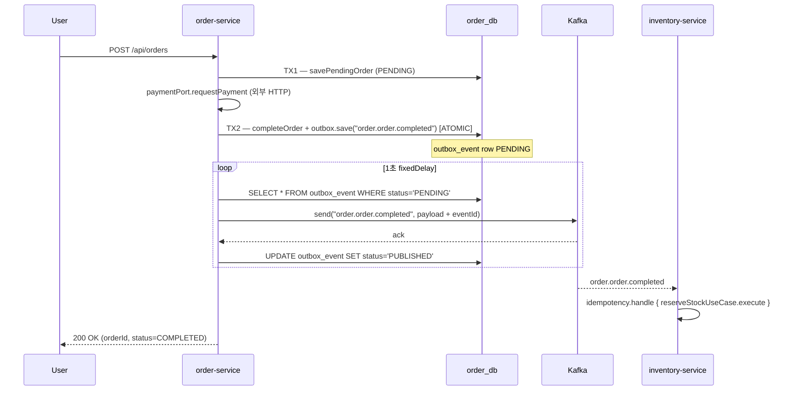
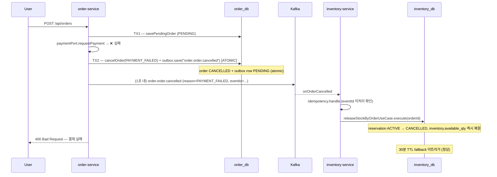
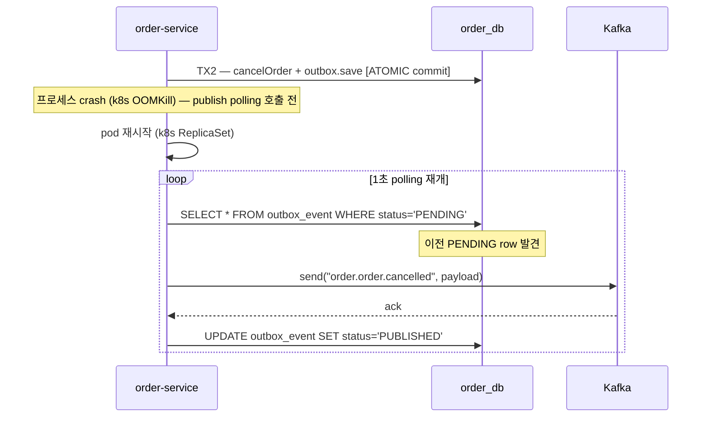

# ADR-0032 Implementation Plan — Order Outbox + Cancellation Compensation

**Status**: Draft (Plan)
**Date**: 2026-05-01
**Owner**: TBD (Order Squad + Inventory Squad 합동)
**ADR**: [`docs/adr/ADR-0032-order-outbox-cancellation.md`](../adr/ADR-0032-order-outbox-cancellation.md)
**Related**: ADR-0011, ADR-0012, ADR-0014, ADR-0015, ADR-0019, ADR-0020, ADR-0028, ADR-0029

> **본 문서의 위치**: 본 문서는 ADR-0032 "Decision" 절을 단계별 코드 변경 / Acceptance / PR 단위로 풀어 쓴 **구현 plan** 이다. ADR 자체는 변경하지 않으며 (`docs/adr/` 의 immutable 원칙), 본 plan 은 sprint 진행에 따라 갱신된다.

---

## 1. Goal

ADR-0032 의 두 part 를 단계별로 구현한다:

1. **Part 1 — Order Outbox 도입**: `order/app/src/main/kotlin/com/kgd/order/infrastructure/messaging/OrderEventAdapter.kt:14-54` 의 직접 `kafkaTemplate.send` 발행을 outbox 패턴으로 교체. TX commit 과 이벤트 발행의 원자성 회복.
2. **Part 2 — `order.order.cancelled` Consumer 추가**: `inventory/app/src/main/kotlin/com/kgd/inventory/infrastructure/messaging/InventoryEventConsumer.kt` 에 4번째 listener 추가. 결제 실패 / 사용자 취소 시 inventory release 가 30분 TTL 이 아닌 ~1-2초 내 동작.

**핵심 invariant** (구현 완료 후):

- Order 의 모든 도메인 commit 직후 발행되는 Kafka 메시지는 **Outbox 경유** (직접 `send` 코드 0개).
- 결제 실패 → inventory release 평균 latency **<= 2s** (polling interval 1s + 처리 시간).
- `inventory_reservation_expired_total` (Phase 3 신설 metric) 의 운영 시 발화 0건. 발화 = cancellation 흐름 장애 의심.

**비목표** (본 plan 범위 외):

- ❌ Saga Orchestrator 도입 (ADR-0011 의 Choreography 결정 유지 — Alternative D 거부).
- ❌ Refund 보상 흐름 (별도 ADR — `USER_CANCELLED` reason 시 PaymentPort.refund).
- ❌ CDC (Debezium) Order schema 추가 — 운영 작업, ADR 불필요.
- ❌ `processed_event` cleanup 스케줄러 — 별도 ADR.
- ❌ Schema Registry (Avro/Protobuf) — `OrderCancelledEvent.reason` 진화는 nullable + default 로 잠정 처리.

---

## 2. 현재 baseline (실 코드 인용)

### 2.1 Order 측: 직접 `kafkaTemplate.send` (Outbox 부재)

`order/app/src/main/kotlin/com/kgd/order/infrastructure/messaging/OrderEventAdapter.kt:14-54`:

```kotlin
@Component
class OrderEventAdapter(
    private val kafkaTemplate: KafkaTemplate<String, Any>,
    @Value("\${kafka.topics.order-completed}") private val completedTopic: String,
    @Value("\${kafka.topics.order-cancelled}") private val cancelledTopic: String
) : OrderEventPort {

    private val log = LoggerFactory.getLogger(javaClass)

    override fun publishOrderCompleted(order: Order) {
        val event = OrderCompletedEvent(
            orderId = requireNotNull(order.id),
            userId = order.userId,
            totalAmount = order.totalAmount.amount,
            status = order.status.name,
            items = order.items.map { item ->
                OrderItemEvent(
                    productId = item.productId,
                    quantity = item.quantity,
                    unitPrice = item.unitPrice.amount
                )
            }
        )
        kafkaTemplate.send(completedTopic, order.id.toString(), event)
            .whenComplete { _, ex ->
                if (ex != null) log.error("Failed to publish OrderCompletedEvent: orderId={}", order.id, ex)
                else log.info("Published OrderCompletedEvent: orderId={}", order.id)
            }
    }

    override fun publishOrderCancelled(order: Order) {
        val event = OrderCancelledEvent(
            orderId = requireNotNull(order.id),
            userId = order.userId
        )
        kafkaTemplate.send(cancelledTopic, order.id.toString(), event)
            .whenComplete { _, ex ->
                if (ex != null) log.error("Failed to publish OrderCancelledEvent: orderId={}", order.id, ex)
                else log.info("Published OrderCancelledEvent: orderId={}", order.id)
            }
    }
}
```

`order/app/src/main/kotlin/com/kgd/order/application/order/service/OrderService.kt:54-78` 호출 흐름:

```kotlin
val paymentResult = try {
    paymentPort.requestPayment(orderId, pendingOrder.totalAmount.amount)
} catch (e: Exception) {
    log.error("Payment failed for orderId={}, cancelling order", orderId, e)
    val cancelled = orderTransactionalService.cancelOrder(orderId)   // TX commit
    eventPort.publishOrderCancelled(cancelled)                        // ❌ TX 밖, Outbox 없음
    throw BusinessException(ErrorCode.EXTERNAL_API_ERROR, "결제 서비스 호출 실패: ${e.message}")
}

return if (paymentResult.status == "SUCCESS") {
    val completed = orderTransactionalService.completeOrder(orderId)  // TX commit
    eventPort.publishOrderCompleted(completed)                         // ❌ TX 밖, Outbox 없음
    ...
} else {
    val cancelled = orderTransactionalService.cancelOrder(orderId)    // TX commit
    eventPort.publishOrderCancelled(cancelled)                         // ❌ TX 밖, Outbox 없음
    throw BusinessException(...)
}
```

`order/app/src/main/kotlin/com/kgd/order/application/order/service/OrderTransactionalService.kt:31-45`:

```kotlin
@Transactional
fun completeOrder(orderId: Long): Order {
    val order = repositoryPort.findById(orderId) ?: throw OrderNotFoundException(orderId)
    order.complete()
    return repositoryPort.save(order)
}

@Transactional
fun cancelOrder(orderId: Long): Order {
    val order = repositoryPort.findById(orderId) ?: throw OrderNotFoundException(orderId)
    order.cancel()
    return repositoryPort.save(order)
}
```

→ TX 안에서 entity 만 save, **outbox INSERT 가 빠져 있음**. publish 는 facade (`OrderService`) 가 TX 밖에서 호출 → 손실 위험 3가지 (ADR-0032 Context §2.1).

### 2.2 Inventory 측: `order.order.cancelled` listener 부재

`inventory/app/src/main/kotlin/com/kgd/inventory/infrastructure/messaging/InventoryEventConsumer.kt` (3개 listener 만 존재):

| Listener | 토픽 | UseCase |
|---|---|---|
| `onOrderCompleted` (line 27-62) | `order.order.completed` | `reserveStockUseCase` |
| `onFulfillmentShipped` (line 64-97) | `fulfillment.order.shipped` | `confirmStockByOrderUseCase` |
| `onFulfillmentCancelled` (line 99-132) | `fulfillment.order.cancelled` | `releaseStockByOrderUseCase` |
| **(부재)** | `order.order.cancelled` | (없음) |

**결과**:
- 결제 실패 시 `OrderService.execute()` 가 `publishOrderCancelled` 호출 → 메시지가 broker 까지 가더라도 inventory 가 listen 안 함.
- inventory 는 `Reservation.create(..., ttlMinutes = 30)` 의 만료를 기다리며 `ReservationExpiryService.scheduledExpiry` (`inventory/app/src/main/kotlin/com/kgd/inventory/application/reservation/service/ReservationExpiryService.kt:24-30`) 가 **30분 후** release 처리.

### 2.3 Fulfillment Outbox (참고 모범)

`fulfillment/app/src/main/kotlin/com/kgd/fulfillment/infrastructure/persistence/outbox/entity/OutboxJpaEntity.kt` 가 entity 표준:

```kotlin
@Entity
@Table(name = "outbox_event")
class OutboxJpaEntity(
    @Id @GeneratedValue(strategy = GenerationType.IDENTITY) val id: Long? = null,
    @Column(nullable = false, length = 36) val eventId: String = UUID.randomUUID().toString(),
    @Column(nullable = false, length = 50) val aggregateType: String,
    @Column(nullable = false) val aggregateId: Long,
    @Column(nullable = false, length = 100) val eventType: String,
    @Column(nullable = false, columnDefinition = "JSON") val payload: String,
    @Column(nullable = false, length = 20) var status: String = "PENDING",
    @Column(nullable = false) val createdAt: LocalDateTime = LocalDateTime.now(),
    var publishedAt: LocalDateTime? = null
)
```

`fulfillment/app/src/main/kotlin/com/kgd/fulfillment/infrastructure/messaging/OutboxPollingPublisher.kt:13-51` 가 publisher 표준:

```kotlin
@Component
@ConditionalOnProperty(name = ["outbox.polling.enabled"], havingValue = "true", matchIfMissing = true)
class OutboxPollingPublisher(
    private val outboxRepository: OutboxJpaRepository,
    private val kafkaTemplate: KafkaTemplate<String, Any>,
    private val objectMapper: ObjectMapper,
) {
    @Scheduled(fixedDelayString = "\${fulfillment.outbox.polling-interval-ms:1000}")
    fun publishPendingEvents() {
        val events = outboxRepository.findAllByStatusOrderByCreatedAtAsc("PENDING")
        if (events.isEmpty()) return
        for (event in events) {
            try {
                val enrichedPayload = objectMapper.readTree(event.payload).let { node ->
                    (node as ObjectNode).put("eventId", event.eventId)
                    objectMapper.writeValueAsString(node)
                }
                kafkaTemplate.send(event.eventType, event.aggregateId.toString(), enrichedPayload)
                    .whenComplete { _, ex ->
                        if (ex != null) log.error("Failed to publish outbox event id={}", event.id, ex)
                        else {
                            event.status = "PUBLISHED"
                            event.publishedAt = LocalDateTime.now()
                            outboxRepository.save(event)
                        }
                    }
            } catch (e: Exception) { log.error(...) }
        }
    }
}
```

`inventory/app/src/main/kotlin/com/kgd/inventory/infrastructure/persistence/outbox/adapter/OutboxAdapter.kt` 와 `inventory/app/src/main/kotlin/com/kgd/inventory/application/inventory/port/OutboxPort.kt` 도 동일 패턴 — **3개 서비스 (inventory/fulfillment/quant) 가 거의 동일 코드를 복제** 하고 있음 → Phase 0 에서 common 추출 정당화.

### 2.4 두 갭의 결합

| 시나리오 | Outbox 만 | Cancellation listener 만 | 본 plan (둘 다) |
|---|---|---|---|
| 결제 성공 → 메시지 손실 방지 | ✓ | (영향 없음) | ✓ |
| 결제 실패 → 즉시 inventory release | ✗ (event 손실 가능) | ✗ (event 자체 안 나감) | ✓ |
| 30분 TTL 의존 제거 | ✗ | 부분적 | ✓ |

→ 단독 수정 무의미. 본 plan 은 **3-4 phase 로 합쳐 진행**.

---

## 3. Phase 0 — Common Outbox 모듈 추출 (1 sprint)

### 3.1 추출 대상 매핑

inventory + fulfillment + quant 의 Outbox 코드 중복 → `common` 으로 SSOT 단일화.

| 기존 (각 서비스) | 추출 후 (common) |
|---|---|
| `inventory/.../infrastructure/persistence/outbox/entity/OutboxJpaEntity.kt` | `common/messaging/outbox/OutboxEntity.kt` |
| `inventory/.../infrastructure/persistence/outbox/repository/OutboxJpaRepository.kt` | `common/messaging/outbox/OutboxRepository.kt` |
| `inventory/.../application/inventory/port/OutboxPort.kt` | `common/messaging/outbox/OutboxPort.kt` |
| `inventory/.../infrastructure/persistence/outbox/adapter/OutboxAdapter.kt` | `common/messaging/outbox/OutboxJpaAdapter.kt` |
| `inventory/.../infrastructure/messaging/OutboxPollingPublisher.kt` | `common/messaging/outbox/OutboxPollingPublisher.kt` |
| `fulfillment/.../infrastructure/persistence/outbox/entity/OutboxJpaEntity.kt` | (위와 동일 — entity 만 1개 SSOT) |
| `fulfillment/.../infrastructure/messaging/OutboxPollingPublisher.kt` | (위와 동일) |
| `quant/.../infrastructure/outbox/...` | (위와 동일) |

### 3.2 신규 패키지 구조

```
common/src/main/kotlin/com/kgd/common/messaging/outbox/
  ├── OutboxEntity.kt              # @Entity, table = outbox_event (서비스별 schema 별 분리됨)
  ├── OutboxRepository.kt          # JpaRepository, findAllByStatusOrderByCreatedAtAsc
  ├── OutboxPort.kt                # interface (save 인터페이스)
  ├── OutboxJpaAdapter.kt          # OutboxPort → OutboxRepository
  ├── OutboxPollingPublisher.kt    # @Scheduled, @ConditionalOnProperty
  └── KgdMessagingOutboxAutoConfiguration.kt   # @AutoConfiguration

common/src/main/resources/META-INF/spring/
  └── org.springframework.boot.autoconfigure.AutoConfiguration.imports  # 추가
```

`OutboxPort` 시그니처는 inventory 의 기존 시그니처를 그대로 채택:

```kotlin
package com.kgd.common.messaging.outbox

interface OutboxPort {
    fun save(aggregateType: String, aggregateId: Long, eventType: String, payload: String)
}
```

향후 ADR-0028 (Distributed Tracing) 의 `traceparent` header 전파를 위한 확장:

```kotlin
// (Phase 0 미포함, ADR-0028 결정 후 도입)
fun save(
    aggregateType: String,
    aggregateId: Long,
    eventType: String,
    payload: String,
    headers: Map<String, String> = emptyMap(),
)
```

### 3.3 작업 체크리스트

- [ ] `common/messaging/outbox/` 패키지 신설 + 위 5개 파일 신규 작성 (inventory 코드 1:1 카피 + 패키지 변경)
- [ ] `KgdMessagingOutboxAutoConfiguration` — `@ConditionalOnClass(JpaRepository::class)` + `@EnableScheduling` 보장
- [ ] `META-INF/spring/...AutoConfiguration.imports` 등록
- [ ] `common/src/main/resources/application-outbox.yml` (선택) — 기본 polling interval, retention 설정
- [ ] Kotest BehaviorSpec — `common/src/test/kotlin/.../OutboxJpaAdapterSpec.kt` (Testcontainers MySQL 또는 H2)
- [ ] EmbeddedKafka 통합 테스트 — `OutboxPollingPublisherIT.kt`
- [ ] **inventory 마이그레이션**: `infrastructure/persistence/outbox/` + `application/inventory/port/OutboxPort.kt` + `infrastructure/messaging/OutboxPollingPublisher.kt` 삭제, common import 로 교체
- [ ] **fulfillment 마이그레이션**: 동일
- [ ] **quant 마이그레이션**: 동일
- [ ] 기존 e2e 회귀 테스트 100% 통과 (`./gradlew :inventory:app:test :fulfillment:app:test :quant:app:test`)
- [ ] 각 서비스의 `outbox_event` 테이블 schema 변경 없음 확인 (Flyway diff 검증)

### 3.4 Acceptance

- 3개 서비스의 Saga 흐름 100% 호환 (e2e 회귀 통과)
- `outbox_event` 스키마 (서비스별 schema) 변경 없음
- `@ConditionalOnProperty(outbox.polling.enabled, matchIfMissing=true)` 유지 → Phase 2 CDC 환경에서 polling disable 가능
- common 모듈 변경에 대한 inventory/fulfillment/quant 일괄 e2e 검증이 CI 에 추가됨

### 3.5 PR 단위

- **PR-1**: `common/messaging/outbox/` 추출 + 3개 서비스 마이그레이션 (단일 PR — 컴파일 호환성 깨짐 방지). 변경 범위: common +6 파일, inventory/fulfillment/quant 각 -5 파일 + adapter wiring. 리뷰 포인트: SPI 시그니처 / schema 변경 없음, autoconfig 작동. 예상 diff: +400 / -800.

### 3.6 Risk

- **3개 서비스 동시 변경** → 큰 PR 의 merge conflict 위험. 대응: 각 서비스 마이그레이션을 commit 단위로 분리, Co-merge.
- **Autoconfig 충돌**: 기존 `@Component` 가 common 에서도 등록되며 서비스 측에 잔존 시 BeanDefinition 충돌. 대응: 마이그레이션 시 기존 `@Component` 어노테이션 제거 확인.

---

## 4. Phase 1 — Order Outbox 도입 (2 sprint)

### 4.1 작업 체크리스트

#### 4.1.1 DB 마이그레이션

- [ ] `order/app/src/main/resources/db/migration/V20260502__create_outbox_event.sql`

```sql
CREATE TABLE outbox_event (
    id           BIGINT NOT NULL AUTO_INCREMENT,
    event_id     VARCHAR(36) NOT NULL,
    aggregate_type VARCHAR(50) NOT NULL,
    aggregate_id BIGINT NOT NULL,
    event_type   VARCHAR(100) NOT NULL,
    payload      JSON NOT NULL,
    status       VARCHAR(20) NOT NULL DEFAULT 'PENDING',
    created_at   DATETIME(6) NOT NULL,
    published_at DATETIME(6) NULL,
    PRIMARY KEY (id),
    UNIQUE KEY uk_outbox_event_id (event_id),
    KEY idx_outbox_status_created (status, created_at)
) ENGINE=InnoDB DEFAULT CHARSET=utf8mb4 COLLATE=utf8mb4_unicode_ci;
```

- [ ] **Rollback script** — `V20260502__create_outbox_event__rollback.sql` (운영 비상시):
  ```sql
  DROP TABLE IF EXISTS outbox_event;
  ```
  (Flyway 자체 rollback 미지원 — 수동 실행용 별도 보관, runbook 에 명기)

#### 4.1.2 OrderEventPort 시그니처 진화

`order/app/src/main/kotlin/com/kgd/order/application/order/port/OrderEventPort.kt`:

```kotlin
package com.kgd.order.application.order.port

import com.kgd.order.domain.order.model.Order

enum class CancelReason {
    PAYMENT_FAILED,
    USER_CANCELLED,
    TIMEOUT,
    FRAUD,
    UNKNOWN,
}

interface OrderEventPort {
    fun publishOrderCompleted(order: Order)
    fun publishOrderCancelled(order: Order, reason: CancelReason = CancelReason.UNKNOWN)
}
```

> `CancelReason` 은 **domain enum 후보** 이지만 일단 application port layer 에 위치 (변경 부담 최소화). Phase 2+ 에서 도메인 이동 검토.
> `reason` 파라미터에 default 값을 둬 Source 호환성 보장 (호출처 미수정 시 컴파일 통과).

#### 4.1.3 OrderEventAdapter 변경

`order/app/src/main/kotlin/com/kgd/order/infrastructure/messaging/OrderEventAdapter.kt`:

```kotlin
@Component
class OrderEventAdapter(
    private val outboxPort: OutboxPort,
    private val objectMapper: ObjectMapper,
    @Value("\${kafka.topics.order-completed}") private val completedTopic: String,
    @Value("\${kafka.topics.order-cancelled}") private val cancelledTopic: String,
) : OrderEventPort {

    override fun publishOrderCompleted(order: Order) {
        val event = OrderCompletedEvent(
            orderId = requireNotNull(order.id),
            userId = order.userId,
            totalAmount = order.totalAmount.amount,
            status = order.status.name,
            items = order.items.map {
                OrderItemEvent(it.productId, it.quantity, it.unitPrice.amount)
            },
        )
        outboxPort.save(
            aggregateType = "Order",
            aggregateId = requireNotNull(order.id),
            eventType = completedTopic,
            payload = objectMapper.writeValueAsString(event),
        )
    }

    override fun publishOrderCancelled(order: Order, reason: CancelReason) {
        val event = OrderCancelledEvent(
            orderId = requireNotNull(order.id),
            userId = order.userId,
            reason = reason.name,
            cancelledAt = LocalDateTime.now(),
        )
        outboxPort.save(
            aggregateType = "Order",
            aggregateId = requireNotNull(order.id),
            eventType = cancelledTopic,
            payload = objectMapper.writeValueAsString(event),
        )
    }
}
```

> `KafkaTemplate` 의존 제거 → `OutboxPort` (common) 의존으로 교체. `kafkaTemplate.send` 직접 호출 0개.

#### 4.1.4 OrderCancelledEvent 스키마 진화

`order/app/src/main/kotlin/com/kgd/order/infrastructure/messaging/event/OrderEvents.kt` (or `OrderCancelledEvent.kt`):

```kotlin
data class OrderCancelledEvent(
    val orderId: Long,
    val userId: Long,
    val reason: String = "UNKNOWN",        // 신규 (default 보장 → 구 consumer 호환)
    val cancelledAt: LocalDateTime = LocalDateTime.now(),  // 신규
    val eventId: String = "",              // outbox publisher 가 enrichment
)
```

> ADR-0014 (코드 컨벤션) 의 event 진화 룰 — optional + default 준수.

#### 4.1.5 OrderTransactionalService TX 경계 변경

`order/app/src/main/kotlin/com/kgd/order/application/order/service/OrderTransactionalService.kt`:

```kotlin
@Service
class OrderTransactionalService(
    private val repositoryPort: OrderRepositoryPort,
    private val eventPort: OrderEventPort,    // 신규 의존
) {

    @Transactional
    fun savePendingOrder(command: PlaceOrderUseCase.Command): Order {
        val items = command.items.map {
            OrderItem.of(it.productId, it.quantity, Money(it.unitPrice))
        }
        val order = Order.create(userId = command.userId, items = items)
        return repositoryPort.save(order)
    }

    @Transactional
    fun completeOrder(orderId: Long): Order {
        val order = repositoryPort.findById(orderId) ?: throw OrderNotFoundException(orderId)
        order.complete()
        val saved = repositoryPort.save(order)
        eventPort.publishOrderCompleted(saved)    // ← TX 안에서 outbox INSERT
        return saved
    }

    @Transactional
    fun cancelOrder(orderId: Long, reason: CancelReason = CancelReason.UNKNOWN): Order {
        val order = repositoryPort.findById(orderId) ?: throw OrderNotFoundException(orderId)
        order.cancel()
        val saved = repositoryPort.save(order)
        eventPort.publishOrderCancelled(saved, reason)   // ← TX 안에서 outbox INSERT
        return saved
    }

    @Transactional(readOnly = true)
    fun findById(id: Long): Order? = repositoryPort.findById(id)
}
```

→ ADR-0020 (`@Transactional` 사용 규칙) 의 "외부 IO 분리" 와 호환 — `outboxPort.save` 는 **DB INSERT 만 함** (실 발행은 polling publisher 가 담당). 외부 IO 가 아님.

#### 4.1.6 OrderService 단순화

`order/app/src/main/kotlin/com/kgd/order/application/order/service/OrderService.kt:54-78`:

```kotlin
val paymentResult = try {
    paymentPort.requestPayment(orderId, pendingOrder.totalAmount.amount)
} catch (e: Exception) {
    log.error("Payment failed for orderId={}, cancelling order", orderId, e)
    orderTransactionalService.cancelOrder(orderId, CancelReason.PAYMENT_FAILED)
    // ↑ TX 안에서 outbox 까지 commit. 별도 publishOrderCancelled 호출 제거.
    throw BusinessException(ErrorCode.EXTERNAL_API_ERROR, "결제 서비스 호출 실패: ${e.message}")
}

return if (paymentResult.status == "SUCCESS") {
    val completed = orderTransactionalService.completeOrder(orderId)
    PlaceOrderUseCase.Result(...)
} else {
    log.warn("Payment returned non-SUCCESS status={} for orderId={}", paymentResult.status, orderId)
    orderTransactionalService.cancelOrder(orderId, CancelReason.PAYMENT_FAILED)
    throw BusinessException(ErrorCode.EXTERNAL_API_ERROR, "결제 실패: ${paymentResult.status}")
}
```

`OrderService` 가 더이상 `eventPort` 에 직접 의존하지 않음 → constructor 에서 `OrderEventPort` 제거. (의존 정리)

#### 4.1.7 테스트

- [ ] `order/app/src/test/kotlin/com/kgd/order/order/service/OrderTransactionalServiceTest.kt` (BehaviorSpec)
  - "Given completed order, When commit, Then outbox row PENDING 으로 INSERT"
  - "Given cancelled order with PAYMENT_FAILED, When commit, Then outbox row payload 에 reason=PAYMENT_FAILED"
  - "Given exception in publishOrderCompleted, When TX rollback, Then outbox row 도 rollback (DB 검증)"
- [ ] `order/app/src/test/kotlin/com/kgd/order/messaging/OrderOutboxIT.kt` (EmbeddedKafka + Testcontainers MySQL)
  - "Given outbox row PENDING, When polling publisher 1초 대기, Then Kafka 에 발행 + status=PUBLISHED"
  - "Given Kafka broker 정지, When publish 실패, Then status=PENDING 유지 + 다음 polling 재시도"
- [ ] Crash 시뮬레이션 — `kill -9` 후 재기동 → PENDING row 자동 발행 (수동 검증, runbook 에 절차 기록)

#### 4.1.8 Application properties

`order/app/src/main/resources/application.yml`:
- `outbox.polling.enabled: true` (Phase 2 CDC 도입 시 false 전환)
- `order.outbox.polling-interval-ms: 1000`

### 4.2 Acceptance

- ✅ Order 측 `kafkaTemplate.send` 직접 호출이 코드베이스에서 **0개** (`grep -r "kafkaTemplate.send" order/app` 결과 0개)
- ✅ Order 측 모든 이벤트 (`order.order.completed`, `order.order.cancelled`) 가 outbox 경유 발행
- ✅ Polling publisher 가 1초 fixedDelay 로 PENDING row 발행
- ✅ TX rollback 시 outbox row 도 rollback (e2e 검증)
- ✅ Crash 시뮬레이션 (kill -9 직전 commit) 후 재기동 시 PENDING row 자동 발행
- ✅ 기존 e2e 회귀 (PlaceOrder, CancelOrder) 100% 통과
- ✅ `OrderCancelledEvent.reason` 필드 backward-compatible 검증 (구 inventory consumer 가 reason 무시하고도 정상 동작 — Phase 2 직전까지 기간)

### 4.3 PR 단위

- **PR-2**: Order Outbox 도입 (단일 PR). 신규: Flyway migration, `CancelReason` enum, `OrderCancelledEvent.reason`. 변경: `OrderEventAdapter`, `OrderTransactionalService`, `OrderService`, `OrderEventPort`. 테스트 3개 spec. 예상 diff: +350 / -80. 리뷰 포인트: TX 경계, autoconfig wiring, schema 정합성, e2e 통과.

### 4.4 Risk

- **TX 안에서 outbox INSERT 누락**: `OrderTransactionalService` 만 변경하고 `OrderService` 의 기존 호출이 잔존하면 **이중 발행 (TX 내 + TX 외)**. 대응: `OrderEventPort` 의 직접 `kafkaTemplate.send` 코드 완전 제거 + grep 검증.
- **`reason` 필드 도입 시 구 consumer 깨짐**: nullable + default 로 잠정 대응. 단 inventory consumer 의 `OrderCancelledEvent` POJO 도 함께 갱신 필수 → Phase 2 와 시점 결합.
- **Outbox row 누적**: 첫 1주 모니터링 — `outbox_event` row 수 / 평균 publish latency. 초과 시 retention 정책 (PR-3 후속) 우선순위 상향.

---

## 5. Phase 2 — Cancellation Consumer 추가 (1-2 sprint)

### 5.1 작업 체크리스트

#### 5.1.1 Inventory 측 신규 listener

`inventory/app/src/main/kotlin/com/kgd/inventory/infrastructure/messaging/InventoryEventConsumer.kt` 에 4번째 listener 추가:

```kotlin
@KafkaListener(
    topics = ["order.order.cancelled"],
    groupId = "inventory-service",
    containerFactory = "kafkaListenerContainerFactory",
)
fun onOrderCancelled(record: ConsumerRecord<String, String>) {
    log.info("Received order.order.cancelled: key={}", record.key())

    val event = objectMapper.readValue(record.value(), OrderCancelledEvent::class.java)

    // ADR-0029 helper 사용 (Phase 1 시점은 in-place idempotency, helper 도입 후 마이그레이션)
    if (event.eventId.isNotBlank() && processedEventRepository.existsById(event.eventId)) {
        log.info("Duplicate event detected, skipping: eventId={}", event.eventId)
        return
    }

    val results = releaseStockByOrderUseCase.execute(
        ReleaseStockByOrderUseCase.Command(orderId = event.orderId)
    )

    if (results.isEmpty()) {
        log.warn("No active reservations found for orderId={}, reason={}", event.orderId, event.reason)
    } else {
        results.forEach { result ->
            log.info(
                "Released stock (order cancelled, reason={}): orderId={}, productId={}, availableQty={}",
                event.reason, event.orderId, result.productId, result.availableQty,
            )
        }
    }

    if (event.eventId.isNotBlank()) {
        processedEventRepository.save(ProcessedEventJpaEntity(event.eventId, "order.order.cancelled"))
    }
}
```

> **재사용 포인트**: `releaseStockByOrderUseCase` 는 이미 존재하며 `onFulfillmentCancelled` 가 동일하게 호출. 신규 use case **없음**, listener 만 신규.

#### 5.1.2 OrderCancelledEvent POJO (inventory 측)

`inventory/app/src/main/kotlin/com/kgd/inventory/infrastructure/messaging/event/OrderCancelledEvent.kt` (신규):

```kotlin
data class OrderCancelledEvent(
    val orderId: Long,
    val userId: Long,
    val reason: String = "UNKNOWN",
    val cancelledAt: LocalDateTime? = null,
    val eventId: String = "",
)
```

→ Order 측 schema 와 일치. Jackson 의 `FAIL_ON_UNKNOWN_PROPERTIES=false` 보장 확인 (기존 ObjectMapper config 검증).

#### 5.1.3 보상 정책 분기 (Phase 2.5 — 미루기 가능)

현 Phase 2 에서는 reason 무관 release. 향후 정책 분기:

| reason | 동작 | 비고 |
|---|---|---|
| `PAYMENT_FAILED` | inventory release 즉시 | **본 plan 핵심** |
| `USER_CANCELLED` | inventory release 즉시 + (TODO) refund trigger | refund 는 별도 ADR |
| `TIMEOUT` | inventory release 즉시 | `ReservationExpiryService` 와 동일 효과 |
| `FRAUD` | inventory release + 보안 알림 | 별도 ADR (Audit) |
| `UNKNOWN` | inventory release 즉시 (default fallback) | 구 publisher 호환 |

→ Phase 2 에서는 정책 enum 도입 X, 단순 release. Phase 2+ 에서 분기 도입.

#### 5.1.4 Payment Refund Trigger (별도 plan, 본 plan 미포함)

`USER_CANCELLED` reason 시 PaymentPort.refund 호출 → 별도 ADR (Refund 흐름) 필요. 본 plan 의 Open Question §7 에 명시.

#### 5.1.5 ADR-0029 결합 시점

ADR-0029 (Idempotent Consumer Helper) 는 진행 중. 본 plan 의 시점별 채택:

| 시점 | 패턴 |
|---|---|
| Phase 2 초기 | In-place — 기존 3개 listener 와 동일 패턴 (위 5.1.1 코드) |
| ADR-0029 helper 도입 완료 후 | `idempotentHandler.handle(event.eventId, "order.order.cancelled") { ... }` 마이그레이션 (별도 PR) |

**ADR-0029 와의 결합 포인트** (3 군데):
1. **Idempotent Helper**: 신규 cancellation consumer 가 helper 의 첫 사용처 (in-place → helper 마이그레이션 시 1순위 케이스).
2. **`(event_id, consumer_group)` 복합 PK**: ADR-0029 §3.2 에서 제안된 fan-out 대비 PK 변경이 본 plan 의 신규 consumer 도 영향. 마이그레이션 시 본 plan 의 신규 row 도 포함.
3. **Helper 의 `traceparent` 전파**: ADR-0028 (Distributed Tracing) 도입 시 helper 가 trace context 추출 → 본 plan 의 cancellation 흐름에서 자동 trace 가시화.

#### 5.1.6 테스트

- [ ] `inventory/app/src/test/kotlin/com/kgd/inventory/messaging/InventoryEventConsumerSpec.kt`
  - "Given order.order.cancelled (PAYMENT_FAILED), When consume, Then releaseStockByOrderUseCase.execute 호출"
  - "Given 같은 eventId 두 번 도착, When consume, Then release 1번만"
  - "Given fulfillment.order.cancelled 와 order.order.cancelled 동시 도착, When consume, Then ACTIVE → CANCELLED 1회만 (멱등 보장)"
- [ ] e2e 시나리오 (Testcontainers Kafka + MySQL)
  - "Given 결제 실패, When OrderService.execute, Then 1-2초 내 inventory.reservation 이 CANCELLED 로 전이"

### 5.2 Acceptance

- ✅ 결제 실패 → inventory release 까지 평균 latency **<= 2s** (polling 1s + 처리 ~수백 ms)
- ✅ 사용자 취소 (별도 API 추가 시) → 30s 내 inventory release
- ✅ `processed_event` 의 멱등 — 같은 `order.order.cancelled` 가 2번 도착해도 release 1번만
- ✅ `fulfillment.order.cancelled` 와 `order.order.cancelled` 동시 도착해도 안전 (`ACTIVE → CANCELLED` 전이 1회만, release use case 자연 멱등)
- ✅ 30분 TTL fallback (`ReservationExpiryService`) 정상 흐름에서 미트리거

### 5.3 PR 단위

- **PR-3**: Order publish + Inventory consume (단일 PR — 두 갭 동시 해소)
  - 변경 범위:
    - 신규: `inventory/.../infrastructure/messaging/event/OrderCancelledEvent.kt`, `onOrderCancelled` listener
    - 테스트: `InventoryEventConsumerSpec`, e2e
  - 예상 line diff: +180 / -10
  - 리뷰 포인트: 멱등 보장, fulfillment.cancelled 와의 race-free, latency 측정

### 5.4 Risk

- **이중 release**: `order.order.cancelled` 와 `fulfillment.order.cancelled` 가 동시 발행 가능 → 같은 reservation 에 release 2회 호출. 자연 멱등 (use case 가 ACTIVE 만 처리) 으로 안전하나 명시적 e2e 검증 필수.
- **`OrderEventConsumer.onReservationExpired` 와의 무한 루프 가능성**: `order/app/src/main/kotlin/com/kgd/order/messaging/OrderEventConsumer.kt` (가정 — verify 필요) 가 `inventory.reservation.expired` 를 받아 order cancel 트리거 시, 본 plan 의 `order.order.cancelled` 가 다시 release 트리거 → 루프? 도메인 상 한쪽이 ACTIVE 일 때만 의미 있어 자동 차단되나 명시적 e2e 검증 필요. (ADR-0032 Open Question §5)

---

## 6. Phase 3 — 30분 TTL fallback 모니터링 + 폐기 검토 (1 sprint)

### 6.1 작업 체크리스트

#### 6.1.1 ReservationExpiryService 메트릭 추가

`inventory/app/src/main/kotlin/com/kgd/inventory/application/reservation/service/ReservationExpiryService.kt:37-69`:

```kotlin
@Transactional
override fun execute(): Int {
    val expiredReservations = reservationRepositoryPort.findAllExpired()
    var count = 0

    for (reservation in expiredReservations) {
        try {
            reservation.expire()
            reservationRepositoryPort.save(reservation)
            // ... 기존 release + outbox publish ...

            // 신규 — Micrometer counter
            meterRegistry.counter(
                "inventory_reservation_expired_total",
                "warehouse_id", reservation.warehouseId.toString(),
            ).increment()

            count++
        } catch (e: Exception) {
            log.error("Failed to expire reservation id={}", reservation.id, e)
        }
    }
    return count
}
```

#### 6.1.2 TTL 단축 검토 (운영 결정)

| 항목 | 현재 | Phase 3 후 | 비고 |
|---|---|---|---|
| `Reservation.RESERVATION_TTL_MINUTES` | 30 | **5** (검토) | cancellation consumer 가 정상 동작하므로 fallback 만 보존, SLA 강화 |
| Polling interval | 60s | 60s (유지) | 부하 영향 미미 |

> **결정 보류**: Phase 2 안정화 후 별도 결정. 본 plan 은 단축 자체를 강제하지 않음. Runbook 에 절차 기록.

#### 6.1.3 Grafana Dashboard

신규 panel:
- `outbox_pending_count{service="order"}` (gauge) — Order 의 outbox 미발행 row 수
- `outbox_publish_duration_seconds{service="order"}` (histogram)
- `outbox_publish_failures_total{service="order"}` (counter)
- `inventory_reservation_expired_total` (counter) — 정상 흐름 시 0 이어야 함
- `order_cancellation_to_release_latency_seconds` (histogram, 신규) — `order.order.cancelled` 발행 시각 → inventory release 시각 차이

#### 6.1.4 알람 룰

| 알람 | 조건 | 등급 |
|---|---|---|
| `outbox_pending_count{service="order"} > 100 for 5m` | warn | Slack #order-alerts |
| `outbox_pending_count{service="order"} > 1000 for 1m` | page | PagerDuty |
| `inventory_reservation_expired_total > 0 for 1h` | warn | Slack #inventory-alerts (정상 흐름이면 0이어야 함, 발화 = cancellation consumer 또는 Outbox 장애 의심) |
| `order_cancellation_to_release_latency_seconds (p99) > 5s for 10m` | warn | Slack #order-alerts |
| `outbox_publish_failures_total{service="order"} rate(5m) > 0.01` | warn | Slack #order-alerts |

#### 6.1.5 Runbook

신규 문서: `docs/runbooks/order-cancellation-fallback.md`

내용:
- 알람 발화 시 진단 순서
  1. `outbox_pending_count{service="order"}` 확인 — Order Outbox publisher 장애?
  2. `lag` 메트릭 (Kafka consumer lag, `inventory-service` 그룹) — Inventory consumer 장애?
  3. `processed_event` 테이블 — 멱등 처리 차단?
  4. 30분 TTL fallback 동작 시 수동 confirm — 사용자에게 영향 (재고 묶임 시간) 평가
- 복구 절차 — outbox row 수동 발행, consumer 재기동, dead letter 처리

#### 6.1.6 학습 자료 정정

ADR-0032 References 에 명시된 학습 자료의 stale 마커 제거:

- `study/docs/7-distributed-systems/16-codebase-saga.md` §3.1, §5.2
- `study/docs/5-spring-transactional/12-msa-outbox-saga.md` §4
- `study/docs/00-VERIFICATION-REPORT.md` §3.4 의 "별도 액션 권장" 해소

> **본 plan 은 study 문서를 변경하지 않음** (Constraints). Phase 3 완료 시 별도 작업으로 정정.

### 6.2 Acceptance

- ✅ `inventory_reservation_expired_total` counter 가 1주일 운영 시 0 (정상 흐름)
- ✅ `outbox_publish_failures_total` 알람 발화 0건
- ✅ `order_cancellation_to_release_latency_seconds` p99 <= 2s
- ✅ Grafana dashboard URL 이 ADR-0032 References 에 추가됨
- ✅ Runbook 작성 + 팀 공유 완료

### 6.3 PR 단위

- **PR-4**: 메트릭 + 알람 + runbook (단일 PR)
  - 변경 범위: `ReservationExpiryService` (메트릭 추가), Grafana json, runbook md
  - 예상 line diff: +250 / -5
- **(선택) PR-5**: TTL 단축 (Phase 2 안정화 후 별도 결정)

### 6.4 Risk

- **메트릭 추가가 성능 영향**: Micrometer counter 는 무시 가능 수준 (<1µs). 영향 없음.
- **TTL 단축 시 false-positive expire 증가**: cancellation consumer 가 5분 내 release 하지 않은 경우 fallback 발화. 본 plan 에서는 단축 미강제 — 운영 안정화 후 결정.

---

## 7. 결합 시나리오 — Mermaid

### 7.1 정상 흐름 (결제 성공) — Outbox 적용 후



### 7.2 취소 흐름 (결제 실패) — 본 plan 핵심



### 7.3 부분 실패 — Outbox 의 회복력



→ at-least-once 보장. 보상 흐름이 30분 TTL fallback **없이 자동 회복**.

---

## 8. ADR-0029 와의 결합 포인트 (요약)

| 시점 | 결합 형태 | Owner |
|---|---|---|
| Phase 0 | (영향 없음) — common Outbox 추출은 ADR-0029 helper 추출과 독립 | Platform |
| Phase 1 | (영향 없음) — Order Outbox 의 publisher 는 helper 미사용 (publisher 측은 idempotency 불필요) | Order Squad |
| Phase 2 (초기) | **In-place idempotency** — 기존 3개 listener 의 패턴 그대로. ADR-0029 helper 출시 전이라면 이 형태 유지 | Inventory Squad |
| Phase 2 (helper 출시 후) | **Migration PR** — `processedEventRepository.existsById` boilerplate → `idempotentHandler.handle { ... }` 로 교체. **첫 사용처 후보** (가장 단순한 case) | Inventory Squad |
| 향후 | **`(event_id, consumer_group)` 복합 PK 마이그레이션** — ADR-0029 §3.2 가 fan-out 대비로 변경 시, 본 plan 의 신규 row 도 함께 마이그레이션 | Platform + Inventory |
| 향후 | **`traceparent` 전파** — ADR-0028 + ADR-0029 helper 결합. cancellation 흐름 전체 trace 가시화 | Platform |

→ **ADR-0029 helper 도입이 본 plan 의 prerequisite 가 아님**. Phase 2 는 in-place 로 진행 가능. 이후 helper 마이그레이션 시 본 plan 의 신규 listener 가 첫 적용 케이스.

---

## 9. Risk + Rollback

### 9.1 Risk Matrix

| Risk | 영향도 | 발생 가능성 | 대응 |
|---|---|---|---|
| Phase 0 의 common 추출이 3개 서비스 동시 깨뜨림 | High | Low | PR-1 을 staging 환경에서 e2e 1주 검증 후 prod merge |
| Phase 1 의 TX 안 outbox INSERT 누락 (이중 발행) | High | Med | grep "kafkaTemplate.send" 로 0개 강제 + 단위 테스트 |
| Phase 2 의 `OrderCancelledEvent.reason` 필드 진화로 구 consumer 깨짐 | Med | Low | nullable + default + Jackson 의 unknown property 무시 |
| Phase 2 의 이중 release (`order.cancelled` + `fulfillment.cancelled`) | Low | Med | 자연 멱등 (use case ACTIVE 필터) + e2e 검증 |
| `OrderEventConsumer.onReservationExpired` 와의 무한 루프 | Low | Low | 도메인 자동 차단 + e2e 명시 검증 |
| Phase 3 의 TTL 단축으로 false-positive expire | Med | Med | Phase 3 단축은 강제 X — 운영 안정화 후 별도 결정 |
| Outbox row 누적 → DB 부하 | Med | Med | 7일 retention + nightly archive (별도 운영 작업, 본 plan 외) |

### 9.2 Rollback 전략

| Phase | Rollback 절차 |
|---|---|
| Phase 0 | common module revert + 3개 서비스의 in-place outbox 코드 복원. PR-1 단일 revert 로 충분. |
| Phase 1 | (a) `OrderEventAdapter` 를 직접 `kafkaTemplate.send` 로 복원 (b) `OrderTransactionalService` 의 `eventPort.publish` 호출 제거 (c) `OrderService` 가 다시 publish 호출 (d) **Flyway DROP TABLE outbox_event** 는 운영 비상시 수동 실행 (rollback script 보관). 단순 revert PR 로는 schema 잔존 → 무해 (사용 안 됨). |
| Phase 2 | `onOrderCancelled` listener 만 제거 (revert PR). 30분 TTL fallback 으로 자동 복귀. |
| Phase 3 | 메트릭 / 알람 / runbook 만 — revert 시 운영 가시성만 손실, 기능 영향 없음. |

### 9.3 ADR-0011 immutable 원칙 준수

- ADR-0011 본문 수정 **하지 않음**.
- 본 plan 은 ADR-0032 (Refinement ADR) 의 구현 plan 으로 분리.
- ADR-0011 의 §2 (Outbox 패턴) / §4 (보상 트랜잭션) 결정은 모두 유지 — 적용 범위 확장만.

---

## 10. Owner / Estimate

### 10.1 Sprint 일정 (가정: 1 sprint = 2주)

| Phase | 기간 | 병렬 가능 | Critical Path |
|---|---|---|---|
| Phase 0 | 1 sprint | — | ✅ Phase 1 의 prerequisite |
| Phase 1 | 2 sprint | — | ✅ Phase 2 의 prerequisite (Outbox 가 cancellation 이벤트 발행 보장) |
| Phase 2 | 1-2 sprint | (Phase 1 후반과 일부 병렬) | — |
| Phase 3 | 1 sprint | (Phase 2 안정화 후) | — |

**총 예상**: **5-6 sprint (10-12주)**.

### 10.2 PR 수 (총 4개 + 선택 1개)

| PR | 제목 | Phase |
|---|---|---|
| PR-1 | feat(common): Outbox 패턴 common 모듈 추출 + 3개 서비스 마이그레이션 | Phase 0 |
| PR-2 | feat(order): Order Outbox 도입 + OrderCancelledEvent 진화 | Phase 1 |
| PR-3 | feat(inventory): order.order.cancelled consumer 추가 (보상 흐름 즉시화) | Phase 2 |
| PR-4 | feat(observability): Order Outbox / Cancellation 메트릭 + 알람 + runbook | Phase 3 |
| PR-5 (선택) | refactor(inventory): Reservation TTL 30분 → 5분 단축 | Phase 3+ |

### 10.3 Critical 의존성

```
PR-1 (common Outbox) ──→ PR-2 (Order Outbox) ──→ PR-3 (cancellation consumer) ──→ PR-4 (모니터링)
                                                          │
                                                          └─ ADR-0029 helper 출시 후 helper 마이그레이션 (별도 PR)
```

- **PR-1 미완료 시 PR-2 의미 없음** — common 모듈 없이 Order 만 in-place 추가 시 4개 서비스 복제 심화.
- **PR-2 미완료 시 PR-3 의미 없음** — Outbox 없는 상태에서 cancellation consumer 만 추가하면 publish 자체 실패 위험 그대로 (ADR-0032 §1.2.3 의 두 갭 결합).
- **PR-3 완료 후 PR-4 까지 1 sprint 안정화 기간** — 메트릭으로 정상성 검증.

### 10.4 Owner 후보

- **Phase 0**: Platform (common 모듈 변경 + 3개 서비스 영향)
- **Phase 1**: Order Squad
- **Phase 2**: Inventory Squad (with Order Squad 협업 — `OrderCancelledEvent` schema 동기화)
- **Phase 3**: SRE + Inventory Squad (메트릭 / 알람 / runbook)

---

## 11. Open Questions (ADR-0032 의 미결정 항목)

본 plan 은 다음 결정을 sprint 진행 중 별도 논의 필요. ADR-0032 자체에도 명시.

- [ ] `OrderCancelledEvent.reason` enum vs string — Schema Registry (별도 ADR) 도입 시 enum 강제.
- [ ] `outbox_event.headers` 컬럼 — ADR-0028 Phase 3 결정 후 추가. 본 plan 은 payload wrap (잠정).
- [ ] `outbox_event` retention — 7일 (Phase 1) → CDC 도입 후 1일.
- [ ] `OrderEventConsumer.onReservationExpired` 와의 중복 — e2e 검증 (Phase 2 작업).
- [ ] Audit 서비스 도입 시 `(event_id, consumer_group)` PK 마이그레이션 — ADR-0029 와 결합.
- [ ] Phase 3 TTL 단축 (30분 → 5분) — 운영 안정화 후 결정.
- [ ] Refund 보상 흐름 (`USER_CANCELLED`) — 별도 ADR (Refund) 작성 후 구현.

---

## 12. Blockers (현 시점)

본 plan 시작 전 해소 필요:

1. **ADR-0032 Proposed → Accepted 승인** — Architecture Council 리뷰. 승인 전 PR-1 시작 X.
2. **Phase 0 common 모듈 변경 영향 범위 합의** — Platform / Inventory / Fulfillment / Quant 4개 squad 일정 조율 + 1주 staging 검증.
3. **`OrderEventConsumer.onReservationExpired` 동작 verify** — 무한 루프 차단 검증 prerequisite (본 plan 작성 시점 미확인).
4. **ADR-0029 helper 출시 시점** — Phase 2 의 in-place vs helper 결정. 미출시면 in-place 진행 후 별도 마이그레이션 PR.

---

## 13. References

### 13.1 본 plan 의 직접 의존

- ADR-0032 — `docs/adr/ADR-0032-order-outbox-cancellation.md` (본 plan 의 source of truth)
- ADR-0011 — `docs/adr/ADR-0011-inventory-fulfillment-service.md` (refined 대상)
- ADR-0029 — `docs/adr/ADR-0029-idempotent-consumer-helper.md` (Phase 2 결합)

### 13.2 참고 모범 (코드)

- `fulfillment/app/.../OutboxJpaEntity.kt`, `fulfillment/app/.../OutboxPollingPublisher.kt`
- `inventory/app/.../OutboxAdapter.kt`, `inventory/app/.../OutboxPort.kt`

### 13.3 변경 대상 (코드)

- `order/app/.../OrderEventAdapter.kt` (Phase 1)
- `order/app/.../OrderTransactionalService.kt` (Phase 1)
- `order/app/.../OrderService.kt` (Phase 1)
- `order/app/.../OrderEventPort.kt` (Phase 1)
- `inventory/app/.../InventoryEventConsumer.kt` (Phase 2)
- `inventory/app/.../ReservationExpiryService.kt` (Phase 3)

### 13.4 신규 파일 (본 plan 결과물)

- `common/src/main/kotlin/com/kgd/common/messaging/outbox/{OutboxEntity, OutboxRepository, OutboxPort, OutboxJpaAdapter, OutboxPollingPublisher, KgdMessagingOutboxAutoConfiguration}.kt` (Phase 0)
- `order/app/src/main/resources/db/migration/V20260502__create_outbox_event.sql` (Phase 1)
- `inventory/app/src/main/kotlin/com/kgd/inventory/infrastructure/messaging/event/OrderCancelledEvent.kt` (Phase 2)
- `docs/runbooks/order-cancellation-fallback.md` (Phase 3)

---

## 14. 변경 이력

- 2026-05-01 (TBD) — 초안 작성 (ADR-0032 기반)
