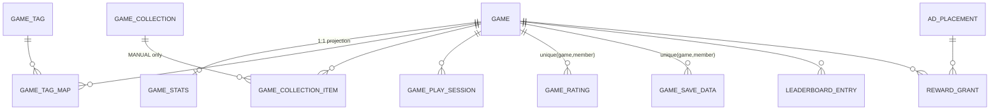

# Design — Game Platform (게임 리스트 + 플레이 + 광고) 엔티티 설계

**Date**: 2026-07-06
**Status**: DRAFT — 아키텍처 결정은 ADR-0059 (Proposed) 참조
**Scope**: 신규 `game` 도메인 (`:game:domain` / `:game:feature`, `code-dictionary:app` 마운트) 엔티티 설계 + 기존 서비스 연계

---

## 1. 현재 코드베이스의 게임 자산 분석

플랫폼화 대상이 될 수 있는 기존 게임성 콘텐츠:

| 게임 | 위치 | 구현 방식 | 비고 |
|------|------|-----------|------|
| Memory (개념 짝 맞추기) | `portal-fe/src/components/quiz/MemoryGame.tsx` | React 컴포넌트 (내장형) | code-dictionary 개념 데이터 기반 |
| Fill Blank (빈칸 채우기) | `portal-fe/src/components/quiz/FillBlankQuiz.tsx` | React 컴포넌트 (내장형) | 〃 |
| Magnifier (코드 돋보기) | `portal-fe/src/components/quiz/CodeMagnifier.tsx` | React 컴포넌트 (내장형) | 〃 |
| Cascade (개념 분류) | `portal-fe/src/components/quiz/ConceptCascade.tsx` | React 컴포넌트 (내장형, phase 상태머신) | 〃 |
| Pixel Office | `agent-viewer/front/src/office/` | Canvas + 순수 TS 게임 모듈 (rAF 게임루프, BFS 길찾기, 타일맵/스프라이트) | 로컬 전용 도구 (OCI 배포 제외) |

**시사점**: 기존 게임은 모두 **호스트 앱에 직접 내장된 React/Canvas 코드**다. CrazyGames 방식의 플랫폼이 되려면 "게임 = 독립 배포 가능한 콘텐츠 단위"로 분리되어야 하며, 내장형(INTERNAL_ROUTE)과 iframe 임베드형(IFRAME) 두 로드 방식을 모두 지원하는 것이 기존 자산을 살리는 길이다.

## 2. CrazyGames (ragdoll-archers) 실서비스 동작 방식

리서치 결과 (docs.crazygames.com, 게임 페이지 분석):

### 2.1 게임 로드
- 게임은 **HTML5 번들(또는 Unity WebGL)**로 제출되거나 외부 도메인에 호스팅되고, 플랫폼 게임 페이지 안에 **iframe으로 임베드**된다.
- 게임 쪽 `index.html`에 SDK 스크립트(`crazygames-sdk-v3.js`)를 삽입 → iframe 내부 게임과 부모 플랫폼이 **postMessage 기반 SDK**로 통신한다.

### 2.2 SDK가 제공하는 기능 (플랫폼 ↔ 게임 계약)
| 기능 | 내용 |
|------|------|
| 광고 — Video | **midgame**(사망/레벨 클리어 시점), **rewarded**(유저가 보상 대가로 자발 시청: 추가 목숨, 리트라이 등). `adStarted`/`adFinished`/`adError` 콜백 |
| 광고 — Banner | `requestBanner` — 표준 IAB 사이즈(970x90, 320x50, 300x250 등 11종), **동일 배너 60초당 1회 요청 제한** |
| 유저 | 플랫폼 계정 연동 (게스트 플레이도 허용) |
| 데이터 저장 | 클라우드 세이브 (게임별 유저 데이터) |
| 인게임 구매 | 선별된 게임만 |

### 2.3 메타데이터 & 디스커버리 (ragdoll-archers 페이지 기준)
- **평점**: 9.1/10, 41.6만 표 (유저 투표 집계)
- **태그**: Arcade, 2 Player, Physics, Stickman, Archery, Ragdoll, Casual 등 11개 — 카테고리가 아니라 **다중 태그**가 1급 개념
- **개발사**(Ericetto), 출시일/최종 업데이트일, 지원 플랫폼(browser desktop/mobile/tablet, 앱)
- **"More Games Like This"**: 태그 기반 유사 게임 추천
- 홈은 Trending / New / 태그별 큐레이션 행(row)으로 구성

### 2.4 운영 모델
- **2단계 런칭**: Beta launch(제한 유저 2주 테스트, 수익화 OFF) → Full launch(수익화 ON)
- **수익**: 광고 + 인게임 구매 수익을 개발사와 배분. SDK 미통합 외부 호스팅 게임은 수익 발생 안 함 → **SDK 통합 여부가 수익화 게이트**

## 3. 신규 `game` 도메인 — 경계와 배치

배치는 ADR-0059 §1: 신규 상주 JVM 없이 ADR-0058 모듈러 모놀리스 컨벤션 적용 —
`:game:domain`(순수) + `:game:feature`(라이브러리, 자체 `game_db` 스키마/TM/Flyway)를
`code-dictionary:app`에 마운트. 트래픽 증가 시 재분리 체크리스트로 `game:app` 추출.

```
game 도메인 (:game:domain / :game:feature → code-dictionary:app 호스트)
├── catalog   : Game, GameTag, GameCollection — 게임 목록/메타데이터/큐레이션
├── play      : GamePlaySession, GameRating, GameSaveData, LeaderboardEntry
└── ads       : AdPlacement, AdPolicy, RewardGrant (+ 이벤트는 analytics로 위임)
```

기존 서비스 연계 (cross-reference 금지 → FK-as-ID + API/Kafka만):

| 연계 대상 | 방식 |
|-----------|------|
| member | `memberId: Long` FK-as-ID (게스트는 null) |
| auth | 어드민 CRUD는 ROLE_ADMIN, 게임 플레이는 비인증 허용 |
| analytics | 플레이/광고 이벤트를 Kafka 발행 → Kafka Streams + ClickHouse 집계 (고볼륨 로그를 MySQL에 두지 않음) |
| search | 게임 검색은 후속 단계에서 OpenSearch 색인 (code-dictionary 패턴 재사용) |
| gateway | `/api/v1/games/**` 라우팅 추가 |
| portal-fe | 게임 리스트/상세/플레이는 portal-fe nested lazy route `/games/*` (ADR-0059 §4) |

## 4. 엔티티 설계

컨벤션 준수: enum은 `@Enumerated(STRING)`, 서비스 간 참조는 FK-as-ID, Flyway + `validate`, 가변 컬럼 `private set` + 엔티티 메서드 변경, 무거운 조회는 Querydsl QueryRepository.

### 4.1 catalog

#### Game (aggregate root)
| 컬럼 | 타입 | 설명 |
|------|------|------|
| id | Long (PK) | |
| slug | String, unique | URL 식별자 (`ragdoll-archers` 방식). `/games/{slug}` |
| title | String | |
| description | String (TEXT) | |
| thumbnail_url | String | 리스트 카드 이미지 |
| cover_url | String? | 상세 페이지 히어로 |
| engine_type | Enum STRING | `HTML5` / `UNITY_WEBGL` / `CANVAS_TS` / `REACT_INTERNAL` |
| load_type | Enum STRING | `IFRAME` (entry_url을 iframe 임베드) / `INTERNAL_ROUTE` (portal-fe 내장 라우트) |
| entry_url | String | IFRAME: 게임 번들 URL / INTERNAL_ROUTE: FE route path |
| orientation | Enum STRING | `LANDSCAPE` / `PORTRAIT` / `BOTH` |
| supports_mobile | Boolean | |
| developer_name | String | 외부 개발사 표기 (내부 게임은 "kgd") |
| sdk_integrated | Boolean | SDK 통합 여부 — **광고/수익화 게이트** (CrazyGames 모델) |
| status | Enum STRING | `DRAFT` → `REVIEW` → `BETA` → `PUBLISHED` → `SUSPENDED` (2단계 런칭 반영: BETA는 수익화 OFF) |
| released_at / content_updated_at | Instant | 출시일 / 게임 콘텐츠 최종 업데이트 |
| created_at / updated_at | Instant | BaseTimeEntity |

상태 전이는 도메인 메서드로 강제 (`submitForReview()`, `launchBeta()`, `publish()`, `suspend()`), 허용되지 않는 전이는 BusinessException. `PUBLISHED && sdk_integrated`일 때만 광고 요청 허용.

#### GameTag / GameTagMap
| 엔티티 | 컬럼 | 설명 |
|--------|------|------|
| GameTag | id, slug(unique), name, display_order | `physics`, `2-player`, `casual`… 다중 태그 (카테고리 대신 태그가 1급) |
| GameTagMap | game_id, tag_id (unique 복합) | N:M 매핑 테이블. "More Games Like This" = 태그 교집합 수 기준 Querydsl 조회 |

#### GameStats (읽기 최적화 — Game과 1:1, 별도 row)
| 컬럼 | 설명 |
|------|------|
| game_id (PK=FK) | |
| play_count | 누적 플레이 수 (배치/이벤트 집계 반영) |
| rating_sum / rating_count | 평균 = sum/count. 평점 표시는 `9.1 (416,700 votes)` 포맷 |
| weekly_play_count | Trending 정렬용. analytics ClickHouse 집계를 주기 동기화 |

> 실시간 카운터를 Game row에 두면 핫 로우 경합 + 캐시 무효화 문제. 원본 이벤트는 analytics(ClickHouse)가 갖고, GameStats는 **주기 동기화된 프로젝션**이다.

#### GameCollection / GameCollectionItem (홈 큐레이션 행)
| 엔티티 | 컬럼 | 설명 |
|--------|------|------|
| GameCollection | id, slug, title, type(Enum: `MANUAL`/`TRENDING`/`NEW`/`TAG_BASED`), tag_id?, display_order, active | CrazyGames 홈의 행(row) 단위. TRENDING/NEW는 쿼리 기반, MANUAL은 어드민 큐레이션 |
| GameCollectionItem | collection_id, game_id, sort_order (unique 복합) | MANUAL 타입일 때만 사용 |

### 4.2 play

#### GamePlaySession
| 컬럼 | 설명 |
|------|------|
| id (PK), session_key (UUID, unique) | 클라이언트가 세션 시작 시 발급받는 키 |
| game_id | FK-as-ID |
| member_id | Long? — **게스트 허용** |
| device_type | Enum STRING: `DESKTOP`/`MOBILE`/`TABLET` |
| started_at / ended_at / duration_sec | heartbeat 또는 종료 API로 마감 |

> 세션 row는 MySQL에 두되, 세부 인게임 이벤트(레벨 클리어 등)는 Kafka → analytics. 토픽: `game.session.started` / `game.session.ended` (kafka-convention `{service}.{entity}.{event}` 준수).

#### GameRating
| 컬럼 | 설명 |
|------|------|
| id, game_id, member_id | `unique(game_id, member_id)` — 1인 1표, 재투표는 UPDATE |
| score | Int 1~10 (CrazyGames 10점 척도) |

투표 시 GameStats.rating_sum/count 갱신은 같은 트랜잭션 (동일 서비스 내부이므로 허용, 외부 IO 아님).

#### GameSaveData (클라우드 세이브 — SDK 계약)
| 컬럼 | 설명 |
|------|------|
| id, game_id, member_id | `unique(game_id, member_id)` |
| data | JSON (게임이 정의하는 불투명 blob, 사이즈 상한 예: 64KB) |
| version | 낙관적 락 — 멀티탭 동시 저장 방어 |

#### LeaderboardEntry
| 컬럼 | 설명 |
|------|------|
| id, game_id, board_key | 게임당 다중 보드 허용 (`highscore`, `speedrun`…) |
| member_id, score, achieved_at | `unique(game_id, board_key, member_id)` — best score만 유지 |

### 4.3 ads

광고 **집행**(실제 크리에이티브 서빙)은 외부 애드 네트워크(AdSense/GAM 등)에 위임하고, 플랫폼은 **배치 슬롯 관리 + 정책 + 보상 멱등 처리 + 이벤트 수집**만 소유한다. (CrazyGames도 자체 애드서버가 아니라 네트워크 중개 구조)

#### AdPlacement
| 컬럼 | 설명 |
|------|------|
| id, placement_key (unique) | `game-page-sidebar`, `game-list-inline`, `preroll`… |
| ad_type | Enum STRING: `BANNER` / `PREROLL` / `MIDGAME` / `REWARDED` |
| allowed_sizes | JSON — IAB 사이즈 화이트리스트 (`["300x250","728x90"]`), 비디오형은 null |
| provider | Enum STRING: `ADSENSE` / `GAM` / `HOUSE` (자체 홍보 배너) |
| provider_slot_id | 외부 네트워크의 슬롯/유닛 ID |
| active | Boolean |

#### AdPolicy (frequency cap)
| 컬럼 | 설명 |
|------|------|
| id, ad_type (unique) | 타입별 전역 정책 |
| min_interval_sec | BANNER=60 (CrazyGames 동일), MIDGAME=180 등 |
| max_per_session | 세션당 상한 |

정책 판정은 Redis(세션 키 기준 TTL 카운터)로 수행하고, 이 테이블은 정책 값의 SSOT. 어드민에서 수정 가능.

#### RewardGrant (rewarded 광고 보상 — 멱등성 핵심)
| 컬럼 | 설명 |
|------|------|
| id, idempotency_key (unique) | 클라이언트가 광고 요청 시 발급받은 키. **완료 콜백 중복/재시도에도 보상 1회 보장** (idempotent-consumer.md 패턴) |
| session_key, game_id, member_id? | |
| placement_id, status | `PENDING` → `COMPLETED` / `FAILED` / `EXPIRED` |
| granted_at | |

> 광고 노출/클릭/완료 이벤트 자체는 row로 쌓지 않는다 — `game.ad.logged` Kafka 발행 → analytics(ClickHouse). MySQL에는 보상처럼 **트랜잭션 정합성이 필요한 것만** 남긴다.

### 4.4 ERD



member_id는 모든 곳에서 FK-as-ID(제약 없는 Long) — member 서비스 DB와 물리 FK 없음.

## 5. 게임 ↔ 플랫폼 SDK 계약 (postMessage)

IFRAME 게임을 위해 CrazyGames SDK와 동형의 최소 계약을 정의한다 (`@kgd/game-sdk` 패키지 후보):

| 메시지 | 방향 | 설명 |
|--------|------|------|
| `sdk:ready` | 게임→셸 | SDK 핸드셰이크 (sdk_integrated 검증 근거) |
| `ad:request {type, placementKey, idempotencyKey?}` | 게임→셸 | 셸이 AdPolicy 판정 후 네트워크 호출 |
| `ad:started / ad:finished / ad:error` | 셸→게임 | 게임은 finished/error에서 사운드/루프 재개 |
| `save:set {data} / save:get` | 게임→셸 | GameSaveData API 프록시 |
| `score:submit {boardKey, score}` | 게임→셸 | LeaderboardEntry |
| `session:heartbeat` | 게임→셸 | duration 집계 |

INTERNAL_ROUTE 게임(기존 퀴즈 4종)은 postMessage 없이 같은 인터페이스의 TS 함수를 직접 호출 — 계약이 하나면 로드 방식은 어댑터 차이일 뿐이다.

## 6. API 표면 (요약, ApiResponse<T>)

| Endpoint | 설명 |
|----------|------|
| `GET /api/v1/games?tag=&sort=trending\|new\|top&page=` | 리스트 (Querydsl) |
| `GET /api/v1/games/{slug}` | 상세 + stats + tags |
| `GET /api/v1/games/{slug}/similar` | 태그 교집합 추천 |
| `GET /api/v1/games/collections` | 홈 큐레이션 행 |
| `POST /api/v1/games/{slug}/sessions` / `PATCH .../sessions/{key}` | 세션 시작/종료 |
| `PUT /api/v1/games/{slug}/rating` | 1인 1표 upsert |
| `GET/PUT /api/v1/games/{slug}/save` | 클라우드 세이브 (인증 필수) |
| `GET /api/v1/games/{slug}/leaderboards/{boardKey}` / `POST .../scores` | 리더보드 |
| `POST /api/v1/ads/rewards` / `POST /api/v1/ads/rewards/{key}/complete` | 보상 발급/완료 (멱등) |
| `POST/PUT/DELETE /api/v1/admin/games/**` | 어드민 CRUD (ROLE_ADMIN, admin-fe) |

## 7. 아키텍처 결정 (ADR-0059, Proposed)

당초 미결정 5개 항목은 `docs/adr/ADR-0059-game-platform.md`에서 결정됨:

1. **배치**: 신규 JVM 없이 `:game:feature` 라이브러리를 `code-dictionary:app`에 마운트 (ADR-0058 준수, 재분리 가능)
2. **게임 번들 호스팅**: `game-assets` 정적 nginx 이미지, ingress `/game-assets/{slug}/`
3. **광고**: HOUSE-only 시작, provider 추상화로 외부 네트워크 확장 여지 유지
4. **FE**: portal-fe nested lazy route `/games/*` (admin 흡수와 동일 패턴)
5. **인게임 구매**: 스코프 아웃

## References

- [CrazyGames Documentation](https://docs.crazygames.com/) · [HTML5 SDK](https://docs.crazygames.com/sdk/html5-v2/intro/) · [Video ads](https://docs.crazygames.com/sdk/video-ads/) · [Developer Portal](https://developer.crazygames.com/)
- 게임 페이지 분석: [Ragdoll Archers](https://www.crazygames.com/game/ragdoll-archers)
- 사내 컨벤션: `docs/conventions/jpa-persistence.md`, `docs/conventions/idempotent-consumer.md`, `docs/architecture/kafka-convention.md`, `docs/conventions/entity-mutation.md`
