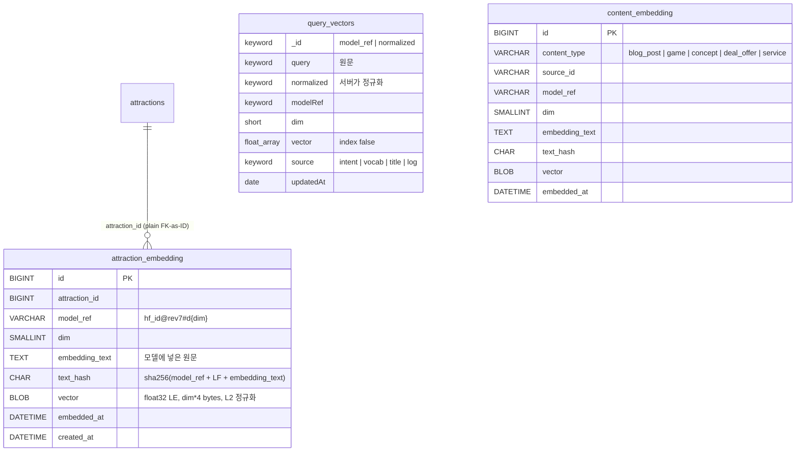

# 임베딩 엔티티 설계 — 통합 검색 v2 (서버 상주 모델 0)

- 작성: 2026-09-05
- 상위 문서: `docs/plans/2026-09-05-unified-search-hybrid-embedding.md` §2.4 · ADR-0090(P0 에서 작성)
- 따르는 규칙: 레이어 표준 ADR-0083(`application/{entity}/{usecase,port,service}` · `infrastructure/persistence/{entity}/{entity,repository,adapter}` ·
  `presentation/{entity}/{controller,dto}`) · `docs/conventions/jpa-persistence.md`(경계를 넘는 참조는 plain ID, Flyway append-only) ·
  외부 데이터 3규칙 ①(**모델에 넣은 원문을 그대로 보존**한다 — 다시 만들려면 모델을 다시 돌려야 하는 자원이다)
- 설계 원칙의 출처: 사용자가 이전에 만든 임베딩 파이프라인 설계에서 네 가지를 가져왔다 — **후보(문서)와 질의를 다른 저장소에 둔다** ·
  **모델 스탬프를 행 단위로 박아 벡터 공간이 섞이지 않게 한다** · **멱등은 저장된 임베딩 텍스트와 새로 조합한 텍스트의 비교로** ·
  **서빙 경로는 서빙 저장소에 쓰지 않는다**(적재는 배치가 전담).

---

## 0. 한눈에



| 저장소 | 소유 | 역할 | 쓰는 쪽 | 읽는 쪽 |
|---|---|---|---|---|
| `attraction_embedding` (MySQL `place_db`) | place | **답이 되는 문서**의 벡터 원본 | `tools/embed` → `/internal/attractions/embeddings/bulk` | search:batch 재색인(`lookup`), 어드민(`status`) |
| `query_vectors` (OpenSearch, search 소유) | search | **답이 되지 않는** 질의 벡터 사전 | `tools/embed` → `/internal/query-vectors/bulk` | search:app 질의 경로(GET by id) |
| Redis `search:qmiss:{model_ref}` | search | 미적중 질의 카운트(휘발 허용) | search:app 질의 경로(ZINCRBY, fire-and-forget) | `tools/embed`(`/internal/query-vectors/misses`) |
| `content_embedding` (MySQL 호스트 스키마, P2) | code-dictionary 호스트 | 글·게임·개념·혜택·서비스 벡터 원본 | `tools/embed` → `/internal/content/embeddings/bulk` | search:batch unified 재색인 |

**질의 사전 항목은 절대 검색 결과가 되지 않는다.** 별도 인덱스에 두고 `vector` 를 `index: false` 로 박는 이유다. 반대로 문서 벡터는
DB 가 원본이고 OpenSearch 의 `embedding` 필드는 매일 다시 채워지는 사본이다.

---

## 1. 원칙

1. **원본은 SSOT 서비스의 DB.** OpenSearch 인덱스는 매일 새로 지어지므로 거기만 있는 벡터는 사라진다. 재색인은 `lookup` 으로 채운다.
2. **모델 스탬프는 행 단위.** `model_ref = "{hf_id}@{revision 7자}#d{dim}"` (예: `Qwen/Qwen3-Embedding-4B@f460253#d512`). 다른 스탬프의 벡터는
   비교 불가다. 모델·리비전·차원 중 하나라도 바뀌면 새 스탬프 = 전량 재임베딩(오프라인이라 분 단위). 두 스탬프가 한 표에 공존할 수 있고,
   검색은 설정 `search.embedding.model-ref` 하나만 본다.
3. **멱등은 텍스트 비교.** 도구는 새로 조합한 임베딩 텍스트의 해시가 저장된 `text_hash` 와 같으면 모델을 부르지 않는다. 서버는 받은
   `embedding_text` 로 해시를 다시 계산해 `text_hash` 와 맞는지 검사한다 — 도구 버그가 벡터와 텍스트를 어긋나게 저장하는 것을 막는다.
4. **임베딩 텍스트 원문을 보존한다.** "왜 이 벡터가 이렇게 나왔나"를 나중에 볼 수 있고, 규칙을 바꿨을 때 무엇이 달라졌는지 diff 가 된다.
   6만 행 × ~1KB = 60MB.
5. **서빙 경로는 쓰지 않는다.** 질의 경로가 하는 유일한 쓰기는 Redis 미스 카운트(비동기, 실패 무시)다. `query_vectors` 는 도구가 `/internal` 로만 쓴다.
6. **정규화 함수는 서버 한 곳.** 질의 정규화는 `search:domain` 의 `QueryNormalizer` 하나이고, `/internal/query-vectors/bulk` 는 원문을 받아
   **서버가 정규화해 `_id` 를 만든다.** 도구는 정규화하지 않는다 — 두 구현이 갈리면 조용히 0% 적중이 된다(자모 때 배운 것).

---

## 2. `attraction_embedding` — place (P1)

### 2.1 DDL (Flyway, 번호는 작성 시점에 확인 — 다른 세션이 V11 을 쓰고 있다)

```sql
CREATE TABLE attraction_embedding (
    id             BIGINT       NOT NULL AUTO_INCREMENT,
    attraction_id  BIGINT       NOT NULL COMMENT 'attractions.id — 경계 안이지만 객체 연관 대신 plain ID',
    model_ref      VARCHAR(160) NOT NULL COMMENT 'hf_id@rev7#d{dim} — 벡터 공간 식별자',
    dim            SMALLINT     NOT NULL,
    embedding_text TEXT         NOT NULL COMMENT '모델에 넣은 원문 그대로',
    text_hash      CHAR(64)     NOT NULL COMMENT 'sha256(model_ref + "\n" + embedding_text) hex',
    vector         BLOB         NOT NULL COMMENT 'float32 little-endian, dim*4 bytes, L2 정규화',
    embedded_at    DATETIME     NOT NULL,
    created_at     DATETIME     NOT NULL DEFAULT CURRENT_TIMESTAMP,
    PRIMARY KEY (id),
    UNIQUE KEY uk_attraction_embedding (attraction_id, model_ref),
    KEY idx_attraction_embedding_model (model_ref, embedded_at)
) COMMENT='관광지 임베딩 벡터 원본 — tools/embed 가 밀어 넣고 search-batch 가 읽는다 (통합 검색 v2)';
```

- 서로게이트 `id` + UNIQUE 는 기존 엔티티(`@Id @GeneratedValue IDENTITY`) 와 같은 모양이라 복합 `@IdClass` 를 피한다.
- `BLOB` 은 64KB 까지 — 차원 16,384 까지 담는다. MySQL 9 의 `VECTOR` 타입은 서버가 벡터 연산을 하지 않는 지금은 이득이 없어 쓰지 않는다.
- FK 제약은 두지 않는다(jpa-persistence: 경계 안이라도 plain ID 정책, 그리고 `attractions` bulk 재동기화가 행을 지우지 않으므로 고아가 생기지 않는다).

### 2.2 도메인 (`place:domain`, `com.kgd.place.domain.attraction.model`)

```kotlin
/** 벡터 공간 식별자. 모델·리비전·차원 중 하나라도 다르면 다른 공간이다. */
data class EmbeddingModelRef(val modelId: String, val revision: String, val dim: Int) {
    val value: String get() = "$modelId@$revision#d$dim"
    init {
        require(modelId.isNotBlank() && '@' !in modelId && '#' !in modelId) { "modelId 형식이 틀렸습니다: $modelId" }
        require(revision.length == 7 && revision.all { it.isLetterOrDigit() }) { "revision 은 7자 영숫자여야 합니다: $revision" }
        require(dim in 32..16384) { "dim 은 32~16384 여야 합니다: $dim" }
    }
    companion object {
        fun parse(value: String): EmbeddingModelRef   // "id@rev#dN" 아니면 IllegalArgumentException
    }
}

class AttractionEmbedding private constructor(
    val id: Long?,
    val attractionId: Long,
    val modelRef: EmbeddingModelRef,
    val embeddingText: String,
    val textHash: String,
    val vector: FloatArray,
    val embeddedAt: LocalDateTime,
) {
    companion object {
        fun create(attractionId: Long, modelRef: EmbeddingModelRef, embeddingText: String, textHash: String,
                   vector: FloatArray, embeddedAt: LocalDateTime): AttractionEmbedding {
            require(embeddingText.isNotBlank()) { "임베딩 텍스트는 비어있을 수 없습니다" }
            require(vector.size == modelRef.dim) { "벡터 차원이 다릅니다: ${vector.size} != ${modelRef.dim}" }
            require(textHash == EmbeddingText.hash(modelRef, embeddingText)) { "text_hash 가 임베딩 텍스트와 맞지 않습니다" }
            require(abs(l2Norm(vector) - 1.0) < 0.01) { "벡터가 L2 정규화돼 있지 않습니다: ${l2Norm(vector)}" }
            return AttractionEmbedding(null, attractionId, modelRef, embeddingText, textHash, vector, embeddedAt)
        }
    }
    /** 텍스트가 같으면 벡터를 다시 받지 않고 시각만 갱신한다(도구의 touch). */
    fun touched(at: LocalDateTime): AttractionEmbedding
}

/** 해시 규약만 도메인에 둔다. 임베딩 텍스트를 **만드는** 규칙은 서버에 없다 — tools/embed 한 곳이다. */
object EmbeddingText {
    fun hash(modelRef: EmbeddingModelRef, text: String): String = sha256Hex(modelRef.value + "\n" + text)
}
```

도메인 테스트(`place/domain/src/test`): `parse` 왕복 · dim 불일치 · 해시 불일치 · 비정규화 벡터 → `IllegalArgumentException`, 정상 생성 1건.

### 2.3 애플리케이션 (`place:app`, `application/attraction/{usecase,port,service}`)

```kotlin
interface SyncAttractionEmbeddingsUseCase {                 // tools/embed 가 쓴다
    fun findPending(modelRef: String, limit: Int): Pending  // 없는 것 + attractions.updated_at > embedded_at
    fun upsert(modelRef: String, items: List<Item>): Applied
    fun status(modelRef: String): Status
    data class Pending(val modelRef: String, val missing: Long, val stale: Long, val ids: List<Long>)
    /** vector 가 null 이면 touch — 저장된 text_hash 와 같아야 하고 다르면 거부된다. */
    data class Item(val attractionId: Long, val embeddingText: String, val textHash: String, val vector: FloatArray?)
    data class Applied(val inserted: Int, val updated: Int, val touched: Int)
    data class Status(val modelRef: String, val total: Long, val embedded: Long, val missing: Long, val stale: Long,
                      val lastEmbeddedAt: LocalDateTime?)
}

interface LookupAttractionEmbeddingsUseCase {               // search-batch 가 쓴다
    fun lookup(modelRef: String, attractionIds: List<Long>): List<Found>
    data class Found(val attractionId: Long, val textHash: String, val vector: FloatArray, val embeddedAt: LocalDateTime)
}

interface AttractionEmbeddingRepositoryPort {
    fun findByModelAndIds(modelRef: String, ids: List<Long>): List<AttractionEmbedding>
    fun saveAll(embeddings: List<AttractionEmbedding>): Int
    fun findPendingIds(modelRef: String, limit: Int): List<Long>
    fun countPending(modelRef: String): Pair<Long, Long>      // (missing, stale)
    fun countByModel(modelRef: String): Long
    fun lastEmbeddedAt(modelRef: String): LocalDateTime?
    fun deleteByModel(modelRef: String): Int                  // 옛 스탬프 정리 (모델 교체 뒤)
}
```

- `upsert` 는 **요청 전체가 하나의 트랜잭션**(≤ 500건)이다. 한 건이라도 `dim`·해시·정규화·존재하지 않는 `attractionId` 에 걸리면 전부 거부하고
  `400` 에 어떤 항목이 왜 걸렸는지 적는다. 부분 성공을 허용하면 도구가 "무엇이 들어갔나"를 다시 물어야 한다.
- 외부 IO 가 없는 순수 DB 트랜잭션이라 `@Transactional("placeTransactionManager")` 로 감싼다.

### 2.4 인프라 (`infrastructure/persistence/attraction/{entity,repository,adapter}`)

- `AttractionEmbeddingJpaEntity` — 컬럼 그대로. `vector` 는 `ByteArray` 로 매핑하고 `FloatArray` 변환은 **어댑터**가 한다(`ByteBuffer.order(LITTLE_ENDIAN)`).
  엔티티에 도메인 변환 로직을 두지 않는다.
- `AttractionEmbeddingJpaRepository` — `findByModelRefAndAttractionIdIn`, 그리고 pending 은 네이티브 한 문장:

```sql
SELECT a.id FROM attractions a
LEFT JOIN attraction_embedding e ON e.attraction_id = a.id AND e.model_ref = :modelRef
WHERE a.status = 'ACTIVE' AND (e.id IS NULL OR a.updated_at > e.embedded_at)
ORDER BY a.id LIMIT :limit
```

  `attractions.updated_at` 은 V3 의 `ON UPDATE CURRENT_TIMESTAMP` 컬럼이다(JPA 엔티티는 매핑하지 않는다 — DB 가 관리). 값이 바뀐 컬럼이 임베딩 텍스트와
  무관(전화·이미지)할 수 있어 **후보만 좁히는 신호**고, 도구가 해시로 확정한다(같으면 touch).
- `AttractionEmbeddingPersistenceAdapter : AttractionEmbeddingRepositoryPort`.

### 2.5 내부 API (`presentation/attraction/controller/AttractionEmbeddingInternalController`, `/internal/attractions/embeddings`)

게이트웨이가 라우팅하지 않는 `/internal` — `AttractionLinkInternalController` 와 같은 이유·같은 모양. 도구는 ssh 터널 + port-forward 로 닿는다.

| 메서드 · 경로 | 요청 | 응답 |
|---|---|---|
| `GET /pending?modelRef=&limit=500` | — | `{modelRef, missing, stale, ids:[…]}` |
| `PUT /bulk` | `{modelRef, dim, items:[{attractionId, embeddingText, textHash, vector?: base64}]}` (≤ 500) | `{inserted, updated, touched}` / `400 {reason, items:[{attractionId, reason}]}` |
| `POST /lookup` | `{modelRef, ids:[…]}` (≤ 500) | `{modelRef, dim, items:[{attractionId, textHash, vector: base64, embeddedAt}]}` |
| `GET /status?modelRef=` | — | `{modelRef, total, embedded, missing, stale, lastEmbeddedAt}` |
| `DELETE ?modelRef=` | — | `{deleted}` — 옛 스탬프 정리 |

`vector` 는 float32 little-endian 바이트의 base64 — JSON 실수 배열보다 3배 작고 파싱이 빠르다. `dim` 은 요청 수준에서 한 번, 각 항목의
바이트 길이(`dim*4`)는 서버가 검사한다.

### 2.6 불변식과 그것을 잠그는 테스트

| 불변식 | 어디서 막나 | 테스트 |
|---|---|---|
| `vector.size == dim` | 도메인 `create` | 도메인 단위 |
| `text_hash == sha256(model_ref + LF + text)` | 도메인 `create` | 도메인 단위 |
| L2 정규화 | 도메인 `create` | 도메인 단위 |
| 한 관광지 · 한 스탬프 = 한 행 | UNIQUE 키 | 어댑터 통합(place 기존 테스트 정책 따름) |
| touch 는 해시가 같을 때만 | 서비스 | Kotest BehaviorSpec + MockK(포트) |
| 요청 단위 all-or-nothing | 서비스 `@Transactional` + 사전 검증 | 서비스 단위 |
| pending = 없음 ∪ stale | 네이티브 쿼리 | 어댑터 통합 |

---

## 3. `query_vectors` — search (P1)

### 3.1 OpenSearch 매핑 (`search/app/src/main/resources/opensearch/query-vectors-index.json`, search:app 기동 시 idempotent 생성)

```json
{
  "settings": { "index": { "number_of_shards": 1, "number_of_replicas": 0 } },
  "mappings": {
    "dynamic": "strict",
    "properties": {
      "query":      { "type": "keyword" },
      "normalized": { "type": "keyword" },
      "modelRef":   { "type": "keyword" },
      "dim":        { "type": "short" },
      "vector":     { "type": "float", "index": false, "doc_values": false },
      "source":     { "type": "keyword" },
      "updatedAt":  { "type": "date", "format": "yyyy-MM-dd'T'HH:mm:ss" }
    }
  }
}
```

- `_id = "{modelRef}|{normalized}"`. 스탬프가 바뀌어도 옛 항목은 남아 있어도 무해하고, 전환 중 두 스탬프가 공존한다.
- `vector` 는 `_source` 에만 있다(`index: false`). **이 인덱스는 검색되지 않는다.** GET by id 만.
- `dynamic: strict` — 도구가 필드를 잘못 보내면 조용히 들어가는 대신 거부된다.

### 3.2 도메인 (`search:domain`, `com.kgd.search.domain.queryvector.model`)

```kotlin
object QueryNormalizer {
    /** NFKC → trim → 연속 공백 1개 → 라틴 소문자(한글 무영향) → 끝의 ?!.,~ 제거 → 100자 절단. 빈 결과는 null. */
    fun normalize(raw: String): String?
}

data class QueryVector(val query: String, val normalized: String, val modelRef: String, val vector: FloatArray,
                       val source: Source, val updatedAt: LocalDateTime) {
    enum class Source { INTENT, VOCAB, TITLE, LOG }
    init { require(vector.isNotEmpty()); require(normalized.isNotBlank()) }
    val id: String get() = "$modelRef|$normalized"
}
```

`QueryNormalizer` 는 `Jamo` 옆에 두고 **고정값 테스트**로 잠근다(`" 바다가  보이는 곳? "` → `바다가 보이는 곳`, `"Palace In Seoul"` → `palace in seoul`,
전각 `"Ｓｅｏｕｌ"` → `seoul`). 이 함수가 바뀌면 사전의 `_id` 가 전부 어긋나므로 **변경 = 사전 전량 재적재**임을 주석에 적는다.

### 3.3 애플리케이션 (`search:app`, `application/queryvector/{usecase,port,service}`)

```kotlin
interface ResolveQueryVectorUseCase {                       // 질의 경로가 쓴다
    /** 적중이면 벡터, 미적중이면 null + 미스 기록(비동기). 모델 불일치는 미적중으로 다룬다. */
    fun resolve(rawQuery: String, modelRef: String): FloatArray?
}
interface ManageQueryVectorsUseCase {                       // tools/embed 가 쓴다
    fun upsert(modelRef: String, items: List<Item>): Applied     // 서버가 normalize → id
    fun misses(modelRef: String, limit: Int): List<Miss>
    fun clearMisses(modelRef: String, normalized: List<String>): Int
    fun status(modelRef: String): Status
    data class Item(val query: String, val vector: FloatArray, val source: QueryVector.Source)
    data class Miss(val normalized: String, val count: Long)
    data class Applied(val upserted: Int, val skippedEmpty: Int)
    data class Status(val modelRef: String, val entries: Long, val pendingMisses: Long)
}
interface QueryVectorPort {                                  // OpenSearch
    fun find(id: String): QueryVector?
    fun upsertAll(vectors: List<QueryVector>): Int
    fun count(modelRef: String): Long
}
interface QueryMissPort {                                   // Redis
    fun record(modelRef: String, normalized: String)         // ZINCRBY, 실패는 로그만
    fun top(modelRef: String, limit: Int): List<Pair<String, Long>>
    fun remove(modelRef: String, normalized: List<String>): Int
    fun size(modelRef: String): Long
}
```

- `resolve` 앞에 Caffeine(`maximumSize 10_000`, `expireAfterWrite 10m`, 미적중도 캐시)을 둔다. 미스 기록은 캐시 적중 여부와 무관하게 매 요청 ZINCRBY —
  카운트가 곧 우선순위다.
- 어댑터: `infrastructure/opensearch/QueryVectorAdapter`(GET/bulk index), `infrastructure/redis/QueryMissRedisAdapter`
  (`search:qmiss:{modelRef}` ZSET, 쓸 때마다 `EXPIRE 30d`).

### 3.4 내부 API (`/internal/query-vectors`)

| 메서드 · 경로 | 요청 | 응답 |
|---|---|---|
| `PUT /bulk` | `{modelRef, dim, items:[{query, vector: base64, source}]}` (≤ 500) | `{upserted, skippedEmpty}` — 정규화 결과가 빈 질의는 건너뛰고 셈 |
| `GET /misses?modelRef=&limit=500` | — | `[{normalized, count}]` 카운트 내림차순 |
| `DELETE /misses` | `{modelRef, normalized:[…]}` | `{removed}` — 도구가 업서트한 뒤 지운다 |
| `GET /status?modelRef=` | — | `{modelRef, entries, pendingMisses}` |

메트릭: `search.qvec.hit` · `search.qvec.miss` · `search.qvec.model_mismatch` 카운터. **적중률 = hit/(hit+miss)** 가 v2 의 건강 지표다.

---

## 4. `content_embedding` — code-dictionary 호스트 (P2)

`attraction_embedding` 과 같은 모양에 두 컬럼을 더한다: `content_type VARCHAR(32)`(`blog_post | game | concept | deal_offer | service`) ·
`source_id VARCHAR(120)`(slug 또는 id). UNIQUE(`content_type, source_id, model_ref`). 표는 호스트(`code-dictionary:app`)가 소유한다 — 게임이
`game_db` 에 있어도 호스트 앱이 두 스키마를 다 갖고 있으니 서비스 간 DB 공유가 아니다.

pending 은 타입별로 원천 모듈의 **공개 UseCase** 로 `(sourceId, updatedAt)` 을 받아 계산한다(`ContentEmbeddingSourcePort` + 타입별 어댑터).
폴드 모듈의 JPA 리포지토리를 호스트가 직접 import 하지 않는다 — `verifyLayerDependencies` 가 막는다.
엔드포인트는 `/internal/content/embeddings/{pending,bulk,lookup,status}` 에 `contentType` 파라미터가 붙는다.

---

## 5. `tools/embed` 계약 (Python, 레포에 두되 배포하지 않는다)

```python
@dataclass(frozen=True)
class ModelSpec:
    hf_id: str            # "Qwen/Qwen3-Embedding-4B"
    revision: str         # HF commit sha (7자 이상, ref 에는 7자)
    dim: int              # MRL 로 자른 뒤의 차원
    pooling: str          # "mean" | "last" | "cls" — 틀리면 에러 없이 틀린 벡터
    query_prompt: str | None   # 예: "Instruct: Given a web search query, retrieve relevant passages\nQuery: "
    doc_prompt: str | None     # 예: e5 의 "passage: ", Qwen3 는 None
    normalize: bool = True

    @property
    def ref(self) -> str: return f"{self.hf_id}@{self.revision[:7]}#d{self.dim}"
```

- **임베딩 텍스트 규칙 v1(관광지)** — `embed_text.py` 한 함수, 고정값 테스트로 잠근다:
  `"{title}" + (" ({titleLocal})" if titleLocal) + " · {분류명}" + (" · {address}" if address) + (" · {overview[:1000]}" if overview)`,
  연속 공백 1개로. 분류명은 문서 언어로(ko: nature→자연 · history→역사 · culture→문화 · leisure→레저 · shopping→쇼핑 · food→음식 · stay→숙박,
  en: 원문 그대로). `text_hash = sha256(model_ref + "\n" + text)`.
  규칙을 바꾸면 모든 해시가 어긋나 전부 pending 이 된다 — 그것이 곧 "규칙 변경 = 전량 재임베딩"의 강제다. 규칙 버전은 `model_ref` 에 넣지 않는다
  (벡터 공간은 같다). 대신 `embedding_text` 원문이 남아 있어 무엇이 바뀌었는지 diff 로 보인다.
- **하루 루틴**: `pending` → 문서 받기(공개 API) → 텍스트 조합 → 해시 비교(같으면 `vector: null` touch) → 모델(로컬 캐시 `~/.cache/1989v-embed/{ref}/{hash}`) →
  `bulk`(500 단위) → `misses` → 질의 임베딩(`query_prompt`) → `bulk` → `DELETE misses` → `status` 출력. 실패는 요청 단위로 멈추고 이유를 그대로 찍는다.
- **첫 채움**(Colab): 노트북은 parquet(`attraction_id, model_ref, embedding_text, text_hash, vector`)만 내고, 클러스터 접근은 로컬의 `push --file` 이 한다.
- 도구는 **정규화도, 해시 규약 외의 서버 로직도 갖지 않는다.** 질의는 원문을 보내고, 서버가 정규화한다.

---

## 6. 절차

**모델(스탬프) 교체**: ① 새 `ModelSpec` → `pending` 이 전량 → 첫 채움(오프라인) ② 사전도 새 스탬프로 전량 ③ `dim` 이 바뀌면
`attractions-index.json` 의 `dimension` 수정(계약 SSOT) ④ `search.embedding.model-ref` 변경 → 다음 재색인이 새 스탬프로 채움 → alias swap
⑤ 검색 앱은 인덱스 문서의 `embeddingModel` 과 설정이 다르면 벡터 레그를 끈다(전환 창 안전) ⑥ 확인 뒤 `DELETE ?modelRef=old`.

**정규화 규칙 변경**: `QueryNormalizer` 변경 = 사전 `_id` 전부 어긋남 → 사전 전량 재적재(도구가 원문 `query` 를 로컬 캐시에 갖고 있어 모델 호출 없이 재푸시).

**임베딩 텍스트 규칙 변경**: 해시가 전부 어긋나 pending 전량 → 재임베딩. 스탬프는 그대로.

---

## 7. 열어 둔 것

- `attraction_embedding` 을 JPA 로 갈지 JDBC 로 갈지 — place 의 다른 표가 JPA 라 JPA 로 맞추되, BLOB 60k 행 조회는 `findByModelRefAndAttractionIdIn`
  500건 단위라 문제없다. 전량 스캔 API 는 두지 않는다.
- 사전 시드에 제목 6만 건을 넣을지(플랜 §7-2). 넣으면 `query_vectors` 가 6만 항목 커지고 첫날 적중률이 오르지만 BM25 가 이미 찾는 것들이다.
- P2 의 `content_embedding` pending 신호 — 폴드 모듈마다 `updated_at` 유무가 다르다. 없는 모듈은 해시 비교만으로 간다(도구가 전량 조합).
