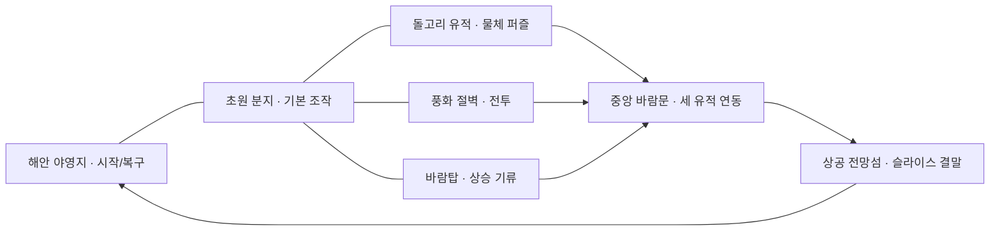
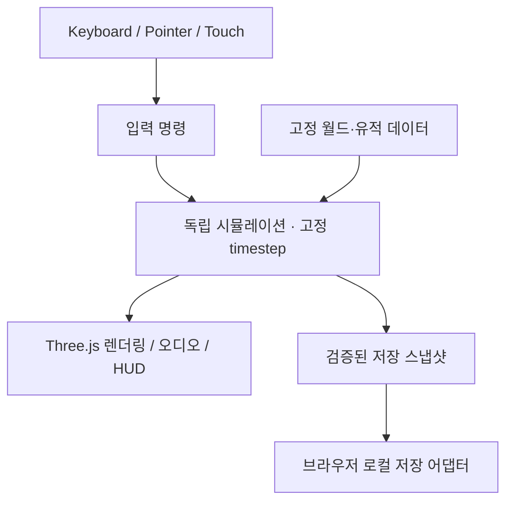

# Skybound — 바람의 유적 · PRD

상태: **설계 초안 / 구현 전** · 2026-09-10 · 진입 문서: [README](README.md)

## 1. 만들고 싶은 경험

먼 절벽 위에 보이는 유적이 궁금해서 길을 벗어난다. 바위를 옮겨 발판을
만들고, 상승 기류에 몸을 실어 섬 사이를 건넌다. 도착한 유적에서 바람길을
되살리면, 처음에는 갈 수 없었던 하늘의 섬이 새로운 목적지가 된다.

**발견 → 경로 구상 → 능력 조합 → 도달 → 세계 변화**가 이 게임의 중심이다.
왕국의 눈물에서 지향하는 것은 자유로운 탐험과 수직 공간, 도구를 이용한
문제 해결이다. 캐릭터·세계관·지도·UI·음악·에셋은 독자적으로 만든다.

전체 비전은 연결된 지상·공중 지역을 탐험하는 싱글플레이 액션 어드벤처다.
이를 한 번의 생성으로 상용 대작 규모라고 부르지 않는다. 먼저 **15~25분의
완결된 수직 슬라이스**로 재미와 시각 품질을 입증하고, 동일한 시스템으로
45~90분 분량의 첫 공개판을 확장한다. 플레이 시간은 기획 목표이며 실측 전이다.

## 2. 사용자 요구와 작업 원칙

| 구분 | 요구 |
|---|---|
| 실행 | 설치 없이 웹 브라우저에서 플레이 |
| 장르 | 왕국의 눈물 같은 오픈월드 탐험 경험 |
| 창작 | 기존 게임을 참고하지 않는 클린룸 제작, 기존 구현의 품질 상한을 계승하지 않음 |
| 진행 | 전체 PRD와 디자인 에셋을 먼저 만들고 작은 구현 단위로 분할 |
| 자원 | 문서 전체 재탐색과 중복 구현을 줄여 세션·토큰 소모 관리 |

사용자가 아직 지정하지 않은 값은 아래의 **제안값**으로 관리한다. 제목,
서사, 플레이 시간, 맵 규모와 수치는 확정된 사용자 요구로 취급하지 않는다.
기술·성능 한계가 발견되면 측정 근거와 대안을 기록하고, 아트 목표를 조용히
하향하지 않는다.

## 3. 대상과 성공 기준

대상: 짧은 시간에도 발견의 즐거움을 느끼고 싶은 탐험·퍼즐 게임 이용자.
데스크톱 키보드/마우스와 모바일 터치를 모두 제공한다. 모바일은 가로 우선이며
세로에서도 시작·메뉴·이동·주요 액션이 가려지지 않아야 한다.

| 시점 | 성공 기준 |
|---|---|
| 첫 30초 | 시작 지점에서 목적지와 이동 가능한 공간을 알아볼 수 있음 |
| 첫 2분 | 이동·점프·상호작용을 설명창 없이 한 번씩 성공 |
| 첫 5분 | 서로 다른 두 경로를 인지하고 첫 능력을 활용 |
| 슬라이스 완주 | 세 유적과 최종 바람길을 스스로 해결, 완료 후 탐험 지속 |
| 품질 판정 | 원화와 같은 실루엣·색면·깊이·빛의 방향이 실제 화면에서 읽힘 |

행동 시간은 소규모 플레이테스트에서 측정한다. 현재 성공률이나 FPS 측정치는 없다.

## 4. 세계와 플레이 구조

무대는 오래된 풍향 관측 시설이 남아 있는 **바람섬 군도**. 주인공은 끊어진
항로를 조사하는 지도 제작자 **나루**(가칭)다. 황토색 망토, 남색 탐험복,
짧은 검은 머리, 황동 고리 도구가 실루엣 표식이다.

지도는 매번 바뀌는 무작위 월드 대신 **수작업으로 설계한 고정 지형**으로
시작한다. 식생과 돌의 미세 배치는 고정 시드로 생성하되 퍼즐 해법을 바꾸지 않는다.
지도/세이브에는 `worldVersion`과 `seed`를 함께 보존한다.

슬라이스 제안 크기는 약 600×600m, 주요 고도 차는 100m 내외다. 실제 도달
시간과 시야 측정으로 조정하며, 빈 이동 거리로 오픈월드 규모를 과장하지 않는다.

세 유적은 **어떤 순서로든** 도전한다. 정면 길, 능선 우회, 활공 지름길이
이어진다. 관측 지점·작은 보급 상자·풍향 표식은 경로를 유도하되 지도에
물음표를 과밀 배치하지 않는다. 보상 없는 막다른 길에는 시각적 이유가 있어야 한다.

## 5. 시스템 요구사항

### SR-1 이동과 카메라

- 걷기/달리기, 점프, 공중 활공, 상승 기류를 하나의 연속된 조작으로 연결한다.
- 3인칭 궤도 카메라, 거리 조절, 카메라 충돌 회피, 시야 재정렬을 제공한다.
- 지형 충돌은 그림과 일치한다. 급경사·물·절벽은 행동 가능 여부를 시각적으로 드러낸다.
- 점프 후 착지 직전 입력 버퍼, 작은 단차 자동 넘기를 고려해 조작의 끊김을 줄인다.
- 낭떠러지 추락은 안전 지점으로 회복하고 퀘스트 진행을 지우지 않는다.

### SR-2 활공과 기력

- 공중에서 점프 액션을 다시 누르면 돛을 펼치고, 다시 누르면 접는다.
- 달리기와 활공은 기력을 소비한다. 지면에서 회복하고 0이면 달리기를 풀거나 돛을 접는다.
- 기류는 바람 입자·풀·천의 방향으로 먼저 보인다. 기류 안에서는 상승과 기력 회복을 허용한다.
- 필수 경로는 기본 기력으로 통과 가능해야 한다. 중간 착지점으로 실패 복구를 제공한다.
- 빠른 낙하와 피격은 피드백을 주되 과한 화면 흔들림으로 방향 감각을 잃게 하지 않는다.

### SR-3 고리 도구: 물체 이동

- 조준한 조작 가능 물체 하나를 집어 일정 거리 안에서 이동·회전·놓을 수 있다.
- 대상 외곽선, 예상 배치 위치, 배치 불가 상태를 색과 형태로 함께 표시한다.
- 벽 너머 집기, 플레이어 내부 배치, 다른 물체 관통 배치를 막는다.
- 슬라이스에서는 정해진 돌/프리즘만 조작한다. 범용 제작·무한 결합 물리는 포함하지 않는다.
- 물체가 바다나 회수 불가 공간에 떨어지면 유적 재설정으로 복구 가능하다.
- 메뉴에서는 들고 있는 물체까지 시뮬레이션을 정지한다. 저장에는 운반/퍼즐 중간
  상태를 제외한다. 불러올 때 미완료 유적의 물체는 초기 배치, 완료된 받침은 고정 복원한다.

### SR-4 전투와 생존

- 근접 공격과 회피, 적의 예고 동작 → 공격 → 빈틈을 읽는 간단한 전투를 제공한다.
- 순찰하는 소형 수호기와 느린 돌진 수호기 두 역할을 목표로 한다.
- 적은 인지 범위/추적 한계/복귀 상태를 가지며 낭떠러지·유적 밖에서 무한 추격하지 않는다.
- 피격 무적 시간, 공격 쿨다운, 타격 경직을 정의하여 연속 접촉 즉사를 막는다.
- 사망은 마지막 안전 지점에서 회복한다. 활성화한 유적과 발견 기록은 유지한다.
- 전투를 피해서 통과할 수 있는 경로도 있지만 전투 유적의 완료 조건은 명확히 구분한다.

### SR-5 세 유적과 결말

| 유적 | 핵심 행동 | 완료 조건 | 실패 복구 |
|---|---|---|---|
| 돌고리 | 고리로 돌 프리즘을 옮겨 바람 장치의 받침에 배치 | 받침 위에서 안정된 프리즘 감지 후 유적 활성화 | 재설정 지점이 원래 배치 복원 |
| 파수터 | 지형으로 공격을 피하며 수호기 처치 | 지정 수호기 처치 후 중심 장치 상호작용 | 적/플레이어 복구, 다른 유적 진행 유지 |
| 바람탑 | 기류·중간 발판·활공으로 상층 제단 도달 | 상층 제단에서 상호작용 | 아래 안전 발판에 복귀 |

- 세 유적은 각각 자신의 퍼즐 상태와 `active` 상태를 가진다. 재접속으로 보상이 중복되지 않는다.
- 세 유적 활성화 후 중앙 바람문이 열리며 최종 전망섬으로 이어지는 기류가 생긴다.
- 전망섬 도착 시 결말과 탐험 기록을 보여준다. 이어서 탐험 또는 야영지 귀환을 선택한다.

### SR-6 발견·지도·안내

- 지형 윤곽, 현재 위치, 발견한 유적, 다음 목표를 표시하는 전체 지도와 간단한 방향 표시.
- 처음부터 정답 경로를 선으로 그리지 않는다. 발견 전에는 랜드마크 실루엣이 길잡이다.
- 진행이 막히면 단계형 힌트: 관찰할 대상 → 사용할 능력 → 구체적 조작 순서.
- HUD는 체력·필요할 때의 기력·상황별 액션·유적 진행 중심으로 제한한다.

### SR-7 저장·메뉴·접근성

- 이 브라우저의 로컬 저장만 제공하며 클라우드 동기화로 표현하지 않는다.
- 유적 활성화/안전 지점 도착 시 자동 저장, 명시적 저장과 이어하기를 제공한다.
- 버전·타입·배열 길이·유한 수치·좌표 범위 검증 후 복원한다. 불량 저장은 안내하고 새 시작을 허용한다.
- 위치는 검증된 안전 지점으로 복원해 공중/벽 속 저장에 갇히지 않는다. 퍼즐 도중 상태는 초기화한다.
- 저장 공간 거부/할당량 초과는 알림을 남기고 플레이를 계속한다. 새 시작 전에는 기존 진행 삭제를 확인한다.
- 포커스 상실/탭 숨김은 입력을 비우고 일시정지. 복귀만으로 게임을 자동 재개하지 않는다.
- 음량·카메라 감도·화면 흔들림/모션 감소를 조절한다. 정보 전달을 소리나 색 한 가지에만 의존하지 않는다.
- 시작/설정/완료 메뉴는 DOM 버튼과 키보드 포커스를 사용한다.

## 6. 조작 제안

슬라이스 내부 조작은 독립 설계한다. 플랫폼 공통 입력 연결은 통합 단계에서
별도 어댑터로 처리하며 게임 코드나 미학을 기존 게임에서 가져오지 않는다.

| 행동 | PC 기본 제안 | 터치 |
|---|---|---|
| 이동/시야 | WASD 또는 방향키 / 우클릭 드래그 | 왼쪽 스틱 / 오른쪽 빈 영역 드래그 |
| 점프/돛 | Space | 점프/활공 버튼 |
| 공격 | 주 공격 키 또는 좌클릭 | 공격 버튼 |
| 상호작용 | E | 상황별 상호작용 버튼 |
| 고리 도구 | Q 선택, 상호작용으로 집기/놓기 | 도구 전환 + 상호작용 |
| 달리기 | Shift 유지 | 이동 스틱 바깥 링 유지 |
| 회피 | F 누르기 | 특수 버튼 |
| 물체 회전 | 들고 있을 때 R/Shift+R | 도구 모드의 회전 버튼 |
| 운반 거리/카메라 줌 | 도구 운반 중 휠은 거리, 그 외에는 카메라 줌 | 거리 −/+ 버튼 / 빈 시야 영역 핀치 |
| 시야 재정렬 | V | 나침반 버튼 |
| 지도/일시정지 | M / Esc 또는 Enter | 지도 / 메뉴 버튼 |

입력은 메뉴 → 도구 운반 → 일반 플레이 순으로 우선한다. 이동/달리기 외 액션은
키 반복이 아닌 첫 눌림에만 실행한다. 도구 모드에서는 공격을 비활성화한다.
E는 운반 중 놓기, 그 외에는 조준 대상 집기/유적 상호작용 순으로 적용한다.
우클릭 시야 조작과 좌클릭 공격은 분리하며 게임 영역에서만 기본 메뉴를 막는다.
모바일의 회전/거리 버튼은 도구 모드에서 공격/회피 등 기존 액션 자리를 대체한다.
핀치는 이미 조이스틱/액션에 잡힌 손가락을 제외한 시야 영역 포인터만 처리한다.

동시 터치와 버튼 취소(pointercancel)를 지원한다. 마우스 포인터 잠금은 필수가
아니며, 키보드 포커스가 메뉴에 있을 때 게임 입력을 받지 않는다. 터치 액션은
상황 전환을 이용해 최대 5개, 최소 44 CSS px 터치 영역을 유지한다.

## 7. 디자인과 에셋

정본: [아트 디렉션](art-direction.md) · [에셋 목록](assets/manifest.md).
핵심은 햇빛, 바람, 수평선, 세로로 솟는 유적의 대비다. 단순 기하 블록을
많이 놓는 것으로 시각 품질을 대체하지 않는다. 원화는 목표이고 실제 렌더 검증은 별도다.

먼저 원화로 세계/캐릭터/소품의 문법을 정한다. 그 뒤 지형의 층리, 캐릭터의
연속된 실루엣, 천과 금속의 대비를 구현할 모델링·텍스처·셰이더 방식을 선택한다.

## 8. 기술 구조와 성능 목표

기본 제안: Three.js + 모듈형 JavaScript + esbuild 정적 번들. 기존 설치 의존성은
활용할 수 있지만 게임 소스는 클린룸에서 작성한다. WebGL2 미지원/생성 실패를 안내한다.
새 엔진·물리 라이브러리 채택은 P1 결과에 근거해 결정하며 버전을 임의로 최신화하지 않는다.

시뮬레이션은 DOM/Three.js/localStorage를 import하지 않는다. 월드 렌더와 충돌은
같은 지형 정의를 사용한다. 충돌용 단순 형상과 고정 timestep을 우선 적용하며
실측으로 부족함이 입증되면 물리 엔진 검토를 별도 결정한다.

| 항목 | 목표 / 판정 조건 |
|---|---|
| 데스크톱 | 1440×900 기준 중앙값 60 FPS, p95 프레임 시간 22ms 이하 목표 |
| 모바일 | 실제 기기/브라우저를 기록하고 30 FPS, p95 40ms 이하 목표 |
| 발열/누수 | 10분 탐험 및 메뉴 반복 후 메모리의 지속 단조 증가 없음 |
| 다운로드 | 초기 압축 전송량 12MB 이하 목표, 후속 지역은 분할 로드 |
| 렌더 예산 | DPR 상한 1.5 모바일/2 데스크톱, 그림자·식생 밀도 품질 설정 |
| 입력 | 일반 조작 후 시각 피드백 100ms 이내 목표 |
| 복구 | WebGL context loss/저장 실패/탭 전환 시 사용자에게 다음 행동 제시 |

목표치는 통과 실적이 아니다. P1에서 측정 기기와 장면을 고정한 후 수치와
시각 품질을 함께 보고한다. 기준 완화는 근거 없이 하지 않는다.

배치는 ADR-0059의 정적 게임 경계를 사용한다. 새 서버/스키마는 불필요하며
카탈로그 등록·플랫폼 저장·리더보드·광고·배포는 게임 검증과 별도 작업이다.

## 9. 단계별 범위

| 단계 | 산출물 | 종료 기준 |
|---|---|---|
| P0 · 이번 작업 | PRD, 원화 2장, 에셋 규격, 실행 계획, 이어받기 문서 | 링크·파일 존재 및 설계 모순 검토 |
| P1 · 시각/이동 검증 | 제작 방식 실험, 목표 품질의 절벽 한 구역, 캐릭터, 카메라, 걷기/점프 | 작은 모델 내보내기 확인 후 실제 화면/원화 비교, PC/터치 이동 확인 |
| P2 · 탐험 슬라이스 | 활공/기류, 고리 퍼즐, 적 2역할, 유적 하나 | 5~8분 플레이 루프와 실패 복구 확인 |
| P3 · 완결 슬라이스 | 세 유적, 중앙 바람문, 지도, 저장, 결말 | 15~25분 완주, 순서 변경/재접속 테스트 |
| P4 · 공개 후보 | 아트·음향·성능·접근성 정리 및 플랫폼 연결 | 실기기 검증, 독립 리뷰, 공개 승인 |
| P5 · 첫 공개판 확장 | 새 지역 2곳, 조합형 퍼즐, 발견/보상 확장 | 기존 도구로 의미 있는 새 해법, 45~90분 목표 |

## 10. 후속 기능과 비범위

- 물체 **결합/간단한 탈것**: P3 이후 별도 설계. 연결 그래프, 질량/안정성,
  해체와 저장 규격이 필요하다. 현재의 단일 물체 이동을 결합 기능이라고 부르지 않는다.
- 표면 **등반/상층 통과**, 물체 **시간 되감기**: 후속 기능 후보. 도달 경계와
  퍼즐 우회를 다시 검증해야 하므로 슬라이스의 필수 기능에 섞지 않는다.
- 날씨/시간대에 따라 바뀌는 항로: 초기에는 아트 연출, 시스템 영향은 P5 이후 검토.
- 멀티플레이, 전면 파괴 월드, 무한 절차 월드, 대규모 제작/요리/경제,
  수백 개 퀘스트, 음성 연기, 콘솔급 콘텐츠량은 현재 범위 밖이다.

## 11. 리스크와 결정 시점

| 리스크 | 대응 | 결정 시점 |
|---|---|---|
| 원화만 아름답고 실제 게임은 단순 블록 | P1에서 실루엣·재질·빛 비교, 부족하면 모델 제작 방식 변경 | 월드 확장 전 |
| 자유 이동 때문에 퍼즐이 잠김 | 안전 발판/재설정/기본 기력 해법 및 순서 독립 테스트 | P2/P3 |
| 터치 입력 과밀 | 이동+시야+상황별 액션으로 제한, 두 방향에서 실기기 검수 | P1부터 |
| 물체 물리 비용/불안정 | 조작 대상 제한, 단순 충돌, 고정 timestep, 범용 결합 분리 | P2 |
| 토큰 부족으로 코드/판단 유실 | 작업 하나씩, 좁은 파일 소유권, 결과/명령/다음 단계 기록 | 매 작업 종료 |
| 저장 버전 변경 | 검증 어댑터와 안전 복원, 알려진 버전만 변환 | P3 |

## 12. 검증·인계

[테스트 전략](planning/test-quality.md)의 필수 경로를 실행하고 명령·결과·측정
환경을 남긴다. 실제로 실행한 단계만 완료로 표시한다. PRD/원화 완료와
게임 구현 완료는 구분한다. [작업 목록](tasks.md)의 현재 그룹 하나만 진행하고
[이어받기](context/progress.md)를 갱신한다.
