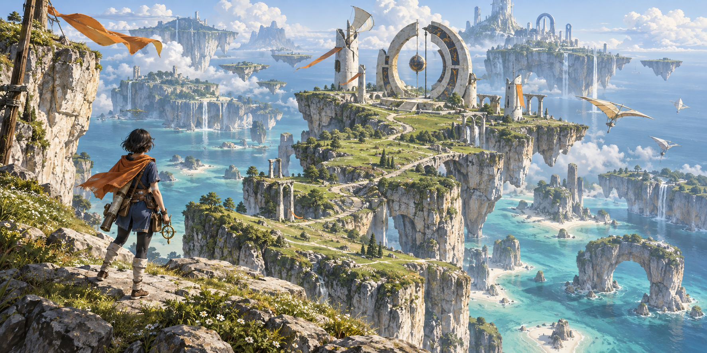
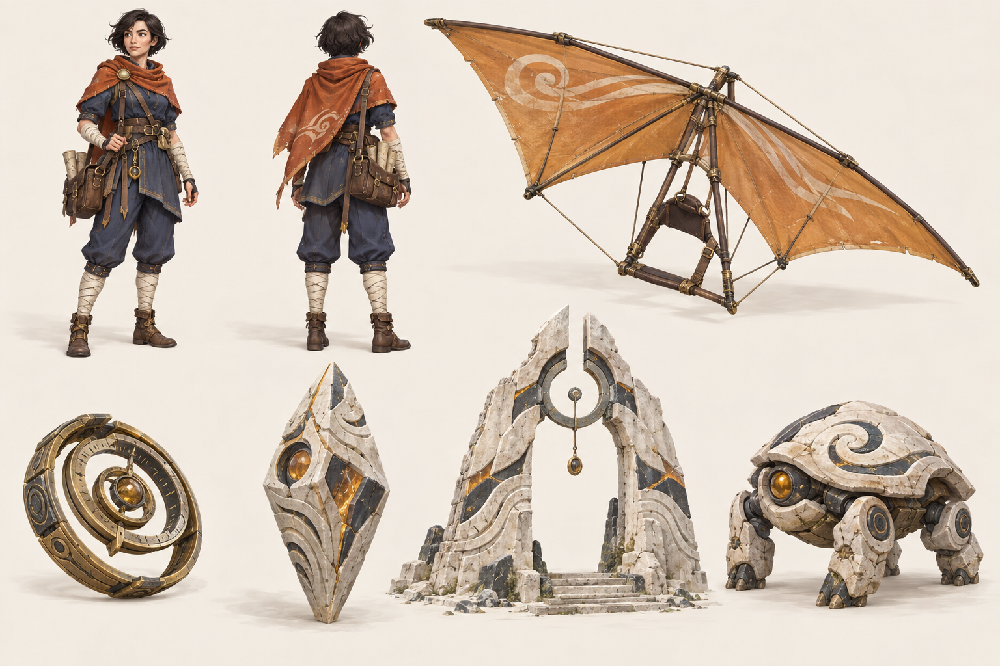

# 아트 디렉션 · 목표를 먼저 고정한다

## 목표 판





두 이미지는 **built-in image_gen으로 생성한 콘셉트 아트**다. 첫 이미지는
타이틀 배경 후보로 사용할 수 있으나 실제 게임 화면/성능 증거가 아니다.
두 번째는 모델 제작 참고이며 투명 스프라이트·텍스처 아틀라스·리깅 모델이 아니다.

## 장면을 읽는 순서

1. 전경: 황토색 망토와 검은 머리의 주인공, 층이 보이는 절벽 가장자리.
2. 중경: 실제로 이동할 길과 흰 원형 유적. 목적지를 가리는 식생은 줄인다.
3. 원경: 창백한 바다·높이가 다른 섬·밝은 구름. 공기 원근으로 깊이를 만든다.

월드 원화의 모든 배경 섬을 첫 슬라이스에 만든다는 의미는 아니다. 실제
이동 지역과 배경 경관을 기획 지도에 구분하고, 갈 수 있을 것처럼 속이는
투명 벽을 두지 않는다. 지형은 동선과 시야를 먼저 배치한 뒤 디테일을 쌓는다.

## 캐릭터·소품 불변 표식

| 대상 | 유지할 특징 | 제작 시 주의 |
|---|---|---|
| 나루 | 짧은 검은 머리, 황토 망토, 남색 탐험복, 크림색 붕대, 지도 가방 | 작은 화면에서도 망토/다리 구분, 관절과 옷 실루엣 연결 |
| 돛 | 황토 삼각 천, 목재/황동 지지대, 손으로 매달리는 횡봉 | 펼침/접힘/활공에서 손과 봉의 접점 일치 |
| 고리 | 동심 황동 고리와 나침반 중심 | 금속 광택은 절제, 조작 대상과 연결 방향 표시 |
| 프리즘 | 층진 석회암, 짙은 슬레이트, 호박색 홈 | 바닥 접지면·충돌 형상·회전 축을 보드에서 추가 정의 |
| 유적 | 끊어진 원형의 흰 석재, 중앙 매달린 바람 장치 | 입구 크기와 실제 통과 판정 일치 |
| 수호기 | 낮은 사족 실루엣, 둥근 석재 껍질, 호박색 눈 | 보드의 중립 포즈와 별도로 예고/공격/피격/정지 포즈 필요 |

보드의 장식 문양을 픽셀 단위 정답으로 삼지 않는다. 문양은 본 게임만의
반복 가능한 도형 규칙으로 정리한다. 앞/뒤 그림만으로 확정할 수 없는
측면·관절·돛 접힘은 모델 제작 때 별도 보완한다.

## 토큰

루트 `DESIGN.md`를 확인했다. 메뉴의 surface/text/focus 역할, 4px 간격,
44px 터치 영역, Pretendard 우선 본문 체계는 유지한다. **세계의 색은 게임
전용 소재 토큰**으로 정의하며 금융 P/L 색을 게임 상태에 빌려 쓰지 않는다.
아래는 구현 전 제안값이며 이미지에서 자동 추출한 수치가 아니다.

| 이름 | OKLCH 제안 | 역할 |
|---|---|---|
| `ui-surface` | `0.17 0.025 252` | 메뉴 배경, 루트 surface_0 |
| `ui-text` | `0.96 0.005 250` | 주요 텍스트, 루트 text_primary |
| `ui-focus` | `0.68 0.16 245` | 키보드 초점, 루트 primary |
| `world-chalk` | `0.91 0.025 85` | 밝은 석회암 |
| `world-slate` | `0.34 0.025 235` | 홈·유적 음영 |
| `world-sea` | `0.77 0.075 190` | 얕은 바다 |
| `world-meadow` | `0.64 0.10 125` | 풀과 능선 |
| `world-ochre` | `0.64 0.13 65` | 망토·돛·바람천 |
| `world-brass` | `0.73 0.10 85` | 장치·활성화 소재 |

UI는 의미 있는 CSS 변수, 렌더러는 같은 원장의 명명된 색 상수를 쓴다.
화면마다 hex를 직접 흩뿌리지 않는다. OKLCH를 지원하지 않는 렌더 색 입력은
빌드 시 sRGB로 변환하고 명명된 결과만 사용한다. 실제 대비는 배경 위에서 검증한다.

## HUD 목표 배치

```text
┌ 체력 / 필요할 때 기력 ─────────────── 지도 · 메뉴 ┐
│                                                  │
│         경관과 목적지 실루엣을 가리지 않는 영역     │
│                                                  │
│                      주인공                      │
│                                                  │
│ 이동 스틱       상황별 안내         시야/액션 영역 │
└──────────────────────────────────────────────────┘
```

PC에서는 스틱을 숨긴다. 메뉴 제목은 짧게, 긴 퀘스트 설명은 지도/일지로
옮긴다. 모바일 가로·세로에서 safe-area와 플랫폼 상단 도구 영역을 예약한다.
전투·도구·활공은 상황별 버튼 의미를 바꾸되 자리와 라벨을 일관되게 유지한다.

## 제작 에셋 계획 (아직 제작 전)

| 우선 | 에셋 | 규격 출발점 | 검수 |
|---|---|---|---|
| P1 | 주인공 glTF | 8~15k triangles, 1K atlas, LOD 2단 | 팔/다리/망토 겹침, 실제 카메라 실루엣 |
| P1 | 지형/절벽 모듈 | 6~10개 층리 모듈, 충돌 형상 분리 | 반복 무늬, 길/경사와 충돌 일치 |
| P1 | 유적 대표 모듈 | 원형 장치/기둥/계단, 재질 atlas | 원화 대비 비례·중경 식별 |
| P2 | 돛/고리/프리즘 | glTF, 회전축·손 접점·접지면 명세 | 조작 순간의 접촉/관통 |
| P2 | 수호기 | 4~8k triangles, 상태별 애니메이션 | 예고를 읽을 수 있는 실루엣 |
| P2 | 바람/충격/활성화 | 작은 atlas 또는 셰이더 | 과한 화면 점유·색만으로 상태 구분 금지 |
| P4 | 음향 | 발걸음/바람/돛/석재/피격/완료 | 출처·사용 범위 기록, 음량/반복 피로 |

수치는 실측 전 예산이다. **T01A에서 먼저** 도구 가용성을 확인하고 독창적
유적 소품 하나를 제작→내보내기→렌더하여 모델 생성 경로를 결정한다.
이 경로가 확인되기 전 완성 월드/캐릭터 제작에 들어가지 않는다.
외부 에셋을 검토할 경우 다른 게임 자산은 제외하고 원본 출처/라이선스/
수정 범위/비용을 기록한다. 유료 구매는 별도 결정이다.
T01B/T02B는 이미 선택한 방식의 실제 장면·캐릭터 품질을 검증하는 단계다.
현 세션이 만든 것은 이미지 2장뿐이다.

## 실제 화면 품질 게이트

T01과 T02에서 같은 구도/광원 방향으로 캡처한다. 구름/먼지로 부족한
모델을 가리지 않는다. 다음 항목을 통과/미달과 다음 조치로 기록한다.

- 전경의 캐릭터, 중경의 길, 원경의 섬이 분리되어 읽히는가?
- 돌·천·금속·풀의 재질과 명도가 구분되는가?
- 캐릭터가 움직일 때 하나의 실루엣이며 손/도구 접점이 자연스러운가?
- 실제 이동 경로가 안내 화살표 없이도 식별되는가?
- 모바일에서도 지형을 볼 공간과 충분한 조작 영역이 동시에 있는가?

미달이면 원화를 낮추지 않고 부족한 축과 제작 방식을 바꿀 비용을 기록한다.
