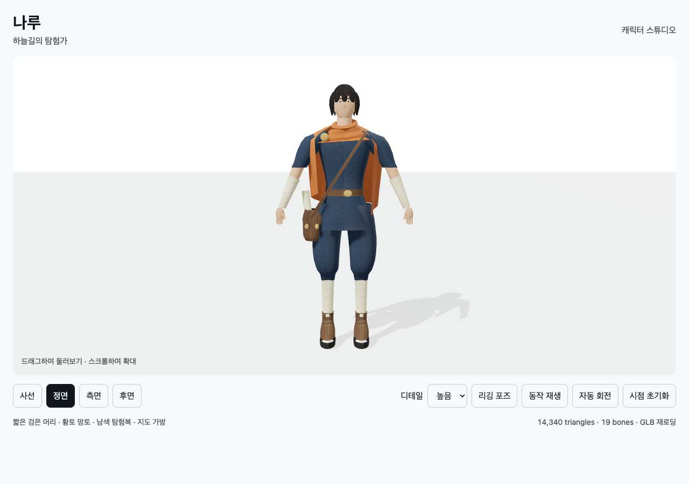

# T02B-3a · 모델 초안 검증 / 아트 REVISE

2026-09-11. 독립 클린룸 구현 후 메인 에이전트가 직접 빌드·테스트·브라우저 실행과 원화 비교를 수행했다.

```sh
node docs/specs/2026-09-10-skybound/implementation/t02b/character/build.mjs
node --test docs/specs/2026-09-10-skybound/implementation/t02b/character/tests/model.test.mjs
node docs/specs/2026-09-10-skybound/verifications/check-character.mjs 9403 http://127.0.0.1:8768/implementation/t02b/character/index.html
```

실행 결과: `Built character/viewer.bundle.js`; `tests 4 / pass 4 / fail 0`;
브라우저 `passed: 27, failed: 0, errors: []`. [원시 결과](t02b-3-browser.json).
전용 Chrome은 `scripts/cdp-chrome.sh`로 기동하고 검사 후 종료했다.

| 파일 | 삼각형 | 정점 | 크기 |
|---|---:|---:|---:|
| [LOD0 GLB](../implementation/t02b/character/assets/naru-lod0.glb) | 14,340 | 8,752 | 1,929,024 bytes |
| [LOD1 GLB](../implementation/t02b/character/assets/naru-lod1.glb) | 4,654 | 3,252 | 1,562,884 bytes |

두 파일 모두 19본·단일 메시·단일 재질·내장 1K PNG·idle/검사 클립을 포함한다.
LOD·UV·가중치·관절 변형/복원, 실제 GLB 재로드, 방향 버튼, 화면 경계, 모바일 세로,
LOD 전환과 검사 포즈를 확인했다. 테스트의 신장/삼각형 예산 검사는 미적 품질 판정이 아니다.

## 원화 비교와 수정



[후면](t02b-3-back.png) · [측면](t02b-3-side.png) · [사선](t02b-3-threequarter.png) ·
[모바일 세로](t02b-3-portrait.png) · [낮은 LOD 검사 포즈](t02b-3-lod1-pose.png)

수정 전 [정면](t02b-3-before-front.png) / [후면](t02b-3-before-back.png)을 보존했다.
어깨의 수평 단절, 목에 얹힌 막대형 스카프, 직사각 망토와 곧은 바지를 확인한 뒤
소매와 몸통 연결·닫힌 목깃·망토 외곽·무릎 위 바지 볼륨을 개선하고 동일 검사를 재통과했다.

**아트 판정: REVISE.** 색상과 소품 표식은 보이지만 원화의 자연스러운 얼굴/머리 볼륨,
겹쳐 입은 옷과 천 주름에 아직 못 미친다. 평평한 얼굴, 반복되는 톱니 앞머리,
원통형 튜닉 아래단, 단순한 망토 주름/사첼 디테일을 T02B-3b에서 우선 보완한다.
원화 목표를 낮추거나 전체 T02B-3를 완료로 표시하지 않는다.

걷기·달리기·점프·착지, 전체 관절의 관통, 게임 카메라·이동·충돌 연결,
실제 모바일 성능은 미검증이다. 현재는 플레이 가능한 캐릭터가 아닌 모델 스튜디오다.

## 검증 도구 수정

처음에는 큰 GLB Base64 수집 단계의 `Runtime.evaluate`가 시간 초과됐다.
같은 모델을 변경하지 않고 32KiB씩 수집했을 때 성공했다. 분할 수집을 유지한다.
