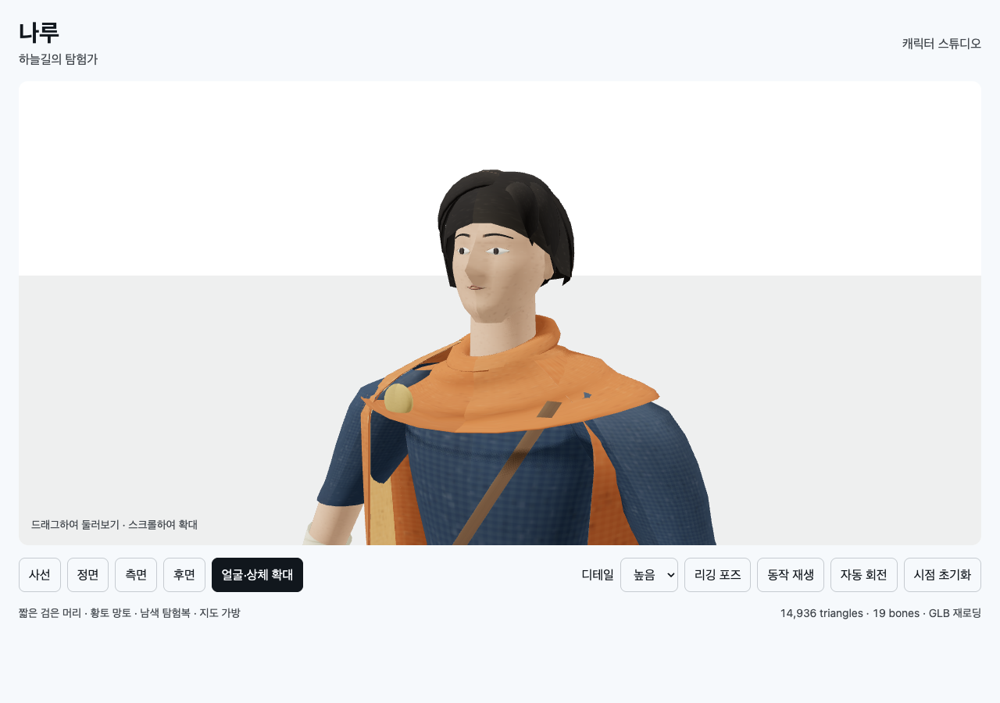

# T02B-3b · 얼굴·헤어·튜닉 보완

2026-09-11. 클린룸 구현 뒤 메인 에이전트가 직접 실행했다.

```sh
node docs/specs/2026-09-10-skybound/implementation/t02b/character/build.mjs
node --test docs/specs/2026-09-10-skybound/implementation/t02b/character/tests/model.test.mjs
node docs/specs/2026-09-10-skybound/verifications/check-character.mjs 9403 http://127.0.0.1:8768/implementation/t02b/character/index.html t02b-3b
```

출력: `Built character/viewer.bundle.js`, `tests 5 / pass 5 / fail 0`,
브라우저 `passed: 30, failed: 0, errors: []`. [원시 결과](t02b-3b-browser.json).
검증 후 전용 Chrome 프로필을 종료했다.

- 얼굴 곡면과 안와·코·입 깊이를 조정하고 눈/눈꺼풀을 표면에 맞췄다.
- 양 LOD에서 눈이 실제 얼굴 삼각형 앞에 있는지 raycast 회귀 검사를 추가했다.
- 반복되는 톱니 머리를 옆가르마 곡면으로 교체하고 두피와 머리 락의 빈틈을 줄였다.
- 원통형 튜닉을 열린 겹침 패널로 나누고 밑단의 공면 겹침을 피했다.
- 얼굴·상체 확대 보기와 전신 복귀 검증을 추가했다.

LOD0 14,936 triangles / 9,168 vertices / GLB 1,955,896 bytes.
LOD1 4,986 triangles / 3,500 vertices / GLB 1,578,764 bytes.
19본과 1K atlas 유지. 이전 버전의 캡처는 [T02B-3a 보고서](t02b-3.md)에 남아 있다.



[정면](t02b-3b-front.png) · [후면](t02b-3b-back.png) · [측면](t02b-3b-side.png) ·
[모바일](t02b-3b-portrait.png) · [LOD1 검사 포즈](t02b-3b-lod1-pose.png)

**전체 아트: REVISE.** 눈 노출, 머리 외곽, 튜닉 분리는 개선됐다.
그러나 스카프의 넓은 판형 외곽, 스트랩 관통/어깨 천 겹침, 피부·직물의 재질 표현이 남았다.
다음 T02B-3c는 천의 폭을 더 늘리는 방식 대신 목·어깨 접촉과 스트랩 앞뒤 순서를 검토한다.
원화 품질에 도달했다고 주장하지 않으며 게임 이동·걷기·점프 연결은 아직 없다.
