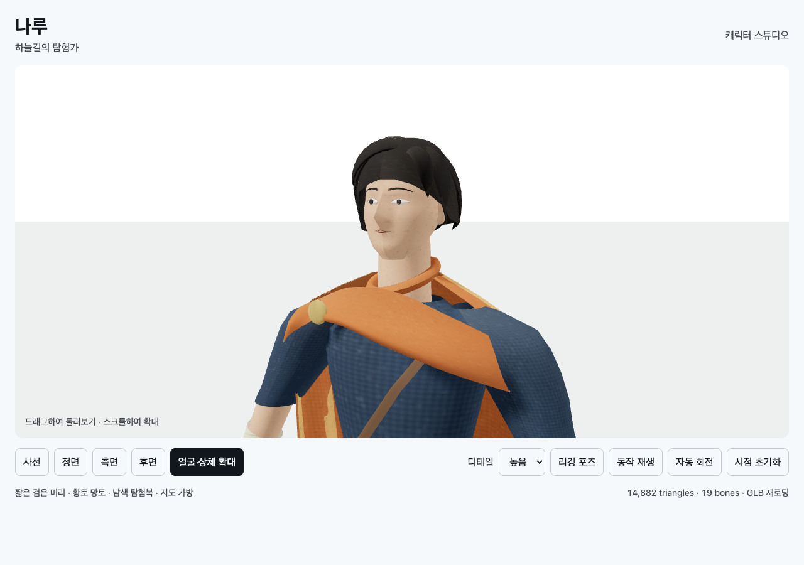

# T02B-3c · 접촉부 보완과 앞천 재조형

2026-09-11. 단위 **6/6**, 실제 브라우저 **31/31**, 런타임 오류 0. 메인 에이전트가 직접 재실행했다.

```sh
node docs/specs/2026-09-10-skybound/implementation/t02b/character/build.mjs
node --test docs/specs/2026-09-10-skybound/implementation/t02b/character/tests/model.test.mjs
node docs/specs/2026-09-10-skybound/verifications/check-character.mjs 9403 http://127.0.0.1:8768/implementation/t02b/character/index.html t02b-3c-revised
```

출력: `Built character/viewer.bundle.js`, `tests 6 / pass 6 / fail 0`,
`passed: 31, failed: 0, errors: []`. [최종 원시 결과](t02b-3c-revised-browser.json).

스트랩을 앞·어깨·뒤의 연속 경로로 만들고, 스카프/소매/스트랩의 5개 접촉 위치를
양 LOD와 rest/inspection에서 raycast로 검사했다. 이 표본 검사는 전신 관통 보장이 아니다.

첫 수정은 접촉 순서를 개선했으나 [넓은 패드형 외곽](t02b-3c-detail.png)이 남아 REVISE였다.
새 독립 창작 컨텍스트에서 대칭 둘레 loft를 대각선 앞천과 작은 어깨 접힘으로 교체했다.
접촉 검사 위치/간격은 유지하고 바뀐 표면 이름만 갱신했다.



[정면](t02b-3c-revised-front.png) · [측면](t02b-3c-revised-side.png) ·
[확대 검사 포즈](t02b-3c-revised-detail-pose.png) · [모바일](t02b-3c-revised-portrait.png)

LOD0: 14,882tri / 9,176v / GLB 1,956,004 bytes.
LOD1: 5,000tri / 3,528v / GLB 1,580,448 bytes. 19본·1K atlas 유지.

큰 대칭 패드와 스트랩 패치는 줄었지만 최종 원화 수준의 접힌 천·피부·머리 재질과
목/어깨 연결은 아직 미달이다. T02B-3 전체 아트는 미완료로 유지한다.
별도 T02B-4a에서는 검증된 rig로 걷기/달리기를 시험하고 움직임의 문제를 수집한다.
