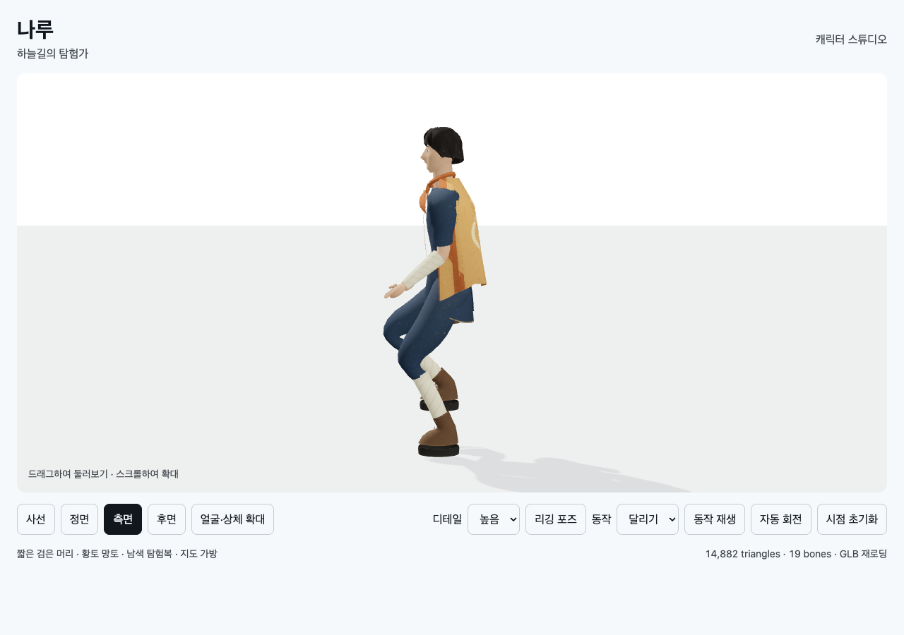

# T02B-4a · 걷기/달리기 기술 초안

2026-09-11. 메인 에이전트가 직접 실행·캡처·검토했다.

```sh
node docs/specs/2026-09-10-skybound/implementation/t02b/character/build.mjs
node --test docs/specs/2026-09-10-skybound/implementation/t02b/character/tests/*.test.mjs
node docs/specs/2026-09-10-skybound/verifications/check-motion.mjs 9403 http://127.0.0.1:8768/implementation/t02b/character/index.html
node docs/specs/2026-09-10-skybound/verifications/check-character.mjs 9403 http://127.0.0.1:8768/implementation/t02b/character/index.html t02b-4a
```

빌드 성공. 단위 `tests 10 / pass 10 / fail 0`.
동작 브라우저 `passed:21, failed:0`, 기존 뷰어 `passed:31, failed:0`, 양쪽 오류0.
[동작 원시 결과](t02b-4a-motion-browser.json) · [뷰어 원시 결과](t02b-4a-browser.json).
전용 Chrome 프로필은 검사 후 종료했다.

두 LOD GLB에 idle/검사/walk/run 클립이 보존된다. 모델의 실제 발바닥 정점으로
접지·좌우 교대·root 고정·재생/정지와 기본 자세 복귀를 확인했다.
파일 크기는 LOD0 2,013,048 / LOD1 1,637,492 bytes다.

## 시각 검사로 발견한 발목 결함

발바닥 높이 검사 통과 후 [달리기 캡처](t02b-4a-before-ankle-fix.png)에서 붕대와 부츠가 벌어졌다.
원인은 서로 rigid shin/foot으로 나뉜 가중치였다. 두 부위의 겹침 구간에 같은 전이 가중치를
적용했다. 양 LOD/두 동작의 64개 중간 위상에서 하단 wrap 실제 정점과 boot 실제 삼각형의
간격 증가가 bind 대비2mm 이내인지 새로 검사했다. 수정 전 최대17.5mm로 실패했다.



[걷기 포즈](t02b-4a-walk.png) · [모바일 뷰어](t02b-4a-portrait.png).
정적인 캡처는 동작 전체를 보여주지 않는다. 실제 뷰어의 동작 선택 후 재생 버튼으로 확인한다.

walk/run은 제자리 기술 초안이다. run의 비행 구간·발뒤꿈치/발끝 전환, 지형 적응,
실제 이동 속도와 보폭 동기화·전신 관통·게임 조작은 미완료다. 원화 아트 품질도 미통과다.
다음은 점프/착지 클립, 이후 T02A 이동 snapshot 연결이다.
