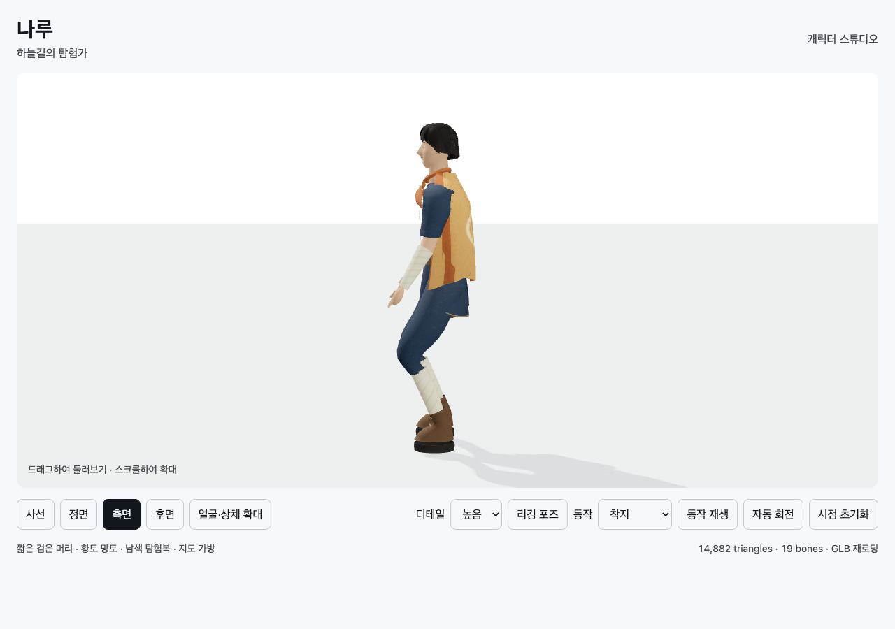

# T02B-4b-1 · 점프·낙하·착지 포즈

2026-09-11. 메인 에이전트 직접 실행 결과:

- `node --test docs/specs/2026-09-10-skybound/implementation/t02b/character/tests/*.test.mjs`: **tests13 / pass13 / fail0**.
- `check-aerial.mjs 9403 <viewer URL>`: **24 passed / 0 failed**, 종료·재재생 포함.
- `check-motion.mjs 9403 <viewer URL> t02b-4b1`: 기존 보행 **21/21**.
- `check-character.mjs 9403 <viewer URL> t02b-4b1`: 기존 뷰어 **31/31**.
- `node implementation/t02b/character/build.mjs`(spec 폴더 기준): `Built character/viewer.bundle.js`.

viewer URL: `http://127.0.0.1:8768/implementation/t02b/character/index.html`.
검증 스크립트는 이 문서와 같은 폴더에 있다. 전용 Chrome 검사 후 종료했다.

[공중동작 원시 결과](t02b-4b1-aerial-browser.json) · [보행 회귀](t02b-4b1-motion-browser.json) ·
[뷰어 회귀](t02b-4b1-browser.json)

jump/land는 일회재생 후 끝 자세를 유지하고 종료한다. fall은 반복한다.
끝 시각이 처음으로 돌아가지 않는지, 종료 후 다시 재생 가능한지, reset이 idle로 복귀하는지 검사했다.
양 LOD에서 발바닥의 실제 정점 높이, root 원점 유지, 착지 마지막의 bind복귀를 확인했다.

[점프 포즈](t02b-4b1-jump.png) · [낙하 포즈](t02b-4b1-fall.png).
이것은 제자리 포즈 검증이며 실제 공중 이동 캡처가 아니다.

GLB LOD0 2,096,808 bytes / LOD1 1,721,252 bytes. 기존 클립과 함께 7개 클립 보존.
실제 지형/이동/입력 연결, 전환 블렌딩, 다양한 낙하 높이, 의상 전체 관통과 최종 아트는 미검증이다.
다음 T02B-4b-2에서 T02A의 위치·수직속도·접지 상태와 연결한다.
