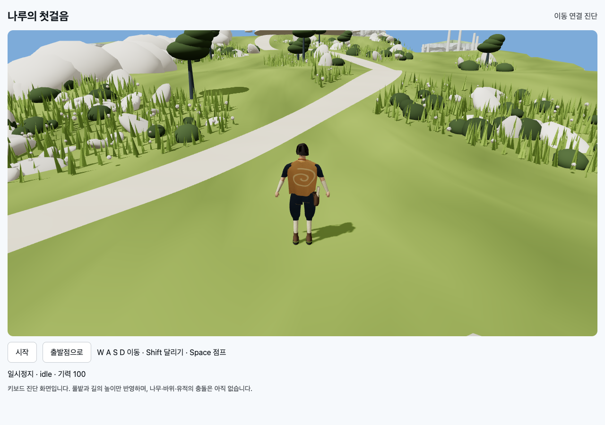

# T02B-4b-2 · 실제 섬과 캐릭터 이동 연결

메인 에이전트 직접 검증 결과: 전환 어댑터 **3/3**, 이전 순수 이동 **11/11**, 실제 브라우저 **19/19**, 오류0.

```sh
node docs/specs/2026-09-10-skybound/implementation/t02b/traversal/build.mjs
node --test docs/specs/2026-09-10-skybound/implementation/t02b/traversal/tests/*.test.mjs
node --test docs/specs/2026-09-10-skybound/implementation/t02a/tests/*.test.mjs
node docs/specs/2026-09-10-skybound/verifications/check-traversal.mjs 9403 http://127.0.0.1:8768/implementation/t02b/traversal/index.html
```

빌드 출력 `Built traversal/viewer.bundle.js`.
브라우저 출력 `passed:19, failed:0, errors:[]`. [원시 결과](t02b-4b2-browser.json).

- 기존 섬 초원/길의 실제 world-space 삼각형으로 접지.
- 걷기/달리기의 실제 위치 변화와 동작 일치, root와 simulation 발 위치 일치.
- 점프 높이·상승/낙하/착지/idle 전환과 궤적 전체 root 추적.
- CDP 실제 W 키 입력으로 이동, blur 후 tick 정지.
- 변경은 새 traversal/ 연결 파일이며 기존 월드/이동/캐릭터 원본은 수정하지 않았다.



처음 긴 동기 렌더 묶음에서 CDP timeout이 발생해 작은 묶음으로 나눴다.
키입력의 고정150ms 대기는 소프트웨어 렌더 시간에 영향을 받아 위치변화 조건 대기로 바꿨다.
성능 벤치마크 통과를 의미하지 않는다. 검증 후 전용 Chrome은 종료했다.

현재 PC 진단 프로토타입: 시작→WASD 이동, Shift 달리기, Space 점프.
터치/시야회전/경사 발IK/캡슐·나무·바위·유적·카메라 충돌은 미구현이다.
캐릭터 root 접지 검증은 발바닥 모든 정점이 경사면에 일치한다는 보장이 아니다.
최종 아트와 완결 게임은 미완료이며 다음은 T02C 정식 입력·시야다.
