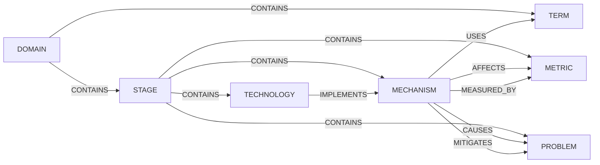

# Specification: 개념 온톨로지 (concept ontology)

> 구현 반영 (2026-09-24). 착수 중 확인한 사실로 고쳤다 — 호스트는 atlas 파드, `concept_edge` 는 표 전체를 파일이 소유(첫 적용의 유령 루트 방지), 전환은 12건(`context/migration-diff.md` 가 정답), 도식 도구는 파서 사본을 두지 않으려 gradle 태스크, 스펙 예시의 「빈 색인 라이브」는 실제 사고대로 「덜 찬 색인 라이브」.
> 개정 4 (2026-09-24). 3차 리뷰(방향 승인 — P1 1 · P2 2 · 문구 2)를 반영했다. 파생물 sync 에 파드 간 단일 실행 리스와 대상 해시 고정·교체 직전 재확인·수렴 재실행을 넣고,
> `content_hash` 계산 규칙을 고정하고, id 이동은 참조 실측(0건)으로 정책을 확정했다.
> 개정 3 (2026-09-24). 2차 리뷰(REVISE — P1 2 · P2 2 · 문구 4)를 반영했다. 적용 단위를 **manifest 전체**로 통일하고(파일별 revision 폐기, 상태 행 하나가 잠금·이력·파생물 기록을 겸한다),
> DB 적용과 파생물(캐시·색인) 갱신을 분리해 실패를 기억하고 재시도하며, kind 경계 사례 넷의 배치를 확정했다. 개정 2 는 커밋 `38098ece`, 개정 1 은 `5d05472e`.
> 현행 `concept_edge`(플랜 `docs/plans/2026-09-09-search-architecture-graph.md` §3) 위에 얹는다. 외부 제안과의 대조는 §9, 운영 실측은 §0.

## Goal

검색·백엔드 도메인 개념을 **노드 유형과 관계 어휘가 고정된 방향 그래프**로 적는다.
레포 안 파일 묶음(manifest)이 원본이고, 도메인 클래스가 공리를 검사하고, 로더가 검증된 상태를 운영 DB 에 **그대로 유지**하며, `/tech` 계층 탭과 문서 도식이 같은 파일에서 나온다.
새 저장소·새 파드·새 페이지는 없다. 온톨로지의 **논리 모델**(유형·관계·공리)만 가져오고 기술 스택(RDF·OWL·그래프 DB)은 가져오지 않는다.

## 0. 현재 위치 (운영 DB, 2026-09-23)

| 항목 | 값 |
|---|---|
| 개념 행 | 261 |
| 방향 간선 | 145 (CONTAINS 127 · FLOWS_TO 18 · SAME_AS 0) |
| 간선에 걸린 개념 | 102 (전부 검색 도메인, V22~V24) |
| 어느 간선에도 없는 개념 | 159 (재색인 추출분) |
| 두 부모를 가진 개념 | 26 — 그중 22 는 「장치가 용어를 쓴다」를 CONTAINS 로 적은 것 |
| 코드 참조(`concept_index`) | 0 |
| 관계 탭의 원천 `concept_relation` | 0 — 관계 모드는 운영에서 빈 그래프다 (이 스펙 밖, §8) |

지금 모델이 온톨로지가 아닌 이유 셋: 노드에 **유형이 없고**(층은 깊이로만 유도되어 용어 사전 가지가 장치와 같은 층에 놓인다),
CONTAINS 가 **구성·변종·사전 등재·사용** 네 뜻을 겸하고, 원본이 **불변 마이그레이션**이라 간선 하나를 고치려면 번호가 하나 는다(열흘에 V22→V24).

## User Stories

- 학습자로서, 개념 하나를 열면 그것이 어느 층에 있고, 무엇을 쓰고, 무엇에 영향을 주고, 무엇으로 재는지를 한 화면에서 보고 싶다.
- 저자로서, 도메인 하나를 파일 하나로 적고 PR diff 로 리뷰하며, 잘못된 간선은 테스트가 막아 주길 원한다.
- 운영자로서, 파일을 바꾸고·지우고·배포가 실패하고·롤백한 뒤에도 DB 가 검증된 상태 중 하나이길 원한다.
- 독자로서, 블로그·플랜의 계층 도식이 손으로 옮긴 사본이 아니라 파일에서 나온 것이길 원한다.
- 나중의 나로서, 둘째·셋째 도메인(트랜잭션·메시징)을 같은 규칙으로 붙이고 싶다.

## Specific Requirements

### SR-1 노드 유형(kind) 7종

`concept.kind` 한 컬럼. 값은 아래 일곱으로 고정하고 여덟째는 이 스펙 개정으로만 는다.

| kind | 판정 질문 | 예 (현행 id) |
|---|---|---|
| `DOMAIN` | 무엇이 들어오나 — 루트와 진입점 | `search-system` · `search-ingest` · `search-query` · `search-evaluation` |
| `STAGE` | 무엇을 하나 — **활동** | `query-understanding` · `candidate-generation` · `rank-fusion` · (이동) `search-ops-monitoring` · (신설) `judgment-set-building` |
| `MECHANISM` | 무엇으로 하나 — 시스템이 **실행·설정하는 것** | `bm25` · `hnsw` · `rrf` · `alias-swap` · `propensity-logging` · `viterbi-algorithm` |
| `TERM` | 이해에 필요한 **이름** — 자료구조·값·정의·산출물 | `lattice` · `word-cost` · `context-id` · `cosine-similarity` · `judgment-set` · `search-glossary` |
| `TECHNOLOGY` | 이름 붙은 구체물 — 제품·라이브러리·사전·말뭉치 | `mecab-ko-dic` · `sejong-corpus` · (신규) `opensearch` · `nori` |
| `PROBLEM` | 피하려는 상태 | `position-bias` · (신규) `partial-index-live` · `page-cache-eviction` |
| `METRIC` | 재는 값 | `ndcg` · `recall-precision` · `latency-percentile` · `fallback-rate` · `judgment-coverage` |

**경계 규칙** — kind 는 **개념 자체의 성격**으로만 판정한다. 어디에 소개되는가는 배치(CONTAINS)와 USES 가 표현하고 kind 를 바꾸지 않는다.

- MECHANISM 과 TERM 의 경계: 시스템이 **돌리거나 고르는 것**(알고리즘·절차·모드·파라미터 세트)이면 MECHANISM, **알아야 읽히는 이름**(구조·값·정의·산출물)이면 TERM. 격리 수준은 고르는 모드라 MECHANISM.
- STAGE 는 활동이다. 산출물과 묶음은 STAGE 가 아니다.
- **TERM 의 자리는 용어 사전 가지뿐이다.** TERM 의 CONTAINS 부모는 정확히 하나(사전 묶음 또는 TERM 묶음)이고 — `<domain>-glossary` 가지의 뿌리만 예외로 부모가 DOMAIN 루트다 —, 단계·장치가 용어를 쓰면 USES 다. 용어 사전 가지에는 TERM 만 둔다 — 장치로 판정된 것은 사전에서 빼고 장치 트리에만 둔다(검색창·동의어로 닿고, 그것이 쓰는 용어들이 USES 로 역참조되어 보인다).
- TECHNOLOGY 는 그것이 구현하는 단계·장치 **아래에 놓인다**(CONTAINS). 층 번호가 아니라 배치된 자리다 — DOMAIN·STAGE 가 중첩하므로 고정된 「넷째 층」은 없다. 장치 단위 구현은 `IMPLEMENTS` 로 잇고, 부모를 다시 IMPLEMENTS 로 적지 않는다.
- `category`(주제 13종)와 `level`(난이도)은 그대로 둔다. kind 는 역할 축이라 둘과 직교한다 — `bm25` 는 category ALGORITHM · kind MECHANISM.
- 외부 제안의 여덟 유형에서 `Pattern` 은 MECHANISM 에, `Solution` 은 MECHANISM + `MITIGATES` 간선에, `Example` 은 증거층(SR-5)에 흡수했다. 역할은 간선이 진다.

**경계 사례 확정** — 현행 데이터에서 규칙과 부딪히는 넷은 이렇게 놓는다(이관 목록의 「이동·신설」).

| 개념 | 판정 | 배치 |
|---|---|---|
| `viterbi-algorithm` 비터비 | MECHANISM(분석기가 돌린다) | CONTAINS 부모는 `lattice-viterbi` 하나. 사전(`glossary-morphology`)에서 뺀다. 격자·단어 비용·연접 비용·문맥 ID 는 TERM 으로 사전에 남고 `lattice-viterbi` 가 USES |
| `search-ops-metrics` 운영 지표 · `offline-metrics` 오프라인 지표 | 묶음이 아니라 활동 → STAGE. **의미가 바뀌므로 이름 변경이 아니라 새 개념** | **새 id** `search-ops-monitoring`(운영 관측) · `offline-evaluation`(오프라인 평가)을 만들고 옛 행은 관리 해제 뒤 어드민 삭제. 옛 id 를 가리키는 행은 `service_concept`·`tech_domain_concept`·`concept_index`·블로그 본문 모두 0건(2026-09-24 실측)이라 참조 이전·리다이렉트는 만들지 않는다. METRIC 자식은 새 STAGE 아래로 |
| `judgment-set` 판정 세트 | 산출물과 활동을 가른다 | 산출물 `judgment-set` 은 **id 를 유지한 채 TERM**(쿼리·문서·등급 삼중항 집합) 으로 `glossary-learning` 아래. 활동 `judgment-set-building`(판정 세트 구축) 은 **STAGE** 로 신설 — 풀링은 그 아래 MECHANISM, 커버리지는 METRIC. 등급 척도는 TERM 으로 사전에 두고 STAGE 가 USES. `offline-evaluation` 이 `judgment-set` 을 USES |
| `lattice-viterbi` 의 TERM 자식들 | 장치가 용어를 품을 수 없다 | 자식 CONTAINS 를 USES 로(둘째 부모 전환과 같은 전환) |

**관리 표시** — `concept.managed_by VARCHAR(40) NULL`: 이 개념을 관리하는 온톨로지 파일의 도메인. `kind` 와 `managed_by` 는 **로더만 쓴다**.
둘 다 NULL 이면 「미배치」다. 재색인이 추출한 159 개념은 NULL 로 남고 파일에 들어올 때 채워진다. **배치율 = managed_by 있는 개념 ÷ 전체**가 진척 지표다.

**쓰기 경로** — 개념을 바꾸는 경로는 `/api/v1/concepts` 의 `PUT /{id}`·`DELETE /{id}`(어드민 CRUD, `ConceptService.update/delete`)뿐이다.
`/api/v1/index/sync` 는 DB 를 읽어 OpenSearch 에 적재할 뿐 개념을 바꾸지 않는다(개정 1 의 「sync 가 `Concept.update()` 를 부른다」는 틀렸다).
**managed_by 가 있는 개념의 PUT·DELETE 는 409 CONFLICT** 다. 검사는 컨트롤러가 아니라 도메인 유스케이스에 둔다 — `Concept.update()` 가 managed 면 거부하고, 삭제 유스케이스가 같은 검사를 한다. 어드민 화면이 아니라 파일과 PR 이 편집기다.

### SR-2 관계 어휘 9종

현행 CONTAINS·FLOWS_TO 는 뜻을 좁히고, SAME_AS 는 빼고, 일곱을 더한다. 관계마다 **허용 (from kind → to kind)** 가 있고 그 밖은 SR-3 이 거부한다.

| 관계 | 방향 | 역방향 라벨 | 허용 범위 | 답하는 질문 | 현행 데이터의 자리 |
|---|---|---|---|---|---|
| `CONTAINS` | 상위 → 하위 | PART_OF | DOMAIN→{DOMAIN, STAGE, TERM} · STAGE→{STAGE, MECHANISM, METRIC, PROBLEM, TECHNOLOGY} · MECHANISM→{MECHANISM, TECHNOLOGY} · TERM→{TERM} | 어디에 속하나 · 무엇으로 이뤄지나 | 기존 127건에서 전환·이동 반영, 뜻은 **구성·배치**로만 |
| `FLOWS_TO` | 앞 → 뒤 | FOLLOWS | CONTAINS 부모를 하나 이상 공유하는 형제, kind 무관 | 다음 단계는 | 18건 유지 |
| `USES` | 쓰는 쪽 → 쓰이는 것 | USED_BY | {STAGE, MECHANISM}→{TERM, MECHANISM, TECHNOLOGY} | 무엇을 쓰나 · 어디에 쓰이나 | 용어의 둘째 부모와 `lattice-viterbi` 의 TERM 자식 — **CONTAINS → USES 12건** (`context/migration-diff.md`). 나머지 둘째 부모는 경계 규칙상 MECHANISM 이라 사전에서 빠졌다 |
| `IMPLEMENTS` | 구체물 → 개념 | IMPLEMENTED_BY | TECHNOLOGY→{STAGE, MECHANISM} | 무엇으로 구현했나 | 신규 — `nori` → `lattice-viterbi`·`user-dictionary` |
| `AFFECTS` | 원인 → 지표 | AFFECTED_BY | {MECHANISM, TERM, TECHNOLOGY}→METRIC | 값을 바꾸면 무엇이 달라지나 | 신규 — `hnsw-parameters`→`recall-precision` |
| `CAUSES` | 원인 → 문제 | CAUSED_BY | {MECHANISM, TERM, TECHNOLOGY, PROBLEM}→PROBLEM | 무슨 문제를 부르나 | 신규 — `index-rebuild`→`partial-index-live`(2026-09-22 벌크 도중 OOM 에도 별칭이 넘어가 45,535/59,735건 라이브) |
| `MITIGATES` | 장치 → 문제 | MITIGATED_BY | MECHANISM→PROBLEM | 그 문제를 무엇이 막나 | 신규 — `reindex-count-gate`→`partial-index-live`(별칭 교체만으로는 못 막는다 — 건수·오류율 게이트) |
| `MEASURED_BY` | 대상 → 지표 | MEASURES | {STAGE, MECHANISM, PROBLEM}→METRIC | 무엇으로 재나 | 신규 — `rank-fusion`→`ndcg` |
| `ALTERNATIVE_TO` | 대칭 | — | 같은 kind 의 MECHANISM · TECHNOLOGY | 대신 쓸 수 있는 것 | 신규 — 스파스↔덴스, `interleaving`↔`ab-test` |

유형 사이에 허용된 관계를 한 장으로 보면 아래와 같다. FLOWS_TO 는 유형을 가리지 않아 뺐고, ALTERNATIVE_TO 는 같은 유형 안에서만 성립한다.



- **SAME_AS 를 뺀다.** 운영 0건이고 표기 차이는 `concept_synonym` 이 이미 든다. 재색인이 같은 개념을 다른 id 로 만들면 간선이 아니라 **id 를 합친다**. enum 값 삭제는 읽는 행이 없어 안전하다.
- `AFFECTS` 와 `CAUSES` 는 **range 로 가른다**: 지표(값)를 바꾸면 AFFECTS, 문제(상태)를 부르면 CAUSES.
- 대칭 관계(ALTERNATIVE_TO)는 **한 방향만 저장**하고 역방향 라벨은 코드(`ConceptEdgeKind.inverseLabel`)가 만든다. `relation_type` 표는 만들지 않는다 — range 검사가 코드에 있어야 하므로 표는 사본이 된다.
- **`concept_edge.reason VARCHAR(500) NULL`** — 관계의 「왜」와 **적용 조건**(방식·측정 범위·방향)을 한 줄에. 「32× ↓」가 아니라 「1-bit BBQ, 관광지 색인 한 벌 기준 상주 32× ↓」. 조건 없는 인과 간선은 리뷰에서 돌려보낸다.
- **`concept_edge.evidence_ref VARCHAR(300) NULL`** — 간선이 근거 하나를 가리킨다. 형식은 `concept_evidence.ref`(SR-5)와 같다(ADR 파일명·글 slug·기록 페이지·측정 한 줄). 같은 노드의 AFFECTS 두 줄이 다른 근거를 갖는 경우가 이것을 필요로 한다. 근거 둘 이상이 **세 번째** 나오면 조인 표로 뺀다.
- `confidence`·`scope` 는 **이번 범위에서 모델링하지 않는다.**
- `IS_A` 는 **이번 범위에서 모델링하지 않는다.** category 가 대신한다고 말하지 않는다 — 그러면 처음에 풀려던 관계 의미 혼합이 되돌아온다.
- `REQUIRES`(선수 지식)는 보류한다. CONTAINS 깊이 순 + FLOWS_TO + USES 역방향으로 **탐색 순서**는 만들 수 있지만 그것이 **선수 지식을 보장하지는 않는다** — 둘은 별개다. 보장이 필요해지는 시점에 REQUIRES 가 들어오고, 그때까지 화면은 「탐색 순서」라고만 부른다.
- `TRADEOFF_WITH` 는 AFFECTS 두 줄 + reason 으로 적는다. `DEPENDS_ON`·`EXECUTED_ON`·`STORED_IN`·`HAS_PARAM` 은 USES 다. `MAY_CAUSE`(가능성)·`PREVENTS`(예방)·`CONTRASTS_WITH`(비교)는 CAUSES·MITIGATES·ALTERNATIVE_TO 와 **다른 주장이지만 이번 범위에서 구분하지 않는다** — 가능성·조건은 reason 에 적는다. `EXAMPLE_OF` 는 증거층이다.

### SR-3 공리 — `ConceptOntology.validate()` (도메인, 프레임워크 의존 없음)

manifest 의 파일 전부를 합집합으로 받아 아래를 검사하고 위반을 **전부** 모아 던진다(첫 하나에서 멈추지 않는다). 메시지는 `[규칙번호] <concept_id> …` 꼴.

| # | 규칙 | 막는 사고 |
|---|---|---|
| ① | `concept_id` 는 전 파일에 걸쳐 유일. 간선 양 끝은 합집합에 있는 개념. manifest 의 도메인 목록과 실제 파일 집합이 같다 | 오타 간선이 조용히 빠짐 · 파일에서 뺀 개념을 남이 가리킴 · 목록에 없는 파일 |
| ② | 파일의 모든 개념에 kind 가 있고, 간선 양 끝에 kind 가 있다 | 미배치 개념에 간선이 걸려 range 검사가 빈다 |
| ③ | (from.kind, to.kind) 가 그 관계의 허용 범위 안 | TERM 이 장치를 CONTAINS, TECHNOLOGY 가 METRIC 을 MITIGATES |
| ④ | CONTAINS 비순환 | 층 계산 무한 루프·깊이 오류 |
| ⑤ | 파일당 루트 하나(DOMAIN, CONTAINS 부모 없음). 그 외 모든 개념은 CONTAINS 부모 ≥ 1. **TERM 은 정확히 1** — `<domain>-glossary` 가지의 뿌리만 예외(부모는 DOMAIN 루트) | 고아 — 트리 뷰에서 사라진다 · 용어의 두 부모 |
| ⑥ | FLOWS_TO 양 끝이 CONTAINS 부모를 하나 이상 공유 | 층을 건너뛰는 화살표 |
| ⑦ | ALTERNATIVE_TO 는 한 방향만. 자기 자신 간선 금지(현행) | 역방향 유도와 이중 저장 충돌 |
| ⑧ | 같은 (from, to) 에 CONTAINS 와 USES 를 함께 걸지 않는다 | 「두 부모 위장」 재발 |

테스트 수준 규칙 ⑨: 모든 관계 kind 가 **실제 파일 합집합**에서 최소 1회 쓰인다 — 정의만 있는 어휘를 두지 않는다. fixture 로 옮기면 이 규칙의 목적(어휘 팽창 방지)이 사라지므로 실제 파일 기준을 유지한다.
비용을 받아들인다: 어느 관계의 마지막 사용 사례를 지우면 enum 도 같이 개정한다. **통과시키기 위한 간선은 만들지 않는다** — 리뷰에서 거부한다. SAME_AS 를 뺀 이유가 이 규칙이다.

**게이트 증명**: 규칙 ①~⑧ 각각에 위반 입력 하나를 넣어 빨간불을 보는 도메인 테스트가 있어야 「검사한다」고 말한다.

### SR-4 원본 = 레포 파일 묶음(manifest), 그리고 적용 계약

#### 4.1 파일

경로 `code-dictionary/feature/src/main/resources/ontology/`. `manifest.yaml` 하나와 도메인 파일 `<domain>.yaml` 들. 첫 도메인 파일은 `search.yaml`.
jar 에 실려 부팅 때 읽히므로 이 경로가 원본이고 `docs/` 에 사본을 두지 않는다.

```yaml
# manifest.yaml — 온톨로지 전체의 단일 revision. 어느 파일이든 바꾸면 여기를 올린다
revision: 1
domains: [search]          # 실제 파일 집합과 같아야 한다 (규칙 ①)
```

```yaml
# search.yaml — 파일 하나 = 도메인 하나 = 루트 하나. 파일별 revision 은 없다
domain: search
root: search-system
concepts:
  - id: rank-fusion
    kind: STAGE
    name: 융합
    category: ALGORITHM
    level: INTERMEDIATE
    description: 순위로 합친다. 점수 스케일이 달라 점수로는 못 섞는다
    synonyms: [rank fusion]
    contains: [rrf]                # 순서가 ordinal
    flows_to: [post-processing]
    measured_by:
      - to: ndcg
        reason: 융합 결과의 상위 10 을 등급 판정으로 잰다
        evidence: msa-search-hierarchy-and-eval-fixes-record
  - id: vector-quantization
    kind: MECHANISM
    # …
    affects:
      - { to: search-node-memory, reason: "1-bit(encoder sq, bits 1)면 벡터 상주 크기가 float32 대비 1/32 — 관광지 색인에 적용", evidence: msa-opensearch-memory-and-quantization-record }
      - { to: recall-precision, reason: "↓, rescore·오버샘플로 되찾는다 — 관광지 판정 세트 nDCG 기준", evidence: msa-search-learning-roadmap-record }
    mitigates: [{ to: page-cache-eviction, reason: "색인 한 벌이 작아져 anon 이 캐시를 밀어내지 못한다" }]
```

- 관계 키는 관계 kind 의 소문자. 값은 `id` 또는 `{to, reason, evidence}`. 간선은 **from 노드에만** 적고 ALTERNATIVE_TO 는 어느 한쪽에 한 번.
- **적용 단위는 manifest 전체**다. 검증·적용·건너뛰기·관리 해제·도메인 삭제는 모두 manifest 단위로 한다. 파일별 버전 조합을 관리하지 않는다 — 「검색 3 + 추천 2」처럼 검증하지 않은 조합이 DB 에 남는 길을 없앤다.
- **`content_hash` 계산 규칙**: manifest 와 도메인 파일을 **경로순으로 정렬**해 각 경로·길이·파일 바이트를 이어 SHA-256 으로 계산한다. 주석·공백 변경도 해시가 바뀌므로 revision 증가 대상이다. 파일 열거 순서에 따라 해시가 달라지지 않는다 — 같은 revision 의 다른 해시를 오류로 다루므로 입력이 구현마다 달라서는 안 된다.

#### 4.2 소유와 관리 해제

- 파일이 나열한 개념의 `name·kind·category·level·description·synonyms` , 근거·질문(SR-5)은 파일이 이긴다. **`concept_edge` 는 표 전체를 파일 묶음이 소유한다** — 간선을 쓰는 곳은 V22~V24 시드와 로더뿐이라 로더가 표를 통째로 교체한다. 「나열된 개념의 나가는 간선만」 교체하면 첫 적용 때 파일에서 빠진 옛 개념(지표 묶음)의 나가는 간선이 남아 유령 루트가 된다. 로더가 `managed_by = <domain>` 을 찍는다.
- **관리 해제**: 로더는 「DB 에서 `managed_by IS NOT NULL` 인 개념 집합 − manifest 전체의 개념 집합」을 계산해, 빠진 개념의 `kind`·`managed_by` 를 NULL 로, 나가는 간선·근거·질문을 지운다. **개념 행은 남긴다** — `concept_index`·`service_concept` 가 값으로 참조한다. 들어오는 간선은 규칙 ① 이 파일 검증에서 잡는다.
- **도메인 삭제**(manifest 의 목록과 파일에서 함께 빠짐)도 같은 절차이고, **더 높은 manifest revision 에서만** 일어난다. 옛 이미지에 새 도메인 파일이 없어도 revision 이 낮으므로 아무것도 해제하지 않는다.
- 개념 행 삭제는 어드민 API 로 하되, managed 인 동안은 409 다(SR-1). 관리 해제 뒤에만 지울 수 있다.

#### 4.3 적용 계약 — 파일에서 검증한 상태가 운영 DB 에도 남게

| # | 계약 | 왜 |
|---|---|---|
| ① | **읽기 관대화가 먼저 배포된다.** `ConceptEdgeJpaEntity.kind` 는 문자열로 들고, `toDomain()` 은 모르는 값을 경고 로그 후 제외한다. 이 변경과 enum 9종을 담은 배포(S1)가 먼저 나가고, 새 관계 데이터를 쓰는 로더(S2)는 그 다음 배포다. **지원하는 롤백 하한은 S1** 이다 | atlas 파드는 롤링(maxSurge 1)이라 새 파드가 USES 를 쓰는 동안 옛 파드가 `Enum.valueOf` 로 죽어 계층 API 가 500 이 된다. 롤백도 같은 구멍 |
| ② | **상태 행 하나** `ontology_state(id=1, revision, content_hash, applied_at, app_version, derived_hash, derived_at, sync_owner, sync_lease_until, sync_target_hash)` — **최신 적용 상태**이지 과거 이력이 아니다. **마이그레이션이 만들어 두고 항상 존재한다.** 로더는 이 행을 `FOR UPDATE` 로 먼저 잠근 뒤 revision 을 다시 읽어 적용 여부를 정한다 — manifest revision 이 DB 보다 **작으면 건너뛰고 경고**, 같고 해시가 같으면 건너뛰고, 같은데 해시가 다르면 **오류**(revision 을 안 올린 것), 크면 적용 | 옛 이미지(옛 파일)를 재기동해도 데이터가 되돌아가지 않는다. 최초 부팅·신규 도메인·전체 삭제도 같은 행에서 직렬화된다 — 없는 도메인 행에는 잠금이 걸리지 않는다. 동시에 뜨는 파드는 뒤가 같은 revision 을 보고 건너뛴다 |
| ③ | **단일 트랜잭션.** manifest 전체를 읽어 합집합을 검증한 뒤 온톨로지 전체를 한 트랜잭션으로 적용하고 `revision`·`content_hash` 를 기록한다. 실패하면 전체 롤백, error 로그, **기동은 계속** | 도메인별 커밋이면 검색 적재만 실패하고 추천 적재가 성공해 검증하지 않은 조합이 남는다. 호스트 생존과 부분 커밋은 별개 결정이다 |
| ④ | **파생물 갱신은 DB 적용과 분리해 기억하고 재시도하며, 파드 간 단일 실행이다.** DB 커밋 뒤 `conceptCategoryStats` 캐시를 비우고 OpenSearch 개념 색인 sync 를 돌린다. sync 는 수동 `/api/v1/index/sync` 경로를 포함해 상태 행의 **리스**(`sync_owner`·`sync_lease_until`, 만료된 리스는 탈취)를 잡은 쪽만 돈다. 잡은 **시작 때 대상 `content_hash` 를 고정**(`sync_target_hash`)하고, 별칭 교체 직전에 현재 해시를 다시 읽어 다르면 만든 색인을 버리고 최신으로 다시 돈다. 성공하면 **고정했던 해시만** `derived_hash` 에 적는다. 완료 뒤 현재 해시와 다르면 재실행하고, 실패는 제한된 backoff(3회)로 재시도한 뒤 다음 부팅에 맡긴다. 부팅 때 `content_hash ≠ derived_hash` 면 적용은 건너뛰어도 evict 와 sync 를 다시 돌린다. DB 적용 트랜잭션은 외부 IO 동안 잡지 않는다 — 적용 잠금과 sync 조정은 별개다 | sync 잡 등록부는 프로세스 안 `ConcurrentHashMap` 이라 파드가 죽으면 사라지고, 다음 부팅은 같은 해시라 적용을 건너뛰어 색인이 영영 옛 상태로 남는다. 롤링 창에서 겹친 두 파드가 각각 sync 를 띄우면 늦게 끝난 옛 sync 가 별칭을 옛 색인으로 되돌린다. 완료 시점의 현재 해시를 적으면 옛 내용을 색인하고 최신 완료로 기록한다. 「잡을 제출했다」는 로그는 반영 완료의 증거가 아니다 |
| ⑤ | **캐시 범위.** 캐시는 Caffeine 로컬이고 atlas 파드는 replicas 1 이라 in-process evict 로 충분하다. 레플리카를 늘리면 다른 파드는 캐시 TTL 이 상한이 되고, 그때 캐시 키에 `revision` 을 섞어 자연 무효화한다 | 로컬 캐시의 무효화 방법은 배포 형태에 묶여 있다 — 지금 값과 조건을 적어 둔다 |
| ⑥ | **쓰기 경로 잠금.** managed 개념의 PUT·DELETE 는 409 (SR-1) | 어드민이 고친 값이 다음 부팅까지 파일과 다르다 |
| ⑦ | 두 번째 부팅의 변경 수는 0 (②의 해시 비교) | 멱등 증거 |

- **로더 위치**: `ApplicationRunner`(feature). 파싱은 infrastructure(`YamlOntologyReader`, jackson-dataformat-yaml — Boot 가 이미 jackson 을 준다), 검증은 domain. application 은 infrastructure 를 import 하지 않는다(ADR-0083).
- **CI 게이트**: feature 테스트 `OntologyFilesSpec` 이 manifest 와 모든 파일을 읽어 `validate()` + 규칙 ⑨. 실패하면 테스트 게이트가 그 커밋의 이미지를 만들지 않는다.

#### 4.4 Flyway

번호는 착수 시 최신을 다시 본다(여러 세션이 같은 번호를 잡은 적이 있다). S1 한 번호에 스키마 전부와 상태 행, 데이터 이관 SQL 은 없다 — 로더가 S2 부팅 때 한다.

```sql
ALTER TABLE concept ADD COLUMN kind VARCHAR(16) NULL AFTER level;          -- NULL = 미배치
ALTER TABLE concept ADD COLUMN managed_by VARCHAR(40) NULL AFTER kind;     -- 관리하는 온톨로지 파일의 도메인
CREATE INDEX idx_concept_managed_by ON concept (managed_by);
ALTER TABLE concept_edge ADD COLUMN reason VARCHAR(500) NULL;
ALTER TABLE concept_edge ADD COLUMN evidence_ref VARCHAR(300) NULL;
CREATE TABLE ontology_state (
  id           TINYINT      NOT NULL PRIMARY KEY,   -- 항상 1 — 잠금·이력·파생물 기록을 겸하는 단일 행
  revision     INT          NOT NULL,
  content_hash CHAR(64)     NULL,
  applied_at   DATETIME     NULL,
  app_version  VARCHAR(40)  NULL,
  derived_hash CHAR(64)     NULL,                    -- 캐시·색인 갱신이 끝난 content_hash
  derived_at   DATETIME     NULL,
  sync_owner        VARCHAR(64) NULL,                -- sync 리스: 잡은 파드(호스트명+pid)
  sync_lease_until  DATETIME    NULL,                -- 만료된 리스는 탈취한다
  sync_target_hash  CHAR(64)    NULL                 -- 이번 sync 가 시작 때 고정한 content_hash
);
INSERT INTO ontology_state (id, revision) VALUES (1, 0);
```

#### 4.5 왜 파일인가

왜 마이그레이션 시드(현행)가 아닌가 — 불변이라 고칠 때마다 번호가 늘고, 검증이 없고, 리뷰 diff 가 INSERT 문이다. 왜 어드민 CRUD 가 아닌가 — 원본이 DB 가 되어 리뷰·되돌림·백업이 없다.

#### 4.6 첫 파일 만드는 법

운영 `concept`·`concept_edge`·`concept_synonym` 에서 V22~V24 상태를 내보내 YAML 로 만들고, kind 를 경계 규칙대로 부여하고, 용어의 둘째 부모와 `lattice-viterbi` 의 TERM 자식을 `uses` 로 옮기고(12건),
`mecab-ko-dic`·`sejong-corpus` 를 형태소 분석 단계 아래로 옮기고, SR-1 의 경계 사례 넷(비터비 이동 · 운영 관측/오프라인 평가 **새 id** 생성과 옛 행 정리 · 판정 세트 분리·구축 STAGE 신설 · 등급 척도 사전 이동)을 반영하고, 신규 관계를 각 1건 이상 심는다.
검증은 **간선 단위 diff 목록**으로 한다 — 「전환 목록(CONTAINS→USES)」 + 「승인된 신규·이동·신설 목록」이 재적재 전/후 차이와 정확히 일치해야 한다. 총합 비교는 잘못된 간선 교체를 통과시킨다.

### SR-5 증거층과 질문 — 3차 슬라이스

외부 제안의 L3(경험·근거)다. 코드 참조(`concept_index`, 재색인 소유)·서비스(`service_concept`)·업무 도메인(`tech_domain_concept`)은 **이미 있는 L3** 라 그대로 두고 문서 근거와 질문만 더한다.

| 표 | 컬럼 | YAML |
|---|---|---|
| `concept_evidence` | `concept_id VARCHAR(100)` · `kind ENUM(ADR, POST, RECORD, MEASUREMENT)` · `ref VARCHAR(300)` · `note VARCHAR(500)` · `ordinal` | `evidence: [{kind: POST, ref: search-system-concept-map, note: …}]` |
| `concept_question` | `concept_id` · `ordinal` · `question VARCHAR(300)` | `questions: [왜 shard 가 필요한가, …]` |

- `ref` 는 ADR 파일명 · 블로그 slug · 볼트 raw 페이지명 · 측정 한 줄. 간선의 `evidence_ref`(SR-2)와 같은 형식이라 노드 근거와 간선 근거를 같은 문자열로 잇는다. 링크 해석은 화면 몫이고 서버는 문자열로 든다.
- 둘 다 파일이 소유하고 로더가 개념 단위로 전체 교체한다(관리 해제 때 같이 지운다). 질문 시드는 `study/docs/00-INTERVIEW-INDEX.md` 의 꼬리질문.

### SR-6 조회와 화면

- `GET /api/v1/concepts/graph/hierarchy?root=` — 응답 노드에 `kind` 를 더한다. 간선은 이미 kind 를 실으므로 새 관계가 그대로 흐른다. 깊이 계산은 CONTAINS 만 — 변경 없음. **탐색 범위**: `root=` 응답은 그 루트 아래 노드 사이의 간선만 싣는다. 다른 루트로 가는 간선은 빠지므로 FE 의 N-hop 은 **로드된 부분 그래프 안에서만 완전**하다.
- `GET /api/v1/concepts/{conceptId}/relations` — 노드 하나의 이웃 **전부**(루트·도메인 무관). `outgoing[{kind, to, toKind, reason, evidenceRef}]` · `incoming[{kind: 역방향 라벨, from, fromKind, reason, evidenceRef}]` · `evidence[]` · `questions[]`. **도메인 간 탐색은 이 엔드포인트로 한 홉씩** 한다. 서버 재귀 탐색(recursive CTE)은 만들지 않는다.
- `/tech` 계층 탭: kind 별 글리프(모양)와 색은 `DESIGN.md` 토큰. 용어의 둘째 부모 행 22개가 사라지고 장치 행에 「쓰는 용어」 칩이 붙는다. 노드 선택 시 이웃 패널(관계별 묶음 + 근거 + 질문). 순서 표시는 「탐색 순서」라고 부르고 「선수 지식」이라 부르지 않는다.
  완성 판정은 CDP 로 기기×사이트 4조합 실측(`docs/standards/fe-visual-verification.md`) + 콘솔 오류 0.
- **도식 내보내기**: `./gradlew :code-dictionary:feature:ontologyMermaid -PontoRoot=<id> -PontoKinds=CONTAINS,FLOWS_TO -PontoDepth=<n>` — 로더와 같은 리더로 파일을 읽어 `%% caption:` 을 단 mermaid flowchart 를 낸다(파이썬 스크립트는 파서 사본이 되어 기각). 플랜·블로그의 기존 도식을 이것으로 바꾸는 일은 발행물 수정이라 따로 승인받는다. 이후 **문서의 온톨로지 도식은 손으로 그리지 않는다.**

### SR-7 확장 규칙 — 둘째 도메인부터

- 파일 하나 = 루트 하나. manifest 의 `domains` 에 한 줄, revision 하나 올림. 다음 후보는 `study/docs/4-db-index-transaction`(트랜잭션·격리·락)과 `6-kafka-internals`(파티션·리밸런스·랙) — 각 `99-concept-catalog.md` 가 재료다.
- 도메인 간 간선은 허용한다(USES·ALTERNATIVE_TO·IMPLEMENTS). 개념 id 는 전역 유일이라 **한 개념은 한 파일에만 산다**.
- 최상위 루트(소프트웨어 공학 → 백엔드·데이터·인프라)는 **셋째 도메인 때** 결정한다. 지금은 루트를 나열한다.
- 용어 사전 가지 규칙(플랜 §3.5)은 유지하되 SR-1 대로 **TERM 만** 담는다 — 도메인마다 `<domain>-glossary` 가지 하나, 용어와 장치의 연결은 USES.
- 둘째 도메인에서 범위 표 손볼 곳(예상): 「보장과 위반」 구조인 도메인은 STAGE 가 얇아 DOMAIN→MECHANISM CONTAINS 가 필요할 수 있다. 개정으로 연다.

## 8. 하지 않는 것

- 그래프 DB · RDF/OWL · SPARQL — 개념 수백 개에 파드를 늘리지 않는다. 논리 모델만 가져온다
- LLM 자동 간선 추출 (플랜 09-09 §4 그대로 — 틀린 간선은 틀린 지식이 된다)
- `SAME_AS` · `IS_A` · `confidence` · `scope` — **이번 범위에서 모델링하지 않는다**. `MAY_CAUSE`·`PREVENTS`·`CONTRASTS_WITH` 는 이번 범위에서 구분하지 않는다
- `relation_type` 표 · `knowledge_node` 로의 일반화 — `concept` 표에 kind 로 충분하고, 사건·측정은 증거층이다
- 파일별 revision · 도메인별 부분 적용 — manifest 전체가 단위다
- 새 메시징·잡 큐 — 파생물 재시도는 상태 행의 해시 둘로 충분하다
- 노드 유형 여덟째 · 관계 열째 — 이 스펙 개정으로만
- 어드민 CRUD 화면 · 서버 N-hop 탐색 API
- **관계 탭(`relatedConceptIds`) 개편** — 발견: 운영 `concept_relation` 0행이라 관계 모드는 빈 그래프다. 별도 판단.

## 9. 외부 제안 대조

| 제안 | 판정 | 이 스펙의 형태 | 이유 |
|---|---|---|---|
| 속성 그래프(Property Graph)로 시작 | 채택 | RDB `concept` + `concept_edge` + 파일 원본 | 저장소는 RDB 여도 논리 모델이 그래프면 된다 |
| 노드 유형을 8 로 제한 | 채택(7) | SR-1 | Solution·Pattern·Example 은 간선·증거층으로 |
| Concept 와 Technology 분리 | 채택 | `TECHNOLOGY` + `IMPLEMENTS` | OpenSearch 가 바뀌어도 개념 구조가 남는다 |
| 관계 어휘 약 20 | 부분 채택(9) | SR-2 + 보류 조건 | 규칙 ⑨ — 쓰이지 않는 어휘를 두지 않는다 |
| 3계층(도메인·기술·경험) | 채택 | L1 파일 · L2 TECHNOLOGY/IMPLEMENTS · L3 `concept_evidence`+기존 세 표 | |
| 노드 스키마의 `questions` | 채택(3차) | `concept_question` | 사고 저장소 |
| 「왜」 간선(인과) | 채택 | `CAUSES` · `AFFECTS` · `MITIGATES` + `reason`(조건 포함) + `evidence_ref` | |
| Git YAML → 그래프 빌더 | 채택 | SR-4 (manifest + 적용 계약) | |
| `relation_type` 표 + inverse | inverse 만 채택 | enum `inverseLabel` | range 검사가 코드에 있어 표는 사본 |
| Statement 의 reason·evidence·confidence | reason·evidence 채택 | `concept_edge.reason` · `evidence_ref` | confidence 는 이번 범위 밖 |
| `knowledge_node` 일반화 | 기각 | `concept.kind` | 사건·측정은 노드가 아니라 증거 |
| Graph-RAG | 보류 | — | 파일이 이미 LLM 이 읽기 좋은 형태라 별도 설계 없이 가능 |

## 10. 검증 — 완료 판정은 값으로

1. 도메인 테스트: 규칙 ①~⑧ 각각 위반 입력 → 실패 메시지(빨간불 증거). 정상 입력 → 통과
2. `OntologyFilesSpec`: manifest + `search.yaml` 로드·검증 통과 + 관계 kind 9종 전부 실제 파일에서 ≥ 1 사용 + manifest 도메인 목록 = 파일 집합
3. **읽기 관대화**: 모르는 미래 값(`FUTURE_KIND`)이 든 행 → 경고 로그 + 제외, 나머지 행 정상. USES 는 S1 부터 정상 해석이다
4. **구버전 실패 재현**(배포 순서의 근거): enum 엄격 매핑 fixture 로 USES 행을 읽으면 `IllegalArgumentException` — S1 이 S2 보다 먼저여야 하는 이유, 롤백 하한 S1
5. **revision 가드**: manifest revision < DB → 미적용 경고 로그, 데이터 불변. 같은 revision · 다른 해시 → 오류. 두 번째 부팅 변경 0
6. **동시 실행**: 로더 둘을 같은 revision 으로 동시에 돌리면 한 번만 적용되고 다른 하나는 건너뛴다
7. **관리 해제**: 파일에서 개념 하나 제거 + revision 올림 → kind·managed_by NULL, 나가는 간선·근거·질문 0, 행은 존재. revision 을 안 올리면 오류. 옛 이미지(낮은 revision)에 도메인 파일이 없어도 해제 0
8. **쓰기 잠금**: managed 개념 PUT·DELETE → 409, 미관리 개념 → 200
9. **단일 트랜잭션**: 둘째 파일에 실패를 주입 → 첫째 파일 변경도 0, 상태 행 불변, 기동은 계속
10. **파생물 재시도**: DB 적용 뒤 sync 완료 전에 종료를 주입 → 재기동 시 `content_hash ≠ derived_hash` 로 evict + sync 재실행, 완료 뒤 두 해시 일치
11. **동시 sync 수렴**: 이전 revision 의 sync 를 지연시킨 채 새 revision 을 적용 → 최종 색인과 `derived_hash` 가 최신 revision 으로 수렴한다. 옛 sync 는 교체 직전 재확인에서 만든 색인을 버리고, 리스를 못 잡은 쪽은 돌지 않는다
12. **이관 diff**: 재적재 전/후 `concept_edge` 차이 = 전환 목록 + 승인된 신규·이동·신설 목록. 총합이 아니라 간선 단위
13. `/tech` 계층 탭 CDP 4조합 스크린샷 + 콘솔 오류 0. 롤아웃 확인은 새 심볼(응답의 `kind` 필드)로. mermaid 스크립트 출력의 노드 집합이 플랜 §1 그림과 일치

## 11. 슬라이스

| 슬라이스 | 내용 | 단독 배포 값 |
|---|---|---|
| S1 | 읽기 관대화 + Flyway 한 번호(kind·managed_by·reason·evidence_ref·`ontology_state` 행과 sync 리스 칼럼) + enum 9종 + `validate()` + 쓰기 잠금. **데이터 변경 없음** | 새 관계를 읽을 수 있는 코드가 먼저 운영에 있다. 롤백 하한 |
| S2 | 로더(상태 행 잠금 · manifest revision 가드 · 단일 트랜잭션 · 관리 해제 · 파생물 재시도 · sync 리스와 대상 해시 고정, 수동 sync 경로 포함) + `manifest.yaml` + `search.yaml` 이관 | 온톨로지가 검사되는 파일이 되고 DB 가 그것을 따라간다 |
| S3 | `concept_evidence`·`concept_question` + `/relations` 엔드포인트 | 노드가 근거와 질문을 갖는다 |
| S4 | `/tech` 계층 탭 개편 + mermaid 스크립트 + 플랜·블로그 도식 재생성 | 화면과 문서가 파일에서 나온다 |

S1 과 S2 는 **다른 배포**여야 한다(SR-4 ①). 나머지는 순서만 지키면 된다.

## 열린 질문

0건. 결정한 가정: 1순위 소비자는 **학습·탐색**(`/tech` + 문서 도식), 그 다음이 증거 연결. 이 가정이 바뀌면 SR-2 의 보류 관계(`REQUIRES`)부터 다시 본다.
