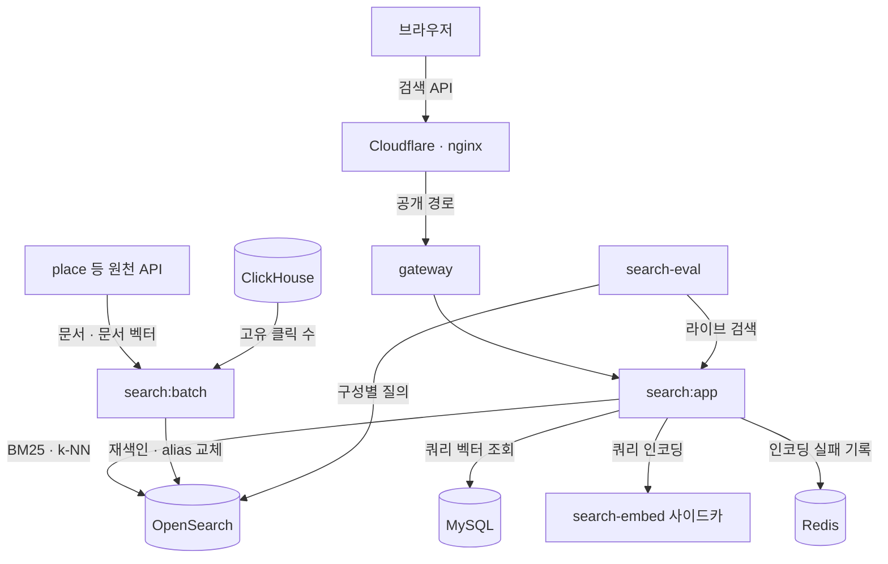
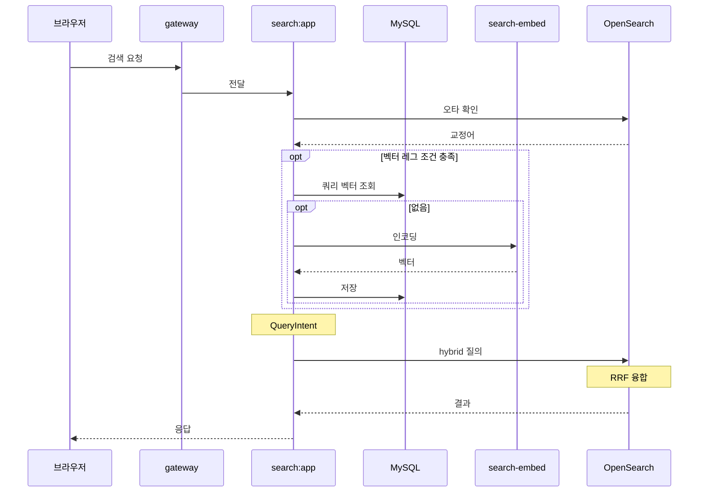
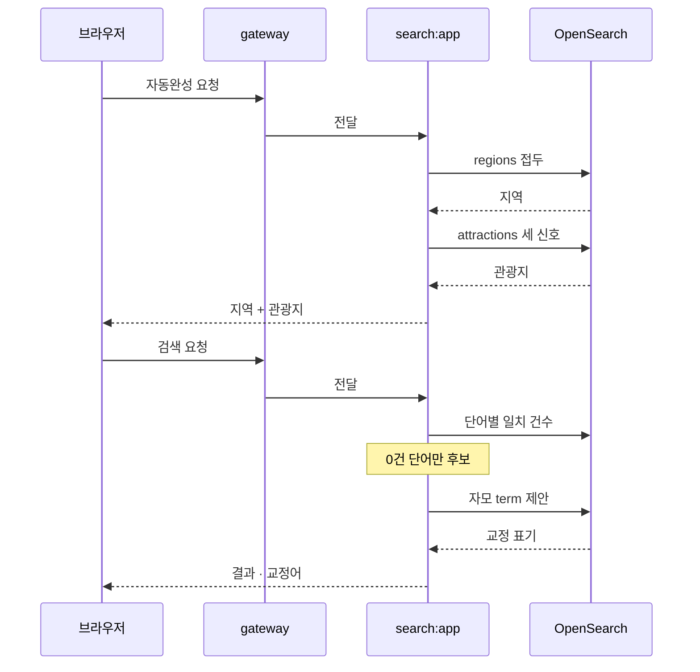
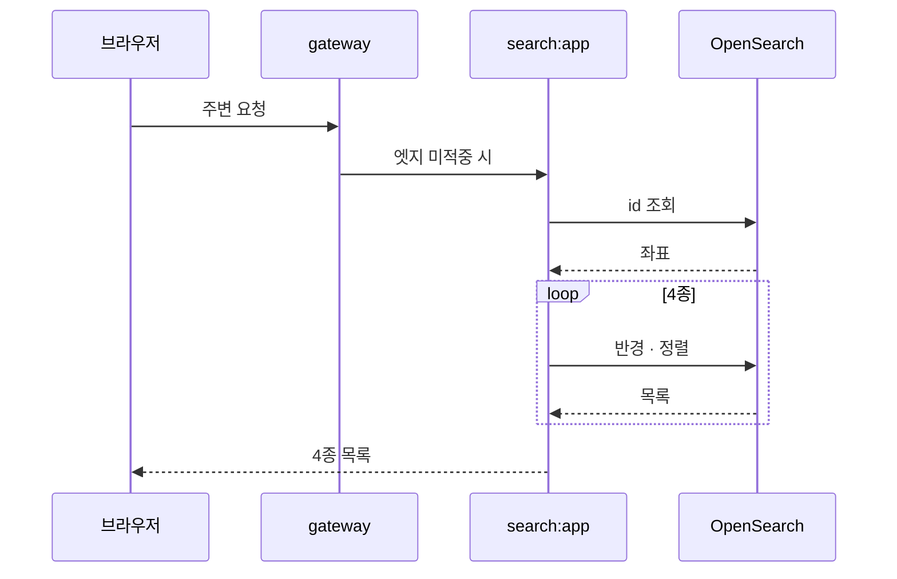
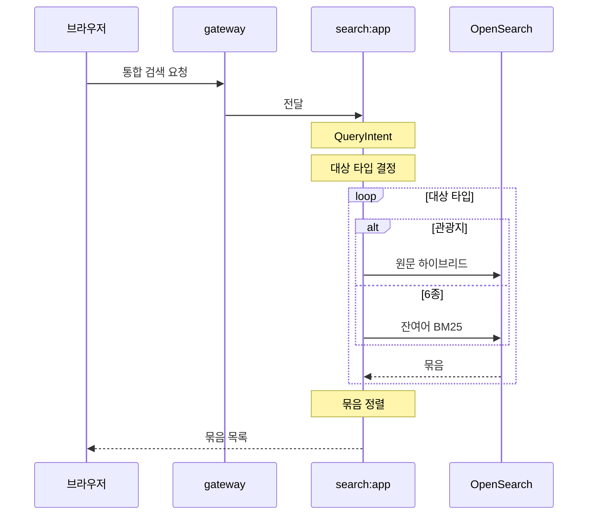

<!-- source: search/app/src/main/kotlin/com/kgd/search/infrastructure/opensearch/AttractionSearchAdapter.kt, search/app/src/main/kotlin/com/kgd/search/infrastructure/opensearch/UnifiedSearchAdapter.kt, search/app/src/main/kotlin/com/kgd/search/infrastructure/opensearch/HybridSearchPipelineInitializer.kt, search/app/src/main/kotlin/com/kgd/search/application/attraction/service/SearchAttractionService.kt, search/app/src/main/kotlin/com/kgd/search/application/attraction/service/NearbyAttractionsService.kt, search/app/src/main/kotlin/com/kgd/search/application/unified/service/SearchUnifiedService.kt, search/app/src/main/kotlin/com/kgd/search/application/queryvector/service/QueryVectorService.kt, search/domain/src/main/kotlin/com/kgd/search/domain/query/model/QueryIntent.kt, search/app/src/main/resources/application.yml, search/batch/src/main/resources/opensearch/attractions-index.json, k8s/base/search/deployment.yaml, k8s/base/search-batch/cronjob-attraction-reindex.yaml, k8s/base/search-batch/cronjob-eval.yaml, docs/adr/ADR-0065-k-tour-search.md, docs/adr/ADR-0090-unified-search-hybrid-embedding.md -->
# 검색 아키텍처 — 관광지 검색과 통합 검색

관광지 검색과 통합 검색이 어떤 요소로 돌아가는지 구조·흐름·지금 쓰는 기법 순서로 정리한다.

- [nori 형태소 분석과 사용자 사전](#nori-사용자-사전-줄-수)
- [BM25 + HNSW 하이브리드 검색](#하이브리드-켜짐)
- [RRF 순위 융합](#융합-방식)
- [쿼리 언더스탠딩](#쿼리-언더스탠딩)
- [쿼리 벡터 캐시](#쿼리-벡터-캐시)
- [nDCG@10 일일 품질 평가](#일일-품질-평가)

문서 갱신일(KST): 2026-10-08

## 1. 전체 구조

검색 요청은 엣지와 gateway 를 지나 search:app 에 닿는다. 검색 API 는 로그인 없이 쓰는 공개 경로다.

색인은 search:batch 가 원천 API 를 읽어 매일 새로 만들고, alias 를 바꿔 끼워 교체한다.

| 저장소 | 담는 것 | 쓰는 쪽 |
|---|---|---|
| OpenSearch `attractions` | 관광지 문서와 문서 벡터(`embedding`), 자모 사전 | 관광지 검색 · 자동완성 · 주변 |
| OpenSearch `unified` | 관광지를 뺀 6종(글·게임·개념·혜택·서비스·상품) 문서 | 통합 검색 |
| OpenSearch `regions` | 행정 지역(도시·광역)과 인구 | 자동완성 지역 칸 |
| MySQL `query_vector` 표 | 한 번 인코딩한 쿼리 벡터 | 쿼리 벡터 캐시 |
| Redis | 인코딩까지 실패한 쿼리의 횟수(ZSET) | 사전 채우기 도구 |
| place `attraction_embedding` | 관광지 문서 벡터의 원천 | 재색인 |

search-embed 는 search:app 과 같은 파드의 사이드카다. 쿼리 하나를 CPU 에서 실시간으로 인코딩한다.

상세와 주변 응답은 Cloudflare 가 1시간 쥔다. 검색 목록 응답은 엣지에 캐시하지 않는다.

## 2. 관광지 검색

place 검색 허브(`place.1989v.com`)와 관광지 상세가 쓰는 흐름이다. 세 요청으로 나뉜다.

### 2.1 검색 — 오타 교정, 두 레그, RRF

1. `GET /api/search/attractions` 가 gateway 를 지나 search:app 에 닿는다.
2. 오타 교정이 검색어를 고친다(2.2). 교정된 검색어는 두 레그에 모두 쓴다.
3. 벡터 레그 조건이 맞으면 쿼리 벡터를 구한다. 프로세스 캐시, MySQL `query_vector` 표, search-embed 인코딩 순서다.
4. 새로 인코딩한 벡터는 `query_vector` 표에 남긴다. 같은 쿼리를 다시 인코딩하지 않는다.
5. QueryIntent 가 교정된 검색어에서 잔여 검색어·패싯 필터·상업 의도를 만든다.
6. 두 레그를 hybrid 질의 하나로 보내고, 검색 파이프라인이 RRF 로 순위를 합친다.

두 레그는 같은 bool 질의에서 출발한다. 가중치는 융합 **전**, 키워드 레그 안에서만 곱한다.

| | 키워드 레그 | 벡터 레그 |
|---|---|---|
| 넣는 검색어 | 잔여 검색어(의도어를 뺀 나머지) | 교정된 원문 전체 |
| 채점 | BM25 × 관광·상업 분류 가중치 × ln1p(완결성) × clickBoost(꺼짐) | k-NN 코사인, 1비트 양자화 근사 후 원본 벡터로 재채점 |
| 상업 의도일 때 | BM25 그대로(분류 가중치·ln1p·clickBoost 없음) | 같다 |
| 필터 | 언어·지역·분류·패싯·반경·속성·행사 기간 | 키워드 레그의 bool 그대로(검색어 일치 포함) + `embeddingModel` 스탬프 |

벡터 레그의 필터에는 검색어 일치 조건이 들어 있다. 검색어가 어느 검색 필드에도 안 걸린 문서는 벡터 레그에도 나오지 않는다.

`embeddingModel` 필터는 재색인 중 옛 모델로 만든 문서 벡터를 벡터 레그에서 뺀다. 그 문서는 키워드 레그로만 올라온다.

| 조건 | 질의 |
|---|---|
| 쿼리 벡터 없음(하이브리드 꺼짐·인코딩 실패·거리순·시작일순) | 키워드 레그만 |
| 잔여 검색어가 비고 쿼리 벡터 있음(의도어만 친 경우) | 벡터 레그만 |
| 검색어 자체가 없음 | 키워드 레그(matchAll)만 — 분류 가중치 × 완결성 순서 |
| 그 밖 | 두 레그 + RRF, 정렬 없음, `pagination_depth` = max(from + size, k) |

인코딩까지 실패하면 그 쿼리를 Redis ZSET 에 세고 키워드 레그만으로 답한다. 사이드카가 죽어도 검색은 계속된다.

### 2.2 자동완성과 오타 교정

자동완성(`GET /api/search/attractions/suggest`)은 지역 칸을 먼저 채우고 남은 칸을 관광지로 채운다.

| 대상 | 신호 | 무게 |
|---|---|---|
| `regions` | 이름 접두 + log1p(인구) 가산 | 상단 3칸까지 |
| `attractions` | 이름이 입력으로 시작 | ×6 |
| `attractions` | 형태소 기준 일반 매칭 | ×1 |
| `attractions` | 자모(조합 중간 상태, 예 `ㄱㅕㅇㅂㅗ`) | ×0.3 |

관광지 제안에도 관광·상업 분류 가중치를 건다. 자동완성은 쿼리 언더스탠딩을 거치지 않는다.

| 오타 교정 단계 | 규칙 |
|---|---|
| 후보 | 두 글자 이상이고 검색 필드 어디에도 일치하는 문서가 0건인 단어 |
| 제안 | 자모로 편 단어를 `titleJamo.spell` 사전에서 편집거리 2 안으로 찾는다 |
| 채택 | 유사도 하한을 넘는 제안 하나, 응답에 교정된 검색어로 함께 낸다 |

자동완성 세 신호의 무게는 이름 접두가 가장 크고 자모가 가장 작다. 자모는 가장 헐거운 신호라 정확히 맞은 이름을 밀어내지 못하게 낮춘다.

오타 교정은 검색 필드 어디에도 없는 단어만 고친다. 제목에만 없는 단어까지 고치면 제대로 친 쿼리가 망가진다.

### 2.3 상세 주변

`GET /api/search/attractions/{id}/nearby` 한 요청이 4종을 모두 돌려준다. 응답은 엣지가 `s-maxage` 1시간 쥔다.

| 종류 | 분류 | 정렬 |
|---|---|---|
| 주변 명소 | 자연·역사·문화·레저 | 거리순 |
| 근처 숙소 | 숙박 | 거리순 |
| 근처 행사 | 축제·행사(끝나지 않은 것) | 시작일순 |
| 주변 편의시설 | 쇼핑·음식 | 거리순 |

주변 질의는 검색어가 없어 벡터 레그를 타지 않는다. 화면은 받은 목록에서 자기 자신을 빼고 개수를 자른다.

## 3. 통합 검색

| 단계 | 규칙 |
|---|---|
| 대상 타입 | 요청 `type` 이 있으면 그 하나 → 없고 타입 의도가 잡히면 그 하나 → 둘 다 없으면 `ALL_TYPES` 7종 전부 |
| 관광지 | 원문 검색어를 관광지 검색에 그대로 넘긴다. 관광지 검색이 자기 사전으로 잔여·패싯을 다시 만든다 |
| 관광지 외 6종 | 잔여 검색어로 `unified` 를 찾는다. 필드는 title^3 · title.en^3 · titleEn^3 · summary · summary.en · body · body.en · tags^2 |
| 잔여 검색어가 빈 경우 | matchAll + 인기도 내림차순 |
| 묶음 순서 | 타입 의도의 묶음 → 첫 결과 제목이 검색어를 통째로 담은 묶음 → `ALL_TYPES` 고정 순서 |
| 장애 | 한 타입이 실패하면 그 묶음만 빠지고 나머지는 응답한다 |

`unified` 의 인기도 ln1p 는 BM25 에 **더한다**. 인기도가 0 이면 ln1p 가 0 이라 곱하면 점수가 사라진다.

## 4. 지금 쓰는 기법과 요소

● 표시는 CI 드리프트 테스트가 코드와 대조하는 값이다. 상태는 운영 매니페스트(`k8s/base/search/deployment.yaml`) env 를 따르고, env 가 없으면 `application.yml` 기본값이다.

| 항목 | 현재 값 | 상태 | 근거 | 결정 |
|---|---|---|---|---|
| 형태소 분석기 | `nori` | 복합어는 `discard` 로 쪼갠 조각만 남긴다 | `search/batch/src/main/resources/opensearch/attractions-index.json:36` | ADR-0065 |
| nori 사용자 사전 줄 수 | `200` | ● 색인 시점·검색 시점 공통 | `search/batch/src/main/resources/opensearch/attractions-index.json:39` | ADR-0065 |
| 동의어 줄 수 | `10` | ● 검색 시점 분석기에만 건다 | `search/batch/src/main/resources/opensearch/attractions-index.json:10` | ADR-0090 |
| 영문 분석기 | `english` | 제목·개요·주소의 `.en` 서브필드 | `search/batch/src/main/resources/opensearch/attractions-index.json:293` | ADR-0065 |
| 자모 자동완성 | `edge_ngram` | 자동완성 세 신호 중 가장 낮은 무게 | `search/batch/src/main/resources/opensearch/attractions-index.json:27`, `search/app/src/main/kotlin/com/kgd/search/infrastructure/opensearch/AttractionSearchAdapter.kt:477` | ADR-0065 |
| 오타 교정 | 자모 편집거리 `2` | 검색 필드에 없는 단어만 | `search/app/src/main/kotlin/com/kgd/search/infrastructure/opensearch/AttractionSearchAdapter.kt:367` | ADR-0065 |
| 하이브리드 켜짐 | `true` | ● 운영 켜짐(deployment env) | `k8s/base/search/deployment.yaml:36`, `search/app/src/main/resources/application.yml:86` | ADR-0090 |
| 융합 방식 | `rrf` | ● 앱이 기동 때 검색 파이프라인을 만든다 | `search/app/src/main/resources/application.yml:88` | ADR-0090 |
| RRF rank_constant | `60` | ● 순위만 써서 점수 정규화가 필요 없다 | `search/app/src/main/kotlin/com/kgd/search/infrastructure/opensearch/HybridSearchPipelineInitializer.kt:67` | ADR-0090 |
| 필터 위치 | 두 레그 각각 | 벡터 레그도 검색어가 걸린 문서 안에서만 찾는다 — 의도(구조 필터만 넣는 안과 판정 세트 비교, 차이 유의하지 않음) | `search/app/src/main/kotlin/com/kgd/search/infrastructure/opensearch/AttractionSearchAdapter.kt:693` | ADR-0090 |
| 임베딩 모델 ref | `microsoft/harrier-oss-v1-270m@31de22b#d640` | ● 검색 앱과 재색인이 같은 값이어야 벡터 레그가 돈다 | `k8s/base/search/deployment.yaml:34`, `k8s/base/search-batch/cronjob-attraction-reindex.yaml:62` | ADR-0090 |
| 벡터 차원 | `640` | ● | `search/batch/src/main/resources/opensearch/attractions-index.json:446` | ADR-0090 |
| HNSW m | `16` | ● Lucene 엔진, 코사인 | `search/batch/src/main/resources/opensearch/attractions-index.json:452` | ADR-0090 |
| HNSW ef_construction | `128` | ● | `search/batch/src/main/resources/opensearch/attractions-index.json:453` | ADR-0090 |
| 양자화 | `sq` 1비트 | 근사 후보를 원본 벡터로 재채점(×3) | `search/batch/src/main/resources/opensearch/attractions-index.json:455`, `search/app/src/main/kotlin/com/kgd/search/application/attraction/config/AttractionHybridProperties.kt:23` | ADR-0090 |
| 사이드카 정밀도 | `fp32` | CPU 1코어로 쿼리를 실시간 인코딩 | `k8s/base/search/deployment.yaml:102` | ADR-0090 |
| 쿼리 벡터 캐시 | 프로세스 캐시 → `query_vector` 표 → 인코딩 | 인코딩 실패만 Redis ZSET 에 센다 | `search/app/src/main/kotlin/com/kgd/search/application/queryvector/service/QueryVectorService.kt:56`, `search/app/src/main/resources/db/migration/V1__create_query_vector.sql:8` | ADR-0090 |
| 쿼리 언더스탠딩 | 키워드 레그만 | 잔여 검색어·패싯 필터, 상업 의도는 랭킹 스위치 | `search/domain/src/main/kotlin/com/kgd/search/domain/query/model/QueryIntent.kt:236`, `search/app/src/main/kotlin/com/kgd/search/application/attraction/service/SearchAttractionService.kt:91` | ADR-0090 |
| 관광 분류 가중치 | `3.0` | ● 키워드 레그 안, 상업 의도면 빠진다 | `search/app/src/main/resources/application.yml:72` | ADR-0065 |
| 상업 분류 가중치 | `0.35` | ● 키워드 레그 안, 상업 의도면 빠진다 | `search/app/src/main/resources/application.yml:73` | ADR-0065 |
| 완결성 계수 | `ln1p(popularityScore)` | 필드가 없으면 1.0 | `search/app/src/main/kotlin/com/kgd/search/infrastructure/opensearch/AttractionSearchAdapter.kt:761` | ADR-0065 |
| clickBoost 켜짐 | `false` | ● 꺼짐 — 14일 고유 클릭 방문자 기반 계수, 상한 1.3 | `search/app/src/main/resources/application.yml:78`, `search/domain/src/main/kotlin/com/kgd/search/domain/attraction/model/AttractionClickSignal.kt:36` | ADR-0095 |
| pagination_depth | `max(from + size, k)` | k 는 100, 기본값 10 이면 2페이지부터 빈다 | `search/app/src/main/kotlin/com/kgd/search/infrastructure/opensearch/AttractionSearchAdapter.kt:721` | ADR-0090 |
| 엣지 캐시 | `s-maxage` 1시간 | 상세·주변 응답만 | `search/app/src/main/kotlin/com/kgd/search/presentation/search/controller/AttractionSearchController.kt:120` | ADR-0105 |
| 지연 예산 P99 | 적중 `150ms` · 미적중 500ms | 실측 평균 74.6ms · 354ms | `docs/conventions/latency-budget.md:64` | ADR-0025 |
| 일일 품질 평가 | nDCG@10 `3구성` | CronJob `search-eval` KST 07:30, 기준선 −0.03 아래면 실패 | `k8s/base/search-batch/cronjob-eval.yaml:17`, `scripts/search-eval/README.md` | ADR-0090 |
| 색인 갱신 | 전체 재색인 + `alias` 교체 | 관광지는 매일 KST 06:30 | `k8s/base/search-batch/cronjob-attraction-reindex.yaml:21` | ADR-0065 |
| 행동 계측 | 노출 · 클릭 · 검색 · 세션 시작 | ADR 은 제안 상태, place 허브·지역·상세·통합 검색 화면이 보낸다 | `portal-fe/src/analytics/events.ts:13` | ADR-0095 |
| 범위 밖 | 각 서비스의 자체 검색 면 | 코드사전·블로그·혜택·랭킹·상품이 자기 화면에서 쓰는 검색은 이 문서에 없다 | `search/app/src/main/kotlin/com/kgd/search/application/unified/service/SearchUnifiedService.kt:118` | — |

## 5. 이 문서를 고치는 때

아래를 바꾸면 이 문서의 해당 행과 그림을 같은 커밋에서 고친다.

- 검색 ADR(ADR-0065 · ADR-0090 · ADR-0095 · ADR-0105)
- `search/` 아래 코드와 설정
- `k8s/base/search/` · `k8s/base/search-batch/` 매니페스트
- `scripts/search-eval/` 평가 스크립트

CI 드리프트 테스트가 잡는 것은 ● 표시 값과 근거 열 파일이 있는지뿐이다. 그림·나머지 행·문서 색인 연결은 사람이 고친다.

다이어그램은 `docs/conventions/blog-diagram.md` 규칙을 따른다. 간선 라벨은 파이프 표기만 쓰고 `rect` 블록은 쓰지 않는다.
