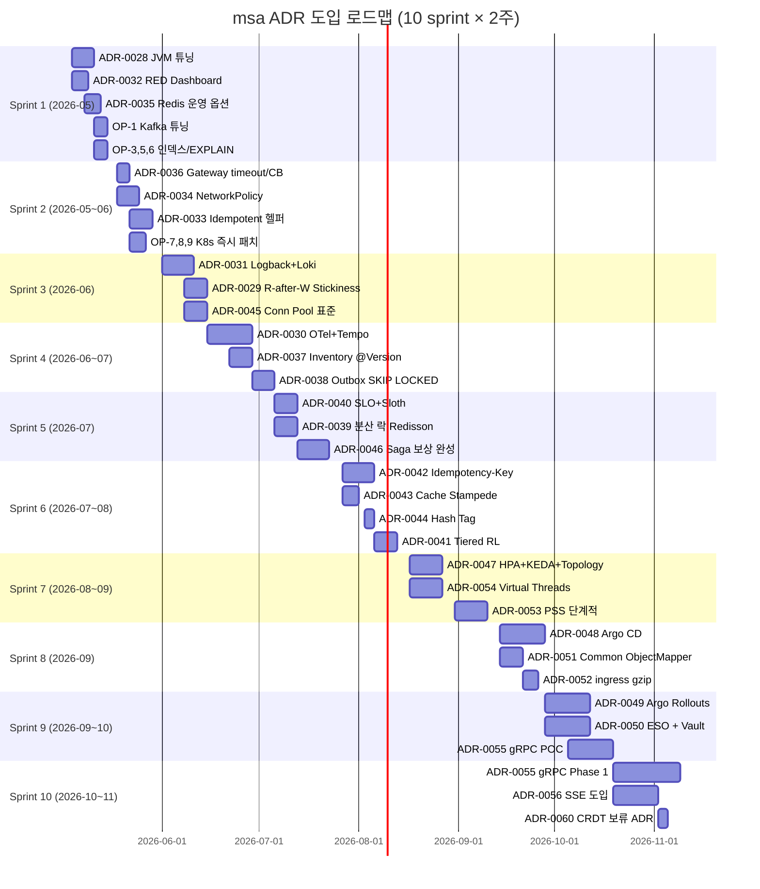

# msa Platform ADR 후보 통합 리스트

> 18개 학습 주제 deep study (2026-04 ~ 2026-05) 산출물에서 발굴된 ADR (Architecture Decision Record, 아키텍처 결정 기록) 후보를 통합·중복 제거·우선순위 매긴 문서.
> 현재 사용 중 ADR: ADR-0001 ~ ADR-0027 (2026-05-02 기준). 후속 ADR 번호는 ADR-0028 부터 시작 가능.
> Source: `study/docs/{2..18}/*-improvements.md` 15개 파일 (1, 12, 13 은 본 통합 대상에서 제외 — 1 (aws-network) / 12 (latency-numbers) / 13 (crypto-jwt-sso) 은 별도 산출물 또는 ADR-0027 등에서 부분 반영됨).

---

## ⚠️ ADR 번호 정합성 재조정 (2026-05-02 update)

본 문서의 본문에서 사전 할당된 ADR 번호 (ADR-0028~0061)와 **실제 `docs/adr/` 에 부여된 번호가 다르다**. 본문 내 번호는 학습 단계 가번호이며, 실제 채택 ADR 번호는 아래 표가 source of truth 다.

| 실제 부여 번호 | 본문 가번호 | 제목 | 상태 |
|---|---|---|---|
| **ADR-0028** | (가번호 ADR-0030) | 분산 추적 (OpenTelemetry + Tempo) | Proposed (`docs/adr/ADR-0028-distributed-tracing.md`) |
| **ADR-0029** | (가번호 ADR-0033) | Idempotent Consumer Helper (ADR-0012 보강) | Proposed (`docs/adr/ADR-0029-idempotent-consumer-helper.md`) |
| **ADR-0030** | (가번호 ADR-0029) | Read-after-Write Stickiness | Proposed (`docs/adr/ADR-0030-read-after-write-stickiness.md`) |
| **ADR-0031** | (가번호 ADR-0034) | K8s NetworkPolicy (Default-Deny) | Proposed (`docs/adr/ADR-0031-network-policy.md`) |
| **ADR-0032** | (신규 — verification round) | Order Outbox + Cancellation Compensation | Proposed (`docs/adr/ADR-0032-order-outbox-cancellation.md`) |

### 실 ADR 추가 후 잔여 가번호 후보

본문 §2-§5 의 가번호 ADR-0028 (JVM Tuning), ADR-0031 (gateway 고도화), ADR-0032 (Outbox 운영), ADR-0034 (NetworkPolicy 외 보안), ADR-0035~0061 등은 **모두 실제 부여 안 됨**. 향후 ADR 작성 시 `docs/adr/` 의 다음 비어있는 번호 (현재 ADR-0033 부터) 부터 순차 할당 권장.

### Verification Round (2026-05-02) 추가 후보

`study/docs/00-VERIFICATION-REPORT.md` 의 검증 결과로 신규 발견된 P0 갭 (본문에 없던 항목):

- **ADR-0032 — Order Outbox + Cancellation Compensation** (위 표에 이미 등재). ADR-0011 위반 (Order 측 Outbox 부재) + `order.order.cancelled` consumer 부재의 두 갭을 묶음.
- **잔여 follow-up (ADR 미할당)**:
  - `addNotRetryableExceptions` 미적용 — ADR-0015 ErrorHandler 보강 ticket (별도)
  - `processed_event` cleanup 스케줄러 미존재 — ADR-0029 Phase 2 작업으로 흡수 (Verification Follow-up 섹션 참조)
  - `InventoryStockSyncConsumer.kt` 멱등 체크 누락 — ADR-0029 Phase 3 마이그레이션 대상에 추가

---

## 1. Executive Summary

- 총 **34개** ADR 후보 발굴 (중복 제거 후)
- **P0 (즉시 착수): 9개** — 보안/안정성/즉시 ROI 임계
- **P1 (우선 착수): 11개** — 1~2 분기 내
- **P2 (적시 착수): 9개** — 6~12개월
- **P3 (보류 / 트리거 도래 시): 5개** — 12개월+ 또는 조건부

### 영역별 분포

| 영역 | P0 | P1 | P2 | P3 | 합계 |
|---|---|---|---|---|---|
| 보안 | 1 | 2 | 2 | 1 | 6 |
| 운영/배포 | 2 | 3 | 2 | 1 | 8 |
| 성능 | 2 | 2 | 1 | 0 | 5 |
| 아키텍처 | 1 | 1 | 2 | 2 | 6 |
| 관측 | 2 | 1 | 1 | 0 | 4 |
| 데이터 | 1 | 2 | 1 | 1 | 5 |

### 가장 많이 cross-reference 된 후보 TOP 3

1. **ADR-0030 분산 추적 (OpenTelemetry + Tempo)** — #6 Kafka, #7 분산시스템, #8 시스템설계, #10 Observability, #11 K8s, #17 Spring Web 6개 주제에서 동시 제기
2. **ADR-0029 Read-after-Write Stickiness** — #4 DB, #5 Spring Tx, #15 Connection Pool 3개 주제에서 동일 문제 식별
3. **ADR-0033 Idempotent Consumer 헬퍼 (common 모듈)** — #5 Spring Tx, #6 Kafka, #7 분산시스템 3개 주제에서 동일 패턴 제안 (ADR-0012 보강)

### 핵심 메시지

> 현재 msa 는 ADR-0027 까지 27개 결정으로 plumbing 은 갖춰졌으나 **운영/관측/보안 enforcement 가 비어있다**. P0 9개는 모두 "이미 의존성/인프라는 있지만 설정/연결만 안 된" 항목 — 빠른 ROI. P1 부터는 새 컴포넌트 도입 (Loki, Tempo, Sloth, Argo CD) 이 시작.

---

## 2. P0 (즉시 착수 권장 — 보안/안정성/즉시 ROI 임계)

### ADR-0028: JVM Tuning Convention (G1 default + 영역 한도 + 진단 활성화)

- **출처**: 주제 #2 JVM/GC (`study/docs/2-jvm-gc/21-improvements.md` 제안 1, 2, 3, 5)
- **문제**:
  - `commerce.jib-convention.gradle.kts` 의 `jvmFlags` 는 `-XX:+UseContainerSupport`, `-XX:MaxRAMPercentage=75.0`, `-Djava.security.egd=file:/dev/./urandom` 만 박혀있음.
  - GC 로그 / 자동 Heap Dump / NMT / 영역별 한도 가 모두 빠져있음 → 장애 시 GC forensic 불가, OOM (Out Of Memory, 메모리 부족) 원인 분석 불가, native 영역 분해 불가.
  - 1Gi limit + MaxRAMPercentage=75 가 native 예산 빠듯: heap 768MB + Metaspace ~150MB + Code Cache 240MB + Thread 50MB + GC Internal 50MB + Direct (default=Xmx) 768MB → 합계 2GB+ 가능 → OOMKilled 위험.
- **제안**:
  - base jvmFlags 에 다음 추가 — `-XX:+UseG1GC` (명시), `-Xlog:gc*::time,uptime,level,tags` (stdout → Loki 수집), `-XX:+HeapDumpOnOutOfMemoryError`, `-XX:HeapDumpPath=/var/log/jvm/heapdump-%t.hprof`, `-XX:+ExitOnOutOfMemoryError`, `-XX:NativeMemoryTracking=summary`, `-XX:MaxRAMPercentage=70.0` (75 → 70), `-XX:MaxMetaspaceSize=256m`, `-XX:ReservedCodeCacheSize=128m`, `-XX:MaxDirectMemorySize=64m`.
  - per-service override 패턴 추가 (gateway 65% / quant ZGC 등). 현재 단일 매핑이라 확장 필요.
  - K8s deployment 에 `securityContext.fsGroup: 1000` + `emptyDir` (sizeLimit 2Gi) for `/var/log/jvm`. prod overlay 는 PVC 권장 (장애 후 dump 보존).
  - 부록 A — 서비스별 메모리 산정 표 (product/order/search/gateway/analytics/quant 별 RAMPercentage/Metaspace/CodeCache/Direct).
  - `monitoring/jvm-alerts.yaml` PrometheusRule 신설 — ContainerMemoryNearLimit (>0.9 for 5m) 외 7개.
- **영향 코드/문서**:
  - `commerce.jib-convention.gradle.kts` (수정)
  - `k8s/base/*/deployment.yaml` (volume + securityContext)
  - `k8s/infra/prod/monitoring/jvm-alerts.yaml` (신설)
  - 추후 `quant/docs/adr/` 에 ZGC 채택 ADR 별도 (서비스 local)
- **예상 공수**: M (1주 — PR 3개 + 1 서비스 lab 검증 → 점진 적용)
- **Consequences**:
  - 운영 진단성 즉시 ↑ (NMT diff 로 영역별 사용량 분해)
  - GC 로그 ~1% 부가 부담, NMT summary ~5% 부가 (수용 가능)
  - OOMKilled 위험 ↓
  - jvmFlags 길어져 read 부담 (트레이드오프 가치 있음)
  - per-service override 가 빌드 컨벤션 복잡도 ↑
- **Alternatives**:
  - env 기반 `JAVA_TOOL_OPTIONS` — 빌드 재실행 없이 변경 가능하지만 코드 추적성 ↓ → reject
  - JVM 옵션 전부 K8s overlay 로 — Jib convention 의 일관성 ↓ → reject
  - `-XX:+AlwaysPreTouch` 도입 — 부팅 시간 trade. K8s readinessProbe 가 여유 줘서 무가치 → defer
- **근거**: "GC 패턴 forensic 불가능 (로그 X), OOM 원인 분석 불가능 (dump X), native 영역 분해 불가능 (NMT X)" (#2 §2.1)

### ADR-0029: Read-after-Write Stickiness via Redis

- **출처**: 주제 #5 Spring @Transactional (#3 stickiness ADR), #15 Connection Pool (P2-8), #4 DB Index/Tx (제안 6 cross-ref)
- **문제**:
  - `RoutingDataSource` 가 `readOnly` 만 보고 master/replica 분기 → replica lag (수십 ms ~ 수 초) 동안 read-after-write 비일관성 발생.
  - 시나리오: T1 `POST /products` → master commit → T2 replica 가 binlog 받기 전 → T3 `GET /products/{id}` → replica 조회 → 404.
  - 사용자 UX 직접 영향 ("방금 등록한 게 안 보인다").
  - 현재 11개 서비스 모두 master/replica 분리되어 있으나 stickiness 미구현.
- **제안 (옵션 A 채택)**:
  - `common/src/main/kotlin/com/kgd/common/datasource/Stickiness.kt` 추가.
  - `WriteStickinessTracker.markRecentWrite(userId, ttl=2s)` — Redis `write_stickiness:{userId}` 키 set.
  - `WriteStickinessTracker.isRecentWrite(userId)` — Redis hasKey.
  - `RoutingDataSource.determineCurrentLookupKey()` — (1) `RoutingContext.isUseMaster()` 명시적 강제 → MASTER, (2) tracker.isRecentWrite(userId) → MASTER, (3) `TransactionSynchronizationManager.isCurrentTransactionReadOnly()` → REPLICA, else MASTER.
  - 마킹 위치 — `@TransactionalEventListener(phase=AFTER_COMMIT)` 의 `WriteEvent` 발행. 모든 write Service 가 이벤트 발행 (boilerplate 최소화 위해 AOP 검토).
  - `@UseMaster` annotation — 명시적 강제용 (예: 결제 후 즉시 조회).
- **옵션 비교**:
  - 옵션 A — Redis 마커 (afterCommit): 자동, Redis 의존, master 부하 5~10% ↑. **채택**.
  - 옵션 B — `@WithMaster` AOP advice: 명시적 사용처만, 누락 위험.
  - 옵션 C — 명시적 master repository 호출: control 가장 명확하지만 도메인 코드 오염.
  - 옵션 D — GTID wait: 강한 일관성, 복잡도 ↑↑, MySQL 의존 강화. 거부.
- **영향 코드/문서**:
  - `common/src/main/kotlin/com/kgd/common/datasource/Stickiness.kt` (신설)
  - `common/src/main/kotlin/com/kgd/common/datasource/RoutingDataSource.kt` (수정)
  - `common/src/main/kotlin/com/kgd/common/datasource/WriteEvent.kt` (이벤트 정의)
  - `*/app/src/main/resources/application.yml` (`kgd.common.datasource.stickiness.enabled=true`)
  - 11개 서비스의 write Service 에 `applicationEventPublisher.publishEvent(WriteEvent(userId))` 추가
- **예상 공수**: M (1주 — common + 1 서비스 시범 + 11 서비스 점진)
- **Consequences**:
  - 사용자 자기 데이터 일관성 보장
  - 명시적 `@UseMaster` annotation 도 함께 제공 → 결제 직후 등 hard-case 커버
  - Redis 의존 추가 (Redis 장애 시 silent degrade — 정합성 안 깨짐, 일관성만 약화)
  - master 부하 약간 증가 (예상 5~10%)
  - 모든 write 가 자기 user 에 대해 mark 해야 — 누락 시 효과 없음
- **근거**: "사용자가 자기 write 를 못 봄 (sticky 필요)" (#9 P2-1), "wishlist 추가 직후 즉시 조회 → replica 라우팅 → 못 찾을 수 있음" (#4 §6), "#15 connection pool 학습에서도 동일 문제 식별됨 (cross-reference)" (#5 §3)

### ADR-0030: 분산 추적 표준 (OpenTelemetry + Tempo + Trace ID Filter)

- **출처**: 주제 #6 Kafka (제안 — Saga trace_id), #7 분산시스템 (P1 - OpenTelemetry), #8 시스템설계 (2-3 Saga 분산 트레이싱), #10 Observability (ADR-X3), #11 K8s (#15 분산 추적), #17 Spring Web (#3 trace ID Filter)
- **문제**:
  - 분산 트레이스 인프라 0. Choreography Saga 가 한 주문이 어디까지 갔는지 한 곳에서 안 보임 → 운영 디버깅 비용 ↑.
  - `logback*.xml` 파일 0개 (find 결과), MDC/trace_id 전파 코드 0개 (grep 결과), Kafka 메시지에 trace context 없음.
  - ADR-0025 의 Tier 1 P99 SLA 검증 시 fan-out tail 분석 불가 (어느 hop 이 P99 인지 모름).
  - WebClient → 다운스트림 호출에 traceparent 헤더 자동 주입 없음.
  - Reactor Netty / coroutine 환경 (gateway, quant) 의 context 전파 미설계.
- **제안 — 3축 통합**:
  1. **Logback JSON + MDC trace propagation**
     - `common/src/main/resources/logback-spring.xml` 표준 추가 (LoggingEventCompositeJsonEncoder + service/level/logger/thread/trace_id/span_id/msg/exception 필드).
     - 의존성 `net.logstash.logback:logstash-logback-encoder:7.4`.
     - `common/src/main/kotlin/com/kgd/common/observability/TraceIdFilter.kt` (`OncePerRequestFilter`, `Ordered.HIGHEST_PRECEDENCE`) — traceparent 헤더 파싱 또는 신규 생성 → MDC put.
     - `ReactiveTraceIdFilter` (`WebFilter`, gateway 전용) — `Reactor Context` 에 trace_id 주입.
     - `WebClientCustomizer` — `MDC.get("trace_id")` 읽어 traceparent 자동 주입.
     - Kafka `ProducerInterceptor` / `RecordInterceptor` — header `traceparent` 자동 propagate. Listener 가 받자마자 MDC put.
     - Coroutine 환경 (quant) 은 `MDCContext` 명시 가이드.
  2. **OpenTelemetry Collector + Tempo (S3 backend)**
     - `helm install otel-collector` (DaemonSet) + `helm install tempo` (S3 backend `msa-tempo` 버킷).
     - OTel Collector tail sampling (#10 §09 표준 설정).
     - common 의존성 — `io.micrometer:micrometer-tracing-bridge-otel`, `io.opentelemetry:opentelemetry-exporter-otlp`.
     - common application.yml — `management.tracing.sampling.probability=1.0` (head 100%, Collector 가 tail 결정), `propagation.type=w3c`, `otlp.tracing.endpoint=http://otel-collector.monitoring.svc.cluster.local:4318/v1/traces`.
     - Java Agent 대신 Micrometer Tracing Bridge 채택 (Spring Boot 3.x 친화).
  3. **Prometheus Exemplar 활성화**
     - `prometheus.prometheusSpec.enableFeatures: [exemplar-storage]`.
     - Grafana Tempo datasource 의 `tracesToLogs` (Loki) + `tracesToMetrics` (Prometheus) + `serviceMap` 통합.
- **영향 코드/문서**:
  - `common/build.gradle.kts` (의존성)
  - `common/src/main/resources/logback-spring.xml` (신설)
  - `common/src/main/resources/META-INF/spring/org.springframework.boot.autoconfigure.AutoConfiguration.imports` (CommonObservabilityAutoConfiguration 등록)
  - `common/src/main/kotlin/com/kgd/common/observability/` (TraceIdFilter / ReactiveTraceIdFilter / KafkaInterceptors)
  - `gateway/app/.../filter/ReactiveTraceIdFilter.kt` (gateway 전용)
  - `k8s/infra/prod/monitoring/tempo/` (신설)
  - `k8s/infra/prod/monitoring/otel-collector/` (신설)
  - `docs/conventions/logging.md` (갱신 — JSON 필드 + Coroutine 가이드)
- **예상 공수**: L (2-3주 — common 표준 + Tempo 인프라 + 16개 서비스 점진 적용)
- **Consequences**:
  - 모든 서비스 JSON log + trace_id 자동
  - 외부 호출 (WebClient) 자동 traceparent
  - Kafka 비동기 경계 trace 끊어지지 않음
  - gateway → product → order → kafka → analytics 전체 trace 가시
  - Latency 회귀 root cause 분석 30분 → 5분
  - vendor lock-in 회피 (OTel 표준)
  - Coroutine 환경 (quant): OTel Coroutine instrumentation 검증 필요
  - Webflux gateway: OTel Webflux 자동 계측 검증
  - 기존 stdout 의존 운영 도구 깨질 수 있음 → local profile 은 plain text 유지
- **Alternatives**:
  - Java Agent 만 도입 — 코드 0줄, but Bridge 가 Spring 3.x 친화 → Bridge
  - Jaeger backend — Tempo 가 S3 비용 + Loki 통합 우위 → Tempo
  - Datadog APM — vendor lock-in + 비용 → reject
- **근거**: "한 주문이 어디까지 갔는지 한 곳에서 안 보임" (#7 P1-3), "logback*.xml 파일 0개 (find 결과)" (#10 ADR-X1), "분산 trace + Exemplar drill-down 동작" (#10 §5.3)

### ADR-0031: Logback JSON + Loki/Promtail 도입

- **출처**: 주제 #10 Observability (ADR-X1, ADR-X2)
- **문제**:
  - 로그 stack 미도입. 서비스 stdout 만 K8s `kubectl logs` 로 봐야 함.
  - 검색/알람/drill-down 불가능.
  - trace_id 도 없어 분산 디버깅 비용 폭증.
  - ELK 비용 부담 → Loki 가 답 (Loki = ELK 비용의 ~1/5).
  - 16개 서비스의 로그가 산재 → 한 요청의 전 로그 보려면 16번 검색.
- **제안**:
  - **Logback JSON** (ADR-0030 의 (A) 와 동기화):
    - `common/src/main/resources/logback-spring.xml` 표준
    - `LoggingEventCompositeJsonEncoder` — service/level/logger/thread/trace_id/span_id/msg/exception 필드
    - 의존성 `net.logstash.logback:logstash-logback-encoder:7.4`
    - local profile 은 plain text (개발자 콘솔 가독성)
  - **Loki Helm chart** (S3 backend):
    ```bash
    helm install loki grafana/loki -n monitoring \
      --set loki.storage.type=s3 \
      --set loki.storage.s3.bucketnames=msa-loki \
      --set loki.storage.s3.region=ap-northeast-2
    ```
  - **Promtail DaemonSet**:
    ```bash
    helm install promtail grafana/promtail -n monitoring \
      --set config.clients[0].url=http://loki:3100/loki/api/v1/push
    ```
    K8s pipeline — `cri` + `json` (level/trace_id/span_id/msg/service 추출) + `labels` (level/service만, cardinality 제한) + `relabel_configs` (`app.kubernetes.io/part-of=commerce-platform` 만 keep).
  - **Grafana datasource ConfigMap**:
    - `derivedFields` — `trace_id` 정규식 매칭 → Tempo drill-down link
- **Retention 정책**:
  - Loki retention: 30d (Hot)
  - S3 lifecycle: 90d → Glacier
  - 감사 로그 (quant) 는 ClickHouse 별도 (현재 그대로)
- **Label 카디널리티**:
  - service / level / namespace 만 label
  - trace_id / user_id 등은 본문 (검색 가능, label 아님)
  - pod_name 은 자동 (Promtail 기본)
- **영향 코드/문서**:
  - `common/src/main/resources/logback-spring.xml` (신설)
  - `common/build.gradle.kts` (logstash encoder)
  - `k8s/infra/prod/monitoring/loki/values.yaml` (신설)
  - `k8s/infra/prod/monitoring/promtail/values.yaml` (신설)
  - `k8s/infra/prod/monitoring/grafana/datasources/loki.yaml` (신설)
  - `docs/conventions/logging.md` (갱신)
- **예상 공수**: M (1-2주)
- **Consequences**:
  - 로그 검색 / 알람 / drill-down 가능
  - ADR-0030 의 trace_id derivedField 가 즉시 동작
  - 비용은 ELK 의 1/5 추정
  - Loki label 카디널리티 폭발 위험 — label 제한 강제
  - S3 접근 IAM 분리 필요
  - 기존 `kubectl logs` 의존 운영 도구는 그대로 유지 (병행)
- **Alternatives**:
  - ELK — 비용/복잡 → reject
  - Datadog Logs — vendor lock-in + 비용 → reject
  - CloudWatch Logs — AWS 종속, 검색 비용 ↑ → reject
- **근거**: "로그 검색 / 알람 / drill-down 가능, ADR-X1 의 trace_id derivedField 가 즉시 동작, 비용은 ELK 의 1/5 추정" (#10 §4.3)

### ADR-0032: RED Dashboard + ADR-0025 §4 강제 일괄 적용 (Quick Win)

- **출처**: 주제 #10 Observability (ADR-X4)
- **문제**: `http-dashboard.json` 에 Errors Ratio panel 누락 (RED 의 E). ADR-0025 §4 가 강제한 `percentiles-histogram=true`, Heatmap panel 미적용. 16개 서비스 application.yml 에 `percentiles-histogram` 설정 없음.
- **제안**: (A) `common/application-actuator.yml` 표준에 `management.metrics.distribution.percentiles-histogram` + `slo` bucket + `percentiles` 0.5/0.95/0.99 명시 — 모든 서비스 자동 상속. (B) `http-dashboard.json` 에 Error Ratio panel + Latency Heatmap panel 추가.
- **영향 코드/문서**: `common/src/main/resources/application-actuator.yml`, `monitoring/dashboards/http-dashboard.json`
- **예상 공수**: S (3-5일)
- **근거**: "ADR-0025 §3 (Tier 1 P99 alerting 강제) 의 기반 마련, Heatmap 으로 bimodal 분포 발견 가능" (#10 §2.3)

### ADR-0033: Idempotent Consumer 헬퍼 표준화 (ADR-0012 보강)

- **출처**: 주제 #5 Spring @Transactional (제안 — #15 ProcessedEvent), #6 Kafka (제안 4 IdempotentEventConsumer), #7 분산시스템 (P0/P1 — Consumer @Transactional, IdempotentEventHandler)
- **문제**:
  - inventory/order 의 멱등 패턴이 비즈니스 트랜잭션과 분리:
    ```
    if (processedEventRepository.existsById(eventId)) return  // [1]
    reserveStockUseCase.execute(...)                          // [2] DB TX 1
    processedEventRepository.save(...)                        // [3] DB TX 2
    ```
    [2] 성공 + [3] 실패 시 컨슈머 재처리 → [1] false → [2] 재실행 → **중복 reserve** (재고 손실).
  - 6개+ consumer 메서드에 동일 boilerplate 10줄 반복.
  - ADR-0012 의 4번 항목 "common 모듈 제공" 이 명세돼 있으나 코드는 in-place.
  - quant 의 `IdempotentEventConsumer` 패턴이 이미 검증되어 있어 재활용 가능.
  - processed_event 테이블에 `consumer_group` 컬럼 부재 → 같은 eventId 가 여러 group 에서 처리될 때 충돌.
- **제안**:
  - `common/src/main/kotlin/com/kgd/common/messaging/IdempotentEventHandler.kt` 추출 (`@Component`).
    - `process(eventId: String, consumerGroup: String, block: () -> Unit): Boolean`
    - 내부: `if (processedEventRepo.existsById(eventId, consumerGroup)) return false; transactionTemplate.execute { block(); processedEventRepo.save(eventId, consumerGroup) }; return true`
    - 단일 `@Transactional` 안에서 [2] + [3] atomic.
  - 4개 서비스 (inventory/order/fulfillment/quant) consumer 가 import 만:
    ```
    @KafkaListener(...)
    fun on(record) {
        idempotentHandler.process(eventId, "inventory-service") {
            useCase.execute(...)
        }
    }
    ```
  - processed_event 테이블 마이그레이션 — `consumer_group` 컬럼 추가, PK `(event_id, consumer_group)` 복합키 변경.
  - missing eventId 케이스 — warn 로그 + dedup 없이 처리 (graceful degrade).
  - `@KafkaListener` 자체에 `@Transactional` 적용 옵션도 검토하지만 외부 IO (DLT publish 등) 와 충돌 가능 → handler 안 TransactionTemplate 패턴이 안전.
- **영향 코드/문서**:
  - `common/src/main/kotlin/com/kgd/common/messaging/IdempotentEventHandler.kt` (신설)
  - `common/src/main/kotlin/com/kgd/common/messaging/ProcessedEventRepositoryPort.kt` (port)
  - 각 서비스의 `ProcessedEventJpaEntity.kt` (consumer_group 컬럼 추가)
  - Flyway `V_n__add_consumer_group_to_processed_event.sql`
  - `inventory/order/fulfillment/quant/app/.../*EventConsumer.kt` (호출부)
  - `docs/adr/ADR-0012-idempotent-consumer.md` (보강)
- **예상 공수**: M (1주 — common 추출 + 4 서비스 적용 + 마이그레이션 SQL + 회귀 테스트)
- **Consequences**:
  - 진정한 atomic 멱등성 (현재 구조의 race 제거)
  - 4 서비스 코드 중복 제거
  - ADR-0012 의 시맨틱이 모든 consumer 에 일관 적용
  - Flyway migration 필요 (running 상태에서 PK 변경은 INSTANT 불가 → INPLACE 또는 운영 작업)
  - 기존 데이터의 consumer_group 은 backfill 필요 (or NULL 허용 후 점진)
- **Alternatives**:
  - `@KafkaListener` 메서드에 `@Transactional` 직접 적용 — 외부 IO (DLT) 와 충돌 위험. reject.
  - Kafka 트랜잭션 (transactional producer) — Streams 영역, 일반 consumer 부적합. defer to ADR-0059 (Schema Registry) 와 별개.
- **근거**: "[2] 성공 + [3] 실패 시 컨슈머 재처리 → [1] false → [2] 재실행 → 중복" (#6 §4), "ADR-0012 의 4번 항목 (common 모듈 IdempotentEventHandler 유틸리티) 의 실현" (#6 P1-4), "6개+ consumer 메서드에 동일 boilerplate 10줄 반복" (#7 §2)

### ADR-0034: NetworkPolicy 도입과 default-deny 정책

- **출처**: 주제 #11 K8s (#1), #17 Spring Web (#10 cross-ref mTLS)
- **문제**:
  - `grep -rn "NetworkPolicy" k8s/` → 0건.
  - 같은 namespace 내 모든 Pod 가 무제한 통신 가능.
  - gateway 우회 호출이 가능 → 다운스트림이 X-User-Id 헤더 신뢰 모델의 보안 사각 (위조 가능).
  - 컴플라이언스 (PCI-DSS, K-ISMS) 시 ns-level 격리 필수 요구.
- **제안 — 정책 set**:
  - `k8s/base/network-policy/default-deny.yaml` — `policyTypes: [Ingress, Egress]`, `podSelector: {}` (namespace 전체).
  - `allow-dns` — kube-system kube-dns 53/UDP+TCP 만 egress 허용.
  - `allow-ingress-to-gateway` — ingress-nginx ns → gateway pod 8080 만.
  - `allow-gateway-to-backends` — gateway pod → 같은 ns 의 `app.kubernetes.io/part-of=commerce-platform` 라벨 가진 모든 백엔드 (gateway 자체 제외).
  - `allow-backends-to-infra` — 백엔드 → kafka:9092, mysql:3306, redis:6379, elasticsearch:9200 (별도 ns). egress 허용.
  - `allow-monitoring-scrape` — monitoring ns prometheus → 모든 pod 의 actuator port (8080).
  - `deny-cross-namespace-by-default` — 다른 ns 통신 차단.
- **CNI 전제**: NetworkPolicy 지원 필수.
  - EKS: VPC (Virtual Private Cloud, 가상 사설 클라우드) CNI 의 `enableNetworkPolicy=true` 옵션 활성 또는 Calico add-on.
  - GKE: dataplane v2 (eBPF) 기본 지원.
  - AKS: Azure CNI Powered by Cilium.
  - k3d/k3s-lite: Calico 또는 Flannel + canal.
- **단계적 enforce**:
  - Phase 1 — `policyTypes` 만 정의, `audit` 모드 (실 차단 X) → 위반 로그 수집 1주.
  - Phase 2 — 정상 트래픽 외 차단 → 1주 모니터링.
  - Phase 3 — 새 서비스 PR 시 NetworkPolicy 의무 (Kyverno 정책으로 enforce, ADR-0053 와 연동).
- **영향 코드/문서**:
  - `k8s/base/network-policy/` (신설)
  - `k8s/infra/prod/` (CNI 옵션 검증)
  - `k8s/overlays/k3s-lite/` / `k8s/overlays/prod-k8s/` (NetworkPolicy 활성)
  - `docs/conventions/network-policy.md` (신설)
- **예상 공수**: M (1주 — 정책 작성 + 단계적 enforce + 검증). CNI 변경 필요 시 +1주.
- **Consequences**:
  - 보안 사각 즉시 차단 (gateway 우회 위조 불가)
  - K-ISMS / PCI-DSS 일부 요구 충족
  - 새 서비스 추가 시 NetworkPolicy PR 필수 → 운영 절차 추가
  - 디버깅 시 connection refuse 가 NetworkPolicy 인지 식별 어려움 → eBPF 도구 (Cilium hubble) 권장
  - mTLS (mutual TLS, 양방향 TLS) 까지는 보장 안 함 (트래픽 내용 도청 가능). mTLS 는 Service Mesh 도입 시 별도 ADR (P3).
- **Alternatives**:
  - Service Mesh 의 AuthorizationPolicy — 더 강력하지만 Mesh 도입 비용. defer.
  - Calico GlobalNetworkPolicy — CNI 종속, ns 단위 표준화 어려움. reject.
- **근거**: "같은 namespace 내 모든 Pod 가 무제한 통신 가능" (#11 §2.#1), "다운스트림이 X-User-Id 헤더 신뢰. gateway 우회 호출 시 위조 가능" (#17 §10)

### ADR-0035: Redis 운영 옵션 표준 (maxmemory + lazyfree + TTL jitter)

- **출처**: 주제 #9 Redis (P0-1, P0-2, P0-5)
- **문제**:
  - `k8s/infra/local/redis/statefulset.yaml` 의 args 가 `--appendonly yes`, `--save "60 1"` 만 설정.
  - `maxmemory` 미설정 → 256Mi limit 까지 무한 사용 → OOM-killed 가능.
  - `maxmemory-policy` 미설정 → default `noeviction` → 메모리 한계 도달 시 write 거부 (write 가 SET 만이 아니라 GET 의 keyspace expire 도 영향).
  - `lazyfree-*` 옵션 없어 큰 키 DEL 시 main thread 동기 처리 → latency spike.
  - analytics 의 TTL 7200초 정확값 → 대량 batch (Kafka Streams 윈도우) 적재 시 동시 만료 → expire 처리 spike (CPU + replication burst).
  - prod (Bitnami chart) 에도 동일 문제.
- **제안 (A) — StatefulSet args + Bitnami commonConfiguration**:
  - local statefulset args:
    ```yaml
    - --maxmemory
    - "200mb"            # limit 256Mi 보다 작게 (jemalloc 오버헤드 + CoW 여유)
    - --maxmemory-policy
    - "allkeys-lfu"
    - --lazyfree-lazy-eviction
    - "yes"
    - --lazyfree-lazy-expire
    - "yes"
    - --lazyfree-lazy-server-del
    - "yes"
    - --lazyfree-lazy-user-del
    - "yes"
    ```
  - prod values:
    ```yaml
    commonConfiguration: |-
      maxmemory 800mb
      maxmemory-policy allkeys-lfu
      lazyfree-lazy-eviction yes
      lazyfree-lazy-expire yes
      lazyfree-lazy-server-del yes
      lazyfree-lazy-user-del yes
      appendfsync everysec
      aof-use-rdb-preamble yes
    ```
- **제안 (B) — TTL Jitter 헬퍼**:
  - `common/src/main/kotlin/com/kgd/common/cache/TtlJitter.kt`:
    ```kotlin
    fun jittered(baseSec: Long, ratio: Double = 0.1): Duration {
        val jitter = (baseSec * ratio).toLong()
        return Duration.ofSeconds(baseSec + Random.nextLong(-jitter, jitter))
    }
    ```
  - analytics/inventory/quant/gateway 의 모든 `redis.opsForValue().set(..., ttl)` 호출부에 적용.
- **KPI (Key Performance Indicator, 핵심 성과 지표)**:
  - OOMKilled 0건 / 30일
  - "expire spike" latency p99 ms 단위 spike 0건
  - DEL latency p99 < 1ms (lazyfree 효과)
  - mem_fragmentation_ratio < 1.5 평균
- **영향 코드/문서**:
  - `k8s/infra/local/redis/statefulset.yaml`
  - `k8s/infra/prod/redis/values.yaml`
  - `common/src/main/kotlin/com/kgd/common/cache/TtlJitter.kt` (신설)
  - `analytics/app/.../ScoreCacheAdapter.kt`
  - `inventory/app/.../*CacheAdapter.kt`
  - `quant/app/.../*CacheAdapter.kt`
  - `gateway/app/.../*CacheAdapter.kt`
- **예상 공수**: S (3-5일)
- **Consequences**:
  - OOM-killed 위험 차단
  - eviction 정책 명시 → write 차단 사고 차단
  - lazyfree 로 latency 안정 (CPU 약간 ↑, background thread 사용)
  - TTL 동시 만료 spike 평탄화
  - allkeys-lfu 가 hot key 보호 (vs allkeys-lru) — analytics 워크로드 적합
- **Alternatives**:
  - `volatile-lru` (TTL 있는 키만 evict) — TTL 없는 키 누적 시 폭증. reject.
  - `noeviction` 유지 + 운영 모니터링 — 사고 시 늦게 인지. reject.
- **근거**: "Redis 가 256Mi 까지 무한 사용 → OOM-killed 가능" (#9 P0-1), "대량 batch 으로 한꺼번에 적재 → 7200초 후 동시 만료 가능" (#9 P0-2)

### ADR-0036: Gateway Downstream Timeout / Circuit Breaker 명시 (ADR-0015 보강)

- **출처**: 주제 #16 Async/NIO (제안 3, P0)
- **문제**:
  - `gateway/build.gradle.kts` 에 `spring-cloud-circuitbreaker-reactor-resilience4j` 의존성은 있으나 `application.yml` 에 route 별 timeout/CB 미설정.
  - Reactor Netty 의 default timeout 이 **무한대** → 다운스트림이 hang 하면 Gateway 의 connection 무한 점유.
  - 한 다운스트림 장애가 Gateway 전체 latency 에 영향 → 다른 정상 라우트도 영향.
  - Connection pool exhaustion → cascade failure.
  - ADR-0015 에 Resilience 전략은 정의되어 있으나 Gateway 적용 sub-section 부재.
- **제안**:
  - `spring.cloud.gateway.httpclient.connect-timeout=1000` (1s)
  - `spring.cloud.gateway.httpclient.response-timeout=5s`
  - `spring.cloud.gateway.httpclient.pool.max-connections=200`
  - `spring.cloud.gateway.httpclient.pool.max-idle-time=30s`
  - `default-filters` 에 CircuitBreaker + fallbackUri (`forward:/fallback`).
  - route 별 짧은 timeout (auth route 0.5s, search route 2s, order POST 3s).
  - `/fallback/{service}` 컨트롤러 — 503 + 표준 에러 본문 반환.
  - Resilience4j CB config — slidingWindowSize=20, failureRateThreshold=50, waitDurationInOpenState=30s, permittedNumberOfCallsInHalfOpenState=5.
- **영향 코드/문서**:
  - `gateway/app/src/main/resources/application.yml`
  - `gateway/app/src/main/kotlin/com/kgd/gateway/config/RouteConfig.kt` (route 별 CB)
  - `gateway/app/src/main/kotlin/com/kgd/gateway/web/FallbackController.kt` (신설)
  - `docs/adr/ADR-0015-resilience-strategy.md` (Gateway sub-section 추가)
- **예상 공수**: S (3일)
- **Consequences**:
  - 다운스트림 격리 → P99 안정화
  - 한 서비스 장애가 다른 라우트 영향 차단
  - fallback 응답 정의 필요 (UX 컨벤션 협의)
  - 짧은 timeout 으로 정상 워크로드 일부 fail 가능 → 모니터링 후 조정
- **Alternatives**:
  - per-route 만 적용 (default 안 둠) — 누락 가능성. reject.
  - Service Mesh 의 timeout/retry — Mesh 도입 시점에 통합. defer.
- **근거**: "Reactor Netty 의 default timeout 이 무한대, 한 다운스트림 장애가 Gateway 전체 latency 에 영향" (#16 §3)

---

## 3. P1 (우선 착수 — 1~2 분기)

### ADR-0037: Inventory 동시성 — Optimistic Lock (`@Version`) + Retry

- **출처**: 주제 #3 동시성 (#5), #5 Spring Tx (#6 - 1순위)
- **문제**:
  - `InventoryService.execute(ReserveStockUseCase.Command)` 가 일반 SELECT + 도메인 검증 + UPDATE 흐름:
    ```
    val inventory = inventoryRepository.findByProductIdAndWarehouseId(...)  // 일반 SELECT
    inventory.reserve(command.qty)                                          // in-memory 검증
    inventoryRepository.save(inventory)                                     // UPDATE
    ```
  - 두 요청이 동시에 같은 productId/warehouseId 에 reserve 시 **lost update** 가능 → oversold (재고 100 → 동시 50+50 reserve → 양쪽 성공).
  - **금전적 손실 직결**.
  - 현재 fast-path Redis 캐시도 동시성 보장이 아님 (단순 fast-path).
  - 운영 트래픽 증가 시 즉시 문제 발생.
- **제안 — 옵션 A (Optimistic, 1순위)**:
  - `@Version` 컬럼 추가 → JPA 가 UPDATE 시 자동 `WHERE id=? AND version=?`.
  - 충돌 시 `OptimisticLockingFailureException` → `@Retryable(OptimisticLockingFailureException, maxAttempts=3, backoff=Backoff(delay=50, multiplier=2.0))`.
  - 비용 적음 (lock 없음). 충돌 빈도가 낮은 일반 재고에 적합.
  - 충돌 빈도 높은 hot product 는 옵션 B 검토.
- **옵션 B (Pessimistic, high-conflict 한정)**:
  - `@Lock(LockModeType.PESSIMISTIC_WRITE)` + `findByProductIdAndWarehouseIdForUpdate(p, w)`.
  - 동시 reserve 가 직렬화. 정확하지만 throughput 낮아질 수 있음.
  - 짧은 TX 안에서 lock 풀림 보장 필요 (외부 IO 분리 — ADR-0020 준수).
- **옵션 C (Redis 분산 락) — reject**:
  - `redissonClient.getLock("inventory:$productId:$warehouseId")`.
  - DB 락 부하 회피 가능하지만 TX 외부 락 → 일관성 보강 어려움 (DB commit 실패 시 락은 풀려있는 상태).
  - Redis SPOF 위험. reject.
- **영향 코드/문서**:
  - `inventory/app/src/main/kotlin/com/kgd/inventory/inventory/persistence/InventoryJpaEntity.kt` (`@Version` 추가)
  - `inventory/app/src/main/kotlin/com/kgd/inventory/inventory/service/ReservationService.kt` (`@Retryable`)
  - `inventory/app/src/main/kotlin/com/kgd/inventory/inventory/persistence/InventoryJpaRepository.kt` (옵션 B 메서드)
  - Flyway `V_n__add_version_to_inventory.sql`
  - `build.gradle.kts` — `spring-retry` + `spring-aspects` 의존성
- **예상 공수**: M (1주 — 코드 + 마이그레이션 + 부하 테스트)
- **Consequences**:
  - lost update 차단 → oversold 위험 제거
  - 충돌 빈도 높으면 retry 비용 ↑ (P99 영향) — 모니터링 필요
  - 옵션 B 도입 시 DB row lock 부하 ↑
  - retry advice 가 Spring Retry 의존 추가
- **Alternatives**:
  - 도메인 레벨 명시 retry (try-catch + while) — 더 control 가능하지만 boilerplate ↑. 옵션 A retry 가 default.
  - DDD 에서 Aggregate 단위 sequencing — 인프라 변경 큼. defer.
- **근거**: "재고 lost update 는 금전적 손실 직결 (oversold), 운영 트래픽 증가 시 즉시 문제 발생" (#5 §3)

### ADR-0038: Outbox Multi-worker + SKIP LOCKED + Retention Scheduler

- **출처**: 주제 #4 DB (제안 1, 5), #5 Spring Tx (제안 4, 5)
- **문제**:
  - `outbox_event` 테이블에 `(status, created_at)` 인덱스 없음 — 누적 시 ALL 스캔. relay 쿼리 점점 느려짐 (특히 장애 후 누적).
  - PUBLISHED 상태 row 도 무한 보관 → 테이블 폭증.
  - `OutboxPollingPublisher` 가 `@Scheduled` 로 모든 replica 에서 동시 실행 → 중복 발행 가능. Phase 3 multi-replica 시 race / 중복 처리 위험.
  - Outbox 보관 기간 정책 부재 → 운영 사고 시 재발행 가능 기간 불명확.
  - relay 가 단일 worker 가정 → 트래픽 증가 시 worker 늘릴 때 충돌 위험.
- **제안 (A) — 인덱스 추가**:
  - Flyway `V_n__add_outbox_event_index.sql`:
    ```sql
    ALTER TABLE outbox_event
      ADD INDEX idx_outbox_status_created (status, created_at),
      ALGORITHM=INPLACE, LOCK=NONE;
    ```
  - quant 의 `idx_outbox_unpublished` 와 동일 사상.
  - 향후 `published_at IS NULL` 모델로 마이그레이션 검토 (status 컬럼 제거).
- **제안 (B) — Multi-worker + SKIP LOCKED**:
  - native query (JPA derived 표현 불가):
    ```sql
    SELECT * FROM outbox
    WHERE published_at IS NULL
    ORDER BY occurred_at ASC
    LIMIT :size
    FOR UPDATE SKIP LOCKED
    ```
  - worker N=2~4 horizontal scale.
  - **중요**: TX 안에서 lock 잡고 publish 하는 패턴은 외부 IO 와 lock 시간 충돌 → ADR-0020 위반.
    - 해결: 두 단계 — read+lock 으로 status='PUBLISHING' UPDATE → TX commit → publish 후 별도 TX 로 status='PUBLISHED' 업데이트.
  - InnoDB 8.0+ 의존 (이미 OK).
- **제안 (C) — Retention Scheduler**:
  - `OutboxRetentionScheduler` (`@Scheduled(cron="0 0 3 * * *")` 매일 03:00):
    ```kotlin
    val cutoff = LocalDateTime.now().minusDays(7)
    outboxRepository.deleteByStatusAndPublishedAtBefore("PUBLISHED", cutoff)
    ```
  - 7일 retention (Kafka retention 7d + consumer lag 여유 고려).
  - DELETE batch 단위 권장 (10k row 씩).
- **제안 (D) — ShedLock leader election**:
  - `@Scheduled(...)` + `@SchedulerLock(name="outbox-polling-{service}", lockAtMostFor="30s")`
  - ShedLock + Redis backend (또는 JDBC backend).
  - leader 만 폴링 → 중복 발행 차단.
- **영향 코드/문서**:
  - `inventory/fulfillment/quant/app/.../OutboxPollingPublisher.kt` (수정)
  - 각 서비스의 OutboxJpaRepository 에 `findAndLockBatch` native query 추가
  - Flyway `V_n__add_outbox_index.sql`
  - `OutboxRetentionScheduler.kt` (각 서비스 또는 common)
  - `common/build.gradle.kts` (ShedLock 의존성)
  - `common/src/main/kotlin/com/kgd/common/outbox/` (가능 시 추출)
  - `docs/adr/ADR-0012-idempotent-consumer.md` (보강 — Outbox 운영)
- **예상 공수**: M (1-2주)
- **Consequences**:
  - throughput 향상 (multi-worker)
  - worker 장애 isolation
  - 테이블 크기 안정 (retention)
  - 중복 발행 차단 (ShedLock)
  - native query 사용 (JPA derived 표현 불가)
  - retention 7일 → 사고 시 재발행 가능 기간 7일로 한정 (운영 알람 필수)
  - ShedLock 의존 추가
- **Alternatives**:
  - Debezium CDC — 외부 컴포넌트 도입. ROI 분석 후 재검토 (P3 또는 별도 ADR).
  - Outbox 없이 Kafka transactional producer — `@Transactional` 안에서 send. broker 의존, exactly-once 보장 어려움. reject.
- **근거**: "@Scheduled 가 모든 replica 인스턴스에서 동시에 돌아 중복 발행 가능" (#5 §5), "outbox 가 누적되면 (특히 장애 시) 점점 느려짐" (#4 §1)

### ADR-0039: Distributed Lock 정책 (Redisson 채택 + 펜싱 가이드)

- **출처**: 주제 #3 동시성 (#4), #5 Spring Tx (옵션 C 비교), #9 Redis (P1-1)
- **문제**:
  - Redis 분산 락 미구현. msa 는 replicas=1 가정 (Phase 2).
  - Phase 3 multi-replica 시 race / 중복 처리 위험:
    - `@Scheduled` 잡 leader election (모든 replica 가 동시에 OutboxRelay 폴링 시 같은 row 중복 publish — ADR-0038 의 ShedLock 으로 처리하지만 일반 Redis 분산 락도 필요)
    - audit chain prev_hash 계산 cross-replica 직렬화 (현재 in-process Mutex 만)
    - inventory reconcile 의 cross-instance 직렬화
    - 결제 idempotent (외부 PG 호출 단일화)
    - batch single-execution (CronJob 우발 중복 실행 방어)
  - `auth/AuthService.kt:25` 의 `ConcurrentHashMap<String, String> refreshTokenStore` — 단일 인스턴스 가정 → multi-replica 시 store miss → refresh 실패.
- **제안 — 결정 트리**:
  1. `mutual exclusion 이 correctness 인가?`
     - YES (예: 자금 거래) → ZooKeeper / etcd 또는 DB `SELECT FOR UPDATE` 사용. Redis 분산 락 부적절 (split-brain 위험).
     - NO → 다음.
  2. `외부 storage (S3, 외부 DB) 에 write 하는 락인가?`
     - YES → 펜싱 token 추가 (storage 가 단조 검증). 예: `lock-version=N` 헤더 + storage 가 `version >= max_seen` 만 accept.
     - NO → 다음.
  3. `RedLock 사용?` — 기본 NO. 운영 부담 (5+ Redis instance 관리) 대비 이득 작음.
  4. `@Scheduled` 전용? → ShedLock (ADR-0038 참조).
  5. 일반 → Redisson `getLock()` (단일 master, watchdog 자동 갱신).
- **라이브러리 채택**:
  - `redisson-spring-boot-starter`.
  - `RedissonClient.getLock(name)` — auto watchdog (default 30s 락, 10s 마다 자동 연장 if alive).
- **컨벤션**:
  - 키 네임스페이스 `{service}:{resource}:{id}` (예: `inventory:reservation:warehouse-1`)
  - lease 10s (watchdog 으로 자동 연장), wait 2s
  - 장애 시 fail-closed (락 못 잡으면 작업 거부)
- **`auth refreshTokenStore` 마이그레이션**:
  - `RedisRefreshTokenStore(redis: ReactiveStringRedisTemplate)` — `save(jti, userId, ttl)` / `get(jti)` / `revoke(jti)`.
  - TTL = refresh token 만료 시간.
  - 13-crypto-jwt-sso 의 19-improvements 항목 5 와 연계 (rotation + reuse detection).
- **영향 코드/문서**:
  - `common/build.gradle.kts` (`redisson-spring-boot-starter`)
  - `common/src/main/kotlin/com/kgd/common/lock/DistributedLock.kt` (신설)
  - `auth/app/.../RefreshTokenStore.kt` (Redis 이전)
  - `quant/app/.../AuditChainVerifier.kt` (cross-replica Mutex → Redisson)
  - `docs/conventions/distributed-lock.md` (신설 — 결정 트리 + 사용 예시)
- **예상 공수**: M (1-2주)
- **Consequences**:
  - multi-replica 안전성 확보
  - Redisson 의존 추가 (3MB+)
  - Redis 단절 시 fail-closed → 일부 작업 거부 (운영 알람 필수)
  - Watchdog 의존 — Redisson 버전 업그레이드 시 동작 변경 주의
- **Alternatives**:
  - Spring Integration RedisLockRegistry — Spring 표준이지만 기능 단순. reject.
  - ShedLock — `@Scheduled` 전용. ADR-0038 에서 채택, 일반 락은 Redisson.
  - ZooKeeper Curator — correctness 가 mutual exclusion 인 경우만 별도 도입.
- **근거**: "Phase 3 multi-replica 시 race / 중복 처리 위험" (#3 §4), "토큰 운영 (refresh rotation + reuse detection)" (#3 §6)

### ADR-0040: SLO + Sloth + Burn Rate Alert

- **출처**: 주제 #10 Observability (ADR-X5)
- **문제**:
  - ADR-0025 가 latency budget 정의했으나 알람 / Error Budget 정책 부재.
  - Tier 1 P99 alerting 강제 = ADR-0025 §3, 그러나 PrometheusRule CR 0개.
  - burn rate 기반 multi-window 알람 룰 부재 → 알람 폭주 또는 늦은 인지.
  - 운영 freeze 정책 없음 → 배포 결정에 데이터 기반 근거 부족.
- **제안 — Sloth 도입**:
  - `helm install sloth slok/sloth -n monitoring`.
  - `k8s/infra/prod/monitoring/slos/` 디렉토리 신설.
  - SLO YAML 만 작성하면 Sloth 가 multi-window multi-burn-rate alert + Recording Rules 자동 생성 (Google SRE Workbook 의 4-pair burn rate 표준).
  - 예시:
    ```yaml
    apiVersion: sloth.slok.dev/v1
    kind: PrometheusServiceLevel
    metadata: { name: product-availability, namespace: monitoring }
    spec:
      service: product
      slos:
        - name: requests-availability
          objective: 99.9
          sli:
            events:
              error_query: sum(rate(http_server_requests_seconds_count{application="product",status=~"5.."}[{{.window}}]))
              total_query: sum(rate(http_server_requests_seconds_count{application="product"}[{{.window}}]))
          alerting:
            page_alert: { severity: page, labels: { team: commerce } }
            ticket_alert: { severity: ticket }
    ```
- **초기 Tier 1 SLO (5개)**:
  | Service | SLI | SLO |
  |---|---|---|
  | product | availability | 99.9 |
  | product | latency P99 < 100ms | 99 |
  | order | POST availability | 99.95 |
  | search | latency P99 < 500ms | 99.5 |
  | gateway | availability | 99.95 |
- **Error Budget Policy** (`docs/policies/error-budget-policy.md`):
  - Budget < 50% → 정상 운영
  - < 20% → 추가 신규 기능 freeze 검토 (제품팀 협의)
  - < 0% → 안정화 sprint 의무
- **SLO Dashboard JSON** (`monitoring/dashboards/slo-dashboard.json`):
  - Error Budget 잔량 gauge
  - 30d Burn Rate trend
  - 4-pair Burn Rate table (1h/5m, 6h/30m, 24h/2h, 72h/6h)
- **영향 코드/문서**:
  - `k8s/infra/prod/monitoring/sloth/` (Helm release)
  - `k8s/infra/prod/monitoring/slos/` (SLO YAML)
  - `monitoring/dashboards/slo-dashboard.json` (신설)
  - `docs/policies/error-budget-policy.md` (신설)
- **예상 공수**: M (1주 — Sloth + 5 SLO + dashboard + policy 문서)
- **Consequences**:
  - ADR-0025 §3 (Tier 1 alerting 강제) 실현
  - Error Budget 정량화 → 배포 freeze 룰
  - Slack / PagerDuty receiver 설정 가능
  - 초기 SLO 값이 추정 — 1분기 후 조정
  - Error Budget 정책에 제품팀 동의 필요 (초기 마찰)
- **Alternatives**:
  - Sloth 없이 직접 Prometheus rules YAML — boilerplate 큼. reject.
  - Pyrra — Sloth 와 유사, 작은 차이. Sloth 가 더 활성. defer.
- **근거**: "ADR-0025 §3 (Tier 1 alerting 강제) 의 기반, Error Budget 정량화 → 배포 freeze 룰" (#10 §6)

### ADR-0041: Tiered Rate Limiter (사용자 등급별 차등) + 도메인 확대

- **출처**: 주제 #7 분산시스템 (P2 - RL 도메인 확대), #8 시스템설계 (2-2 P0), #9 Redis (Stampede 와 별)
- **문제**: gateway 에 단일 limiter (100/200) inventory route 만 적용. 사용자 차등 없음. order/payment/search 등 critical route 폭주 위험. Flash Sale 모드 전환 절차 없음.
- **제안**: `TieredRateLimiter` (FREE 10/20, BASIC 100/200, PREMIUM 1000/2000, INTERNAL UNLIMITED). RL 환경변수화 → Flash Sale 모드 시 5x 즉시 전환. 메트릭 (429 비율 / route / tier) → Grafana. order, payment, search route 추가.
- **영향 코드/문서**: `gateway/app/src/main/kotlin/com/kgd/gateway/config/RateLimiterConfig.kt`, `gateway/app/src/main/kotlin/com/kgd/gateway/filter/TieredRateLimiter.kt` (신설), `docs/adr/ADR-0015-resilience-strategy.md` (보강)
- **예상 공수**: M (1-2주)
- **근거**: "단일 limiter, 사용자 불만, 차등 안 됨" (#8 §9), "다른 route 도 폭주 위험" (#7 §8)

### ADR-0042: Idempotency-Key 명시적 강제 + Aspect 일관화

- **출처**: 주제 #8 시스템설계 (2-1 P0)
- **문제**:
  - 일부 서비스만 적용, 결제 흐름에 부분 강제.
  - `Idempotency-Key` 헤더 표준 부재 — 클라이언트가 헤더 안 보내도 통과.
  - POST 재시도 시 중복 결제/주문 위험 (network glitch + client retry → double charge).
  - 응답 캐싱도 미구현 → 재시도 시 첫 응답과 다른 결과 받을 수 있음.
- **제안**:
  - `common/src/main/kotlin/com/kgd/common/web/Idempotent.kt` annotation 신설.
  - `common/src/main/kotlin/com/kgd/common/web/IdempotencyAspect.kt`:
    - `@Around("@annotation(Idempotent)")`
    - `Idempotency-Key` 헤더 없으면 `BusinessException(IDEMPOTENCY_KEY_REQUIRED)` 던짐.
    - Redis `setIfAbsent("idempo:{key}", "1", Duration.ofDays(1))` — first-win.
    - 첫 호출만 `pjp.proceed()`, 응답을 `idempo:resp:{key}` 에 24h TTL 로 cache.
    - 후속 호출은 `idempo:resp:{key}` 에서 cached response 반환.
    - 진행 중 (write lock) 충돌은 409 Conflict 반환.
- **적용 대상**: order/payment/inventory 의 모든 `@PostMapping`. 신규 서비스도 신규 POST 시 의무.
- **클라이언트 가이드**:
  - `Idempotency-Key: <UUID v4>` 헤더 필수.
  - 동일 키 재시도 시 동일 응답 보장 (24h 윈도우).
  - 다른 페이로드로 같은 키 재사용 시 422 에러.
- **영향 코드/문서**:
  - `common/src/main/kotlin/com/kgd/common/web/Idempotent.kt` (신설)
  - `common/src/main/kotlin/com/kgd/common/web/IdempotencyAspect.kt` (신설)
  - `common/src/main/kotlin/com/kgd/common/exception/ErrorCode.kt` (IDEMPOTENCY_KEY_REQUIRED, IDEMPOTENCY_PAYLOAD_MISMATCH 추가)
  - order/payment/inventory 의 `@PostMapping` 메서드들 — `@Idempotent` 어노테이션
  - `docs/conventions/api-idempotency.md` (신설 — 클라이언트 가이드)
- **예상 공수**: M (1-2주 — common + 적용 + 문서)
- **Consequences**:
  - 결제 중복 사고 차단
  - Redis 의존 (장애 시 fail-closed: 키 못 set → 422 또는 fail-open 정책 결정 필요)
  - 응답 캐싱으로 Redis 메모리 사용 ↑ (24h × 평균 응답 크기 × QPS)
  - 클라이언트 SDK 도 헤더 자동 부착 필요 (FE 작업 동반)
- **Alternatives**:
  - DB 기반 idempotency table — Redis 보다 internal IO ↑. ADR-0033 의 ProcessedEvent 와 통합 가능하나 HTTP 영역은 Redis 가 더 적합.
  - 외부 PG 의 idempotency-key 의존 — PG 별 상이, 표준화 어려움. reject.
- **근거**: "POST 재시도 시 중복 결제/주문 위험" (#8 §2-1), "결제 흐름에 부분 강제" (#8 §2-1)

### ADR-0043: Cache Stampede 방어 정책 (single-flight + TTL Jitter)

- **출처**: 주제 #8 시스템설계 (3-3 Stampede), #9 Redis (P0-3)
- **문제**: Cache miss 시 다수 동시 요청이 DB 로 폭주. analytics `score:product:*` 의 hot product, product 캐시 도입 시점에 위험. 현재는 단순 cache-aside.
- **제안**: `common/src/main/kotlin/com/kgd/common/cache/StampedeGuardedCache.kt` 도입. SETNX mutex (`lock:{key}`, 5s) + 50ms × 20회 polling + fallback (직접 조회). 모든 read-heavy 캐시에 TTL jitter 의무 (ADR-0035 와 결합). hot key 정의 (top N, QPS 임계) 후 stampede 방어 적용. XFetch 옵션은 P2 로 분리.
- **영향 코드/문서**: `common/src/main/kotlin/com/kgd/common/cache/`, `analytics/app/.../ScoreCacheAdapter.kt`, `product/app/.../ProductCacheAdapter.kt` (도입 시)
- **예상 공수**: S (3-5일)
- **근거**: "Cache miss 시 다수 동시 요청이 DB 로 폭주" (#8 §3-3), "DB connection pool exhaustion alert 0건 (KPI)" (#9 §14)

### ADR-0044: Hash Tag 컨벤션 (Cluster multi-key 호환)

- **출처**: 주제 #9 Redis (P0-4)
- **문제**: `analytics/ScoreCacheAdapter.kt` 의 `multiGet(keys)` 가 cluster 환경에서 productId 가 다른 슬롯이면 CROSSSLOT 에러. Spring Data Redis 가 자동 분리 해주지만 round trip 비용. 향후 cluster 전환 시 깨짐.
- **제안**: `{score:product}:$id` 같은 hash tag 패턴 표준. 같은 도메인의 multi-key 명령은 같은 슬롯으로. 단, hot shard 위험 — multi-key 비도가 높음 + 키 수 적음 → hash tag, 키 수 많음 → 개별 GET. ADR 에 사용 정책 + multi-key 명령 검토 list + hot shard 모니터링 룰.
- **영향 코드/문서**: `analytics/app/.../ScoreCacheAdapter.kt`, `common/cache/` (헬퍼 추가), `docs/conventions/redis-keys.md` (신설)
- **예상 공수**: S (3일)
- **근거**: "cluster 환경에서 productId 가 다른 슬롯이면 multiGet 이 CROSSSLOT 에러" (#9 P0-4)

### ADR-0045: Connection Pool 표준화 (Hikari + Lettuce 메트릭 + Common 추출)

- **출처**: 주제 #15 Connection Pool (P0-1, P0-2, P1-3, P1-4, P1-5, P1-6)
- **문제**:
  - 11개 서비스의 `application.yml` 에 `leak-detection-threshold` 미설정 → leak 추적 불가능. 운영 환경에서 유일한 leak 추적 도구 부재.
  - `connection-timeout` default 30s — gateway routing timeout (5s) 보다 길어 thread leak 위험.
  - `pool-name` 미명시 → 메트릭에서 `HikariPool-1`, `HikariPool-2` 식별 불가, master/replica 분리 알람 불가능.
  - `keepalive-time` 미설정 → K8s Service / kube-proxy 가 idle TCP 정리 시 silent drop.
  - Lettuce Micrometer 비활성 → Redis 명령 latency / 카운터 메트릭 부재.
  - 11개 서비스가 동일한 `DataSourceConfig.kt` 중복 — DRY 위반, stickiness 추가 시 11번 PR 필요.
- **제안 — P0 (즉시)**:
  - 11개 서비스 yml 에 추가 (master/replica 양쪽):
    - `leak-detection-threshold: 10000` (10s) — leak 시 stack trace 자동 로그
    - `connection-timeout: 5000` (5s) — fail-fast (이전 30s 대비 25s 단축)
    - `pool-name: {service}-{master|replica}-pool` — 메트릭 분리
    - `keepalive-time: 30000` (30s) — idle isValid() 핑
- **제안 — P1 (1-2주)**:
  - `CommonDataSourceAutoConfiguration` 신설:
    - `@AutoConfiguration`
    - `@ConditionalOnProperty(prefix = "kgd.common.datasource", name = ["routing-enabled"], havingValue = "true")`
    - `@ConditionalOnProperty(prefix = "spring.datasource.master", name = ["jdbc-url"])`
    - master/replica DataSource + RoutingDataSource + LazyConnectionDataSourceProxy 생성
  - 11개 서비스의 `DataSourceConfig.kt` 삭제 → application.yml 에 `kgd.common.datasource.routing-enabled: true` 만.
  - Lettuce `MicrometerCommandLatencyRecorder` 활성화 (`CommonRedisAutoConfiguration` 수정):
    - 메트릭 — `lettuce_command_completion_count{command="GET"}`, `lettuce_command_completion_seconds{quantile="0.99"}` 등
    - 알람 — `histogram_quantile(0.99, rate(lettuce_command_completion_seconds_bucket[5m])) > 0.05`
- **점진 적용**: 1 서비스 (product) 적용 → 1주 운영 → 나머지 10 서비스 일괄.
- **영향 코드/문서**:
  - `*/app/src/main/resources/application.yml` (11개)
  - `common/src/main/kotlin/com/kgd/common/datasource/CommonDataSourceAutoConfiguration.kt` (신설)
  - `common/src/main/kotlin/com/kgd/common/redis/CommonRedisAutoConfiguration.kt` (수정)
  - 11개 `*/app/src/main/kotlin/com/kgd/{service}/config/DataSourceConfig.kt` (삭제)
  - `monitoring/dashboards/jdbc-pool-dashboard.json` (master/replica 분리 panel)
  - `monitoring/dashboards/redis-lettuce-dashboard.json` (신설)
- **예상 공수**: M (1-2주, 점진)
- **Consequences**:
  - leak 추적 가능 — 운영 디버깅 시간 평균 2시간 → 10분
  - 풀 메트릭 master/replica 분리 — 알람 정확도 ↑
  - silent drop 검출 — 첫 트래픽 fail 90% 감소
  - Lettuce metric 활성 — Redis 이상 5분 내 인지
  - 모든 서비스가 common 의존 — 변경 시 전체 영향 (점진 적용으로 완화)
  - leak detection 비용 < 1µs (Exception 객체 + ScheduledFuture 한 개)
- **Alternatives**:
  - 각 서비스 yml 에 leak-detection 만 추가, common 추출 X — DRY 위반 지속. defer.
  - HikariCP → Tomcat JDBC pool — 메트릭 부재. reject.
- **근거**: "운영 환경에서 유일한 leak 추적 도구" (#15 P0-1), "thread 회수 빠름 → cascade failure 회피" (#15 P0-2), "11개 DataSourceConfig.kt 삭제, 향후 stickiness / 추가 라우팅 정책을 한 곳 에서 관리" (#15 P1-5)

### ADR-0046: Saga Compensation Chain 완성 + 환불 정책

- **출처**: 주제 #5 Spring Tx (제안 10), #7 분산시스템 (P1 - 제안 4)
- **문제**: order 생성 → inventory reserve OK → payment 실패 시 inventory release 가 명시적이지 않고 30분 TTL 후 expire 로 회복. 결제 실패 → cancel 흐름이 완전한지 코드만으로 단언 어려움. 환불 흐름은 자동/수동 미정.
- **제안**: order 가 payment 실패 시 `order.payment.failed` 또는 `order.cancelled` 발행. inventory consumer 가 `releaseStockByOrder` 즉시 실행. 환불 정책: Phase 1 manual + alert, Phase 2 자동화 (PG abstraction 도입 시점). 보상 이벤트 명세서 + 시나리오 테스트.
- **영향 코드/문서**: `order/app/.../OrderService.kt`, `inventory/app/.../InventoryEventConsumer.kt`, `docs/adr/ADR-0011-inventory-fulfillment-service.md` (보강)
- **예상 공수**: M (1-2주)
- **근거**: "order 가 cancelled 로 마감, 그러나 inventory 는 30분간 묶임" (#7 §4)

### ADR-0047: HPA 다양화 (Custom Metric + KEDA Kafka Lag) + Topology Spread

- **출처**: 주제 #11 K8s (#5, #6, #7), #15 Connection Pool (P2-10 cross-ref HPA cap)
- **문제**:
  - 모든 HPA CPU 70% 단일.
  - gateway 같이 RPS 가 부하 지표인 서비스에 부적절 (CPU 30% 인데 RPS 폭주 가능).
  - search-consumer/analytics 의 Kafka consumer 처리량 ≠ CPU (lag 폭증해도 CPU 낮음 → scale-out 안 일어남).
  - `replicas=2` 가 같은 AZ 에 떨어질 수 있음 (확률 1/zone_count) — AZ 장애 시 동시 사라짐.
  - HPA maxReplicas cap 정책 부재 → DB max_connections 초과 위험 (11 서비스 × 10 인스턴스 × 풀 10 = 1100 conn → RDS db.r5.large 1000 초과).
- **제안**:
  - (A) **Prometheus Adapter rule** 추가 → gateway HPA 에 RPS metric:
    ```yaml
    - seriesQuery: 'http_server_requests_seconds_count{namespace="commerce"}'
      name: { matches: "^(.*)_count", as: "${1}_per_second" }
      metricsQuery: 'sum(rate(<<.Series>>{<<.LabelMatchers>>}[2m])) by (<<.GroupBy>>)'
    ```
    HPA spec — `type: Pods`, `metric.name: http_server_requests_seconds_per_second`, `target.averageValue: "100"`.
  - (B) **KEDA `ScaledObject`** for search-consumer/analytics:
    ```yaml
    triggers:
      - type: kafka
        metadata:
          bootstrapServers: kafka:29092
          consumerGroup: search-consumer
          topic: product.changed
          lagThreshold: "100"
    ```
    `minReplicaCount: 2`, `maxReplicaCount: 8`, `pollingInterval: 30`, `cooldownPeriod: 300`.
  - (C) **topologySpreadConstraints** 모든 서비스 적용 (overlay patch):
    ```yaml
    topologySpreadConstraints:
      - maxSkew: 1
        topologyKey: topology.kubernetes.io/zone
        whenUnsatisfiable: ScheduleAnyway
        labelSelector: { matchLabels: { app.kubernetes.io/part-of: commerce-platform } }
      - maxSkew: 1
        topologyKey: kubernetes.io/hostname
        whenUnsatisfiable: ScheduleAnyway
        labelSelector: { matchLabels: { app.kubernetes.io/part-of: commerce-platform } }
    ```
  - (D) **HPA maxReplicas cap 정책** (#15 의 P2-10 통합):
    - 산정: `서비스당 max instances = max_connections × 0.8 / 서비스 수 / 풀 사이즈`
    - 예: max_conn=1000, 11 서비스, 풀 10 → 7.3 → cap 7
    - 트래픽 spike 큰 서비스 (order, product) 는 cap 10, 작은 서비스 (member, auth) 는 cap 5 차등
    - ProxySQL 도입 시 cap 완화 가능 (별도 ADR P3)
- **영향 코드/문서**:
  - `k8s/infra/prod/prometheus-adapter/` (신설)
  - `k8s/infra/prod/keda/` (신설)
  - `k8s/overlays/prod-k8s/keda/scaledobject-search-consumer.yaml` (신설)
  - `k8s/overlays/prod-k8s/keda/scaledobject-analytics.yaml` (신설)
  - `k8s/overlays/prod-k8s/patches/topology-spread.yaml` (신설)
  - `k8s/overlays/prod-k8s/hpa/` (각 서비스 HPA maxReplicas cap)
  - `docs/conventions/hpa-sizing.md` (신설)
- **예상 공수**: M (1-2주)
- **Consequences**:
  - 부하 지표가 실제 부하와 정합 → scale-out 정확도 ↑
  - AZ 장애 시 동시 사라짐 위험 ↓
  - DB 자원 한계 사전 차단
  - KEDA 의존 추가 (Helm release)
  - Prometheus Adapter 의존 (메트릭 수집 latency 추가)
  - maxReplicas cap 으로 진짜 spike 시 throttling — circuit breaker / 부하 흡수 한계
- **Alternatives**:
  - VPA (Vertical Pod Autoscaler) — 함께 쓰면 HPA 와 충돌. defer.
  - Cluster Autoscaler 의존 — 노드 spawn latency 큼 (1-3분). HPA + KEDA 가 우선.
- **근거**: "replicas=2 가 같은 AZ 에 떨어질 수 있음 — AZ 장애 시 동시 사라짐" (#11 #7), "11 × 10 × 10 = 1100 — 한계 초과" (#15 P2-9)

---

## 4. P2 (적시 착수 — 6~12개월)

### ADR-0048: GitOps 도입 (Argo CD)

- **출처**: 주제 #11 K8s (#9 — L3)
- **문제**:
  - `kubectl apply -k k8s/overlays/prod-k8s` 수동.
  - drift 감시 없음 (cluster 의 manual 변경이 git 과 어긋날 수 있음).
  - 변경 추적은 git history 만 — 누가 언제 어떤 변경을 cluster 에 반영했는지 불명확.
  - 멀티 환경 (dev/stage/prod) 의 일관된 promotion 절차 부재.
  - rollback 시 git revert + manual apply 필요.
- **제안**:
  - `helm install argocd argo/argo-cd -n argocd -f k8s/infra/prod/argocd/values.yaml`.
  - 자기 자신을 `Application` 으로 등록 (self-managing) — `argocd/apps/argocd-self.yaml`.
  - `argocd/apps/` 디렉토리 구조:
    - `root.yaml` — App-of-Apps 패턴
    - `commerce-infra.yaml` — DB / Kafka / Redis / monitoring 등
    - `commerce-prod.yaml` — 16 서비스
    - `commerce-stage.yaml` (장기 — stage 클러스터 도입 시)
  - syncPolicy:
    - dev — `automated: { prune: true, selfHeal: true }`
    - stage — `automated: { prune: false, selfHeal: false }` (수동 sync)
    - prod — `automated: { prune: false, selfHeal: false }` (수동 sync, 검토 후)
  - selfHeal: true 는 단계적 (먼저 dev → stage → prod).
  - syncOptions: `[CreateNamespace=true, ServerSideApply=true, RespectIgnoreDifferences=true]`.
  - SSO 통합 — Keycloak 또는 GitHub OIDC.
  - notifications — Slack 채널.
- **이행 절차**:
  - Phase 1 — Argo CD 설치, 기존 cluster 와 sync (drift 보고서 만들기).
  - Phase 2 — drift 해소 (cluster 를 git 기준에 맞춤).
  - Phase 3 — manual `kubectl apply` 금지 정책 (Kyverno 로 enforce 가능).
  - Phase 4 — Argo Rollouts (ADR-0049) 와 통합.
- **영향 코드/문서**:
  - `k8s/infra/prod/argocd/values.yaml` (신설)
  - `argocd/apps/` (신설 디렉토리)
  - `docs/conventions/gitops.md` (신설)
  - `docs/runbooks/argocd-rollback.md` (신설)
- **예상 공수**: L (2-3주)
- **Consequences**:
  - 변경 추적성 ↑ (commit → sync → revision 보존)
  - drift 자동 검출
  - rollback 1-click (Argo CD UI)
  - 운영 모델 변경 — kubectl apply 금지 학습 비용
  - SSO + RBAC 설정 필요
  - prod selfHeal 단계 진입 전 충분한 검증 필요
- **Alternatives**:
  - Flux v2 — 활성도 비슷, GitOps Toolkit 학습 곡선. Argo CD 가 UI 강력 → Argo CD 채택.
  - Manual + CI 자동화 — drift 감시 부재. reject.
- **근거**: "운영 모델 변경의 핵심" (#11 §8), "kubectl apply 수동, drift 감시 없음" (#11 #9)

### ADR-0049: Tier 1 Canary 배포 (Argo Rollouts)

- **출처**: 주제 #11 K8s (#11 — L3)
- **문제**:
  - Tier 1 (gateway, order) 배포 시 잘못된 변경이 100% 트래픽에 즉시 노출.
  - 현재 strategy: RollingUpdate — 빠르지만 안전망 부족.
  - 회귀 발견 시 manual rollback 필요 (ArgoCD UI 또는 git revert).
  - 자동 rollback 트리거 부재.
- **제안**:
  - gateway/order 를 Argo Rollouts `Rollout` 으로 마이그레이션 (ADR-0048 Argo CD 선행).
  - 단계: setWeight 5 → pause 5m → analysis (success-rate ≥ 99%) → 25 → pause 10m → analysis → 50 → pause 10m → 100.
  - Prometheus `AnalysisTemplate`:
    ```yaml
    successCondition: "result[0] >= 0.99"
    provider:
      prometheus:
        query: |
          sum(rate(http_server_requests_seconds_count{
              service="{{args.service-name}}", status!~"5.."
          }[5m])) /
          sum(rate(http_server_requests_seconds_count{
              service="{{args.service-name}}"
          }[5m]))
    ```
  - traffic routing: `nginx` (stableIngress: gateway). Service Mesh 도입 시 weighted routing.
  - 자동 rollback — analysis 실패 시.
  - manual abort — `kubectl argo rollouts abort gateway`.
- **확장 대상**:
  - Phase 1: gateway, order
  - Phase 2: search, payment (장기)
  - Tier 2/3 는 RollingUpdate 유지 (오버스펙)
- **영향 코드/문서**:
  - `k8s/overlays/prod-k8s/gateway/rollout.yaml` (신설)
  - `k8s/overlays/prod-k8s/order/rollout.yaml` (신설)
  - `k8s/infra/prod/argo-rollouts/` (Helm release)
  - `k8s/infra/prod/argo-rollouts/analysis-templates/success-rate.yaml`
  - `k8s/infra/prod/argo-rollouts/analysis-templates/latency-p99.yaml`
- **예상 공수**: L (3-4주, ADR-0048 후속)
- **Consequences**:
  - 배포 사고 영향 범위 95% 축소 (5% canary)
  - 자동 rollback → MTTR ↓
  - 배포 시간 +20-30분 (단계 + pause)
  - Argo Rollouts CRD 의존
  - AnalysisTemplate 작성 학습 비용
- **Alternatives**:
  - Flagger — Argo Rollouts 와 유사. Mesh 와 더 강결합. defer.
  - manual blue-green — 운영 부담. reject.
- **근거**: "Tier 1 (gateway, order) Canary 배포 전략" (#11 #11)

### ADR-0050: External Secrets Operator + Vault 마이그레이션

- **출처**: 주제 #11 K8s (#14 — L3)
- **문제**:
  - 현재 placeholder Secret + JWT key (common/security) + OCI Vault token (quant) 이 GitOps 친화적이지 않음.
  - 시크릿 회전 수동 — 회전 주기 fail 시 보안 위험.
  - GitOps 환경에서 Secret 을 commit 할 수 없음 (sensitive value).
  - K8s native Secret 은 base64 only — 암호화 부재.
- **제안**:
  - External Secrets Operator (ESO) Helm 설치.
  - AWS Secrets Manager 또는 OCI Vault provider:
    ```yaml
    apiVersion: external-secrets.io/v1beta1
    kind: ClusterSecretStore
    metadata: { name: aws-secretsmanager }
    spec:
      provider:
        aws:
          service: SecretsManager
          region: ap-northeast-2
          auth: { jwt: { serviceAccountRef: { name: external-secrets } } }
    ```
  - `ExternalSecret` 으로 GitOps 호환:
    ```yaml
    apiVersion: external-secrets.io/v1beta1
    kind: ExternalSecret
    metadata: { name: gateway-jwt-key, namespace: commerce }
    spec:
      refreshInterval: 1h
      secretStoreRef: { name: aws-secretsmanager, kind: ClusterSecretStore }
      target: { name: gateway-secret }
      data:
        - { secretKey: jwt-key, remoteRef: { key: prod/gateway/jwt-key } }
    ```
  - ADR-0027 (OCI Vault KEK) 의 envelope 모델은 그대로 — 운영용 시크릿 (JWT key, DB password, API key) 만 ESO 로.
  - OCI Vault 통합 — ESO 의 `oraclevault` provider 사용.
- **영향 코드/문서**:
  - `k8s/infra/prod/external-secrets/` (Helm release)
  - `k8s/overlays/prod-k8s/secrets/` (ExternalSecret CR)
  - `docs/conventions/secret-management.md` (신설)
  - `docs/runbooks/secret-rotation.md` (신설)
- **예상 공수**: L (2-3주)
- **Consequences**:
  - GitOps 호환 (ExternalSecret 만 commit, value 는 Vault)
  - 자동 회전 (refreshInterval)
  - 통합 audit log (Vault audit)
  - ESO + provider 의존
  - IRSA / Workload Identity 설정 필요
- **Alternatives**:
  - Sealed Secrets — 자체 키 관리, 회전 어려움. reject.
  - Vault sidecar (vault-injector) — pod 별 sidecar, 운영 부담. reject.
- **근거**: "Sealed Secrets → External Secrets Operator 마이그레이션" (#11 #14)

### ADR-0051: Common ObjectMapper 표준 (KotlinModule + 보안 limit + strictNullChecks)

- **출처**: 주제 #17 Spring Web (#1)
- **문제**:
  - `CommonJacksonAutoConfiguration.legacyObjectMapper()` 가 `ObjectMapper()` 만 — 모듈 미등록.
  - KotlinModule / JavaTimeModule 명시 미등록 — Spring Boot 자동 발견에 묵시적 의존 (의존성 변경 시 깨질 위험).
  - `strictNullChecks` 미적용 — non-null 필드에 null 통과 (data integrity 위협).
  - 직렬화 정책 (NON_NULL, BigDecimal, depth limit) 미설정.
  - agent-viewer 만 자체 등록 → 응답 포맷 불일치 가능.
  - JSON Bomb DoS 방어 부재 (depth limit 없음).
- **제안 — Phase 1 (즉시)**:
  ```kotlin
  @Bean
  @ConditionalOnMissingBean(ObjectMapper::class)
  fun objectMapper(): ObjectMapper = jacksonObjectMapper().apply {
      registerModule(JavaTimeModule())
      registerModule(
          KotlinModule.Builder()
              .configure(KotlinFeature.NullIsSameAsDefault, true)
              .configure(KotlinFeature.SingletonSupport, true)
              .build()
      )
      disable(SerializationFeature.WRITE_DATES_AS_TIMESTAMPS)
      setSerializationInclusion(JsonInclude.Include.NON_NULL)
      disable(DeserializationFeature.FAIL_ON_UNKNOWN_PROPERTIES)
      enable(DeserializationFeature.USE_BIG_DECIMAL_FOR_FLOATS)
      enable(MapperFeature.ACCEPT_CASE_INSENSITIVE_ENUMS)
      factory.streamReadConstraints = StreamReadConstraints.builder()
          .maxNestingDepth(100)
          .maxStringLength(10_000_000)
          .maxNumberLength(1000)
          .build()
  }
  ```
- **제안 — Phase 2 (1분기 후)**:
  - `strictNullChecks=true` 활성화 — 각 서비스 모니터링 후.
  - 기존 응답에 null 이 섞여있으면 Phase 2 진입 시 실패 케이스 발견 (의도된 효과).
- **영향 코드/문서**:
  - `common/src/main/kotlin/com/kgd/common/jackson/CommonJacksonAutoConfiguration.kt`
  - `agent-viewer/.../JacksonConfig.kt` (제거 — common 사용)
  - 모든 서비스의 응답 DTO 회귀 테스트
- **예상 공수**: M (1-2주, Phase 1 + 2)
- **Consequences**:
  - 직렬화 일관성 — 모든 서비스 응답 포맷 통일
  - 보안 (depth/length limit) 자동 적용 → JSON Bomb DoS 방어
  - 데이터 무결성 (Phase 2 strictNullChecks) — non-null 약속 강화
  - common (L3) — 전 서비스 빌드 영향
  - Phase 2 진입 시 일부 실패 케이스 — backfill 또는 명시적 nullable 처리 필요
- **Alternatives**:
  - 서비스별 ObjectMapper 직접 등록 — DRY 위반. reject.
  - Spring Boot 자동 발견 의존 — 묵시적, 의존성 변경 시 깨질 위험. reject.
- **근거**: "JSON Bomb DoS 방어, 데이터 무결성 강화" (#17 §1)

### ADR-0052: 응답 압축 위치 표준 (ingress-nginx + BREACH 대응 path 분리)

- **출처**: 주제 #17 Spring Web (#2, #6)
- **문제**: 모든 응답 raw 송출 (압축 0%). 모바일/저속 회선 체감 ↓. 인증 응답 path 에 무분별 gzip 적용 시 BREACH 공격 노출.
- **제안**: ingress-nginx ConfigMap 에 `use-gzip=true`, `gzip-level=6`, `gzip-min-length=1024`, `gzip-types`. SSE / image/* 자동 제외. BREACH 대응 — `/api/auth`, `/api/members/me` 등 인증 응답 path 별 분리 ingress 또는 annotation `gzip off`.
- **영향 코드/문서**: `k8s/infra/local/ingress-nginx/values.yaml`, `k8s/base/gateway/ingress-private.yaml` (신설), `docs/conventions/response-compression.md` (신설)
- **예상 공수**: S (3-5일)
- **근거**: "응답 70-80% 절감, 한 곳 설정, BREACH 대응을 처음부터 정책에 포함" (#17 §2)

### ADR-0053: Pod Security Standards 단계적 적용

- **출처**: 주제 #11 K8s (#10)
- **문제**: PSS labels 미적용. Deployment 에 `runAsNonRoot`, `allowPrivilegeEscalation=false`, `capabilities.drop=[ALL]`, `readOnlyRootFilesystem=true` 미설정 → root container 가능, capability 광범위.
- **제안**: namespace label `pod-security.kubernetes.io/warn=restricted`, `audit=restricted` 1단계. 모든 Deployment 에 securityContext 보강 → 2단계 `enforce: baseline` → 3단계 `enforce: restricted`. ECK / OpenSearch 의 `runAsUser=0` 은 별도 ns (operator-managed) 격리.
- **영향 코드/문서**: `k8s/base/namespace-pss.yaml`, `k8s/base/*/deployment.yaml` (securityContext 추가)
- **예상 공수**: M (1-2주, 단계적)
- **근거**: "보안 점수 크게 ↑" (#11 §8)

### ADR-0054: Virtual Threads 활성화 정책 (MVC 서비스)

- **출처**: 주제 #3 동시성 (#1 - 1순위), #16 Async/NIO (제안 1, P1)
- **문제**:
  - msa 는 JDK 25 + Spring Boot 3.2+ 환경인데 Virtual Threads 미적용.
  - Tomcat default 200 worker 가 blocking IO (HTTP downstream, JDBC, Lettuce sync) 에 점유되면 throughput 한계.
  - 동접 1K+ 시나리오 (flash sale, product list 광고 트래픽) 에서 Tomcat thread pool 포화.
  - pool 늘리면 메모리 (1MB stack × N) 폭증.
  - 현재는 horizontal scaling 으로 대응 — 비용 증가.
- **제안**:
  - `application.yml` 한 줄:
    ```yaml
    spring:
      threads:
        virtual:
          enabled: true
    ```
  - **적용 대상** (10 MVC 서비스): order, product, search/api, member, gifticon, wishlist, fulfillment, inventory, warehouse, auth.
  - **제외**:
    - gateway — WebFlux/Netty 환경, VT 무관
    - quant — coroutine 메인, coroutine 이 이미 충분 (별도 검토)
- **점검 사항**:
  - ThreadLocal 기반 코드 — Spring Security context, MDC, RequestContextHolder, Hibernate session 이 잘 동작하는지 통합 테스트
  - thread dump 형식 변경 — VT 는 `VirtualThread@xxx` 표기
  - 메트릭/로깅 thread 이름 의존 코드 점검
  - 외부 라이브러리 (특히 native call 포함) 동작 확인
  - VT pinning 모니터링 — `-Djdk.tracePinnedThreads`
  - JDK 24 의 JEP 491 으로 `synchronized` pinning 해소 → 실질 위험 거의 없음
- **점진 적용 절차**:
  - Phase 1 — product 1개 서비스에 1주 적용 + 모니터링 (latency p99, connection 처리량, GC 영향)
  - Phase 2 — 점검 통과 시 나머지 9개 서비스 일괄 적용
  - Phase 3 — ScopedValue 도입 검토 (JEP 446, Spring 6.x 의 ScopedValue 채택 follow)
- **rollback 기준**:
  - p99 latency 회귀 +20% 이상
  - GC time +30% 이상
  - VT pinning 빈도 > 1% of requests
  - 라이브러리 호환성 이슈 (1주 안 해결 안 되면 rollback)
- **영향 코드/문서**:
  - 10 서비스 application.yml
  - `docs/adr/ADR-0002-language-and-framework.md` (런타임 결정 갱신)
  - `docs/runbooks/virtual-threads-troubleshooting.md` (신설)
- **예상 공수**: M (1-2주, 점진 적용 + 모니터링)
- **Consequences**:
  - 동접 한계 200 → 수만 (메모리 한계까지)
  - 코드 변경 0 — 그냥 켜기만
  - blocking IO (JDBC, RestTemplate, Kafka send) 가 carrier thread 안 점유
  - VT pinning 함정 (synchronized + blocking) 점검 필요
  - ThreadLocal 누적 → ScopedValue 마이그레이션 후보
  - thread name 기반 로그 필터 / 메트릭 깨질 수 있음
- **Alternatives**:
  - Tomcat thread pool 만 늘림 — 메모리 폭증. reject.
  - WebFlux 마이그레이션 — 학습 비용 ↑↑, 코드 변경 큼. defer.
  - Coroutine 마이그레이션 — Kotlin 친화적이지만 라이브러리 호환성 (JPA 등) 이슈. reject.
- **근거**: "JDK 24 의 JEP 491 으로 synchronized pinning 해소 → 실질 위험 거의 없음, 즉시 측정 가능" (#3 §1), "동접 1K+ 시나리오에서 Tomcat thread pool 포화" (#16 §1)

### ADR-0055: gRPC 부분 도입 (Hot Path 한정)

- **출처**: 주제 #18 gRPC (전체)
- **문제**:
  - ADR-0003 (2024) 의 결정 — 동기 통신 = WebClient + Resilience4j, 비동기 = Kafka. gRPC 는 학습 비용 + Protocol Buffer 관리 부담 사유로 미채택.
  - 2026 시점에 3가지 변경 발생:
    1. K8s 정착 (ADR-0019) — Eureka 제거, ClusterIP/headless service 운영 가능. Service Mesh 도입 옵션.
    2. Latency budget 가시화 (ADR-0025) — Tier 1 P99 SLA + fan-out 영향 사전 검토 강제. tail latency 의 곱셈 효과 인식.
    3. 서비스 수 / 의존성 확대 — 10+ 서비스. schema drift 위험 누적.
  - REST 만으로 deadline propagation 표준화 불가.
- **제안 — 옵션 2 (부분 도입) 채택**:
  - 핫패스 한정. 외부 API / 브라우저 / Kafka 영향 없음.
- **Phase 별 범위**:
  - **Phase 0 (POC, 2주)**:
    - 대상: `order → product.getProduct` 단일 RPC
    - 인프라: `:proto-commerce` 모듈 + `grpc-spring-boot-starter`
    - K8s: headless service `product-grpc` (port 9090) — 기존 REST service 와 양립
    - 인증: h2c (no TLS), NetworkPolicy 로 internal 격리 (ADR-0034 와 통합)
    - 토글: profile (`grpc` / `rest`), `ProductPort` 인터페이스 동일
    - 측정: P50/P99 latency, 페이로드 byte, 메모리, 빌드 시간 → 1주 후 평가
    - 평가 기준 (Phase 1 진행): P99 동등 이상 / 양립 운영 안정 / 빌드 +30s 이내 / 팀 적응
  - **Phase 1 (1개월)**:
    - 추가: `gateway → auth` (high RPS, deadline propagation), `order → inventory` (ADR-0011 동기 부분)
    - 인증: JWT metadata propagation
    - CI: Buf lint + breaking detection
  - **Phase 2 (3개월)**:
    - 추가: `search-batch → product` (server-streaming), `auth → member`, `experiment → analytics`
    - 거버넌스: proto 변경 시 양 도메인 owner approve
  - **Phase 3 (선택)**:
    - 6개월 후 재평가. mesh 도입은 별도 ADR.
- **proto 거버넌스**:
  - 위치: `proto/` 디렉토리 + `:proto-commerce` Gradle 모듈
  - 패키지: `commerce.<domain>.v1` (Java: `com.kgd.proto.commerce.<domain>.v1`)
  - Buf lint (STANDARD) + breaking detection (FILE) — PR CI 강제
  - major 변경 시 `v2` 패키지 + deprecated v1 6개월 유지
  - 양 도메인 owner approve 필수
- **인증/보안**:
  - Phase 0-1: h2c + NetworkPolicy
  - Phase 2: TLS 종단 = gateway, 내부 평문 (NetworkPolicy 격리)
  - Phase 3 (mesh): 자동 mTLS + AuthorizationPolicy
- **Resilience 통합**:
  - ADR-0015 의 Circuit Breaker 유지 — gRPC stub 호출도 `circuitBreaker.executeSuspendFunction { ... }` wrap
  - gRPC service config retry policy = `UNAVAILABLE` 만 transparent retry, max 3회, exponential backoff
  - 멱등 RPC 만 retry, write RPC 는 idempotency key 패턴 (ADR-0042 와 결합)
  - DLQ 는 Kafka 영역 — 영향 없음
- **에러 매핑**:
  - ServerInterceptor: BusinessException → gRPC Status (NOT_FOUND, INVALID_ARGUMENT, UNAUTHENTICATED 등)
  - ClientInterceptor: StatusException → BusinessException 역변환
  - 풍부한 에러는 `google.rpc.Status.details` (BadRequest, RetryInfo)
- **모니터링**:
  - Micrometer + grpc-spring-boot-starter 자동 메트릭
  - Grafana panel: gRPC method 별 P50/P99, 에러율, RPS
  - ADR-0025 의 PR 체크리스트에 "gRPC 사용 여부" 추가
- **ADR-0003 갱신**:
  - "동기 통신 = WebClient + Resilience4j" → "**WebClient or gRPC** + Resilience4j"
- **영향 코드/문서**:
  - `proto/` (신설 Gradle 모듈, build.gradle.kts + .proto 파일)
  - `order/`, `product/`, `gateway/`, `auth/`, `inventory/` (Phase 1-2)
  - `k8s/base/{service}/service-grpc.yaml` (headless service)
  - `docs/adr/ADR-0003-inter-service-communication.md` (갱신)
  - `.github/workflows/buf.yml` (lint + breaking CI)
- **예상 공수**: XL (3-6개월, Phase 0~2)
- **Consequences**:
  - ADR-0025 의 P99 SLA + deadline propagation 정합
  - Schema drift 제거 (proto 모듈 + Buf CI)
  - 핫패스 latency / 페이로드 절감 (측정 후 결정)
  - 인재 / 도구 생태계 확장 (gRPC 경험)
  - Phase 3 mesh 도입의 자연스러운 발판
  - 학습 곡선 (1-2주 / 팀)
  - 빌드 시간 +5-10s / 서비스
  - 운영 복잡도 ↑ (포트 / 디버깅 / 메트릭 panel)
  - 양립 운영 1-2주 인지 부담
  - proto 거버넌스 프로세스 추가
- **Alternatives**:
  - 옵션 1 (보류) — ADR-0025 SLA 가치 미회수. Phase 0 결과 ROI 부재 시 회귀 가능.
  - 옵션 3 (전면 + mesh) — 변수 많아 실패 시 롤백 어려움. 한 번에 한 변수 원칙 위배. reject.
  - Connect (Buf 의 단순화 RPC) — Java/Kotlin 생태계 미성숙 (2026 현재). reject.
  - GraphQL — BFF 레벨 적합, 서비스 간 RPC 부적합. reject.
- **Open Questions**:
  - POC 에서 stream 패턴 (search-batch → product) 도 함께 검증할지 — Phase 0 은 Unary 만, Phase 1 후반에 stream 추가
  - mesh 도입 시점 — Phase 2 종료 후 별도 ADR
  - BSR (Buf Schema Registry) 도입 — 외부 공개 API 시점
  - 외부 노출 (admin BFF) 에 gRPC-Web — Phase 2-3 검토
- **근거**: "ADR-0025 의 fan-out tail 보호 가치를 가장 효율적으로 확보 (점진), 한 번에 한 변수 원칙" (#18 ADR-XXXX §Decision)

### ADR-0056: SSE / WebSocket 도입 정책 (실시간 시세/알림)

- **출처**: 주제 #16 Async/NIO (제안 7)
- **문제**: 클라이언트가 polling 으로 상태 확인. 실시간성 부족, 부하 증가. quant 시세 stream / order 상태 변경 푸시 use case.
- **제안**: Gateway 또는 신규 push 서비스에서 SSE endpoint. WebFlux + `Flux<ServerSentEvent>`. 백프레셔: `onBackpressureLatest()` (시세) / `onBackpressureBuffer(N)` (주문). 인증: cookie 또는 token-in-query (SSE 는 Authorization header 못 보냄). long-lived connection 증가 → connection limit 점검.
- **영향 코드/문서**: `gateway/app/.../SseConfig.kt`, 또는 신규 push 서비스
- **예상 공수**: L (2-3주)
- **근거**: "실시간성 향상, 클라이언트 polling 부하 제거" (#16 §7)

---

## 5. P3 (보류 / 트리거 도래 시)

### ADR-0057: Saga Orchestrator 조건부 도입 (5+ 단계 트리거)

- **출처**: 주제 #7 분산시스템 (P2 - #6)
- **문제**: 현재 단계 ≤ 4 라 Choreography 가 적합하나, 향후 결제+알림+정산+배송업체+회계 등 7+ 단계로 확장되면 추적성 / 감사 요구 ↑.
- **제안**: 단계 ≤ 4 → Choreography 유지. 단계 5+ 또는 BPM/감사 요구 시 Spring Statemachine (단순) → Temporal (강력, 클라우드 제공) 단계적. AWS Step Functions / Camunda Zeebe 거부 (vendor lock-in / 비용).
- **트리거**: 새 Saga 가 5+ 단계 또는 SLA/감사 요구 도래 시
- **예상 공수**: XL (도입 시 2-3개월)
- **근거**: "비용 vs 효과 매트릭스" (#7 §6)

### ADR-0058: Inbox 패턴 보강 (processed_event → inbox_event)

- **출처**: 주제 #7 분산시스템 (P2 - #7)
- **문제**: 현재 `processed_event` 는 Inbox 의 dedup 부분만 구현. payload 영속 저장 + 재시도 큐 역할 부재. DLT 로 간 이벤트의 재처리는 운영자 수동.
- **제안**: `inbox_event` 테이블로 진화 (`event_id PK`, `topic`, `payload`, `received_at`, `processed_at`, `process_status` PENDING/SUCCESS/FAILED, `error_message`, `retry_count`). DLT 재처리 시 inbox 에서 직접 재실행 가능.
- **트리거**: DLT 재처리 운영 부담 임계 도래 또는 audit 요구 시
- **예상 공수**: L (2-3주)
- **근거**: "DLT 재처리 시 inbox 에서 직접 재실행 가능, 감사 가능" (#7 §7)

### ADR-0059: Schema Registry (Avro) 도입

- **출처**: 주제 #6 Kafka (#10 - L3)
- **문제**: JSON 페이로드, 호환성 직접 관리. 스키마 변경 시 producer/consumer 양쪽 동시 배포 필요. 변경 실수 시 deserialize 폭주. 메시지 크기 ↑.
- **제안**: Confluent Schema Registry / Apicurio + Avro. BACKWARD/FORWARD/FULL 호환성 강제. 마이그레이션 (기존 JSON 토픽들과 병존 기간). common 모듈에 Avro 도구.
- **트리거**: 토픽 schema 변경 사고 발생 또는 producer/consumer 팀 분리 시
- **예상 공수**: XL (3-6개월)
- **근거**: "스키마 변경 안정성 ↑, 메시지 크기 ↓ (Avro binary, 2-5x)" (#6 §10)

### ADR-0060: CRDT 도입 검토 — 현 시점 보류 (트리거 명시)

- **출처**: 주제 #14 CRDT (전체)
- **문제 (Context)**:
  - 분산 데이터 sync 의 한 패러다임으로 CRDT 가 Riak DT, Redis CRDB, Yjs, Automerge 등 production 시스템에서 검증됨.
  - 현 msa 는 multi-region active-active, 오프라인 모바일 앱, 협업 편집 도구 모두 현 시점 트리거가 아님.
  - single-region single-master 운영에서는 CRDT 가 풀어야 할 문제 자체가 없음.
  - 그러나 학습 자산 (study/docs/14-crdt-mrdt/) 이 누적되어 트리거 시 즉시 도입 가능.
- **Decision**: Status `Accepted (보류)`. 현 시점 msa 에 CRDT 도입을 보류. 단, 다음 트리거 중 하나라도 결정되면 본 ADR 을 갱신하고 영역별 CRDT 선택 ADR 작성.
- **Triggers (도입 검토 재개 조건)**:
  - **T1 — multi-region active-active 결정** (글로벌 사용자 < 200ms SLA 등)
    - 가장 자연스러운 후보: Redis Enterprise CRDB (cache layer)
    - 사용자 데이터 (wishlist 등) 는 별도 검토
    - 우선순위: cache layer → 글로벌 카운터 (PV/UV) → 사용자 데이터
  - **T2 — 오프라인 우선 모바일 앱 추가**
    - wishlist, ideabank 등 사용자 데이터 sync 필요
    - 후보: 자체 OR-Set 구현 또는 Yjs/Automerge 임베딩
    - 모바일 앱 ↔ 서버 sync layer 설계 + tombstone GC 운영 setup
  - **T3 — 협업 편집 도구 추가** (admin, ideabank 의 PRD 협업, design tool 등)
    - 후보: Yjs (production-grade) 또는 Automerge (local-first)
    - Y.Map / Y.Array / Y.Text 매핑 설계
    - persistence layer (y-leveldb 또는 자체)
  - **T4 — 외부 partner 시스템과 분산 데이터 sync** (Byzantine 위협 가능성)
    - 별도 ADR 로 BFT-CRDT 또는 federation 모델 검토
- **Consequences**:
  - 현재 운영 단순 유지 (CRDT 메타데이터, GC 부담 없음)
  - 정확성 우선 도메인 (quant) 에 임의 merge 결정 회피
  - multi-region 으로 갈 때 CRDT 미경험 → 학습 비용 발생
  - 따라서 학습 자료 보유로 mitigation
- **Alternatives Considered**:
  - 일부 영역 (wishlist) 에 미리 OR-Set 도입 — 오프라인 사용 사례 없어 비용만 발생. reject.
  - analytics 에 G-Counter 도입 — 단일 partition 처리로 충돌 자체가 없어 의미 없음. reject.
  - quant 에 CRDT 적용 — 자금 정확성 critical, 임의 merge 결정 불가. reject.
- **트리거**: T1~T4 중 하나 결정 시
- **예상 공수**: 트리거 시 도입 비용 별도 (T1: 3개월, T2: 2개월, T3: 2개월, T4: 6개월+)
- **근거**: "single-region single-master 운영에서는 CRDT 가 풀어야 할 문제 자체가 없음" (#14 §결정)

### ADR-0061: Multi-region Active-Passive (DR)

- **출처**: 주제 #8 시스템설계 (4-3 P2)
- **문제**: 단일 region (예: 서울) 다운 시 service down. SLA 99.9% 못 맞춤. 학습/포트폴리오에선 OK 이지만 운영 환경 갭.
- **제안**: Primary ap-northeast-2 (서울) + Standby ap-northeast-1 (도쿄). DB Aurora Global Database (RPO 1s, RTO 1m). Kafka MirrorMaker → DR cluster sync. Route53 health check → 자동 failover. 인프라 ~1.5x 비용.
- **트리거**: 매출 임계 도달 또는 컴플라이언스 요구
- **예상 공수**: XL (6개월+)
- **근거**: "RPO 1초, RTO 1분 목표" (#8 §4-3)

---

## 6. 추가 후보 — 운영 보강 (ADR 미만, 개선 PR 묶음)

ADR 까지는 아니지만 우선순위 높은 운영 개선들. 정책이 아닌 코드/설정 개선이라 ADR 형식 불요.

| # | 항목 | 출처 | 우선 |
|---|---|---|---|
| OP-1 | Kafka `CooperativeStickyAssignor` + `group.instance.id` + `compression.type=lz4` | #6 (#2,#3,#5) | P0 |
| OP-2 | Kafka listener `concurrency` 명시 (default 1 → partition 수) | #3 (#2) | P0 |
| OP-3 | DLQ ErrorHandler 클래스 분리 + 상수화 (common 이전) | #6 (#1) | P0 |
| OP-4 | inventory.outbox_event 인덱스 추가 (ADR-0038 의 일부) | #4 (#1) | P0 |
| OP-5 | EXPLAIN PR 첨부 컨벤션 (.github/pull_request_template.md) | #4 (#11) | P0 |
| OP-6 | Slow Query Log + Hibernate Stats 표준화 | #4 (#10) | P0 |
| OP-7 | imagePullPolicy / latest tag 정책 + CronJob.spec.timeZone + ClusterIssuer.email | #11 (#2,#3,#4) | P0 |
| OP-8 | NodeLocal DNSCache | #11 (#16) | P0 |
| OP-9 | StorageClass + reclaimPolicy=Retain 명시 | #11 (#18) | P0 |
| OP-10 | trivy CI 통합 (이미지 CVE 스캔) | #11 (#13) | P1 |
| OP-11 | Kyverno 정책 set (require-resource-limits 등) | #11 (#12) | P1 |
| OP-12 | `@Scheduled` TaskScheduler 풀 빈 명시 등록 | #3 (#3) | P1 |
| OP-13 | analytics Streams `processing.guarantee=exactly_once_v2` | #6 (#9) | P1 |
| OP-14 | `@TransactionalEventListener` AFTER_COMMIT 캐시 무효화 | #5 (#4) | P1 |
| OP-15 | Reservation expired_at 인덱스 + SKIP LOCKED | #4 (#4) | P1 |
| OP-16 | OutboxAdapter 의 `@Transactional(MANDATORY)` 명시 | #5 (#8) | P2 |
| OP-17 | gateway VisitorIdFilter Secure/SameSite 보강 | #17 (§5.1) | P2 |
| OP-18 | Lettuce `disconnectedBehavior=REJECT_COMMANDS` | #15 (P3-11) | P2 |
| OP-19 | Lettuce `ReadFrom.REPLICA_PREFERRED` (lag 무관 read) | #9 (P2-1) | P2 |
| OP-20 | DLT 토픽 KafkaTopic CRD 명시 선언 | #6 (#7) | P2 |
| OP-21 | quant BithumbWebSocketSubscriber `runBlocking` 제거 | #3 (#7) | P2 |
| OP-22 | Resilience4j Bulkhead 명시화 (PaymentAdapter) | #7 (#5) | P2 |
| OP-23 | Kafka Consumer ExponentialBackOff + Jitter | #7 (#9) | P2 |
| OP-24 | wishlist 페이징 keyset / 인덱스 추가 | #4 (#3) | P2 |
| OP-25 | gateway Redis fail-open 알람 메트릭 | #16 (#4) | P1 |

---

## 7. 권장 로드맵 (10 스프린트, 약 5개월)



### Sprint 별 목표 요약

| Sprint | 기간 | 목표 | 포함 ADR | 산출물 |
|---|---|---|---|---|
| **S1** | 2026-05 1-2주 | 즉시 안정성 (JVM/Redis/RED) | 0028, 0032, 0035 + OP-1,3,5,6 | jvmFlags 표준 / 알람 룰 / Heatmap panel |
| **S2** | 2026-05~06 | 보안/멱등 기초 | 0036, 0034, 0033 + OP-7~9 | Gateway timeout / NetworkPolicy / IdempotentHandler |
| **S3** | 2026-06 | 로그/스티키니스/풀 | 0031, 0029, 0045 | Loki 가동 / stickiness / pool 메트릭 분리 |
| **S4** | 2026-06~07 | Trace + 데이터 안전성 | 0030, 0037, 0038 | OTel 가동 / Inventory @Version / Outbox SKIP LOCKED |
| **S5** | 2026-07 | SLO/락/Saga | 0040, 0039, 0046 | Sloth 가동 / Redisson / 환불 흐름 |
| **S6** | 2026-07~08 | API 표준화 | 0042, 0043, 0044, 0041 | Idempotency-Key / Stampede / Hash tag / Tiered RL |
| **S7** | 2026-08~09 | 자원 효율 | 0047, 0054, 0053 | HPA/KEDA / VT 활성 / PSS enforce |
| **S8** | 2026-09 | GitOps + 직렬화 | 0048, 0051, 0052 | Argo CD / ObjectMapper Phase 2 / gzip |
| **S9** | 2026-09~10 | Canary + Secret + gRPC POC | 0049, 0050, 0055 (POC) | Argo Rollouts / ESO / gRPC POC 검증 |
| **S10** | 2026-10~11 | gRPC 확산 + SSE + 보류 ADR 기록 | 0055 (P1), 0056, 0060 | gRPC Phase 1 / SSE prototype / CRDT 보류 ADR |

P3 항목 (0057 Saga Orchestrator, 0058 Inbox, 0059 Schema Registry, 0061 Multi-region) 은 S10 이후 트리거 도래 시 별도 분기 sprint.

---

## 8. 중복/유사 후보 병합 노트

여러 주제에서 같은 ADR 후보가 제안된 경우 병합한 내역.

### 8-1. 분산 추적 (ADR-0030) — 6개 주제 통합

| 주제 | 원 제안 |
|---|---|
| #6 Kafka | 헤더 trace_id 전파 + DistributedTracing ADR |
| #7 분산시스템 | "Distributed Tracing with OpenTelemetry" P1 |
| #8 시스템설계 | 2-3 Saga 분산 트레이싱 P0 (ADR-0030) |
| #10 Observability | ADR-X3 OpenTelemetry + Tempo |
| #11 K8s | #15 분산 추적 (OpenTelemetry → Tempo/Jaeger) |
| #17 Spring Web | #3 trace ID Filter (gateway WebFilter + common Servlet Filter) |

**병합 결과**: 단일 ADR-0030. 3축 (logback JSON / OTel Bridge / Exemplar) + Kafka header propagation + WebClient customizer 모두 포함.

### 8-2. Read-after-Write Stickiness (ADR-0029) — 3개 주제 통합

| 주제 | 원 제안 |
|---|---|
| #4 DB Index/Tx | 제안 6 ADR-0029 |
| #5 Spring Tx | 제안 3 (1순위) |
| #15 Connection Pool | P2-8 |

**병합 결과**: 단일 ADR-0029. 옵션 A (Redis 마커, afterCommit) + `@UseMaster` annotation 표준 채택. 모든 11개 서비스에 common 으로 배포.

### 8-3. IdempotentEventHandler (ADR-0033) — 3개 주제 통합

| 주제 | 원 제안 |
|---|---|
| #5 Spring Tx | 제안 7 + ADR-0012 보강 |
| #6 Kafka | 제안 4 IdempotentEventConsumer |
| #7 분산시스템 | P0 Consumer @Transactional + P1 IdempotentEventHandler |

**병합 결과**: 단일 ADR-0033 (ADR-0012 보강). quant 의 검증된 패턴을 common 으로 추출. processed_event 테이블 schema 마이그레이션 (consumer_group 컬럼).

### 8-4. Outbox 운영 (ADR-0038) — 2개 주제 통합

| 주제 | 원 제안 |
|---|---|
| #4 DB Index/Tx | 제안 1 (인덱스) + 제안 5 (multi-worker) |
| #5 Spring Tx | 제안 4 (retention) + 제안 5 (SchedulerLock) |

**병합 결과**: 단일 ADR-0038. 4축 (인덱스 + SKIP LOCKED + Retention + ShedLock) 통합.

### 8-5. Distributed Lock (ADR-0039) — 3개 주제 통합

| 주제 | 원 제안 |
|---|---|
| #3 동시성 | 제안 4 (Redisson + ShedLock) |
| #5 Spring Tx | 옵션 C 비교 (Redis 분산 락) |
| #9 Redis | P1-1 분산 락 정책 ADR |

**병합 결과**: 단일 ADR-0039. 결정 트리 기반 라이브러리 선택 (Redisson 일반 / ShedLock @Scheduled 전용 / RedLock 거부). 키 컨벤션 + lease + watchdog 정책 + auth refreshTokenStore 마이그레이션 포함.

### 8-6. Virtual Threads (ADR-0054) — 2개 주제 통합

| 주제 | 원 제안 |
|---|---|
| #3 동시성 | 제안 1 (1순위) |
| #16 Async/NIO | 제안 1 (P1) |

**병합 결과**: 단일 ADR-0054. 적용 범위 (10 MVC 서비스) + 제외 (gateway, quant) + ScopedValue 후속 검토 (P2 별도) 명시.

### 8-7. Cache Stampede (ADR-0043) — 2개 주제 통합

| 주제 | 원 제안 |
|---|---|
| #8 시스템설계 | 3-3 Stampede 방어 (Redis SETNX mutex) |
| #9 Redis | P0-3 Cache Stampede + ADR-NEW-cache-stampede-policy |

**병합 결과**: 단일 ADR-0043. single-flight (SETNX + polling) + TTL jitter 의무화 + hot key 정의 + XFetch 는 별도 P2.

### 8-8. NetworkPolicy / mTLS (ADR-0034) — 2개 주제 통합

| 주제 | 원 제안 |
|---|---|
| #11 K8s | #1 NetworkPolicy default-deny |
| #17 Spring Web | #10 mTLS / NetworkPolicy (gateway 우회 차단) |

**병합 결과**: ADR-0034 는 NetworkPolicy 만. mTLS 는 Service Mesh 도입 시 별도 ADR (P3, 미할당 번호).

### 8-9. RED Dashboard / Logback / OTel — 분리 유지

#10 Observability 의 ADR-X1 (logback) / ADR-X2 (Loki) / ADR-X3 (OTel) / ADR-X4 (RED) / ADR-X5 (SLO) 5개는 의존성과 ROI 가 다르므로 ADR-0030 (OTel) / ADR-0031 (Logback+Loki) / ADR-0032 (RED) / ADR-0040 (SLO) 으로 분리 유지. logback 은 OTel 의 trace_id 전파 의존이므로 ADR-0030 의 (A) 안에 포함했고, Loki 는 ADR-0031 단독.

### 8-10. CRDT — 단일 ADR (ADR-0060)

#14 의 결론은 "현 시점 보류 + 트리거 명시" — 단일 ADR. 영역별 후속 ADR (multi-region, 협업 도구 등) 은 트리거 도래 시 별도.

---

## 9. 부록: 출처 매핑 인덱스

각 학습 주제가 어떤 ADR 후보에 기여했는지 인덱스.

| 주제 | 파일 | 기여한 ADR 후보 | OP 항목 |
|---|---|---|---|
| #2 JVM/GC | `2-jvm-gc/21-improvements.md` | **0028** (JVM 튜닝) | OP-2 (간접) |
| #3 동시성 | `3-java-kotlin-concurrency/23-improvements.md` | **0054** (VT), 0039 (분산 락 cross-ref), 0046 (auth refresh cross-ref) | OP-2, OP-12, OP-21 |
| #4 DB Index/Tx | `4-db-index-transaction/17-improvements.md` | **0029** (Stickiness), **0038** (Outbox 운영), 0046 (Saga cross-ref) | OP-4, OP-5, OP-6, OP-15, OP-24 + DDL 정책 |
| #5 Spring @Tx | `5-spring-transactional/13-improvements.md` | **0029** (Stickiness), **0033** (IdempotentHandler), **0037** (Inventory @Version), **0038** (Outbox), **0039** (분산 락), **0046** (Saga 보상) | OP-14, OP-16 |
| #6 Kafka | `6-kafka-internals/13-improvements.md` | **0030** (분산 추적), **0033** (IdempotentHandler), **0059** (Schema Registry, P3) | OP-1, OP-3, OP-13, OP-20 |
| #7 분산시스템 | `7-distributed-systems/19-improvements.md` | **0030** (OTel), **0033** (IdempotentHandler), **0041** (RL 도메인 확대), **0046** (Saga 보상), **0057** (Saga Orchestrator P3), **0058** (Inbox P3) | OP-22, OP-23 |
| #8 시스템설계 | `8-system-design/12-improvements.md` | **0030** (OTel), **0041** (Tiered RL), **0042** (Idempotency-Key), **0043** (Stampede), **0061** (Multi-region P3), Multi-PG (별도), KSUID (별도 P2 — 이번 통합에선 OP 로 분류) |  |
| #9 Redis | `9-redis-deep-dive/18-improvements.md` | **0035** (Redis 옵션), **0039** (분산 락), **0043** (Stampede), **0044** (Hash Tag) | OP-19 |
| #10 Observability | `10-observability/13-improvements.md` | **0030** (OTel), **0031** (Logback+Loki), **0032** (RED), **0040** (SLO+Sloth), Pyroscope (보류) |  |
| #11 K8s | `11-k8s-deep-dive/16-improvements.md` | **0034** (NetworkPolicy), **0047** (HPA+KEDA+Topology), **0048** (Argo CD), **0049** (Argo Rollouts), **0050** (ESO), **0053** (PSS), 분산 추적 cross-ref → 0030 | OP-7, OP-8, OP-9, OP-10, OP-11 |
| #14 CRDT | `14-crdt-mrdt/18-improvements.md` | **0060** (CRDT 보류 ADR + 4개 트리거) |  |
| #15 Connection Pool | `15-connection-pool/17-improvements.md` | **0029** (Stickiness), **0045** (Pool 표준), DB max_conn / HPA cap (별도 ADR-0029 와 묶음 OR S7 의 0047 보강) | OP-18 |
| #16 Async/NIO | `16-async-nonblocking-io/18-improvements.md` | **0036** (Gateway timeout/CB), **0054** (VT), **0056** (SSE), HTTP/2 (별도 P2 — 미할당) | OP-25 |
| #17 Spring Web | `17-spring-web/19-improvements.md` | **0030** (Trace ID Filter), **0034** (mTLS cross-ref), **0051** (ObjectMapper), **0052** (gzip ingress) | OP-17 |
| #18 gRPC | `18-grpc/19-improvements.md` | **0055** (gRPC 부분 도입) |  |

> 주제 #1 (aws-network), #12 (latency-numbers), #13 (crypto-jwt-sso) 은 본 통합에서 직접 다루지 않음:
> - #1 은 인프라 학습 (별도 ADR 후보 없음)
> - #12 는 ADR-0025 (latency budget) 으로 이미 반영
> - #13 은 ADR-0027 (OCI Vault KEK) + JWT 표준 클레임 (이미 commit `0d50841`) 으로 부분 반영

---

## 10. 사용 가이드

### 10-1. ADR 작성 시점

- P0 ADR 은 **착수 전 ADR draft + Status `Proposed`** 로 PR. 구현 PR 머지 후 `Accepted`.
- P1 ADR 은 sprint 시작 전 draft + 검토 미팅 1회. 구현 시작 시 `Accepted`.
- P2 ADR 은 분기 시작 전 draft. 진행 결정 시 `Accepted`.
- P3 ADR 은 트리거 도래 시 draft 부터 시작.

### 10-2. ADR 번호 부여

- ADR-0028 부터 순차 부여.
- 동일 sprint 내 의존성 있는 ADR 은 묶음 번호 (예: 0030 OTel 후속의 0030-A, 0030-B 등은 단일 ADR 안 sub-section 으로 처리).
- 서비스 local ADR (예: quant 의 ZGC 결정) 은 `quant/docs/adr/` 에 별도 번호 (ADR-0001 등).

### 10-3. 우선순위 갱신

이 문서는 **2026-05-01 시점 스냅샷**. 분기마다 갱신:
- 신규 학습 주제 추가 시
- 트리거 도달로 P3 → P1/P2 승급 시
- 도입 완료된 ADR 은 본 문서에서 제거 (히스토리는 git log + `docs/adr/` 참조)

### 10-4. ADR vs OP 항목 분리 기준

ADR-0026 (docs-taxonomy) 준수:
- **ADR**: 구조/정책 결정 (되돌리기 어려움). 영향 범위 L2 이상.
- **OP**: 코드/설정 개선 (단일 PR 가능). 정책 결정 없음.

위 §6 의 OP-1 ~ OP-25 는 ADR 까지는 아니지만 묶음으로 sprint 에 배치 가능.

---

## 11. #19 검색엔진 심화 — ADR 후보 (2026-05-04 추가)

> 출처: `study/docs/19-search-engine/19-improvements.md`. msa search 서비스 (4-모듈) 의 코드 grounding (`study/docs/19-search-engine/15-msa-search-grounding.md`) 에서 도출한 점검 포인트 17건을 ADR 4 + 보너스 5 로 통합.

### 11-1. 핵심 ADR 4건

| 가번호 | 제목 | 우선순위 | Effort | Risk |
|---|---|---|---|---|
| **(신규-S1)** | 검색 인덱스 색인 lag SLA 정의 + ADR-0025 보강 | 즉시 | 2-3d | 낮음 |
| **(신규-S2)** | 검색 인덱스 변동성 필드 컨벤션 — Two-Phase Lookup 강제 | 즉시 | 1 sprint | 중간 |
| **(신규-S3)** | ES vs OpenSearch 일원화 — OpenSearch 인프라 정리 | 분기 | 분기 | 중간 |
| **(신규-S4)** | Hybrid Search 도입 — BM25 + Dense Vector + RRF | 반기 | PoC 1주 + 분기 | 중간 |

### 11-2. 보너스 ADR 후보 5건 (운영 표준)

§15 grounding 의 17개 점검 포인트 중 ADR 4건 외 추가:

| 가번호 | 제목 | 점검 매핑 |
|---|---|---|
| **(신규-S5)** | ES 인덱싱 멱등성 표준 — `version_type=external` + 도메인 version 강제 | ⚠11 (ADR-0012 보강) |
| **(신규-S6)** | 검색 인덱스 매핑 표준 — multi-field (`name.raw` keyword) + search_analyzer 분리 | ⚠2, ⚠3 |
| **(신규-S7)** | ES Bulk 영구 실패 메시지 DLQ — retry 후에도 실패하면 Kafka DLQ topic | ⚠13 |
| **(신규-S8)** | search:batch reindex 시 `refresh_interval=-1` + `replica=0` 토글 컨벤션 | ⚠15 |
| **(신규-S9)** | Alias Swap 후 검증 단계 + 옛 인덱스 1시간 보관 (즉시 cleanup ❌) | ⚠16 |

### 11-2-bis. 평가/스코어링/자동완성 ADR 후보 3건 (#34~36 추가, 2026-05-04)

§34 평가 메트릭 / §35 modifier / §36 자동완성 deep file 작성에서 도출:

| 가번호 | 제목 | 출처 | 우선순위 |
|---|---|---|---|
| **(신규-S10)** | 검색 품질 측정 — judgment list (analytics 기반 등급화) + ES `_rank_eval` 일배치 + nDCG@10 SLA | [34-eval-metrics-precision-recall-ndcg.md](19-search-engine/34-eval-metrics-precision-recall-ndcg.md) §8 | 즉시 (Phase 1: judgment 인프라) |
| **(신규-S11)** | function_score modifier 표준 — featureScore 도메인 LN2P + raw 카운트 LOG1P + range>0 가드 | [35-field-value-factor-modifiers.md](19-search-engine/35-field-value-factor-modifiers.md) §10 | 즉시 (코드 변경 1d) |
| **(신규-S12)** | 검색 자동완성 단계적 도입 — search_as_you_type → custom edge_ngram + ICU 자모 분리 → completion suggester | [36-autocomplete-ngram-edgengram.md](19-search-engine/36-autocomplete-ngram-edgengram.md) §10 | 분기 (Phase 1: 1주 / Phase 2: 2~3주 / Phase 3: analytics 연동 후) |

핵심 결정 변수 (S10~S12):
- **S10 즉시성**: 측정 인프라 없이는 S11 / S12 효과 검증 ❌ → 가장 먼저 도입.
- **S11 즉시성**: 현재 LOG1P 가 0~1 정규화 featureScore 에 적용되면 0 입력 폭사 위험 — 1d 코드 변경이지만 효과 ↑.
- **S12 단계적**: Phase 1 만 매핑 변경, Phase 2~3 은 ICU + 별도 analytics 연동 → 분기 단위.

### 11-3. 핵심 결정 변수

- **즉시 ADR (S1, S2)**: 운영 가시성 + 데이터 일관성 — ROI 명확, Effort 작음
- **분기 ADR (S3)**: ES 와 OpenSearch 가 인프라에 둘 다 있지만 search 코드는 ES only → 일원화로 운영 부담 50% ↓
- **반기 ADR (S4)**: Hybrid Search 의 효과는 PoC (`study/docs/19-search-engine/18-hybrid-search-poc.md`) 결과로 결정 — 자연어 / 동의어 검색 품질 향상 정량 검증 필요
- **보너스 (S5~S9)**: 5건 통합 ADR ("search 운영 표준") 또는 개별 ADR 양자택일

### 11-4. 코드 grounding 출처

- `search/CLAUDE.md` — 4-모듈 구조, 멱등성 패턴 (ADR-0012)
- `search/app/src/main/kotlin/com/kgd/search/elasticsearch/ProductSearchAdapter.kt:21-73` — function_score (popularity + ctr log1p)
- `search/app/src/main/kotlin/com/kgd/search/elasticsearch/ProductEsDocument.kt` — nori analyzer, price 색인 (변동성 점검 대상)
- `search/consumer/src/main/kotlin/com/kgd/search/infrastructure/indexing/EsBulkDocumentProcessor.kt` — 이중 ingester (primary + retry)
- `search/batch/src/main/kotlin/com/kgd/search/job/ReindexJobExecutionListener.kt` — alias swap 패턴

### 11-5. 관련 기존 ADR

- ADR-0012 / ADR-0029 — Idempotent Consumer (S5 와 결합)
- ADR-0020 — Transactional usage (Dual Write 금지 원칙, S2 와 정합)
- ADR-0025 — Latency budget (S1 의 보강 대상)

---

## 12. 변경 이력

| 일자 | 변경 | 작성자 |
|---|---|---|
| 2026-05-01 | 최초 작성 — 15개 학습 주제의 improvements.md 통합 | kgd |
| 2026-05-04 | #19 검색엔진 심화 ADR 9건 (핵심 4 + 보너스 5) 추가 (§11) | kgd |
| 2026-05-04 | #19 평가/modifier/자동완성 deep file (34~36) 보강 — ADR 3건 (S10~S12) 추가 (§11-2-bis) | kgd |

---

> 이 문서는 **합의된 결정이 아닌 후보 리스트**다. 실제 ADR 화 여부는 sprint planning 시점에 별도 의사결정.
> 각 후보의 상세 근거는 출처 improvements.md 파일 참조.
