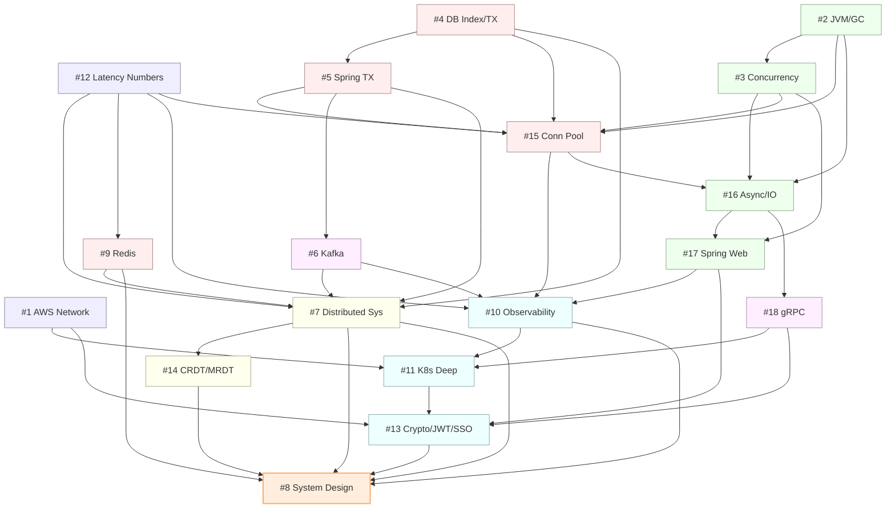

# msa Study — Master Index

> 19개 학습 주제의 단일 entry point. 각 주제 카드, 학습 순서 추천, 영역별 그루핑, 의존 그래프, 키워드 검색 인덱스를 제공한다.
> 산출물 통계 (2026-05-04 기준): **19개 주제 / 386개 deep file / 약 114,294 줄**. (#19 검색엔진 추가 + Top-12 deep-dive 12개 (22~33) + 19개 주제 모두에 `99-concept-catalog.md` 추가, 2026-05-03 ~ 2026-05-04)
>
> **99-concept-catalog 사용 안내**: 각 주제 디렉토리의 `99-concept-catalog.md` 는 공식 reference 기준 풀 개념 매트릭스 + 갭 진단 + 우선 심화 후보 + 표준 deep-dive 템플릿. 새 학습 시작점 또는 review 시 첫 진입 권장.

---

## 0. 빠른 진입

| 목적 | 진입 문서 |
|---|---|
| 주제별 한눈에 보기 | [§1 한눈에 보기](#1-한눈에-보기) |
| 어떤 순서로 공부할지 | [§2 학습 순서 추천](#2-학습-순서-추천-bottom-up) |
| 영역(런타임 / DB / 분산 등)별 묶음 | [§3 영역별 그루핑](#3-영역별-그루핑) |
| 주제 간 의존 관계 그래프 | [§4 의존 그래프](#4-의존-그래프) |
| 주제별 1-2 문단 요약 + 링크 | [§5 주제별 카드](#5-주제별-카드) |
| 키워드로 주제 찾기 | [§6 키워드 검색 인덱스](#6-키워드-검색-인덱스) |
| msa 코드와의 연관도 | [§7 코드베이스 연관도](#7-코드베이스-연관도) |
| ADR 후보 / 다음 단계 | [§8 다음 단계](#8-다음-단계) |

---

## 1. 한눈에 보기

| # | 주제 | 난이도 | 시간 | 파일 | 줄 | 코드 연관 | 상태 |
|---|---|---|---|---|---|---|---|
| 1 | [AWS 네트워크 인프라](1-aws-network/) | intermediate-to-advanced | 35h | 21 | 5,492 | true | completed (19 deep) |
| 2 | [JVM 내부 + GC 튜닝](2-jvm-gc/) | advanced | 35h | 24 | 8,190 | true | completed (22 deep) |
| 3 | [Java/Kotlin 동시성 심화](3-java-kotlin-concurrency/) | advanced | 25h | 26 | 7,079 | true | completed (24 deep) |
| 4 | [DB 인덱스 + 트랜잭션 격리](4-db-index-transaction/) | advanced | 25h | 20 | 5,107 | true | completed (18 deep) |
| 5 | [Spring Transactional 심화](5-spring-transactional/) | intermediate | 12h | 16 | 4,973 | true | completed (14 deep) |
| 6 | [Kafka 내부 동작](6-kafka-internals/) | advanced | 20h | 15 | 3,666 | true | completed (13 deep) |
| 7 | [분산 시스템 이론 + 패턴](7-distributed-systems/) | advanced | 18h | 22 | 6,360 | true | completed (20 deep) |
| 8 | [시스템 설계 시나리오 10선](8-system-design/) | advanced | 30h | 15 | 4,596 | false | completed (13 deep) |
| 9 | [Redis 심화](9-redis-deep-dive/) | intermediate | 15h | 21 | 5,101 | true | completed (19 deep) |
| 10 | [Observability 3축](10-observability/) | intermediate | 18h | 16 | 5,341 | true | completed (14 deep) |
| 11 | [K8s 심화 + 배포 전략](11-k8s-deep-dive/) | intermediate | 20h | 19 | 6,270 | true | completed (17 deep) |
| 12 | [Latency Numbers](12-latency-numbers/) | intermediate | 24h | 14 | 3,180 | true | completed (12 deep) |
| 13 | [암호화 · JWT · SSO · KMS](13-crypto-jwt-sso/) | advanced | 34h | 22 | 2,597 | true | completed (20 deep) |
| 14 | [CRDT · MRDT](14-crdt-mrdt/) | advanced | 14h | 21 | 4,968 | false | completed (19 deep) |
| 15 | [커넥션 풀 심화 (HikariCP · R/W · Redis Pool)](15-connection-pool/) | intermediate | 12h | 20 | 6,020 | true | completed (18 deep) |
| 16 | [비동기 · 논블로킹 IO (NIO · Reactor · Netty)](16-async-nonblocking-io/) | advanced | 18h | 21 | 6,547 | true | completed (19 deep) |
| 17 | [Spring Web 처리 심화 (Filter · Interceptor · AOP · Jackson · gzip)](17-spring-web/) | intermediate | 14h | 22 | 5,279 | true | completed (20 deep) |
| 18 | [gRPC 심화 (Protobuf · HTTP/2 · Streaming)](18-grpc/) | intermediate | 14h | 22 | 6,297 | false | completed (20 deep) |
| 19 | [검색엔진 심화 (ES · OpenSearch · Hybrid · BM25 · nori)](19-search-engine/) | advanced | 32h | 35 | 13,051 | true | completed (20 deep + 99 catalog + 22~33 보강 12) |

**합계**: 19 주제 / 455h 학습 시간 추정 / 368 file / 110,114 line.

> "코드 연관" false 인 주제 (8/14/18) 도 msa 적용 가능성 검토 섹션을 가진다 — false 의 의미는 "현재 코드에 직접 매핑되는 구현이 적다" 정도로 해석.

---

## 2. 학습 순서 추천 (Bottom-up)

총 8개 Tier. 아래 Tier 가 위 Tier 의 어휘를 깐다. 각 주제명 옆 괄호는 예상 시간.

### Tier 0 — 기초 인프라 / 자릿수 감각

먼저 깔아야 위쪽 토론이 정량적으로 가능해진다.

- **[#12 Latency Numbers](12-latency-numbers/)** (24h) — 자릿수 어휘 (ns/µs/ms). 후속 주제 모두에서 재사용.
- **[#1 AWS 네트워크 인프라](1-aws-network/)** (35h) — VPC (Virtual Private Cloud, 가상 사설 클라우드) /SG (Security Group, 보안 그룹) /ALB (Application Load Balancer, 애플리케이션 로드 밸런서) /NLB (Network Load Balancer, 네트워크 로드 밸런서) 기본. K8s (Kubernetes) 토론의 물리 토대.

### Tier 1 — 런타임 / 언어

JVM 위에서 동작하는 모든 서비스의 토대.

- **[#2 JVM 내부 + GC 튜닝](2-jvm-gc/)** (35h) — 메모리 / GC (Garbage Collection, 가비지 컬렉션) / 진단 3-Layer (JVM = Java Virtual Machine, 자바 가상 머신).
- **[#3 Java/Kotlin 동시성](3-java-kotlin-concurrency/)** (25h) — JMM / synchronized / coroutine / Virtual Threads. #2 와 짝.

### Tier 2 — 저장소 / 데이터

스토리지 계층의 일관성 / 동시성.

- **[#4 DB 인덱스 + 트랜잭션 격리](4-db-index-transaction/)** (25h) — B+Tree / MVCC (Multi-Version Concurrency Control, 다중 버전 동시성 제어) / Lock / EXPLAIN.
- **[#5 Spring Transactional 심화](5-spring-transactional/)** (12h) — #4 의 application 레이어.
- **[#15 커넥션 풀 심화](15-connection-pool/)** (12h) — HikariCP / Lettuce / R/W 분리. #5 와 직결.
- **[#9 Redis 심화](9-redis-deep-dive/)** (15h) — 캐시 / 분산락 / Stream.

### Tier 3 — 메시징

비동기 통신과 동기 RPC.

- **[#6 Kafka 내부 동작](6-kafka-internals/)** (20h) — Broker / Consumer / EOS.
- **[#18 gRPC 심화](18-grpc/)** (14h) — Protobuf / HTTP/2 / Streaming (gRPC = gRPC Remote Procedure Call, RPC (Remote Procedure Call, 원격 프로시저 호출) 프레임워크).

### Tier 4 — 분산 / 데이터 동기화

여러 노드/리전에서의 일관성과 충돌 해소.

- **[#7 분산 시스템 이론 + 패턴](7-distributed-systems/)** (18h) — CAP (Consistency / Availability / Partition tolerance, 일관성·가용성·분할 내성) /PACELC (Partition → Availability/Consistency, Else → Latency/Consistency) /Saga/Idempotency/CB.
- **[#14 CRDT · MRDT](14-crdt-mrdt/)** (14h) — multi-master 충돌의 자동 merge.

### Tier 5 — IO / 웹 처리

응용 계층의 IO (Input/Output, 입출력) 와 요청 파이프라인.

- **[#16 비동기 · 논블로킹 IO](16-async-nonblocking-io/)** (18h) — NIO (Non-blocking I/O, 비차단 입출력) / Netty / Reactor / WebFlux.
- **[#17 Spring Web 처리 심화](17-spring-web/)** (14h) — Filter / Interceptor / AOP (Aspect-Oriented Programming, 관점 지향 프로그래밍) / Jackson / gzip.

### Tier 6 — 관측 / 운영 / 보안 / 인프라

배포 / 관측 / 보안.

- **[#10 Observability 3축](10-observability/)** (18h) — Metrics / Logs / Traces + SLO (Service Level Objective, 서비스 수준 목표).
- **[#11 K8s 심화 + 배포 전략](11-k8s-deep-dive/)** (20h) — CRD (Custom Resource Definition, 커스텀 리소스 정의) / Operator / GitOps.
- **[#13 암호화 · JWT · SSO · KMS](13-crypto-jwt-sso/)** (34h) — AES (Advanced Encryption Standard, 고급 암호화 표준) / JWT (JSON Web Token) / OIDC (OpenID Connect) / KMS (Key Management Service, 키 관리 서비스) / mTLS (mutual TLS, 양방향 TLS) / SSO (Single Sign-On, 단일 로그인).

### Tier 7 — 시스템 설계 통합

위 모든 어휘를 동원하는 종합 응용.

- **[#8 시스템 설계 시나리오 10선](8-system-design/)** (30h) — URL Shortener / Chat / Feed / Payment / Rate Limiter / Notification / Ticketing / Search / Commerce / Map.

> #12 학습자가 추천한 단축 경로: `12 → 7 → 9 → 10 → 8` (자릿수 → 분산 → Redis → 관측 → 설계).

---

## 3. 영역별 그루핑

### 3.1 런타임 / 언어

| # | 주제 | 핵심 |
|---|---|---|
| 2 | [JVM/GC](2-jvm-gc/) | Heap/Metaspace, G1/ZGC, Heap Dump |
| 3 | [동시성](3-java-kotlin-concurrency/) | JMM, synchronized, coroutine, Virtual Threads |
| 16 | [Async/IO](16-async-nonblocking-io/) | NIO Selector, Reactor, Netty, Backpressure |
| 17 | [Spring Web](17-spring-web/) | Filter/Interceptor/AOP, Jackson, gzip |

### 3.2 저장소 / 데이터

| # | 주제 | 핵심 |
|---|---|---|
| 4 | [DB Index/TX](4-db-index-transaction/) | B+Tree, MVCC, Gap Lock, EXPLAIN |
| 5 | [Spring TX](5-spring-transactional/) | 프록시, 전파, readOnly + replica routing |
| 9 | [Redis](9-redis-deep-dive/) | 자료구조 인코딩, Cluster, Stampede, 분산락 |
| 15 | [Connection Pool](15-connection-pool/) | HikariCP 내부, Lettuce, R/W 분리 |
| 14 | [CRDT/MRDT](14-crdt-mrdt/) | SEC/Semilattice, OR-Set, Yjs/Automerge |
| 19 | [검색엔진](19-search-engine/) | Lucene, BM25 (Best Match 25), nori, Vector/HNSW (Hierarchical Navigable Small World), RRF (Reciprocal Rank Fusion, 상호 순위 융합), Outbox→ES (Elasticsearch) |

### 3.3 메시징

| # | 주제 | 핵심 |
|---|---|---|
| 6 | [Kafka](6-kafka-internals/) | Producer/Broker/Consumer, Rebalance, EOS, DLQ |
| 18 | [gRPC](18-grpc/) | Protobuf, HTTP/2, 4 호출 패턴, K8s LB |

### 3.4 분산 / 아키텍처

| # | 주제 | 핵심 |
|---|---|---|
| 7 | [분산시스템](7-distributed-systems/) | CAP/PACELC, Raft, Saga, Outbox, CB |
| 8 | [System Design](8-system-design/) | 10 시나리오 + 추정 + 30분 면접 절차 |

### 3.5 관측 / 운영 / 인프라

| # | 주제 | 핵심 |
|---|---|---|
| 1 | [AWS Network](1-aws-network/) | VPC/SG/NACL/ALB/NLB/EKS |
| 10 | [Observability](10-observability/) | Prometheus/Loki/OTel + SLO Burn Rate |
| 11 | [K8s Deep](11-k8s-deep-dive/) | Control Plane / CRD / GitOps / Argo |
| 12 | [Latency Numbers](12-latency-numbers/) | 자릿수 사다리, P99/fan-out |
| 13 | [Crypto/JWT/SSO/KMS](13-crypto-jwt-sso/) | AES/JWT/OIDC/KMS/mTLS |

---

## 4. 의존 그래프

각 주제가 어느 주제의 어휘에 의존하는지 (mermaid).

> 전체 토론의 정점은 **#8 System Design** — 다른 17개 주제가 어휘를 공급한다.

---

## 5. 주제별 카드

각 카드: 폴더 / preview / 면접 / 핵심 / 관련 주제 / msa 적용 메모.

### #1 AWS 네트워크 인프라

- **폴더**: [1-aws-network/](1-aws-network/)
- **미리보기**: [00-preview.md](1-aws-network/00-preview.md) · **계획**: [00-plan.md](1-aws-network/00-plan.md) · **면접**: [19-interview-qa.md](1-aws-network/19-interview-qa.md)
- **핵심**: VPC를 회사 전용 건물 단지로 본다. 서브넷(층) / IGW(정문) / SG(카드, stateful) / NACL(층 출입판, stateless) / NAT GW(택배 접수처) / ALB(L7 리셉셔니스트) / NLB(L4 우체국). 면접 빈출인 SG↔NACL 차이, ALB↔NLB 선택, NAT GW 비용 회피 (VPC Endpoint), Cross-AZ (Availability Zone, 가용 영역) $0.01/GB 양방향 비용, EKS VPC CNI 까지.
- **관련 주제**: #11 K8s (EKS 매핑) · #12 Latency (DC↔리전 RTT) · #13 mTLS (서비스 메시).
- **msa 적용**: `k8s/overlays/prod-k8s/`, `k8s/base/frontend-ingress.yaml` Ingress 라우팅에 ALB/NLB 매핑 가이드 제공.

### #2 JVM 내부 + GC 튜닝

- **폴더**: [2-jvm-gc/](2-jvm-gc/)
- **미리보기**: [00-preview.md](2-jvm-gc/00-preview.md) · **계획**: [00-plan.md](2-jvm-gc/00-plan.md) · **개선안**: [21-improvements.md](2-jvm-gc/21-improvements.md) · **면접**: [22-interview-qa.md](2-jvm-gc/22-interview-qa.md)
- **핵심**: "메모리 → GC → 진단" 3-Layer. JDK 21~25 LTS 범위. G1 (region/RSet/Mixed) / ZGC (colored pointer/load barrier) / Shenandoah / GC 로그 / NMT / 5종 OOM / Heap Dump (MAT) / JIT (C1·C2·Inlining·Escape Analysis) / JFR / JMH. 컨테이너에서는 `-XX:MaxRAMPercentage` 가 절대값 `-Xmx` 보다 안전.
- **관련 주제**: #3 Concurrency (Thread Dump 조합) · #15 Conn Pool (메모리 회계) · #11 K8s (resources.limits) · #10 Observability (Micrometer JVM 메트릭).
- **msa 적용**: `commerce.jib-convention.gradle.kts` 의 jvmFlags 보강이 ADR-0028 후보 (P0).

### #3 Java/Kotlin 동시성 심화

- **폴더**: [3-java-kotlin-concurrency/](3-java-kotlin-concurrency/)
- **미리보기**: [00-preview.md](3-java-kotlin-concurrency/00-preview.md) · **계획**: [00-plan.md](3-java-kotlin-concurrency/00-plan.md) · **면접**: [24-interview-qa.md](3-java-kotlin-concurrency/24-interview-qa.md)
- **핵심**: "스택 4층 + 진단 1층". JMM happens-before / synchronized 내부 lock 진화 / volatile / Atomic CAS / ReentrantLock·StampedLock / ThreadPool / ConcurrentHashMap (Java 8 bin synchronized + CAS) / CompletableFuture / Kotlin coroutine (Continuation state machine) / Flow/Channel / Structured Concurrency / Virtual Threads (JEP 491 pinning 해소) / false sharing. **운영 진단**: 5초 간격 3-5회 thread dump, BLOCKED lock id 매칭, async-profiler / JFR Lock Inflation.
- **관련 주제**: #2 JVM (스레드 덤프 + 힙 덤프 cross-check) · #15 Conn Pool · #16 Async/IO · #5 Spring TX (suspend + Transactional 함정).
- **msa 적용**: `@Async`, Kafka concurrency, Redis 분산락, JPA Optimistic Lock 사용처 점검.

### #4 DB 인덱스 + 트랜잭션 격리

- **폴더**: [4-db-index-transaction/](4-db-index-transaction/)
- **미리보기**: [00-preview.md](4-db-index-transaction/00-preview.md) · **계획**: [00-plan.md](4-db-index-transaction/00-plan.md) · **개선안**: [17-improvements.md](4-db-index-transaction/17-improvements.md) · **면접**: [18-interview-qa.md](4-db-index-transaction/18-interview-qa.md)
- **핵심**: "디스크 → 페이지 → B+Tree → MVCC → Lock → 옵티마이저" 6층 사다리. InnoDB clustered index = PK / secondary leaf = PK / MVCC undo log + Read View / S·X·IS·IX + Record/Gap/Next-Key/Insert Intention / REPEATABLE READ + Gap Lock = phantom 차단 / EXPLAIN type/key/rows/Extra / 복합 인덱스 (=,IN,범위,정렬) / Online DDL / MDL.
- **관련 주제**: #5 Spring TX · #15 Conn Pool · #7 분산시스템 (단일 DB vs 분산 TX) · #6 Kafka (Outbox 폴링과 Gap Lock) · #10 Observability (slow query log).
- **msa 적용**: 11개 서비스 `@Table indexes` / Flyway DDL 점검, OutboxRelay 쿼리 검토.

### #5 Spring Transactional 심화

- **폴더**: [5-spring-transactional/](5-spring-transactional/)
- **미리보기**: [00-preview.md](5-spring-transactional/00-preview.md) · **계획**: [00-plan.md](5-spring-transactional/00-plan.md) · **개선안**: [13-improvements.md](5-spring-transactional/13-improvements.md) · **면접**: [14-interview-qa.md](5-spring-transactional/14-interview-qa.md)
- **핵심**: "프록시 → 트랜잭션 메타 → 라우팅 → 분리" 4계층. AOP CGLIB/JDK / self-invocation / Checked rollback X / 7 전파 / 격리 / **readOnly = FlushMode.MANUAL + AbstractRoutingDataSource 라우팅 키** / LazyConnectionDataSourceProxy / `{Entity}TransactionalService` 분리 / Outbox / `@TransactionalEventListener(AFTER_COMMIT)` / Saga / `UnexpectedRollbackException`. Kotlin 함정: kotlin-spring 플러그인의 자동 open, suspend 와 ThreadLocal 분리.
- **관련 주제**: #4 DB Index/TX · #15 Conn Pool · #6 Kafka (Outbox) · #7 분산시스템 (Saga).
- **msa 적용**: ADR-0020/0022 정합 점검 + Read-after-Write Stickiness ADR 후보 (ADR-0029).

### #6 Kafka 내부 동작

- **폴더**: [6-kafka-internals/](6-kafka-internals/)
- **미리보기**: [00-preview.md](6-kafka-internals/00-preview.md) · **계획**: [00-plan.md](6-kafka-internals/00-plan.md) · **개선안**: [13-improvements.md](6-kafka-internals/13-improvements.md) · **면접**: [12-interview-qa.md](6-kafka-internals/12-interview-qa.md)
- **핵심**: "분산 커밋 로그 사다리" 5층. Broker (segment / page cache / sendfile zero-copy) / Producer (acks=all + idempotence) / Consumer (Cooperative-Sticky, max.poll.interval) / Replication (ISR / HW / unclean.leader.election) / EOS (Producer Tx + Consumer read_committed) / KRaft / DLQ / 멱등 Consumer (processed_event 테이블).
- **관련 주제**: #7 분산시스템 (Saga, Outbox) · #5 Spring TX (Outbox 폴링) · #4 DB (Gap Lock) · #10 Observability (consumer lag).
- **msa 적용**: 7개 서비스의 producer/consumer 설정 grep, KRaft 마이그레이션 점검, EOS 도입 검토.

### #7 분산 시스템 이론 + 패턴

- **폴더**: [7-distributed-systems/](7-distributed-systems/)
- **미리보기**: [00-preview.md](7-distributed-systems/00-preview.md) · **계획**: [00-plan.md](7-distributed-systems/00-plan.md) · **개선안**: [19-improvements.md](7-distributed-systems/19-improvements.md) · **면접**: [20-interview-qa.md](7-distributed-systems/20-interview-qa.md)
- **핵심**: "6층 케이크" — 이론(CAP/PACELC/FLP) → 합의(Raft/Paxos) → 시간/일관성(Lamport/Vector/HLC) → 트랜잭션(2PC/Saga/Idempotency) → 운영(CB/Bulkhead/Retry+Backoff/RL/분산락) → 거버넌스(Outbox/CDC/ES/CQRS/EOS). 2PC 는 거의 안 씀, MSA = Saga + Outbox 가 표준. RedLock 보다 단일 마스터 + fencing token.
- **관련 주제**: #14 CRDT (시계/일관성) · #6 Kafka (Outbox) · #9 Redis (분산락) · #16 Async/IO (Backpressure).
- **msa 적용**: ADR-0011/0012/0013/0015 종합 평가 + Saga Orchestrator / Inbox / ES 도입 검토.

### #8 시스템 설계 시나리오 10선

- **폴더**: [8-system-design/](8-system-design/)
- **미리보기**: [00-preview.md](8-system-design/00-preview.md) · **계획**: [00-plan.md](8-system-design/00-plan.md)
- **핵심**: 10개 시나리오를 4사분면 (Read/Write × Stateless/Stateful) 으로 묶어 패턴 학습. 30분 면접 표준 절차 (5분 요구사항 + 5분 추정 + 10분 high-level + 10분 deep dive). URL Shortener / Chat / Feed / Payment / Rate Limiter / Notification / Ticketing / Search / Commerce / Map. msa 자체를 e-Commerce (10) 회고로 활용.
- **관련 주제**: 사실상 모든 주제 (특히 #7 분산시스템, #9 Redis, #6 Kafka, #4 DB).
- **msa 적용**: Rate Limiter (06) ↔ gateway 의 Token Bucket / Search (09) ↔ search 모듈 4개 / Commerce (10) ↔ 전체 msa 아키텍처.

### #9 Redis 심화

- **폴더**: [9-redis-deep-dive/](9-redis-deep-dive/)
- **미리보기**: [00-preview.md](9-redis-deep-dive/00-preview.md) · **계획**: [00-plan.md](9-redis-deep-dive/00-plan.md) · **개선안**: [18-improvements.md](9-redis-deep-dive/18-improvements.md) · **면접**: [19-interview-qa.md](9-redis-deep-dive/19-interview-qa.md)
- **핵심**: "한 줄 머신 위 5개 층". 단일 스레드 + epoll / 8 자료구조 + 자동 인코딩 변환 (listpack ↔ hashtable, intset ↔ skiplist) / RDB fork+CoW / AOF everysec / Sentinel / Cluster 16384 슬롯 + MOVED/ASK / hash tag / Cache-Aside / Stampede 방어 (XFetch / 분산락 / TTL jitter) / SETNX + owner token + Lua / RedLock 비판 + fencing / Stream + Consumer Group.
- **관련 주제**: #7 분산시스템 (분산락) · #15 Conn Pool (Lettuce vs Jedis) · #10 Observability · #6 Kafka (Stream 비교).
- **msa 적용**: gateway Token Bucket / standalone Redis 5 서비스 / Stampede 방어 검토 / big key 모니터링.

### #10 Observability 3축

- **폴더**: [10-observability/](10-observability/)
- **미리보기**: [00-preview.md](10-observability/00-preview.md) · **계획**: [00-plan.md](10-observability/00-plan.md) · **개선안**: [13-improvements.md](10-observability/13-improvements.md) · **면접**: [14-interview-qa.md](10-observability/14-interview-qa.md)
- **핵심**: "MELT 4축 + Correlation Glue". Metrics (Prometheus pull + Histogram > Summary + Cardinality 폭발) / Logs (ELK vs Loki, JSON + MDC + Trace ID + PII 마스킹) / Traces (OpenTelemetry SDK + Tempo + W3C traceparent + head/tail sampling) / SLO (행복한 사용자 비율) + multi-window burn rate / eBPF Profiling (Pyroscope/Parca, "4번째 pillar"). Exemplar 로 metric → trace → log drill-down.
- **관련 주제**: #2 JVM (JFR) · #15 Conn Pool (HikariCP MicroMeter) · #17 Spring Web (Interceptor trace ID) · #11 K8s (kube-prometheus-stack) · ADR-0025 (Latency Budget).
- **msa 적용**: ServiceMonitor 활용 + Loki 도입 + OpenTelemetry 표준화 + RED/USE 대시보드 ADR (ADR-0030 후보, 6개 주제에서 동시 제기).

### #11 K8s 심화 + 배포 전략

- **폴더**: [11-k8s-deep-dive/](11-k8s-deep-dive/)
- **미리보기**: [00-preview.md](11-k8s-deep-dive/00-preview.md) · **계획**: [00-plan.md](11-k8s-deep-dive/00-plan.md) · **개선안**: [16-improvements.md](11-k8s-deep-dive/16-improvements.md) · **면접**: [17-interview-qa.md](11-k8s-deep-dive/17-interview-qa.md)
- **핵심**: "K8s 7층 사다리" — Control Plane → Resource/Controller → Scheduling → Network → Mesh/Security → Deploy → GitOps. api-server 단일 게이트 / etcd Raft / Reconciliation Loop / CRD + Operator (controller-runtime/kubebuilder) / CNI (iptables vs IPVS vs eBPF) / Gateway API / NetworkPolicy / HPA + VPA + KEDA / Rolling/BG/Canary (Argo Rollouts) / Helm vs Kustomize / Argo CD / Sealed Secrets vs SOPS vs External Secrets / Istio/Linkerd Sidecar vs Ambient.
- **관련 주제**: #1 AWS Network (EKS) · #2 JVM (resources.limits) · #15 Conn Pool (HPA + DB max_conn) · #13 Crypto (Sealed Secrets / etcd at-rest) · #18 gRPC (Headless Service).
- **msa 적용**: NetworkPolicy deny-default / Argo CD 도입 / HPA Custom Metric (Kafka lag) / Sealed Secrets 정리.

### #12 Latency Numbers Every Programmer Should Know

- **폴더**: [12-latency-numbers/](12-latency-numbers/)
- **미리보기**: [00-preview.md](12-latency-numbers/00-preview.md) · **계획**: [00-plan.md](12-latency-numbers/00-plan.md) · **ADR 초안**: [12-adr-draft.md](12-latency-numbers/12-adr-draft.md) · **면접**: [11-interview-qa.md](12-latency-numbers/11-interview-qa.md)
- **핵심**: "자릿수 사다리 8자리수". 절대값 암기 X, **비율 5개**: L1→DRAM ×100, DRAM→SSD ×1000, SSD→DC RTT ×30, DC→대륙간 RTT ×300, 평균→P99 ×3~10. ns 그룹 (캐시/메모리) / µs 그룹 (SSD/같은 DC) / ms 그룹 (HDD seek/대륙간). tail latency + fan-out 곱셈 + Little's Law (L = λW).
- **관련 주제**: 후속 주제 모두에서 어휘 재사용. #7 분산시스템 (fan-out) · #9 Redis (캐시) · #10 Observability (P99 측정) · #8 System Design (추정).
- **msa 적용**: ADR-0025 Latency Budget 표준 (이미 등록).

### #13 암호화 · JWT · SSO · 클라우드 KMS

- **폴더**: [13-crypto-jwt-sso/](13-crypto-jwt-sso/)
- **미리보기**: [00-preview.md](13-crypto-jwt-sso/00-preview.md) · **계획**: [00-plan.md](13-crypto-jwt-sso/00-plan.md) · **코드 리팩터링**: [18-code-refactoring.md](13-crypto-jwt-sso/18-code-refactoring.md) · **면접**: [20-interview-qa.md](13-crypto-jwt-sso/20-interview-qa.md)
- **핵심**: "추상화 5층 사다리". (1) 빌딩 블록 — AES-256-GCM (AEAD) / argon2id / HMAC / Ed25519 / RSA-PSS. (2) JWT — HS/RS/ES + kid + jti, alg:none 화이트리스트. (3) SSO — OAuth2 + PKCE / OIDC (id_token + JWKS) / SAML XML-DSig + C14N + Wrapping Attack. (4) KMS — Envelope Encryption (GenerateDataKey) / 멀티 클라우드 / FIPS 140-2 Level / PKCS#11. (5) TLS 1.3 + mTLS + SPIFFE/SPIRE.
- **관련 주제**: #11 K8s (Sealed Secrets / etcd 암호화) · #18 gRPC (mTLS / JWT metadata) · #10 Observability (PII 로그 마스킹) · #7 분산시스템 (jti replay 방어).
- **msa 적용**: `JwtUtil` kid + 키 회전, `AesUtil` KMS Envelope 연동, Refresh Rotation 도입. (sub/jti/iss/aud/kid 클레임 보강 commit 0d50841 완료).

### #14 CRDT · MRDT — 분산 데이터 동기화

- **폴더**: [14-crdt-mrdt/](14-crdt-mrdt/)
- **미리보기**: [00-preview.md](14-crdt-mrdt/00-preview.md) · **계획**: [00-plan.md](14-crdt-mrdt/00-plan.md) · **개선안**: [18-improvements.md](14-crdt-mrdt/18-improvements.md) · **면접**: [19-interview-qa.md](14-crdt-mrdt/19-interview-qa.md)
- **핵심**: "수렴 사다리" — SEC + semilattice 가 수렴 보장의 비밀. CvRDT (state) vs CmRDT (op). Counter (G/PN) / Set (G/2P/OR/LWW-Element) / Register (LWW/MV) / Map / Sequence (Logoot/RGA/Yata) / JSON CRDT (Yjs/Automerge) / Causal Context (dot) / Delta-CRDT / GC + Causal Stability / MRDT (Irmin Git-style 3-way merge) / OT 비교 / BFT-CRDT. **결론: 현 msa 는 single-region single-master → CRDT 보류 ADR**.
- **관련 주제**: #7 분산시스템 (Vector Clock / Eventual Consistency) · #4 DB (multi-master 충돌).
- **msa 적용**: 보류 (트리거 조건 — multi-region 백업 / multi-device wishlist 동기화 등).

### #15 커넥션 풀 심화 (HikariCP · R/W · Redis Pool)

- **폴더**: [15-connection-pool/](15-connection-pool/)
- **미리보기**: [00-preview.md](15-connection-pool/00-preview.md) · **계획**: [00-plan.md](15-connection-pool/00-plan.md) · **개선안**: [17-improvements.md](15-connection-pool/17-improvements.md) · **면접**: [18-interview-qa.md](15-connection-pool/18-interview-qa.md)
- **핵심**: "외부 자원 풀 4축" — 자원 비용 / 동시성 매핑 / 상태/수명 / 라우팅. HikariCP 가 빠른 이유 = ConcurrentBag (ThreadLocal + handoff queue) + FastList (synchronized 제거) + ProxyConnection (javassist). pool size = "동시 진행 쿼리 수" (Little's Law). `maxLifetime < DB wait_timeout - 30s`. AbstractRoutingDataSource + LazyConnectionDataSourceProxy + readOnly 결합. Lettuce (single connection multiplex) vs Jedis (commons-pool2).
- **관련 주제**: #5 Spring TX (replica routing) · #4 DB · #2 JVM · #16 Async/IO (R2DBC) · #11 K8s (HPA × pool 폭증).
- **msa 적용**: 11개 서비스 hikari 설정 점검 + Read-after-Write Stickiness ADR 후보 (ADR-0029).

### #16 비동기 · 논블로킹 IO (NIO · Reactor · Netty)

- **폴더**: [16-async-nonblocking-io/](16-async-nonblocking-io/)
- **미리보기**: [00-preview.md](16-async-nonblocking-io/00-preview.md) · **계획**: [00-plan.md](16-async-nonblocking-io/00-plan.md) · **개선안**: [18-improvements.md](16-async-nonblocking-io/18-improvements.md) · **면접**: [19-interview-qa.md](16-async-nonblocking-io/19-interview-qa.md)
- **핵심**: "IO 스택 4층" — OS → Java → 라이브러리 → 어플리케이션. C10K, IO 의 두 단계 (대기 + 복사), 4 모델 (blocking/non-blocking/multiplex/async). select → poll → epoll → io_uring. Java NIO Channel/Buffer/Selector + Direct Buffer + sendfile. Reactor (Linux) vs Proactor (Windows). Netty EventLoop + ChannelHandler + ByteBuf 참조 카운팅. Project Reactor Mono/Flux + Schedulers + Backpressure (request(n)). **WebFlux vs MVC + Virtual Threads** — VT 가 대부분 더 단순.
- **관련 주제**: #3 Concurrency · #2 JVM · #15 Conn Pool · #17 Spring Web · #18 gRPC (HTTP/2).
- **msa 적용**: gateway WebFlux 분석, Lettuce/Kafka NIO, HTTP client 선택 (WebClient vs RestClient vs OkHttp).

### #17 Spring Web 처리 심화 (Filter · Interceptor · AOP · Jackson · gzip)

- **폴더**: [17-spring-web/](17-spring-web/)
- **미리보기**: [00-preview.md](17-spring-web/00-preview.md) · **계획**: [00-plan.md](17-spring-web/00-plan.md) · **개선안**: [19-improvements.md](17-spring-web/19-improvements.md) · **면접**: [20-interview-qa.md](17-spring-web/20-interview-qa.md)
- **핵심**: "HTTP 한 통의 여행 일지 8 관문". Reverse Proxy → Tomcat → **Servlet Filter** (DispatcherServlet 밖) → DispatcherServlet → **HandlerInterceptor** (안, HandlerMethod 접근) → AOP Proxy → Controller → ResponseBodyAdvice → Converter → Filter (response). Spring Security FilterChainProxy = DelegatingFilterProxy → 13 SecurityFilter. AOP self-invocation 함정. **Jackson** ObjectMapper 싱글톤 + **Default Typing 절대 금지** (CVE 줄줄). **gzip** 은 Reverse Proxy 단일 위치 + BREACH 방어 (민감 body 비활성).
- **관련 주제**: #5 Spring TX (AOP self-invocation) · #16 Async/IO (WebFlux WebFilter) · #10 Observability (trace ID MDC) · #13 Crypto (BREACH).
- **msa 적용**: gateway Filter chain 분석, common ObjectMapper 통일, gzip 위치 ADR 후보.

### #18 gRPC 심화 (Protobuf · HTTP/2 · Streaming)

- **폴더**: [18-grpc/](18-grpc/)
- **미리보기**: [00-preview.md](18-grpc/00-preview.md) · **계획**: [00-plan.md](18-grpc/00-plan.md) · **개선안**: [19-improvements.md](18-grpc/19-improvements.md) · **면접**: [20-interview-qa.md](18-grpc/20-interview-qa.md)
- **핵심**: "4층 스택". Protobuf (varint / tag-wire-type / field number 불변 / reserved) → HTTP/2 (binary framing / multiplexing / HPACK / flow control / h2c) → 4 호출 패턴 (Unary / Server-streaming / Client-streaming / Bidi) → 운영 (Deadline propagation / Metadata / Interceptor / Status code 16 / mTLS / JWT). **K8s ClusterIP 로 gRPC LB 안 됨** (단일 TCP 위 multiplexing → Headless Service + client-side LB 또는 Envoy).
- **관련 주제**: #6 Kafka (동기 RPC vs 비동기 이벤트 분담) · #11 K8s (Headless Service / xDS) · #13 Crypto (mTLS) · #16 Async/IO (HTTP/2).
- **msa 적용**: REST → gRPC 가상 마이그레이션 시나리오 (gateway↔auth / order↔inventory / search↔product), 부분/보류 ADR.

### #19 검색엔진 심화 (ES · OpenSearch · Hybrid · Re-Rank · BM25 · nori)

- **폴더**: [19-search-engine/](19-search-engine/)
- **미리보기**: [00-preview.md](19-search-engine/00-preview.md) · **계획**: [00-plan.md](19-search-engine/00-plan.md) · **개선안**: [19-improvements.md](19-search-engine/19-improvements.md) · **면접**: [20-interview-qa.md](19-search-engine/20-interview-qa.md)
- **핵심**: "5층 스택". Lucene (segment / refresh ≠ flush ≠ commit / translog / merge) → Analyzer (nori decompound 3-mode / 사용자 사전 / search_analyzer 분리) → 스코어링 (BM25 k1·b / function_score / Vector dense_vector + HNSW) → 검색 품질 (Hybrid RRF / Re-Rank cross-encoder + LTR) → 동기화 (Outbox vs Debezium CDC / version_type=external / 색인 lag SLA) + 운영 (cluster health / shard 산정 / RTO).
- **관련 주제**: #4 DB (RDB 와의 비교, B-Tree vs Inverted Index) · #6 Kafka (Outbox / 멱등 consumer) · #7 분산시스템 (eventual consistency) · #9 Redis (보조 저장소 패턴) · #11 K8s (ECK / OpenSearch Operator).
- **msa 적용**: search 서비스 4-모듈 (`domain/app/consumer/batch`) 직접 분석 + 강점 10개 / 점검 17개 / **ADR 후보 4건** (lag SLA / 변동성 필드 컨벤션 / ES vs OpenSearch 일원화 / Hybrid Search 도입) + Hybrid Search PoC 코드.

---

## 6. 키워드 검색 인덱스

자주 쓰는 키워드 → 등장 주제. (한국어 가나다 + 알파벳 순)

| 키워드 | 주제 |
|---|---|
| ACID | #4 |
| AES / AES-GCM | #13 |
| AOF | #9 |
| AOP / Spring AOP | #5, #17 |
| ALB / NLB | #1 |
| Argon2id | #13 |
| Argo CD / Argo Rollouts | #11 |
| AsynchronousChannel / AIO | #16 |
| Autoscaling / HPA / VPA / KEDA | #11 |
| Backpressure | #16, #7 |
| BREACH / CRIME | #13, #17 |
| B+Tree / B-Tree | #4 |
| CAP / PACELC / FLP | #7 |
| Cardinality | #10 |
| Cache Stampede / XFetch | #9 |
| CDN | #8 |
| Circuit Breaker | #7, #18 |
| ConcurrentBag / FastList | #15 |
| ConcurrentHashMap | #3 |
| consistency 모델 | #4, #5, #7, #14 |
| Cooperative-Sticky / Rebalance | #6 |
| Coroutine | #3, #16 |
| CQRS / Event Sourcing | #7 |
| CRDT / OR-Set / LWW | #14 |
| Cross-AZ 비용 | #1, #11 |
| CSI / StorageClass / PVC | #11 |
| CSRF / CORS | #17 |
| Custom Metric | #11, #10 |
| Deadline propagation | #18 |
| Deadlock | #3, #4, #7 |
| DLQ / Dead Letter | #6, #7 |
| EKS / VPC CNI | #1, #11 |
| epoll / select / poll | #16 |
| Envelope Encryption / KMS | #13 |
| EOS (Exactly-Once) | #6, #7 |
| EXPLAIN / 실행 계획 | #4 |
| fan-out | #8, #12 |
| fencing token | #7, #9 |
| Filter / Interceptor | #17 |
| FlushMode (MANUAL / AUTO) | #5 |
| G1GC / ZGC / Shenandoah | #2 |
| Gap Lock / Next-Key Lock | #4 |
| Gateway API (K8s) | #11 |
| GitOps | #11 |
| gRPC / Protobuf / HTTP/2 | #18 |
| gzip / brotli / zstd | #17 |
| happens-before / JMM | #3 |
| Heap Dump / MAT | #2 |
| Helm / Kustomize | #11 |
| HikariCP | #15 |
| HMAC | #13 |
| HPA / VPA | #11 |
| HSM / FIPS 140 | #13 |
| Idempotency / 멱등성 | #6, #7, #5 |
| Index Merge / Covering Index | #4 |
| io_uring | #16 |
| Istio / Linkerd / Service Mesh | #11, #13 |
| JFR / JMC / JMH | #2 |
| Jib / jvmFlags | #2 |
| JMM (Java Memory Model) | #3 |
| JIT (C1/C2/Inlining/Escape) | #2 |
| Jackson Default Typing (CVE) | #17 |
| JWT (HS/RS/ES + kid + jti) | #13 |
| Kafka KRaft | #6 |
| LazyConnectionDataSourceProxy | #5, #15 |
| Lettuce / Jedis | #15, #16, #9 |
| Little's Law | #12, #15 |
| Loki / ELK / Vector | #10 |
| Logoot / RGA / Yata | #14 |
| MDC / Trace ID 전파 | #10, #17 |
| MDL (Metadata Lock) | #4 |
| Micrometer / Actuator | #2, #10, #15 |
| mTLS / SPIFFE | #13, #18 |
| MVCC / Read View / undo log | #4 |
| NAT Gateway / VPC Endpoint | #1 |
| Netty EventLoop / ByteBuf | #16 |
| NetworkPolicy | #11 |
| NMT (Native Memory Tracking) | #2 |
| OAuth2 / PKCE | #13 |
| ObjectMapper (Jackson) | #17 |
| OIDC | #13 |
| OOM 5유형 | #2 |
| OpenTelemetry / W3C traceparent | #10 |
| Operator / CRD / kubebuilder | #11 |
| Outbox / Inbox / CDC | #6, #7, #5 |
| P99 / tail latency | #10, #12 |
| Paxos / Raft | #7 |
| PDB / topology spread | #11 |
| Probabilistic Early Expiration | #9 |
| Project Reactor (Mono/Flux) | #16 |
| ProxyConnection (Hikari) | #15 |
| Pub/Sub (Redis) | #9 |
| Quorum / R+W>N | #7 |
| Rate Limiting / Token Bucket | #7, #8, #9 |
| RDB / fork+CoW | #9 |
| readOnly + replica routing | #5, #15 |
| RedLock / Redisson | #7, #9 |
| Redis Cluster (16384 slot) | #9 |
| Reactor Pattern / Proactor | #16 |
| Reactive Streams | #16 |
| RED / USE / Golden Signals | #10 |
| Replica Lag | #5, #15 |
| Retry + Exponential Backoff + Jitter | #7 |
| Route 53 | #1 |
| Saga (Choreography vs Orchestration) | #7, #5 |
| Schema Registry / Buf | #6, #18 |
| Sealed Secrets / SOPS | #11, #13 |
| Security Group (SG) vs NACL | #1 |
| Self-invocation | #5, #17 |
| sendfile / zero-copy | #16, #6 |
| Sequence CRDT | #14 |
| SETNX | #9 |
| Sentinel / Replication (Redis) | #9 |
| Skiplist / Listpack / SDS | #9 |
| SLO / SLI / Error Budget / Burn Rate | #10 |
| StampedLock | #3 |
| StatefulSet / Headless Service | #11, #18 |
| Strong Eventual Consistency (SEC) | #14 |
| Structured Concurrency | #3 |
| synchronized lock 진화 (biased→light→heavy) | #3 |
| TCP/TLS handshake 비용 | #15, #16, #13 |
| Terraform vs CDK | #1 |
| Thread Dump (jstack/jcmd) | #3, #2 |
| TLS 1.2 vs 1.3 / 0-RTT / OCSP | #13 |
| trace 전파 / Exemplar | #10, #17 |
| Transactional 전파 / 격리 | #5, #4 |
| Transit Gateway / Peering / PrivateLink | #1 |
| Vector Clock / Lamport Clock / HLC | #7, #14 |
| Virtual Threads (Loom) | #3, #16 |
| volatile (Java) | #3 |
| W3C Trace Context | #10 |
| WebFlux vs MVC | #16, #17 |
| Wishlist / OR-Set 적용성 | #14 |
| XML-DSig / C14N / Wrapping | #13 |
| Yjs / Automerge | #14 |
| 로그 Correlation | #10, #17 |
| 멱등 Consumer (processed_event) | #6, #7 |
| 백프레셔 | #16, #7 |
| 분산락 | #3, #7, #9 |
| 비밀번호 해싱 | #13 |
| 시스템 설계 30분 표준 | #8 |
| 인덱스 안티패턴 | #4 |
| 자릿수 사다리 | #12 |
| 캐시 4 전략 (Aside/Through/Behind/Refresh) | #9 |
| 컨트롤 플레인 / 데이터 플레인 (K8s) | #11 |
| 컨테이너 메모리 회계 | #2, #11 |
| 키 회전 (kid / KMS rotation) | #13 |
| 페이지 (InnoDB 16KiB) | #4 |
| 풀 사이즈 산정 (Little's Law / PG 공식) | #15 |

---

## 7. 코드베이스 연관도

### 7.1 직접 적용 가능 (codebase-relevant: true) — 16개 주제

#1, #2, #3, #4, #5, #6, #7, #9, #10, #11, #12, #13, #15, #16, #17, #19

> 1, 2, 3 등 모든 "true" 주제는 plan.md 5번 섹션에 구체 코드 위치 (예: `commerce.jib-convention.gradle.kts`, `common/security/JwtUtil.kt`, `search/{app,consumer,batch}/`) 가 명시됨.

### 7.2 이론 / 인프라 (codebase-relevant: false) — 3개 주제

- **#8 System Design** — 시나리오 학습 자체는 이론, 단 #8.10 (e-Commerce) 는 msa 자체 회고로 활용.
- **#14 CRDT/MRDT** — 현 msa single-region 이라 도입 보류. 트리거 조건 명시.
- **#18 gRPC** — 현재 REST 기반. 가상 마이그레이션 시나리오로 평가만.

### 7.3 가장 많이 인용된 msa 파일/문서 Top 10

| 순위 | 파일/문서 | 인용 주제 |
|---|---|---|
| 1 | `commerce.jib-convention.gradle.kts` | #2, #11 |
| 2 | `common/security/{Aes,Jwt}Util.kt` + `CommonSecurityAutoConfiguration.kt` | #13 |
| 3 | `gateway/` (Spring Cloud Gateway, RateLimiterConfig, AuthenticationGatewayFilter) | #1, #7, #8, #9, #16, #17 |
| 4 | `k8s/overlays/{prod-k8s,k3s-lite}/`, `k8s/base/*/deployment.yaml` | #1, #2, #11 |
| 5 | `docs/adr/ADR-0012-idempotent-consumer.md` (processed_event 패턴) | #5, #6, #7 |
| 6 | `docs/adr/ADR-0015-resilience-strategy.md` (CB / DLQ / RL / CQRS) | #6, #7, #8 |
| 7 | `docs/adr/ADR-0019-k8s-migration.md` | #1, #11 |
| 8 | `docs/adr/ADR-0020-transactional-usage.md` (외부 IO 분리) | #4, #5, #15 |
| 9 | `{service}/app/src/main/resources/application.yml` (hikari / Kafka / Redis) | #4, #6, #9, #15 |
| 10 | `k8s/infra/prod/monitoring/` (kube-prometheus-stack, ServiceMonitor) | #2, #10, #11 |

### 7.4 Cross-cutting ADR 후보 (3개 이상 주제에서 동시 제기)

상세는 [00-ADR-CANDIDATES.md](00-ADR-CANDIDATES.md) 참조.

| ADR 후보 | 출처 주제 |
|---|---|
| **ADR-0030 분산 추적 (OpenTelemetry + Tempo)** | #6, #7, #8, #10, #11, #17 (6개) |
| **ADR-0029 Read-after-Write Stickiness via Redis** | #4, #5, #15 (3개) |
| **ADR-0033 Idempotent Consumer 헬퍼 (common 모듈)** | #5, #6, #7 (3개) |
| **ADR-0028 JVM Tuning Convention** | #2 (단독, P0) |
| **(신규) 검색 색인 lag SLA + ADR-0025 보강** | #19 (단독, 즉시) |
| **(신규) 검색 인덱스 변동성 필드 컨벤션 (Two-Phase Lookup)** | #19 (단독, 즉시) |
| **(신규) ES vs OpenSearch 일원화** | #19 (단독, 분기) |
| **(신규) Hybrid Search (BM25 + Vector + RRF) 도입** | #19 (단독, 반기 PoC 후) |

---

## 8. 다음 단계

### 8.1 통합 산출물

- **ADR 후보 통합**: [00-ADR-CANDIDATES.md](00-ADR-CANDIDATES.md) — 34개 후보, P0 9 / P1 11 / P2 9 / P3 5.
- **임시 메모**: [../temp.md](../temp.md) — 학습 현황 표 + 흡수 노트.
- (예정) **면접 통합 인덱스**: 18 주제 면접 Q&A 카드 통합. 각 주제 폴더의 `*-interview-qa.md` 참조.
- (예정) **학습 가이드**: 학습자별 (junior / mid / senior) 권장 경로.

### 8.2 액션 아이템 우선순위 (00-ADR-CANDIDATES.md 발췌)

1. **ADR-0028 JVM Tuning Convention** (P0) — `commerce.jib-convention.gradle.kts` 의 GC log / Heap Dump / NMT 추가.
2. **ADR-0029 Read-after-Write Stickiness** (P0) — `common/datasource/Stickiness.kt` 신설.
3. **ADR-0030 분산 추적 OpenTelemetry** (P1) — Loki + Tempo 도입과 함께.
4. **#13 키 회전 / KMS 연동 후속** — 18-code-refactoring.md 의 RotatableJwtUtil / KmsEnvelopeAesUtil 적용.
5. **#11 NetworkPolicy deny-default + Argo CD** — P0 보안 / P1 운영.

### 8.3 회독 권장 사이클

- **면접 임박**: 각 주제의 `*-interview-qa.md` + `00-preview.md` 의 치트시트만. 18 주제 합쳐 ~6h 회독 가능.
- **분기 회고**: 각 주제 `00-preview.md` 의 멘탈 모델 5문장만 다시 읽기. 18 주제 ~2h.
- **신규 입사자 온보딩**: Tier 0 → Tier 1 → Tier 2 순서로 4주 진도.

---

## Footer

- **인덱스 작성일**: 2026-05-02
- **다음 갱신 트리거**: 신규 주제 추가 / 주제 status 변경 / 새 ADR 후보 발굴 시.
- **Source of Truth**: 각 주제 폴더의 `00-plan.md` + `00-preview.md`. 본 인덱스는 그 위의 navigation layer.
