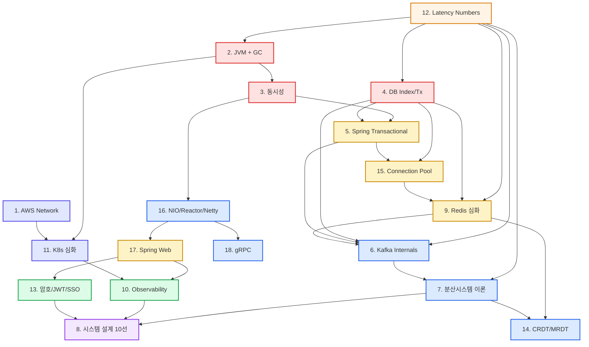

# msa Study — Learning Guide

> 333개 파일 / 약 97K 줄 분량의 18개 주제를 어떻게 회독하고 체화할지에 대한 실용 가이드.
> 산출물: 주제별 deep study (18개) + ADR 후보 통합 (`00-ADR-CANDIDATES.md`, 34개 후보).
> 본 가이드는 “읽기 → 코드 grounding → 면접 카드 → ADR/PR” 4단계 transition 의 표준 운영 매뉴얼.

---

## 0. 가이드 사용법 (먼저 1분만 읽고 시작)

1. **§1 트랙 선택** — 본인 상황(이직 임박/병행/실무) 에 맞는 트랙 1개를 고른다.
2. **§3 의존 그래프** 로 학습 순서 확인 — 트랙별 권장 순서는 §1 표 안에 있고, 그래프는 그 “이유” 를 설명.
3. **§2 회독 전략** 을 매 주제 시작 전 다시 본다 — 1·2·3 회독 목표가 다르다.
4. **§5 자가 평가 체크리스트** 를 주제별로 복사해 `study/log/` 에 보관, 진도 누적.
5. **§7 transition 가이드** 로 학습을 ADR / PR 로 전환 (학습이 코드 변경으로 이어지지 않으면 가치의 60% 가 휘발).

> 본 가이드는 “선언적 명세” 가 아니라 “실행 매뉴얼” 이다. 읽고 끝내지 말 것 — 매주 §5 체크박스를 채우는 게 목표.

---

## 1. 학습자 프로필별 트랙

전체 estimated-hours 합계는 **약 383h**. 이 안에서 “회독 횟수” 와 “주제 커버리지” 를 trade-off 한다.

### 트랙 A: 3개월 압축 (이직/면접 임박, 주 20h)

- **총 가용 시간**: 12주 × 20h ≈ **240h**
- **전략**: 18 주제 중 면접·실무 ROI 가 가장 높은 12개로 압축, 회독은 1.5회 (1회독 + 핵심 12개에 한해 면접카드 회독)
- **회독 정책**: 1회독은 모든 deep file 80% 정독 + Phase 3 코드 grounding 필수, 0.5회독은 interview-qa 카드 회독 + 30초 구두 답변 연습
- **선정 12개**: #2 JVM, #3 동시성, #4 DB, #5 Spring Tx, #6 Kafka, #7 분산시스템, #9 Redis, #10 Observability, #11 K8s, #12 Latency, #13 보안, #15 Connection Pool
- **제외 6개 (트랙 A 한정)**: #1 AWS Network (EKS 전환 전이라 후순위), #8 시스템 설계 (다른 12개에서 자연 흡수), #14 CRDT (msa 미적용), #16 NIO/Reactor (msa MVC 위주), #17 Spring Web (#5/#15 와 겹침), #18 gRPC (msa 미적용)
- **주차별 시나리오**:

| 주차 | 학습 주제 | 시간 | 비고 |
|------|------------|------|------|
| 1 | #12 Latency + #2 JVM Phase 1-2 | 20h | mental model 먼저 |
| 2 | #2 JVM Phase 3 + #3 동시성 Phase 1-2 | 20h | JVM → 동시성 자연 연결 |
| 3 | #3 동시성 Phase 2-3 + #4 DB Phase 1-2 | 20h | |
| 4 | #4 DB Phase 2-3 + #5 Spring Tx | 20h | DB → Spring Tx 직결 |
| 5 | #15 Connection Pool + #9 Redis Phase 1-3 | 20h | DB 풀 → Redis 자료구조 |
| 6 | #9 Redis Phase 4-5 + #6 Kafka Phase 1-2 | 20h | |
| 7 | #6 Kafka Phase 3-5 + #7 분산시스템 Phase 1 | 20h | EOS / 멱등성 집중 |
| 8 | #7 분산시스템 Phase 2-3 + #11 K8s Phase 1-3 | 20h | |
| 9 | #11 K8s Phase 4-7 + #10 Observability Phase 1-2 | 20h | |
| 10 | #10 Observability Phase 3-4 + #13 보안 Phase 1-2 | 20h | |
| 11 | #13 보안 Phase 3-5 + 1회독 보강 | 20h | gap 메우기 |
| 12 | 면접 카드 회독 (12 주제) + mock interview | 20h | 30초 답변 연습 |

> 트랙 A 핵심 리스크: 1회독만으로 끝나면 6개월 뒤 retention 50% 미만. 면접 후라도 §6 cross-cutting 으로 2회독 권장.

### 트랙 B: 6개월 표준 (병행 학습, 주 10-12h)

- **총 가용 시간**: 24주 × 11h ≈ **264h** (회독 2회분)
- **전략**: 18 주제 모두 + 회독 2회 (개념 + 코드 grounding)
- **회독 정책**: 1회독 = preview + Phase 1-2 정독 (주제당 평균 4-6h), 2회독 = Phase 3 코드 grounding + improvements + interview-qa (주제당 2-4h)
- **주차별 시나리오 (요약, 4주 단위 phase)**:

| Phase | 주차 | 학습 주제 | 누적 시간 |
|-------|------|------------|------------|
| Foundation | 1-4 | #12 Latency → #2 JVM → #3 동시성 → #1 AWS Network | 44h |
| Data | 5-8 | #4 DB → #5 Spring Tx → #15 Conn Pool → #9 Redis | 88h |
| Distributed | 9-12 | #6 Kafka → #7 분산시스템 → #14 CRDT → #8 시스템 설계 | 132h |
| Operate | 13-16 | #10 Observability → #11 K8s → #16 NIO → #17 Spring Web | 176h |
| Advanced | 17-20 | #18 gRPC → #13 보안 → 1회독 마감 | 220h |
| Re-read | 21-24 | 18 주제 2회독 (Phase 3 + interview-qa 우선) | 264h |

- **B 트랙 주차별 상세 (1회독 phase, 1-20주차)**:

| 주차 | 주제 | 활동 | 산출 |
|------|------|------|------|
| 1 | #12 Latency Phase 1-3 | 자릿수 / 핵심 메커니즘 / 풀 실측 | 1pass-summary |
| 2 | #12 Phase 4-5 + #2 JVM Phase 1 | 면접 카드 + 메모리 영역 | 멘탈 모델 그림 |
| 3 | #2 JVM Phase 2 | G1 / ZGC / Shenandoah | trade-off 표 |
| 4 | #2 JVM Phase 3 + #3 동시성 Phase 1 | jib-convention 평가 + 프리미티브 | improvements 1차 평가 |
| 5 | #3 동시성 Phase 2 | AQS / Loom / Coroutine | virtual thread 의견 |
| 6 | #3 Phase 3 + #1 AWS Phase 1 | msa 코드 점검 + VPC/Subnet | 1pass-summary |
| 7 | #1 AWS Phase 2 | SG/NACL/NAT/ALB/NLB | 1pass-summary |
| 8 | #1 Phase 3-5 + #4 DB Phase 1 | EKS 매핑 + B-tree | 멘탈 모델 그림 |
| 9 | #4 DB Phase 2 | MVCC / 격리 / lock / deadlock | 1pass-summary |
| 10 | #4 Phase 3 + #5 Spring Tx 1회독 | msa 코드 + propagation/AOP | 외부 IO 분리 의견 |
| 11 | #15 Conn Pool 1회독 | HikariCP / Lettuce / R/W 분리 | sizing 계산 |
| 12 | #9 Redis Phase 1-3 | 자료구조 / RDB+AOF / Cluster | 1pass-summary |
| 13 | #9 Phase 4-5 + #6 Kafka Phase 1 | RedLock 비판 + Broker 기본 | 분산 락 의견 |
| 14 | #6 Phase 2-3 | acks/EOS / Consumer Group | 멘탈 모델 그림 |
| 15 | #6 Phase 4-5 + #7 분산 Phase 1 | EOS / 운영 + CAP/PACELC | 1pass-summary |
| 16 | #7 Phase 2-3 | Saga/2PC + msa 적용 | improvements 평가 |
| 17 | #14 CRDT 1회독 | 이론 + 자료구조 + 비교 | CRDT 적용 후보 평가 |
| 18 | #8 시스템 설계 시나리오 5개 | 5 시나리오 정독 | 답변 골자 노트 |
| 19 | #8 시나리오 5개 + #10 Observability Phase 1 | 시나리오 + Metrics 기초 | 답변 골자 노트 |
| 20 | #10 Phase 2-4 | Logs/Traces/Profiling | 4-Golden 평가 |

- **B 트랙 21-24주차 (2회독)**: 매주 4-5 주제 × 2-3h, Phase 3 + improvements + interview-qa 위주 (각 주제 면접 카드 답변 녹음 1회).
- **추가 주제 (병행)**: #11 K8s / #16 NIO / #17 Spring Web / #18 gRPC / #13 보안 — 1회독을 21-24주차 회독과 “2 시간 split” 으로 겹치거나, 25-28주차 연장 (총 28주 운영).

### 트랙 C: 9개월 깊이 (실무 적용, 주 8h)

- **총 가용 시간**: 36주 × 8h ≈ **288h** (회독 3회 + ADR/PR 시간 별도 “업무 시간” 활용)
- **전략**: 18 주제 모두 + 회독 3회 + ADR 작성 2-4건 + 코드 PR 4-8건
- **회독 정책**: 1회독 (개념) → 2회독 (코드 grounding) → 3회독 (면접 카드 + 함정질문). 회독 사이에 spaced repetition (1회독 후 2주, 6주 간격으로 §5 체크 확인).
- **주차별 시나리오 (요약, 6주 phase)**:

| Phase | 주차 | 활동 | 누적 |
|-------|------|------|------|
| 1차 회독 1단계 | 1-6 | #12 → #2 → #3 → #4 → #5 → #15 | 48h |
| 1차 회독 2단계 | 7-12 | #9 → #6 → #7 → #14 → #8 → #1 | 96h |
| 1차 회독 3단계 | 13-18 | #10 → #11 → #16 → #17 → #18 → #13 | 144h |
| 2차 회독 + ADR | 19-26 | Phase 3 + improvements 정독, ADR 후보 평가, ADR 1-2건 작성 | 208h |
| 3차 회독 + PR | 27-34 | interview-qa 카드 + 코드 PR (1 PR / 4주) | 272h |
| Wrapup | 35-36 | retrospective + 다음 분기 계획 | 288h |

### 트랙 비교 표

| 트랙 | 기간 | 주당 | 총 시간 | 회독 | 커버리지 | 산출물 |
|------|------|------|---------|------|----------|--------|
| A 압축 | 12주 | 20h | 240h | 1.5회 | 12/18 | 면접 카드 |
| B 표준 | 24주 | 11h | 264h | 2회 | 18/18 | 면접 카드 + 자기 요약 |
| C 깊이 | 36주 | 8h | 288h | 3회 | 18/18 | 면접 카드 + ADR 1-2 + PR 4-8 |

---

## 2. 회독 전략 (필수)

회독은 “같은 자료를 N번 읽는다” 가 아니라 **N번마다 목표가 달라진다**. 아래 정의에서 벗어나면 회독이 아니라 “재독” 일 뿐.

### 1회독: 개념 잡기 (주제당 평균 4-6h, 18 주제 기준 ~80h)

- **목표**: preview 의 멘탈 모델 + Phase 1-2 deep file 의 핵심 개념을 본인 언어로 요약 가능
- **읽기 순서**: `00-preview.md` → `00-plan.md` (학습 목표 / 학습자 프로필 확인) → Phase 1 deep file 전부 → Phase 2 deep file 80% (이해 안 되는 부분은 표시만 하고 다음 주제로)
- **금기**: Phase 3 (msa 코드 grounding) 을 1회독에 끼워넣기 — 인지 부하 폭발
- **산출**: `study/log/{topic}-1pass-summary.md` — 자기말 1페이지 요약 (preview 의 “핵심 N문장” 을 본인 말로 다시 쓰기)
- **자가 검증**: 멘탈 모델 그림을 안 보고 그릴 수 있는가? 핵심 N문장을 본인 말로 풀어 설명할 수 있는가?
- **스킵 기준**: 이미 본인이 80% 이상 안다고 판단되는 주제 (예: 5년차 백엔드의 #5 Spring Tx 일부) 는 preview + Phase 3 만 빠르게 스캔 (1.5h 컷)

### 2회독: 코드 grounding (주제당 평균 2-4h, 18 주제 기준 ~50h)

- **목표**: 학습한 개념이 msa 코드 어디에 어떻게 박혀있는지 “파일 경로 + 라인 번호 수준” 으로 매칭. 동시에 improvements / ADR 후보를 본인 평가.
- **읽기 순서**: Phase 3 deep file (msa 코드 grep) → improvements 파일 → 1회독 시 표시한 “이해 안 됐던 부분” 다시 읽기
- **활동**: deep file 에 인용된 파일 경로를 실제로 열어서 읽고, 개선 후보 코드 수정 가능 여부 평가
- **산출**: `study/log/{topic}-2pass-grounding.md` — “현재 코드 위치 → 학습 개념 매핑 표” + “ADR 후보 본인 평가 (P0/P1/Skip)”
- **자가 검증**: msa 의 어떤 서비스/파일이 본 개념에 해당하는지 1개 이상 즉답 가능한가? improvements 의 제안 중 최소 1개를 본인 우선순위로 정렬했는가?
- **금기**: 코드만 읽고 끝 — 반드시 ADR 후보 평가까지 가야 “행동” 으로 전환 가능

### 3회독: 면접 회독 (주제당 평균 1-2h, 18 주제 기준 ~30h)

- **목표**: interview-qa / 함정질문 / cross-cutting 시나리오 (§6) 에 대해 30초~2분 구두 답변
- **읽기 순서**: interview-qa 카드 → 꼬리질문 / 함정질문 시나리오 (preview 마지막의 면접 카드) → §6 cross-cutting
- **활동**: 답변 “녹음” 후 듣기 (자가 평가 가장 강력) — 맺음말이 흐려지거나 “음/어” 가 많으면 답변 미완성
- **산출**: `study/log/{topic}-3pass-cards.md` — 30초 카드 (질문 / 핵심 키워드 3개 / 답변 골자 5문장 / 꼬리질문 1개)
- **자가 검증**: 키워드 보지 않고 답변 가능? 꼬리질문에 “모르겠다” 가 아니라 “경계조건은 X 인데 문서에 없어서 검증 필요” 로 풀 수 있는가?

### 회독 사이 spaced repetition

- **1회독 + 2주**: 자기 요약 다시 읽기 (15분 / 주제) — retention 점검
- **1회독 + 6주**: 멘탈 모델 그리기 (15분 / 주제) — long-term 강화
- **분기별**: 면접 카드 1일 일괄 회독 (≈ 6h, 18 주제)

### 회독 우선 결정 매트릭스 (시간 부족할 때)

| 본인 상태 | 최우선 회독 | 후순위 회독 | 근거 |
|-----------|-------------|-------------|------|
| 면접 1주 전 | 3회독 (interview-qa + §6) | 2회독 (생략 가능) | 즉답 가능 상태 회복이 ROI 1위 |
| 면접 1개월 전 | 2회독 → 3회독 직진 | 1회독 (preview 만 회상) | 코드 grounding 이 답변의 “구체성” 근거 |
| 면접 비계획 | 1회독 → 2회독 (분기 1회) | 3회독 (반기 1회) | 지식 → ADR/PR transition 우선 |
| 신규 주제 진입 | 1회독 (집중) | 2-3회독은 +6주 후 | 단기 retention 보다 정확한 멘탈 모델 |
| 운영 사고 직후 | 사고 관련 주제만 2회독 (Phase 3) | 무관 주제 보류 | 실전 grounding 가장 강력

---

## 3. 주제 의존 그래프

학습 순서를 정할 때 “선행 지식이 없으면 이해도가 60% 이하로 떨어지는” 의존 관계를 그래프로 표현. **Tier 0/1/2/3/4/5/6 stratification** 은 “먼저 해야 하는 정도” 이지 난이도가 아님 (난이도는 §4 표 참조).



### 그래프 해설

- **Tier 0 (#12 Latency)**: 모든 성능/설계 의사결정의 “자릿수 직감” 기반. 1순위.
- **Tier 1 (#2 #3 #4)**: JVM 메모리/스레드, DB 인덱스/락 — 백엔드의 “물리 법칙”. 이게 흔들리면 위 layer 가 모두 모래성.
- **Tier 2 (#5 #9 #15 #17)**: Tier 1 위에 얹힌 프레임워크 wiring. Spring Tx 는 #4 격리 / #3 스레드 / #15 풀 모두 알아야 “왜 이렇게 동작하는지” 가 풀린다.
- **Tier 3 (#6 #7 #14 #16 #18)**: 서비스 간 통신과 분산. #6 Kafka 는 #4 격리 + #5 Tx + #9 Redis 멱등성 위에 성립.
- **Tier 4 (#1 #11)**: 인프라/네트워크. #11 K8s 는 #2 JVM (Pod 메모리/Limit) + #10 Observability 와 양방향.
- **Tier 5 (#10 #13)**: cross-cutting concern — 모든 서비스에 박히는 운영 / 보안.
- **Tier 6 (#8)**: 시스템 설계 종합. 위 12개 주제의 “응용” — 단독 학습 가치 < 회독 가치.

### 트랙별 권장 진입 순서 (그래프 위 경로)

- **트랙 A**: #12 → #2 → #3 → #4 → #5 → #15 → #9 → #6 → #7 → #11 → #10 → #13
- **트랙 B/C**: 위 + #1 → #14 → #16 → #17 → #18 → #8

### 그래프 위 “건너뛰기 가능한” edge

학습자가 이미 강한 영역이 있다면 아래 edge 는 “선행 학습 비중 줄이기” 가능. (의존이 강하지만 prerequisite 가 “기초 수준” 이면 OK)

| 의존 edge | 줄여도 되는 조건 | 줄이지 말아야 하는 신호 |
|-----------|-------------------|--------------------------|
| #4 → #5 | DB 격리 / lock 기본 알고 있음 | propagation = REQUIRED 의 “외부 IO 분리” 이유 설명 못함 |
| #2 → #11 | K8s Pod limit 기본 OK | OOMKilled vs JVM OOM 구분 못함 |
| #3 → #16 | NIO selector 직관 OK | epoll level vs edge trigger 구분 못함 |
| #16 → #18 | HTTP/2 multiplexing 직관 OK | flow control / window update 모름 |
| #10 → #8 | metrics 4-Golden 답변 가능 | tracing 의 sampling / propagation 모름 |

### Tier 별 최소 학습 시간 (단일 회독 기준)

| Tier | 주제 수 | 1회독 합계 (h) | 핵심 ROI |
|------|---------|----------------|-----------|
| 0 | 1 (#12) | 16 | 모든 후속 주제의 자릿수 감각 |
| 1 | 3 (#2 #3 #4) | 55 | 백엔드 “물리 법칙” |
| 2 | 4 (#5 #9 #15 #17) | 35 | 프레임워크 wiring |
| 3 | 5 (#6 #7 #14 #16 #18) | 55 | 분산 / IO 패턴 |
| 4 | 2 (#1 #11) | 36 | 인프라 / 네트워크 |
| 5 | 2 (#10 #13) | 34 | cross-cutting 운영 / 보안 |
| 6 | 1 (#8) | 20 | 통합 / 면접 시나리오 |
| **합계** | **18** | **251** | |

---

## 4. 시간 예산 (주제별)

회독별 권장 시간을 누적 기준으로 정리. 1회독 시간은 estimated-hours 의 65% 수준 (Phase 1-2 비중), 2회독 30% (Phase 3 + improvements), 3회독 15% (interview-qa).

| # | 주제 | difficulty | est-h | 1회독 h | 2회독 h | 3회독 h | 합계 h | 누적 (B 트랙) |
|---|------|------------|-------|---------|---------|---------|--------|----------------|
| 12 | Latency Numbers | intermediate | 24 | 16 | 7 | 4 | 27 | 27 |
| 2 | JVM + GC | advanced | 35 | 23 | 10 | 5 | 38 | 65 |
| 3 | Java/Kotlin 동시성 | advanced | 25 | 16 | 8 | 4 | 28 | 93 |
| 1 | AWS Network | int-to-adv | 35 | 23 | 10 | 5 | 38 | 131 |
| 4 | DB Index/Tx | advanced | 25 | 16 | 8 | 4 | 28 | 159 |
| 5 | Spring Transactional | intermediate | 12 | 8 | 4 | 2 | 14 | 173 |
| 15 | Connection Pool | intermediate | 12 | 8 | 4 | 2 | 14 | 187 |
| 9 | Redis 심화 | intermediate | 15 | 10 | 5 | 2 | 17 | 204 |
| 6 | Kafka Internals | advanced | 20 | 13 | 6 | 3 | 22 | 226 |
| 7 | 분산시스템 이론 | advanced | 18 | 12 | 5 | 3 | 20 | 246 |
| 14 | CRDT/MRDT | advanced | 14 | 9 | 4 | 2 | 15 | 261 |
| 8 | 시스템 설계 10선 | advanced | 30 | 20 | 8 | 4 | 32 | 293 |
| 10 | Observability | intermediate | 18 | 12 | 5 | 3 | 20 | 313 |
| 11 | K8s 심화 | intermediate | 20 | 13 | 6 | 3 | 22 | 335 |
| 16 | NIO/Reactor/Netty | advanced | 18 | 12 | 5 | 3 | 20 | 355 |
| 17 | Spring Web | intermediate | 14 | 9 | 4 | 2 | 15 | 370 |
| 18 | gRPC | intermediate | 14 | 9 | 4 | 2 | 15 | 385 |
| 13 | 암호/JWT/SSO | advanced | 34 | 22 | 9 | 5 | 36 | 421 |
| **합계** | | | **383** | **251** | **112** | **58** | **421** | |

### 트랙별 누적 시간 검증

- **트랙 A (12 주제, 1.5회독)**: (1회독 12개 = 165h) + (3회독 12개 × 0.5 = 22h) ≈ 187h. 가용 240h 중 53h buffer (모의 면접 / spaced repetition / 미진 부분 메우기).
- **트랙 B (18 주제, 2회독)**: 251h + 112h = 363h. 가용 264h 보다 -99h → **트랙 B 는 2회독을 “주제 12개 + Phase 3 only 6개” 로 압축** 하는 게 현실적. 압축 시: 251 + (12×4 + 6×2) ≈ 311h, 여전히 -47h. 따라서 **B 트랙은 주당 13h 권장**.
- **트랙 C (18 주제, 3회독)**: 251 + 112 + 58 = 421h. 가용 288h 보다 -133h → **C 트랙은 주당 11-12h 권장 또는 9개월 → 12개월 연장**. 단, ADR/PR 시간이 “학습 시간” 외 업무 시간으로 흡수되므로 실제 부담은 ≈ 320h.

> **결론**: 본 가이드의 “트랙 A/B/C” 는 이상 시나리오. 실제 운영은 §1 표보다 **주당 +20% buffer** 를 두는 게 현실적. 매주 §5 체크박스로 “계획 대비 실제” 만 기록하면 자동 보정.

---

## 5. 회독 체크리스트 (자가 평가)

각 주제 시작 시 이 표를 `study/log/{topic}-checklist.md` 로 복사. 매주 진도 확인.

### 표준 체크리스트 (모든 주제 공통)

```
주제: #__ ____________________________  시작일: ____  목표 마감: ____

[1회독]
- [ ] 00-preview.md 읽음 (멘탈 모델 그림 본인이 그려봄)
- [ ] 00-plan.md 읽음 (학습 목표 / 학습자 프로필 / 깊이 패키지 확인)
- [ ] Phase 1 deep file 전체 읽음 (___ 개 중 ___ 개)
- [ ] Phase 2 deep file 80% 이상 읽음 (___ 개 중 ___ 개)
- [ ] 자기말 1페이지 요약 작성 → study/log/{topic}-1pass-summary.md

[2회독]
- [ ] Phase 3 (msa 코드 grounding) deep file 읽음
- [ ] improvements / ADR 후보 평가 (P0/P1/Skip 판단)
- [ ] 인용된 msa 파일 경로 1개 이상 직접 열어봄
- [ ] 코드 매핑 표 작성 → study/log/{topic}-2pass-grounding.md

[3회독]
- [ ] interview-qa 카드 모든 질문에 키워드 보지 않고 30초 답변 가능
- [ ] 함정 질문 / 꼬리질문에 “모름” 이 아닌 “미검증 영역” 으로 답변 가능
- [ ] §6 cross-cutting 시나리오 중 본 주제 포함된 시나리오 1개 답변 가능
- [ ] 30초 카드 작성 → study/log/{topic}-3pass-cards.md

[행동 전환]
- [ ] ADR 후보 1개 이상 평가 결과 00-ADR-CANDIDATES.md 와 대조
- [ ] (선택) ADR 1건 작성 또는 기존 ADR 보강
- [ ] (선택) 코드 PR 1건 제출
```

### 주제별 Phase 파일 수 ready reckoner

| # | 주제 | 총 파일 수 | Phase 1 | Phase 2 | Phase 3 | 기타 |
|---|------|-----------|---------|---------|---------|------|
| 1 | AWS Network | 21 | 10 | 6 | (msa-mapping=Phase 5) | 면접+개선 3 |
| 2 | JVM + GC | 24 | 5 | 8 | 3 | 실습 4 + 산출 4 |
| 3 | 동시성 | 26 | 8 | 11+2 | 1 | 종합 4 |
| 4 | DB Index/Tx | 20 | 4 | 9 | 3 | 산출물 4 |
| 5 | Spring Tx | 16 | 3 | 5 | 2+2 | 산출물 4 |
| 6 | Kafka | 15 | 3 | 5 | 4 | 산출물 3 |
| 7 | 분산시스템 | 22 | 5 | 10 | 3 | 산출물 4 |
| 8 | 시스템 설계 | 15 | (시나리오 10) | - | - | 면접 3 + 산출 2 |
| 9 | Redis | 21 | 4 | 8 | 4 | 실습+산출 5 |
| 10 | Observability | 16 | 1 | 10 | 1 | 산출 4 |
| 11 | K8s | 19 | 1 | 13 | 2 | 산출 3 |
| 12 | Latency | 14 | 1 | 4 | 4 | 면접 2 + 코드 1 + 산출 2 |
| 13 | 암호/JWT/SSO | 22 | 7 | 2+3+3+2 | (5단계 통합) | 면접 5 |
| 14 | CRDT/MRDT | 21 | 3 | 8 | 4 | 적용 2 + 산출 4 |
| 15 | Connection Pool | 20 | 3 | 9 | 3 | 산출 5 |
| 16 | NIO/Reactor | 21 | 3 | 11 | 3 | 산출 4 |
| 17 | Spring Web | 22 | (8 관문) | (관문별 deep) | 코드 4 | 산출 4 |
| 18 | gRPC | 22 | 5 | 9 | 4 | 산출 4 |

> 위 카운트는 preview 의 “소주제 지도” 기준. 실제 파일 수는 ±2 차이가 있을 수 있음 — 주제별 폴더에서 `ls` 로 확정.

---

## 6. Cross-cutting 주제 학습 가이드

실무는 한 문제가 여러 주제를 가로지른다. 면접도 마찬가지 — “단일 주제” 질문은 적고 “시나리오 → 어디부터 진단?” 이 자주 나온다. 아래 시나리오는 §3 의존 그래프 위에서 “경로” 로 봐도 됨.

### S1. K8s 위 Spring 서비스의 latency 폭증 진단

- **관련 주제**: #2 JVM, #10 Observability, #11 K8s, #15 Connection Pool, #12 Latency
- **사고 흐름**:
  1. #12 자릿수 감각 — 정상 P99 가 무엇인지 baseline 확인
  2. #10 메트릭 — `http_server_requests_seconds` P99 / `jvm_gc_pause_seconds` / `hikaricp_connections_pending`
  3. #11 — Pod CPU throttling / memory limit / HPA 동작
  4. #2 — GC 로그에서 STW pause / Old gen 증가 / Heap dump
  5. #15 — pool 대기시간이 latency 의 N% 인지 분리 (Little’s Law)
- **해결 방향**: GC 튜닝 (#2 ADR-0028) → pool 사이즈 조정 (#15 ADR-0029) → HPA threshold 조정 (#11)

### S2. Kafka consumer 멈춤 + 메시지 중복

- **관련 주제**: #6 Kafka, #5 Spring Tx, #7 분산시스템
- **사고 흐름**:
  1. #6 — `max.poll.interval.ms` 초과 (rebalance 발생) / consumer lag 추이
  2. #5 — `@Transactional` 안에 외부 IO (Kafka publish + DB commit) 가 섞이면 부분 실패
  3. #7 — exactly-once 가 깨지는 경계 조건 (consume-transform-produce 외 / 외부 DB write)
- **해결 방향**: idempotent consumer (`processed_event` 테이블, ADR-0012) + transactional outbox + max.poll.interval 조정

### S3. Redis 분산 락 신뢰성

- **관련 주제**: #9 Redis, #7 분산시스템, #14 CRDT
- **사고 흐름**:
  1. #9 — SETNX / RedLock / 펜싱 토큰 / single-master vs cluster 차이
  2. #7 — Kleppmann “How to do distributed locking” 비판 / GC pause + clock drift
  3. #14 — 동시 변경 충돌이 “락” 으로 해결할 문제인지 “CRDT 로 변환할” 문제인지 판단
- **해결 방향**: 단일 마스터 + 펜싱 토큰 + 짧은 TTL + 재시도 idempotent + (가능한 경우) CRDT 도입 검토

### S4. 결제 플로우 안정성

- **관련 주제**: #5 Spring Tx, #6 Kafka, #7 분산시스템, #4 DB
- **사고 흐름**:
  1. #4 — 격리 수준 (REPEATABLE_READ vs READ_COMMITTED), gap lock / next-key lock
  2. #5 — 외부 IO 분리 / @TransactionalEventListener(AFTER_COMMIT)
  3. #6 — outbox + Kafka → 결제 성공 후 정확히 한 번 발행
  4. #7 — Saga vs 2PC, 보상 트랜잭션 설계
- **해결 방향**: outbox 패턴 + idempotent consumer + Saga (compensation) + read-after-write stickiness (ADR-0029)

### S5. 로그인/인증 flow 최적화

- **관련 주제**: #13 보안, #17 Spring Web, #15 Connection Pool, #10 Observability
- **사고 흐름**:
  1. #17 — Filter / Interceptor 순서, `SecurityFilterChainProxy` 동작
  2. #13 — JWT 검증 비용 (RS256 vs HS256, KMS 라운드트립), refresh token 회전
  3. #15 — auth 서비스 connection pool / Redis 세션 lookup
  4. #10 — auth 라떼 P99 / failure rate
- **해결 방향**: 키 캐싱 + JWT introspection 비용 분리 + Redis pool 튜닝 + tracing 으로 병목 위치 시각화

### S6. EKS 마이그레이션 평가

- **관련 주제**: #1 AWS Network, #11 K8s, #2 JVM, #10 Observability
- **사고 흐름**:
  1. #1 — VPC / Subnet / SG / NACL 설계 / NAT Gateway 비용 / cross-AZ 비용
  2. #11 — 현재 k3d overlay 와 prod-k8s overlay 의 gap (PDB / HPA / NetworkPolicy)
  3. #2 — Pod 메모리 limit + JVM RAMPercentage 재산정
  4. #10 — Loki / Tempo / Prometheus 의 EKS 운영 cost 모델

### S7. 신규 마이크로서비스 도입 (예: gifticon)

- **관련 주제**: #5 Spring Tx, #6 Kafka, #15 Conn Pool, #10 Observability, #11 K8s
- **사고 흐름**: 신규 서비스 boilerplate → DB schema + Kafka topic 정의 → Connection pool baseline → Observability 4-Golden Signals → K8s overlay → 점진 출시
- **체크 포인트**:
  - DB / Redis / Kafka 자원 공유 정책 (서비스 간 DB 공유 금지 — CLAUDE.md)
  - Kafka topic 네이밍 컨벤션 (docs/architecture/kafka-convention.md)
  - HikariCP `maxPoolSize` baseline (Little’s Law 로 계산: throughput × p99 latency)
  - K8s Deployment 의 readiness / liveness / startup probe 3종 분리 (#11)
  - Observability: `/actuator/prometheus` 노출, http_server_requests / jvm_gc / hikaricp 4-골든 시그널 즉시 알람화

### S8. 대량 트래픽 이벤트 (예: 블랙프라이데이) 사전 대비

- **관련 주제**: #12 Latency, #15 Conn Pool, #11 K8s (HPA), #2 JVM, #9 Redis
- **사고 흐름**:
  1. #12 — 트래픽 N배 시 P99 latency budget 재검증 (병목 자릿수 감각)
  2. #11 — HPA threshold / max replicas / cluster autoscaler quota 사전 점검
  3. #15 — pool 사이즈 vs DB max_connections 검증 (replicas × maxPoolSize ≤ DB 한도 - margin)
  4. #2 — heap warm-up / JIT 컴파일 안정화 (replay traffic / canary)
  5. #9 — Redis cache stampede 방어 (probabilistic early refresh / mutex)
- **해결 방향**: load test 기반 capacity plan + circuit breaker / rate limit + cache warm-up 사전 운영

### S9. 멀티 리전 확장 검토

- **관련 주제**: #1 AWS Network, #7 분산시스템, #14 CRDT, #4 DB, #6 Kafka
- **사고 흐름**:
  1. #1 — VPC peering / Transit Gateway / 데이터 전송 비용 (cross-region egress)
  2. #4 — DB replication topology (active-active vs primary-secondary)
  3. #7 — CAP/PACELC 의사결정 (PA/EL or PC/EC)
  4. #14 — 양방향 sync 가 필요한 데이터에 CRDT 적용 가능성 (counter / set / map)
  5. #6 — Kafka MirrorMaker 2 / cross-region replication 구성
- **해결 방향**: 단계 1 (read-replica) → 단계 2 (active-active 일부 도메인 + CRDT) → 단계 3 (full active-active)

---

## 7. 학습-실무 transition 가이드

학습이 “지식” 에 머물면 6개월 retention 50%, ADR 로 옮기면 18개월, 코드 PR 로 옮기면 영구. 아래 4단계로 강제 변환.

### Step 1: 학습 종료 → ADR 후보 평가 (1주)

- 주제 종료 시 `00-ADR-CANDIDATES.md` 에서 본 주제 출처 항목 확인 (예: 주제 #2 → ADR-0028)
- 본인 평가: P0 동의? 우선순위 조정 필요? 코드 grounding 결과 “이미 부분 구현” / “이번 분기 불필요” 판단
- 산출: `study/log/{topic}-adr-eval.md` (1페이지) — 표 형식 (후보ID / 본인우선순위 / 근거 / 다음 액션)

### Step 2: ADR 작성 (1-2 ADR / 분기)

- 트랙 C 권장. 트랙 B 는 분기 1건 권장.
- 작성 위치: `docs/adr/ADR-NNNN-{slug}.md`. 번호는 기존 ADR 마지막 + 1 (현재 ADR-0027 까지, 후속 ADR-0028~).
- 템플릿: 기존 ADR-0019 참조. **반드시 “Alternatives + Consequences (양쪽)”** 포함 (CLAUDE.md ADR 정책).
- ADR 1건 = 평균 4-8h 작성 (RFC 수준 분석 포함).

### Step 3: 코드 PR (ADR 따라 1 PR / 스프린트)

- ADR 가 “결정” 이라면 PR 은 “이행”. 작은 PR 로 쪼개서 점진 적용.
- 예: ADR-0028 (JVM Tuning) → PR1 `commerce.jib-convention.gradle.kts` 보강 / PR2 K8s deployment volume 추가 / PR3 jvm-alerts.yaml 신설.
- 각 PR 본문에 “학습 출처: study/docs/2-jvm-gc/21-improvements.md §X” 명시.

### Step 4: Retrospective — 학습이 운영 사고를 막았는지 검증

- 분기말 (또는 매월) 운영 사고 / 알람 / 장애 회고 시: “이 사고를 막았을 학습 주제가 있었나?” 역추적
- 산출: `study/log/quarter-{YYYY-Q}-retro.md` — “학습 → 운영 가치” 트래킹 (학습 ROI 정량화)
- 가치가 낮다고 판단된 주제는 다음 분기 회독 우선순위에서 제외 (시간 회수)

---

## 8. 회독 주기 권장

forgetting curve 를 고려한 spaced repetition 일정. 캘린더에 등록 권장.

| 시점 | 활동 | 시간 | 목표 |
|------|------|------|------|
| 1회독 후 즉시 | 자기말 요약 작성 | 0.5h | 능동 재생산 |
| 1회독 후 +2주 | 자기 요약 + 멘탈 모델 다시 그리기 | 0.25h | retention 1차 강화 |
| 1회독 후 +6주 | 멘탈 모델 + 핵심 N문장 답변 | 0.25h | long-term 안착 |
| 2회독 시작 전 | 1회독 요약 1회 통독 | 0.25h | 컨텍스트 회복 |
| 분기별 | 면접 카드 18 주제 일괄 회독 | 6-8h | 즉답 가능 상태 유지 |
| 반기별 | cross-cutting (§6) 시나리오 답변 연습 | 2-3h | 통합 사고력 검증 |

---

## 9. 학습 노트 템플릿

`study/log/` 폴더 신설 권장. 파일 네이밍: `week-NNNN.md` + `{topic}-{stage}.md`.

### 9.1 주간 로그 — `study/log/week-NNNN.md`

```markdown
# Week NNNN (YYYY-MM-DD ~ YYYY-MM-DD)

## 진도 (계획 vs 실제)
- 계획: #2 JVM Phase 1-3 (10h)
- 실제: #2 JVM Phase 1-2 (8h), Phase 3 미완 (2h carryover)

## 발견 (3개 이내)
1. msa 의 `commerce.jib-convention.gradle.kts` 에 `-XX:+UseG1GC` 명시 안 됨 → JDK 17+ default 라 동작은 하지만 ADR 필요
2. ...

## ADR / PR 후보
- ADR-0028 후보 평가 완료 → P0 동의

## 다음 주 계획
- #3 동시성 Phase 1-2 (8h) + #2 JVM Phase 3 carryover (2h)

## 회독 보강
- #12 Latency: 1회독 후 +2주 — 멘탈 모델 그림 재생산 OK
```

### 9.2 주제별 1회독 요약 — `study/log/{topic}-1pass-summary.md`

```markdown
# {topic} 1회독 요약

## 멘탈 모델 (본인이 그린 그림)
[ASCII / mermaid / 본인 말로 표현된 그림]

## 핵심 N문장 (본인 말로 다시 쓰기)
1. ...

## 이해 안 됐던 부분 (2회독에 다시)
- {파일 §섹션}: 이유 ...

## 1차 ADR 후보 인상
- 후보 X: P0 동의 / 보류 / 의문점 ...
```

### 9.3 주제별 2회독 grounding — `study/log/{topic}-2pass-grounding.md`

```markdown
# {topic} 2회독 — 코드 grounding

## 학습 개념 → msa 코드 매핑
| 개념 | 위치 (파일:라인) | 적용 상태 | 비고 |
|------|------------------|-----------|------|
| 멱등 consumer | order/app/...IdempotentEventListener.kt | 부분 적용 | wishlist 누락 |
| ... | ... | ... | ... |

## ADR 후보 본인 평가
| 후보ID | 본인 우선순위 | 근거 | 다음 액션 |
|--------|---------------|------|------------|
| ADR-0028 | P0 | jvmFlags 부족 확인 | PR draft 작성 |
```

### 9.4 주제별 3회독 카드 — `study/log/{topic}-3pass-cards.md`

```markdown
# {topic} 3회독 — 면접 카드

## Q1: ...
- 키워드: A / B / C
- 답변 골자 (5문장):
- 꼬리질문 1: ...
```

---

## 10. 자주 빠지는 함정 (anti-pattern 5선)

학습 이전 단계에서 무너지는 패턴들. 매 주 시작 시 한 번씩 다시 보기 권장.

### Trap 1. “다 한 번에 보겠다” — 전 주제 동시 1회독 시도

- **증상**: 18 주제 preview 만 다 읽고 “감이 잡혔다” 자평. 실제로는 어떤 주제도 Phase 2 깊이 미도달.
- **교정**: 1주 1주제 + Phase 2 까지 강제 완료. preview 만으로 끝내려는 욕구 차단. §5 체크리스트 미완 상태로 다음 주제 이동 금지.

### Trap 2. “preview 만 읽고 끝” — Phase 3 코드 grounding 생략

- **증상**: 멘탈 모델은 그릴 수 있지만 “msa 의 어디에 있나?” 질문에 “…” 침묵.
- **교정**: 2회독에서 반드시 Phase 3 정독. 인용된 파일 경로 1개 이상 IDE 에서 열어 본 후에야 “2회독 완료” 마킹.

### Trap 3. “면접 카드만 외우기” — 출제 의도 / 꼬리질문 못 받아침

- **증상**: 첫 답변은 매끄럽지만 면접관 “왜?” / “경계조건은?” 에 무너짐.
- **교정**: 3회독 시 답변 “녹음” → 듣기. 꼬리질문이 안 떠오르면 §6 cross-cutting 시나리오 강제 학습. interview-qa 카드의 “함정 질문” 섹션 우선.

### Trap 4. “코드 변경 없는 학습” — ADR / PR 로 이어지지 않음

- **증상**: 6개월 학습 후에도 msa 의 코드/문서가 바뀐 게 없음. 면접에서 “학습한 내용을 어떻게 적용했는가?” 답변 빈약.
- **교정**: §7 Step 1-2 강제. 트랙 C 는 분기 1 ADR / 스프린트 1 PR 강제. 트랙 B 도 분기 1 ADR 권장.

### Trap 5. “선형 학습 신화” — Tier 의존 무시 / 의지력만으로 어려운 주제 직진

- **증상**: 호기심으로 #14 CRDT 부터 시작 → #4 DB 격리 / #7 분산시스템 베이스 없어 60% 만 이해 → 좌절 → 학습 중단.
- **교정**: §3 의존 그래프 준수. Tier 0-1 부터 시작. “재미있어 보임” 보다 “다음 주제를 위한 베이스” 우선. 본인이 이미 강한 영역은 §2 “스킵 기준” 으로 빠르게 통과하되, 약한 영역의 prerequisite 는 절대 건너뛰지 말 것.

### Trap 6. “책갈피 없는 정독” — 진도 기록 부재

- **증상**: 어디까지 읽었는지 기억 안남 → 매 세션 5-10분 “어디였더라” 로 소모 → 누적 시 -10% 학습 시간 손실
- **교정**: 매 세션 종료 시 §A.4 의 “다음 세션 entry point 표시” 작성. `study/log/week-NNNN.md` 또는 deep file 안에 `[CONT-2026-05-15]` 마커 1줄.

### Trap 7. “이해 = 외움” 혼동 — 멘탈 모델 없이 키워드 암기

- **증상**: G1 / ZGC / Shenandoah 이름은 외우지만 “언제 어느 것을 선택?” 답변 못함. interview 에서 “왜?” 가 들어오면 무너짐.
- **교정**: preview 의 멘탈 모델 그림을 안 보고 “손으로 그릴 수 있는가” 가 1회독 통과 기준. 그림은 “선택의 트레이드오프 축” 을 표현해야 함 (예: throughput-latency, consistency-availability).

### Trap 8. “학습 노트 분산” — log 폴더 없이 여러 곳에 메모

- **증상**: Notion / Obsidian / iPad 메모 / GitHub issue / deep file 안 코멘트 등 메모가 5곳에 분산 → 회독 시 수집 불가 → 결국 메모 무용.
- **교정**: 본 가이드의 §9 템플릿 + `study/log/` 폴더로 일원화. msa repo 안에 두면 git history 로 자동 backup + 회독 시 `find` 로 즉시 조회 가능.

### Trap 9. “improvements 무시” — 학습은 했는데 개선 후보 평가 안함

- **증상**: 18 주제 모두 1회독 끝났는데 ADR-0028~0034 같은 후보의 본인 우선순위 의견 없음. 면접에서 “학습 중 발견한 가장 큰 개선 후보는?” 답변 빈약.
- **교정**: 각 주제 2회독 종료 시 `improvements.md` 의 제안 1개 이상에 본인 우선순위 / 근거 / 다음 액션을 1줄씩 작성. `00-ADR-CANDIDATES.md` 와 대조하여 의견 차이가 나면 그것이 “학습한 본인의 시각” 자산.

### Trap 10. “면접 후 학습 중단” — 트랙 A 의 흔한 종착

- **증상**: 면접 합격/불합격 직후 학습 중단 → 6개월 후 retention 20% 미만 → 다음 면접 때 또 처음부터 1회독.
- **교정**: 면접 후 1주 retrospective (§7 Step 4) 로 학습 ROI 정리 → 트랙 B/C 로 전환 (주당 시간 줄이되 회독 유지). 2년 사이클 보면 트랙 B/C 가 압도적으로 효율적.

---

## 부록 A. 빠른 참조 표

### A.1 주제 → 핵심 산출 ADR 후보 매핑 (00-ADR-CANDIDATES.md 기준 발췌)

| 주제 | 주요 ADR 후보 | 우선순위 |
|------|--------------|----------|
| #2 JVM | ADR-0028 (JVM Tuning Convention) | P0 |
| #5 Spring Tx | ADR-0029 (Read-after-Write Stickiness), ADR-0033 (Idempotent Consumer 헬퍼) | P0/P1 |
| #6 Kafka | ADR-0030 (분산 추적), ADR-0033 (Idempotent Consumer 헬퍼) | P0/P1 |
| #7 분산시스템 | ADR-0030, ADR-0033, Saga 패턴 표준화 | P1 |
| #10 Observability | ADR-0030 (OpenTelemetry + Tempo), Loki, Sloth | P0/P1 |
| #11 K8s | Argo CD, Argo Rollouts, NetworkPolicy | P1/P2 |
| #15 Conn Pool | ADR-0029 (Stickiness), pool sizing convention | P0/P1 |

> 전체는 `study/docs/00-ADR-CANDIDATES.md` 참조. 본 가이드는 “학습 → ADR” transition 의 진입점일 뿐.

### A.2 트랙 선택 의사결정 트리

```
이직 / 면접이 3-4개월 내?
  ├─ Yes → 트랙 A
  └─ No  → ADR / 코드 PR 까지 갈 의지가 있음?
            ├─ Yes → 트랙 C
            └─ No  → 트랙 B
```

### A.3 “이 주제 지금 들어가도 되는가” 빠른 체크

| 주제 시작 전 prerequisite 체크 | 미충족 시 |
|----|----|
| #5 Spring Tx 시작 전: #4 DB 격리 / #3 동시성 기본 | #4 → #3 → #5 순서로 |
| #6 Kafka 시작 전: #4 DB 격리 / #5 외부 IO 분리 | #4 → #5 → #6 |
| #7 분산시스템 시작 전: #6 Kafka / #4 DB | #4 → #6 → #7 |
| #10 Observability 심화 전: #2 JVM / #11 K8s 기본 | #2 → #11 → #10 |
| #11 K8s 심화 전: #1 AWS Network 기본 (선택) | (선택) #1 → #11 |
| #14 CRDT 시작 전: #7 분산시스템 / #9 Redis | #9 → #7 → #14 |
| #16 NIO/Reactor 시작 전: #3 동시성 / #2 JVM | #2 → #3 → #16 |
| #17 Spring Web 심화 전: #5 Spring Tx | #5 → #17 |
| #18 gRPC 시작 전: #16 NIO 기본 / #17 Spring Web | #17 → #16 → #18 |

### A.4 일일 / 주간 시간 분배 (트랙 B 표준)

```
주간 11h 분배 예시
  - 월/수/금 저녁: 각 2h (집중 deep file 정독, 1회독 위주)
  - 토 오전: 3h (Phase 3 코드 grounding, 2회독 위주)
  - 일 오전: 2h (요약 작성 / 면접 카드 회독 / spaced repetition)
```

```
일일 2h 세션 구조
  - 0:00-0:10  지난 세션 요약 1줄 회상 (warm-up)
  - 0:10-1:30  deep file 1-2개 정독 + 메모
  - 1:30-1:50  본 세션 발견 1-3개 정리 (study/log/week-NNNN.md 에 추가)
  - 1:50-2:00  다음 세션 entry point 표시 (어디서 멈췄는지)
```

### A.5 트랙 A 12주 시나리오 — 일일 단위 상세 (요약)

> 주 20h 압축 트랙. 평일 저녁 + 주말. 1회독 + 면접 카드 회독에 모든 시간 투입.

| 주차 | 평일 저녁 (월-금, 각 2h, 합 10h) | 주말 (토/일, 합 10h) | 핵심 마일스톤 |
|------|----------------------------------|-----------------------|---------------|
| 1 | #12 Latency 1회독 (5일) | #2 JVM Phase 1 정독 + 멘탈 모델 그리기 | latency 자릿수 즉답 |
| 2 | #2 JVM Phase 2 (5일) | #2 JVM Phase 3 grounding + #3 동시성 Phase 1 | jib-convention.gradle.kts 평가 |
| 3 | #3 동시성 Phase 2 (5일) | #3 Phase 3 grounding + #4 DB Phase 1 | virtual threads 의견 정리 |
| 4 | #4 DB Phase 2-3 (5일) | #5 Spring Tx 1회독 | 격리 수준 / @Transactional 함정 즉답 |
| 5 | #15 Conn Pool 1회독 (5일) | #9 Redis Phase 1-2 | HikariCP sizing 로직 즉답 |
| 6 | #9 Redis Phase 3-5 (5일) | #6 Kafka Phase 1-2 | RDB/AOF / cluster 즉답 |
| 7 | #6 Kafka Phase 3-5 (5일) | #7 분산시스템 Phase 1-2 | EOS / 멱등성 즉답 |
| 8 | #7 분산시스템 Phase 2-3 (5일) | #11 K8s Phase 1-3 | CAP/PACELC / Saga 즉답 |
| 9 | #11 K8s Phase 4-7 (5일) | #10 Observability Phase 1-2 | Operator / GitOps 의견 정리 |
| 10 | #10 Observability Phase 3-4 (5일) | #13 보안 Phase 1-2 | 4-Golden + tracing 즉답 |
| 11 | #13 보안 Phase 3-5 (5일) | gap 메우기 / cross-cutting (§6) | JWT / KMS 즉답 |
| 12 | 면접 카드 회독 12 주제 (5일) | mock interview + retro | 30초 답변 가능 |

### A.6 학습 자료 → 면접 답변 변환 공식

면접 답변 30-90초 구조:

```
[Anchor 1문장]    "X 를 한 마디로 정의하면 Y 입니다."
[Mechanism 2-3문장]  "내부적으로는 A → B → C 단계로 동작하며 핵심은 D 입니다."
[Trade-off 1-2문장]  "장점은 X 이지만 비용은 Y 라서 Z 상황에 적합합니다."
[Application 1-2문장]  "msa 에서는 product 서비스의 OOO.kt 에서 사용합니다 / 도입 검토 중입니다."
[Tail handling]    꼬리질문이 들어오면 "경계조건은 P 인데 검증 미완 / 운영 사례 없음" 으로 honest hedge.
```

> Anchor 가 흔들리면 답변 전체가 흔들린다 — 매 주제 “한 마디 정의” 를 §9.4 카드의 첫 줄에 박을 것.

### A.7 학습 시작 전 1회 점검 (학습자 자가평가)

| 영역 | 본인 수준 (1-5) | 비고 |
|------|------------------|------|
| JVM 메모리 / GC 진단 | __ | 1=기본도 모름, 5=GC log 직접 진단 |
| Spring @Transactional 함정 | __ | propagation / readOnly / 외부 IO 분리 |
| MySQL 격리 수준 / lock | __ | gap lock / next-key / MDL |
| Kafka EOS / 멱등성 | __ | acks=all / processed_event |
| Redis 자료구조 / 영속화 | __ | listpack / RDB+AOF |
| K8s Operator / HPA | __ | CRD / reconciliation |
| Observability 4-Golden | __ | RED / USE 메트릭 |
| 분산시스템 CAP/PACELC | __ | Saga / 2PC 트레이드오프 |

> 평균 3 미만 → 트랙 B/C 권장 (1회독 충실), 평균 4 이상 → 트랙 A 가능 (스킵 기준 적극 활용).

---

### A.8 회독별 산출 파일 명명 규칙 한 장 정리

```
study/log/
  ├── week-NNNN.md                       # 주간 진도 / 발견 / 다음 주
  ├── 12-latency-1pass-summary.md        # 1회독 산출 (자기말 요약)
  ├── 12-latency-2pass-grounding.md      # 2회독 산출 (코드 매핑)
  ├── 12-latency-3pass-cards.md          # 3회독 산출 (면접 카드)
  ├── 12-latency-adr-eval.md             # ADR 후보 본인 평가
  ├── 12-latency-checklist.md            # §5 체크리스트
  ├── quarter-2026-Q2-retro.md           # 분기 retrospective
  └── interview-cards-aggregated.md      # 18 주제 면접 카드 통합 (3회독 부산물)
```

> 파일명 prefix 는 “주제 번호-슬러그” 로 통일. `find` / `grep` 으로 일괄 회독 가능.

### A.9 학습 효과 자가 측정 (분기말 1회)

| 측정 항목 | 합격 기준 | 측정 방법 |
|----------|-----------|-----------|
| 멘탈 모델 재생산 | 18 주제 중 80% 이상 본 그림 5분 내 그리기 | 빈 종이 + 타이머 |
| 30초 답변 가능 주제 | 면접 카드 중 70% 이상 키워드 안 보고 답변 | 녹음 후 자가 평가 |
| 코드 매핑 즉답 | 주요 개념 → msa 파일 경로 1개 즉답 80% 이상 | 무작위 5개 질문 |
| ADR 후보 의견 | 00-ADR-CANDIDATES.md 의 P0/P1 16개 중 8개 이상 본인 의견 보유 | 의견 노트 카운트 |
| 운영 사고 추적 | 분기 사고 N건 중 학습 주제와 매칭 가능한 비율 | 회고 기록 |

> 평균 70% 미만 → 다음 분기 회독 비중 증가. 평균 90% 이상 → 새 주제 추가 검토 (예: ML for backend, Service Mesh 심화 등).

---

## 부록 B. 본 가이드 운영 메타

- **버전**: v1.0 (2026-05-01)
- **갱신 트리거**: (1) 신규 주제 추가, (2) ADR 신설로 §A.1 매핑 변경, (3) 트랙 운영 결과 시간 모델 보정 필요
- **갱신 책임자**: 학습자 본인 (분기말 §A.4 / §1 표 보정)
- **연관 문서**:
  - `study/docs/00-ADR-CANDIDATES.md` — ADR 후보 통합 리스트
  - `study/docs/{N}-{topic}/00-plan.md` — 주제별 학습 계획서
  - `study/docs/{N}-{topic}/00-preview.md` — 주제별 멘탈 모델 + 소주제 지도
  - `docs/adr/` — 플랫폼 ADR (현재 ADR-0001~0027)
  - `CLAUDE.md` — 프로젝트 컨벤션 (회독 ↔ 실무 transition 의 “행동” 근거)

> 끝. 본 문서를 읽었다면 §1 트랙을 선택하고 §5 체크리스트를 1주제에 대해 즉시 복사해 시작할 것.
