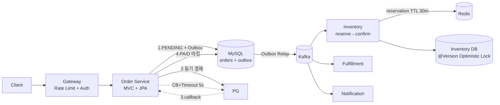
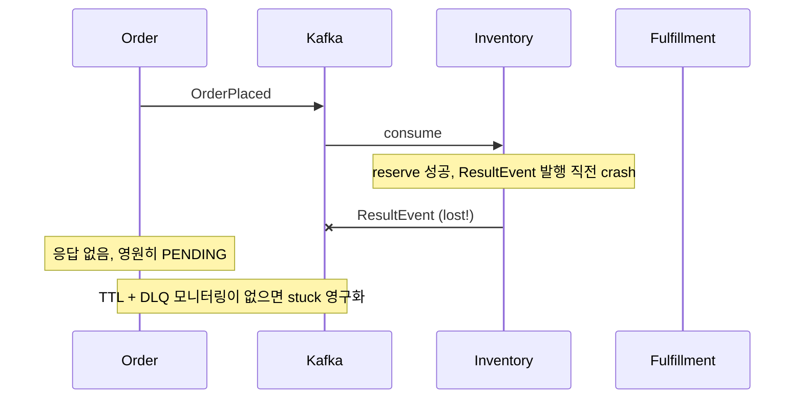

# 모의 면접 Walk-through (5 시나리오)

> [INTERVIEW-INDEX §4](00-INTERVIEW-INDEX.md) 의 5 시나리오에 대해 실제 면접 walking 시뮬레이션.
> 시니어 백엔드 (10년차) 답변 톤 + 꼬리 질문 처리 + 시간 배분 + 합/탈 시그널을 모두 포함한다.
> 본 문서는 "면접관/지원자" 대화 형식으로 진행되며, 답변마다 출처 카드 (예: `→ #2 Q1`) 를 명시한다.

## 목차

- [§1 시나리오 A — 백엔드 시니어 1차 (CS + 동시성)](#1-시나리오-a--백엔드-시니어-1차-cs--동시성)
  - A.1 0-10분: 자기소개 + 워밍업
  - A.2 10-30분: GC (Garbage Collection, 가비지 컬렉션) + 동시성 핵심
  - A.3 30-50분: 코드 grounding 검증
  - A.4 50-60분: Wrap-up + 역질문
  - A.5 합격/탈락 시그널
- [§2 시나리오 B — 백엔드 시니어 2차 (시스템 설계)](#2-시나리오-b--백엔드-시니어-2차-시스템-설계)
  - B.1 0-5분: 자기소개
  - B.2 5-50분: 주문 시스템 설계 walking
  - B.3 50-60분: 트레이드오프 압박
  - B.4 합격/탈락 시그널
- [§3 시나리오 C — 백엔드 테크리드 (아키텍처 + 운영)](#3-시나리오-c--백엔드-테크리드-아키텍처--운영)
  - C.1 0-10분: 자기소개 + 자랑스러운 의사결정
  - C.2 10-30분: 아키텍처 결정 회고
  - C.3 30-50분: 운영 점검
  - C.4 50-60분: 미래/리더십
  - C.5 합격/탈락 시그널
- [§4 시나리오 D — 인프라 엔지니어 (K8s (Kubernetes) + 관측 + 네트워크)](#4-시나리오-d--인프라-엔지니어-k8s--관측--네트워크)
  - D.1 0-5분: 자기소개
  - D.2 5-30분: K8s 깊이
  - D.3 30-45분: 관측
  - D.4 45-55분: 네트워크
  - D.5 55-60분: 마무리
  - D.6 합격/탈락 시그널
- [§5 시나리오 E — 데이터/플랫폼 엔지니어 (Kafka + 분산 + DB)](#5-시나리오-e--데이터플랫폼-엔지니어-kafka--분산--db)
  - E.1 0-5분: 자기소개
  - E.2 5-30분: Kafka 깊이
  - E.3 30-45분: 분산 트랜잭션
  - E.4 45-60분: DB 격리
  - E.5 합격/탈락 시그널
- [§6 공통 차별화 포인트](#6-공통-차별화-포인트)
  - 6.1 시니어 vs 주니어 답변 차이
  - 6.2 함정 질문 응대 패턴
  - 6.3 "모르는 질문" 처리 전략
- [§7 시간 배분 가이드](#7-시간-배분-가이드)
  - 7.1 60분 면접 표준 분배
  - 7.2 역질문 효과적 활용

---

## §1 시나리오 A — 백엔드 시니어 1차 (CS + 동시성)

> 1차 면접관은 보통 시니어/중간 레벨 엔지니어. 깊이를 보지만 "교과서 + 실전" 의 미세한 격차를 본다.
> 60분 중 40분 이상이 GC/동시성 진단 워크플로에 할애된다.

### A.1 0-10분 — 자기소개 + 워밍업

#### Q1.1 (자기소개)

**면접관**: "간단히 자기소개와 가장 깊이 다뤘던 백엔드 주제 하나만 짚어주세요."

**답변 (지원자)**:

> 안녕하세요. 백엔드 10년차이고, 최근 4년은 커머스 도메인의 MSA 전환을 주도했습니다. 제가 가장 깊이 다룬 건 **JVM 메모리/GC 와 동시성**입니다. 운영 중 OOMKilled 사고를 두 번 겪었는데, 둘 다 heap dump 만 봐서는 원인이 안 보였고 NMT(Native Memory Tracking) 와 cgroup memory 까지 내려가야 했습니다. 그 경험으로 JVM 을 "heap = JVM" 이 아니라 "RSS = heap + metaspace + direct + thread stack + code cache + native" 로 보는 시각이 잡혔습니다.

> 동시성은 최근 Virtual Thread 를 Tomcat 에 도입하면서 pinning 을 깊게 봤고, 같이 ThreadLocal/MDC 가 carrier 와 어떻게 결합되는지도 정리했습니다. 오늘은 그 두 토픽을 중심으로 답변드리겠습니다.

(2분, 마지막 30초로 도메인 + 깊이 두 가지를 던지는 게 시그널.)

#### Q1.2 (워밍업: JVM 메모리 5종)

**면접관**: "JVM 메모리 영역을 5가지 말해주세요." (→ `#2 Q1`)

**답변**:

> Heap, Metaspace, Java Stack, PC Register, Native Method Stack 다섯 가지입니다. 이 중 Heap 만 GC 대상이고, Metaspace 는 클래스 메타데이터 — Java 8 부터 PermGen 이 native 영역인 Metaspace 로 옮겨졌고 기본 한도가 무제한입니다. Stack/PC/Native 는 스레드 단위로 잡히니 thread 수 × stack size 가 RSS 에 직접 잡힙니다.

> 다만 운영 시각으로는 이 5개로 부족하고, **Direct Buffer / Code Cache / GC 자체 메타데이터** 를 추가로 봐야 합니다. 컨테이너의 RSS 가 -Xmx 의 1.5~2 배까지 나오는 게 정상이라는 이유가 여기서 나옵니다.

**꼬리 1**: "PermGen 과 Metaspace 차이?"

> 위치가 heap 밖 native 로 옮겨진 게 가장 크고, 한도가 -XX:MetaspaceSize / MaxMetaspaceSize 로 분리되어 기본은 무제한입니다. 그래서 클래스 누수가 있어도 OOM: PermGen space 대신 RSS 가 야금야금 늘어나는 형태로 나타납니다 — 진단이 더 어려워졌다는 함의가 있습니다.

**꼬리 2**: "Stack 도 GC 대상인가요?" (함정 → `#2 함정 1`)

> 아닙니다. 메서드 종료 시 자동으로 frame 이 pop 되니 GC 가 관여할 필요가 없습니다. 다만 stack 에 있는 reference 들은 GC root 로 작동해서 heap 객체의 reachability 를 결정하죠. "Stack 자체는 GC 대상이 아니지만, GC 의 시작점은 stack" 이라는 게 정확한 표현입니다.

#### Q1.3 (컨테이너 -Xmx)

**면접관**: "컨테이너 환경에서 -Xmx 는 어떻게 설정하시나요?" (→ `#2 Q41`)

> 절대값 -Xmx 보다 `-XX:MaxRAMPercentage=70` 같은 비율 옵션을 씁니다. cgroup limit 의 70% 정도를 heap 에 주고 나머지 30% 를 metaspace + direct + thread stack + native 로 남기는 식이죠. JDK 11+ 부터 UseContainerSupport 가 기본 ON 이라 cgroup limit 을 인식합니다.

> 추가로 thread stack(-Xss) 은 256k~512k 로 줄이는 게 무난하고, Direct Buffer 는 -XX:MaxDirectMemorySize 로 명시 — 안 그러면 NIO/Netty 가 거의 -Xmx 만큼 잡아갑니다. msa 의 gateway 도 Netty 기반이라 이 옵션을 명시했습니다.

### A.2 10-30분 — GC 진단 + 동시성 핵심

#### Q2.1 (OOMKilled vs Heap)

**면접관**: "운영 중에 Pod 가 OOMKilled 로 죽었는데 JVM heap dump 보니 멀쩡합니다. 무엇부터 보시겠어요?" (→ `#11 Q4`, `#2 Q30`)

> 결론부터 — heap 이 아니라 **native 영역 합산이 cgroup limit 을 초과한 케이스**일 가능성이 가장 높습니다. metaspace + direct buffer + thread stack + code cache + GC 메타데이터 가 함께 늘어나서 RSS 가 limit 을 넘으면, JVM 입장에선 OOMError 가 안 나도 OS/cgroup 이 SIGKILL 로 죽입니다.

> 첫 진단은 (1) `kubectl describe pod` 로 OOMKilled exit code 137 + reason 확인, (2) container_memory_working_set_bytes 추이 그래프, (3) 같은 시점의 jvm.memory.used (heap, metaspace, direct 별 분리) 를 겹쳐 봅니다. heap 은 평탄한데 RSS 만 우상향이면 native leak 이 거의 확정입니다.

**꼬리**: "어떻게 진단을 정량화하시겠어요?" (→ `#2 Q30, Q42`)

> NMT(Native Memory Tracking) 를 켭니다. `-XX:NativeMemoryTracking=summary` 로 띄우고, 베이스라인을 `jcmd <pid> VM.native_memory baseline` 으로 저장한 뒤 일정 시간 후 `summary.diff` 를 떠서 어느 카테고리가 늘었는지 봅니다. 보통 Internal/Other 가 늘면 JNI/Direct, Class 가 늘면 ClassLoader 누수, Thread 가 늘면 thread leak 입니다. 이게 정량 증거고, 그 다음에 jcmd VM.classloader_stats 같은 fine-grain 진단으로 들어갑니다.

#### Q2.2 (GC 로그 분석 5지표)

**면접관**: "GC 로그를 받았다고 가정하고 어떤 지표를 우선 보세요?" (→ `#2 Q25`)

> 5가지를 봅니다 — **Pause time / Throughput / Allocation rate / Promotion rate / Old gen 추이**. Pause 의 P99 가 SLA 를 깨는지, Throughput (= 1 - GC time / wall time) 이 95% 이상인지가 1차. 그 다음 Allocation rate (MB/s) 가 비정상적으로 높으면 메모리 churn — 보통 String concat 이나 stream 남용입니다.

> 가장 중요한 건 **Old gen 추이**입니다. 매 Full GC 후 baseline 이 우상향이면 메모리 누수, 평탄하지만 자주 Full GC 가 돌면 Old 가 작아서 promotion 압박. G1 이면 IHOP(InitiatingHeapOccupancyPercent) 를 낮춰 mixed GC 빈도를 올리거나 region size 를 키워 humongous object 를 막습니다.

#### Q2.3 (synchronized vs volatile)

**면접관**: "synchronized 와 volatile 차이는요?" (→ `#3 Q1.2`)

> 한 줄로는 **synchronized = 원자성 + 가시성 + 순서, volatile = 가시성 + 순서만**입니다. 카운터처럼 read-modify-write 가 있으면 volatile 단독으론 race 를 못 막고, AtomicInteger 의 CAS 또는 synchronized 가 필요합니다. 반대로 단순 flag (boolean stop) 처럼 한 쪽이 write, 다른 쪽이 read 만 하는 경우는 volatile 만으로 충분합니다.

> 실전에선 volatile 의 핵심이 **happens-before** 보장이라는 걸 자주 놓칩니다. volatile write 이전의 모든 작성은 volatile read 이후의 모든 코드에서 보입니다 — DCL 패턴이 이 보장에 의존합니다.

**꼬리**: "DCL 에 volatile 빠지면?" (→ `#3 Q2.2`)

> 부분 초기화된 객체가 노출됩니다. `instance = new Foo()` 가 (1) 메모리 할당, (2) 생성자 실행, (3) reference 대입 세 단계인데 JIT 가 (3) 을 (2) 보다 앞으로 재배열할 수 있습니다. volatile 이 없으면 다른 스레드가 reference 만 보고 들어와서 미초기화 필드를 읽는 race 가 발생하죠. 그래서 DCL 의 핵심은 lock 이 아니라 volatile 입니다.

#### Q2.4 (Virtual Thread)

**면접관**: "Virtual Thread 의 메커니즘과, 언제 도입하시겠어요?" (→ `#3 Q2.11`, `#16 Q27`)

> Virtual Thread 는 OS thread 가 아닌 **JVM 이 관리하는 continuation 객체** 입니다. blocking 호출이 발생하면 carrier thread 에서 unmount 되고 stack frame 이 heap 에 보관됐다가, 호출이 깨어나면 다른 carrier 에 mount 되어 재개됩니다. 본질적으로 코드는 동기처럼 짜되 런타임이 state machine 변환을 해주는 모델이죠.

> 도입 1순위는 **blocking IO 가 많은 thread-per-request 서비스** — Tomcat 같은 곳이요. 반대로 CPU-bound 워크로드, JNI/synchronized 가 많은 라이브러리, ThreadLocal 캐시에 의존하는 코드는 효과가 없거나 오히려 손해입니다. msa 에선 gateway/gateway-blocking 경로에서 효과를 본 반면, JNI 로 인코딩 도는 service 는 platform thread 그대로 뒀습니다.

**꼬리**: "pinning 이 뭔지, 그리고 어떻게 해소되나요?" (→ `#3 Q2.12`)

> pinning 은 carrier 에서 **unmount 가 불가능한 상태**입니다. 두 케이스 — (1) synchronized 블록 안, (2) JNI native frame 안. 이 안에서 blocking 호출이 일어나면 carrier 가 통째로 묶여 다른 virtual thread 가 못 올라옵니다. JDK 21 까지는 synchronized 가 pinning 이라 ReentrantLock 으로 갈아끼우는 게 권장이었고, JDK 24 부터 synchronized pinning 은 해소됐습니다. 진단은 `-Djdk.tracePinnedThreads=full` 로 stack trace 를 받아 봅니다.

### A.3 30-50분 — 진단 워크플로 + 코드 grounding

#### Q3.1 (ThreadLocal 누수)

**면접관**: "ThreadLocal 메모리 누수 왜 일어나죠?" (→ `#3 Q1.8`)

> ThreadLocalMap 의 entry 가 **key 는 WeakReference, value 는 Strong reference** 인 비대칭 구조 때문입니다. ThreadLocal 객체에 외부 strong reference 가 사라지면 key 는 GC 되지만 value 는 살아남아서, 해당 thread 가 살아있는 동안 (특히 Tomcat 처럼 thread pool 을 재사용하는 환경) 누적됩니다.

> 방어는 두 가지 — (1) **try-finally 에서 명시적 remove()** 호출, (2) Filter 에서 set/clear 를 짝지어 관리. msa 에서는 MDC trace_id 도 같은 패턴으로 OncePerRequestFilter 의 finally 에서 clear 합니다. Virtual Thread 에선 carrier 가 아닌 virtual 단위로 ThreadLocal 이 따로 잡혀서 그나마 안전하지만, ScopedValue 로 갈아끼우는 게 정공법입니다.

#### Q3.2 (동시성 사고 진단)

**면접관**: "운영 중 동시성 사고가 의심됩니다. 진단 워크플로를 처음부터 끝까지 walking 해주세요." (→ `#3 Q4.8`)

> 4단계입니다.
>
> **(1) 다중 스냅샷**. 단발 dump 는 noise 가 너무 많아서 5초 간격으로 3회 — `jcmd <pid> Thread.print -l` 을 씁니다. `-l` 이 lock owner 까지 찍어주는 게 핵심이고, jstack 보다 신뢰성 + 권한 모델이 낫습니다.
>
> **(2) BLOCKED 분포**. 3개 dump 에서 BLOCKED 가 일관되게 같은 monitor 에 몰리면 lock contention 확정. 같은 lock 의 대기자 수 + holder 추적이 1차 작업입니다.
>
> **(3) lock owner 추적**. dump 에는 `waiting to lock <0x000007c1>` 식으로 lock 의 identity hash 가 찍힙니다. 같은 ID 를 `locked <0x000007c1>` 라인에서 grep 하면 owner thread 와 그 stack 이 나오죠. owner 가 무엇을 기다리는지가 root cause 입니다.
>
> **(4) 정량화**. async-profiler 로 `-e lock` 모드를 5분 돌리면 contention time 이 method 별로 누적된 flame graph 가 나옵니다. 이게 발표 자료에도 그대로 쓸 수 있는 정량 증거고, 회고 ADR 의 근거가 됩니다.

**꼬리**: "Thread 가 RUNNABLE 인데 hang 같다면?" (→ `#3 Q3.5`)

> JVM 의 RUNNABLE 은 OS 의 running 과 다릅니다. **native IO 대기 (sun.nio.ch.Net.poll, sun.nio.ch.EPoll.wait, SocketInputStream.read 등)** 가 RUNNABLE 로 잡힙니다. 그래서 stack 의 최상단이 native 메서드면 hang 이 아니라 IO 대기 중일 가능성이 높습니다.
>
> 반대로 같은 위치에 같은 stack 으로 5초 간격 3 dump 가 모두 찍혀 있고 native frame 이 아니면 — **무한 루프 또는 deadlock 진입 직전**. 그땐 async-profiler `-e cpu` 또는 `-e wall` 로 정량 비교하고, deadlock 이면 `Thread.print -l` 의 마지막 섹션에 deadlock detection 결과가 같이 찍히니 그걸 봅니다.

### A.4 50-60분 — Wrap-up + 역질문

#### Q4.1 (마지막 질문 있나요?)

**면접관**: "마지막으로 저희에게 궁금한 게 있나요?"

> 세 가지 정도 궁금합니다. (1) 팀의 **장애 회고 문화** — RCA 가 SoT 로 남는지, 혹은 Slack 으로 휘발되는지요. (2) **Observability 성숙도** — RED/USE 지표가 어디까지 자동화돼 있는지, alert 의 false positive 비율은 어떤지. (3) 신규 입사자가 **첫 6주에 production 코드를 머지하는 비율** 이 어느 정도인지 — 온보딩 속도가 팀 문화의 가장 좋은 지표라고 생각합니다.

> (이 세 질문은 단순 호기심이 아니라 "내가 들어가서 의미있게 일할 수 있는 환경인가" 를 검증하는 질문이라 면접관에게도 시그널이 됩니다.)

### A.5 합격/탈락 시그널

| 구분 | 시그널 |
|---|---|
| 합격 | 단발 dump 의 한계를 즉답, lock owner 추적의 lock ID 매칭 정확, RUNNABLE = native IO 대기 인지, Virtual Thread carrier/mount/unmount 메커니즘 30초 설명, NMT 진단 명시 |
| 탈락 | "OOM = heap 부족" 으로 단정, jstack 만 알고 jcmd -l 모름, "volatile 만으로 카운터 OK" 답, ThreadLocal 누수 원인을 "엔진 버그" 로 회피 |
| 평가 포인트 | 진단 명령어를 입에 붙은 수준으로 자연스럽게 호출, 함정 질문에 "한 단계 더 들어가는" 답변 (예: Stack 자체는 GC X but root 는 stack) |

> **회고 한 줄**: 1차 면접의 본질은 "교과서 + 실전 진단" 의 결합이다. 정답을 외운 사람과 사고를 디버깅해본 사람의 격차가 진단 워크플로 질문에서 갈린다.

---

## §2 시나리오 B — 백엔드 시니어 2차 (시스템 설계)

> 2차는 보통 시니어 또는 테크리드가 들어온다. 구조 + 트레이드오프 + 운영 시각이 동시에 평가된다.
> 60분 중 45분이 단일 설계 walking, 10분은 압박 트레이드오프, 5분 자기소개.

### B.1 0-5분 — 자기소개

**면접관**: "1차에서 동시성 얘기는 잘 들었습니다. 오늘은 설계 위주로 갈게요. 1분만 자기소개 해주시고 바로 넘어갈게요."

**답변**:

> 네, 핵심만 말씀드리면 — 지난 4년 커머스 MSA 에서 **분산 트랜잭션 표준화** 를 주도했습니다. Saga + Outbox + 멱등 Consumer + Optimistic Lock + Reservation TTL 5종 패키지를 ADR-0011/0012/0020/0022 로 문서화했고, 운영 중 이중 결제 사고는 0 건, Saga stuck 사고는 1 건 (TTL 미설정) 있었습니다. 오늘 설계 walking 에서 그 경험을 가장 진하게 보여드리겠습니다.

(자기소개를 짧게 끝내고 바로 설계 토픽으로 들어가는 게 시그널. 2차에서 자기소개 길게 하는 건 시간 낭비.)

### B.2 5-50분 — 주문 시스템 설계 walking

> 면접관: "주문 시스템을 설계해보세요. 결제 + 재고 + 주문 생성을 포함합니다. DAU 100만 가정, P99 200ms."

#### B.2.1 요구사항 정리 (4분)

> 먼저 요구사항을 5개로 추리겠습니다.
>
> **기능**: (1) 주문 생성 (cart → POST /orders), (2) 결제 연동 (PG 1개 가정, 비동기 콜백), (3) 재고 차감 (sub-trip reserve → confirm 2-step). **비기능**: (4) **at-most-once 결제 보장** (이중 결제는 매출 X, 신뢰 X), (5) **P99 200ms** under DAU 100만.
>
> 명시적으로 빼는 것 — 배송, 정산, 환불은 out-of-scope 로 두겠습니다. (면접관이 추가 요구사항을 던지면 동적으로 흡수하면 되고, 처음부터 다 안고 가면 시간 부족.) 이 5개가 합의되면 그 다음 단계로 갈게요.

(이 단계의 시그널: **"무엇을 안 할 건지"** 를 명시. 주니어는 다 하려 하다 시간 소진.)

#### B.2.2 용량 산정 (5분)

> DAU 100만 × 사용자당 평균 5 액션 (browse/cart/order 합산) = **5M req/day**. 86,400 초로 나누면 평균 60 RPS, 피크 10× 가정해서 **600 RPS**. write : read 비율은 1:10 가정 (조회가 압도적), 즉 write 60 RPS, read 540 RPS 가 피크입니다.
>
> 데이터 — 주문 row 평균 1KB, 일 5M × 1KB = 5GB/day, 365일 = 1.8TB/year. 단일 MySQL primary 가 처리할 수 있는 수준이라 **샤딩은 1차 설계에서 제외** 하되, customer_id 기반 분할이 가능하도록 PK 설계만 미리 잡겠습니다.
>
> P99 200ms 예산 분배 — Network 10ms, Gateway 5ms, App 50ms, DB 30ms, PG 외부 100ms (타임아웃 5초 별도). 외부 PG 가 예산을 잡아먹으니 결제는 **비동기 confirm 모델** 로 가는 게 자연스럽습니다.

#### B.2.3 API + 도메인 (5분)

> **API**:
> - `POST /orders` — `Idempotency-Key` 헤더 필수, body 에 cart_id + payment_method, 응답 `{order_id, status: PENDING}`
> - `POST /orders/{id}/pay` — PG 콜백 처리, 동기 confirm
> - `GET /orders/{id}` — 단건 조회 (read replica)
>
> **도메인**: Order 엔티티의 상태 머신은 `PENDING → PAID → CONFIRMED → SHIPPED` 또는 `PENDING → CANCELLED`. 핵심은 **PENDING 상태에서 결제 timeout 이 나도 자동 FAILED 하지 않고** PG 조회 (POLL) 로 확정하는 겁니다 — 이중 결제 방어의 첫 단추.
>
> Idempotency-Key 는 24h 보관 (Stripe 표준), msa 에선 7d 까지 늘려 ADR-0012 에 처리하고 있습니다 — DLQ 재처리 + 운영자 수동 retry 시간 보장 목적.

#### B.2.4 High-Level 다이어그램 (10분)

> 그림으로 그려드리겠습니다.



> **결정 5개**:
>
> 1. **Saga Choreography** — Order 가 직접 Inventory 호출하지 않고 Kafka 이벤트만 발행. 결합 낮춤. (단점은 흐름 추적이 어려움 — OpenTelemetry trace_id 로 보강.)
> 2. **Outbox Pattern** — orders 테이블 트랜잭션과 outbox_event INSERT 를 한 트랜잭션에 묶고 별도 Relay 가 Kafka 로 발행. atomicity 보장.
> 3. **결제는 동기, 후속은 비동기** — 결제 실패 시 사용자에게 즉시 응답해야 하므로 동기 + Resilience4j CB + 5초 timeout. timeout 시 절대 FAILED 처리하지 말고 `PENDING_VERIFY` 로 두고 PG 조회.
> 4. **Optimistic Lock (@Version)** — 재고 차감은 동시 요청이 많아 row lock 의 deadlock 위험. CAS 기반 optimistic 으로 가고 충돌 시 재시도.
> 5. **Reservation TTL 30분** — 결제 미완료 사용자가 재고 점유하는 걸 막고, 자동 회수.

#### B.2.5 DB 스키마 (5분)

> 4개 테이블입니다.
>
> ```sql
> -- orders: 주문 본체. 상태 머신 + idempotency 키 컬럼.
> CREATE TABLE orders (
>   id BIGINT PRIMARY KEY,
>   customer_id BIGINT NOT NULL,
>   status VARCHAR(20) NOT NULL,         -- PENDING/PAID/CONFIRMED/CANCELLED
>   idempotency_key VARCHAR(64) NOT NULL,
>   total_amount DECIMAL(12,2),
>   version INT NOT NULL DEFAULT 0,      -- @Version
>   created_at TIMESTAMP, updated_at TIMESTAMP,
>   UNIQUE KEY uk_idem (customer_id, idempotency_key),
>   INDEX idx_customer_status (customer_id, status, created_at)
> );
>
> -- outbox_event: Kafka 발행 대기. orders 와 같은 TX 에 INSERT.
> CREATE TABLE outbox_event (
>   id BIGINT PRIMARY KEY AUTO_INCREMENT,
>   aggregate_type VARCHAR(40),  -- "Order"
>   aggregate_id BIGINT,
>   event_type VARCHAR(40),      -- "OrderPlaced"
>   payload JSON,
>   created_at TIMESTAMP,
>   published_at TIMESTAMP NULL, -- relay 가 발행 후 마킹
>   INDEX idx_unpublished (published_at, id)
> );
>
> -- processed_event: consumer 측 dedup. 7d 보관.
> CREATE TABLE processed_event (
>   event_id VARCHAR(64) PRIMARY KEY,
>   processed_at TIMESTAMP,
>   INDEX idx_processed_at (processed_at)
> );
>
> -- reservation: 재고 예약, TTL 30m.
> CREATE TABLE reservation (
>   id BIGINT PRIMARY KEY,
>   order_id BIGINT, product_id BIGINT, qty INT,
>   expires_at TIMESTAMP NOT NULL,
>   INDEX idx_expires (expires_at)
> );
> ```
>
> 핵심 제약 — `orders.uk_idem` (customer + idempotency_key UNIQUE) 가 동일 키 재요청을 DB 레벨에서 차단합니다. application 의 SETNX 와 함께 2중 방어. processed_event 는 Kafka consumer 의 멱등 처리용이고, TTL 컬럼이 없는 건 의도적 — 7d 후 batch 로 일괄 정리합니다.

#### B.2.6 Deep Dive 1 — 이중 결제 방어 (5분, → `#8 §4 Q1, Q3`)

> 이중 결제는 매출 0 + 신뢰 0 사고이기 때문에 **3중 방어** 합니다.
>
> 1. **앱 레벨**: Redis SETNX `idempotency:{customer}:{key}` TTL 24h. 첫 요청만 통과, 중복 요청은 200 + 기존 응답 echo.
> 2. **DB 레벨**: orders.uk_idem UNIQUE 제약. SETNX 가 race 로 뚫려도 INSERT 시 23000 에러로 차단.
> 3. **PG 레벨**: 가맹점 거래 ID (PG side) 를 idempotency_key 와 동일하게 보내고, PG 도 같은 키 재시도를 dedup.
>
> 가장 위험한 함정은 **결제 timeout**. 5초 안에 응답이 안 오면 client 는 재시도하고 싶지만, 절대 자동 FAILED 처리해선 안 됩니다 — PG 가 처리는 했는데 응답만 늦었을 수 있어서요. 그래서 timeout 시 status 를 `PENDING_VERIFY` 로 두고, 별도 polling job 이 PG `GET /payments/{key}` 로 최종 상태 확정합니다. 이게 안 되어 있으면 timeout 재시도가 곧 이중 결제입니다.

#### B.2.7 Deep Dive 2 — Saga 영원히 멈추는 시나리오 (5분, → `#7 모의 면접`)

> Saga 가 stuck 되는 케이스 4개를 실제로 겪어봐서 정리해드립니다.



> 4가지 stuck 패턴:
>
> 1. **Consumer crash + 멱등 미구현** → 재시작 후 같은 메시지 재처리 시 새로운 reservation 생성 → 재고 두 번 깎임. 방어: processed_event PK 로 멱등.
> 2. **이벤트 유실 (commit 전 producer crash)** → Outbox 가 없으면 발생. Outbox + Relay 가 정답.
> 3. **보상 트랜잭션 실패** — `OrderCancelled` 처리 중 Inventory 가 down. 방어: DLQ + 재시도 + 운영자 알림. DLQ 자체가 monitoring 의 1순위.
> 4. **TTL 미설정 reservation** → 결제가 timeout 났는데 reservation 은 살아있음. 방어: reservation.expires_at + cleanup job (5분 cron).
>
> 종합하면 — saga state 자체에 **각 단계 timeout** 을 두고, 마지막 ack 미수신 시 **자동 보상 + DLQ** 로 흘려야 합니다. "saga 가 멈췄다" 가 alert 로 잡히지 않으면 그건 saga 가 아닙니다.

#### B.2.8 30초 요약

> "**Saga + Outbox + 멱등 Consumer + Optimistic Lock + Reservation TTL**, 이 5종 패키지가 MSA 분산 트랜잭션의 표준입니다. 결제는 동기 + CB + PG 조회 fallback, 후속은 비동기 + Outbox + DLQ. at-most-once 결제 + 재고 정합성 + 회수 가능성을 동시에 충족합니다."
>
> (이 30초 요약은 면접관이 메모하기 좋은 형태로 만들어 두는 게 핵심. 5종 패키지 + 동기/비동기 분리 두 줄.)

### B.3 50-60분 — 트레이드오프 압박

#### B.3.1 Choreography 의 한계 (→ `#8 §9 Q3`)

**면접관**: "Choreography 골랐다고 하셨는데, Orchestration 이 더 안전하지 않나요?"

> 둘 다 trade-off 가 있고 저는 **결합도와 흐름 추적의 trade** 로 봤습니다. Orchestration 은 중앙 orchestrator (saga manager) 가 명령 → 응답을 추적하니 흐름이 명시적이고 실패 처리도 일관적입니다. 단점은 **단일 장애점 + 모든 서비스가 orchestrator 의 API 를 알아야** 함.
>
> Choreography 는 결합 낮고 확장 쉽지만 흐름이 분산되어 추적이 어렵습니다. 그래서 저는 Choreography + **OpenTelemetry trace_id 를 Kafka header 로 propagate** 하는 식으로 보강했습니다. Tempo 에서 OrderPlaced → Reserved → Shipped 의 분산 trace 가 한 줄로 보입니다.
>
> 만약 흐름이 7~8 단계 이상으로 길어지고 보상 로직이 복잡해지면 그땐 Orchestration (예: Temporal, Camunda) 으로 갈아타는 게 맞다고 봅니다. 처음부터 Temporal 가는 건 over-engineering.

#### B.3.2 단일 PG 의존 위험 (→ `#8 §9 Q4`)

**면접관**: "PG 한 곳만 쓰는 거, 사고 나면 매출 0 인데요?"

> 맞습니다. 그래서 운영 단계에서는 **Multi-PG 70/20/10** 으로 갑니다 — primary PG 70%, secondary 20%, tertiary 10% routing. 각 PG 마다 independent CB (Resilience4j) 를 두고, primary 가 50% error rate 넘으면 자동으로 secondary 로 weight shift.
>
> 핵심 어려움은 **정산 reconciliation** 입니다. 3개 PG 의 매출/수수료/환불 데이터를 매일 batch 로 모아서 ledger 에 합치는 별도 시스템이 필요해요. 이게 없으면 multi-PG 는 사고 늘리는 길입니다. msa 는 1차 출시에선 PG 1곳으로 가고, 출시 후 3개월 시점에 multi-PG ADR 후보로 올려뒀습니다 (ADR-CANDIDATES 트래킹).

#### B.3.3 DAU 10x 시 병목 매핑 (→ `Top Q40`)

**면접관**: "DAU 100만이 1000만으로 10배 되면 뭐부터 깨질까요?"

> 순서가 있습니다 — **DB → Cache → MQ → Network**.
>
> 1. **DB**: 가장 먼저 깨집니다. write 600 → 6000 RPS 면 단일 MySQL primary 가 못 받음. read replica 늘리는 건 1차, 그래도 안 되면 customer_id 기반 샤딩. orders 테이블이 1.8TB → 18TB 되면 archival policy 도 같이 가야 함.
> 2. **Cache**: Redis 가 hot key (인기 상품) 에서 stampede. mutex / probabilistic early expiration 으로 보강.
> 3. **MQ**: Kafka partition 수가 consumer 수 한계가 됨. partition rebalancing + cooperative-sticky 로 영향 최소화.
> 4. **Network**: 마지막. AWS Cross-AZ traffic 비용이 물리적 병목보다 먼저 매니저를 깨웁니다 ($0.01/GB × 양방향).
>
> 순서가 중요한 이유 — 한 번에 다 손대면 변경 단위가 너무 커져 롤백 불가능. 한 단계씩, 정량 SLI 깨지는 시점에 다음 단계로 넘어가는 게 정공법입니다.

### B.4 합격/탈락 시그널

| 구분 | 시그널 |
|---|---|
| 합격 | 4단 답변 구조 (결론/메커니즘/트레이드오프/msa 사례) 자동 적용, 5종 패키지 즉답, 숫자 근거 (DAU → RPS) 명시, "결제는 동기, 후속은 비동기" 분리 의도 설명, 다이어그램 손으로 그릴 수 있음 |
| 탈락 | 2PC 가 정답이라 답, "Kafka transaction 으로 EOS" 단정, 보상 TX 실패 시나리오 미고려, 다이어그램 없이 말로만 설계 |
| 평가 포인트 | 처음 4분에 **요구사항/non-goals 명시** 했는지, deep dive 2개를 **트레이드오프 포함** 으로 설명했는지, "다시 한다면" 류 자기 비판이 자연스럽게 나오는지 |

> **회고 한 줄**: 2차 면접의 핵심은 "내가 쥐고 있는 구조" 를 면접관에게 한 시간 안에 그려 보여주는 것. 다이어그램 + 5종 패키지 + 30초 요약을 미리 외워가는 게 차이를 만든다.

---

## §3 시나리오 C — 백엔드 테크리드 (아키텍처 + 운영)

> 테크리드 면접은 "기술 의사결정 회고 + 자기 비판 + 미래 로드맵" 3축. ADR 번호 자유 인용이 핵심.

### C.1 0-10분 — 자기소개 + 자랑스러운 의사결정

**면접관**: "테크리드 면접이라 자기소개를 좀 길게 받겠습니다. 그리고 가장 자랑스러운 기술 의사결정 하나만 짚어주세요. 결정 프로세스 + 결과 + 회고 포함해서요."

**답변**:

> 10년차 백엔드, 지난 4년은 커머스 MSA 의 테크리드. 가장 자랑스러운 결정은 **ADR-0019 — k3s-lite + prod-k8s 이원화 배포** 입니다.
>
> 배경: 우리는 docker-compose 기반으로 시작했는데, 로컬-스테이징-prod 의 환경 격차가 사고를 만들었습니다. K8s 로 전면 전환하면 학습 곡선이 가파르고, 그대로 두면 환경 drift 가 늘어나고. 6개월 동안 4개 ADR (0019 → 0019 Phase 1a/1b/2/6) 로 단계 분리해서 마이그레이션했습니다. **discovery (Eureka) 를 K8s DNS 로 대체** 하고, **로컬은 k3d 단일 노드 (k3s-lite overlay)**, **prod 는 managed K8s (prod-k8s overlay)** 로 분리. Jib 로 이미지 빌드 표준화하고, 이미지 import 스크립트로 로컬도 prod 와 동일한 manifests 를 쓰게 했습니다.
>
> 결과: 환경 격차 사고 0 건, 신규 입사자 온보딩 시간 1주 → 2일. 회고에서 아쉬웠던 건 — Phase 1b 에서 Eureka 제거 시점이 좀 빨랐습니다. K8s DNS 의 stale endpoint 이슈를 미리 검증 안 했고, 한 번 사고가 났습니다. 지금이라면 dual-stack 으로 1주 더 운영했을 거예요.

(자기소개 + 자랑스러운 결정을 한 호흡으로 묶고, 마지막에 **자기 비판** 을 자연스럽게 끼워넣는 게 시그널.)

### C.2 10-30분 — 아키텍처 결정 회고

#### C.2.1 Clean Architecture 채택 이유 (→ `#8 §9 Q1`)

**면접관**: "msa 가 Clean Architecture 인 이유는요? 너무 무겁지 않나요?"

> 결정의 핵심은 **테스트 속도와 인프라 교체 가능성** 두 가지였습니다. 도메인 레이어를 Spring/JPA 무관하게 두면 도메인 테스트가 Spring context 로딩 없이 1초 안에 끝납니다. 우리 product/domain 모듈은 200+ 테스트가 4초 안에 돕니다. 이게 TDD 사이클의 진짜 차이를 만들고요.
>
> 두 번째는 인프라 교체 — JPA 를 jOOQ 로, MySQL 을 PostgreSQL 로, 또는 Spring MVC 를 WebFlux 로 바꿀 때 도메인 코드 변경 0 이 가능합니다. 실제로 charting 서비스는 Python/FastAPI 로 갔는데 도메인 패턴은 동일합니다.
>
> 무거움은 인정합니다 — 작은 CRUD 서비스에 Clean 적용하면 boilerplate 가 4-5 배. 그래서 **신규 서비스 가이드라인** 에 "도메인 로직이 3개 이상 invariant 가지면 Clean, 아니면 단순 layered" 라고 명시했습니다. 모든 곳에 강제하면 부작용이 더 큽니다.

**꼬리**: "다시 한다면 무엇을 다르게 하시겠어요?" (→ `#8 §9 Q2`)

> 두 가지요.
>
> 첫째 — **ID 전략**. 처음에 Auto-Increment Long 으로 시작했는데 분산 환경에서 hot partition + 추측 가능 + 이벤트 ordering 문제가 누적됐습니다. 다시 한다면 처음부터 **KSUID 또는 Snowflake** 로 갔을 거예요. 시간순 정렬 + 분산 친화 + URL safe.
>
> 둘째 — **observability 를 1일차에 같이**. 처음엔 metric 만 깔고 traces/logs 는 나중에 했는데, 사고 한 번 날 때마다 RCA 시간이 3-5 배 더 들었습니다. trace_id 를 첫 PR 부터 MDC + Kafka header 로 흘려놓는 게 비용 대비 효과 가장 큰 결정이었을 겁니다.

#### C.2.2 msa 가 @Async 안 쓴 이유 (ADR-0002, → `#3 Q4.1`)

**면접관**: "MVC + JPA 인데 왜 @Async 를 안 쓰셨어요? 비동기 처리 필요하지 않나요?"

> ADR-0002 의 결론은 — **@Async 는 thread pool 만 추가할 뿐 진짜 비동기가 아니다**, 입니다. JDBC blocking 이 깔려있는 한 thread 가 묶이는 건 똑같고, @Async 는 "별도 pool 에서 묶이게" 만 만듭니다. context propagation (MDC, transaction, security) 은 별도 설정 필요하고, 디버깅은 더 어려워지죠.
>
> 우리가 선택한 건 두 갈래 — (1) Tomcat **Virtual Thread** (JDK 21+) 로 thread per request 의 cost 자체를 낮춤, (2) 정말 비동기가 필요한 영역 (외부 API 다중 호출) 은 **Coroutine** 으로 명시적으로 갈아탐. @Async 는 둘 다 아닌 어중간한 위치라 의도적으로 배제했습니다.

#### C.2.3 트랜잭션 정책 표준 (ADR-0020/0022/0012, → `#5 Q4.1`)

**면접관**: "트랜잭션 표준이 ADR 3개로 묶였다고 하셨는데, 핵심만 풀어주세요."

> 핵심 원칙 3개입니다.
>
> 1. **외부 IO 는 트랜잭션 밖으로 (ADR-0020)**. WebClient/RestClient/Kafka publish 는 절대 @Transactional 안에서 호출 X. orchestration service 와 transactional service 를 분리 — `OrderService.placeOrder()` 가 외부 호출 + 흐름 제어, `OrderTransactionalService.savePending()` 만 짧은 TX. DB connection 점유 시간이 외부 latency 에 묶이지 않게 합니다.
> 2. **Outbox 로 atomicity (ADR-0022)**. Kafka 발행이 필요하면 outbox_event INSERT 를 같은 TX 에 넣고 별도 Relay 가 발행. publisher confirm 의 race 를 DB consistency 로 우회.
> 3. **Consumer 멱등 (ADR-0012)**. processed_event PK + body hash 로 중복 처리 방어. 7d 보관, batch cleanup.
>
> 추가로 **RoutingDataSource** 로 read replica 분리 — `@Transactional(readOnly=true)` 면 자동 reader, write 면 writer 로 라우팅. 명시적 datasource 지정 안 해도 자동으로 갈리게.

**꼬리**: "Inventory 의 Redis in TX?" (→ `#5 Q4.4`)

> 그게 ADR-0020 의 한 가지 예외입니다. Inventory.reserve() 는 reservation 정보를 MySQL 에 INSERT 하면서 같은 TX 에서 Redis SETEX 로 TTL 키도 박는데, 엄밀히는 외부 IO 라 TX 밖이 정공법입니다. 우리가 안 그런 이유는 — Redis sub-ms latency 라 connection 점유 영향이 무시 가능하고, 별도 AFTER_COMMIT 으로 분리하면 commit ↔ Redis SETEX 사이에 crash 시 reservation 이 TTL 없이 영구화되는 race 가 더 위험했어요.
>
> 다시 한다면 — Redis 키 자체에 expires_at 필드를 두고 TTL 은 lazy delete 로 가는 식으로, AFTER_COMMIT 분리 + race 방어를 같이 가는 설계가 깔끔할 것 같습니다. ADR-CANDIDATES 에 후보로 올려두긴 했어요.

### C.3 30-50분 — 운영 점검

#### C.3.1 Observability 현재 상태 + 격차 (→ `#10 Q33, Q34`)

**면접관**: "운영 observability 현재 상태 점수 매기시면요?"

> 솔직히 평가하면 **Metrics 견고, Logs/Traces 중간, SLO Alert 부재** 입니다.
>
> Metrics — kube-prometheus-stack + Micrometer 로 RED/USE 지표 수집, Grafana 에 9개 dashboard. 이건 8/10. Logs — Loki + promtail 깔려있지만 trace_id 연동이 일부 서비스만, structured log 도 일관되지 않아 5/10. Traces — Tempo 도입했지만 sampling rate 100% 라 비용 부담 + 검색 속도 느림, 3/10. SLO Alert — Multi-Window Multi-Burn-Rate 미구현, 단순 threshold alert 만 있어 false positive 많음, 2/10.
>
> ADR-0025 에서 latency budget 표준은 잡았는데 거기 명시한 **percentiles-histogram=true 미반영, Heatmap 미작성, P99 alert rule 미생성** 의 격차가 있습니다. 다음 12주 로드맵에 SLO/Trace 정리가 들어가 있습니다.

#### C.3.2 장애 대응 5분 워크플로 (→ `#10 Q40`)

**면접관**: "Slack 에 alert 가 떴습니다. 첫 5분에 뭘 하시겠어요?"

> 7단계 정형화돼 있습니다.
>
> 1. **Slack alert 클릭 → Grafana RED dashboard** 로 점프 (alert 에 dashboard URL 박혀있음).
> 2. **RED (Rate/Error/Duration) 어디가 깨졌는지** 30초 확인. Error 가 깨지면 trace 로, Duration 이면 latency heatmap 으로.
> 3. **Heatmap Exemplar 클릭** → 느린 trace 한 개 Tempo 에서 열기.
> 4. **Tempo trace 의 span tag** 확인 — 어느 서비스의 어느 endpoint 가 늦는지 specific 하게.
> 5. **TracesToLogs 링크 클릭** → 해당 trace_id 의 Loki 로그 stream 으로 이동. error 로그 / SQL 슬로우 / 외부 호출 timeout 등 발견.
> 6. **Pyroscope continuous profiling** 으로 같은 시점 CPU/lock flame graph 확인 — code-level 원인 찾기.
> 7. **Annotation 으로 정상 시점과 비교** — 배포 이벤트가 같이 찍혀 있으면 직전 배포가 원인 가능성.
>
> 5분 안에 "어느 서비스 / 어느 코드 / 어느 시점부터" 가 잡히면 RCA 의 70% 는 끝난 겁니다. 그 다음 mitigation (rollback / scale-out / CB open) 으로 넘어갑니다.

#### C.3.3 K8s 첫 5분 점검 (→ `#11 Q36`)

**면접관**: "새 클러스터를 처음 받으면 첫 5분에 뭘 보세요?"

> 7개 명령 순서대로 — `kubectl get nodes` (Ready 아닌 node 있나) → `kubectl get pods -A | grep -v Running` (이상 pod) → `kubectl top nodes / pods` (resource 압박) → `kubectl get events --sort-by=.lastTimestamp` (최근 이벤트 흐름) → `kubectl get hpa -A` (스케일링 동작) → `kubectl get pdb -A` (가용성 보장) → `kubectl get servicemonitor -A` (관측 연결).
>
> 이 7개로 cluster 의 health/scale/observability 상태가 한 눈에 잡힙니다. 그 다음에 deployment/replicaset 별 rollout 이력이나 ingress 설정으로 들어갑니다.

### C.4 50-60분 — 미래/리더십

#### C.4.1 팀이 CRDT 모른 채 multi-region (→ `#14 Q4.7`)

**면접관**: "CTO 가 multi-region active-active 가야 한다고 하면 뭐라고 하시겠어요?"

> 솔직히 — **위험합니다, 학습 + POC 먼저**. 이유는 multi-region active-active 의 본질이 분산 충돌 해결이고, CRDT (Conflict-free Replicated Data Type) 또는 그에 준하는 conflict resolution 모델 없이 가면 **silent corruption** 이 발생합니다. last-write-wins 로 도망가면 매출 데이터가 사라지는데 alert 도 안 뜹니다.
>
> 제가 이 결정 앞에 서면 — (1) 1주 학습 세션 (CRDT, vector clock, hybrid logical clock), (2) 2주 POC (counter, set, register 3개 CRDT 직접 구현), (3) 4주 1개 도메인 (예: wishlist) 만 multi-region 적용 + observability, (4) 6개월 후 평가, 이런 단계로 갑니다. 그래도 매출 직결 (orders, payments) 은 single-region 으로 두는 게 답일 수 있어요.
>
> 리더십의 핵심은 "안 된다" 보다 "**이래서 위험하니, 이 단계로 검증해보자**" 의 제안입니다.

#### C.4.2 GitOps 도입 한 줄 가치 (→ `#11 Q40`)

**면접관**: "Argo CD 같은 GitOps 도입 가치를 한 줄로 설명해보세요."

> "**git = SoT 로 추적/롤백/drift 차단/secret/멀티 클러스터 5가지를 한 번에 얻고, 운영 비용은 Argo CD 1개**" 입니다.
>
> 풀어쓰면 — (1) 모든 변경이 git commit 으로 추적, (2) 롤백이 git revert 한 줄, (3) cluster 가 git 과 자동 sync 되어 manual kubectl drift 차단, (4) sealed-secrets 로 secret 도 git 에 안전하게 보관, (5) 같은 git repo 로 multi-cluster 동시 관리. 단점은 Argo CD 자체의 운영 — HA 구성 + RBAC + UI 학습 곡선.
>
> 우리는 prod-k8s overlay 도입 시점에 같이 적용했고, "kubectl apply 사라진 순간이 incident 1건/월 → 0" 의 효과가 정량으로 잡혔습니다.

### C.5 합격/탈락 시그널

| 구분 | 시그널 |
|---|---|
| 합격 | ADR 번호 직접 인용 (ADR-0002/0011/0012/0019/0020/0022/0025), "다시 한다면" 자기 비판 솔직, 학습 → ADR 후보 → 구현 흐름 인지, "팀이 모르는 기술 도입 시 silent corruption" 같은 인적 리스크 인지, 격차/로드맵을 솔직히 점수화 |
| 탈락 | 자랑만 하고 한계/후회 없음, "K8s 가 만능" / "메시 도입이 정답" 같은 무조건적 답변, 테크리드인데 코드 디테일 안 가지고 운영 layer 만 떠다님 |
| 평가 포인트 | 의사결정 프로세스 (배경 → 옵션 → 선택 → 결과 → 회고) 가 한 호흡으로 흐르는지, 자기 비판이 자연스러운지, "안 된다" 보다 "이래서 위험하니 이 단계로" 의 제안형인지 |

> **회고 한 줄**: 테크리드 면접의 핵심은 "결정의 quality + 자기 인지" 다. 정답을 잘 외운 사람보다 자기 결정을 비판할 줄 아는 사람이 합격한다.

---

## §4 시나리오 D — 인프라 엔지니어 (K8s + 관측 + 네트워크)

> 인프라 라인은 "K8s control plane 흐름 + Prometheus cardinality + AWS L3/L4" 3대 토픽.
> 60분 중 25분이 K8s, 15분 관측, 10분 AWS, 나머지는 자기소개/마무리.

### D.1 0-5분 — 자기소개

> 인프라/플랫폼 엔지니어 8년차, 지난 4년은 EKS 기반 커머스 플랫폼 운영. K8s control plane 의 흐름 + Prometheus 운영 + AWS 네트워크 3개를 가장 깊게 다뤘습니다. 최근 1년은 Pyroscope/Tempo 도입한 SLO 기반 alerting 정리에 집중했습니다.

### D.2 5-30분 — K8s 깊이

#### D.2.1 kubectl apply 8단계 흐름 (→ `#11 Q1`)

**면접관**: "kubectl apply -f deployment.yaml 한 줄이 어떻게 흘러가는지 설명해주세요."

> 8단계입니다.
>
> 1. **kubectl 인증** — kubeconfig 의 token/cert/exec plugin 으로 API server 에 TLS 연결.
> 2. **API Server 인가** — RBAC 으로 user/SA 의 verb 권한 검사.
> 3. **3-way merge** — server-side apply 면 server 가 lastApplied + current + desired 를 merge, client-side 면 kubectl 이 patch 생성.
> 4. **Admission Controllers** — MutatingWebhook (예: istio sidecar injection) → ValidatingWebhook (예: PodSecurity) 통과.
> 5. **etcd write** — API server 가 etcd 에 저장. 이 시점부터 desired state 가 cluster state.
> 6. **Controller Manager (Deployment Controller)** — etcd watch 받고 ReplicaSet 생성, ReplicaSet Controller 가 Pod spec 생성.
> 7. **Scheduler** — Pod 의 nodeName 이 비어있으면 scoring algorithm (resource fit + affinity + taint) 으로 node 선택, etcd 에 binding 만 update.
> 8. **kubelet (CRI/CNI/CSI)** — 자기 node 의 Pod 변화를 watch, CRI 로 컨테이너 생성, CNI 로 네트워크 attach, CSI 로 volume mount, kubelet probe 통과 시 Ready.
>
> 핵심은 **scheduler 는 binding 만, 실제 Pod 시작은 kubelet** 이라는 분리. 그리고 **etcd 가 SoT** 라 모든 controller 는 watch 기반 reconciliation 입니다.

#### D.2.2 scheduler vs kubelet 책임 (→ `#11 Q3`)

**면접관**: "scheduler 가 Pod 시작합니까?"

> 아닙니다. scheduler 는 **nodeName 만 채워주고** 끝납니다. 실제 컨테이너 생성, 이미지 pull, 네트워크 attach, volume mount, probe 통과 후 Ready 마킹까지 전부 **kubelet 의 책임** 이고요. 이 분리가 중요한 이유는 — scheduler 가 죽어도 이미 binding 된 Pod 는 정상 동작하고, kubelet 이 죽으면 해당 node 의 Pod 들만 영향받습니다. blast radius 가 분리됩니다.

#### D.2.3 Deployment vs StatefulSet (→ `#11 Q2`)

**면접관**: "Deployment 와 StatefulSet 언제 어느 걸 쓰세요?"

> **identity 가 필요한가?** 가 1차 기준입니다. Pod 의 hostname, persistent storage, ordinal index 가 필요하면 StatefulSet — Kafka, MySQL, Elasticsearch, Redis. 아니면 Deployment — gateway, order, product 등 stateless 서비스.
>
> 차이는 (1) Pod 이름 (`mysql-0`, `mysql-1` vs `gateway-abc123-xyz`), (2) 시작 순서 (StatefulSet 은 ordinal 순서 보장, Deployment 는 동시), (3) PVC binding (StatefulSet 의 volumeClaimTemplates 는 Pod 별 고유 PVC), (4) 종료 시 PVC 보존. 핵심은 **stable network identity + stable storage** 두 가지가 StatefulSet 의 정체성입니다.

#### D.2.4 Service ClusterIP 의 정체 (→ `#11 Q12`)

**면접관**: "Service ClusterIP 는 실제로 어디 있어요?"

> **어디에도 없습니다**. 가상 IP 입니다. 각 node 의 kube-proxy 가 ClusterIP 를 destination 으로 한 packet 을 iptables (또는 IPVS) NAT 룰로 backend Pod IP 로 변환합니다. 즉 ClusterIP 는 라우팅 테이블의 entry 일 뿐, 어떤 NIC 에도 bind 되어 있지 않아요.
>
> 그래서 ClusterIP 를 ping 하거나 traceroute 해도 안 보이고, tcpdump 도 packet 의 src/dst 에는 항상 Pod IP 만 잡힙니다. 함정은 — "Service 가 LB 다" 라고 표현하는 건 부정확하고, 실제로는 **DNAT rule** 입니다. CNI 에 따라 (eBPF Cilium 등) 구현체가 달라집니다.

**꼬리**: "gRPC 가 한 pod 만 받는 이유?" (→ `#11 Q13`, `#18 Q12`)

> **HTTP/2 multiplexing + L4 LB 의 조합** 때문입니다. gRPC 는 HTTP/2 위라 한 connection 에서 여러 stream 을 multiplex 합니다. ClusterIP (L4 NAT) 는 connection 단위로만 LB 하니, 첫 connection 이 Pod A 에 붙으면 그 connection 의 모든 RPC 가 Pod A 로 갑니다.
>
> 해결은 두 갈래 — (1) **Headless Service + client-side LB** (round_robin), 또는 (2) **service mesh (Istio/Linkerd)** 의 L7 LB. 우리는 mesh 비용이 부담돼서 client-side round_robin (gRPC ManagedChannel + DnsNameResolver) 으로 처리합니다.

#### D.2.5 K8s DNS ndots:5 함정 (→ `#11 Q15`)

**면접관**: "Pod 의 DNS resolution 이 비정상적으로 느린데 왜 그럴까요?"

> 99% 는 **ndots:5 함정** 입니다. /etc/resolv.conf 의 default 가 ndots:5 인데, 이게 "도메인에 dot 이 5개 미만이면 search domain (svc.cluster.local, cluster.local, ...) 을 먼저 붙여서 시도하라" 는 의미입니다. `external-api.com` 처럼 dot 2개짜리 외부 도메인은 search 5개 × A + AAAA = 10번 조회 후에야 진짜 도메인을 시도합니다.
>
> 해결은 두 갈래 — (1) FQDN 끝에 `.` 붙이기 (`external-api.com.`), 또는 (2) **NodeLocal DNSCache** 도입. NodeLocal 이 가장 효과 큰데, 각 node 에 local DNS cache 를 띄워 search query 도 local hit 으로 해결합니다. CoreDNS 부하도 같이 줄어들고요. 우리 prod 환경은 NodeLocal 도입 후 P99 DNS latency 30ms → 1ms.

### D.3 30-45분 — 관측

#### D.3.1 Prometheus Cardinality (→ `#10 Q4`)

**면접관**: "Prometheus 운영의 1번 적은 뭐라고 보세요?"

> **Cardinality (시계열 폭발)** 입니다. label 1개당 unique value 수의 곱이 시계열 수를 결정해서, 무심코 `userId` 같은 high-cardinality label 을 넣으면 폭발합니다. 가령 userId 100만 × productId 1000 = 10억 시계열, RAM 으로 환산하면 3TB 정도 — Prometheus 가 OOM 으로 죽습니다.
>
> 표준 룰은 — label 의 unique value 수가 **수백을 넘으면 의심**, 수천을 넘으면 거의 확실히 잘못된 설계입니다. userId/orderId/sessionId 같은 ID 류는 metric label 이 아니라 **trace/log 로 처리** 해야 하고, Prometheus 에는 service/method/status_code/percentile 같은 low-cardinality 만 둡니다.

**꼬리**: "Cardinality 폭발 시 응급 처치?" (→ `#10 Q37`)

> 두 단계 — **즉시 + 영구**.
>
> 즉시: prometheus.yml 의 `metric_relabel_configs` 에 labeldrop action 으로 폭발 metric 의 문제 label 을 drop 합니다. drop 은 이미 수집된 시계열을 막진 않지만 새 시계열 증가는 멈춥니다. 더 빠른 응급은 해당 ServiceMonitor 일시 disable.
>
> 영구: 코드에서 label 자체를 제거하거나 bucket 화 (예: userId 대신 user_tier). 함정은 — labeldrop 만 하고 코드 수정 안 하면 같은 사고가 다음 분기에 또 옵니다.

#### D.3.2 Multi-Window Multi-Burn-Rate (→ `#10 Q16`)

**면접관**: "SLO Alert 어떻게 설계하세요?"

> **Multi-Window Multi-Burn-Rate (MWMBR)** 가 표준입니다. SRE Workbook 에 나오는 4-pair 조합을 그대로 씁니다.
>
> | Burn Rate | Long Window | Short Window | 의미 |
> |---|---|---|---|
> | 14.4× | 1h | 5m | 빠르게 burn — Page (즉시 호출) |
> | 6× | 6h | 30m | 빠르게 burn — Page |
> | 3× | 24h | 2h | 느리게 burn — Ticket (업무시간) |
> | 1× | 3d | 6h | 매우 느리게 burn — Ticket |
>
> Long + Short 두 window 가 동시에 임계값 넘을 때만 발동 — false positive 방어. SLO 99.9% (월 43분 budget) 기준 14.4× burn 이면 1h 안에 5% 소진 = page. 단순 threshold (예: error rate > 1%) 보다 false positive 가 1/10 이하로 줄어듭니다.

#### D.3.3 Trace ↔ Logs 연결 (→ `#10 Q32`)

**면접관**: "Trace 와 Logs 어떻게 연결하세요?"

> 핵심은 **trace_id 의 일관된 propagation + Grafana 에서의 양방향 drill-down** 입니다.
>
> 기술 stack — (1) 서비스 코드는 OpenTelemetry SDK 로 trace_id 자동 생성, (2) MDC 에 trace_id 박아서 모든 log 에 포함, (3) Loki 의 `derivedFields` config 로 trace_id pattern 매칭 → Tempo 링크 자동 생성, (4) Tempo 의 `tracesToLogs` 로 span → 같은 trace_id 의 Loki query 자동 실행.
>
> 결과적으로 Grafana 에서 6 방향 drill-down — Trace → Logs / Logs → Trace / Metric → Trace (Exemplar) / Trace → Metric / Logs → Metric / Profile (Pyroscope) → Trace. 한 trace_id 로 모든 telemetry 가 묶이는 게 observability 성숙도의 척도입니다.

### D.4 45-55분 — 네트워크 (AWS)

#### D.4.1 SG vs NACL (→ `#1 Q3`)

**면접관**: "AWS SG 와 NACL 차이를 정확히 짚어주세요."

> 4축으로 다릅니다.
>
> | 축 | SG | NACL |
> |---|---|---|
> | 적용 단위 | ENI/리소스 | Subnet |
> | 상태 | **Stateful** (응답 자동 허용) | **Stateless** (양방향 명시 필요) |
> | 룰 | Allow only | Allow + Deny |
> | 평가 순서 | 모든 룰 OR | 번호 순서 (작은 번호 우선) |
>
> 가장 헷갈리는 함정 — "SG 는 Stateless 다" 라고 답하면 즉시 탈락. SG 는 Stateful 이라 inbound 허용한 connection 의 outbound 응답은 자동 허용됩니다. NACL 은 Stateless 라 응답 트래픽도 명시적으로 허용해야 하고, 그래서 ephemeral port range (32768-65535) 를 outbound 에 열어두는 게 표준 패턴입니다.

**꼬리**: "EKS Pod 별 SG 가능한가요?" (→ `#1 Q3`)

> 가능합니다. **SecurityGroupPolicy CRD + VPC CNI Branch ENI** 조합으로요. VPC CNI 가 Pod 마다 별도 ENI (정확히는 trunk ENI 의 branch ENI) 를 attach 해주고, SecurityGroupPolicy 로 어떤 selector 의 Pod 에 어떤 SG 를 붙일지 선언합니다.
>
> 단점은 (1) **m5.large 같은 ENI limit 작은 인스턴스에선 Pod density 떨어짐**, (2) trunk ENI 지원 인스턴스만 가능 (m5/c5 이상). 그래서 보통 RDS 접근이 필요한 high-sensitivity Pod 만 별도 SG 주고, 나머지는 노드 SG 공용.

#### D.4.2 Cross-AZ 비용 (→ `#1 Q8`)

**면접관**: "Cross-AZ traffic 비용 인지하시나요?"

> $0.01/GB **양방향** 입니다. 들어가는 것 + 나가는 것 둘 다 과금이라 실효가 $0.02/GB. 100MB 짜리 RPC 가 다른 AZ 의 Pod 로 가면 한 번에 $0.002, 1만 RPS × 일이면 매일 $1700.
>
> 방어 — (1) **Kafka rack awareness (KIP-392)** 로 consumer 가 같은 AZ 의 replica 에서 fetch, (2) **K8s Topology Aware Hints** 로 Service endpoint 를 같은 zone 우선 선택, (3) RDS Multi-AZ 라도 **read replica 는 같은 AZ** 쓰기. 우리는 KIP-392 적용으로 월 $4000 → $800 줄였습니다.

#### D.4.3 프라이빗 EKS + RDS 시스템 설계 (→ `#1 Q10`)

**면접관**: "external 트래픽이 들어와서 EKS Pod → RDS 까지 가는 프라이빗 아키텍처 설계해보세요."

> 표준 구조:
>
> ```
> Client → CloudFront (DDoS + cache + TLS terminate)
>        → AWS WAF (rate limit, OWASP rules)
>        → ALB (private subnet, IngressGroup 으로 path 분리)
>        → EKS Pod (private subnet, VPC CNI + Prefix Delegation 로 IP 효율화)
>        → VPC Endpoint (S3, ECR, STS, KMS — NAT 비용 0)
>        → RDS (Multi-AZ, private subnet, SG 가 EKS node SG 만 허용)
> ```
>
> 5가지 결정 — (1) **CloudFront + WAF** 가 1차 방어선, (2) ALB 가 private 이라 internet-facing 은 CloudFront 만, (3) **Prefix Delegation** 으로 노드당 IP 28→256 으로 늘려 IP 고갈 방어, (4) **VPC Endpoint** 로 S3/ECR/STS/KMS 등 AWS 서비스 호출의 NAT Gateway 비용 제거 ($0.045/GB), (5) RDS SG 는 EKS node SG 또는 Pod SG 만 source 로 허용.

### D.5 55-60분 — 마무리

> 마지막 5분은 보통 역질문 + closing. 인프라 라인은 (1) **on-call rotation 어떻게 도는지**, (2) **runbook 의 자동화 비율**, (3) **신규 cluster 도입 시 검증 프로세스** 세 가지를 묻는 게 좋습니다. 운영 성숙도의 가장 좋은 indicator 입니다.

### D.6 합격/탈락 시그널

| 구분 | 시그널 |
|---|---|
| 합격 | kubectl apply 8단계 즉답, scheduler/kubelet 책임 분리 명확, ndots:5 함정 즉답, Cardinality 가 1번 적 인지, AWS SG Stateful 정확, Cross-AZ $0.01/GB 양방향 즉답, MWMBR 4-pair 외움 |
| 탈락 | "쿠버네티스 잘 모릅니다" 회피, gRPC L4 LB 함정 미인지, Cross-AZ 무료 답, NACL Stateful 답, Pod IP 가 ClusterIP 라 답 |
| 평가 포인트 | "왜" 까지 들어가는지 (예: scheduler/kubelet 분리의 blast radius), 실전 운영 명령어가 입에 붙어 있는지, 비용 의식 있는지 |

> **회고 한 줄**: 인프라 라인은 control plane 흐름 + 운영 함정 + 비용 의식 3축. 책에서 안 다루는 함정 (ndots:5, Cross-AZ 비용, gRPC L4 LB) 의 즉답이 변별력이다.

---

## §5 시나리오 E — 데이터/플랫폼 엔지니어 (Kafka + 분산 + DB)

> 데이터 라인은 "Kafka 내부 + EOS 한계 + 분산 TX 5종 패키지 + InnoDB MDL/Lock" 4축.

### E.1 0-5분 — 자기소개

> 데이터/플랫폼 엔지니어 8년차. Kafka cluster 운영 (200+ topic, 일 5억 메시지) + MSA 분산 트랜잭션 표준화 + InnoDB 운영 튜닝 (ProxySQL, ProxyJet) 이 메인. 최근에는 Kafka Streams 기반 실시간 집계 파이프라인으로 ClickHouse 적재까지 했습니다.

### E.2 5-30분 — Kafka 깊이

#### E.2.1 토픽과 파티션 관계 (→ `#6 Q1.1`)

**면접관**: "토픽과 파티션 관계 설명해주세요."

> 토픽은 논리 단위, 파티션은 **(1) 병렬화 단위, (2) 순서 보장 단위, (3) 장애/복제 단위** 3가지를 동시에 정의합니다. 토픽 = 메시지의 카테고리, 파티션 = 그 카테고리 안의 ordered append-only log 입니다.
>
> 핵심 함의 — (1) **consumer 병렬화 한계 = partition 수**, (2) **순서 보장은 partition 내부만**, (3) **replica 도 partition 단위**. 그래서 partition 수 = 병렬도 천장이고, 너무 적으면 throughput 한계, 너무 많으면 metadata overhead + leader election cost 증가. 보통 "consumer 의 peak parallelism × 2~3" 수준이 시작점입니다.

**꼬리**: "사후 partitions 늘리면?" (→ `#6 Q1.2`)

> **같은 aggregate 의 순서가 깨집니다**. Kafka 의 partition assignment 가 `hash(key) % partitions` 인데, partitions 가 변하면 같은 key 의 도착 partition 이 달라집니다. 늘리기 전 partition 4 에 가던 customer_id=42 이벤트가 늘린 후 partition 6 으로 갈 수 있고, 그 사이 in-flight 메시지와 신규 메시지의 순서가 깨질 수 있어요.
>
> 운영 정공법은 — (1) 아예 처음부터 미래 trafic 까지 고려해 over-provision (예: 처음부터 32~64), (2) 정 늘려야 한다면 consumer 가 모든 partition 의 lag 을 0 으로 drain 한 후 늘리기, (3) 더 안전한 건 새 토픽 생성 + 새 코드 cutover (블루/그린 토픽).

#### E.2.2 acks=all + min.ISR (→ `#6 Q1.3`)

**면접관**: "acks=all 과 min.insync.replicas 관계 설명하세요."

> 둘이 같이 가야 의미가 있습니다. **RF=3 + acks=all + min.ISR=2** 가 표준 조합입니다.
>
> - `acks=all` 은 producer 가 ISR (in-sync replicas) 모두에게 ack 받을 때까지 대기.
> - `min.ISR=2` 는 ISR 가 2 미만이면 producer 가 NotEnoughReplicasException 으로 거부.
> - RF=3 이면 1대 장애까지 안전 (ISR=2 유지). 2대 장애면 produce 거부 (가용성 < 일관성).
>
> 함정은 — `acks=all + min.ISR=1` 이면 사실상 acks=1 과 같습니다. ISR 가 1 (leader 만) 일 때 그 1 에게만 ack 받으면 되니까요. acks=all 만 보고 안전하다고 믿으면 데이터 유실 가능합니다.

#### E.2.3 Kafka 가 빠른 이유 3가지 (→ `#6 Q2.4`)

**면접관**: "Kafka 가 왜 그렇게 빠른가요?"

> 3가지 핵심.
>
> 1. **Sequential I/O** — append-only log 라 disk 의 sequential write 만 사용. HDD 도 sequential 이면 SSD random 에 비교될 수준 throughput.
> 2. **OS Page Cache** — Kafka 는 자체 메모리 캐시 안 만들고 OS page cache 를 활용. consumer 가 최근 메시지 읽으면 page cache hit 으로 disk 안 탐.
> 3. **Zero-copy (sendfile)** — broker 가 disk → socket 으로 데이터 보낼 때 user-space 거치지 않고 kernel-space 에서 sendfile() 시스템콜로 직접 전송. CPU + memory copy 절약.
>
> 추가로 batch + compression 도 큰데 위 3개가 본질입니다. 그래서 broker 자체는 stateless 에 가깝고, partition 단위 horizontal scale 이 깔끔하게 됩니다.

#### E.2.4 EOS 가 외부 DB 에서 깨지는 이유 (→ `#6 Q3.5`)

**면접관**: "Kafka 의 Exactly-Once Semantics 가 외부 DB 에서 안 통하는 이유?"

> EOS 는 **Kafka cluster 내부 transaction 만 보장** 합니다. producer transaction (offset commit + downstream produce 를 atomic) + consumer isolation.level=read_committed 조합으로 Kafka 안에서는 깔끔하지만, **외부 DB 의 commit 은 Kafka transaction 이 cover 못 합니다**.
>
> 구체 — `consumer poll → DB INSERT → producer.send → commitTransaction()` 흐름에서 DB INSERT 후 producer commit 전에 crash 면 — DB 에는 데이터 있고, Kafka offset 은 commit 안 됨. 재시작하면 같은 메시지 재처리 → DB 중복 INSERT. 이걸 막으려면 XA distributed transaction 이 필요한데 사실상 안 씁니다.
>
> 실전 정공법 — Kafka EOS 욕심 내지 말고 **at-least-once + 멱등 (processed_event PK)** 으로 갑니다. consumer 가 처리 시작 전 processed_event 에 INSERT 시도하고 23000 (duplicate key) 나면 skip. 이 패턴이 EOS 보다 단순하고 외부 DB 에 robust 합니다.

#### E.2.5 Cooperative-Sticky vs Eager (→ `#6 Q3.2`)

**면접관**: "consumer rebalance 전략 어떤 거 쓰세요?"

> **Cooperative-Sticky** 가 default 권장입니다. Eager 와 비교해 두 가지 장점:
>
> 1. **stop-the-world 없음** — Eager 는 rebalance 시 모든 consumer 가 partition 을 release 한 후 재할당받지만, Cooperative 는 변경 없는 partition 은 그대로 유지하고 changes only.
> 2. **2-round revoke** — 1라운드에서 옮길 partition 만 revoke, 2라운드에서 옮긴 partition 만 assign. 다른 consumer 의 처리는 계속.
>
> 단점은 cluster 전체에 cooperative 호환 client 가 깔려야 함 (mixed 환경에선 Eager 로 fallback). 신규 시스템은 무조건 Cooperative-Sticky 로 시작하는 게 정공법입니다.

### E.3 30-45분 — 분산 트랜잭션

#### E.3.1 분산 TX 표준 5종 패키지 (→ `#7 Card B`)

**면접관**: "MSA 분산 트랜잭션 표준이라 부르실 만한 패키지 5개 짚어주세요."

> **Saga + Outbox + 멱등 Consumer + Optimistic Lock + Reservation TTL**.
>
> 1. **Saga** — 2PC 대신 보상 트랜잭션 기반의 분산 흐름. Choreography 또는 Orchestration.
> 2. **Outbox** — DB transaction 과 message publish 의 atomicity 를 outbox table 로 우회. `INSERT INTO outbox_event` 가 같은 TX, 별도 Relay 가 발행.
> 3. **멱등 Consumer** — processed_event PK + body hash 로 재처리 방어. at-least-once 위에서 EOS 효과.
> 4. **Optimistic Lock (@Version)** — row lock 의 deadlock 위험 회피. CAS 기반 retry.
> 5. **Reservation TTL** — 임시 점유 (재고 reserve, payment hold) 의 자동 회수. 영구 stuck 방어.
>
> 이 5개는 **독립적인 패턴이 아니라 묶음** 입니다. 하나만 쓰면 다른 케이스에서 깨집니다 — 예: Saga 만 있고 멱등 없으면 재시도 시 중복 처리, Outbox 만 있고 TTL 없으면 결제 실패한 reservation 영구 점유.

#### E.3.2 Outbox 단점 4가지 (→ `#5 Q3.4`)

**면접관**: "Outbox 의 단점도 솔직히 짚어주세요."

> 4가지요.
>
> 1. **Polling latency** — Relay 가 Outbox 를 polling 하니 발행 지연 발생 (보통 100ms~1s). near-realtime 이 필요한 user-facing 알림에는 부적합. CDC (Debezium) 로 보강.
> 2. **테이블 무한 증가** — published 된 row 도 audit/recovery 위해 보관하면 폭증. 보통 7d 후 archival, 1년 후 삭제 정책.
> 3. **partition key 순서** — outbox 의 INSERT 순서가 Relay 발행 순서지만, Relay 가 multi-instance 면 순서 깨질 수 있음. 같은 aggregate 의 이벤트는 같은 Relay shard 로 가야.
> 4. **multi-replica 중복** — Relay 가 HA 로 여러 instance 면 같은 row 를 두 번 발행할 위험. SELECT FOR UPDATE SKIP LOCKED 또는 advisory lock 으로 dedup.
>
> 그래도 atomicity 를 보장하는 가장 단순한 패턴이라 default 로 가져갑니다. CDC 가 더 우아하지만 운영 cost 가 큽니다.

#### E.3.3 Idempotency-Key 보관 기간 (→ `#7 Q3.7`)

**면접관**: "Idempotency-Key 얼마나 보관하시나요?"

> 표준은 **Stripe 24h**, 우리 msa 는 **7d** (ADR-0012).
>
> 24h 가 표준인 이유는 — 일반적인 client retry window (네트워크 일시 장애, 사용자 수동 재시도) 가 24h 안에 해결되니까요. 우리가 7d 로 늘린 이유는 — DLQ 에 들어간 메시지의 운영자 수동 retry 시간 + 재해 복구 시점까지 cover 하려고요.
>
> 추가로 **body hash 같이 저장** 합니다. 같은 idempotency_key 로 다른 body 가 오면 422 응답 — 이게 없으면 client 가 키 재사용 버그 났을 때 silent overwrite 됩니다. processed_event 테이블의 schema 는 (event_id PK, body_hash, processed_at, response_payload) 4 컬럼.

#### E.3.4 Redis 분산 락 한계 (→ `#7 Q4.7, Q4.8`)

**면접관**: "Redis 분산 락 (Redlock) 의 한계는?"

> 두 가지 큰 한계.
>
> 1. **GC pause / process pause 문제** — lock 보유 client 가 30s GC pause 면, lock TTL (예: 10s) 만료 후 다른 client 가 lock 획득. GC 깨어난 첫 client 는 자기가 lock 보유라 믿고 critical section 실행 → 두 client 동시 실행. Martin Kleppmann 이 이걸로 Redlock 비판.
> 2. **failover 비동기 복제** — Redis master 가 lock 받은 후 죽고, 복제 안 된 replica 가 promote 되면 새 client 가 lock 받음. 두 client 가 lock 보유.
>
> 방어는 **fencing token** — 단조 증가 시퀀스를 lock 과 함께 발급하고, 보호되는 리소스 (예: storage) 는 token 이 더 큰 요청만 받음. ZooKeeper 의 zxid 가 fencing token 의 가장 깔끔한 구현. 또는 ZooKeeper 자체를 분산 락 source 로 쓰는 게 정공법 (consensus 기반이라 GC pause + failover 안전).
>
> 우리 msa 는 — **단순 dedup 용도** (Idempotency-Key SETNX) 는 Redis OK, **money 영향 critical section** 은 Redis 안 쓰고 DB UNIQUE 제약 + Optimistic Lock 으로 처리.

### E.4 45-60분 — DB 격리

#### E.4.1 InnoDB RR 에서 phantom (→ `#4 Q2.2`)

**면접관**: "InnoDB 의 REPEATABLE READ 에서 phantom read 가능한가요?"

> 표준 정의로는 가능하지만, **InnoDB 는 next-key lock + gap lock 으로 차단** 합니다. SQL 표준 RR 은 phantom 을 허용하는데 InnoDB 는 SERIALIZABLE 가까운 동작을 RR 에서 보여줍니다. 그래서 같은 RANGE SELECT 를 두 번 실행해도 새 row 가 안 끼어듭니다.
>
> 메커니즘 — `SELECT ... WHERE id BETWEEN 1 AND 100 FOR UPDATE` 가 row lock 만 잡는 게 아니라 그 사이의 gap (id=50.5 같은 가상 위치) 도 lock. 다른 TX 가 그 gap 에 INSERT 하려면 wait. 이게 next-key lock = row lock + gap lock.

**꼬리**: "그럼 SERIALIZABLE 인가요?" (→ `#4 Q2.2 함정`)

> 아닙니다. **write skew anomaly 는 RR 에서 가능, SERIALIZABLE 만 차단** 합니다.
>
> 예 — 의사 두 명이 on-call 인데 둘 다 동시에 자기 off 처리 시도. 각자 "내가 off 해도 다른 한 명 있음" 이라는 SELECT 결과로 UPDATE. 둘 다 commit 되어 결과적으로 on-call 0명. RR 의 snapshot read 는 각자 다른 의사를 봤고 lock 이 안 겹쳐서 차단 못 함.
>
> SERIALIZABLE 만 SELECT 도 share lock 으로 만들어 이 anomaly 를 차단. 그래서 "InnoDB RR = SERIALIZABLE" 이라고 답하면 함정.

#### E.4.2 MDL 사슬 (→ `#4 Q2.7, Q4.2`)

**면접관**: "운영 중에 DDL 한 줄 쳤는데 전체 서비스가 멈췄습니다. 왜죠?"

> **MDL (Metadata Lock) 사슬** 입니다. 4단계 흐름:
>
> 1. long-running TX 가 SELECT 로 MDL SHARED lock 잡고 있음 (TX 안 끝났으니 lock 유지).
> 2. DDL (예: ALTER TABLE) 이 들어오면 MDL EXCLUSIVE lock 요청 — long TX 의 SHARED 와 충돌, **WAIT**.
> 3. 이후 들어오는 모든 SELECT 도 MDL SHARED lock 요청 — DDL 이 EXCLUSIVE 대기 중이라 fairness 큐에서 **WAIT**.
> 4. 결과: 단일 long TX → DDL → 전체 SELECT 까지 cascading wait → **서비스 정지**.
>
> 진단: `SHOW PROCESSLIST` 에서 "Waiting for table metadata lock" 다수 + 가장 오래된 TX 식별. 해결: `KILL <long_tx_id>` 또는 lock_wait_timeout 짧게 두기. 예방: `pt-online-schema-change` / `gh-ost` 같은 online DDL 도구로 DDL 자체를 짧은 lock 으로 분해.

#### E.4.3 Deadlock 자동 검출 (→ `#4 Q2.6`)

**면접관**: "InnoDB deadlock 어떻게 처리되나요?"

> InnoDB 는 **wait-for graph 의 cycle 자동 검출 + cost 낮은 쪽 abort** 합니다. 매 lock request 마다 wait-for graph 를 업데이트하고 cycle 발견 시 즉시 abort. cost 는 보통 undo log 양 (rollback 비용) 으로 산정.
>
> abort 된 TX 는 **SQLSTATE 40001 (또는 SQL Error 1213)** 을 받고, application 이 retry 해야 합니다. Spring 의 `@Retryable` 또는 직접 catch 후 backoff retry. 그래서 모든 transactional code 는 deadlock-safe 해야 합니다 (idempotent + retry-aware).
>
> 진단은 `SHOW ENGINE INNODB STATUS` 의 "LATEST DETECTED DEADLOCK" 섹션 — 두 TX 의 query, lock 정보, undo log 길이까지 다 찍힙니다. 이거 안 보고 application log 만 보면 root cause 못 잡습니다. 함정 — "InnoDB 도 lock escalation 하지 않나요?" 는 **NO**, InnoDB 는 row lock 수백만 개여도 그대로 들고 있습니다 (SQL Server 와 다름).

### E.5 합격/탈락 시그널

| 구분 | 시그널 |
|---|---|
| 합격 | ISR/HW/LEO/LSO 4 용어 자유롭게 구분, EOS 가 Kafka cluster 내부만 한정 인지, MDL 사슬을 long TX 부터 분석, fencing token 단조 증가 즉답, "InnoDB lock escalation 없음" 즉답, RR ≠ SERIALIZABLE (write skew) 정확 |
| 탈락 | "Kafka EOS 가 모든 걸 보장한다" 단정, "InnoDB 도 lock escalation" 답, RR 과 SERIALIZABLE 동일시, Redis 분산 락의 GC pause 인지 X |
| 평가 포인트 | Kafka/DB 두 영역의 함정 (EOS, MDL, write skew, lock escalation) 모두 즉답, 운영 명령어 (SHOW ENGINE INNODB STATUS, jcmd) 입에 붙어 있는지 |

> **회고 한 줄**: 데이터 라인은 "표준 정의 vs 실제 구현 의 격차" 의 즉답이 핵심. 책에 나온 정의로 답하면 함정에 빠지고, MySQL/Kafka 의 실제 동작을 알면 차별화된다.

---

## §6 공통 차별화 포인트

### 6.1 시니어 vs 주니어 답변 차이

같은 질문에 대해 주니어와 시니어의 답변이 어떻게 다른지 5개 사례.

| # | 질문 | 주니어 답변 | 시니어 답변 |
|---|---|---|---|
| 1 | "OOM 어떻게 진단하시나요?" | "heap dump 떠서 MAT 으로 봅니다" | "먼저 OOMKilled 인지 OOMError 인지 분리. 전자면 cgroup limit 초과 의심해서 NMT diff, 후자면 heap retained size 큰 객체 + dominator tree. heap dump 는 둘 다 해당될 때만." |
| 2 | "@Transactional 어떻게 쓰세요?" | "Service 메서드에 붙입니다" | "외부 IO 는 절대 TX 안에서 호출 X. Orchestration service 와 Transactional service 분리. self-invocation 은 proxy 우회로 무효라 self 주입 또는 클래스 분리. readOnly=true 는 reader 라우팅 + flush 비활성." |
| 3 | "Kafka 메시지 안 들어오는데요?" | "consumer group 재시작 해보겠습니다" | "lag 먼저 — `kafka-consumer-groups --describe` 로 lag/owner/offset 확인. lag 0 인데 처리 X 면 consumer poll 안 호출 (long task). lag 누적이면 consumer crash 또는 partition assignment 이슈. 재시작은 root cause 안 잡고 가는 거라 마지막 옵션." |
| 4 | "K8s Pod 가 자꾸 죽어요" | "메모리 늘려봅니다" | "kubectl describe 로 reason (OOMKilled / CrashLoopBackOff / Error / Evicted) 분리. OOMKilled 면 limit vs JVM 설정 확인, Crash 면 application log + previous container log, Evicted 면 node pressure (memory/disk). 메모리 늘리는 건 OOMKilled 만 해당하고도 JVM heap 인지 native 인지 확인 후." |
| 5 | "trace_id 어떻게 흘리나요?" | "MDC 에 넣고 로그에 찍힙니다" | "OpenTelemetry SDK 가 W3C traceparent header 자동 propagation. Spring 은 ServletFilter, WebClient 는 ExchangeFilter, Kafka 는 ProducerInterceptor + ConsumerInterceptor. MDC 는 log 출력용 mirror 일 뿐, propagation 자체는 OTel context. ScopedValue (JDK 21+) 도 검토." |

핵심 차이는 (1) **분리/분류 능력**, (2) **진단 명령어가 입에 붙어 있는지**, (3) **함정/예외 케이스 인지**.

### 6.2 함정 질문 응대 패턴

면접관이 의도적으로 던지는 함정 7개 패턴 + 응대.

| # | 함정 패턴 | 예시 | 응대 |
|---|---|---|---|
| 1 | 일반화 함정 | "InnoDB 도 lock escalation 하나요?" | "안 합니다. row lock 수백만 개여도 그대로. SQL Server 와 다른 점입니다." (단정 + 비교) |
| 2 | 동의어 함정 | "InnoDB RR = SERIALIZABLE 인가요?" | "phantom 은 차단하지만 write skew 는 RR 에서 가능. SERIALIZABLE 만 차단합니다." (구체 anomaly 명시) |
| 3 | 약어 함정 | "Kafka enable.idempotence 가 EOS 보장 아닌가요?" | "producer 한정입니다. consumer 측 dedup (processed_event) 도 같이 가야 EOS 효과." (scope 명시) |
| 4 | 단정 함정 | "Redis 분산 락이면 안전하죠?" | "GC pause + failover 비동기 복제 두 케이스에서 깨집니다. fencing token 또는 ZooKeeper 가 정공법." (반례 즉답) |
| 5 | 무조건 함정 | "K8s 도입하면 운영 편해지죠?" | "조건부 — 팀이 K8s 운영 역량 있고, 트래픽이 일정 규모 이상일 때. 작은 팀에 K8s 는 over-engineering." (조건 명시) |
| 6 | 정답 강요 함정 | "마이크로서비스가 정답 아닌가요?" | "도메인 경계 명확 + 조직이 분리될 때 효과. 모노리스로 시작해서 경계 잡히면 분리하는 게 보통 안전합니다." (상황 의존) |
| 7 | 최신 기술 함정 | "Virtual Thread 쓰면 다 해결 아닌가요?" | "blocking IO 가 많은 thread-per-request 에 효과. CPU-bound, JNI, synchronized 많은 코드는 효과 없거나 손해. pinning 함정 같이 봐야." (적용 범위) |

공통 패턴 — **단정/일반화 거부 + 조건/예외 명시 + 반례 1개 즉답**. 이게 시니어 톤의 핵심.

### 6.3 "모르는 질문" 처리 전략

면접에서 모르는 질문이 나오는 건 정상이다. 처리 방식이 합/탈을 가른다.

**Bad pattern**:
- "모르겠습니다" + 침묵 (0점)
- 추측해서 길게 답변 (마이너스, 신뢰 깎임)
- "공부해서 알려드리겠습니다" (회피)

**Good pattern (3단계)**:

1. **솔직히 인정 + 맥락 추측**: "정확한 답은 모르지만, 비슷한 영역은 X 입니다. 그 맥락에서 추정하면 ..."
2. **알고 있는 인접 지식 연결**: "예를 들어 같은 카테고리의 Y 는 이렇게 동작하니, Z 는 비슷하게 ... 일 것 같습니다."
3. **검증 방법 명시**: "확실한 검증은 docs/공식 reference 또는 실제 코드 확인이 필요합니다. 정확한 답이 필요하시면 5분 후 답변드릴 수 있습니다."

**예시**:

> Q: "JEP 432 의 Generational ZGC 가 비-generational 대비 STW 개선폭이 어느 정도인가요?"
>
> A (Good): "정확한 숫자는 기억 안 나는데, generational 도입 자체가 young 영역의 짧은 lifecycle 객체를 빠르게 처리하려는 목적이라 STW 자체보다는 **throughput + Old promotion 빈도** 개선이 주된 효과로 알고 있습니다. ZGC 는 이미 STW < 1ms 라 거기서 더 줄이는 건 marginal 이고, allocation 압박이 큰 워크로드의 처리량이 20-30% 개선됐다는 발표를 본 기억이 있습니다. 정확한 수치는 OpenJDK JEP 432 와 발표 자료 cross-check 가 필요합니다."

핵심: **모르는 걸 인정하되, 인접 지식의 깊이로 신뢰를 잃지 않는다**. 면접관은 모든 걸 아는 사람을 찾는 게 아니라 **사고 패턴이 견고한 사람** 을 찾는다.

---

## §7 시간 배분 가이드

### 7.1 60분 면접 표준 분배

면접 종류별 시간 분배 표준 — 1분 단위로 의식하면 페이스 안 깨짐.

| 시간 | 1차 (CS) | 2차 (설계) | 테크리드 | 인프라 | 데이터 |
|---|---|---|---|---|---|
| 0-5분 | 자기소개 + 워밍업 | 자기소개 (짧게) | 자기소개 (자랑 결정 포함) | 자기소개 | 자기소개 |
| 5-30분 | GC + 동시성 핵심 | 설계 walking (요구→용량→API→High-Level) | 아키텍처 결정 (10-30) | K8s 깊이 | Kafka 깊이 |
| 30-50분 | 진단 워크플로 + grounding | 설계 deep dive (스키마→이중결제→Saga stuck) | 운영 점검 (Observability + 장애 대응 + K8s) | 관측 (Cardinality + MWMBR + Trace) + AWS | 분산 TX (5종 + Outbox + Idempotency + Redis) |
| 50-60분 | Wrap-up + 역질문 | 트레이드오프 압박 (Choreography 한계 + Multi-PG + 10x 병목) | 미래/리더십 (CRDT + GitOps) | AWS 마무리 + 역질문 | DB 격리 (RR + MDL + Deadlock) |

**페이스 깨질 때 신호**:
- 한 질문에 5분 넘기면 다른 질문 못 받음 → 30초 요약으로 닫고 "더 깊이 들어가실 부분 있나요?" 로 흐름 양보
- 면접관이 다음 질문 안 하고 침묵 → 보통 답변에 살이 부족함, "더 구체 사례 말씀드릴까요?" 로 보강 의사 확인
- 면접관이 시계 보면 → 시간 관리 신호, 다음 답변은 의식적으로 짧게

### 7.2 역질문 효과적 활용

마지막 5분의 역질문은 **검증 + 호기심 + 면접 후반 추가 가산점** 3축.

**효과적인 역질문 5개 (직무별 변형)**:

1. **장애 회고 문화** — "RCA 가 SoT (예: Confluence/git) 로 남는 비율은요? Slack 으로 휘발되는 비율은요?"
2. **Observability 성숙도** — "RED/USE 지표 자동화 비율, alert false positive 비율은 어떤가요?"
3. **온보딩 속도** — "신규 입사자가 첫 6주에 production 코드 머지하는 비율은요?"
4. **결정 프로세스** — "ADR 같은 문서로 의사결정이 트래킹되는지, 회의/문서 비율은요?"
5. **on-call rotation** — "on-call 빈도, alert 응답 SLA, 보상 정책은요?" (인프라 라인 특화)

**피해야 할 역질문**:
- "복지 어떤가요?" → HR 면접에 던질 질문
- "언제 결과 나오나요?" → 면접관이 정하는 것 아님
- "야근 많은가요?" → 시그널 부정적 (피해는 정당하나 맥락이 안 맞음)
- "기술 스택이 뭔가요?" → JD 에 있어야 할 정보, 사전 조사 부족 인상

**역질문의 본질** — "면접관에게 면접관 본인의 환경을 객관화시키는 질문". 이게 잘 만들어진 질문이면 면접관이 "이 사람은 합류 후 우리 환경을 객관적으로 진단하고 개선할 사람" 이라는 인상을 받는다. 단순 호기심 질문보다 효과 5배.

**Pro tip**: 역질문 1개는 "**여기서 일하는 가장 좋은 점과 가장 답답한 점**" 같은 양면 질문을 던지는 것. 답답한 점이 자연스럽게 나오면 그 사람은 합류 후 신뢰할 수 있는 동료가 될 가능성이 높다. 모범 답안만 하는 사람은 정치적이거나 본인이 그 답답한 점을 인지 못하는 경우가 많다.

---

> Last updated: 2026-05-01 · Source: `00-INTERVIEW-INDEX.md` §4
