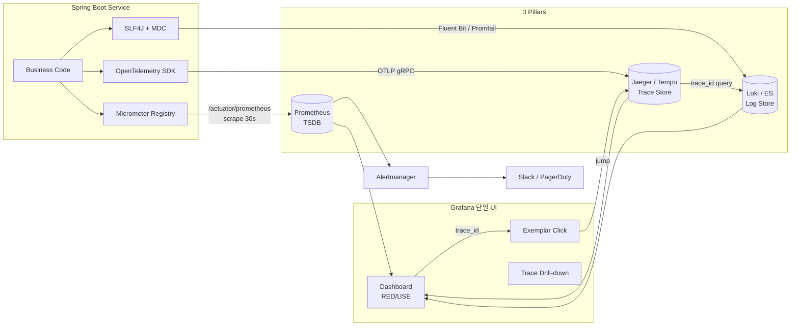

# Observability 3축 — Preview

> 학습자 수준: 중급(intermediate, RED/USE 운영 경험 있음, OpenTelemetry 미경험) · 전체 예상 시간: 18h · 목표: 면접 대비 + msa 운영 인프라 ADR 초안 준비
> 계획서: [00-plan.md](00-plan.md) · 깊이 패키지: P3 (msa 적용 + 면접 + ADR 초안) · 학습 순서: Top-down (개념 → Pillar 별 심화 → SLO → 적용)

---

## 멘탈 모델: "MELT 4축 + Correlation Glue"

운영의 신호(signal)는 흔히 **3축 (Metrics / Events / Logs / Traces — MELT)** 으로 나뉘지만, 면접/실무에서는 **3축 + Correlation Glue** 의 4계층 멘탈 모델이 더 정확하다.

```
  ┌──────────────────────────────────────────────────────────┐
  │  Layer 4: SLO / Error Budget                             │
  │  - SLI = "고객이 행복한 비율"                              │
  │  - Burn Rate Alert (multi-window, multi-burn-rate)       │
  └────────────────────┬─────────────────────────────────────┘
                       │ "신호 3축을 비즈니스 지표로 묶는다"
  ┌────────────────────┴─────────────────────────────────────┐
  │  Layer 3: Correlation Glue                               │
  │  - Trace ID / Span ID 를 Log / Metric Exemplar 에 주입    │
  │  - W3C traceparent 헤더 전파                              │
  │  - Exemplar (Prometheus 2.x) — Histogram bucket → Trace  │
  └────────────────────┬─────────────────────────────────────┘
                       │ "한 요청을 3축으로 동시에 본다"
  ┌────────────────────┴─────────────────────────────────────┐
  │  Layer 2: 3 Pillars (수집 / 저장 / 질의)                  │
  │  Metrics  │  Logs           │  Traces                    │
  │  Prom +   │  ELK / Loki +   │  OTel + Jaeger / Tempo     │
  │  Grafana  │  Fluent Bit     │  W3C Context                │
  └────────────────────┬─────────────────────────────────────┘
                       │ "어떤 신호를 만들어 낼 것인가"
  ┌────────────────────┴─────────────────────────────────────┐
  │  Layer 1: Instrumentation                                │
  │  - Micrometer (Spring Boot)                              │
  │  - SLF4J + MDC (Kotlin Logging)                          │
  │  - OpenTelemetry SDK (Java agent / Manual span)          │
  └──────────────────────────────────────────────────────────┘
```

**핵심 5문장만 외운다**:

1. **Metrics 는 시계열 (집계 가능, 카디널리티 폭증 위험)**, **Logs 는 raw event (조회 가능)**, **Traces 는 한 요청의 인과 그래프** — 3 자료형이 다르다.
2. **Cardinality 폭발은 Prometheus 의 1번 운영 사고** — `userId`, `path`, `requestId` 같은 고유값 라벨 금지.
3. **Histogram > Summary** (bucket 합산 가능, 다중 인스턴스 quantile 계산 가능) — Spring Boot Actuator `percentiles-histogram=true` 가 정답.
4. **OpenTelemetry 는 표준, Jaeger/Zipkin/Tempo 는 백엔드** — Vendor lock-in 회피하려면 OTel API 로 작성.
5. **SLO 는 "행복한 사용자 비율"** — 알람은 burn rate (다중 윈도우) 기준이지 P99 절대값이 아니다.

---

## 소주제 지도

> 15개 파일로 분할. 각 파일 평균 ~1.2h. msa 코드 grep 결과 인용 포함.

### Phase 1: 기본 개념 (1개)

| # | 소주제 | 심화 파일 | 핵심 |
|---|---|---|---|
| 01 | Observability vs Monitoring + 3 Pillars + Cardinality | [01-observability-foundations.md](01-observability-foundations.md) | "unknown unknowns" 탐색, MELT, RED/USE/Golden Signals |

### Phase 2: Metrics 심화 (4개)

| # | 소주제 | 심화 파일 | 핵심 |
|---|---|---|---|
| 02 | Prometheus Pull 모델 + Pushgateway + ServiceMonitor | [02-prometheus-pull-model.md](02-prometheus-pull-model.md) | scrape_interval, exposition format, k3d 환경 적용 |
| 03 | 메트릭 타입 4종 + Histogram vs Summary + Cardinality | [03-metric-types-and-cardinality.md](03-metric-types-and-cardinality.md) | Counter/Gauge/Histogram/Summary, label 설계 룰 |
| 04 | PromQL + Recording Rules + Alertmanager | [04-promql-and-alerting.md](04-promql-and-alerting.md) | rate/histogram_quantile/topk, routing/silencing/grouping |
| 05 | Grafana Dashboard 설계 (RED/USE) + Variable + Exemplar | [05-grafana-dashboards.md](05-grafana-dashboards.md) | http-dashboard.json 분석, ${application} variable |

### Phase 2: Logs 심화 (2개)

| # | 소주제 | 심화 파일 | 핵심 |
|---|---|---|---|
| 06 | ELK vs Loki vs Vector — 비용/카디널리티 트레이드오프 | [06-logs-elk-vs-loki.md](06-logs-elk-vs-loki.md) | full-text vs label index, Logstash 부담, retention/sampling |
| 07 | 구조화 로그 + MDC + Trace ID + PII 마스킹 | [07-structured-logging-correlation.md](07-structured-logging-correlation.md) | JSON encoder, MDC propagation, scrubbing |

### Phase 2: Traces 심화 (2개)

| # | 소주제 | 심화 파일 | 핵심 |
|---|---|---|---|
| 08 | OpenTelemetry — API/SDK/Collector 분리 + W3C Context | [08-opentelemetry-tracing.md](08-opentelemetry-tracing.md) | OTLP, traceparent/tracestate, Java agent vs manual |
| 09 | Sampling 전략 (head vs tail) + 3축 Correlation + Exemplar | [09-sampling-and-correlation.md](09-sampling-and-correlation.md) | 비용 vs 정보, Tempo + Loki + Prometheus 연동 |

### Phase 2: 운영 / Profiling (2개)

| # | 소주제 | 심화 파일 | 핵심 |
|---|---|---|---|
| 10 | SLO / SLI / Error Budget + Burn Rate + ADR-0025 결합 | [10-slo-sli-error-budget.md](10-slo-sli-error-budget.md) | "행복한 사용자 비율", multi-window burn rate alert |
| 11 | eBPF Profiling — Pyroscope / Parca + Continuous Profiling | [11-ebpf-profiling-pyroscope.md](11-ebpf-profiling-pyroscope.md) | "4번째 pillar", JFR / async-profiler 보완 |

### Phase 3: msa 적용 (1개)

| # | 소주제 | 심화 파일 | 핵심 |
|---|---|---|---|
| 12 | msa 코드베이스 현 상태 + Gap 분석 | [12-msa-current-state.md](12-msa-current-state.md) | servicemonitor-apps.yaml, QuantMetrics, 빈 로그/트레이스 자리 |

### Phase 4: 산출물 (2개)

| # | 소주제 | 심화 파일 | 핵심 |
|---|---|---|---|
| 13 | ADR 초안 — Loki 도입 + OpenTelemetry + RED 표준화 | [13-improvements.md](13-improvements.md) | 우선순위 + 의사결정 근거 + ADR 후보 |
| 14 | 면접 Q&A 카드 (40문항) | [14-interview-qa.md](14-interview-qa.md) | "장애를 어떻게 탐지하나요" 부터 "Cardinality" 까지 |

---

## 개념 관계도



> 관측성 도구의 가장 큰 가치는 **3축 사이의 drill-down 경로**에 있다. `metric → trace → log` 의 단방향 연결은 P0 장애 응대 시간을 분 단위로 줄인다.

---

## Phase 1 치트시트 (학습 시작 전 한 장)

### Pillar 별 권장 스택 (2026 기준 OSS)

| 축 | 1순위 | 비고 |
|---|---|---|
| Metrics | **Prometheus + Grafana** | kube-prometheus-stack 표준 |
| Logs (저비용) | **Grafana Loki + Promtail** | label 인덱싱, S3/GCS 백엔드 |
| Logs (full-text) | Elasticsearch + Filebeat / Fluent Bit | 검색이 1순위면 ELK |
| Traces | **OpenTelemetry SDK + Tempo / Jaeger** | OTel 이 산업 표준 |
| Profiling | Pyroscope / Parca | "4번째 pillar" — 도입 ROI 큼 |
| Single UI | **Grafana** | 3축 + Profiling + Alert 통합 |

### 절대 하지 말 것

- 메트릭 라벨에 `userId`, `requestId`, raw URL path 직접 — Cardinality 폭발
- `log.error` 로 전체 request body 덤프 (PII 유출 + 비용)
- Tracing 100% sampling 운영 (비용 폭발) — Tail-based 또는 1-10%
- `time.Now()` 직접 측정 → 메트릭 누락 가능성, **Micrometer Timer.record** 사용
- `summary` 메트릭으로 cluster aggregation P99 — Histogram 만 가능
- `alg=none` 처럼 Prometheus 도 자체 Auth 없음 → Ingress 노출 금지

---

## 학습 진행 가이드

- 권장 순서: **01 → 02 → ... → 14** (Top-down 직진)
- Metrics → Logs → Traces 순서 권장 (어려움 순)
- 11 (eBPF) 는 보너스 — JFR (#02 학습) 과 cross-ref 됨
- 12 (msa current state) 는 Phase 3 직전 grep 결과 묶음 — 실무 ADR 작성 입력
- 13/14 는 학습 종료 후 1주일 간격 회독

각 파일 호출:
```
/study:start 10           # 다음 deep file 자동 선택
/study:start 10 04        # 04-promql-and-alerting.md 직접 지정
```

## 관련 학습 토픽 cross-ref

| 토픽 | 연결점 |
|---|---|
| #02 JVM | JFR / async-profiler — `11-ebpf-profiling-pyroscope.md` 와 cross-ref |
| #15 Connection Pool | HikariCP MicroMeter binder — `03-metric-types-and-cardinality.md` 의 실 사례 |
| #17 Spring Web | HandlerInterceptor 의 trace ID propagation — `07-structured-logging-correlation.md` |
| #13 Crypto / JWT | 로그 마스킹 (PII / token) — `07-structured-logging-correlation.md` |
| ADR-0025 Latency Budget | P99 SLA → SLO/Error Budget — `10-slo-sli-error-budget.md` |
