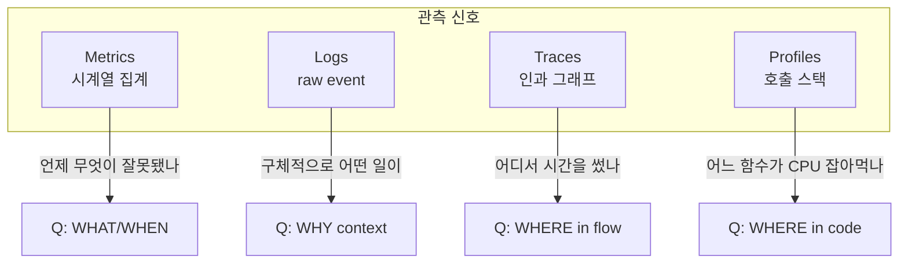

# 01. Observability 기초 — 3 Pillars / Cardinality / 방법론

## 1. Monitoring vs Observability — 면접 1번 단골

| 구분 | Monitoring | Observability |
|---|---|---|
| 목적 | "예상한 실패" 탐지 | "예상하지 못한 실패" 탐색 |
| 질문 형태 | "디스크가 꽉 찼나?" (yes/no) | "왜 P99 가 튀었지?" (open-ended) |
| 데이터 | 사전에 정의한 메트릭 + 임계값 | high-cardinality event + raw log + trace |
| 정신 모델 | 운전석 계기판 | 디버거 |
| 대표 도구 | Nagios, Zabbix, Prometheus alert | Honeycomb, Datadog, Grafana stack |

> **2026 면접 답변 템플릿**: "Monitoring 은 known unknowns 을 다루고, Observability 는 unknown unknowns 을 다룹니다. 모니터링은 SLO 위반/소진 알람을 발생시키고, 관측성은 그 알람의 원인을 사후에 자유 질의로 추적할 수 있게 합니다."

### 1.1 unknown unknowns 의 의미

- **known knowns**: 내가 알고 있고, 모니터링하고 있다 (CPU > 80% alert)
- **known unknowns**: 내가 모르지만, 모니터링은 가능하다 (Heap dump 분석)
- **unknown unknowns**: 내가 무엇이 무엇인지조차 모른다 (어떤 사용자 ID 의 어떤 path 가 P99 100배 튀고 있나?)

→ Observability 는 **사후 자유 질의 (ad-hoc query)** 로 unknown unknowns 를 좁혀가는 능력. 이걸 위해 high-cardinality 데이터를 보존해야 함 → 자연스럽게 비용 문제로 연결됨.

## 2. 3 Pillars — Metrics / Logs / Traces (+ Profiling)



### 2.1 자료형이 다르다 — 가장 중요한 한 줄

| Pillar | 자료형 | 예 | 압축 가능성 |
|---|---|---|---|
| Metrics | (label set, timestamp, float64) 의 시계열 | `http_server_requests_seconds_count{method="GET",status="200"}` | 매우 높음 (수치 deltadelta) |
| Logs | 자유 형식 텍스트 / 구조화 JSON | `{"level":"ERROR","msg":"DB timeout","trace_id":"abc"}` | 중간 (텍스트 압축) |
| Traces | DAG of (Span, Span) | spans + parent reference | 낮음 (event 본문) |
| Profiles | flame graph (stack frame, sample count) | pprof / JFR | 낮음 |

→ **저장 비용 / 보관 기간 / 카디널리티 한계가 모두 다르다**. 그래서 한 도구 (예: ELK 만, 또는 Datadog 만) 로 다 묶으면 비용이 폭증한다.

### 2.2 신호 별 보관 기간 권장값 (실무 표준)

| Pillar | Hot (즉시 질의) | Warm | Cold |
|---|---|---|---|
| Metrics (Prometheus) | 15d | 90d (Thanos / Mimir) | 1y+ (downsample) |
| Logs | 7d (전체) | 30d (sampled) | 1y (compressed S3) |
| Traces | 3d (sampled 1-10%) | n/a | n/a |
| Profiles | 7d | 30d | n/a |

> msa 의 `k8s/infra/prod/monitoring/values.yaml` 는 `prometheus.prometheusSpec.retention: 15d` — Hot tier 만 운영 중. Logs/Traces 는 미도입 상태.

## 3. Cardinality — 모든 관측성의 1번 적

**Cardinality (기수)** = 특정 차원 (label) 이 가질 수 있는 고유값 개수.

```
metric:    http_server_requests_seconds_count
labels:    {method, status, uri, application, instance}
cardinality = |method| × |status| × |uri| × |application| × |instance|
            = 5 × 30 × 200 × 15 × 10
            = 4,500,000 시계열
```

→ 시계열 1개당 ~3KB Prometheus head 메모리 ≈ **13.5GB**. 라벨 1개만 잘못 추가해도 폭발.

### 3.1 절대 라벨로 쓰면 안 되는 값

- `userId`, `accountId`, `email`, `sessionId`
- raw URL path (예: `/users/12345`) — **template path** (`/users/:id`) 를 쓴다
- timestamp, requestId, traceId
- IP, hostname (instance 라벨로만)
- 자유 입력 텍스트 (검색어 등)

### 3.2 Cardinality 예방 룰 — msa 코드에서 강제하는 방식

`quant/app/.../QuantMetrics.kt` 가 모범 사례 (실제 코드 인용):

```kotlin
// ✅ enum / 상수 집합만 라벨로 사용
fun marketTickReceived(exchange: String, symbol: String, source: String) {
    val counter = tickReceivedCounters.computeIfAbsent(Triple(exchange, symbol, source)) {
        Counter.builder(METRIC_MARKET_TICK_RECEIVED_TOTAL)
            .tag("exchange", exchange)   // bithumb / upbit (2)
            .tag("symbol", symbol)       // BTC_KRW / ETH_KRW (Phase 2 = 2)
            .tag("source", source)       // WS / REST / BACKTEST (3)
            .register(registry)
    }
    counter.increment()
}
// 카디널리티 ≤ 2 × 2 × 3 = 12 (안전)
```

코드 주석 (실제 QuantMetrics.kt 54-60 줄):

```
## 사용 규칙 (ADR-0021)
- API key / Bot token / 평문 credential 을 태그 값으로 절대 사용하지 않는다.
- symbol 태그는 거래쌍(BTC_KRW 등) 과 같이 카디널리티가 제한된 값만 허용.
- from_version / to_version 태그는 KEK 라벨이 아닌 INT 값 — 카디널리티 제한.
```

## 4. 방법론 3종 — 같은 신호를 다른 관점으로 본다

면접에서 자주 묻는다: "RED/USE/Golden Signals 차이?"

### 4.1 RED — Rate / Errors / Duration (서비스 관점)

Tom Wilkie (Weaveworks) 제안. **request 를 처리하는 서비스** 에 적용.

| R | Rate — 초당 요청 수 |
| E | Errors — 실패 비율 |
| D | Duration — 응답 시간 분포 (p50/p95/p99) |

> Spring Boot 의 `http_server_requests_seconds_*` 메트릭이 RED 3개를 그대로 노출함. → Grafana panel 3개로 RED dashboard 1개 완성 가능.

```promql
# Rate
sum(rate(http_server_requests_seconds_count[1m])) by (application)

# Errors
sum(rate(http_server_requests_seconds_count{status=~"5.."}[1m]))
  / sum(rate(http_server_requests_seconds_count[1m]))

# Duration P99
histogram_quantile(0.99,
  sum(rate(http_server_requests_seconds_bucket[1m])) by (le, application))
```

### 4.2 USE — Utilization / Saturation / Errors (리소스 관점)

Brendan Gregg 제안. **리소스 (CPU, Memory, Disk, Network)** 에 적용.

| U | Utilization — 시간 비율로 사용 중 |
| S | Saturation — 대기 큐 / overcommit 정도 |
| E | Errors — 에러 카운트 |

> 대기 (Saturation) 가 핵심. Util 이 70% 라도 큐가 길면 사용자 latency 폭증. JVM 의 `gc.pause` 또는 HikariCP 의 `pendingThreads` 가 Saturation 의 좋은 예.

### 4.3 Google SRE — Four Golden Signals

| Latency | 응답 시간 |
| Traffic | 부하 |
| Errors | 에러율 |
| Saturation | 포화도 |

→ RED + USE 의 합집합. 사용자 향(Latency/Traffic/Errors) + 리소스(Saturation) 한 묶음.

### 4.4 어떤 걸 언제 쓰나 — 면접 답변

> "RED 는 서비스 별 dashboard 의 기본 템플릿으로 씁니다. USE 는 노드 / 리소스 dashboard (kube-state-metrics + node-exporter) 에 적용합니다. Golden Signals 는 SLO 정의 input 으로 사용합니다 — 4 신호 중 latency/error 를 SLI 후보로 올리는 식입니다."

## 5. MELT vs 3 Pillars 논쟁 — 2024+ 트렌드

Charity Majors (Honeycomb) 의 비판: **"3 Pillars 는 잘못된 모델이다"**.

- 3 Pillars 는 **데이터 형식 분류** (저장 도구의 관점)
- 운영자는 데이터 형식이 아니라 **요청 단위 (event)** 로 사고함
- 따라서 high-cardinality wide event (모든 컨텍스트가 한 row) 가 더 강력하다 → Honeycomb 모델

**MELT** (Metrics, Events, Logs, Traces) 는 절충안 — Event 를 추가하여 "요청 단위 wide row" 의 자리를 명시.

> **답변 템플릿**: "3 Pillars 는 저장 도구의 분류이고, 운영자는 wide event 단위로 사고하는 게 효율적이라는 비판이 있습니다 (Honeycomb). 하지만 OSS (Prometheus + Loki + Tempo) 조합으로도 trace_id 만 잘 전파하면 사실상 wide event 와 같은 drill-down 이 가능합니다."

## 6. Observability 도입 시 흔한 실패 5가지

1. **메트릭만 도입하고 끝** — 장애 시 "왜?" 를 답하지 못함 (5xx 그래프만 보고 있음)
2. **고-카디널리티 라벨** — Prometheus head OOM
3. **로그를 ELK 에 다 때려박음** — 비용 5배 증가, 검색 느려짐
4. **Tracing 100% sampling** — 트레이스 백엔드 비용 폭발
5. **Trace ID 가 로그에 안 들어감** — 3축 분리 운용 → 장애 응대 시간 증가

## 7. msa 적용 체크리스트 (Phase 3 미리보기)

- [x] Metrics (Prometheus) 도입 — `kube-prometheus-stack` Helm chart
- [x] Spring Boot Actuator + Micrometer — 16개 서비스 모두
- [x] ServiceMonitor — `commerce-platform-apps` (k8s/infra/prod/monitoring/servicemonitor-apps.yaml)
- [x] Grafana dashboard 3종 — JVM / HTTP / Service Overview
- [ ] **Logs 수집** — 미도입 (ELK 도 Loki 도 아직 없음)
- [ ] **Tracing** — 미도입 (OpenTelemetry / Sleuth / Brave 모두 미적용)
- [ ] **MDC / trace ID 전파** — 미도입 (gateway, common 에 관련 코드 없음, grep 확인됨)
- [ ] **SLO 정의** — ADR-0025 latency budget 까지만 (P99 SLA target 명시)
- [ ] **Profiling** — 미도입

→ 면접에서: "Metrics 인프라는 안정화됐고, 다음은 OpenTelemetry + Loki 도입이 우선순위라고 ADR 초안을 준비 중입니다."

## 8. 핵심 정리

- Monitoring (known) vs Observability (unknown) — **자유 질의 가능성**이 핵심 차이
- 3 Pillars 는 **자료형이 다르다** → 저장/보관 비용/카디널리티 모두 다른 도구가 필요
- **Cardinality 는 1번 적** — 라벨 설계는 enum/상수만, raw 식별자 금지
- RED (서비스) + USE (리소스) + Golden Signals (SLO input) — 같은 신호의 3가지 관점
- msa 는 Metrics 만 도입 — Logs/Traces 는 ADR 초안 단계 (#13 에서 작성)

## 9. 다음 단계

- [02-prometheus-pull-model.md](02-prometheus-pull-model.md) — Pull 모델 / scrape / Pushgateway / ServiceMonitor 자동 발견
