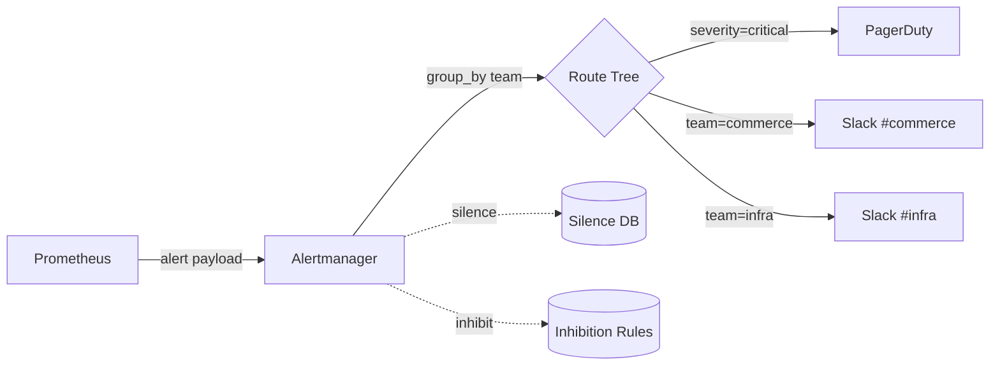

# 04. PromQL — 핵심 함수 / Recording Rules / Alertmanager

## 1. PromQL 자료형 4종

| 자료형 | 의미 | 예 |
|---|---|---|
| Instant vector | 시계열 집합의 한 시점 값 | `up{job="product"}` |
| Range vector | 시계열 집합의 범위 값 | `up{job="product"}[5m]` |
| Scalar | 단일 숫자 | `2` |
| String | 문자열 (alert annotation 용도) | `"hello"` |

**대부분의 PromQL 함수는 Range vector 를 받아 Instant vector 를 반환**. (예: `rate(...[5m])`)

## 2. 핵심 함수 7개

### 2.1 `rate(counter[5m])` — 초당 변화율

```promql
# 초당 요청 수 (RED 의 R)
sum(rate(http_server_requests_seconds_count[5m])) by (application)
```

- counter reset 자동 보정 (Pod restart 시 0 리셋도 대응)
- rate window 는 **scrape_interval 의 4배 이상** 권장 (msa 30s scrape → 2m 이상)

### 2.2 `irate(counter[2m])` — 즉시 변화율

```promql
irate(http_server_requests_seconds_count[2m])
```

- 마지막 2 sample 만 사용 → 알람용으로 빠른 반응
- noise 큼 → dashboard 표시는 rate 권장

### 2.3 `histogram_quantile(0.99, ...)` — bucket 보간

```promql
histogram_quantile(0.99,
  sum(rate(http_server_requests_seconds_bucket{application="product"}[5m]))
    by (le)
)
```

- `by (le)` 가 누락되면 결과 없음 (가장 흔한 실수)
- bucket 이 sparse 하면 정확도 낮음 → SLO 라인 부근에 dense bucket 필요

### 2.4 `sum() by / without` — 차원 집계

```promql
# 인스턴스 합산 (instance 라벨 제거)
sum(rate(http_server_requests_seconds_count[5m])) without (instance)

# application 단위로만 (다른 라벨 제거)
sum(rate(http_server_requests_seconds_count[5m])) by (application)
```

- `by` 는 **남길** 라벨, `without` 는 **제거할** 라벨
- aggregation operator: sum, avg, min, max, count, stddev, topk, bottomk, quantile

### 2.5 `topk(N, expr)` — 상위 N개

```promql
# 가장 느린 5개 endpoint
topk(5,
  histogram_quantile(0.99,
    sum(rate(http_server_requests_seconds_bucket[5m])) by (le, uri)
  )
)
```

→ 노이지한 dashboard 를 정리할 때 매우 유용. 단, 매번 다른 series 가 떠서 **alerting 에는 부적절** (flapping).

### 2.6 `increase(counter[1h])` — 절대 증가량

```promql
# 1시간 동안 5xx 총 횟수
increase(http_server_requests_seconds_count{status=~"5.."}[1h])
```

- `rate × duration` 과 동일
- counter reset 보정됨

### 2.7 `predict_linear(gauge[1h], 4*3600)` — 4시간 후 예측

```promql
# 4시간 후 디스크가 0보다 작아지나? (선형 회귀)
predict_linear(node_filesystem_avail_bytes[1h], 4 * 3600) < 0
```

→ 디스크 / 메모리 만료 예측 alert 의 정석.

## 3. 자주 쓰는 표현식 (cookbook)

### 3.1 5xx 비율 (RED 의 E)

```promql
sum(rate(http_server_requests_seconds_count{status=~"5.."}[5m])) by (application)
  /
sum(rate(http_server_requests_seconds_count[5m])) by (application)
```

→ msa 의 http-dashboard 에 추가 권장 panel (현재는 rate 만).

### 3.2 Apdex Score (간이 SLI)

```promql
(
  sum(rate(http_server_requests_seconds_bucket{le="0.1"}[5m]))     # T = 100ms
  + sum(rate(http_server_requests_seconds_bucket{le="0.4"}[5m]))/2 # 4T = 400ms (절반 가중치)
) / sum(rate(http_server_requests_seconds_count[5m]))
```

### 3.3 GC Pause 영향 (#02 cross-ref)

```promql
# 1분간 GC pause 합산 (s)
sum(rate(jvm_gc_pause_seconds_sum[1m])) by (application)
```

### 3.4 HikariCP saturation (#15 cross-ref)

```promql
# pendingThreads = 풀이 부족하다는 신호
hikaricp_connections_pending
```

## 4. Recording Rules — 비싼 쿼리 미리 계산

자주 쓰는 / 비싼 쿼리를 주기적으로 평가해서 새 메트릭으로 저장.

```yaml
groups:
  - name: msa-red
    interval: 30s
    rules:
      - record: msa:http_request_rate:5m
        expr: |
          sum(rate(http_server_requests_seconds_count[5m])) by (application)

      - record: msa:http_error_ratio:5m
        expr: |
          sum(rate(http_server_requests_seconds_count{status=~"5.."}[5m])) by (application)
            /
          sum(rate(http_server_requests_seconds_count[5m])) by (application)

      - record: msa:http_p99:5m
        expr: |
          histogram_quantile(0.99,
            sum(rate(http_server_requests_seconds_bucket[5m])) by (le, application)
          )
```

### 4.1 명명 규칙

`<level>:<metric>:<operation>` (Prometheus 공식 권장)

- `level` = aggregation level (cluster / namespace / application)
- `metric` = 원본 메트릭
- `operation` = `rate5m`, `p99` 등

→ msa 의 `prom rules` 는 미작성 상태. ADR 후보.

### 4.2 Recording vs Alerting Rule 의 차이

| 구분 | Recording | Alerting |
|---|---|---|
| 결과 | 새 시계열 저장 | alert state (firing/pending) |
| 사용처 | dashboard 가속 | Alertmanager 전송 |
| 평가 | 매 interval 마다 | 매 interval 마다 |

## 5. Alerting Rules

```yaml
groups:
  - name: msa-tier1
    rules:
      - alert: ProductHighErrorRate
        expr: msa:http_error_ratio:5m{application="product"} > 0.05
        for: 5m
        labels:
          severity: critical
          team: commerce
        annotations:
          summary: "Product service 5xx 비율이 5% 초과"
          description: "{{ $labels.application }} 5xx 비율 {{ $value | humanizePercentage }}"
          runbook: "https://wiki/runbooks/product-5xx"
```

### 5.1 `for: 5m` 의 의미 — pending → firing

- 표현식 true 가 5분 연속 유지되면 firing → Alertmanager 로 전송
- `for: 0` 이면 즉시 firing (스파이크 알람용)
- 너무 길면 (예: 30m) 알람 늦음, 너무 짧으면 noise

### 5.2 SLO 기반 burn rate alert (Google SRE 정석)

이건 #10 (SLO) 에서 자세히. 미리보기:

```yaml
- alert: ProductErrorBudgetBurnFast
  expr: |
    (
      sum(rate(http_server_requests_seconds_count{application="product",status=~"5.."}[5m]))
        / sum(rate(http_server_requests_seconds_count{application="product"}[5m]))
    ) > 14.4 * 0.001       # 14.4× SLO error budget burn rate
    and
    (
      sum(rate(http_server_requests_seconds_count{application="product",status=~"5.."}[1h]))
        / sum(rate(http_server_requests_seconds_count{application="product"}[1h]))
    ) > 14.4 * 0.001
  for: 2m
```

→ Multi-window (5m + 1h) + multi-burn-rate. 짧은 윈도우만 보면 false positive 많음.

## 6. Alertmanager — Routing / Grouping / Silencing



### 6.1 Routing Tree

```yaml
route:
  group_by: ['alertname', 'cluster']
  group_wait: 30s        # 첫 알람 후 30초 동안 추가 묶음 기다림
  group_interval: 5m     # 같은 그룹 내 새 알람 도착 시 5분 대기
  repeat_interval: 4h    # 동일 알람 재발송 간격
  receiver: 'default'

  routes:
    - matchers:
        - severity = "critical"
      receiver: 'pagerduty'
      continue: true   # 추가 라우트도 평가

    - matchers:
        - team = "commerce"
      receiver: 'slack-commerce'

    - matchers:
        - team = "infra"
      receiver: 'slack-infra'
```

### 6.2 Grouping — alert storm 방지

10개 Pod 가 동시에 5xx 폭발 → 10개 alert 가 아니라 **1개 grouped alert** (with 10 instances).

`group_by`:
- `[]` 또는 `['...']` 미지정: 모든 alert 1개로 묶임 (위험)
- `['alertname']`: 같은 alert name 묶임
- `['alertname', 'cluster']`: alertname × cluster 단위 (실무 표준)

### 6.3 Inhibition — 더 큰 알람이 작은 알람 무시

```yaml
inhibit_rules:
  - source_matchers:
      - alertname = "K8sNodeDown"
    target_matchers:
      - severity = "critical"
    equal: ['cluster', 'node']
```

→ 노드 자체가 죽으면 그 노드 위의 모든 service alert 는 무시 (root cause 만 page).

### 6.4 Silence — 의도된 알람 차단

- 배포 / 점검 시 미리 silence 등록
- API: `amtool silence add alertname=ProductHighErrorRate cluster=prod`
- 만료 시간 필수 — 영구 silence 는 안티패턴

### 6.5 Receiver 통합

| Receiver | 용도 | 참고 |
|---|---|---|
| Slack | 일반 알람 | webhook URL |
| PagerDuty | 24/7 critical | service key |
| Email | 백업 채널 | SMTP |
| Webhook | 자체 시스템 | JSON POST |
| OpsGenie | 듀티 회전 | API |

## 7. SLO 친화적 alert 설계 — "Multi-Window Multi-Burn-Rate"

Google SRE Workbook §5 정석.

```yaml
# 빠른 burn rate (1시간에 SLO 의 2% 소진) — 즉시 page
- alert: ErrorBudgetBurnFast
  expr: |
    (rate5m_error > 14.4 * slo) and (rate1h_error > 14.4 * slo)
  for: 2m
  labels:
    severity: page

# 느린 burn rate (6시간에 SLO 의 5% 소진) — ticket
- alert: ErrorBudgetBurnSlow
  expr: |
    (rate30m_error > 6 * slo) and (rate6h_error > 6 * slo)
  for: 15m
  labels:
    severity: ticket
```

| Window 1 | Window 2 | Burn rate | 조치 | 의미 |
|---|---|---|---|---|
| 5m | 1h | 14.4 | page | 1h 안에 SLO 의 2% 소진 (한달 소진 60시간) |
| 30m | 6h | 6 | ticket | 6h 안에 SLO 의 5% 소진 |
| 2h | 24h | 3 | ticket | 24h 안에 SLO 의 10% 소진 |
| 6h | 3d | 1 | ticket | 정상 burn |

→ 자세한 derivation 은 #10 에서.

## 8. Alertmanager 운영 함정

### 8.1 group_wait 0 = noise 폭발
30초 정도 둬서 같은 그룹 내 후속 alert 를 묶을 시간 확보.

### 8.2 repeat_interval 너무 짧음 = alert fatigue
4시간 정도가 표준. 4분으로 두면 듀티가 무뎌짐.

### 8.3 receiver 별 timeout / retry
Slack 다운 시 alert 가 영영 사라짐 → 백업 receiver (email) 권장.

### 8.4 Cluster 모드
Alertmanager 는 cluster 모드로 N대 띄울 수 있음 — gossip 으로 알람 dedup. K8s 에서는 statefulset 2-3 replica 표준.

## 9. msa 의 현재 상태 (Phase 3 미리보기)

- ✅ Prometheus rule selector: `ruleSelectorNilUsesHelmValues: false` (values.yaml)
- ✅ Alertmanager 설치됨 (kube-prometheus-stack 기본)
- ❌ **Alerting / Recording Rules 코드 없음** — `k8s/infra/prod/monitoring/` 에 PrometheusRule CR 미작성
- ❌ Slack/PagerDuty receiver 미설정

→ Improvements (#13) 에 PrometheusRule / receiver 설정 ADR 후보 명시.

## 10. PromQL 학습 후 흔한 실수 5선

1. `rate(gauge[5m])` — Gauge 에 rate 쓰면 잘못된 값. delta() 또는 deriv() 사용.
2. `histogram_quantile` 에 `by (le)` 누락 — 결과 empty
3. `sum() by ()` 와 `sum()` 차이 모름 — 후자는 모든 라벨 제거
4. `for: 0` alert — 1초 스파이크에도 발송, alert storm
5. `unless` operator 모르면 "예외 처리" 못함:
   ```promql
   # 5xx > 10% 인데 maintenance 윈도우 제외
   error_ratio > 0.1 unless on(application) maintenance_window == 1
   ```

## 11. 핵심 정리

- 핵심 함수 7개: rate / irate / histogram_quantile / sum by / topk / increase / predict_linear
- Recording Rules = 비싼 쿼리 미리 계산. naming `<level>:<metric>:<op>`
- Alerting: `for:` 로 pending → firing, `for: 0` 위험
- Alertmanager: routing tree + grouping + inhibition + silence
- SLO 친화 alert = Multi-Window Multi-Burn-Rate (Google SRE 정석)
- msa 는 PrometheusRule CR 미작성 — ADR 후보

## 12. 다음 단계

- [05-grafana-dashboards.md](05-grafana-dashboards.md) — Dashboard 설계 / Variable / Exemplar
