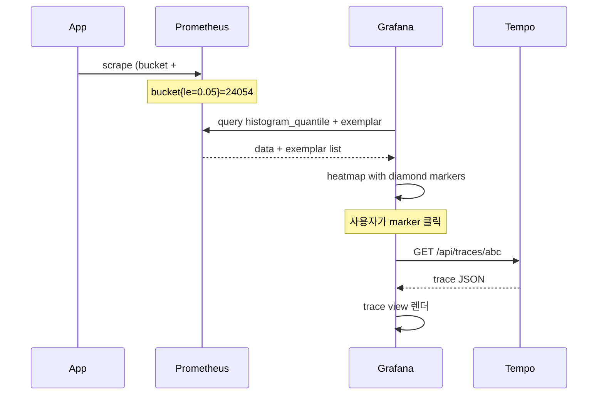
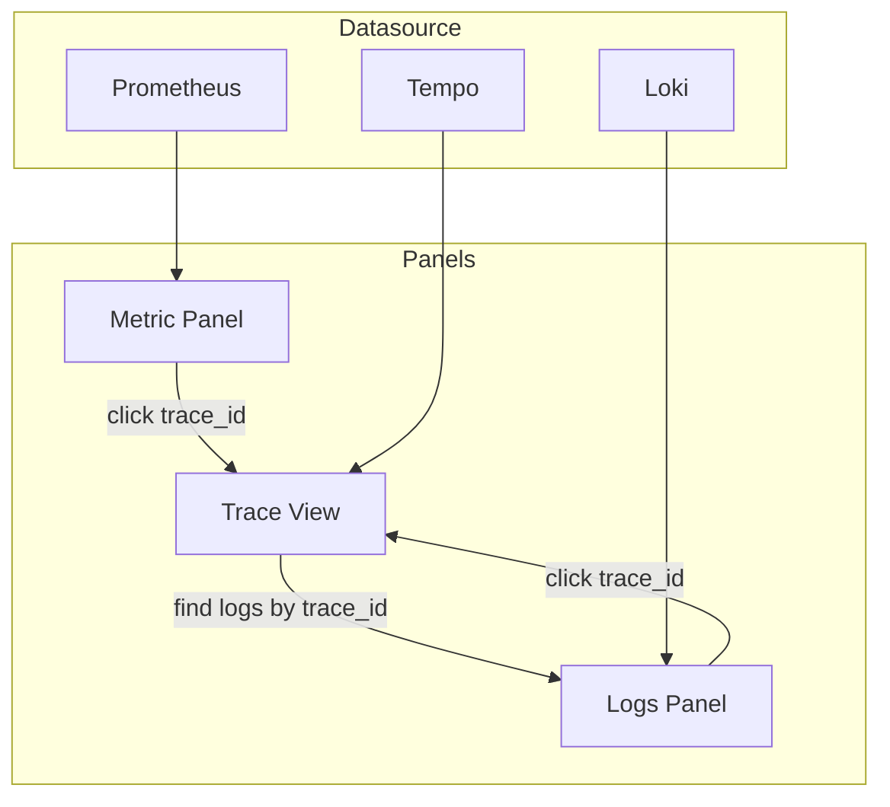

# 05. Grafana — Dashboard 설계 / Variable / Provisioning / Exemplar

## 1. Dashboard 의 4계층 멘탈 모델

```
┌──────────────────────────────────────────┐
│  L4: SLO Dashboard                       │
│  - Error Budget 잔량                     │
│  - Burn Rate 현황                        │
└──────────────┬───────────────────────────┘
┌──────────────┴───────────────────────────┐
│  L3: Service-Level Dashboard (RED)       │
│  - Rate / Errors / Duration              │
│  - Application 별 (variable)             │
└──────────────┬───────────────────────────┘
┌──────────────┴───────────────────────────┐
│  L2: Resource Dashboard (USE)            │
│  - JVM / DB pool / Tomcat                │
└──────────────┬───────────────────────────┘
┌──────────────┴───────────────────────────┐
│  L1: Infra Dashboard                     │
│  - Node / Pod / Namespace                │
└──────────────────────────────────────────┘
```

→ msa 의 dashboard 3종은 L2 (jvm-dashboard), L3 (http-dashboard), L1+L3 일부 (service-overview) 에 해당. L4 는 미작성.

## 2. RED Dashboard — 가장 중요한 한 장

**Rate / Errors / Duration** 3개 panel + filter variable. msa 의 `http-dashboard.json` 이 이 구조.

### 2.1 Rate Panel

```json
{
  "expr": "sum(rate(http_server_requests_seconds_count{application=~\"$application\"}[1m])) by (application)",
  "legendFormat": "{{application}}",
  "title": "Request Rate",
  "unit": "reqps"
}
```

→ 실제 `http-dashboard.json:30` 그대로.

### 2.2 Errors Panel (msa 에 누락 — 추가 권장)

```json
{
  "expr": "sum(rate(http_server_requests_seconds_count{application=~\"$application\",status=~\"5..\"}[1m])) by (application) / sum(rate(http_server_requests_seconds_count{application=~\"$application\"}[1m])) by (application)",
  "legendFormat": "{{application}} 5xx ratio",
  "title": "Error Ratio",
  "unit": "percentunit"
}
```

→ #13 improvements 에서 ADR 으로 표준화 제안.

### 2.3 Duration Panel — p50/p95/p99 함께

```json
{
  "title": "Response Time (p50 / p95 / p99)",
  "targets": [
    { "expr": "histogram_quantile(0.50, sum(rate(http_server_requests_seconds_bucket{application=~\"$application\"}[1m])) by (le, application))", "legendFormat": "{{application}} p50" },
    { "expr": "histogram_quantile(0.95, ...)", "legendFormat": "{{application}} p95" },
    { "expr": "histogram_quantile(0.99, ...)", "legendFormat": "{{application}} p99" }
  ]
}
```

→ 실제 `http-dashboard.json:51-72`.

### 2.4 Heatmap Panel — Duration 의 분포 시각화

p99 line chart 만으로는 분포의 bimodal 을 놓침 (예: 50ms 와 800ms 두 봉우리). Heatmap 으로 확인:

```json
{
  "type": "heatmap",
  "targets": [{
    "expr": "sum(rate(http_server_requests_seconds_bucket{application=~\"$application\"}[1m])) by (le)",
    "format": "heatmap",
    "legendFormat": "{{le}}"
  }],
  "title": "Latency Heatmap"
}
```

→ ADR-0025 §4 에서도 "Heatmap 패널 필수" 명시.

## 3. Variable — Dashboard 재사용성

`${application}` 처럼 사용자가 dropdown 으로 선택하는 변수. msa 의 dashboard 에 이미 적용됨.

### 3.1 Variable 정의

```json
{
  "templating": {
    "list": [
      {
        "name": "datasource",
        "type": "datasource",
        "query": "prometheus"
      },
      {
        "name": "application",
        "type": "query",
        "datasource": { "type": "prometheus", "uid": "${datasource}" },
        "query": "label_values(http_server_requests_seconds_count, application)",
        "multi": true,
        "includeAll": true
      }
    ]
  }
}
```

### 3.2 Variable 패턴

| Variable | 쿼리 | 용도 |
|---|---|---|
| `application` | `label_values(http_server_requests_seconds_count, application)` | 서비스 필터 |
| `instance` | `label_values(up{job="$job"}, instance)` | Pod 단위 |
| `interval` | `1m,5m,15m,1h` (custom) | rate window 가변 |
| `quantile` | `0.5,0.95,0.99` (custom) | 동적 percentile |

→ 변수 chain: `datasource → job → instance` 로 cascading 가능.

### 3.3 multi-value variable + `=~` regex

```promql
http_server_requests_seconds_count{application=~"$application"}
```

`$application` 가 `product|order` 면 위 식이 `=~ "product|order"` 로 확장.

## 4. Annotation — 배포 시각 표시

```json
{
  "annotations": {
    "list": [{
      "name": "Deployments",
      "datasource": { "type": "prometheus", "uid": "${datasource}" },
      "expr": "changes(kube_deployment_status_observed_generation{namespace=\"commerce\"}[1m]) > 0",
      "iconColor": "blue",
      "titleFormat": "{{deployment}} deployed"
    }]
  }
}
```

→ p99 가 튄 시점에 "방금 product 배포" annotation 이 보이면 root cause 1초만에 식별. 매우 강력.

## 5. Provisioning — "GitOps 친화" Dashboard

ConfigMap label 기반 자동 import. msa 의 `values.yaml`:

```yaml
grafana:
  sidecar:
    dashboards:
      enabled: true
      label: grafana_dashboard
      labelValue: "1"
      searchNamespace: ALL
```

→ `grafana_dashboard: "1"` 라벨 붙은 ConfigMap 을 sidecar 가 watch 해서 Grafana API 로 자동 등록.

`k8s/infra/prod/monitoring/dashboards/kustomization.yaml` 도 이 패턴.

### 5.1 ConfigMap 에 dashboard 넣기

```yaml
apiVersion: v1
kind: ConfigMap
metadata:
  name: msa-http-dashboard
  namespace: monitoring
  labels:
    grafana_dashboard: "1"
data:
  http-dashboard.json: |
    { "title": "MSA HTTP", ... }
```

### 5.2 Datasource 도 동일 메커니즘

```yaml
grafana:
  sidecar:
    datasources:
      enabled: true
      label: grafana_datasource
      labelValue: "1"
```

→ Loki / Tempo 추가 시 ConfigMap 1개씩 추가하면 자동 등록.

## 6. Exemplar — Metric → Trace drill-down

Prometheus 2.30+ + Grafana 7+ 지원. **클릭 한 번에 Trace 점프**.

### 6.1 동작 흐름



### 6.2 Spring Boot 측 활성화

```yaml
management:
  metrics:
    distribution:
      percentiles-histogram:
        http.server.requests: true
  observations:
    annotations:
      enabled: true
  tracing:
    sampling:
      probability: 0.1
```

OpenTelemetry / Micrometer Tracing bridge 필요 → #08 에서 자세히.

### 6.3 Exemplar 가 왜 게임 체인저인가

- 기존: Heatmap 에서 outlier bucket 발견 → Jaeger 로 "비슷한 시각의 trace" 검색 → 운 좋게 발견
- Exemplar: 그 outlier 가 **정확히 어떤 trace 였는지** 가 메트릭에 직접 박혀 있음 → 클릭 1번

→ msa 의 P3 ADR 후보: Exemplar 활성화 + Tempo 도입.

## 7. Dashboard 설계 안티패턴

### 7.1 Panel 30개짜리 dashboard
한 화면에 30개 → 모두 무시됨. **8-12 panel 이 상한**. 그 이상은 별 dashboard 로.

### 7.2 동일 metric 의 여러 시각화
같은 메트릭을 line / bar / gauge 로 3번 표시 → 노이즈. 1개만.

### 7.3 raw counter 표시
`backtest_run_total` 같은 누적값을 그대로 그리면 의미 없음 → `rate()` 필수.

### 7.4 시간 범위 hardcoded
`from=now-6h` 만 가능한 dashboard → 1주일 추세 확인 불가. 시간 범위는 Grafana 가 handle.

### 7.5 alert 와 dashboard 가 분리
panel 안에 alert 정의 (legacy) → 관리 안됨. **PrometheusRule (yaml) 로 분리** 가 정석.

## 8. msa 의 dashboard 분석

### 8.1 jvm-dashboard.json (실제)

panel 구성:
1. JVM Heap Memory (used + max) — `jvm_memory_used_bytes{area="heap"}`
2. JVM Non-Heap Memory
3. (이하 GC pause, threads 등)

→ USE Dashboard 모범. 단, **GC pause heatmap** 추가하면 #02 학습 내용 활용 가능.

### 8.2 http-dashboard.json (실제)

panel 구성:
1. Request Rate (RED 의 R)
2. Response Time p50/p95/p99 (RED 의 D)
3. (이하 추가 panel...)

→ **Error Ratio panel 누락** — #13 improvements 에 추가.

### 8.3 service-overview.json

서비스별 UP/DOWN, 요청량 — 운영 상태 한눈에. msa 에 존재.

### 8.4 빠진 dashboard (improvements 후보)

- **Hikari / DB Pool** — `hikaricp_*` 메트릭 활용 (#15 cross-ref)
- **Kafka Consumer Lag** — `kafka_consumer_records_lag` (Strimzi metric)
- **SLO Burn Rate** — Multi-window error budget
- **Latency Heatmap** — ADR-0025 §4 에서 명시했으나 미구현
- **Trace Drill-down** — Exemplar 활성화 후

## 9. Dashboard JSON 작성 vs UI 편집

| 방식 | 장점 | 단점 |
|---|---|---|
| UI 편집 + Save | 빠름 | git 추적 어려움, drift |
| **JSON 파일 (msa 방식)** | GitOps, code review | 학습 곡선 |
| Grafonnet (jsonnet) | 재사용 / DRY | 추가 도구 |
| Terraform grafana_dashboard | IaC 통일 | API 변경 영향 |

→ msa 는 JSON 파일 방식. 새 dashboard 는 일단 UI 로 만들고 → Export JSON → ConfigMap 으로 commit 권장.

## 10. iframe 임베드 — Admin FE 패턴

`docs/specs/2026-04-09-monitoring-infrastructure-design.md` §5 (실제):
> Grafana URL: `http://localhost:3000/d/{dashboard-uid}?orgId=1&theme=dark&kiosk` — `kiosk` 모드로 Grafana 네비게이션 숨김

옵션:
- `?kiosk` — full screen (메뉴 숨김)
- `?theme=dark` / `?theme=light`
- `?from=now-1h&to=now`
- `?var-application=product` — variable 직접 주입

→ Admin 페이지 안에 RED dashboard 임베드 → 운영자가 Grafana 로 안 가도 됨.

## 11. Loki / Tempo 통합 patterns (미리보기)

Grafana 가 3축 단일 UI 가 되려면:



→ **Datasource 간 link** 가 핵심. 자세히 #09 에서.

## 12. 핵심 정리

- Dashboard 4계층: SLO / RED / USE / Infra
- RED 는 Spring Boot 자동 메트릭으로 "코드 0줄" 작성 가능
- Variable + multi-value `=~` 가 dashboard 재사용의 핵심
- Annotation = 배포 시각 표시 → root cause 즉시 식별
- ConfigMap label `grafana_dashboard: "1"` 가 GitOps 진입점
- Exemplar (Prometheus + Tempo) 가 metric → trace drill-down 의 게임 체인저
- msa 의 http-dashboard 는 RED 의 Errors panel 누락 — improvements

## 13. 다음 단계

- [06-logs-elk-vs-loki.md](06-logs-elk-vs-loki.md) — 로그 stack 비교 + 비용 / 카디널리티 트레이드오프
