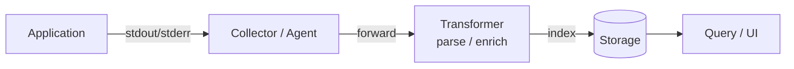
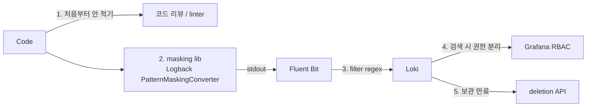

# 06. Logs — ELK vs Loki vs Vector + Pipeline 설계

## 1. 로그 스택의 4 컴포넌트



| 단계 | 역할 | 도구 |
|---|---|---|
| Collector | 노드 / 컨테이너에서 로그 수집 | Fluent Bit / Promtail / Vector / Filebeat |
| Transformer | parse / 라벨 추가 / 필터 | Logstash / Vector / Fluent Bit (filter) |
| Storage | 저장 + 인덱스 | Elasticsearch / Loki / OpenSearch |
| Query | 검색 / 시각화 | Kibana / Grafana / Logs Explorer |

→ 도구 선택의 **첫 번째 갈림길은 Storage** — ELK vs Loki.

## 2. ELK 스택 — Full-text Search 강자

### 2.1 구성

```
App → Filebeat / Fluent Bit → (Logstash) → Elasticsearch → Kibana
```

### 2.2 강점

- **모든 필드가 인덱스됨** → 어떤 필드든 자유 검색 (`level:ERROR AND user.email:test@*`)
- 풍부한 aggregation (terms / date_histogram / geo)
- Kibana 의 시각화 / Lens / Discover 가 강력

### 2.3 약점 — 비용

| 항목 | 비용 / 부담 |
|---|---|
| 디스크 | raw log 의 1.5-3x (역인덱스 + replica) |
| 메모리 | heap 50-75% 권장 (16GB heap = 16GB+ RAM) |
| Logstash CPU | grok 파싱 = regex CPU bound, Logstash 가 자주 병목 |
| 운영 | shard / replica / lifecycle policy 관리 복잡 |
| HA | master / data / ingest 노드 분리 → 클러스터 ≥ 6대 |

### 2.4 운영 함정

- shard 수 변경 불가 → reindex
- mapping conflict (필드 타입 충돌) → log drop
- ILM (Index Lifecycle Management) 미설정 → 디스크 폭발

## 3. Loki — "로그계의 Prometheus"

Grafana Labs 가 만든 로그 저장소. 철학: **"로그를 검색하지 말고, 메타데이터로 좁힌 후 grep 하라"**.

### 3.1 핵심 차이 — Label Index 만

```
ELK:    모든 필드를 색인 (full-text)         → 비용 높음, 검색 자유
Loki:   라벨 만 색인 (메타데이터)            → 비용 낮음, label 로 좁힘 + LogQL grep
```

→ **메트릭과 동일한 "라벨" 모델** → Grafana 단일 UI 자연스럽게 통합.

### 3.2 구성

```
App → Promtail / Fluent Bit → Loki → Grafana
```

- Promtail: K8s 환경에서 Pod 로그 수집 + label 부착 (Prometheus SD 와 동일 방식)
- Loki: chunk + label index 분리 저장 (S3 / GCS / local)
- Grafana: LogQL 로 검색

### 3.3 LogQL — PromQL 의 사촌

```logql
# 1. label selector (필수)
{app="product", namespace="commerce", level="ERROR"}

# 2. filter (선택)
{app="product"} |= "OOM"           # contains
{app="product"} != "DEBUG"         # not contains
{app="product"} |~ "5\\d\\d"       # regex
{app="product"} !~ "user_id=test"  # not regex

# 3. parser
{app="product"} | json | level="ERROR" and trace_id="abc"
{app="product"} | logfmt | duration > 1s

# 4. metric extraction
sum by (level) (rate({app="product"}[5m]))
sum(count_over_time({app="product"} |= "OOM" [1h]))
```

→ Prometheus 와 같은 syntax → 학습 곡선 ↓.

### 3.4 비용 비교 (대략)

| Stack | TB/일 단가 | 운영 인원 | retention 1년 비용 |
|---|---|---|---|
| ELK | $$$$ | 1-2명 (전담) | 매우 높음 |
| **Loki** | $$ | 0.5명 | 낮음 (S3 + 작은 index) |
| Vector + ClickHouse | $$ | 1명 | 낮음 (실험적) |

> Loki 의 비용 우위는 **chunk 가 그냥 gzip 텍스트** 라는 점. 검색 시 chunk 를 다운로드해서 grep 하는 구조 → CPU 사용량은 query 시점에 spike, 평소엔 거의 없음.

## 4. Loki vs ELK 선택 매트릭스

| 요구사항 | ELK | Loki |
|---|---|---|
| Full-text 자유 검색 | ✅ | △ (LogQL grep, 좁힌 후) |
| 비용 최소화 | ❌ | ✅ |
| Grafana 통합 (3축 single UI) | △ | ✅ |
| 보안 / SIEM | ✅ (Elastic Security) | ❌ |
| 컴플라이언스 (감사) | ✅ (mature) | △ |
| Trace ID drill-down | △ | ✅ (LogQL `\| json \| trace_id="..."`) |
| 카디널리티 (수천 라벨) | ✅ | ❌ (Loki 는 label cardinality 폭발 위험) |

> **결정 룰**: 검색이 **일순위**고 비용 무시 가능 → ELK. 비용 / Grafana 통합이 일순위 → **Loki**. 보안 SIEM 이 필요하면 ELK + (logs SIEM 도구) 같이.

→ msa 는 운영 비용 절감 + Grafana 단일 UI → **Loki 1순위 권고** (#13 ADR 후보).

## 5. Vector — 새로운 Collector 표준

Datadog 이 만든 단일 binary 수집기. Fluent Bit / Logstash / Filebeat 통합 후보.

### 5.1 강점

- Rust 로 작성 — 메모리 / CPU 효율
- Source / Transform / Sink 의 구성 단순
- 다양한 sink (Loki, ES, Kafka, S3, Datadog, ...)
- VRL (Vector Remap Language) 로 transformation 표현

### 5.2 vs Fluent Bit / Logstash

| 도구 | 특징 |
|---|---|
| **Fluent Bit** | C, 매우 가볍, K8s standard collector, Loki 친화 |
| Logstash | JVM, 무거움, parsing 풍부 |
| **Vector** | Rust, 빠름 + parsing 풍부, 신생 표준 |

### 5.3 K8s 환경 권장 조합

- 가벼운 수집 → **Fluent Bit DaemonSet → Loki**
- 정교한 parsing 필요 → **Vector DaemonSet → Loki / ES**
- 기존 ELK 운영 중 → Filebeat / Fluent Bit → Logstash → ES 유지

## 6. Pipeline 아키텍처 패턴

### 6.1 패턴 A: 직접 forward (소규모)

```
App → Promtail (DaemonSet) → Loki
```

- 가장 단순. msa Phase 1 도입 권장.

### 6.2 패턴 B: Kafka 버퍼링 (중규모)

```
App → Fluent Bit → Kafka topic → (Logstash / Vector) → ES / Loki
```

- 백엔드 다운 시 Kafka 가 buffer
- replay 가능
- 정교한 transformation 단계 분리

### 6.3 패턴 C: Hot / Cold tiering

```
App → Fluent Bit → Loki (hot 7d) + S3 (cold 1y)
                                       └→ AWS Athena 로 ad-hoc query
```

- 비용 최적화
- 컴플라이언스 (감사 로그) 1년 유지

## 7. Sampling 전략 — 비용 통제

모든 로그를 다 보관하면 비용 폭증. Sampling 의 4가지 룰:

### 7.1 Level-based

```
ERROR / WARN: 100% 보관
INFO: 100% (일반) 또는 1/N (트래픽 폭발 시)
DEBUG: production 비활성 또는 1/100
```

### 7.2 Endpoint-based

- health / ready endpoint 로그는 drop
- /actuator/prometheus 자체 로그도 drop

### 7.3 trace ID 기반 sampling (tail-based 와 결합)

- error 가 발생한 trace 의 모든 로그는 100% 보관
- 정상 trace 는 1% sampling

### 7.4 Rate limiting

- 동일 메시지가 1초에 1000개 이상 → 1개로 축약 + count

```
ERROR DB connection failed (occurred 1247 times in last 60s, last: ...)
```

## 8. PII 마스킹 — 운영 필수

**개인정보 / 토큰 / 카드번호** 가 로그에 들어가면 컴플라이언스 위반 + 보안 사고.

### 8.1 5가지 방어선



### 8.2 Logback 마스킹 예시

```xml
<configuration>
  <conversionRule conversionWord="m"
    converterClass="com.kgd.common.logging.MaskingMessageConverter"/>

  <appender name="JSON" class="ch.qos.logback.core.ConsoleAppender">
    <encoder class="net.logstash.logback.encoder.LoggingEventCompositeJsonEncoder">
      <providers>
        <pattern>
          <pattern>{
            "ts": "%d{ISO8601}",
            "level": "%level",
            "service": "${SERVICE_NAME}",
            "trace_id": "%X{trace_id:-}",
            "msg": "%m"
          }</pattern>
        </pattern>
      </providers>
    </encoder>
  </appender>
</configuration>
```

`MaskingMessageConverter` 가 정규식으로 카드번호 / 이메일 / 전화번호 마스킹.

### 8.3 Fluent Bit 단계 마스킹 (2차 방어)

```ini
[FILTER]
    Name modify
    Match *
    Rename email email_masked

[FILTER]
    Name lua
    Match *
    call mask_pii
    code |
        function mask_pii(tag, ts, record)
          if record["msg"] then
            record["msg"] = string.gsub(record["msg"], "%w+@%w+%.%w+", "***@***")
            record["msg"] = string.gsub(record["msg"], "%d%d%d%d%-%d%d%d%d%-%d%d%d%d%-%d%d%d%d", "****-****-****-****")
          end
          return 1, ts, record
        end
```

## 9. Retention / Compliance

| 카테고리 | 보관 기간 권장 | 근거 |
|---|---|---|
| Application log | 7-30일 | 일반 디버깅 |
| Error / Warn | 90일 | postmortem |
| **감사 로그 (audit)** | **1-7년** | 컴플라이언스 (GDPR / 금융) |
| 보안 로그 (auth / access) | 1년 | SIEM |
| Access log | 90일 | 일반 |

→ 감사 로그는 별도 stream 으로 분리 + WORM (Write Once Read Many) storage. msa 의 quant `audit_log` ClickHouse 테이블이 이 패턴.

## 10. msa 의 현 상태 (Phase 3 미리보기)

- ❌ **로그 수집 미도입** — Loki, ELK 모두 없음
- ❌ Logback 설정 — `logback.xml` 파일 미존재 (find 결과)
- ❌ JSON 로그 출력 — Spring Boot 기본 (text)
- ❌ MDC trace_id 전파 — 미적용 (grep 결과)
- ✅ kotlin-logging 사용 (`docs/conventions/logging.md`)
- ✅ PII 마스킹 룰 (`docs/conventions/logging.md` §AI 작업 규칙)
- ✅ ClickHouse audit_log 패턴 (quant)

→ #13 improvements: Loki 도입 ADR + logback-spring.xml 표준 + MDC 전파 일괄 작업 권고.

## 11. Logback 스프링 표준 템플릿 (제안)

`common/src/main/resources/logback-spring.xml` 표준안:

```xml
<configuration>
  <springProperty name="serviceName" source="spring.application.name" defaultValue="unknown"/>

  <appender name="STDOUT_JSON" class="ch.qos.logback.core.ConsoleAppender">
    <encoder class="net.logstash.logback.encoder.LoggingEventCompositeJsonEncoder">
      <providers>
        <timestamp>
          <fieldName>ts</fieldName>
        </timestamp>
        <pattern>
          <pattern>{
            "service": "${serviceName}",
            "level": "%level",
            "logger": "%logger{40}",
            "thread": "%thread",
            "trace_id": "%mdc{trace_id:-}",
            "span_id": "%mdc{span_id:-}",
            "user_id": "%mdc{user_id:-}",
            "msg": "%message"
          }</pattern>
        </pattern>
        <stackTrace>
          <fieldName>exception</fieldName>
          <throwableConverter class="net.logstash.logback.stacktrace.ShortenedThrowableConverter">
            <maxDepthPerThrowable>30</maxDepthPerThrowable>
            <rootCauseFirst>true</rootCauseFirst>
          </throwableConverter>
        </stackTrace>
      </providers>
    </encoder>
  </appender>

  <root level="INFO">
    <appender-ref ref="STDOUT_JSON"/>
  </root>

  <!-- profile 별 override -->
  <springProfile name="local">
    <root level="DEBUG"/>
  </springProfile>
</configuration>
```

→ 모든 서비스가 common 으로 이 설정 자동 적용. Phase 3 적용 권고.

## 12. 핵심 정리

- 로그 스택 4 컴포넌트: Collector / Transformer / Storage / Query
- ELK = full-text 강함, **비용 + 운영 부담 큼**
- **Loki = label-only index, 비용 5-10x 절감, Grafana 단일 UI**
- Vector = Fluent Bit / Logstash 통합 차세대 collector
- Pipeline 패턴: 직접 forward → Kafka 버퍼 → Hot/Cold tiering
- Sampling: level / endpoint / trace ID / rate limit 4종
- PII 마스킹은 **5단 방어** (코드 → lib → collector → RBAC (Role-Based Access Control, 역할 기반 접근 제어) → 만료)
- msa 는 로그 stack 미도입 — Loki + logback-spring.xml 표준 ADR 후보

## 13. 다음 단계

- [07-structured-logging-correlation.md](07-structured-logging-correlation.md) — 구조화 로그 + MDC + Trace ID 전파 + Spring Webflux MDC 함정
