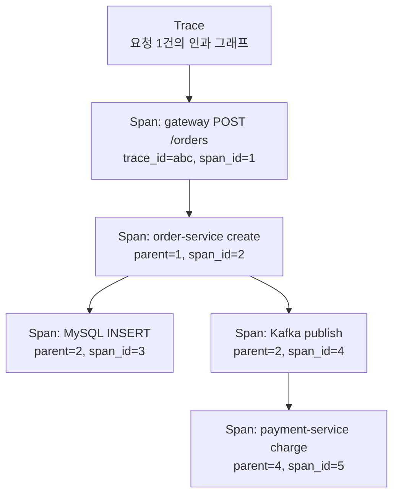
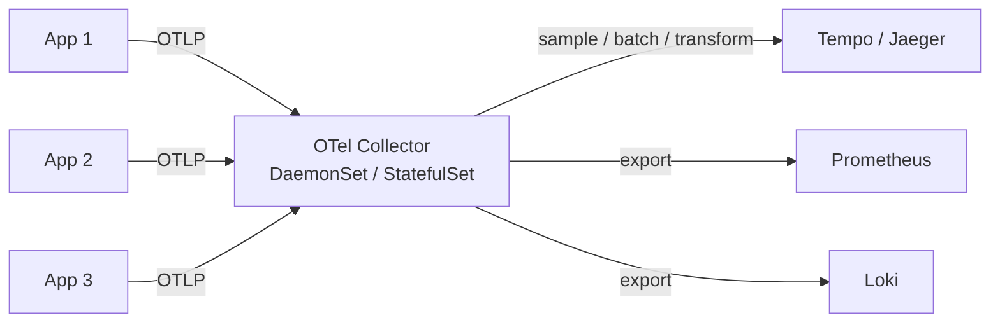

# 08. OpenTelemetry — Tracing 표준 + Java Agent / Manual

## 1. OpenTelemetry 란 — "표준 지위" 가 핵심

```
2019: OpenTracing (API only) + OpenCensus (SDK) → 합병
2021+: OpenTelemetry = CNCF Incubating → Graduated
```

**OpenTelemetry (OTel) = Vendor-neutral 관측 데이터 표준**. API + SDK + Collector + 전파 규약을 모두 정의.

| 구성요소 | 역할 | 비유 |
|---|---|---|
| **API** | 코드가 호출하는 인터페이스 | SLF4J |
| **SDK** | API 의 구현체 | Logback |
| **Collector** | 외부 프로세스 (수집/변환/전송) | Fluent Bit |
| **Exporter** | 백엔드로 전송 | (Jaeger / Zipkin / OTLP) |
| **Instrumentation** | 자동 / 수동 계측 | Spring AOP |

> **2026 면접 핵심 답변**: "OpenTelemetry 는 vendor-neutral 표준이라, 코드는 OTel API 로 쓰고 백엔드는 Jaeger/Tempo/Datadog 등 자유 선택 가능합니다. 도입 시 vendor lock-in 회피가 가장 큰 ROI 입니다."

## 2. Trace / Span / Context 모델



### 2.1 Span 의 4가지 핵심 속성

```
span = {
  trace_id: "3a72fd1a..."     # 16 byte (32 hex)
  span_id:  "b3f99c1a"        # 8 byte (16 hex)
  parent_span_id: "..."       # null = root
  name: "POST /orders"
  start_time, end_time
  attributes: { http.method, http.status_code, db.statement, ... }
  events: [{ time, name, attrs }]
  links: [{ trace_id, span_id }]   # 다른 trace 와 약한 연결
  status: OK | ERROR
}
```

### 2.2 SpanKind — 5종

| Kind | 의미 |
|---|---|
| SERVER | incoming request (예: HTTP server) |
| CLIENT | outgoing request (예: HTTP client) |
| PRODUCER | 비동기 발행 (Kafka producer) |
| CONSUMER | 비동기 소비 (Kafka consumer) |
| INTERNAL | 내부 함수 호출 |

→ Producer ↔ Consumer 는 부모-자식이 아니라 **link** 로 연결 (시간차가 있을 수 있어).

### 2.3 Attributes 의 권장 명명 (Semantic Convention)

OTel 가 표준 키 이름을 정의 — `http.method`, `db.system`, `messaging.system` 등.

```
http.method = "GET"
http.url = "/api/products/{id}"
http.status_code = 200
db.system = "mysql"
db.statement = "SELECT * FROM products WHERE id=?"
messaging.system = "kafka"
messaging.destination = "product.item.created"
```

→ Semantic Convention 을 따르면 모든 OTel 백엔드에서 자동 시각화. 자체 키 (예: `myCompany.foo`) 는 호환성 손실.

## 3. 4가지 도입 방식 — 비교

### 3.1 Java Agent (Auto-instrumentation)

```bash
java -javaagent:opentelemetry-javaagent.jar \
     -Dotel.service.name=product \
     -Dotel.exporter.otlp.endpoint=http://otel-collector:4317 \
     -jar product.jar
```

- **장점**: 코드 0줄. Spring / JDBC / Kafka / WebClient 자동 계측.
- **단점**: byte code instrumentation → JVM 시작 ↑, 일부 라이브러리 지원 제한.
- **결정**: msa 의 첫 단계는 이 방식 권장. 나중에 manual span 으로 보강.

### 3.2 Spring Boot Starter (Micrometer Tracing)

```kotlin
implementation("io.micrometer:micrometer-tracing-bridge-otel")
implementation("io.opentelemetry:opentelemetry-exporter-otlp")
```

- Spring Boot 3.x 가 Micrometer Observation API 와 통합
- `@Observed` 어노테이션 / 기본 HTTP / DB 자동 trace
- **장점**: agent 없이 코드 build 시점 결정
- **단점**: Spring 외 영역 (예: 직접 작성한 Kafka consumer wrapper) 은 manual

### 3.3 Manual SDK 사용

```kotlin
val tracer = openTelemetry.getTracer("com.kgd.product")

fun createProduct(cmd: CreateCmd): Product {
    return tracer.spanBuilder("ProductService.create")
        .setAttribute("product.category", cmd.category)
        .startSpan()
        .use { span ->
            try {
                // ... business logic
                val product = repository.save(...)
                span.setAttribute("product.id", product.id.toString())
                product
            } catch (e: Exception) {
                span.setStatus(StatusCode.ERROR, e.message ?: "")
                span.recordException(e)
                throw e
            }
        }
}
```

- 가장 정밀. 비즈니스 컨텍스트 attribute 추가 가능
- boilerplate 많음 → AOP 또는 `@WithSpan` 으로 줄임

### 3.4 OpenTelemetry Annotation (`@WithSpan`)

```kotlin
@WithSpan
fun createProduct(@SpanAttribute("product.category") category: String): Product {
    // ... 자동 span 생성, attribute 자동 주입
}
```

→ Java agent 에서 동작. Aspect 기반.

### 3.5 결정 매트릭스

| 환경 | 권장 |
|---|---|
| Spring Boot 신규 / 빠른 도입 | **Java Agent** + 부분 manual |
| Spring Boot 3.x + Micrometer 이미 사용 | **Micrometer Tracing Bridge** |
| Spring 외 (raw Kotlin / Coroutine) | Manual SDK |
| Spring + 정밀 비즈니스 attribute | Java Agent + `@WithSpan` |

→ msa 는 Spring Boot 3.x + Micrometer 이미 사용 → **Micrometer Tracing Bridge** 1순위.

## 4. Spring Boot 3.x — Micrometer Tracing Bridge 설정

### 4.1 의존성

```kotlin
// product/app/build.gradle.kts (제안 추가)
implementation("io.micrometer:micrometer-tracing-bridge-otel")
implementation("io.opentelemetry:opentelemetry-exporter-otlp")
```

### 4.2 application.yml

```yaml
management:
  tracing:
    sampling:
      probability: 0.1   # 10% (production), 1.0 (staging)
    propagation:
      type: w3c          # traceparent header
  otlp:
    tracing:
      endpoint: http://otel-collector.monitoring.svc.cluster.local:4318/v1/traces
      timeout: 5s
```

### 4.3 자동 계측 대상 (Spring Boot 3.x 기본)

- HTTP server (Tomcat / Jetty / Netty)
- HTTP client (RestTemplate / WebClient)
- JDBC (DataSource Proxy)
- Spring Data Redis
- Spring Kafka
- gRPC

→ Spring 컨벤션을 따르는 코드는 거의 모두 자동.

### 4.4 MDC 자동 주입

Micrometer Tracing 이 trace_id / span_id 를 MDC 에 자동 put → logback `%mdc{trace_id}` 로 바로 사용.

→ #07 의 logback-spring.xml 과 자연스럽게 통합.

## 5. OTel Collector — Why?



### 5.1 Collector 가 필요한 이유

1. **App 에서 백엔드 직접 호출 시 부담** — 백엔드 다운 시 app 영향
2. **Tail-based sampling** — 100% 받아서 error trace 만 저장 (#09)
3. **Transform / Sanitize** — PII 제거, attribute 변환
4. **Multi-backend fan-out** — 같은 데이터를 Jaeger + Datadog 둘 다 보내기
5. **Buffer + Retry** — 백엔드 장애 시 buffering

### 5.2 Collector 구성

```yaml
# otel-collector-config.yaml
receivers:
  otlp:
    protocols:
      grpc: { endpoint: 0.0.0.0:4317 }
      http: { endpoint: 0.0.0.0:4318 }

processors:
  batch:
    timeout: 10s
    send_batch_size: 1024
  memory_limiter:
    limit_mib: 512
  tail_sampling:
    decision_wait: 30s
    policies:
      - name: errors
        type: status_code
        status_code: { status_codes: [ERROR] }
      - name: slow
        type: latency
        latency: { threshold_ms: 1000 }
      - name: random_1pct
        type: probabilistic
        probabilistic: { sampling_percentage: 1.0 }

exporters:
  otlp/tempo:
    endpoint: tempo.monitoring:4317
    tls: { insecure: true }
  prometheus:
    endpoint: 0.0.0.0:8889

service:
  pipelines:
    traces:
      receivers: [otlp]
      processors: [memory_limiter, tail_sampling, batch]
      exporters: [otlp/tempo]
```

→ Tail sampling 로 100% 수집 + 1% + error/slow trace 만 저장 → 비용 통제 + 정보 보존.

### 5.3 K8s 배포 패턴 — Sidecar / DaemonSet / Gateway

| 패턴 | 사용 시점 |
|---|---|
| **DaemonSet** (노드당 1개) | 일반적인 K8s 환경 |
| Sidecar (Pod 마다) | 격리 / 네트워크 부담 ↓ (mesh 환경) |
| **Gateway** (cluster 1-2개) | tail sampling + cluster aggregation |

→ 권장: **DaemonSet (수집) + Gateway (sampling/export)** 2단 구성.

## 6. 백엔드 비교 — Jaeger / Zipkin / Tempo

| 항목 | Jaeger | Zipkin | **Tempo** |
|---|---|---|---|
| 시작 시점 | Uber 2017 | Twitter 2012 | Grafana 2021 |
| Storage | Cassandra / ES | Cassandra / ES | **S3 / GCS / Azure Blob** |
| Query | Trace ID 검색 + tag | Trace ID + 시간 + 서비스 | **Trace ID 만** |
| 비용 | $$ | $$ | **$** (object storage) |
| Grafana 통합 | ○ | ○ | **◎** (네이티브) |
| 카디널리티 검색 | ✅ | ✅ | ❌ (외부 인덱스 필요) |
| Trace → Logs (Loki) | △ | ❌ | ✅ |

### 6.1 Tempo 의 철학

> "Trace 검색은 Loki / Prometheus 가 담당, Tempo 는 trace_id 로 trace body 만 저장"

- 검색 지원 안 함 → **저장 비용 폭락** (S3 + bloom filter index)
- Loki / Prometheus / Grafana 와 **trace_id 로 jump**
- msa 의 Loki 도입 시나리오와 자연스럽게 결합 → **#13 1순위 백엔드 선택**

### 6.2 Jaeger 가 더 적합한 경우

- 별도 운영 가능 — UI 가 trace 자체에 강함
- "이 user 가 어제 어떤 trace 만들었나?" 같은 ad-hoc 검색 자주
- ELK 이미 운영 중 (ES backend 재사용)

### 6.3 Zipkin

- legacy. 새 도입은 OTel 이 정답. Zipkin OTel exporter 가 있으니 호환은 됨.

## 7. W3C Trace Context 심화

### 7.1 traceparent 헤더 4 필드

```
traceparent: 00-3a72fd1a8b62cd1f9c1a8b62cd1f9c1a-b3f99c1a4c2e7d8e-01
              │  │                                │                │
              │  │                                │                └─ trace flags (01 = sampled)
              │  │                                └─ parent span id (8 byte)
              │  └─ trace id (16 byte)
              └─ version (00)
```

### 7.2 tracestate — vendor 별 추가 컨텍스트

```
tracestate: dd=s:1;p:abc, congo=t61rcWkgMzE
```

- 각 vendor 가 trace 에 추가 정보 첨부 (예: Datadog 의 sampling decision)
- max 32 entry, 512 char 권장
- vendor 가 자기 entry 만 수정 / 다른 entry 는 보존

### 7.3 Sampled flag

- `01` = sampled (백엔드까지 전송)
- `00` = not sampled (drop, 단 trace_id 는 logs / metrics 에 여전히 사용)

→ **head-based sampling** 결정이 이 flag 에 박힘. 이후 모든 hop 이 이 결정을 따름.

## 8. Sampling 전략 — 미리보기 (자세히 #09)

| 전략 | 결정 시점 | 장점 | 단점 |
|---|---|---|---|
| Always-on | 모든 trace 수집 | 정보 손실 0 | 비용 폭증 |
| Probabilistic | 시작 시 random N% | 비용 제어 | error trace 도 N% 만 |
| Rate-limited | 초당 N개 | 절대 비용 상한 | 흐름 일정하지 않음 |
| **Tail-based** | 종료 후 (Collector) | error / slow 모두 보존 | Collector 부담 |
| Adaptive | 부하 기반 | 동적 | 복잡 |

→ msa 추천: **앱은 head 100%, Collector 에서 tail sampling** (error + slow + 1% 보존).

## 9. 비용 통제 — Cardinality vs Sampling

Trace 는 메트릭과 달리 **요청 1개 = 시계열 1개** 가 아니다. 요청 1개 = N개의 span × M 개의 attribute = 큰 raw payload.

| 항목 | 비용 영향 |
|---|---|
| Sampling rate | 비례 |
| span 수 / trace | 비례 (auto-instrumentation 너무 많으면 폭증) |
| attribute 수 / span | 비례 |
| 보관 기간 | 비례 |
| **Tail sampling** | 비용 ↓ (정보 보존) |

### 9.1 Span 폭발 방지

- `@WithSpan` 을 모든 함수에 붙이지 말 것 — root + 외부 IO 만
- Auto-instrumentation 일부 비활성화 (`-Dotel.instrumentation.<name>.enabled=false`)
- 한 trace 의 span 수 상한 (Collector 에서 drop) — 보통 1000개

## 10. msa 의 도입 로드맵 (#13 ADR 후보 미리보기)

```
Phase A: 인프라 (1-2주)
  - OTel Collector DaemonSet
  - Tempo (S3 backend)
  - Grafana datasource 추가 + Tempo

Phase B: Spring Boot 3.x bridge (1주)
  - common 에 micrometer-tracing-bridge-otel 추가
  - application.yml: management.tracing 표준
  - logback-spring.xml: %mdc{traceId}, %mdc{spanId}

Phase C: 검증 + tuning (1주)
  - 분산 trace 시나리오 (gateway → product → order → kafka → analytics)
  - sampling 1% / staging 100%
  - Collector tail sampling 활성화

Phase D: ADR 확정 + 운영
  - SLO 와 결합 (#10)
  - PR 리뷰에 trace 첨부 권장
  - Runbook 표준
```

## 11. 함정 5선

### 11.1 Coroutine span 누락

`Dispatchers.IO` 로 옮기면 OTel context 도 함께 전파해야 함:

```kotlin
withContext(Dispatchers.IO + Context.current().asContextElement()) {
    // span 정상 전파
}
```

### 11.2 Webflux Reactor Context 미연동

Webflux 는 OTel reactor instrumentation 의존성 추가 필요. msa 의 gateway 에 적용 시 검증 필요.

### 11.3 PII 가 attribute 에 들어감

`http.url` 에 query string 의 token 이 그대로 박힘. Collector 에서 sanitize:

```yaml
processors:
  attributes:
    actions:
      - key: http.url
        action: update
        from_attribute: http.url
        # regex replace 등으로 token 제거
```

### 11.4 Sampling 100% 운영

테스트 환경의 100% sampling 을 production 에 가져가면 비용 폭발. 항상 환경별 분리.

### 11.5 trace_id 가 로그에 안 박힘

OTel 만 도입하고 logback 에 `%mdc{traceId}` 안 넣으면 trace ↔ log drill-down 불가. **반드시 동시 적용**.

## 12. 핵심 정리

- OTel = 표준. **vendor-neutral 이 핵심 ROI** (lock-in 회피)
- API / SDK / Collector / Exporter / Instrumentation 5 layer
- 도입 방식 4종: Agent / Micrometer Bridge / Manual / `@WithSpan` — Spring Boot 3.x 는 Micrometer Bridge 1순위
- Trace = DAG of Span, Span = (trace_id, span_id, parent, attrs, events)
- W3C `traceparent` 가 표준 헤더 (`00-trace-span-flag`)
- Collector = 비용/안정성/sampling 의 핵심 — DaemonSet + Gateway 2단
- 백엔드 비교: **Tempo (S3, Loki/Grafana 친화)** vs Jaeger (검색 강함) vs Zipkin (legacy)
- Span 폭발 방지: `@WithSpan` 남발 금지, attribute 정제, Collector drop

## 13. 다음 단계

- [09-sampling-and-correlation.md](09-sampling-and-correlation.md) — Sampling 전략 심화 + 3축 Correlation + Exemplar 동작
