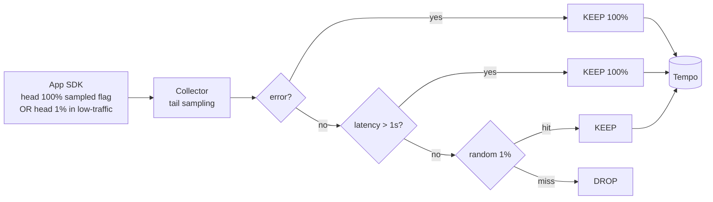

# 09. Sampling 전략 + 3축 Correlation + Exemplar

## 1. Sampling 의 본질 — 비용 vs 정보

Trace / Log / Metric 모두 sampling 가능하지만 **trace 가 가장 비용 민감** (raw payload 큰 + 빠른 증가).

```
정보 손실    ←━━━━━━━━━━━━━━━━━━━━━━━━━━━━━━━━━━━━━━━━━━━━━→  비용
0% sample (=100% drop)               ━ ━ ━              100% sample
                                  Adaptive     ┃              ┃
                  Tail (error+slow)            ┃              ┃
                          1% probabilistic     ┃              ┃
                                               ┃              ┃
                          좋은 위치 ─────────→  ┃              ┃
```

## 2. 4가지 Sampling 전략

### 2.1 Head-based — 시작 시 결정

```
Request 도착 → trace_id 생성 → "1% 확률로 sampled = 01" 결정 →
               이 결정이 모든 downstream 에 전파 (W3C flags)
```

**장점**:
- 결정이 빠름 (시작 시 1번)
- trace 가 항상 완전 (모든 hop 동일 결정)
- Collector / 백엔드 부담 ↓

**단점**:
- Error / Slow trace 도 동일 확률로 drop
- "장애 났는데 trace 가 없네" 같은 사고

**구현**: Java agent / SDK 의 `parentbased_traceidratio` sampler.

### 2.2 Tail-based — 종료 후 결정

```
Request 도착 → 모든 hop 100% 수집 → Collector buffer (30s 기다림) →
               span 다 모이면 정책 적용 → 일부만 백엔드로
```

**장점**:
- error / slow trace 100% 보존
- 정상 trace 1% 만 보존 → 정보 + 비용 균형 최적

**단점**:
- Collector 메모리 / CPU 부담 (모든 trace buffering)
- decision_wait (~30s) 동안 trace 완성 보장 필요 → 늦은 span 누락 가능
- 분산 Collector 면 같은 trace 가 여러 Collector 에 갈림 → consistent hashing 필요

**구현**: OTel Collector `tail_sampling` processor.

### 2.3 Probabilistic (Random)

가장 단순. `sampling.probability=0.1` → 10%.

- 단일 인스턴스에 적합
- 통계적 분포 보존
- error 도 동일 확률

### 2.4 Rate-limited

초당 N개 trace 만 수집.

- 절대 비용 상한 보장
- 트래픽 폭주 시 자동 제어
- 단점: 트래픽 일관성 없음 → 비교 분석 어려움

### 2.5 Adaptive

부하 / 에러율 기반 동적. Honeycomb / DataDog 의 dynamic sampling.

- 가장 정교
- 운영 복잡 → 작은 조직엔 과함

## 3. 권장 조합 — 2-Tier



### 3.1 App 측 head sampling — 100%

- App 은 **모든 trace 의 head flag 를 sampled (01)** 로 설정
- "어쨌든 보내라" → Collector 가 마지막 결정

### 3.2 Collector tail sampling

```yaml
processors:
  tail_sampling:
    decision_wait: 30s
    num_traces: 100000        # buffer 크기
    expected_new_traces_per_sec: 1000
    policies:
      - name: errors_always
        type: status_code
        status_code: { status_codes: [ERROR] }
      - name: slow_always
        type: latency
        latency: { threshold_ms: 1000 }
      - name: trace_id_ratio_1pct
        type: probabilistic
        probabilistic: { sampling_percentage: 1.0 }
      - name: critical_endpoint_10pct
        type: and
        and:
          and_sub_policy:
            - name: endpoint
              type: string_attribute
              string_attribute: { key: "http.target", values: [".*payment.*"], enabled_regex_matching: true }
            - name: rate
              type: probabilistic
              probabilistic: { sampling_percentage: 10.0 }
```

→ **결과**: error/slow 100% + payment 10% + 나머지 1%. 비용 ~5-10% 수준.

## 4. 3축 Correlation — drill-down 매트릭스

Observability 의 진짜 가치는 **신호 간 점프**. 6 방향 모두 가능해야 함:

```
              ┌─────────────────────────────────┐
              │                                 │
              │   1. Metrics ─────→ Trace        │
              │   2. Trace   ─────→ Metrics      │
              │   3. Trace   ─────→ Logs         │
              │   4. Logs    ─────→ Trace        │
              │   5. Metrics ─────→ Logs         │
              │   6. Logs    ─────→ Metrics      │
              │                                 │
              └─────────────────────────────────┘
```

### 4.1 Metric → Trace (Exemplar)

이 책에서 가장 중요한 통합. `#05` Grafana 에서 다룬 내용 심화:

```
http_server_requests_seconds_bucket{le="0.05"} 24054 # {trace_id="3a72fd1a"} 0.045 1714617600
                                                      └─ Exemplar (trace ID + value + ts)
```

**동작**:
1. Spring Boot Micrometer Tracing bridge 가 매 측정마다 현재 trace_id 를 Exemplar 로 기록
2. Prometheus 가 `_bucket` 시계열에 추가로 보관
3. Grafana 가 Heatmap panel 에 diamond marker 로 표시
4. 사용자 클릭 → Tempo / Jaeger 로 점프

**활성화**:
```yaml
management:
  metrics:
    distribution:
      percentiles-histogram:
        http.server.requests: true
  tracing:
    sampling:
      probability: 0.1
```

```yaml
# Prometheus 설정 (Helm values)
prometheus:
  prometheusSpec:
    enableFeatures:
      - exemplar-storage
```

```yaml
# Grafana Tempo datasource
- name: Tempo
  type: tempo
  uid: tempo
  jsonData:
    tracesToLogs:
      datasourceUid: 'loki'
      tags: ['trace_id']
```

### 4.2 Trace → Metrics

Tempo / Jaeger UI 에서 "Service X 의 RED" 링크 → Grafana RED panel 점프.

```yaml
# Grafana Tempo datasource
tracesToMetrics:
  datasourceUid: 'prometheus'
  tags: [{ key: 'service.name', value: 'application' }]
  queries:
    - name: 'Sample query'
      query: 'sum(rate(traces_spanmetrics_calls_total{$__tags}[5m]))'
```

### 4.3 Trace → Logs (Tempo + Loki)

Tempo trace view 에서 "Logs for this span" → Loki 로 trace_id 검색.

```yaml
# Grafana Tempo datasource
tracesToLogs:
  datasourceUid: 'loki'
  tags: ['trace_id']
  spanStartTimeShift: '-5m'
  spanEndTimeShift: '5m'
  filterByTraceID: true
```

### 4.4 Logs → Trace

Loki UI 에서 trace_id 필드 클릭 → Tempo 점프.

```yaml
# Grafana Loki datasource
derivedFields:
  - name: traceID
    matcherRegex: 'trace_id":"([a-f0-9]+)'
    url: '${__value.raw}'
    datasourceUid: 'tempo'
```

→ 즉, **로그에 trace_id 가 박혀 있어야** 가능 (#07 의 logback-spring.xml 필수).

### 4.5 Metrics → Logs

직접 점프는 어렵지만 **time + label** 매칭으로:

- `application=product` panel 에서 "View logs" → Loki query `{app="product"}` 자동
- 시간 범위는 Grafana 가 동기화

### 4.6 Logs → Metrics

Loki LogQL 의 `count_over_time`, `rate` 가 metric 처럼 동작:

```logql
sum by (level) (rate({app="product"}[5m]))
```

→ 하지만 비용 큼 → 메트릭으로 가능한 건 메트릭으로.

## 5. Exemplar 동작 심화

### 5.1 Histogram bucket 안의 Exemplar 1개

bucket 별로 마지막 sample 1개의 trace_id 를 보관. 즉 1초에 1000개 요청 → bucket 마다 1개 trace_id 만 (가장 최근).

→ "outlier 찾기" 에는 충분 — **outlier 가 떨어진 bucket** 의 trace 만 클릭하면 되니까.

### 5.2 Exemplar 가 head sampling 과 만나면?

- head sampled = 01 인 trace 는 trace 백엔드까지 도달
- head sampled = 00 인 trace 는 trace_id 만 존재, body 없음
- Exemplar 가 sampled = 00 trace_id 를 가리키면 → Tempo 에서 "trace not found"

→ **해결**: tail sampling 사용 + app 은 head 100% sampled flag 로 보냄. Collector 가 결정.

### 5.3 Exemplar storage 비용

- bucket 마다 trace_id (16 byte) + value + timestamp ≈ 32 byte
- bucket 30개 × 시계열 1000개 = 30k × 32 byte ≈ 1MB / scrape
- 거의 무시 가능

## 6. Sampling 의 통계적 함정

### 6.1 1% sampling 으로 P99 가 정확한가?

- 100k req → 1% = 1000 req. P99 = 상위 10개의 latency.
- 통계적 분산 큼. 짧은 시간 윈도우에서 P99 의 P99 같은 메타-tail 은 못 봄.
- → 메트릭은 sampling 안 한 **histogram 으로 P99** 를 산출. Trace 는 빠른 검색용.

### 6.2 sampling 으로 trace 끊어짐

A → B → C 호출에서 A 만 sampled, B 가 안 sampled → trace 가 끊어짐.

- 해결: parent-based sampling (W3C flags 따라가기) — head 결정을 모든 hop 이 따름

```
sampler: parentbased_always_on (parent 가 sampled 면 따라감)
```

### 6.3 비동기 Kafka 의 sampling

Producer 가 sampled = 01, Consumer 가 메시지 받아 새 root span 시작 시:
- W3C `link` 로 약하게 연결
- 또는 Kafka header 의 traceparent 를 그대로 따라감 → 같은 trace 의 Consumer span

OTel Kafka instrumentation 이 자동 처리. 검증 필요.

## 7. msa 의 적용 순서 (#13 ADR 후보)

1. **OTel Collector + Tempo** 인프라
2. App 에 Micrometer Tracing Bridge 의존 추가
3. **logback-spring.xml `%mdc{traceId}` 적용** ← 가장 중요
4. Sampling: app head 100% sampled flag, Collector tail sampling 정책
5. Grafana 통합:
   - Tempo datasource 추가
   - Loki datasource 추가 (Phase B)
   - tracesToLogs / tracesToMetrics / derivedFields 설정
   - http-dashboard.json 에 Heatmap panel + Exemplar 활성화
6. SLO panel (RED + p99 + Exemplar) — outlier click → trace
7. Runbook: "P99 alert → http-dashboard → outlier exemplar click → Tempo trace → Loki logs"

## 8. 운영 시나리오 — Drill-down Demo

장애 시나리오: "POST /orders 의 P99 가 갑자기 10배 튀었다"

```
[1] 운영자가 Slack alert 수신
    "ProductHighLatencyP99 firing — application=order, p99=2.3s"
    
[2] Grafana RED dashboard 열기
    → Heatmap panel 에 outlier diamond markers (Exemplar) 보임
    
[3] 가장 진한 outlier 클릭
    → Tempo trace view: gateway → order → product → mysql → kafka
    → mysql span 이 1.8s 차지 (Wait time)
    
[4] mysql span 의 "Logs for this span" 클릭
    → Loki: {app="order", trace_id="3a72fd1a"} 결과
    → "DB connection pool exhausted, waited 1800ms"
    
[5] Logs → metric 탭으로 점프
    → hikaricp_connections_pending panel 에서 같은 시각 spike 확인
    → 재현 환경에서 부하 테스트로 root cause = N+1 query 확정
```

→ 5분 안에 root cause 도달. Sampling 미도입이거나 trace_id 가 로그에 없으면 30분+.

## 9. Sampling 결정 매트릭스

| 트래픽 / 환경 | 권장 sampling |
|---|---|
| Local / dev | head 100% (모두 보존) |
| Staging | head 100% (검증) |
| Production - 소규모 (1k req/s 이하) | head 100% + tail 1% probabilistic |
| Production - 중규모 (1k-100k req/s) | head 100% + tail (error/slow + 1%) |
| Production - 대규모 (100k+ req/s) | head 1% + Adaptive |
| 결제 / 핵심 경로 | 별도 sampling rule (10% 이상) |

→ msa 는 중규모 진입 → **head 100% + tail (error/slow + 1%)** 표준.

## 10. 핵심 정리

- Sampling 4종: Head / Tail / Probabilistic / Rate-limited / Adaptive
- 권장: **App 100% sampled flag → Collector tail sampling (error+slow+1%)**
- 3축 Correlation 6 방향 모두 구성: Exemplar (M→T) + Loki derivedFields (L→T) + Tempo tracesToLogs (T→L) ...
- **Exemplar 는 Histogram bucket 안에 trace_id 를 끼워보내는 신박함** — Heatmap outlier 클릭 → Tempo 점프
- 로그에 trace_id 가 없으면 모든 drill-down 깨짐 — `%mdc{traceId}` 가 진입점
- 운영 시나리오 5분 drill-down: alert → RED → exemplar → trace → logs → metrics

## 11. 다음 단계

- [10-slo-sli-error-budget.md](10-slo-sli-error-budget.md) — SLO/SLI/Error Budget + Burn Rate Alert + ADR-0025 결합
