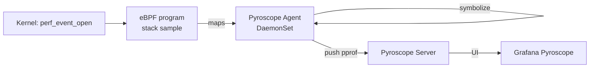
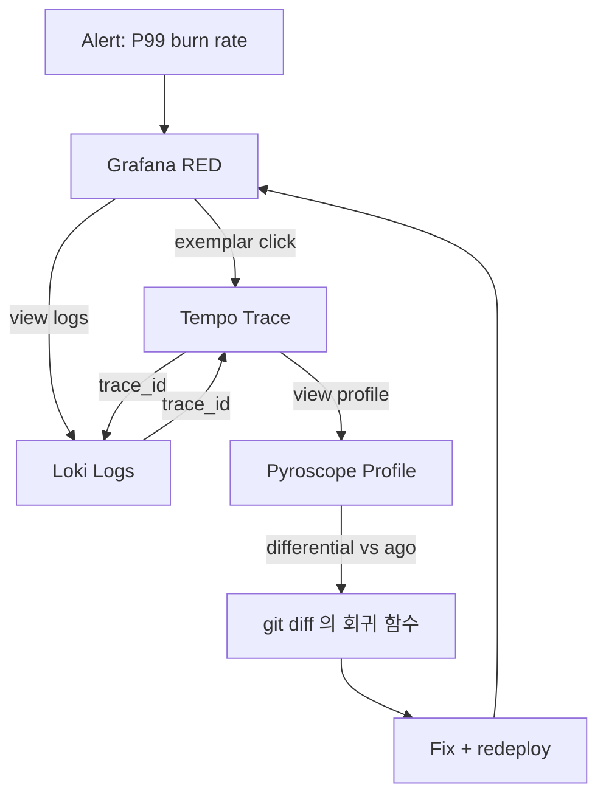

# 11. eBPF Profiling — "4번째 Pillar"

## 1. 왜 4번째 Pillar 인가

```
Metrics  : "WHAT 잘못됐나?" (rate, p99)
Logs     : "WHY 컨텍스트는?" (event)
Traces   : "WHERE in flow?" (span)
Profiles : "WHERE in CODE?" (어느 함수가 CPU/Memory 잡아먹나)
```

- Trace 는 "어느 외부 호출이 느림" 까지 알려줌
- Profile 은 "그 호출 안에서 어느 함수가 80% 시간" 까지 알려줌
- **Continuous Profiling = 1초마다 stack sampling 영구 보관** → 운영 환경의 시간여행

> **2026 트렌드**: Datadog Continuous Profiler / Pyroscope (Grafana) / Parca (Polar Signals) 가 표준화. 비용은 Trace 의 1/10, 정보 가치는 매우 큼.

## 2. Profiling 의 역사 — 단일 스냅샷 → 연속

```
2010s   : jstack / async-profiler / JFR (단일 인스턴스, 한 번 실행)
2018    : Pixie (eBPF 기반 K8s profiling)
2020+   : Pyroscope (multi-language)
2022+   : Continuous Profiling 표준화 (eBPF + pprof)
```

### 2.1 단일 프로파일링 vs 연속

| 단일 (one-shot) | 연속 (continuous) |
|---|---|
| `async-profiler -d 60s` 한 번 | 24/7 sampling |
| 사고 시 재현해야 함 | 사고 시점 그대로 시간여행 |
| 운영 부담 (재현 어려움) | 부담 없음 (자동) |
| 무료 | 약간의 CPU (~0.5-2%) |

→ "6시간 전 P99 (99th Percentile, 가장 느린 1%) 가 튄 시점의 flame graph" 를 즉시 볼 수 있다는 게 핵심 가치.

## 3. eBPF — 커널 레벨 관측

**eBPF (extended Berkeley Packet Filter)** = 커널에 안전한 sandbox 코드를 동적으로 주입.

### 3.1 eBPF 의 강점

- **Zero-instrumentation** — application 수정 0줄
- **모든 언어 지원** — JVM / Go / Rust / Python / Node
- **커널까지 추적** — syscall, network, scheduler
- **낮은 오버헤드** — JIT 컴파일 + verifier 가 무한 루프 방지

### 3.2 Pyroscope eBPF Agent



- 1초마다 모든 process 의 stack trace 수집 (default 100Hz)
- /proc/<pid>/maps + JVM perf-map 로 symbol 해석
- pprof 형식으로 push

## 4. Pyroscope vs Parca vs Datadog Profiler

| 항목 | Pyroscope (Grafana) | Parca | Datadog Profiler |
|---|---|---|---|
| 형식 | pprof | pprof | proprietary |
| 백엔드 | Pyroscope Server | Parca | SaaS |
| 통합 | **Grafana 네이티브** | Grafana | Datadog 만 |
| eBPF | ✅ | ✅ | △ (Java agent) |
| Continuous | ✅ | ✅ | ✅ |
| 가격 | OSS | OSS | $$$ |

→ **OSS 권장: Pyroscope (Grafana 통합)**.

## 5. JVM 프로파일링 — 3가지 옵션 비교 (#02 cross-ref)

| 도구 | 메커니즘 | 오버헤드 | 정확도 |
|---|---|---|---|
| **JFR** (Java Flight Recorder) | JVM 내부 hook (built-in) | **매우 낮음 (~1%)** | 높음 (allocation 도) |
| **async-profiler** | AsyncGetCallTrace + perf | 낮음 (~1-3%) | 높음, safepoint 회피 |
| **eBPF (Pyroscope)** | 커널 perf_event | 낮음 (~1-2%) | 중-높음 (JVM symbol 해석 필요) |

### 5.1 JFR — JVM 표준

```bash
java -XX:StartFlightRecording=duration=60s,filename=profile.jfr \
     -jar app.jar
```

- JVM 내부에 hook → safepoint 무관
- allocation profiling 도 가능
- Java Mission Control / JDK Mission Control 으로 분석

→ **Local 디버깅의 표준**. 단, continuous 운영은 별도 도구 필요 (jfr-streaming).

### 5.2 async-profiler

```bash
async-profiler -d 60 -f flame.html <pid>
```

- safepoint bias 없음 (hot loop 도 정확히 보임)
- CPU / allocation / lock 모두 지원

### 5.3 Pyroscope JVM Agent

```bash
java -agentpath:/opt/pyroscope-agent.so \
     -Dpyroscope.application.name=product \
     -Dpyroscope.server.address=http://pyroscope:4040 \
     -jar product.jar
```

- async-profiler 기반
- 결과를 자동 push (continuous)

## 6. Flame Graph — 읽는 법

```
[========== Total CPU 100% ==========]
[== request handler 60% ==][... 40%]
  [DB call 40%][biz 20%]
    [JDBC 35%][ JSON 5%]
      [socket read 30%][parse 5%]
```

- **세로 = stack depth** (위가 leaf, 아래가 root)
- **가로 = sample 횟수 (= 시간 비율)**
- **넓은 박스 = hot function**

→ "DB 가 35% 차지" → 그 안의 socket read 가 30% → DB latency 가 root cause. Trace 의 "DB span" 보다 정밀.

### 6.1 Differential Flame Graph

배포 전 vs 후의 flame graph 차이를 색깔로 시각화.

- 빨강 = 새 버전이 더 느린 함수
- 파랑 = 새 버전이 더 빠른 함수

→ 배포 회귀 (regression) 즉시 발견.

### 6.2 Multi-language flame graph

eBPF 는 JVM + Native + Kernel 까지 한 graph 에서 보여줌:

```
[Java: ProductService.find]
  [Java: JDBC]
    [Native: ReadFile syscall]
      [Kernel: ext4_read]
        [Kernel: bio_submit]
```

→ "JVM 코드만 보면 모름, 커널 IO wait 가 root cause" 같은 케이스를 즉시 식별.

## 7. Continuous Profiling 운영 시나리오

### 7.1 Latency 회귀

```
[1] Grafana RED panel 에서 P99 가 어제부터 200ms → 400ms 증가
[2] http-dashboard 의 application=product 30d 추세 확인 → 어제 배포 시점부터 증가
[3] Pyroscope Differential Flame Graph: 어제 vs 그저께
[4] "MoneyConverter.convert 함수가 새 버전에서 5% → 35%" 빨강 box
[5] git log MoneyConverter.kt → 비교 → BigDecimal new() 추가 발견
```

### 7.2 Memory leak

```
[1] JVM dashboard 의 heap 이 우상향 (#02 cross-ref)
[2] Pyroscope Allocation profile → "GiantCache.put 이 1주일 동안 누적 8GB"
[3] cache eviction 미설정 확인 → fix
```

### 7.3 CPU saturation

```
[1] node CPU 가 갑자기 90% → alert
[2] Pyroscope CPU profile → "JsonParse 함수가 50%"
[3] 새로 추가된 JSON serialize loop 발견 → 개선
```

## 8. 비용 / 보관

- 1초 sample × 100Hz × 30일 = **약 1MB / process / day** (압축 후)
- Pyroscope Server S3 backend 권장
- **trace 의 1/10 비용, 정보 가치는 비슷** → ROI 매우 높음

## 9. msa 적용 — Phase B+ ADR 후보

### 9.1 도입 단계

```
Phase A: Pyroscope OSS 배포 (Helm)
   └─ DaemonSet (eBPF) + Server + S3
Phase B: JVM 서비스에 agent 추가
   └─ common 의 Dockerfile / Jib 에 -agentpath 추가
Phase C: Grafana datasource + 통합
   └─ Tempo trace 에서 "View profile" 링크
```

### 9.2 Trace ↔ Profile correlation

OTel + Pyroscope 의 차세대 통합:
- Trace span 에 `pyroscope.profile_id` attribute 자동 추가
- Tempo UI 에서 "Profile this span" 클릭 → Pyroscope 점프
- Trace 의 "DB span 1.2s" → Profile 의 "그 시간대 thread stack" 정확 매칭

→ msa 도입 시 OTel + Pyroscope 동시 도입이 ROI 최대.

### 9.3 보안 고려

- Profile 에는 함수 이름이 그대로 박힘 → IP 누출 위험 미미
- Pyroscope UI 는 인증 필수 (내부망)
- production 의 sensitive 함수명 (예: 결제 알고리즘) 만 별도 검토

## 10. JFR 를 cluster level 로 활용하는 방법 (#02 cross-ref)

JFR 는 단일 JVM 에 한정되지만, 다음 패턴으로 cluster 활용:

### 10.1 JFR Streaming (Java 14+)

```kotlin
val rs = RecordingStream()
rs.enable("jdk.GarbageCollection")
rs.onEvent("jdk.GarbageCollection") { event ->
    // 메트릭 / 로그로 export
    log.info { "GC pause: ${event.duration}" }
}
rs.startAsync()
```

→ JFR 이벤트를 OpenTelemetry attribute 로 export → Tempo / Loki 에서 검색.

### 10.2 jfr-uploader 패턴

- 매 1시간 JFR file 을 S3 업로드
- 사고 시 다운로드 → JMC 분석
- continuous profiling 의 절충안 (정밀 분석은 가능, 실시간은 아님)

## 11. Profiling 안티패턴

### 11.1 항상 100Hz sampling
- 100Hz 가 default 지만 hot CPU 에서는 1% 부담
- 운영은 19Hz 정도가 일반적

### 11.2 production 에 JFR `-XX:FlightRecorderOptions=...` 풀 옵션
- 일부 옵션은 부담 큼 (e.g., method profiling on safepoint)
- "Profile" preset 만 사용

### 11.3 Profile 으로 RED 대체
- Profile 은 디버깅 도구 — alert 는 메트릭이 정답
- Profile 만 보고 운영하면 alerting 지연

### 11.4 Profile 데이터에 PII
- function name 에 user 데이터 들어가면 곤란 (예: 동적 class)
- 일반적으로 위험 ↓ 이지만 검토 필요

## 12. 4개 신호의 통합 운영 — 면접 그림



→ 4축 모두 갖추면 P99 alert 부터 fix 배포까지 **30분 이내** 가능. 단축의 핵심은 **drill-down link** (trace_id, span_id 의 일관성).

## 13. msa 의 단계별 ROI 분석

| 단계 | 도구 | 도입 노력 | ROI |
|---|---|---|---|
| 1 | Prometheus + Grafana | (이미 도입) | 기준 |
| 2 | **Loki + JSON 로그 + MDC** | 1-2주 | ⭐⭐⭐⭐⭐ |
| 3 | OpenTelemetry + Tempo | 1주 | ⭐⭐⭐⭐⭐ |
| 4 | Exemplar + drill-down | 0.5주 (3 통합 후 자연 연결) | ⭐⭐⭐⭐ |
| 5 | SLO + Sloth + Burn Rate | 1주 | ⭐⭐⭐⭐ |
| 6 | **Pyroscope + 4번째 pillar** | 1주 | ⭐⭐⭐ |

→ #13 ADR 우선순위에 반영.

## 14. 핵심 정리

- Profiles = **"WHERE IN CODE"** — Trace 가 못 답하는 정밀 질문
- Continuous profiling = 1초 sampling 영구 보관 → 시간여행 가능
- eBPF (Pyroscope) 가 zero-instrumentation 으로 모든 언어 cover
- JVM 옵션: JFR (built-in) > async-profiler > Pyroscope agent
- Flame graph 읽는 법: 가로 = 시간 비율, 세로 = stack
- Differential flame graph 가 배포 회귀 즉시 식별
- Trace ↔ Profile correlation 은 OTel 차세대 표준
- 비용 trace 의 1/10 — ROI 매우 높음 → msa 4번째 도입 후보

## 15. 다음 단계

- [12-msa-current-state.md](12-msa-current-state.md) — Phase 3: msa 코드베이스 현 상태 + Gap 분석 (grep 결과)
