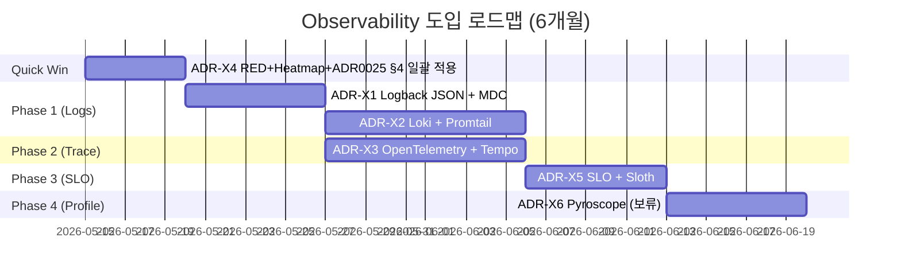

# 13. Improvements — Observability 도입 ADR 초안

> #12 의 Gap 매트릭스를 입력으로, msa 의 다음 6개월 Observability 로드맵 ADR 초안.

## 1. ADR 후보 5개 — 우선순위 정렬

| # | ADR 제목 | 의존 | 1순위 ROI | 작업량 |
|---|---|---|---|---|
| ADR-X1 | Logback JSON 표준 + MDC trace propagation (`common`) | (없음) | ⭐⭐⭐⭐⭐ | 1주 |
| ADR-X2 | Loki + Promtail 도입 — 로그 stack | X1 | ⭐⭐⭐⭐⭐ | 1-2주 |
| ADR-X3 | OpenTelemetry + Tempo 도입 — Trace stack | X1 | ⭐⭐⭐⭐⭐ | 1-2주 |
| ADR-X4 | RED Dashboard 표준화 + ADR-0025 §4 강제 일괄 적용 | (없음) | ⭐⭐⭐⭐ | 0.5주 (quick win) |
| ADR-X5 | SLO + Sloth + Burn Rate Alert | X4 | ⭐⭐⭐⭐ | 1주 |
| ADR-X6 | (보류) Pyroscope Continuous Profiling | X3 | ⭐⭐⭐ | 1주 |

순서: **X4 (quick win) → X1 → X2 + X3 (병렬) → X5 → X6 (선택)**.

---

## 2. ADR-X4 — RED Dashboard 표준화 + ADR-0025 §4 강제 (quick win)

### 2.1 Context

`#12` Phase 3 발견:
- `http-dashboard.json` 에 **Errors Ratio panel 누락** (RED 의 E)
- ADR-0025 §4 가 강제한 `percentiles-histogram=true`, **Heatmap panel** 미적용
- 16개 서비스 `application.yml` 에 `percentiles-histogram` 설정 없음

### 2.2 Decision

#### (A) 16개 서비스 application.yml 일괄 패치

`common` 의 `application-actuator.yml` (또는 spring profile 강제) 표준:

```yaml
management:
  metrics:
    tags:
      application: ${spring.application.name}
    distribution:
      percentiles-histogram:
        http.server.requests: true
      slo:
        http.server.requests: 50ms, 100ms, 200ms, 500ms, 1s, 2s
      percentiles:
        http.server.requests: 0.5, 0.95, 0.99
```

#### (B) http-dashboard.json — 2 panel 추가

```json
{
  "title": "Error Ratio",
  "expr": "sum(rate(http_server_requests_seconds_count{application=~\"$application\",status=~\"5..\"}[1m])) by (application) / sum(rate(http_server_requests_seconds_count{application=~\"$application\"}[1m])) by (application)",
  "unit": "percentunit"
},
{
  "title": "Latency Heatmap",
  "type": "heatmap",
  "expr": "sum(rate(http_server_requests_seconds_bucket{application=~\"$application\"}[1m])) by (le)",
  "format": "heatmap"
}
```

### 2.3 Consequences

- 모든 서비스의 P99 가 cluster aggregation 가능해짐
- ADR-0025 §3 (Tier 1 P99 alerting 강제) 의 기반 마련
- Heatmap 으로 bimodal 분포 발견 가능

### 2.4 Alternatives

- 서비스별 application.yml 직접 수정: 16번 PR → DRY 위반 → common 강제가 정답
- Grafana UI 에서 panel 추가: GitOps 위반 → JSON 직접 수정이 정답

---

## 3. ADR-X1 — Logback JSON + MDC Trace Propagation (`common` 표준)

### 3.1 Context

`#12`:
- `logback*.xml` 파일 0개 (find 결과)
- MDC / trace_id 전파 코드 0개 (grep 결과)
- `docs/conventions/logging.md` 에 룰만 명시
- ADR-0019 (K8s 마이그레이션) 후 모든 서비스가 동일 base — common 적용 가능

### 3.2 Decision

#### (A) `common/src/main/resources/logback-spring.xml` 표준 추가

(#06 의 표준 템플릿 그대로):

```xml
<configuration>
  <springProperty name="serviceName" source="spring.application.name"/>

  <appender name="STDOUT_JSON" class="ch.qos.logback.core.ConsoleAppender">
    <encoder class="net.logstash.logback.encoder.LoggingEventCompositeJsonEncoder">
      <providers>
        <timestamp><fieldName>ts</fieldName></timestamp>
        <pattern>
          <pattern>{
            "service": "${serviceName}",
            "level": "%level",
            "logger": "%logger{40}",
            "thread": "%thread",
            "trace_id": "%mdc{trace_id:-}",
            "span_id": "%mdc{span_id:-}",
            "msg": "%message"
          }</pattern>
        </pattern>
        <stackTrace>
          <fieldName>exception</fieldName>
        </stackTrace>
      </providers>
    </encoder>
  </appender>

  <root level="INFO">
    <appender-ref ref="STDOUT_JSON"/>
  </root>

  <springProfile name="local">
    <root level="DEBUG"/>
  </springProfile>
</configuration>
```

추가 의존성 (common build.gradle.kts):
```kotlin
implementation("net.logstash.logback:logstash-logback-encoder:7.4")
```

#### (B) common 에 TraceIdFilter 추가

```kotlin
package com.kgd.common.observability

@Component
@Order(Ordered.HIGHEST_PRECEDENCE)
class TraceIdFilter : OncePerRequestFilter() {
    override fun doFilterInternal(req: HttpServletRequest, res: HttpServletResponse, chain: FilterChain) {
        val traceParent = req.getHeader("traceparent")
        val (traceId, spanId) = parseTraceParent(traceParent)
            ?: (newTraceId() to newSpanId())
        try {
            MDC.put("trace_id", traceId)
            MDC.put("span_id", spanId)
            res.setHeader("trace-id", traceId)
            chain.doFilter(req, res)
        } finally {
            MDC.clear()
        }
    }
}
```

Auto-configuration:
```kotlin
@AutoConfiguration
@ConditionalOnProperty("kgd.common.observability.enabled", havingValue = "true", matchIfMissing = true)
class CommonObservabilityAutoConfiguration {
    @Bean fun traceIdFilter() = TraceIdFilter()
}
```

#### (C) WebClient builder 확장 (CommonWebClientAutoConfiguration)

```kotlin
@Bean
fun webClientBuilderCustomizer(): WebClientCustomizer = WebClientCustomizer { builder ->
    builder.filter { request, next ->
        val tid = MDC.get("trace_id")
        val sid = MDC.get("span_id")
        if (tid != null) {
            val newSid = newSpanId()
            val mutated = ClientRequest.from(request)
                .header("traceparent", "00-$tid-$newSid-01")
                .build()
            next.exchange(mutated)
        } else next.exchange(request)
    }
}
```

#### (D) Webflux gateway 별도 — Reactor Context filter

```kotlin
@Component
@Order(-1000)
class ReactiveTraceIdFilter : WebFilter {
    override fun filter(exchange: ServerWebExchange, chain: WebFilterChain): Mono<Void> {
        val traceId = exchange.request.headers.getFirst("traceparent")
            ?.let { parseTraceParent(it).first }
            ?: newTraceId()
        return chain.filter(exchange)
            .contextWrite { ctx -> ctx.put("trace_id", traceId) }
    }
}
```

#### (E) Kafka header 전파

`common` 의 KafkaTemplate / `@KafkaListener` 에 ProducerInterceptor / RecordInterceptor.

### 3.3 Consequences

- 모든 서비스가 JSON log + trace_id 자동
- 외부 호출 (WebClient) 자동 traceparent
- Kafka 비동기 경계 trace 끊어지지 않음
- ADR-X2 (Loki) / ADR-X3 (OTel) 의 기반

### 3.4 Risk

- 기존 stdout 의존하는 운영 도구 (예: docker logs grep) 가 깨질 수 있음 → local profile 은 plain text 유지
- Filter 의 ordering 충돌 — `Ordered.HIGHEST_PRECEDENCE` 명시
- Coroutine 환경 (quant) 은 `MDCContext` 명시 필요 — 가이드 문서 추가

### 3.5 Alternatives

- OTel agent 만 도입 (Manual MDC 없이): MDC 표준이 없으면 Loki 검색 안됨 → 둘 다 필요
- 각 서비스에 logback.xml 복붙: DRY 위반 → common 가 정답

---

## 4. ADR-X2 — Loki + Promtail 도입

### 4.1 Context

- 로그 stack 미도입 (`#12` 검증)
- 비용 / Grafana 단일 UI / Trace ID drill-down 모두 Loki 가 우위 (`#06`)

### 4.2 Decision

#### (A) Loki + Promtail Helm chart

```bash
helm install loki grafana/loki -n monitoring \
  --set loki.storage.type=s3 \
  --set loki.storage.s3.bucketnames=msa-loki \
  --set loki.storage.s3.region=ap-northeast-2

helm install promtail grafana/promtail -n monitoring \
  --set config.clients[0].url=http://loki:3100/loki/api/v1/push
```

#### (B) Promtail 의 K8s pipeline

`promtail-config.yaml`:
```yaml
scrape_configs:
  - job_name: kubernetes-pods
    kubernetes_sd_configs:
      - role: pod
    pipeline_stages:
      - cri: {}
      - json:
          expressions:
            level: level
            trace_id: trace_id
            span_id: span_id
            msg: msg
            service: service
      - labels:
          level:
          service:    # static cardinality
    relabel_configs:
      - source_labels: [__meta_kubernetes_pod_label_app_kubernetes_io_part_of]
        action: keep
        regex: commerce-platform
      - source_labels: [__meta_kubernetes_pod_label_app_kubernetes_io_name]
        target_label: app
```

#### (C) Grafana datasource ConfigMap

```yaml
apiVersion: v1
kind: ConfigMap
metadata:
  name: loki-datasource
  namespace: monitoring
  labels:
    grafana_datasource: "1"
data:
  loki.yaml: |
    apiVersion: 1
    datasources:
      - name: Loki
        type: loki
        uid: loki
        url: http://loki:3100
        jsonData:
          derivedFields:
            - name: traceID
              matcherRegex: 'trace_id":"([a-f0-9]+)'
              url: '${__value.raw}'
              datasourceUid: 'tempo'
```

#### (D) Retention 정책

- Loki retention: 30d (Hot)
- S3 lifecycle: 90d → Glacier
- 감사 로그 (quant) 는 ClickHouse 별도 (현재 그대로)

### 4.3 Consequences

- 로그 검색 / 알람 / drill-down 가능
- ADR-X1 의 trace_id derivedField 가 즉시 동작
- 비용은 ELK 의 1/5 추정

### 4.4 Risk

- Loki 의 label 카디널리티 폭발 (예: pod 별 라벨이 많이 붙음) → label 제한 강제
- S3 접근 IAM 분리

### 4.5 Alternatives

- ELK: 비용/복잡 → 거부
- Datadog Logs: vendor lock-in + 비용 → 거부

---

## 5. ADR-X3 — OpenTelemetry + Tempo

### 5.1 Context

- Trace 인프라 0 (`#12` 검증)
- vendor-neutral 표준 OTel 권장 (`#08`)

### 5.2 Decision

#### (A) OTel Collector DaemonSet + Tempo (S3 backend)

```bash
# OTel Collector
helm install otel-collector open-telemetry/opentelemetry-collector \
  -n monitoring \
  --set mode=daemonset \
  --values otel-collector-values.yaml

# Tempo
helm install tempo grafana/tempo \
  -n monitoring \
  --set tempo.storage.trace.backend=s3 \
  --set tempo.storage.trace.s3.bucket=msa-tempo
```

OTel Collector tail sampling 설정 (#09 의 표준 설정 그대로).

#### (B) Spring Boot 측 Micrometer Tracing Bridge

`common/build.gradle.kts`:
```kotlin
implementation("io.micrometer:micrometer-tracing-bridge-otel")
implementation("io.opentelemetry:opentelemetry-exporter-otlp")
```

`common/src/main/resources/application.yml` (자동 적용):
```yaml
management:
  tracing:
    sampling:
      probability: 1.0     # head 100% — Collector 가 tail 결정
    propagation:
      type: w3c
  otlp:
    tracing:
      endpoint: http://otel-collector.monitoring.svc.cluster.local:4318/v1/traces
```

#### (C) Prometheus Exemplar 활성화

```yaml
prometheus:
  prometheusSpec:
    enableFeatures:
      - exemplar-storage
```

#### (D) Grafana Tempo datasource — 3축 통합

```yaml
- name: Tempo
  type: tempo
  uid: tempo
  jsonData:
    tracesToLogs:
      datasourceUid: 'loki'
      tags: ['trace_id']
    tracesToMetrics:
      datasourceUid: 'prometheus'
      tags: [{ key: 'service.name', value: 'application' }]
    serviceMap:
      datasourceUid: 'prometheus'
```

### 5.3 Consequences

- 분산 trace + Exemplar drill-down 동작
- gateway → product → order → kafka → analytics 전체 trace
- vendor lock-in 회피
- Latency 회귀 root cause 분석 30분 → 5분

### 5.4 Risk

- Coroutine 환경 (quant, ADR-0002): OTel Coroutine instrumentation 검증 필요
- Webflux gateway: OTel Webflux 자동 계측 검증
- agent vs Micrometer Bridge 선택: msa 는 Spring Boot 3.x → Bridge 1순위

### 5.5 Alternatives

- Java Agent: 코드 0줄, but Bridge 가 Spring 3.x 친화 → Bridge
- Jaeger backend: Tempo 가 S3 비용 + Loki 통합 우위 → Tempo

---

## 6. ADR-X5 — SLO + Sloth + Burn Rate Alert

### 6.1 Context

- ADR-0025 가 latency budget 정의했으나 **알람 / Error Budget 정책 부재** (`#10`, `#12`)
- Tier 1 P99 alerting 강제 = ADR-0025 §3, 그러나 PrometheusRule CR 0개

### 6.2 Decision

#### (A) Sloth 도입 — SLO YAML → PrometheusRule 자동 생성

```bash
helm install sloth slok/sloth -n monitoring
```

#### (B) `k8s/infra/prod/monitoring/slos/` 디렉토리 신규

```yaml
# k8s/infra/prod/monitoring/slos/product-availability.yaml
apiVersion: sloth.slok.dev/v1
kind: PrometheusServiceLevel
metadata:
  name: product-availability
  namespace: monitoring
spec:
  service: product
  slos:
    - name: requests-availability
      objective: 99.9
      description: "Product API 5xx 미만 비율"
      sli:
        events:
          error_query: sum(rate(http_server_requests_seconds_count{application="product",status=~"5.."}[{{.window}}]))
          total_query: sum(rate(http_server_requests_seconds_count{application="product"}[{{.window}}]))
      alerting:
        page_alert:
          severity: page
          labels: { team: commerce }
        ticket_alert:
          severity: ticket
```

→ Sloth 가 multi-window multi-burn-rate alert + Recording Rules 자동 생성.

#### (C) Tier 1 SLO 초안 (`#10` 의 표 그대로)

| Service | SLI | SLO |
|---|---|---|
| product | availability | 99.9 |
| product | latency P99 < 100ms | 99 |
| order | POST availability | 99.95 |
| search | latency P99 < 500ms | 99.5 |
| gateway | availability | 99.95 |

#### (D) Error Budget Policy 문서

`docs/policies/error-budget-policy.md`:
- Budget < 50% → 정상 운영
- < 20% → 추가 신규 기능 freeze 검토
- < 0% → 안정화 sprint 의무

#### (E) SLO Dashboard JSON

`k8s/infra/prod/monitoring/dashboards/slo-dashboard.json` 신규:
- Error Budget 잔량 gauge
- 30d Burn Rate trend
- 4-pair Burn Rate table

### 6.3 Consequences

- ADR-0025 §3 (Tier 1 alerting 강제) 실현
- Error Budget 정량화 → 배포 freeze 룰
- Slack / PagerDuty receiver 설정 가능

### 6.4 Risk

- 초기 SLO 값이 추정 — 1분기 후 조정
- Error Budget 정책에 제품팀 동의 필요

### 6.5 Alternatives

- Sloth 없이 직접 Prometheus rules YAML: boilerplate 큼 → Sloth 가 정답
- Pyrra: Sloth 와 유사, 작은 차이 → Sloth 가 활성

---

## 7. ADR-X6 (보류) — Pyroscope Continuous Profiling

### 7.1 Context

- 4번째 pillar (`#11`)
- Trace 가 답 못하는 함수 단위 분석

### 7.2 Decision (Phase B+)

```bash
helm install pyroscope grafana/pyroscope -n monitoring \
  --values pyroscope-values.yaml
```

JVM agent 추가:
```yaml
# Deployment env
- name: JAVA_TOOL_OPTIONS
  value: "-agentpath:/opt/pyroscope-agent.so"
```

Trace ↔ Profile 연동 (OTel 확장).

### 7.3 Status

**보류** — ADR-X1/X2/X3/X5 안정화 후 검토.

---

## 8. 종합 로드맵 — 6개월



→ 12주 (3개월) 안에 X1-X5 완료 가능. X6 는 분기 회고 후 결정.

## 9. 즉시 시작 가능한 PR 5개 (재정리)

`#12` 9.1 의 quick win + 공통 보강:

1. **`common/application.yml` 에 `percentiles-histogram=true` + `slo` bucket** (ADR-X4 part 1)
2. **`http-dashboard.json` 에 Error Ratio + Heatmap panel** (ADR-X4 part 2)
3. **`k8s/infra/prod/monitoring/rules/tier1-latency.yaml` PrometheusRule** — ADR-0025 §3 강제
4. **`docs/runbooks/p99-burn-rate.md`** — 운영 절차
5. **`common/src/main/resources/logback-spring.xml` 표준 logger** (ADR-X1 part 1)

## 10. 제안 ADR 목차 표준 (msa 컨벤션)

각 ADR 파일은 다음 구조:

```
# ADR-XXXX <제목>
## Status
## Context
## Decision
   ### (A) 작은 의사결정
   ### (B) ...
## Consequences (Positive / Negative / Mitigation)
## Alternatives
## Open Questions
## References
```

→ msa `docs/adr/` 의 기존 형식 (ADR-0019, ADR-0025) 과 동일.

## 11. 핵심 정리

- 5개 ADR 후보: **X4 (quick win) → X1 (logback+MDC) → X2 (Loki) + X3 (OTel) → X5 (SLO) → X6 (Pyroscope 보류)**
- **MDC + Logback JSON 이 진입점** — drill-down 의 모든 link 가 trace_id 의존
- Sloth 가 SLO YAML → multi-window burn rate alert 자동 생성
- 12주 로드맵으로 6개월 안에 4축 (Metric+Log+Trace+SLO) 완성 가능
- 즉시 시작 quick win 5개 — 작은 PR 로 분리 가능

## 12. 다음 단계

- [14-interview-qa.md](14-interview-qa.md) — 면접 Q&A 카드
