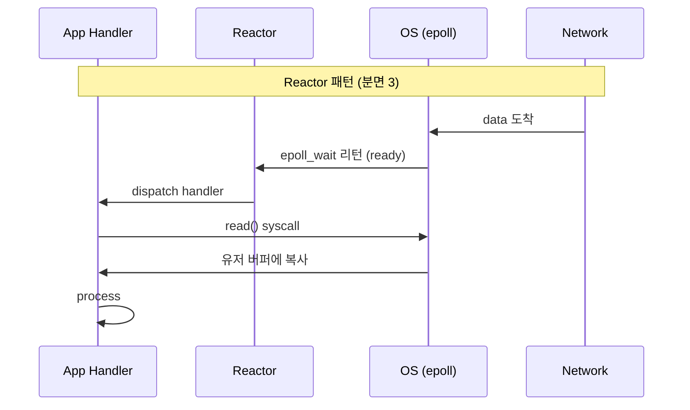
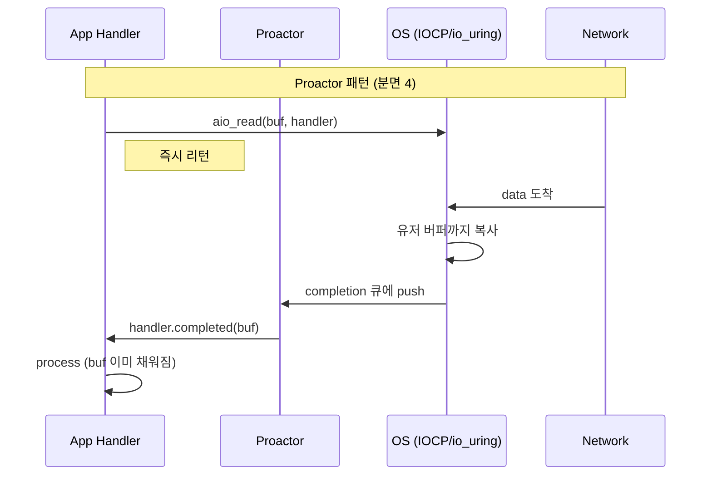

# 08. Reactor 패턴 vs Proactor 패턴

## TL;DR

- **Reactor 패턴** = "데이터 *준비됨* 알림" 후 호출자가 read — **분면 (3) sync non-blocking** 에 매핑
- **Proactor 패턴** = "IO *완료됨* 알림" — 분면 (4) async non-blocking 에 매핑
- Reactor = Linux/epoll/Netty/libuv 의 모델
- Proactor = Windows IOCP / 진짜 async (io_uring) 의 모델
- Doug Lea 의 [Scalable IO in Java](http://gee.cs.oswego.edu/dl/cpjslides/nio.pdf) 가 Reactor 의 표준 텍스트
- 이름이 비슷해서 헷갈리지만 **두 패턴은 본질적으로 다르다**

---

## 1. 이름의 유래

- **Reactor** (Schmidt, 1995) — Pattern-Oriented Software Architecture (POSA)
- **Proactor** (Schmidt, 1999) — POSA Volume 2

Doug Lea 가 Java 5 시절 NIO 를 정리하면서 Reactor 패턴을 표준 용어로 정착시킴 (그래서 우리 라이브러리 이름이 "Project **Reactor**" 이기도 하다).

---

## 2. Reactor 패턴 — 준비 알림 모델

핵심 컴포넌트:
- **Synchronous Event Demultiplexer** — `select`/`epoll` (OS)
- **Reactor** — 이벤트 루프 (Selector + dispatch)
- **Event Handler** — 비즈니스 로직
- **Concrete Event Handler** — Reactor 가 호출

```
                  [client]            [client]            [client]
                     │                    │                   │
                     ▼                    ▼                   ▼
              ┌──────────────────────────────────────────────────┐
              │  Sync Event Demux (epoll_wait)                    │
              └────────────┬─────────────────────────────────────┘
                           │ ready fd 알림
                           ▼
              ┌──────────────────────────────┐
              │  Reactor (Event Loop)         │
              │  while(true) {                │
              │    select()                   │
              │    for ready: dispatch()      │
              │  }                            │
              └────────────┬─────────────────┘
                           │ dispatch
              ┌────────────┼─────────────┐
              ▼            ▼             ▼
          [Handler1]   [Handler2]    [HandlerN]
          - read()     - read()      - read()
          - process()  - process()   - process()
```

흐름:
1. fd 가 ready 되면 OS 가 알림
2. Reactor 가 받음 → 적절한 Handler 로 dispatch
3. **Handler 가 직접 read() 호출** (분면 3)
4. Handler 가 process → 결과 write

핵심 특징:
- **synchronous** — 데이터 복사를 호출자(Handler)가 함
- 이벤트 = "ready"
- thread = 1 개 (single Reactor) 또는 여러 개 (multi-Reactor + worker pool)

---

## 3. Doug Lea 의 4 가지 변형

[Scalable IO in Java](http://gee.cs.oswego.edu/dl/cpjslides/nio.pdf) 에서 제시한 진화 단계.

### (1) Single-threaded Reactor

```
       ┌─────────────────────────────┐
       │  Reactor Thread              │
       │  - Selector.select()         │
       │  - dispatch                  │
       │  - read/decode/compute/encode/write  ← 모두 한 thread │
       └─────────────────────────────┘
```

가장 단순. 핵심 로직이 길거나 CPU 무거우면 Reactor thread 가 막힘.

### (2) Worker Thread Pool

CPU 무거운 작업을 worker 로 분리.

```
       ┌──────────────────┐
       │  Reactor Thread  │
       └────────┬─────────┘
                │ read 후 worker 로 위임
                ▼
       ┌──────────────────┐
       │  Worker Pool      │
       │  - decode         │
       │  - compute        │
       │  - encode         │
       └────────┬─────────┘
                │ 결과를 reactor 에 반환
                ▼
       ┌──────────────────┐
       │  Reactor Thread  │
       │  - write          │
       └──────────────────┘
```

Reactor thread 는 read/write 만 담당. CPU 작업은 worker.

### (3) Main + Sub Reactor (Master-Worker)

Listener 와 IO 처리를 분리.

```
       ┌──────────────────┐
       │  Main Reactor     │  ← accept 만
       └────────┬─────────┘
                │ accept → SubReactor 에 등록
                ▼
       ┌──────────────────────────────┐
       │  SubReactor[1..N]              │
       │  - 각자 Selector + thread       │
       │  - read/write                  │
       └──────────────────────────────┘
```

이게 **Netty 의 BossGroup / WorkerGroup** 모델 그대로.

### (4) (3) + Worker Pool

(3) 위에 추가로 CPU 작업용 worker pool.

> 우리 msa 의 Gateway (Reactor Netty 기반) 가 이 형태. boss(=accept) + worker(=IO) + boundedElastic(=blocking 작업) 분리.

---

## 4. Proactor 패턴 — 완료 알림 모델

핵심 컴포넌트:
- **Asynchronous Operation Processor** — OS (IOCP / io_uring)
- **Proactor** — 완료 이벤트 dispatcher
- **Completion Handler** — 결과 콜백

```
                  [client]
                     │
                     ▼
              ┌──────────────────────────────┐
              │  App: aio_read(buf, handler)  │  ← 호출 후 즉시 리턴
              └──────────────┬───────────────┘
                             │
                             ▼
              ┌──────────────────────────────┐
              │  OS Async IO Processor         │
              │  (커널이 데이터 도착 + buf 까지   │
              │   복사 모두 처리)               │
              └──────────────┬───────────────┘
                             │ 완료 후 통지
                             ▼
              ┌──────────────────────────────┐
              │  Proactor (Completion Queue)   │
              └──────────────┬───────────────┘
                             │ dispatch
                             ▼
              ┌──────────────────────────────┐
              │  Completion Handler            │
              │  (buf 에 데이터 이미 있음)        │
              └──────────────────────────────┘
```

흐름:
1. App 이 IO 요청 + buffer + handler 등록
2. OS 가 데이터 *복사까지* 끝낸 뒤 통지
3. Proactor 가 적절한 Completion Handler 호출
4. **Handler 는 read 안 함** (이미 buf 에 있음)

핵심 특징:
- **asynchronous** — 호출자는 buffer 만 제공, 복사도 OS 가
- 이벤트 = "complete"
- Windows IOCP / io_uring 이 OS 지원

---

## 5. Reactor vs Proactor 한 장 비교

| 항목 | Reactor | Proactor |
|---|---|---|
| 이벤트 종류 | "ready" (데이터 도착) | "complete" (복사 완료) |
| read 호출자 | 호출자 (App Handler) | OS |
| 분면 | (3) sync non-blocking | (4) async non-blocking |
| OS 지원 | epoll, kqueue, select | IOCP, io_uring, POSIX AIO |
| 대표 라이브러리 | Netty, Reactor, libuv, Nginx | .NET (IOCP), Windows ATL/WSA |
| API | 콜백/Selector | CompletionHandler/큐 polling |
| 버퍼 관리 | 호출자 시점에 alloc | 호출 *전에* alloc (OS 가 채울 곳) |
| 디버깅 | "어디서 막혔지?" stack trace 보임 | callback 시점이라 trace 끊김 |

### 흔한 오해

- "Netty 는 async 다" → **Netty 는 Reactor 패턴 = 분면 (3)**. async 라는 단어는 *프로그래밍 모델* 차원에서만 맞음.
- "Reactor 는 single thread" → 아니다. Doug Lea 의 (3) (4) 모델은 multi-Reactor.
- "Proactor 가 Reactor 보다 빠르다" → 워크로드에 따라 다름. 일반적으론 Linux 환경에서 Reactor + epoll 이 충분.

---

## 6. 코드: Java 로 구현한 minimal Reactor

```kotlin
class Reactor(port: Int) : Runnable {
    private val selector: Selector = Selector.open()
    private val server: ServerSocketChannel = ServerSocketChannel.open().apply {
        socket().bind(InetSocketAddress(port))
        configureBlocking(false)
    }

    init {
        val key = server.register(selector, SelectionKey.OP_ACCEPT)
        key.attach(Acceptor())  // attachment 로 핸들러 보관
    }

    override fun run() {
        while (!Thread.interrupted()) {
            selector.select()
            val it = selector.selectedKeys().iterator()
            while (it.hasNext()) {
                val key = it.next()
                it.remove()
                dispatch(key)
            }
        }
    }

    private fun dispatch(key: SelectionKey) {
        val handler = key.attachment() as Runnable
        handler.run()
    }

    inner class Acceptor : Runnable {
        override fun run() {
            val sc = server.accept() ?: return
            sc.configureBlocking(false)
            val key = sc.register(selector, SelectionKey.OP_READ)
            key.attach(Handler(sc))
        }
    }

    inner class Handler(private val ch: SocketChannel) : Runnable {
        override fun run() {
            val buf = ByteBuffer.allocate(1024)
            val n = ch.read(buf)  // ← 분면 (3): 호출자가 직접 read
            if (n == -1) ch.close()
            else process(buf)
        }

        private fun process(buf: ByteBuffer) { /* ... */ }
    }
}
```

이 30 줄이 Netty 의 본질. 나머지는 풀, 파이프라인, ByteBuf, 더 정교한 dispatch.

---

## 7. 코드: Proactor (Java NIO.2)

```kotlin
val server = AsynchronousServerSocketChannel.open()
server.bind(InetSocketAddress(8080))

server.accept(null, object : CompletionHandler<AsynchronousSocketChannel, Void?> {
    override fun completed(ch: AsynchronousSocketChannel, attachment: Void?) {
        // 다음 accept 등록 (반복)
        server.accept(null, this)

        // 클라이언트 read 시작
        val buf = ByteBuffer.allocateDirect(1024)
        ch.read(buf, buf, object : CompletionHandler<Int, ByteBuffer> {
            override fun completed(n: Int, b: ByteBuffer) {
                // ← 분면 (4): buf 가 이미 채워진 채로 콜백
                b.flip()
                process(b)
            }
            override fun failed(exc: Throwable, b: ByteBuffer) {}
        })
    }
    override fun failed(exc: Throwable, attachment: Void?) {}
})
```

호출 시점에 buffer 를 *미리* 넘기는 게 핵심. OS 가 그 buffer 를 채워서 완료 알림.

---

## 8. Sequence Diagram 비교





---

## 9. 왜 Linux 는 Reactor 가 표준이 됐나

- 90 년대~2000 년대 Linux 는 진짜 async syscall 이 없었음 (POSIX AIO 는 unstable)
- epoll 이 ready 알림 모델만 제공 → Reactor 가 자연스러운 추상화
- io_uring 이 2019 년 등장했지만 보안/호환성 이유로 일반화 안 됨
- 결과: Linux/모든 BSD/macOS 는 Reactor, Windows 는 Proactor 가 표준
- Java NIO 는 *분면 (3) 만* 추상화 — Selector 가 Reactor 친화적

---

## 10. 면접 답변 템플릿

**Q. Reactor 와 Proactor 의 차이는?**

> "이벤트 의미가 다릅니다.
> - **Reactor 는 'ready' 알림** — 'fd 가 준비됐으니 네가 read 해라'. 분면 (3) sync non-blocking.
> - **Proactor 는 'complete' 알림** — '데이터를 네 buffer 까지 채웠으니 결과만 봐라'. 분면 (4) async non-blocking.
>
> Linux 는 epoll 이 ready 알림밖에 못 주므로 Reactor 가 표준 (Netty, libuv, nginx). Windows 는 IOCP 가 complete 알림이라 Proactor (.NET 등). io_uring 이 Linux 에 진짜 async 를 제공했지만 일반화는 멀었습니다.
>
> 헷갈리지 말아야 할 건 '비동기 라이브러리' 와 'OS 차원 async' 의 구분입니다. Netty/WebFlux 는 비동기 *프로그래밍 모델* 이지만 OS IO 차원에선 Reactor = 분면 (3) 입니다."

---

## 11. 핵심 포인트

- Reactor = "ready" 알림, 호출자가 read (분면 3)
- Proactor = "complete" 알림, OS 가 read (분면 4)
- Linux/macOS = Reactor 표준, Windows = Proactor 표준
- Doug Lea 의 4 변형 (single, worker pool, main+sub, main+sub+pool) 이 Netty 구조의 뿌리
- 라이브러리 이름 "Project Reactor" 도 이 패턴 명에서 유래

## 다음 학습

- [09-netty-internals.md](09-netty-internals.md) — Netty 의 EventLoop / Pipeline / ByteBuf 내부
