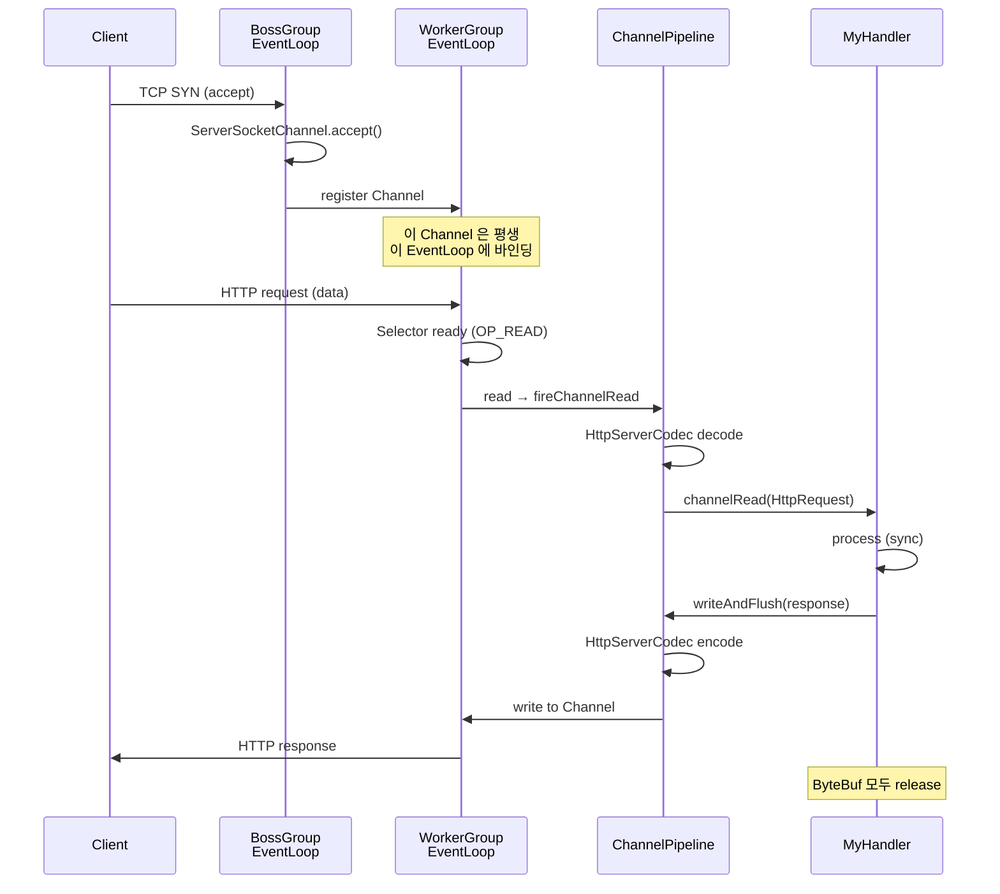

# 09. Netty 내부 — EventLoop / Pipeline / ByteBuf

## TL;DR

- **Netty** = JVM (Java Virtual Machine, 자바 가상 머신) 진영 표준 비동기 네트워크 프레임워크. Reactor 패턴 main+sub 모델 ([08 글](08-reactor-vs-proactor.md))
- **EventLoopGroup = boss + worker**, 각 EventLoop = 1 thread + 1 Selector
- **Channel ↔ ChannelPipeline ↔ ChannelHandler 체인** — 인바운드/아웃바운드 분리
- **ByteBuf** = Netty 의 ByteBuffer 대체 — pooled/unpooled, direct/heap, 참조 카운팅
- 모든 Handler 안에서 **blocking 금지** — EventLoop 가 멈추면 그 Loop 에 등록된 모든 Channel 이 멈춤
- 우리 msa 의 **Spring Cloud Gateway / Lettuce / Reactor Netty 가 모두 Netty 위에서 동작**

---

## 1. 큰 그림

```
                    ┌──────────────────────────────────┐
                    │  BossGroup (1~2 thread)           │
                    │  - accept 만 담당                  │
                    │  - 새 Channel 을 WorkerGroup 에 등록 │
                    └──────────────┬───────────────────┘
                                   │ register
                    ┌──────────────┴───────────────────┐
                    │  WorkerGroup (CPU * 2 thread 보통)  │
                    │  ┌──────────┐ ┌──────────┐         │
                    │  │ EventLoop│ │ EventLoop│ ...      │
                    │  │ - Selector│ │ - Selector│         │
                    │  │ - Queue   │ │ - Queue   │         │
                    │  └──────────┘ └──────────┘         │
                    └──────────────────────────────────┘
                                   │
                                   ▼
                    ┌──────────────────────────────────┐
                    │  Channel (한 connection 당 1개)     │
                    │  └─ ChannelPipeline                │
                    │       └─ Handler1 → Handler2 → ... │
                    └──────────────────────────────────┘
```

이 그림이 Netty 의 전부. 디테일은 이 위에 얹힌다.

---

## 2. EventLoop = single thread + selector

```kotlin
class NioEventLoop {
    private val selector: Selector = Selector.open()
    private val taskQueue: Queue<Runnable> = MpscQueue()
    private var thread: Thread? = null

    fun run() {
        while (true) {
            // 1) IO 이벤트 처리
            selector.select(timeoutMs)
            val ready = selector.selectedKeys()
            for (key in ready) {
                processIO(key)
            }

            // 2) task queue 처리 (외부에서 EventLoop 에 제출한 일)
            var task = taskQueue.poll()
            while (task != null) {
                task.run()
                task = taskQueue.poll()
            }
        }
    }
}
```

핵심 규칙:
- **EventLoop = thread 1개**. 절대 thread-safe 보호 안 해도 됨 (해당 Loop 안에서)
- 한 Channel 은 평생 한 EventLoop 에 바인딩 → context switching 없음
- 외부에서 `channel.eventLoop().execute { ... }` 로 task 제출 가능
- Loop 가 막히면 그 Loop 에 등록된 *모든 Channel 이 멈춤* (= 모든 connection 멈춤)

### 왜 single thread 인가?

- thread-safe 코드 작성이 *불필요* → 동시성 버그 0
- ThreadLocal / lock 안 써도 됨
- 컨텍스트 스위치 비용 0
- *한 Loop 가 처리할 수 있는 만큼*만 부하 받음 → 자연스러운 backpressure

> 면접 빈출: "Netty 의 EventLoop 가 1 thread 인 이유는?" → 위 4 가지.

---

## 3. EventLoopGroup — boss + worker 분리

```kotlin
val bossGroup = NioEventLoopGroup(1)        // accept 만
val workerGroup = NioEventLoopGroup()       // 기본: CPU * 2

val bootstrap = ServerBootstrap()
    .group(bossGroup, workerGroup)
    .channel(NioServerSocketChannel::class.java)
    .childHandler(MyChannelInitializer())
    .bind(8080)
    .sync()
```

- `bossGroup` — `ServerSocketChannel` 의 OP_ACCEPT 만 처리. accept 후 worker 에 위임. 보통 thread 1~2 개
- `workerGroup` — 실제 connection IO. CPU 코어 수에 비례

### 왜 분리하나?
- accept 와 IO 의 부하 패턴이 다름
- accept 가 폭주해도 IO thread 가 영향 안 받게
- 단 작은 서비스는 같은 그룹 써도 무방

### Native epoll transport
```kotlin
val bossGroup = EpollEventLoopGroup(1)
val workerGroup = EpollEventLoopGroup()
val bootstrap = ServerBootstrap()
    .channel(EpollServerSocketChannel::class.java)
```

- `NioEventLoopGroup` = JDK NIO Selector 기반 (이식성 ↑)
- `EpollEventLoopGroup` = Linux native epoll JNI 직접 호출 (~10% 성능 ↑, GC 압박 ↓)
- `KQueueEventLoopGroup` = macOS/BSD native
- `IoUringEventLoopGroup` = io_uring incubator

---

## 4. Channel + ChannelPipeline + ChannelHandler

### Channel
한 connection 의 추상화. SocketChannel 을 wrapping.

### ChannelPipeline
Channel 마다 한 개. **Handler 들의 양방향 linked list**.

```
Inbound  →   Handler1 → Handler2 → Handler3   →   App Logic
                                                       │
Outbound ←   Handler1 ← Handler2 ← Handler3   ←  ──────┘
```

- **Inbound** = 데이터가 *들어오는* 방향 (read)
- **Outbound** = 데이터가 *나가는* 방향 (write)
- Handler 는 한 방향만 처리하거나 양쪽 (Duplex) 모두 처리 가능

### ChannelHandler 종류

```kotlin
// Inbound 만
class MyDecoder : ChannelInboundHandlerAdapter() {
    override fun channelRead(ctx: ChannelHandlerContext, msg: Any) {
        val buf = msg as ByteBuf
        // decode...
        ctx.fireChannelRead(decoded)  // 다음 inbound handler 로
    }
}

// Outbound 만
class MyEncoder : ChannelOutboundHandlerAdapter() {
    override fun write(ctx: ChannelHandlerContext, msg: Any, promise: ChannelPromise) {
        val encoded = encode(msg)
        ctx.write(encoded, promise)  // 다음 outbound handler 로 (실은 이전 — pipeline 의 outbound 순서는 역순)
    }
}

// Duplex
class MyDuplex : ChannelDuplexHandler()
```

### Pipeline 구성 예 — HTTP 서버

```kotlin
class MyChannelInitializer : ChannelInitializer<SocketChannel>() {
    override fun initChannel(ch: SocketChannel) {
        ch.pipeline()
            .addLast(HttpServerCodec())              // ByteBuf ↔ HttpRequest/Response
            .addLast(HttpObjectAggregator(65536))    // 청크 합치기
            .addLast(MyBusinessHandler())            // 비즈니스
    }
}
```

각 Handler 는 *작은 단위*로 책임 분리 → 재사용성 ↑.

---

## 5. ByteBuf — Netty 의 ByteBuffer

JDK ByteBuffer 의 한계:
- write/read 모드 전환 (`flip()`) 헷갈림
- capacity 고정 (확장 불가)
- 참조 카운팅 없음

Netty 의 ByteBuf 가 해결:

```kotlin
val buf = Unpooled.buffer()  // 또는 ctx.alloc().buffer()
buf.writeInt(42)
buf.writeBytes("hello".toByteArray())

val n = buf.readInt()         // 읽기와 쓰기 인덱스 분리 → flip 불필요
val s = buf.readBytes(5).toString(Charsets.UTF_8)

buf.release()  // 참조 카운팅 — 잊으면 메모리 누수
```

### 핵심 차이

| 항목 | JDK ByteBuffer | Netty ByteBuf |
|---|---|---|
| 모드 전환 | flip() 필요 | readerIndex / writerIndex 별도 |
| 크기 | 고정 | 자동 확장 |
| 풀링 | 없음 | PooledByteBufAllocator |
| 참조 카운팅 | 없음 | 있음 (`refCnt`) |
| Direct/Heap | allocate / allocateDirect | direct/heap + pooled/unpooled |

### Pooled vs Unpooled

```
PooledByteBufAllocator (default since Netty 4.1)
  ┌─ Arena (CPU 코어 수 만큼) ─┐
  │  ┌─ Chunk (16MB)         │
  │  │  ┌─ Page (8KB)        │
  │  │  └─ Subpage           │
  │  └─                       │
  └─                          │
```

Netty 가 jemalloc/glibc malloc 의 디자인을 차용해 ByteBuf 풀을 직접 관리. **할당/해제 비용 거의 0**.

### 참조 카운팅 (refCnt)

```kotlin
val buf = ctx.alloc().buffer()
println(buf.refCnt())  // 1
buf.retain()           // refCnt = 2
println(buf.refCnt())  // 2
buf.release()          // refCnt = 1
buf.release()          // refCnt = 0 → 풀로 반납
buf.release()          // IllegalReferenceCountException
```

규칙:
- **알림 받는 Handler 가 release() 책임**
- pipeline 끝까지 통과하면 마지막 Handler 가 release
- ReferenceCountUtil.release(msg) 가 안전한 헬퍼

`release()` 빠뜨림 = direct memory 누수. JVM heap 은 멀쩡한데 RSS 만 늘어 OOM. *Netty 운영 사고의 1위 원인*.

---

## 6. 절대 하지 말 것 — Handler 안에서 Blocking

```kotlin
// 끔찍한 코드
class BadHandler : ChannelInboundHandlerAdapter() {
    override fun channelRead(ctx: ChannelHandlerContext, msg: Any) {
        Thread.sleep(1000)        // ← EventLoop 멈춤
        val data = jdbc.query()    // ← 또 멈춤
        val response = restTemplate.exchange(...)  // ← 또
        ctx.writeAndFlush(response)
    }
}
```

이 한 Handler 가 1초 sleep 하면 *그 EventLoop 의 모든 Channel 이 1초 멈춘다*. WorkerGroup 이 8 thread 면 1/8 의 connection 이 동시에 영향.

### 올바른 방법

(a) Channel 의 EventLoop 가 아닌 별도 EventExecutorGroup 으로 분리:

```kotlin
val businessGroup = DefaultEventExecutorGroup(16)

ch.pipeline()
    .addLast(HttpServerCodec())
    .addLast(businessGroup, "biz", BadHandler())  // 두 번째 인자 = 실행 그룹
```

(b) 직접 thread pool 에 위임:

```kotlin
class GoodHandler(private val executor: ExecutorService) : ChannelInboundHandlerAdapter() {
    override fun channelRead(ctx: ChannelHandlerContext, msg: Any) {
        executor.submit {
            val response = jdbc.query()
            ctx.channel().eventLoop().execute {  // 응답은 EventLoop 로 다시
                ctx.writeAndFlush(response)
            }
        }
    }
}
```

WebFlux 의 `Mono.fromCallable { ... }.subscribeOn(Schedulers.boundedElastic())` 가 이 패턴의 추상화.

---

## 7. 시퀀스: 클라이언트 한 요청의 흐름



---

## 8. HashedWheelTimer — 타이머도 비동기

Netty 의 timer 는 일반 ScheduledExecutor 가 아니라 **HashedWheelTimer**.

- 슬롯 수 = 512 (default), tick = 100ms
- timeout 등록은 O(1)
- 정확도는 tick 단위 (예: 100ms 정확도면 충분한 timeout 처리에 적합)
- 수만 timeout 도 메모리/성능 좋음

```kotlin
val timer = HashedWheelTimer()
timer.newTimeout({ /* expired */ }, 5, TimeUnit.SECONDS)
```

connection idle timeout, request deadline 등에 사용.

---

## 9. 우리 msa 코드 매핑

[15 글](15-msa-gateway-webflux.md) 에서 깊게 다루지만, 미리 본다:

| msa 컴포넌트 | Netty 와의 관계 |
|---|---|
| Spring Cloud Gateway | **Reactor Netty** 위 — boss/worker EventLoopGroup 자동 |
| Lettuce (Redis client) | Netty Channel + Pipeline 으로 RESP 인코딩/디코딩 |
| `@Bean WebClient` | Reactor Netty client (HttpClient) |
| Tomcat | Netty 가 아니라 자체 NIO connector (다른 길) |
| Kafka client | 자체 NIO Selector (Netty 미사용) |

따라서 우리 msa 의 *Gateway 와 Lettuce* 가 Netty 의 직접 영향권. 나머지 서비스는 Tomcat 위에서 thread-per-request.

---

## 10. 면접 답변 템플릿

**Q. Netty 가 어떻게 그렇게 빠른가요?**

> "네 가지가 결합됩니다.
> 1. **Reactor 패턴 main+sub** — boss + worker EventLoopGroup. 한 Channel 은 한 EventLoop 에 바인딩되어 평생 lock-free.
> 2. **EventLoop = 1 thread + 1 Selector** — 그 안에서는 동시성 보호 코드가 0. 컨텍스트 스위치도 0.
> 3. **PooledByteBufAllocator** — direct buffer 를 jemalloc-style 로 풀링. 할당 비용 거의 0.
> 4. **zero-copy 친화** — `DefaultFileRegion` 으로 sendfile 활용, write 시 staging 복사 없음.
>
> 단점: Handler 안에서 blocking 호출하면 그 EventLoop 의 *모든 Channel 이 멈춥니다*. 그래서 JDBC 같은 blocking 라이브러리는 별도 EventExecutorGroup 으로 분리해야 합니다. WebFlux 가 boundedElastic 을 두는 이유도 같습니다."

---

## 11. 핵심 포인트

- Netty = Reactor main+sub 모델 (boss + worker EventLoopGroup)
- EventLoop = 1 thread + 1 Selector — 안에서 lock-free
- ChannelPipeline = Handler 양방향 linked list, inbound/outbound 분리
- ByteBuf = pooled direct buffer + 참조 카운팅 (release 필수)
- Handler 안 blocking 절대 금지 — 별도 ExecutorGroup 으로 분리

## 다음 학습

- [10-project-reactor.md](10-project-reactor.md) — Project Reactor (Mono/Flux/Schedulers)
