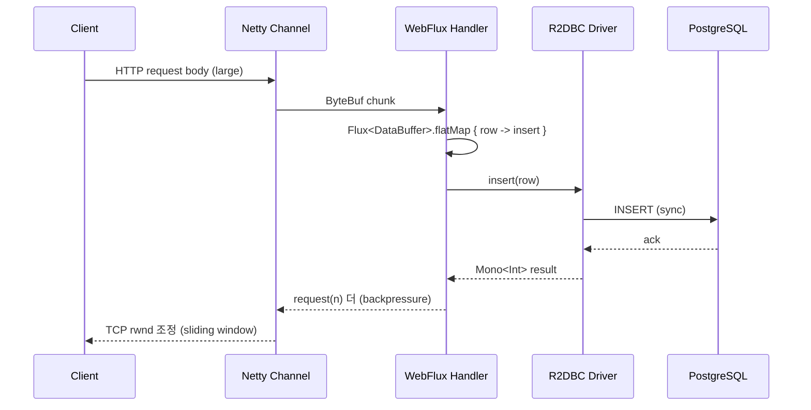

# 11. Backpressure 전략

## TL;DR

- **Backpressure** = 소비자가 생산자 속도를 *제어* 하는 메커니즘
- Reactive Streams 의 핵심 — `Subscription.request(n)` 신호로 "n 개만 더 줘" 라고 표현
- Backpressure 가 안 통하는 source (네트워크, 시간 기반) 를 위해 4 가지 fallback: **buffer / drop / latest / error**
- TCP 의 sliding window, Kafka consumer lag, Redis stream 의 PEL 도 같은 개념의 변형
- Netty 는 Channel.isWritable + watermark 로, Reactor 는 request(n) 으로 처리

---

## 1. 문제 정의

생산자(Producer) 가 소비자(Consumer) 보다 빠르면 데이터가 *어디엔가 쌓인다*. 쌓이는 곳은:
- TCP buffer (네트워크 stack)
- 어플리케이션 in-memory queue
- Disk (Kafka, Redis stream)

쌓이는 양이 메모리 한계를 넘으면:
- OOM (어플리케이션)
- Connection drop (TCP buffer 한계)
- Disk 폭주 (Kafka)

```
Producer ──5000/s──► [Queue] ──1000/s──► Consumer
                       ↑
                       │ 매초 4000개씩 쌓임 → OOM
```

**Backpressure = "Consumer 가 처리할 수 있는 만큼만 보내라" 는 신호 메커니즘.**

---

## 2. Reactive Streams 의 request(n)

```java
public interface Subscription {
    void request(long n);  // ← 핵심
    void cancel();
}
```

흐름:
1. `subscribe()` 호출 시 `onSubscribe(Subscription s)` 콜백
2. Subscriber 가 `s.request(n)` 으로 *받을 수 있는 양* 표현
3. Publisher 는 *최대 n 개* 까지만 onNext
4. Subscriber 가 추가로 처리 가능하면 `s.request(m)` 또 호출

```kotlin
flux.subscribe(object : Subscriber<Int> {
    private lateinit var sub: Subscription

    override fun onSubscribe(s: Subscription) {
        sub = s
        s.request(10)  // 처음 10개만
    }

    override fun onNext(item: Int) {
        process(item)
        sub.request(1)  // 1개 처리했으니 1개 더
    }

    override fun onError(t: Throwable) {}
    override fun onComplete() {}
})
```

이게 표면적인 backpressure. 근데 실제론 `subscribe { }` 의 단순 형태에선 `request(Long.MAX_VALUE)` 가 default — *backpressure 신호를 무시*.

> 대부분의 Reactor 사용자가 backpressure 를 못 보는 이유: `.subscribe { ... }` 가 unbounded request 를 보내기 때문. 명시적으로 `BaseSubscriber` 를 쓰거나 `.limitRate(n)` 을 추가해야 의미 있음.

---

## 3. limitRate / window — 손쉬운 backpressure

```kotlin
flux.limitRate(10)  // upstream 에 한 번에 10 개만 request
    .map { transform(it) }
    .subscribe()
```

`limitRate` 는 "한 번에 10 개씩 끊어서 요청" 으로 해석.

`window` / `buffer` 같은 batching operator 도 backpressure 효과:

```kotlin
flux.buffer(100)            // 100 개씩 묶어서
    .flatMap { batch -> bulkInsert(batch) }
    .subscribe()
```

DB bulk insert 처럼 batch 가 적합한 워크로드는 이게 가장 자연스러움.

---

## 4. Backpressure 가 안 통하는 source 들

`request(n)` 이 의미가 있으려면 publisher 가 *생산을 미룰 수 있어야* 한다. 못 미루는 source:

- **TCP packet 도착** — NIC 가 받아오는 걸 늦출 수 없음
- **타이머 / 스케줄러** — `Flux.interval()`
- **외부 push 시스템** — Kafka topic, Server-Sent Events upstream

이 경우 `request(n)` 은 무의미하고, *과잉 데이터를 어디로 보낼 것인가* 가 문제.

---

## 5. Overflow 전략 4 가지

Reactor 의 `onBackpressureXxx` 시리즈.

### (a) BUFFER — 일단 다 쌓는다

```kotlin
flux.onBackpressureBuffer(1000) { dropped ->
    log.warn("dropped: $dropped")  // buffer 도 넘치면 호출
}
```

- 메모리 사용 ↑
- buffer 한계 도달 시 drop / error 선택
- 가장 흔한 default

### (b) DROP — 새로 들어오는 걸 버린다

```kotlin
flux.onBackpressureDrop { dropped ->
    log.info("dropped newest: $dropped")
}
```

- 가장 최근 N 개 데이터를 버림
- 실시간 metric, log 처럼 *최신만* 보면 되는 경우

### (c) LATEST — 가장 최근 1 개만 유지

```kotlin
flux.onBackpressureLatest()
```

- buffer = 1, 새 값이 오면 덮어쓰기
- 센서 값, GPS 위치처럼 *항상 최신만* 의미 있는 경우

### (d) ERROR — 즉시 에러

```kotlin
flux.onBackpressureError()
```

- consumer 가 따라오지 못하면 *fail-fast*
- 데이터 손실 절대 안 되는 워크로드 (금융 거래) — 못 따라오면 차단

### 의사 결정

| 워크로드 | 전략 |
|---|---|
| 로그 수집 | DROP (최근 것 버림) — log 누락 허용 |
| 실시간 시세 | LATEST — 중간값 의미 없음 |
| 결제 이벤트 | ERROR — 손실 절대 금지 |
| 배치 데이터 | BUFFER (제한 + 알람) |

---

## 6. 다른 영역의 backpressure

backpressure 는 reactive 만의 발명품이 아니다. **모든 IO 시스템이 비슷한 메커니즘**을 가진다.

### TCP 의 sliding window

- receiver 가 자기 buffer 의 *남은 공간 (rwnd)* 을 ACK 와 함께 전송
- sender 는 ACK 안 받은 데이터를 더 못 보냄 → *flow control*
- TCP 자체가 자연스러운 backpressure

### Kafka consumer lag

- consumer 가 따라오지 못하면 *broker 의 retention 한도까지* 데이터 누적
- retention 한도 넘으면 *데이터 유실* (drop 과 유사)
- consumer group rebalance 로 partition 재분배 — partial 해결

### Redis stream 의 PEL

- consumer 가 ACK 안 한 메시지는 PEL (Pending Entries List) 에 보관
- Stream 길이 한도 (`MAXLEN`) 초과 시 오래된 데이터 trim

### 일반 큐 — bounded queue

```kotlin
val queue = ArrayBlockingQueue<Item>(100)
queue.offer(item, 1, TimeUnit.SECONDS)  // 100 차면 1초 대기 후 false
```

`offer` vs `put` vs `add` — 큐가 찼을 때 동작이 다름. 이게 가장 원시적인 backpressure.

---

## 7. Netty 의 backpressure — Channel.isWritable

Reactor 와 다른 메커니즘. **OutboundBuffer 의 watermark** 사용.

```kotlin
class MyHandler : ChannelInboundHandlerAdapter() {
    override fun channelRead(ctx: ChannelHandlerContext, msg: Any) {
        if (!ctx.channel().isWritable) {
            // 다운스트림이 처리 못 따라옴 — write 늦추거나 buffer
            return
        }
        ctx.writeAndFlush(processedData(msg))
    }
}
```

- `Channel.isWritable` — outbound buffer 가 *high water mark* (default 64KB) 미만이면 true
- 위로 올라가면 false → 그 동안 *어플리케이션이 write 를 자제*
- *low water mark* (default 32KB) 까지 빠지면 다시 true
- `channelWritabilityChanged` 콜백으로 알림

이게 Netty 의 OS-level backpressure. WebFlux 의 reactive backpressure 와 다른 층위에서 동작.

---

## 8. WebFlux + R2DBC 의 backpressure 흐름



위→아래 흐름에서 **각 layer 가 backpressure 를 다음 layer 로 전파**한다. WebFlux 의 가치는 이 *수직 backpressure* 가 자동으로 작동한다는 점. 일반 Servlet 모델은 request body 를 한꺼번에 메모리에 로드 → backpressure 없음.

---

## 9. 흔한 안티패턴

### (a) onBackpressureBuffer 무한대

```kotlin
flux.onBackpressureBuffer()  // 인자 없음 = unbounded
```

unbounded buffer = OOM 시한폭탄. **반드시 capacity 명시**.

### (b) subscribe { } 의 unbounded request

```kotlin
flux.subscribe { process(it) }  // request(MAX_VALUE)
```

publisher 가 producer-driven 이면 backpressure 무력. `BaseSubscriber` 또는 `limitRate` 사용.

### (c) Schedulers.immediate() 로 처리 분리 안 함

```kotlin
flux
    .map { heavyComputation(it) }  // ← upstream EventLoop 에서 실행됨
    .subscribe()
```

`map` 안에서 무거운 작업은 `publishOn(Schedulers.parallel())` 후로 옮겨야 함.

---

## 10. msa 컨텍스트

| 영역 | 현재 backpressure |
|---|---|
| Gateway (WebFlux) | Reactor 의 자동 backpressure (Netty Channel + Reactor request) |
| Lettuce reactive | Reactor backpressure (드물게 사용) |
| Kafka consumer | poll() 기반 — 한 번에 가져오는 양으로 자연 제어 (`max.poll.records`) |
| WebClient → 외부 API | Mono 단발, backpressure 의미 없음 |
| RabbitMQ / SSE 등 | 미사용 |

> 우리 msa 는 *고용량 stream* 시나리오가 많지 않아서 backpressure 가 핵심 이슈는 아님. 다만 만약 SSE/WebSocket 도입 시(예: 실시간 알림, [18 글](18-improvements.md)) backpressure 전략 결정이 필요해짐.

---

## 11. Kotlin Coroutine 의 Flow backpressure

참고: Coroutine 의 Flow 도 backpressure 가 있다.

```kotlin
val flow: Flow<Int> = flow {
    for (i in 1..1000) {
        emit(i)  // collector 가 처리 끝나야 다음 emit
    }
}

flow.collect { item ->
    delay(100)
    println(item)
}
```

- Coroutine Flow 는 *suspend 자체가 backpressure*
- collect 가 suspend 되면 emit 도 suspend
- buffer 효과를 원하면 `flow.buffer(64)` 명시
- `conflate()` = onBackpressureLatest 와 동일

[14 글](14-coroutine-vs-reactor.md) 에서 비교.

---

## 12. 면접 답변 템플릿

**Q. Backpressure 가 뭔가요? Reactor 는 어떻게 처리하나요?**

> "생산자가 소비자보다 빠를 때 *어딘가 데이터가 쌓이는* 문제를 막는 메커니즘입니다. 가장 정통은 *소비자가 받을 수 있는 양을 신호로 표현* — Reactive Streams 의 `Subscription.request(n)` 입니다. Reactor 는 이걸 자동으로 전파합니다.
>
> 다만 backpressure 가 통하지 않는 source — 예: TCP packet, timer, Kafka push — 가 있어서 4 가지 overflow 전략이 있습니다.
> - **buffer**: 일단 쌓음 (capacity 명시 필수, OOM 위험)
> - **drop**: 새로 오는 걸 버림 (로그)
> - **latest**: 가장 최신만 유지 (실시간 시세)
> - **error**: 즉시 fail-fast (금융 거래)
>
> 운영에서 흔한 안티패턴: `subscribe { }` 가 unbounded request 라 publisher 가 producer-driven 이면 backpressure 무력화됨. `limitRate(n)` 을 명시하거나 `BaseSubscriber` 를 직접 쓰면 됩니다."

---

## 13. 핵심 포인트

- Backpressure = consumer 가 producer 속도 제어
- Reactive Streams 의 `request(n)` 이 핵심 신호
- buffer / drop / latest / error — 4 가지 overflow 전략
- TCP sliding window, Kafka lag, bounded queue 도 같은 개념
- Netty 의 `Channel.isWritable` 은 OS-level backpressure
- 우리 msa 에선 SSE/WebSocket 도입 시 backpressure 결정 필요

## 다음 학습

- [12-webflux-vs-mvc.md](12-webflux-vs-mvc.md) — Spring WebFlux vs Spring MVC 트레이드오프
