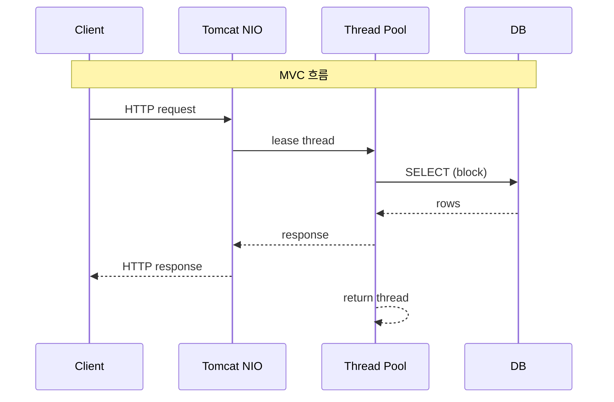
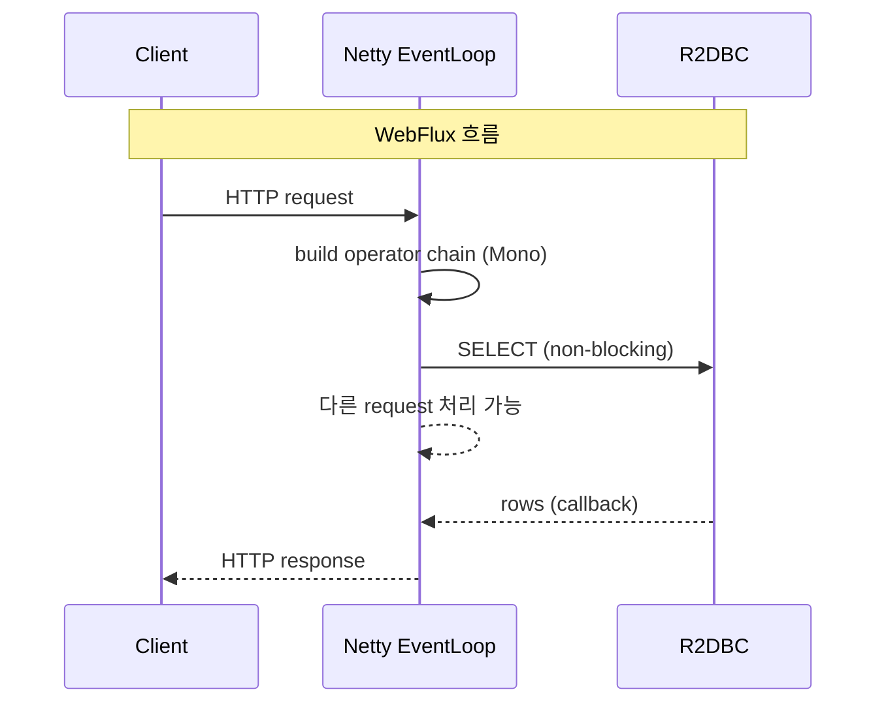

# 12. Spring WebFlux vs Spring MVC

## TL;DR

- **MVC**: Servlet API + thread-per-request. 단순, 디버깅 쉬움, 라이브러리 호환성 ↑
- **WebFlux**: Reactor + EventLoop. 동시 connection 많을 때 메모리/스위치 절약
- *throughput* 자체는 비슷할 때가 많음 — WebFlux 의 진짜 이득은 **동시성 처리량 / 메모리 / 응답 시간 분포**
- WebFlux 가 손해보는 경우: blocking 라이브러리 강제 사용, CPU-bound, 디버깅 비용
- **Virtual Threads (JDK 21+) 가 MVC + VT 를 새로운 default 로 만드는 중** — [13 글](13-virtual-threads-impact.md)
- 우리 msa: **Gateway 만 WebFlux**, 나머지는 MVC. 의도적 선택.

---

## 1. Thread Model 비교

### MVC (Servlet 3.1+ NIO connector)

```
Request 1 ─► Thread #1 ─► JDBC blocking ─► response
Request 2 ─► Thread #2 ─► HTTP call blocking ─► response
Request N ─► Thread #N ─► ...

Tomcat thread pool (default 200)
```

- 한 요청 = 한 thread 가 *처음부터 끝까지* 잡고 있음
- IO 대기 중에도 thread 는 점유 상태 (memory + scheduler 부담)
- thread pool exhaustion 시 새 요청 거부 / 큐잉

### WebFlux

```
Request 1, 2, ..., N ─► Worker EventLoop[1..N] (CPU * 2)
                          │
                          ├── operator chain
                          │   (subscribe → map → flatMap → ...)
                          ├── publishOn(boundedElastic) for blocking
                          └── publishOn(parallel) for CPU
```

- 한 요청 = *thread 를 잡지 않고* operator chain 으로 비동기 처리
- IO 대기 시 thread 반환 → 다른 요청 처리 가능
- thread 수 ≪ connection 수 (CPU 코어 수만큼 worker)

---

## 2. 메모리 비교

### Stack memory

```
JVM thread default stack = 1MB (-Xss1m)

MVC: 200 thread × 1MB = 200MB (top-end)
WebFlux: 16 thread × 1MB = 16MB
```

`Xss` 줄여도 OS 한계 (보통 64KB minimum) 고려.

### Per-request 메모리

```
MVC:    thread stack + ThreadLocal + request scope bean
WebFlux: Mono / Flux 객체 + Reactor Context
```

WebFlux 의 per-request 메모리가 일반적으로 더 작지만, *operator chain 이 길면* Reactor 객체가 누적.

### Connection 별 메모리

```
MVC:     per-request 처리 동안 connection 을 thread 가 1:1
WebFlux: Netty Channel 1개 + ByteBuf (pooled, ~수 KB)
```

10K connection 시 차이가 명확:
- MVC: 200 thread + 9800 connection 은 *큐* 에서 대기
- WebFlux: 모든 connection 이 살아 있음, EventLoop 가 라운드 로빈

---

## 3. Throughput vs Latency

### Throughput (RPS)

비슷한 워크로드에서 큰 차이 없음. 둘 다 잘 튜닝하면 비슷한 RPS.

> **흔한 오해**: "WebFlux 가 5 배 빠르다" — 잘못된 비교 (boilerplate Tomcat vs 튜닝된 WebFlux 같은 식). 실측은 *워크로드 특성* 이 모두.

### Latency

- *idle* 시: 둘 다 비슷
- *load 시*:
  - MVC: thread pool 포화되면 큐잉 → P99 가 급격히 증가
  - WebFlux: connection 그대로 받음 → P99 가 *완만하게* 증가
- *p99 / p999 분포* 가 WebFlux 가 안정적

### 동시 connection 수

- MVC: thread pool 한계 (~200 default), 그 위는 큐
- WebFlux: 사실상 무제한 (메모리 한계까지)

---

## 4. WebFlux 가 *유리한* 경우

### (a) 고동시 + 짧은 요청
- 채팅, 실시간 알림, IoT 게이트웨이
- 10K~100K connection 동시 처리
- 각 연결의 처리 시간 < 100ms

### (b) Streaming
- SSE (Server-Sent Events)
- WebSocket
- 큰 파일 업/다운로드 (chunked)
- MVC 도 가능하지만 thread 점유

### (c) Fan-out 호출
```kotlin
fun aggregate(): Mono<Result> = Mono.zip(
    fetchA(),  // ───┐
    fetchB(),  // ───┼── 동시 호출
    fetchC()   // ───┘
) { a, b, c -> Result(a, b, c) }
```

병렬 호출이 자연스러움. MVC 에선 별도 thread / CompletableFuture 필요.

### (d) Reactive end-to-end
- DB → R2DBC, Redis → Lettuce reactive, HTTP → WebClient
- *전 구간 reactive* 면 thread context switching 거의 없음

---

## 5. WebFlux 가 *불리한* 경우

### (a) Blocking 라이브러리 강제

```kotlin
// JDBC (R2DBC 못 쓰는 DB)
val users = jdbcTemplate.query(...)  // blocking

// 카카오 SDK, 자체 client
val response = legacyClient.send()    // blocking
```

`subscribeOn(boundedElastic())` 으로 분리 가능하지만:
- 의미상 thread-per-request 와 동일해짐
- *코드 복잡도만 늘고 이득 없음*
- thread 수도 boundedElastic default = CPU * 10 = 100~150 (Tomcat 200 과 비슷)

### (b) CPU-bound 작업

```kotlin
val image = Mono.fromCallable { resizeImage(input) }  // CPU 200ms
```

- 비동기로 짜도 CPU 자체는 그대로 소비
- WebFlux 의 EventLoop 가 막히면 *모든 connection 멈춤*
- `parallel()` 로 분리해도 결국 CPU 코어 수가 한계

### (c) 디버깅

```
Stack trace from MVC:
  at com.kgd.product.service.ProductService.findById(ProductService.kt:42)
  at com.kgd.product.controller.ProductController.get(ProductController.kt:25)
  at ...

Stack trace from WebFlux:
  at reactor.core.publisher.Mono$$Lambda...
  at reactor.core.publisher.MonoFlatMap.subscribe...
  at reactor.core.publisher.Operators.complete...
  at ...
```

WebFlux 는 *operator 가 thread hop* 하므로 stack trace 의 의미가 흐려짐. Reactor 의 `Hooks.onOperatorDebug()` 또는 `checkpoint()` 로 보완.

### (d) 학습 곡선

- map / flatMap / publishOn / subscribeOn / Schedulers / Backpressure 모두 필수
- 팀원이 7 명인데 1 명만 익숙하면 *유지보수 비용* 폭증
- 실수가 silent failure 로 이어짐 (block() 누락, subscribe() 누락 등)

---

## 6. 실측 시나리오 비교

### 시나리오 A: 단순 CRUD, 동시 100, JDBC

| | MVC | WebFlux |
|---|---|---|
| Throughput | ~5K RPS | ~5K RPS (≒) |
| P99 latency | 50ms | 55ms (operator overhead) |
| Memory | 200MB | 100MB |
| 코드 복잡도 | 1.0x | 1.5x |

→ **MVC 승**. 동시성이 thread pool 안에 들어옴.

### 시나리오 B: 고동시 외부 API fan-out, 동시 5000

| | MVC | WebFlux |
|---|---|---|
| Throughput | thread pool 포화, 일부 거부 | ~10K RPS |
| P99 | 500ms (큐잉) | 200ms |
| Memory | 200 thread × 1MB + 큐 | 16 thread × 1MB |
| 코드 복잡도 | 1.0x | 1.3x |

→ **WebFlux 승**. 동시성이 thread pool 을 넘어섬.

### 시나리오 C: SSE 실시간 알림, 50K 동접

| | MVC | WebFlux |
|---|---|---|
| Throughput | 사실상 불가 (50K thread 못 띄움) | OK |
| Memory | 50K × 1MB = 50GB stack VAS | 수십 MB |

→ **WebFlux 압도**. SSE/WebSocket 의 본진.

---

## 7. 시퀀스 비교





---

## 8. 우리 msa 의 의사결정 근거

### Gateway = WebFlux
- 모든 트래픽의 입구 → *동접이 가장 큼*
- 비즈니스 로직 없음, 라우팅 + 인증 + 로깅만
- `AuthenticationGatewayFilter` 의 `Mono` 체인 — JWT 검증 + Redis blacklist 조회 (모두 reactive)
- 외부 시스템 호출 (downstream service) 도 reactive (HttpClient = Reactor Netty)
- → **고동시 + reactive end-to-end** 시나리오 ✓

### product / order / search / member ... = MVC
- 도메인 단위 서비스, 보통 *세 자릿수 RPS* 영역
- JDBC + JPA 를 쓰는데 R2DBC 가 충분히 성숙하지 않음 (JOIN, lazy loading 등)
- Kafka client = blocking poll() 모델
- 외부 호출은 한두 군데 (`order/ProductAdapter` 같은) — 이 정도는 `WebClient + awaitSingle`
- → **단순함이 더 큰 가치**

이 의사결정은 [Gateway CLAUDE.md](../../../gateway/CLAUDE.md) 에도 명시:
> WebFlux 사용은 Gateway 에서만 허용 (다른 서비스는 WebMVC)

---

## 9. WebFlux 의 함정 — 실제 사고 사례 (일반화)

### 사고 1: subscribeOn 누락

```kotlin
// WebFlux 컨트롤러
@GetMapping("/users")
fun getUsers(): Flux<User> = userRepo.findAll()  // jdbc!
//          ↑ EventLoop 에서 blocking JDBC 호출 → 모든 요청 멈춤
```

수정:
```kotlin
@GetMapping("/users")
fun getUsers(): Flux<User> = Flux.defer {
    Flux.fromIterable(userRepo.findAll())
}.subscribeOn(Schedulers.boundedElastic())
```

**또는 그냥 MVC 를 쓴다.**

### 사고 2: ThreadLocal 깨짐

```kotlin
// SecurityContextHolder 가 ThreadLocal
val user = SecurityContextHolder.getContext().authentication.principal
//        ↑ thread hop 후엔 null
```

수정: Reactor Context 에서 `ReactiveSecurityContextHolder.getContext()` 사용.

### 사고 3: Mono 만들고 subscribe 안 함

```kotlin
fun saveAuditLog(action: String): Mono<Void> = auditRepo.save(action).then()

fun handleRequest() {
    saveAuditLog("LOGIN")  // ← Mono 만 만들고 버림 = audit log 안 저장됨
    // ...
}
```

수정: 체인에 합치거나 `.subscribe()` 명시.

---

## 10. 면접 답변 템플릿

**Q. WebFlux 가 항상 MVC 보다 빠른가요?**

> "아닙니다. 단순 CRUD + JDBC 시나리오에선 MVC 가 throughput, latency 모두 비슷하거나 더 좋습니다. WebFlux 의 진짜 이득은:
> 1. *동시 connection 수가 thread pool 을 넘어설 때* — SSE, 50K 동접 등
> 2. *외부 API fan-out* — `Mono.zip` 같은 병렬 호출이 자연스러움
> 3. *Streaming 응답* — chunked, 큰 파일
> 4. *수직 backpressure* — Netty Channel ↔ Reactor ↔ R2DBC 가 자동 전파
>
> 반대로 WebFlux 가 손해 보는 경우:
> 1. blocking 라이브러리 강제 사용 (JDBC, legacy SDK) — boundedElastic 분리해도 의미 모호
> 2. CPU-bound — EventLoop 막히면 모든 connection 영향
> 3. 디버깅 / 학습 곡선
>
> 우리 msa 도 *Gateway 만 WebFlux*, 나머지는 MVC 입니다. Gateway 는 입구라 동접이 가장 크고 비즈니스 없이 라우팅만 하기 때문입니다. JDK 21 의 Virtual Threads 가 등장하면서 MVC + VT 가 *대부분의 시나리오에서* WebFlux 의 자리를 대체할 가능성이 높습니다."

---

## 11. 핵심 포인트

- MVC = thread-per-request, WebFlux = EventLoop + operator chain
- throughput 자체는 비슷 — 차이는 *동시성 / 메모리 / latency 분포*
- WebFlux 유리: 고동접, fan-out, streaming, reactive end-to-end
- WebFlux 불리: blocking 강제, CPU-bound, 디버깅
- msa: Gateway 만 WebFlux, 나머지 MVC — 의도적 분리
- Virtual Threads 가 의사결정을 다시 흔드는 중

## 다음 학습

- [13-virtual-threads-impact.md](13-virtual-threads-impact.md) — Virtual Threads 가 WebFlux 가치에 미치는 영향
