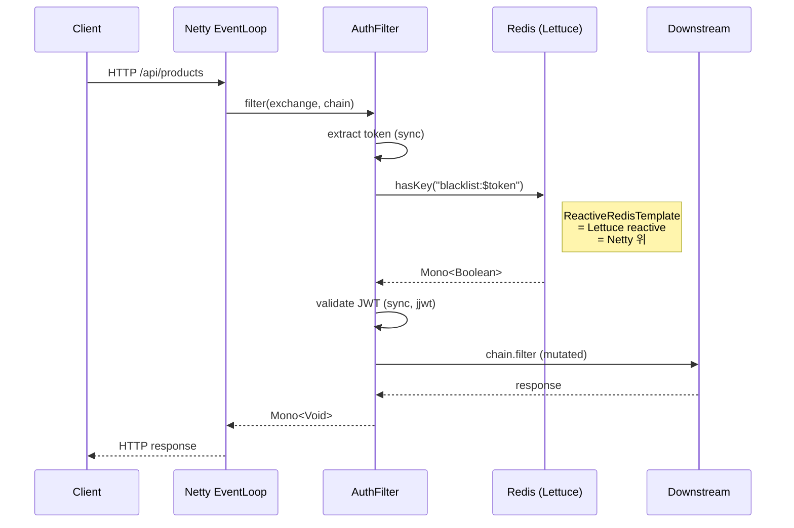
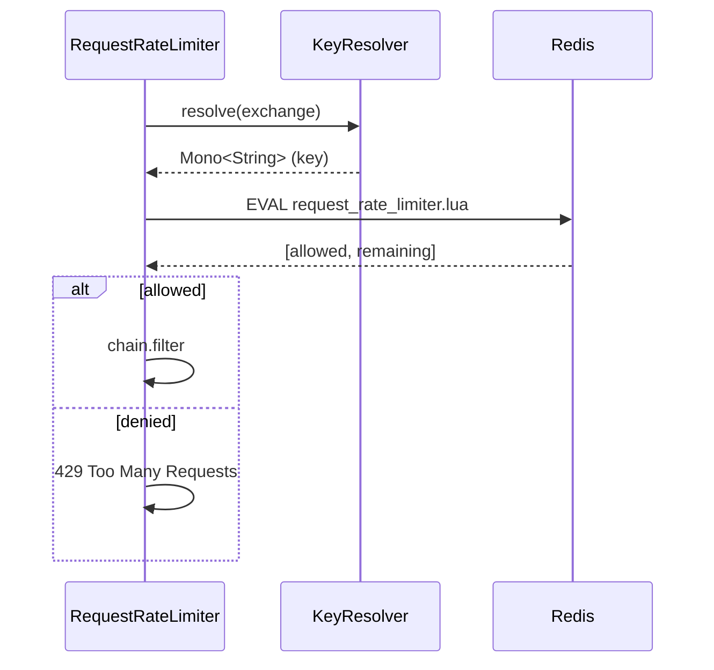

# 15. msa Gateway 의 WebFlux 사용 분석

## TL;DR

- 우리 msa 의 **Gateway** 는 Spring Cloud Gateway 기반 = WebFlux + Reactor Netty
- 의도된 단일 WebFlux 서비스 — 다른 서비스는 모두 MVC ([Gateway CLAUDE.md](../../../gateway/CLAUDE.md))
- 트래픽 입구라 *동시 connection 가장 큼* + 비즈니스 로직 없음 → WebFlux 적합
- 핵심 파일: `GatewayRouteConfig`, `AuthenticationGatewayFilter`, `RedisConfig`, `RateLimiterConfig`, `VisitorIdFilter`, `RequestLoggingFilter`
- *Mono 체인 + ReactiveRedisTemplate + KeyResolver* 가 reactive 전 구간 일관성을 만든다
- 개선 후보: 일부 fail-open 정책 (Redis 장애 시 통과) — 현재는 의도, 다만 타이밍/메트릭 보강 필요 — [18 글](18-improvements.md)

---

## 1. 큰 그림

```
                       │  HTTP/HTTPS
                       ▼
        ┌─────────────────────────────────────────┐
        │  Reactor Netty (HttpServer)              │
        │  - boss EventLoop (accept)               │
        │  - worker EventLoop (CPU * 2)            │
        └────────────────┬────────────────────────┘
                         │
                         ▼
        ┌─────────────────────────────────────────┐
        │  Spring Cloud Gateway (WebFlux)          │
        │  ┌────────────────────────────────────┐  │
        │  │  Global Filters                    │  │
        │  │   1. RequestLoggingFilter          │  │
        │  │   2. VisitorIdFilter (-10)         │  │
        │  └────────────────────────────────────┘  │
        │  ┌────────────────────────────────────┐  │
        │  │  Route-level filters               │  │
        │  │   - AuthenticationGatewayFilter    │  │
        │  │   - RequestRateLimiter (Redis)     │  │
        │  │   - StripPrefix                    │  │
        │  └────────────────────────────────────┘  │
        └────────────────┬────────────────────────┘
                         │ HTTP forward (Reactor Netty client)
                         ▼
        ┌─────────────────────────────────────────┐
        │  downstream services                     │
        │  - product:8081, order:8082, ...         │
        └─────────────────────────────────────────┘
```

---

## 2. RouteLocator — 라우팅 규칙

`gateway/src/main/kotlin/com/kgd/gateway/config/GatewayRouteConfig.kt`:

```kotlin
@Bean
fun routeLocator(builder: RouteLocatorBuilder): RouteLocator =
    builder.routes()
        .route("auth-service") { r ->
            r.path("/api/auth/**")
                .filters { f -> f.stripPrefix(0) }
                .uri("http://auth:8087")
        }
        .route("product-service") { r ->
            r.path("/api/products/**")
                .filters { f ->
                    f.filter(authFilter.apply(userConfig()))
                        .stripPrefix(0)
                }
                .uri("http://product:8081")
        }
        .route("inventory-service") { r ->
            r.path("/api/inventories/**")
                .filters { f ->
                    f.filter(authFilter.apply(sellerConfig()))
                        .requestRateLimiter { config ->
                            config.setRateLimiter(redisRateLimiter)
                            config.setKeyResolver(userKeyResolver)
                            config.setDenyEmptyKey(false)
                        }
                        .stripPrefix(0)
                }
                .uri("http://inventory:8085")
        }
        // ...
        .build()
```

**Reactive 의 흔적**:
- `RouteLocatorBuilder` 가 fluent DSL
- 모든 filter 가 `Mono` 를 반환 (어딘가에서)
- `uri("http://product:8081")` — Reactor Netty `HttpClient` 가 request 를 forward

> **K8s DNS 라우팅** — `http://product:8081` 같은 짧은 호스트네임이 K8s service DNS 로 resolve.

---

## 3. AuthenticationGatewayFilter — Mono 체인의 정수

`gateway/src/main/kotlin/com/kgd/gateway/filter/AuthenticationGatewayFilter.kt`:

```kotlin
override fun apply(config: Config): GatewayFilter = GatewayFilter { exchange, chain ->
    val request = exchange.request
    val authHeader = request.headers.getFirst(HttpHeaders.AUTHORIZATION)
    val token = jwtTokenValidator.extractFromHeader(authHeader)

    if (token == null) {
        log.warn("Missing or invalid Authorization header: {}", request.uri)
        exchange.response.statusCode = HttpStatus.UNAUTHORIZED
        return@GatewayFilter exchange.response.setComplete()
    }

    // JWT 블랙리스트 체크 (Fail-Open: Redis 장애 시 허용)
    redisTemplate.hasKey("blacklist:$token")
        .onErrorReturn(false)
        .flatMap { isBlacklisted ->
            if (isBlacklisted) {
                exchange.response.statusCode = HttpStatus.UNAUTHORIZED
                exchange.response.setComplete()
            } else {
                val claims = jwtTokenValidator.validateAndExtract(token)
                if (claims == null) {
                    exchange.response.statusCode = HttpStatus.UNAUTHORIZED
                    exchange.response.setComplete()
                } else {
                    val userId = claims.get("userId", String::class.java) ?: ""
                    @Suppress("UNCHECKED_CAST")
                    val roles = (claims.get("roles", List::class.java) as? List<*>)
                        ?.map { it.toString() } ?: emptyList()

                    if (config.requiredRoles.isNotEmpty() &&
                        !hasRequiredRole(roles, config.requiredRoles)
                    ) {
                        exchange.response.statusCode = HttpStatus.FORBIDDEN
                        return@flatMap exchange.response.setComplete()
                    }

                    val mutatedRequest = request.mutate()
                        .header("X-User-Id", userId)
                        .header("X-User-Roles", roles.joinToString(","))
                        .build()
                    chain.filter(exchange.mutate().request(mutatedRequest).build())
                }
            }
        }
}
```

### Reactive 분석

- **`redisTemplate.hasKey(...)` 가 Mono** — `ReactiveRedisTemplate` 사용 ([RedisConfig](../../../gateway/src/main/kotlin/com/kgd/gateway/config/RedisConfig.kt))
- **`.onErrorReturn(false)`** — Redis 장애 시 fail-open (false 로 통과). 의도된 정책이지만 *알람 메트릭* 필수
- **`.flatMap`** — Redis 응답을 받은 다음 체인 진행
- **mutated exchange 를 chain.filter 로 전달** — chain 도 Mono<Void>

### 흐름 분석



**중요**: 이 모든 흐름이 **하나의 EventLoop thread** 에서 도는 게 아니다. Redis 응답이 다른 worker thread 로 올 수 있고, `flatMap` 의 결과는 그 thread 에서 이어짐.

---

## 4. ReactiveRedisTemplate

`gateway/src/main/kotlin/com/kgd/gateway/config/RedisConfig.kt`:

```kotlin
@Bean
fun reactiveRedisTemplate(
    factory: ReactiveRedisConnectionFactory
): ReactiveRedisTemplate<String, Any> {
    val serializer = GenericJacksonJsonRedisSerializer(objectMapper)
    val context = RedisSerializationContext
        .newSerializationContext<String, Any>(StringRedisSerializer())
        .value(serializer)
        .build()
    return ReactiveRedisTemplate(factory, context)
}
```

내부 동작:
- **ReactiveRedisConnectionFactory** = LettuceReactiveRedisConnectionFactory (자동)
- Lettuce 는 Netty 기반 single-thread RESP encoder/decoder
- 호출 → Mono / Flux 리턴
- 응답 도착 시점에 reactive 체인 resume

**왜 reactive Redis 가 필요한가?**
- 일반 RedisTemplate (sync) 을 호출하면 *EventLoop 가 block* → 다른 connection 멈춤
- WebFlux 는 *전 구간 reactive* 가 강점인데 Redis 만 sync 면 낭비
- 우리 gateway 는 *모든 IO 를 reactive* 로 통일 → 진짜 비동기 가치

> 다른 서비스 (MVC) 는 **일반 `RedisTemplate` (Lettuce sync API)** 사용 — `common/CommonRedisAutoConfiguration` 참고. Lettuce 가 내부적으로 Netty 인 건 같지만, MVC 환경에선 sync API 가 더 자연스러움.

---

## 5. KeyResolver — Mono 의 또 다른 모습

`RateLimiterConfig.kt`:

```kotlin
@Bean
@Primary
fun userKeyResolver(): KeyResolver = KeyResolver { exchange ->
    Mono.just(
        exchange.request.headers.getFirst("X-User-Id")
            ?: exchange.request.remoteAddress?.address?.hostAddress
            ?: "unknown"
    )
}
```

`KeyResolver` interface 가 *`Mono<String>` 을 반환*. 다른 서비스에서 호출 결과를 키로 쓰고 싶으면:

```kotlin
@Bean
fun customKeyResolver(memberClient: WebClient): KeyResolver = KeyResolver { exchange ->
    val userId = exchange.request.headers.getFirst("X-User-Id") ?: return@KeyResolver Mono.just("anon")
    memberClient.get().uri("/api/members/$userId/tier")
        .retrieve()
        .bodyToMono(String::class.java)
        .map { tier -> "$userId:$tier" }
}
```

이런 형태도 자연스럽게 Mono 체인. 실제론 sync 키만 필요해서 `Mono.just(...)` 로 단순.

---

## 6. RedisRateLimiter — token bucket on Lua

```kotlin
@Bean
fun redisRateLimiter(): RedisRateLimiter =
    RedisRateLimiter(100, 200, 1)  // replenishRate, burstCapacity, requestedTokens
```

내부 동작:
- Spring Cloud Gateway 가 **Lua script (request_rate_limiter.lua)** 를 Redis 에 EVAL
- 결과 = 허용/거부 + 남은 토큰 수
- 호출은 ReactiveRedisTemplate → Mono



reactive 가 자연스럽게 들어맞는 구조.

---

## 7. VisitorIdFilter — Global Filter

```kotlin
@Component
class VisitorIdFilter : GlobalFilter, Ordered {
    override fun getOrder(): Int = -10  // Auth filter 보다 먼저

    override fun filter(exchange: ServerWebExchange, chain: GatewayFilterChain): Mono<Void> {
        val existingCookie = exchange.request.cookies[VISITOR_COOKIE]?.firstOrNull()?.value
        val visitorId = existingCookie ?: UUID.randomUUID().toString()

        val mutatedRequest = exchange.request.mutate()
            .header(VISITOR_HEADER, visitorId)
            .build()

        val mutatedExchange = exchange.mutate().request(mutatedRequest).build()

        if (existingCookie == null) {
            mutatedExchange.response.addCookie(
                ResponseCookie.from(VISITOR_COOKIE, visitorId)
                    .path("/")
                    .maxAge(Duration.ofDays(365))
                    .httpOnly(true)
                    .build()
            )
        }

        return chain.filter(mutatedExchange)
    }
}
```

분석:
- `GlobalFilter` 는 모든 라우트에 적용
- `Ordered.HIGHEST_PRECEDENCE` 비슷한 -10 으로 *Auth 보다 먼저* 실행
- IO 없음 — 순수 sync 계산. 그래도 `Mono<Void>` 시그니처 유지
- `chain.filter(mutatedExchange)` 가 다음 필터로 위임

이건 *reactive 가 필수가 아닌 동기 작업도* WebFlux 시그니처 (Mono) 로 강제됨을 보여주는 예. WebFlux 의 *모든 코드는 reactive 시그니처* 라는 일관성을 위한 비용.

---

## 8. RequestLoggingFilter — doFinally 패턴

```kotlin
override fun filter(exchange: ServerWebExchange, chain: GatewayFilterChain): Mono<Void> {
    val start = Instant.now()
    val request = exchange.request
    val method = request.method
    val uri = request.uri

    return chain.filter(exchange).doFinally {
        val duration = Duration.between(start, Instant.now()).toMillis()
        val statusCode = exchange.response.statusCode?.value() ?: 0
        log.info("[$method] $uri → $statusCode (${duration}ms)")
    }
}
```

`.doFinally` = 성공/실패/취소 어느 경우든 실행되는 side effect. AOP-like before/after 패턴이 reactive 에선 이렇게 표현됨.

> *주의*: `.doFinally` 는 *체인의 어느 thread 에서 실행될지 보장 안 함*. ThreadLocal MDC 같은 건 깨질 수 있음. Reactor Context 사용 권장.

---

## 9. 의도된 Trade-off — fail-open

```kotlin
redisTemplate.hasKey("blacklist:$token")
    .onErrorReturn(false)  // Redis 장애 시 통과 (fail-open)
```

이 정책:
- **장점**: Redis 장애가 *전체 trafic 차단* 으로 번지지 않음
- **위험**: blacklist 가 없는 동안 *revoked token* 도 통과
- 정책 결정 — 가용성 > revocation 즉시성

추가 보강 권장 (TG: [18 글](18-improvements.md)):
- `onErrorReturn(false)` 시 *메트릭 카운터* 증가 (`redis.blacklist.error`)
- 알람: 1분 내 100 회 이상 → on-call
- token 만료 시간을 짧게 유지 (예: access token 5분) — fail-open 영향 시간 제한

---

## 10. EventLoop 부하 패턴

Gateway 의 EventLoop 가 받는 부하:

```
EventLoop 한 개의 한 sec 내 처리:
 - HTTP request parse (단발)
 - Auth filter (Mono, Redis IO 포함)
 - Rate limiter (Mono, Redis IO 포함)
 - Forward to downstream (Reactor Netty client)
 - 응답 받기, response 보내기
```

worker EventLoop = CPU * 2 (default). 8 core 컨테이너면 16 EventLoop. 각각 *수천 connection* 동시 처리 가능 — 메모리만 충분하면.

### Tuning 포인트

| 설정 | 의미 | default |
|---|---|---|
| `reactor.netty.ioWorkerCount` | worker thread 수 | CPU * 2 |
| `reactor.netty.pool.maxConnections` | 다운스트림 connection pool | CPU * 2 (per host) |
| `spring.cloud.gateway.httpclient.connect-timeout` | 다운스트림 connect timeout | 미설정 |
| `spring.cloud.gateway.httpclient.response-timeout` | 다운스트림 response timeout | 미설정 |

> **현재 application.yml 에 다운스트림 timeout 미설정** — 다운스트림이 hang 하면 Gateway connection 도 쌓이는 위험. ADR 후보로 timeout + circuit breaker 통합 검토. [18 글](18-improvements.md).

---

## 11. WebFlux 가 *없었다면* 어땠을까

가정: Gateway 를 MVC + Tomcat + 일반 RestTemplate 으로 짰다면.

- **Thread pool 200** — 1만 동접 시 9800 큐잉
- **Redis 호출이 sync** → JDBC 처럼 thread 점유
- **다운스트림 호출도 sync** → connection 잡고 대기
- 결과: latency 분포가 *load 시 극도로 안 좋음*

VT 도입 시: 아마 큰 차이 없이 동작. 단, `Mono.zip` 같은 fan-out 표현력 잃음. *Gateway 는 fan-out 호출이 거의 없으므로* VT 도 충분.

> 실은 *Gateway 에 한해서는 WebFlux 의 진짜 가치*가 SSE/큰 streaming 이 아닌 **EventLoop = thread 수 적게 + 다운스트림 호출과 자연스럽게 reactive 연결** 이 핵심.

---

## 12. 면접 답변 템플릿

**Q. 우리 회사는 Gateway 만 WebFlux 를 쓰는데, 왜 그런 설계를 한 거 같으세요?**

> "두 가지 이유라 봅니다.
> 1. **Gateway 는 트래픽 입구라 동시 connection 이 가장 큼** — Tomcat thread pool 의 한계가 가장 빠르게 노출되는 곳.
> 2. **비즈니스 로직이 없음** — 라우팅, 인증, 레이트리밋, 로깅. 모두 IO bound 작업이라 reactive 의 EventLoop 모델이 자연스러움.
>
> 반대로 다른 서비스 (product, order 등) 는:
> - JDBC + JPA 가 R2DBC 보다 성숙
> - Kafka client 가 sync poll
> - 비즈니스 로직 디버깅 / 트랜잭션 / 동시성 처리가 *imperative 가 더 단순*
>
> 그래서 *입구는 WebFlux, 나머지는 MVC* 라는 분할이 실용적입니다. JDK 21 의 Virtual Threads 가 정착하면 *Gateway 도 VT 로 단순화* 가능성이 있긴 합니다 — `Mono.zip` 같은 fan-out 이 거의 없는 우리 패턴이라면."

---

## 13. 핵심 포인트

- Gateway = Spring Cloud Gateway = WebFlux + Reactor Netty (단일 WebFlux 서비스)
- AuthenticationGatewayFilter = Mono 체인 + ReactiveRedisTemplate
- KeyResolver / RateLimiter / Filter 모두 Mono 시그니처로 일관성 유지
- fail-open 정책 (Redis 장애 시 통과) — 의도, 메트릭/알람 보강 필요
- Tuning: ioWorkerCount, downstream timeout, connection pool

## 다음 학습

- [16-lettuce-kafka-nio.md](16-lettuce-kafka-nio.md) — Lettuce 와 Kafka client 의 NIO 사용
