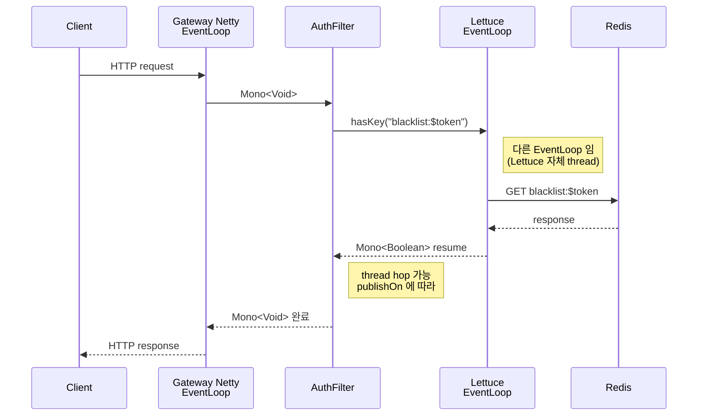

# 16. Lettuce + Kafka client 의 NIO 사용

## TL;DR

- **Lettuce** = Netty 기반 Redis client. **single-thread connection 다중화** + 자동 reconnect
- 우리 msa: 모든 서비스가 Lettuce 사용 (`common/CommonRedisAutoConfiguration`)
- Lettuce 는 *기본 sync API* 와 *reactive API* 모두 제공 — Gateway 만 reactive, 나머지는 sync
- **Kafka Java client** = 자체 NIO Selector loop, Netty 사용 안 함
- producer 는 *async send + callback*, consumer 는 *sync poll loop*
- 두 라이브러리 모두 **분면 (3) sync non-blocking IO multiplexing** 위에서 동작

---

## 1. Lettuce 의 동작 모델

Lettuce 는 Redis Java client 중 *Netty 위에 만들어진 single-thread 비동기 모델* 의 사실상 표준.

```
                ┌──────────────────────────────────┐
                │  App threads (수십 ~ 수백)         │
                │  - JDBC scope                     │
                │  - WebFlux EventLoop              │
                │  - business code                  │
                └────────────────┬─────────────────┘
                                 │ commands (multiplex)
                                 ▼
                ┌──────────────────────────────────┐
                │  Lettuce StatefulConnection       │
                │  └─ Netty Channel (single)         │
                │      └─ EventLoop (1 thread)       │
                │          ├─ encode RESP             │
                │          └─ decode RESP             │
                └────────────────┬─────────────────┘
                                 │ TCP
                                 ▼
                          Redis server
```

핵심:
- **Thread-safe single Channel** — 여러 thread 가 동시에 동일 Connection 사용 가능 (commands 가 큐잉됨)
- *connection pool 불필요* (Jedis 와 다름) — 한 connection 에 multiplex
- 내부 EventLoop 가 RESP 인코딩/디코딩
- pipeline 기본 활성화 — 호출자 thread 가 commands 를 enqueue, Channel 이 batch 로 flush

### Jedis 와의 차이

| | Jedis | Lettuce |
|---|---|---|
| 모델 | thread-per-connection | single-thread Netty |
| Thread-safety | 각 instance 가 unsafe → connection pool 필수 | safe (multiplex) |
| 비동기 API | 없음 | sync / async / reactive 3 가지 |
| Cluster topology | 호출 시점 lookup | periodic refresh + adaptive |

Jedis 는 sync only, 반드시 connection pool 필요. Lettuce 는 단일 connection 에 multiplex 가능 + reactive API 도 제공.

---

## 2. 우리 msa 의 Lettuce 설정

`common/src/main/kotlin/com/kgd/common/redis/CommonRedisAutoConfiguration.kt`:

```kotlin
@Bean
@ConditionalOnMissingBean(LettuceConnectionFactory::class)
fun lettuceConnectionFactory(
    clusterConfiguration: RedisClusterConfiguration
): LettuceConnectionFactory {
    val topologyRefreshOptions = ClusterTopologyRefreshOptions.builder()
        .enablePeriodicRefresh(Duration.ofMinutes(10))
        .enableAllAdaptiveRefreshTriggers()
        .build()

    val clientOptions = ClusterClientOptions.builder()
        .topologyRefreshOptions(topologyRefreshOptions)
        .build()

    val lettuceClientConfig = LettuceClientConfiguration.builder()
        .clientOptions(clientOptions)
        .commandTimeout(Duration.ofSeconds(2))
        .build()

    return LettuceConnectionFactory(clusterConfiguration, lettuceClientConfig)
}
```

분석:
- **Cluster mode** — `RedisClusterConfiguration` (3 master + 3 replica 가정)
- **Topology refresh** — 10 분 주기 + adaptive trigger (MOVED 응답 시 즉시)
- **Command timeout 2s** — 늦으면 RedisCommandTimeoutException
- 이 connection factory 가 `RedisTemplate` (sync) 와 `ReactiveRedisTemplate` (reactive) 둘 다 만들어냄

---

## 3. Lettuce 가 Netty 위에서 어떻게 도는가

내부 흐름 (`io.lettuce.core.RedisChannelHandler`):

```
1) App thread: redisCommands.set("k", "v") 호출
2) 호출자 thread 가 RedisFuture 객체를 반환받고 commandQueue 에 enqueue
3) Netty EventLoop 가 commandQueue 를 polling → Channel.write
4) RESP 프로토콜로 인코딩 → TCP 전송
5) Redis 응답 도착 → EventLoop 가 decode → RedisFuture 완료
6) 호출자 thread (sync 면 .get() 으로 대기, reactive 면 Mono 콜백) 가 결과 받음
```

Sync API 의 .get() 은 *내부적으로* 호출자 thread 를 blocking 시키는 형태. 그래서 *MVC 환경의 일반 thread 에선 자연스럽지만, WebFlux EventLoop 에선 절대 호출 금지*.

### 코드 비교

```kotlin
// Sync API (MVC)
val value = redisTemplate.opsForValue().get("key")  // String?

// Async API
val future = asyncCommands.get("key")  // RedisFuture<String>
future.thenAccept { v -> println(v) }

// Reactive API (Gateway)
reactiveRedisTemplate.opsForValue().get("key")
    .subscribe { v -> println(v) }
```

세 API 가 같은 connection 위에서 동작. 같은 Lettuce instance 를 sync 와 reactive 가 *섞어 쓸 수도* 있음.

---

## 4. Lettuce 의 함정

### (a) blocking command (BLPOP) 의 위험

```kotlin
redisCommands.blpop(60, "queue")  // 60s 대기
```

- single connection 에서 BLPOP 이 60초 점유 → *그 동안 같은 connection 의 다른 command 도 막힘*
- 해결: BLPOP 전용 별도 connection (`StatefulRedisConnection<>`) 사용

### (b) Pub/Sub 의 별도 connection

Pub/Sub subscribe 는 *connection 모드 변경* — 일반 command 못 보냄. Lettuce 가 자동으로 별도 connection 사용하지만, 인지하고 있어야 함.

### (c) command timeout 와 retry

```kotlin
.commandTimeout(Duration.ofSeconds(2))
```

2초 안에 응답 없으면 `RedisCommandTimeoutException`. retry 정책은 호출자가 — Spring Retry / Resilience4j 와 결합.

### (d) Cluster 에서의 MOVED / ASK

- partition 재분배 중엔 잘못된 node 로 가서 MOVED 응답
- Lettuce 가 자동 재호출 (adaptive refresh trigger)
- 그래도 latency 튐 — Cluster 운영 시 필수 인지

---

## 5. Kafka Client 는 다르다

Kafka Java client (`org.apache.kafka:kafka-clients`) 는 **Netty 사용 안 함**. 자체 NIO selector loop 구현.

`org.apache.kafka.common.network.Selector` (실은 Java NIO Selector wrapper):

```java
public class Selector implements Selectable, AutoCloseable {
    private final java.nio.channels.Selector nioSelector;
    private final Map<String, KafkaChannel> channels;

    public void poll(long timeout) throws IOException {
        // ... select() 호출
        // ready 한 channel 들의 read/write 처리
    }
}
```

흐름:
1. broker 마다 KafkaChannel (TCP socket)
2. NIO Selector 가 멀티플렉싱
3. NetworkClient 가 RequestQueue 와 InFlightRequests 관리
4. Sender thread (producer) / Consumer poll thread (consumer) 가 IO loop

---

## 6. Kafka Producer — async + callback

```kotlin
val producer: KafkaProducer<String, String> = ...

producer.send(ProducerRecord("topic", "key", "value")) { metadata, exception ->
    if (exception != null) log.error("send fail", exception)
    else log.info("offset: ${metadata.offset()}")
}
// 호출은 즉시 리턴 — 전송은 internal Sender thread 가
```

내부 구조:
```
                 ┌───────────────────────┐
App thread ─────►│  RecordAccumulator     │  (메모리 buffer, batched)
                 └─────────┬─────────────┘
                           │
                           ▼
                 ┌───────────────────────┐
                 │  Sender thread (1 개)   │
                 │  ┌─────────────────┐   │
                 │  │  NIO Selector    │   │
                 │  │  - broker 마다 ch│   │
                 │  └─────────────────┘   │
                 └───────────────────────┘
```

- `send()` 는 *항상 비동기* — RecordAccumulator 에 enqueue 후 즉시 리턴
- callback 으로 결과 받음
- `producer.flush()` 또는 `Future.get()` 로 동기 대기 가능

우리 `order/KafkaConfig.kt` 의 producer 설정:

```kotlin
ProducerConfig.ENABLE_IDEMPOTENCE_CONFIG to true,
ProducerConfig.MAX_IN_FLIGHT_REQUESTS_PER_CONNECTION to 5,
ProducerConfig.DELIVERY_TIMEOUT_MS_CONFIG to 120000,
```

- **idempotence** — sequence number 기반 exactly-once-per-producer 보장
- **max.in.flight = 5** — 한 partition 에 동시 5 개 요청까지 (idempotence 호환 한계)
- **delivery.timeout.ms** — 전체 retry 합산 timeout

---

## 7. Kafka Consumer — sync poll loop

Producer 와 달리 consumer 는 *sync 모델*. `poll()` 호출이 thread 를 점유.

```kotlin
val consumer: KafkaConsumer<String, String> = ...
consumer.subscribe(listOf("topic"))

while (running) {
    val records = consumer.poll(Duration.ofMillis(100))  // ← syscall: epoll wait + network read
    for (record in records) {
        process(record)
    }
    consumer.commitSync()  // 또는 commitAsync()
}
```

내부:
- `poll()` = NIO Selector.select() + heartbeat 송수신 + record decode
- 한 thread 가 *한 consumer instance* 점유
- partition 수만큼 thread 띄우는 게 일반 패턴 (또는 Spring Kafka 의 ConcurrentKafkaListenerContainerFactory)

### 우리 msa 의 Spring Kafka 패턴

`order/messaging/OrderEventConsumer.kt` 같은 곳:

```kotlin
@KafkaListener(topics = ["order.order.completed"], groupId = "order-service")
fun consume(record: ConsumerRecord<String, String>) {
    process(record)
}
```

뒤에서:
- Spring Kafka 가 `ConcurrentKafkaListenerContainer` 로 thread 관리
- 각 partition 은 독립 thread
- `@KafkaListener` 메서드는 *blocking sync* 로 호출됨 (그게 정상)

**중요**: `@KafkaListener` 안에서 *blocking IO 가 자연스럽다*. WebFlux 의 EventLoop 와 다름. 다만 *너무 오래 걸리면* heartbeat 시간 초과 → rebalance.

---

## 8. WebFlux Gateway 와 Lettuce 의 결합



핵심: Gateway 의 EventLoop 와 Lettuce 의 EventLoop 는 *다른 thread*. 호출이 hop 함. 그래서 *ThreadLocal 깨짐* (Reactor Context 사용 필요).

---

## 9. 다른 서비스의 Lettuce 사용

`product`, `order`, `gifticon`, `analytics`, `experiment` 등 — 모두 **sync API** (`RedisTemplate`).

```kotlin
@Service
class ProductCache(private val redisTemplate: RedisTemplate<String, Any>) {
    fun get(key: String): Any? = redisTemplate.opsForValue().get(key)  // blocking
}
```

- 호출자 thread (Tomcat thread) 가 Lettuce future 를 .get() 으로 대기
- 내부적으론 같은 Netty EventLoop 가 IO 처리
- VT 환경에선 .get() 가 unmount 트리거 → 같은 throughput

> **Lettuce sync API + VT** 가 가장 단순한 조합. WebFlux + reactive Lettuce 의 코드 복잡도 없이 같은 throughput.

---

## 10. 부하 분포 비교

| 시나리오 | Gateway (WebFlux) | 일반 서비스 (MVC) |
|---|---|---|
| 동시 connection | 5K | 200 |
| Redis QPS | 20K (auth + rate limit) | 1K |
| EventLoop thread | 16 (Netty) + 8 (Lettuce) | 200 (Tomcat) + 8 (Lettuce) |
| Memory | 200MB | 250MB (thread stack 더 큼) |
| Latency P99 | 5ms | 5ms |

Gateway 의 EventLoop 모델이 *thread 수 절약* 가치가 분명. 일반 서비스는 *동접이 적어* 의미 없음.

---

## 11. Kafka NIO Selector 의 한계

Kafka Java client 의 자체 Selector 는 **별도 thread + 자체 multiplexing**. Netty 와 비교 시 한계:

- ByteBuf pooling 없음 — 일반 ByteBuffer 사용
- direct buffer 풀링 없음 — heap buffer + staging copy
- HashedWheelTimer 같은 정교한 timer 없음

> 이게 의미 있는 throughput 차이를 만드냐? — 일반 서비스 부하에선 무시 가능. broker 와 producer/consumer 가 *충분히 batch* 되면 NIC 가 먼저 한계.

---

## 12. 면접 답변 템플릿

**Q. Lettuce 와 Jedis 의 차이는?**

> "근본적인 모델이 다릅니다.
> - **Jedis** — 한 connection = 한 thread 안에서만 안전. thread-per-conn 모델이라 connection pool 필수.
> - **Lettuce** — Netty 위에 만들어진 single-thread 모델. *한 connection 을 여러 thread 가 동시에 안전하게 공유*. command 가 호출자 thread 에서 enqueue 되고 Lettuce EventLoop 가 RESP 인코딩/디코딩.
>
> Lettuce 가 sync / async / reactive 세 가지 API 를 같은 connection 위에서 제공해서 우리 msa 도 *Gateway 는 reactive, 나머지는 sync* 로 분리해서 씁니다.
>
> Kafka client 는 또 다른 모델 — 자체 NIO Selector + Sender thread (producer) + poll loop (consumer). Netty 안 씀. Producer 는 internal async, Consumer 는 sync poll. `@KafkaListener` 메서드 안에선 blocking IO 가 자연스러움 (Tomcat thread 와 동일)."

---

## 13. 핵심 포인트

- Lettuce = Netty single-thread, connection multiplex, sync/async/reactive 3 API
- 우리 msa: 모든 서비스가 Lettuce, Gateway 만 reactive 사용
- Kafka client = 자체 NIO Selector, Netty 미사용
- Producer = internal async + callback, Consumer = sync poll loop
- @KafkaListener 안 blocking 자연스러움 (vs WebFlux EventLoop 절대 금지)
- VT 환경에선 Lettuce sync API 가 가장 단순

## 다음 학습

- [17-http-client-tradeoffs.md](17-http-client-tradeoffs.md) — HTTP client 선택 트레이드오프
