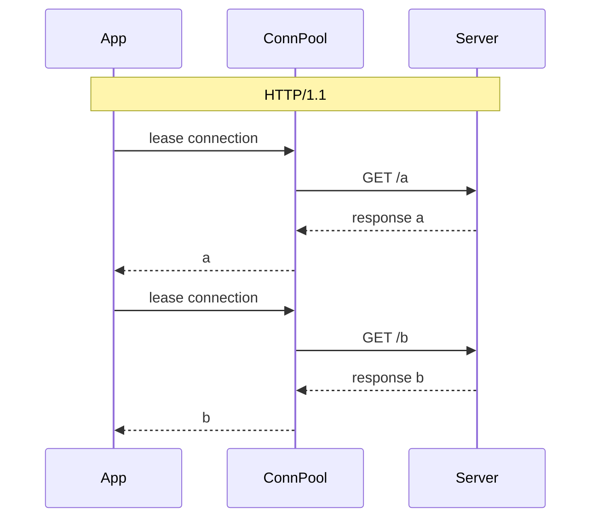
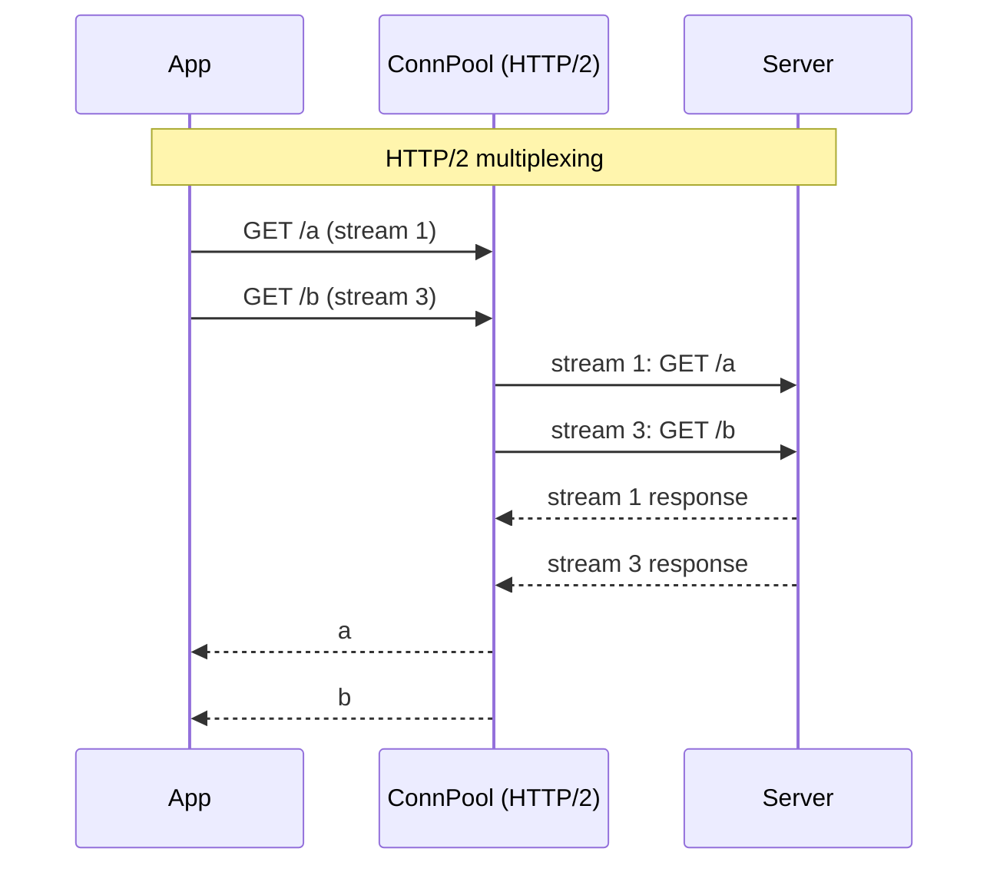

# 17. HTTP client 선택 트레이드오프

## TL;DR

- **WebClient** (Reactor Netty) — non-blocking, Mono/Flux 시그니처, fan-out 자연스러움
- **RestClient** (Spring 6.1+) — sync, fluent API, JdkHttpClient 또는 Apache 백엔드
- **RestTemplate** — sync, deprecated 아니지만 *유지 모드*. 신규 코드엔 비권장
- **OkHttp** — Square 의 sync/async client, HTTP/2 지원, interceptor 강력
- 우리 msa 현황: **WebClient + awaitSingle (suspend 다리)** 가 가장 흔함, 일부 RestClient (chatbot, quant)
- **VT 환경** 에선 RestClient + sync 가 *코드 단순 + 같은 throughput*

---

## 1. 4 가지 client 비교 표

| 항목 | WebClient | RestClient | RestTemplate | OkHttp |
|---|---|---|---|---|
| 등장 | Spring 5 (2017) | Spring 6.1 (2023) | Spring 3 (2010) | Square 2013 |
| 모델 | Reactor Netty (non-blocking) | sync (fluent) | sync | sync + async |
| 시그니처 | `Mono<T>`, `Flux<T>` | `T` 직접 | `T` 직접 | `Call`, `enqueue` |
| Spring 통합 | 1급 (WebFlux 기본) | 1급 (RestTemplate 후속) | 1급 (legacy) | 별도 |
| HTTP/2 | ✓ (Reactor Netty) | ✓ (JdkHttpClient) | △ (config 필요) | ✓ |
| Reactive | ✓ | ✗ | ✗ | ✗ (콜백만) |
| Coroutine 친화 | `awaitSingle()` | `runInterruptible` | 동일 | 별도 wrapper |
| 학습 곡선 | 가파름 | 평이 | 평이 | 평이 |

---

## 2. WebClient — Reactor 시그니처

```kotlin
val webClient = WebClient.builder()
    .baseUrl("http://product:8081")
    .build()

// Reactor 스타일
val product: Mono<Product> = webClient.get()
    .uri("/api/products/{id}", id)
    .retrieve()
    .bodyToMono(Product::class.java)

// suspend 스타일 (kotlinx-coroutines-reactor)
suspend fun fetch(id: Long): Product = webClient.get()
    .uri("/api/products/{id}", id)
    .retrieve()
    .bodyToMono(Product::class.java)
    .awaitSingle()
```

내부:
- Reactor Netty `HttpClient` 사용
- non-blocking — 호출 thread 안 막힘
- connection pool: per-host max = `2 * CPU` default

### 우리 msa 의 WebClient 사용

`order/app/src/main/kotlin/com/kgd/order/client/ProductAdapter.kt`:

```kotlin
@Component
class ProductAdapter(
    @Qualifier("productWebClient") private val webClient: WebClient,
    private val circuitBreakerRegistry: CircuitBreakerRegistry,
) : ProductPort {

    override suspend fun validateProduct(productId: Long): ProductInfo {
        return circuitBreaker.executeSuspendFunction {
            val response = webClient.get()
                .uri("/api/products/{id}", productId)
                .retrieve()
                .bodyToMono(ProductApiResponse::class.java)
                .awaitSingle()
            // ...
        }
    }
}
```

분석:
- 도메인 layer 는 `suspend` 인터페이스 (`ProductPort.validateProduct`)
- 어댑터에서 `WebClient` (Reactor) → `awaitSingle()` 로 다리
- Resilience4j CircuitBreaker 와 결합

> **MVC 환경 (Tomcat) 에서 WebClient 사용**도 흔함. 이유:
> 1. Reactor 시그니처가 fan-out 표현력 좋음
> 2. Spring 6 전엔 RestClient 가 없어서 WebClient 가 modern API 의 사실상 default
> 3. coroutine 다리 (`awaitSingle`) 가 자연스러움
> 단점: 내부적으로 EventLoop thread 를 사용하므로 *Tomcat thread 가 .awaitSingle() 에서 대기*. VT 환경이면 unmount 됨.

### Common 모듈의 WebClient builder

`common/src/main/kotlin/com/kgd/common/webclient/CommonWebClientAutoConfiguration.kt`:

```kotlin
@AutoConfiguration(...)
@ConditionalOnProperty(prefix = "kgd.common.web-client", name = ["enabled"], havingValue = "true")
class CommonWebClientAutoConfiguration {

    @Bean
    fun commonWebClientCustomizer(): WebClientCustomizer =
        WebClientCustomizer { builder ->
            builder.codecs { configurer ->
                configurer.defaultCodecs().maxInMemorySize(2 * 1024 * 1024)
            }
        }
}
```

- max in-memory 2MB — Spring default 256KB 의 8배
- `WebClientBuilderFactory.create(baseUrl)` 로 service-specific client 생성

---

## 3. RestClient — Spring 6.1+ 의 신규 sync client

```kotlin
val restClient = RestClient.builder()
    .baseUrl("http://product:8081")
    .build()

val product: Product = restClient.get()
    .uri("/api/products/{id}", id)
    .retrieve()
    .body(Product::class.java)!!
```

특징:
- WebClient 와 *fluent API 가 거의 동일* (마이그레이션 쉬움)
- 그러나 *sync* — `Mono` 안 거치고 직접 `T` 반환
- 백엔드: JdkHttpClient (default), Apache HttpClient5, OkHttp 옵션
- HTTP/2 지원 (JdkHttpClient)

### 사용처

- VT 환경에서 자연스러운 sync 호출
- WebFlux 안 쓰는 MVC 서비스에서 modern API 가 필요할 때

우리 msa 의 `chatbot` 과 `quant` 이 RestClient 사용:

`chatbot/app/src/main/kotlin/com/kgd/chatbot/infrastructure/ai/ClaudeApiAdapter.kt` 가 예. 이유는 *MVC 환경 + WebClient 의 reactive 시그니처가 불필요* 이기 때문일 가능성.

---

## 4. RestTemplate — legacy

```kotlin
val rt = RestTemplate()
val product: Product = rt.getForObject("http://product:8081/api/products/$id", Product::class.java)!!
```

- sync, blocking
- API 가 *non-fluent* — uri / params / headers 다 별 인자
- HTTP/2 지원이 어색
- Spring 자체가 *유지 모드* 명시 — 신규 코드엔 RestClient 권장

> Deprecated 아니지만 deprecated 분위기. 기존 코드는 유지, 신규는 RestClient.

---

## 5. OkHttp — Square 의 client

```kotlin
val client = OkHttpClient.Builder()
    .connectTimeout(5, TimeUnit.SECONDS)
    .readTimeout(10, TimeUnit.SECONDS)
    .build()

// sync
val request = Request.Builder().url("http://api/x").build()
val response = client.newCall(request).execute()  // blocking

// async
client.newCall(request).enqueue(object : Callback {
    override fun onResponse(call: Call, response: Response) { ... }
    override fun onFailure(call: Call, e: IOException) { ... }
})
```

특징:
- HTTP/2 first-class (HttpClient 보다 일찍부터)
- **Interceptor 체인** 이 매우 강력 — auth, logging, retry, caching 모두 interceptor 로 합성
- Connection pool 자동
- WebSocket 지원
- Android 진영 표준 → server-side 도 충분히 production-ready

### 사용처

- 외부 SDK (Slack, OAuth provider 등) 가 OkHttp 를 의존성으로 가져옴 → 그대로 사용
- 정밀한 interceptor 가 필요할 때
- HTTP/2 stream 이 필요할 때 (gRPC (gRPC Remote Procedure Call) 빼고는 드뭄)

> 우리 msa 에선 *OkHttp 를 직접 사용하는 곳은 없음* (테스트 fixture 정도). Slack/Claude SDK 가 내부적으로 사용할 가능성.

---

## 6. 의사결정 매트릭스

| 시나리오 | 권장 |
|---|---|
| WebFlux 안 (Gateway) | **WebClient** (필수) |
| MVC + Coroutine + fan-out 호출 많음 | **WebClient + awaitSingle** |
| MVC + 단순 단발 호출 + Spring 6.1+ | **RestClient** |
| MVC + VT 활성화 | **RestClient** (가장 단순) |
| 외부 SDK 의 호환 의존성 | **OkHttp** (이미 들어와 있음) |
| Legacy 코드 | **RestTemplate 유지** (재작성 가치 낮음) |

---

## 7. 우리 msa 현황 점검

| 서비스 | client | 적합성 평가 |
|---|---|---|
| gateway | (downstream forward 는 Reactor Netty 자체) | ✓ |
| order | WebClient + awaitSingle | ✓ (Coroutine 사용 중) |
| auth | WebClient | △ (sync 라면 RestClient 도 OK) |
| chatbot | RestClient | ✓ |
| search/batch | WebClient | △ (sync 면 RestClient) |
| quant | RestClient | ✓ |
| experiment | WebClient | △ |

> 정리: WebClient + awaitSingle 패턴이 가장 흔하지만, **VT 활성화 후엔 RestClient 가 더 단순**. ADR 검토 후 점진적 전환 후보 — [18 글](18-improvements.md).

---

## 8. WebClient vs RestClient 코드 비교

같은 일을 양쪽으로:

```kotlin
// WebClient + suspend
suspend fun fetchProduct(id: Long): Product =
    webClient.get()
        .uri("/api/products/$id")
        .retrieve()
        .bodyToMono(Product::class.java)
        .awaitSingle()

// RestClient
fun fetchProduct(id: Long): Product =
    restClient.get()
        .uri("/api/products/$id")
        .retrieve()
        .body(Product::class.java)!!
```

차이:
- WebClient 는 `suspend` 또는 `Mono` 시그니처
- RestClient 는 *그냥 sync 함수*
- 가독성 / 디버깅 / 학습비용 → RestClient 가 더 단순
- fan-out / streaming → WebClient 가 더 강력

### Fan-out 비교

```kotlin
// WebClient — 자연스러움
suspend fun aggregate(): Result {
    coroutineScope {
        val a = async { fetchA() }
        val b = async { fetchB() }
        Result(a.await(), b.await())
    }
}

// RestClient + Java 21 Structured Concurrency
fun aggregate(): Result {
    return StructuredTaskScope.ShutdownOnFailure().use { scope ->
        val a = scope.fork { restClient.get()... }
        val b = scope.fork { restClient.get()... }
        scope.join().throwIfFailed()
        Result(a.get(), b.get())
    }
}
```

Java 21 의 StructuredTaskScope 가 Coroutine `coroutineScope` 와 동등한 표현력. *VT + RestClient + StructuredTaskScope = WebClient 의 표현력 + 더 단순*.

---

## 9. Connection Pool 트레이드오프

각 client 의 default pool:

| Client | Default per-host max |
|---|---|
| WebClient (Reactor Netty) | 2 * CPU (보통 16) |
| RestClient (JdkHttpClient) | unbounded (HTTP/2 multiplex 활용) |
| RestClient (Apache 5) | 5 |
| OkHttp | 5 idle, max 64 |
| RestTemplate (default) | unbounded JDK URLConnection |

**과도한 connection 도 안 좋고 부족한 connection 도 안 좋음.**
- 부족: pool exhaustion → request 큐잉 → P99 폭증
- 과다: 다운스트림 부하 → 다운스트림 의 P99 폭증

권장: 다운스트림 capacity 와 매칭. 모니터링 필수 (`reactor.netty.connection.pool.max-idle-time` 등).

---

## 10. Timeout 정책

각 client 에 *세 가지 timeout* 이 있음:

1. **Connect timeout** — TCP 연결 자체
2. **Read / Response timeout** — 요청 후 응답 대기
3. **Total / Idle timeout** — 한 connection 이 idle 한도

```kotlin
// WebClient (Reactor Netty)
val httpClient = HttpClient.create()
    .responseTimeout(Duration.ofSeconds(2))
    .option(ChannelOption.CONNECT_TIMEOUT_MILLIS, 1000)

val webClient = WebClient.builder()
    .clientConnector(ReactorClientHttpConnector(httpClient))
    .build()
```

**우리 msa 의 현재 상태** (점검 필요):
- `order/WebClientConfig.kt`: 단순 `WebClient.builder().baseUrl(...).build()` — *timeout 미설정*
- 즉 다운스트림 hang 시 *호출자 thread / EventLoop 가 무한 대기 가능성*
- 보강 후보 — [18 글](18-improvements.md)

---

## 11. Sequence: HTTP/1.1 vs HTTP/2





HTTP/2 는 *한 connection 에서 동시 다중 stream*. connection 수 적게도 high throughput.

- WebClient (Reactor Netty) — HTTP/2 지원 ✓
- RestClient (JdkHttpClient) — HTTP/2 지원 ✓
- OkHttp — HTTP/2 지원 ✓
- RestTemplate — config 필요

내부 서비스 간 HTTP/2 활성화 시 connection 수 80% 감소 가능. 우리 msa 는 현재 HTTP/1.1 default.

---

## 12. 면접 답변 템플릿

**Q. WebClient 와 RestClient 중 어떤 걸 선택하시나요?**

> "환경에 따라 다릅니다.
> - **WebFlux 안 (Gateway 같은)** — *반드시 WebClient*. blocking client 면 EventLoop 막힘.
> - **MVC + 일반 sync** — *RestClient 가 더 단순*. WebClient 의 Mono/Flux 시그니처가 이 환경에선 overhead.
> - **MVC + Coroutine + fan-out 호출** — *WebClient + awaitSingle* 또는 *RestClient + StructuredTaskScope*.
> - **MVC + Virtual Threads 활성화** — *RestClient 가 가장 단순* + 같은 throughput.
>
> 우리 msa 는 *WebClient + awaitSingle* 패턴이 가장 흔한데 (order/ProductAdapter 등), VT 가 정착하면 RestClient 로 점진 마이그레이션 후보입니다. 의미는 분명한데 코드가 읽기 어려운 부분 (Mono.flatMap 체인) 이 *그냥 sync 호출 + suspend* 로 단순해질 수 있어서요.
>
> RestTemplate 은 신규 코드엔 안 씁니다 (Spring 자체가 유지 모드 명시). OkHttp 는 외부 SDK 가 의존성으로 가져오면 그대로 쓰는 정도이고 직접 선택하진 않습니다."

---

## 13. 핵심 포인트

- WebClient = Reactor Netty non-blocking, Mono/Flux
- RestClient = Spring 6.1+ sync fluent, JdkHttpClient default
- RestTemplate = legacy 유지 모드
- OkHttp = HTTP/2 first-class, interceptor 강력 (외부 SDK 의존)
- 우리 msa: WebClient + awaitSingle 가 표준, VT 환경 후엔 RestClient 권장
- Timeout 명시 / connection pool / HTTP/2 설정 점검 필요

## 다음 학습

- [18-improvements.md](18-improvements.md) — msa 의 비동기/논블로킹 개선 후보
