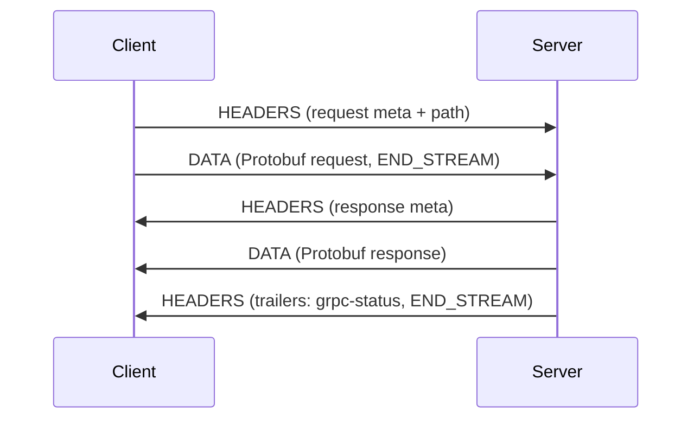
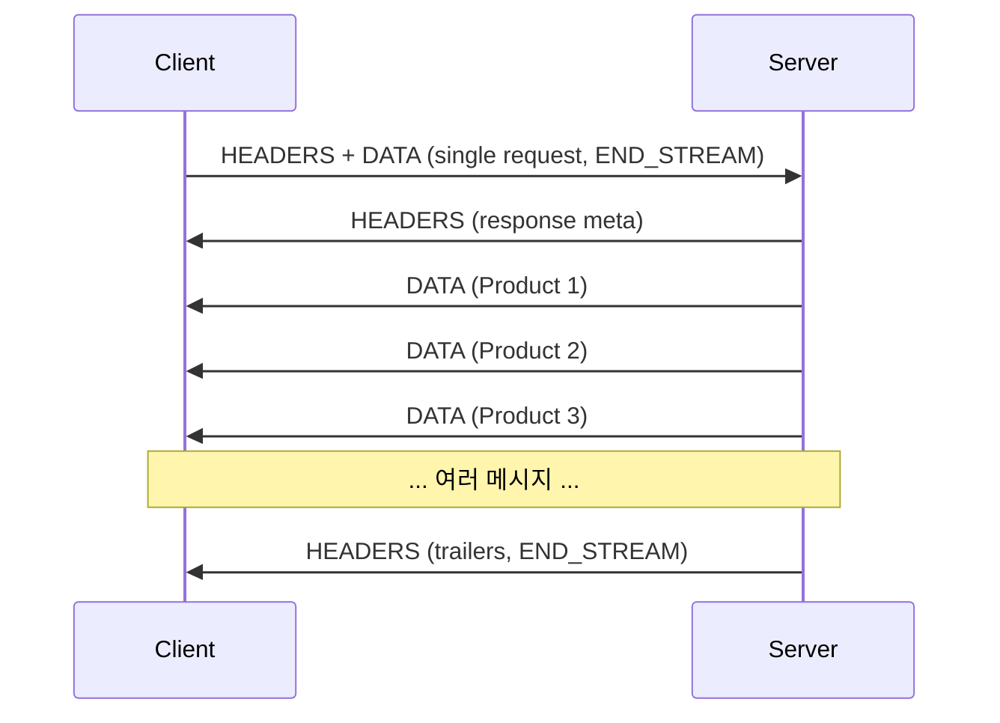
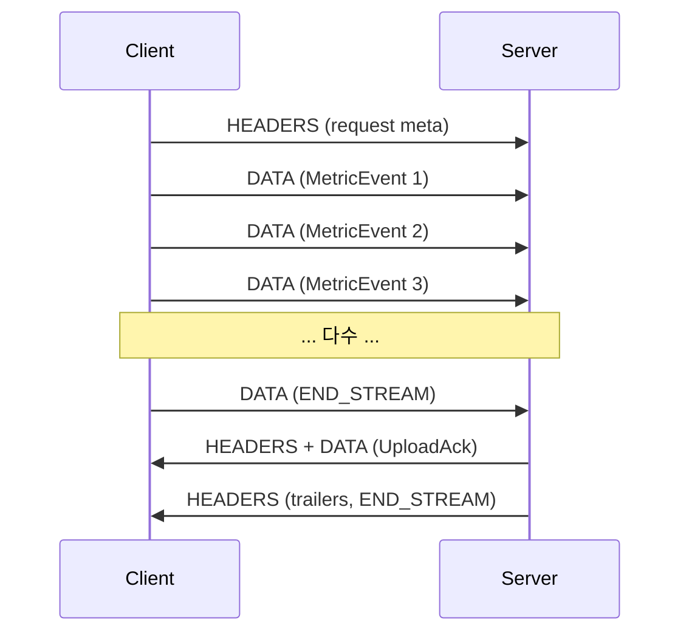
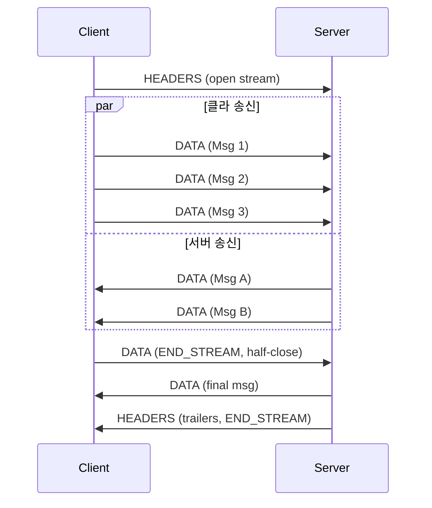

# 04. gRPC 4가지 호출 패턴

## 1. 4 패턴이 가능한 이유

HTTP/2 의 stream 은 **양방향 frame 흐름** 이다 (#06 참조). 이 위에서 gRPC 는 4가지 RPC 형태를 자연스럽게 표현한다.

```
요청 1 → 응답 1            : Unary
요청 1 → 응답 N (stream)   : Server-streaming
요청 N (stream) → 응답 1   : Client-streaming
요청 N → 응답 M (양방향)   : Bidirectional streaming
```

각 패턴은 **proto 의 `stream` 키워드 위치** 로 결정된다.

```protobuf
service Demo {
  rpc Unary(Req) returns (Resp);                  // 1:1
  rpc ServerStream(Req) returns (stream Resp);    // 1:N
  rpc ClientStream(stream Req) returns (Resp);    // N:1
  rpc BidiStream(stream Req) returns (stream Resp); // N:M
}
```

## 2. Unary (1:1) — 가장 흔한 패턴

REST 의 GET/POST 와 가장 비슷. 90% 이상의 RPC 가 이 형태.

```protobuf
service ProductService {
  rpc GetProduct(GetProductRequest) returns (GetProductResponse);
}
```

```kotlin
// 클라이언트 (coroutine stub)
val response: GetProductResponse = stub
    .withDeadlineAfter(500, TimeUnit.MILLISECONDS)
    .getProduct(GetProductRequest.newBuilder().setId(123).build())
```



특징:
- 클라가 1개 메시지 송신 후 stream half-close
- 서버가 응답 + trailers (grpc-status) 송신 후 종료
- **Deadline / Cancellation 둘 다 자연스럽게 동작**
- 가장 간단하고 가장 안정적 — 새 시스템은 여기서 시작

**msa 적용 후보**: gateway → auth (토큰 검증), order → product (상품 조회), order → inventory (재고 확인)

## 3. Server-streaming (1:N) — 한 요청에 여러 응답

```protobuf
service SearchService {
  rpc SearchProducts(SearchRequest) returns (stream Product);
}
```

```kotlin
// 클라이언트 (coroutine: Flow 반환)
stub.searchProducts(searchRequest).collect { product ->
    log.info("hit: {}", product.id)
}
```



특징:
- 클라는 1개 메시지 → 즉시 stream half-close
- 서버는 N 개 메시지 송신 후 trailers 로 종료
- HTTP/2 flow control 로 백프레셔 자동 (서버가 너무 빠르면 WINDOW_UPDATE 대기)
- **클라가 도중에 cancel 하면 서버 측에 통보됨** (REST/SSE 보다 강력)

**적용 시나리오**:
- 실시간 시세 push (코인 / 주식 차트)
- 검색 결과 페이지네이션 (cursor 기반보다 단순)
- 로그 / 메트릭 tail
- 알림 push (notification feed)

**REST 대안 비교**:
- SSE (Server-Sent Events) — 텍스트 기반, 단방향, 표준 HTTP, gRPC 보다 도구 친화적
- WebSocket — 양방향, 그러나 schema 없음
- Long polling — 비효율, 레거시

→ schema 가 강하게 필요하고 백엔드 간이면 gRPC server-stream, 브라우저 직결이면 SSE 도 검토.

## 4. Client-streaming (N:1) — 다수 요청 1개 응답

```protobuf
service AnalyticsService {
  rpc UploadMetrics(stream MetricEvent) returns (UploadAck);
}
```

```kotlin
// 클라이언트
val ack: UploadAck = stub.uploadMetrics(
    flow {
        repeat(1000) { i ->
            emit(MetricEvent.newBuilder().setSeq(i).setValue(measure()).build())
        }
    }
)
```



특징:
- 클라가 stream 으로 N 개 송신 → END_STREAM 후 서버가 단일 응답
- 서버가 *모든 요청을 받은 후 처리* 가능 (배치)
- **flow control 로 클라 측 백프레셔** (서버가 처리 못 하면 클라가 자연스레 대기)

**적용 시나리오**:
- 파일 업로드 chunk
- 메트릭 / 로그 배치 전송
- 센서 데이터 수집

**REST 대안 비교**:
- Multipart upload (S3) — 청크 업로드 표준, 그러나 schema 없음
- Chunked transfer encoding — HTTP/1.1 에서 흔함, 그러나 single message 가정

## 5. Bidirectional streaming (N:M) — 양방향

```protobuf
service ChatService {
  rpc Chat(stream ChatMessage) returns (stream ChatMessage);
}
```

```kotlin
// 클라이언트
val incoming: Flow<ChatMessage> = stub.chat(
    flow {
        emit(joinMessage())
        userInput.collect { input -> emit(input) }
    }
)
incoming.collect { msg -> renderToUI(msg) }
```



특징:
- 가장 강력하지만 가장 복잡 (양쪽 모두 송수신 동시)
- HTTP/2 의 multiplexing 위에 단일 stream 이 양방향 흐름 보유
- **half-close** 가능 (한쪽이 송신 종료해도 반대 방향 계속 가능)
- 서버 / 클라 둘 다 cancel 가능
- 디버깅 / 테스트 비용이 가장 높음

**적용 시나리오**:
- 실시간 채팅
- 협업 편집 (Google Docs 류)
- 트레이딩 호가창 / 주문 (Order book updates + order placements)
- 게임 / IoT remote control

**msa 의 위치**: 현재 매칭되는 핫패스 없음. 도입 시 가장 보수적으로 접근.

## 6. 호출 패턴 선택 가이드

```
질문 1: 클라가 N 개 메시지를 보내야 하는가?
   ├─ Yes ─ 질문 2: 서버가 N 개 메시지를 보내야 하는가?
   │           ├─ Yes ─ Bidi
   │           └─ No  ─ Client-streaming
   └─ No  ─ 질문 2': 서버가 N 개 메시지를 보내야 하는가?
               ├─ Yes ─ Server-streaming
               └─ No  ─ Unary
```

**의심스러우면 Unary**. streaming 패턴은:
- 디버깅 도구 부족 (curl 불가, grpcurl 도 streaming 표시 제한)
- LB / proxy 통과가 까다로움 (HTTP/2 LB 가 long-lived stream 처리)
- 재시도 의미 모호 (어디서부터 재전송?)
- 메모리 누수 위험 (stream close 누락)

→ streaming 의 *순수 이득* 이 명확할 때만 채택.

## 7. 4 패턴 vs 등가 REST 대안

| gRPC 패턴 | 가장 가까운 REST | 비교 |
|---|---|---|
| Unary | GET/POST | 거의 동일, gRPC 가 schema + deadline propagation 우위 |
| Server-streaming | SSE / chunked response | SSE 가 브라우저 친화, gRPC 가 schema 우위 |
| Client-streaming | Multipart upload | 의미는 비슷, gRPC 가 메시지 단위 명확 |
| Bidi | WebSocket | WebSocket 은 schema 없음, gRPC 가 강하게 우위 |

## 8. Cancellation 의 의미

4 패턴 모두 **클라 또는 서버가 stream 을 cancel** 가능:

```kotlin
// 클라이언트 측 cancel
val deferred = scope.async { stub.chat(myFlow).collect { ... } }
deferred.cancel()   // → HTTP/2 RST_STREAM 송신 → 서버에서 인지

// 서버 측 cancel (예: deadline 임박, 인증 실패)
throw StatusException(Status.DEADLINE_EXCEEDED)
```

REST 와의 차이:
- REST 의 서버 측은 클라가 끊었는지 즉시 모름 (TCP RST 까지 기다림)
- gRPC 는 RST_STREAM frame 이 즉각 통보
- → **장기 streaming 에서 리소스 회수가 깔끔**

## 9. msa 매핑 (가상)

| msa 호출 | 현재 (REST) | gRPC 시 패턴 | 비고 |
|---|---|---|---|
| order → product (조회) | GET /products/{id} | Unary | 명확한 후보 |
| order → payment | POST /payments | Unary | |
| auth → member (로그인 시) | POST /api/members/sso | Unary | |
| search-batch → product (인덱싱) | GET /api/products?page=N | **Server-streaming** 후보 | 페이지네이션 단순화 |
| analytics ← metric 수집 | (Kafka 사용 중) | (Client-streaming 가능) | Kafka 가 더 적합 — 영속성 / 재처리 |
| quant → 시세 (Bithumb) | WebSocket / REST 폴링 | (외부 API 라 우리 선택 X) | |

**Kafka 와 streaming 의 역할 구분** → [16-grpc-vs-kafka.md](16-grpc-vs-kafka.md).

## 10. 흔한 실수

| 실수 | 결과 |
|---|---|
| 모든 호출을 streaming 으로 | LB / 디버깅 / retry 가 어려워짐, Unary 로 충분한 경우 손실 |
| Server-streaming 의 종료 누락 | 서버 측 메모리 누수, 클라 무한 대기 |
| Bidi 에서 cancellation 처리 누락 | goroutine / coroutine 누수 |
| streaming 메시지 사이에 큰 압축 | flow control 위반 (window 초과) |
| streaming 으로 영속 메시지 전달 | 재처리 / replay 불가 → Kafka 로 대체 |

## 다음 학습

- [05-codegen-stubs.md](05-codegen-stubs.md) — Kotlin / Java 의 stub 생성
- [06-http2-deep-dive.md](06-http2-deep-dive.md) — HTTP/2 의 stream / multiplexing 실체
- [09-advanced-features.md](09-advanced-features.md) — Deadline / Cancellation 전파
