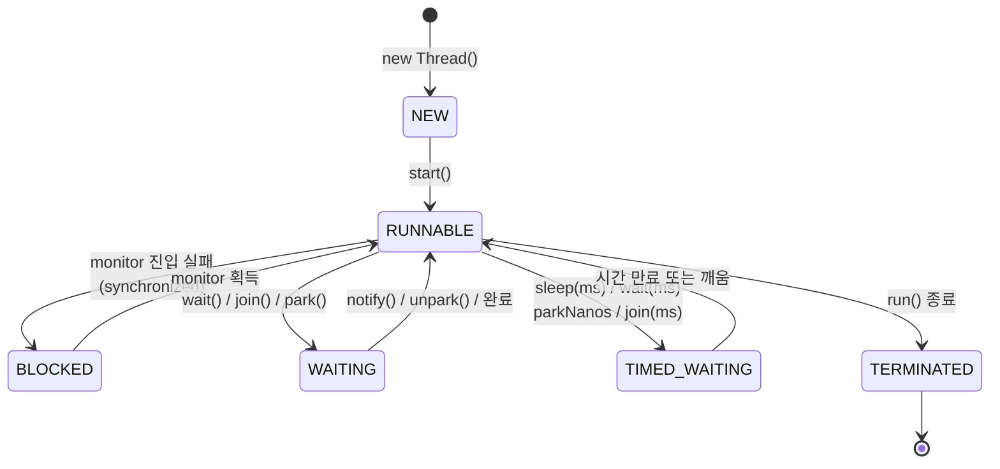

# 01. Thread 생명주기 + Runnable/Callable

## 핵심 한 줄

JVM 스레드는 **6개 상태**(`Thread.State` enum) 사이를 전이하며, 각 상태는 thread dump 진단의 1차 신호다. `RUNNABLE` 이라고 무조건 CPU 쓰는 건 아니고, `BLOCKED` 와 `WAITING` 은 다른 의미다.

## 스레드 상태 6개 (`java.lang.Thread.State`)



| 상태 | 설명 | thread dump 단서 |
|---|---|---|
| `NEW` | `new Thread()` 직후, `start()` 전 | dump 에 거의 등장 안 함 |
| `RUNNABLE` | 실행 가능 — JVM 입장. **OS 입장에선 IO 대기 중일 수도 있음** | `at sun.nio.ch.Net.poll(...)` 같은 native IO 도 RUNNABLE |
| `BLOCKED` | `synchronized` 진입 대기 (monitor 획득 실패) | `- waiting to lock <0x...>` |
| `WAITING` | 시간 무제한 대기 — `Object.wait()` / `Thread.join()` / `LockSupport.park()` | `- parking to wait for <0x...>` |
| `TIMED_WAITING` | 시간 제한 대기 — `sleep(ms)`, `wait(ms)`, `join(ms)`, `parkNanos` | `at java.lang.Thread.sleep0(...)` |
| `TERMINATED` | `run()` 정상 종료 또는 예외 종료 | dump 에 보통 안 보임 |

### 흔한 함정

- **`RUNNABLE` 이 곧 CPU 사용 아님** — Selector/epoll 대기, blocking socket read 도 JVM 은 `RUNNABLE` 로 본다. CPU profile 떠야 진짜 CPU bound 인지 가린다.
- **`BLOCKED` vs `WAITING`** — `BLOCKED` 는 `synchronized` 진입 못 한 상태 (monitor 경쟁). `WAITING` 은 명시적으로 자기가 대기 (조건 신호 기다림). 진단 접근이 다르다 — `BLOCKED` 는 누가 락 잡고 있나, `WAITING` 은 누가 깨워줘야 하나.
- **lock 안에서 `wait()` 부르면** — monitor *놓고* `WAITING` 진입. `BLOCKED` 아님.

## Runnable vs Callable vs Thread

| 인터페이스 | 시그니처 | 반환값 | 예외 |
|---|---|---|---|
| `Runnable` | `void run()` | 없음 | unchecked 만 (`RuntimeException`) |
| `Callable<V>` | `V call()` | `V` | checked 가능 (`throws Exception`) |
| `Thread` | extends, `run()` 오버라이드 | 없음 | unchecked 만 |

```java
// 1) Runnable (Java)
Thread t = new Thread(() -> System.out.println("hi"));
t.start();

// 2) Callable + ExecutorService
ExecutorService exec = Executors.newFixedThreadPool(4);
Future<Integer> f = exec.submit(() -> {
    Thread.sleep(100);
    return 42;
});
int result = f.get();  // blocking, checked InterruptedException + ExecutionException

// 3) Java 21+ — Virtual Thread
Thread vt = Thread.ofVirtual().start(() -> System.out.println("hi"));
// 또는 Thread.startVirtualThread(Runnable)
```

```kotlin
// Kotlin 에선 Thread { ... } 람다 한 줄
Thread { println("hi") }.start()

// JDK 25 + Spring Boot 3.2+ : application.yml
// spring.threads.virtual.enabled: true
// → Tomcat worker / @Async / @Scheduled 가 자동으로 Virtual Thread 위에서 동작
```

### `Thread` 직접 상속을 안 하는 이유

1. **단일 상속 제약** — Java 는 단일 상속이라 `Thread` 상속하면 다른 클래스 못 받음.
2. **관심사 분리** — "할 일" (Runnable) 과 "실행 컨텍스트" (Thread/Executor) 를 분리해야 풀에서 재사용 가능.
3. **Executor 표준** — 실무는 거의 100% `ExecutorService` 사용. `new Thread()` 는 학습용 또는 special-case.

## Daemon Thread

- **Daemon** 은 JVM 종료 조건에서 제외되는 스레드. 모든 non-daemon 스레드가 끝나면 JVM 도 종료, daemon 스레드는 강제로 죽는다.
- 용도: GC, Finalizer, 모니터링 워커 등 "일하는 스레드 다 끝나면 같이 죽어도 되는" 백그라운드.
- `t.setDaemon(true)` 는 `start()` 전에 호출. 시작 후엔 `IllegalThreadStateException`.
- **함정**: daemon 안에서 `try-finally` 의 cleanup 이 보장되지 않을 수 있음 (JVM 강제 종료). 중요 cleanup 은 `Runtime.addShutdownHook` 로.

```kotlin
val daemon = Thread {
    while (true) {
        try {
            // metric 수집
            Thread.sleep(5000)
        } catch (e: InterruptedException) {
            return@Thread
        }
    }
}.apply { isDaemon = true }
daemon.start()
```

## 스레드 우선순위 (`Thread.priority`)

- 1 (`MIN_PRIORITY`) ~ 10 (`MAX_PRIORITY`), 기본 5.
- **실무에서 거의 신경 안 씀** — JVM 이 OS 스케줄러에 힌트만 주고, OS 마다 처리가 다르다 (Linux 는 거의 무시).
- 면접에선 "있긴 한데 OS 의존이라 실무에선 거의 활용 안 한다" 정도로 답하면 됨.

## 인터럽트 — 스레드 멈추는 정공법

`Thread.stop()` / `Thread.suspend()` 는 deprecated (락을 들고 죽으면 데이터 깨짐). 정공법은 **interrupt**.

```kotlin
val worker = Thread {
    while (!Thread.currentThread().isInterrupted) {
        try {
            doWork()
            Thread.sleep(100)
        } catch (e: InterruptedException) {
            // sleep 중 interrupt 시 flag 가 *clear* 됨 → 직접 set
            Thread.currentThread().interrupt()
            break
        }
    }
}
worker.start()
// ... 나중에
worker.interrupt()
```

### 인터럽트 처리 규칙 3가지

1. **`InterruptedException` 받으면** — 둘 중 하나:
   - throw 위로 (가능하면 이게 정답)
   - flag 복원: `Thread.currentThread().interrupt()` 후 종료 처리
2. **`InterruptedException` 을 swallow 하지 마라** — 가장 흔한 안티패턴. 상위 코드가 취소 신호를 못 받음.
3. **blocking IO 는 interrupt 가 안 듣는 경우가 많다** — `Socket.read()` 는 `Thread.interrupt()` 로 안 깨어남. `Socket.close()` 또는 `InterruptibleChannel` 필요.

## Kotlin coroutine 의 인터럽트

코루틴은 `cancel()` 로 취소하고, suspend 함수는 `CancellationException` 을 자동 throw 한다. 단 **CPU bound 코드는 `yield()` 또는 `ensureActive()` 를 명시적으로 호출**해야 취소 신호를 받는다.

```kotlin
val job = scope.launch {
    while (isActive) {           // 또는 ensureActive()
        heavyComputation()
        yield()                  // 협력적 취소 지점
    }
}
delay(1000)
job.cancel()                     // CancellationException 발생 + suspend 함수에서 throw
```

## ThreadGroup — 무시해도 되는 레거시

`ThreadGroup` 은 1.0 시절 보안 격리용으로 도입됐으나 거의 모든 메서드가 deprecated. 대안은 `Executor` 와 `ThreadFactory`.

## 실무 패턴: Custom ThreadFactory + 이름 부여

thread dump 분석에서 스레드 이름이 곧 가독성. 항상 의미 있는 이름을 부여.

```kotlin
import java.util.concurrent.Executors
import java.util.concurrent.atomic.AtomicInteger

val factory = object : java.util.concurrent.ThreadFactory {
    private val counter = AtomicInteger(0)
    override fun newThread(r: Runnable): Thread {
        val t = Thread(r, "kafka-relay-worker-${counter.incrementAndGet()}")
        t.isDaemon = true
        t.uncaughtExceptionHandler = Thread.UncaughtExceptionHandler { _, e ->
            log.error(e) { "uncaught exception in $t.name" }
        }
        return t
    }
}
val pool = Executors.newFixedThreadPool(4, factory)
```

이렇게 두면 jstack 출력에서 `"kafka-relay-worker-3"` 라는 이름으로 잡혀 풀별 식별이 쉬워진다.

## 스레드 생성 비용 — 왜 풀이 필요한가

- 플랫폼 스레드 한 개 = OS 스레드 한 개 + JVM 스택 (기본 1MB) + 커널 자료구조.
- 1만 개 만들면 **스택만 10GB**, 커널 컨텍스트 스위칭 비용도 폭증.
- 그래서 풀 (Executor) 로 재사용하거나, 더 가벼운 추상 (coroutine, virtual thread) 으로 우회.

| 추상 | 1개 비용 (대략) | 1만 개 가능? |
|---|---|---|
| 플랫폼 스레드 | 1MB 스택 + OS 자원 | 메모리/스위치 비용 큼, 비현실 |
| Virtual Thread | ~수백 B 힙 | OK (수만 ~ 수십만) |
| Coroutine | ~수십 B 힙 | OK (수십만 ~ 수백만) |

## 면접 단골

**Q. `Thread.sleep()` 과 `Object.wait()` 차이?**

`sleep` 은 monitor 를 *안 놓는다*. `wait` 은 monitor 를 *놓고* 대기한다. 그래서 `wait` 은 반드시 `synchronized` 안에서만 호출 가능. `sleep` 은 어디서나 가능. 깨우는 방식도 다르다 — `sleep` 은 시간 만료 또는 interrupt, `wait` 은 `notify`/`notifyAll`/시간만료/interrupt.

**Q. `Thread.yield()` 가 뭐고 언제 쓰나?**

현재 스레드가 OS 스케줄러에 "내 자리 다른 스레드한테 양보해도 됨" 힌트를 주는 것. 강제력은 없고, 운영체제마다 처리가 다르다. 실무에서 거의 안 쓰고, busy-wait loop 에서 lock contention 줄이려는 미세 최적화에서나 등장. 코루틴의 `yield()` 와 이름만 같지 의미 다름 (코루틴 yield 는 협력적 취소 지점).

**Q. JDK 25 의 Virtual Thread 와 플랫폼 스레드는 어떻게 골라 쓰나?**

blocking IO (HTTP, JDBC, Kafka) 가 많고 동시성이 수천 이상이면 Virtual Thread 우위. CPU bound 작업, 또는 native call/synchronized 비중이 높은 코드면 플랫폼 스레드/Fork-Join 이 낫다. msa 의 일반 MVC 서비스는 `spring.threads.virtual.enabled=true` 로 켜면 거의 무료로 동시성 향상 (자세한 건 [17-virtual-threads.md](17-virtual-threads.md)).

## 다음 학습

- [02-synchronized-monitor.md](02-synchronized-monitor.md) — `synchronized` 와 monitor 패턴
- [20-thread-dump-analysis.md](20-thread-dump-analysis.md) — 상태별 진단 (이 파일과 직결)
